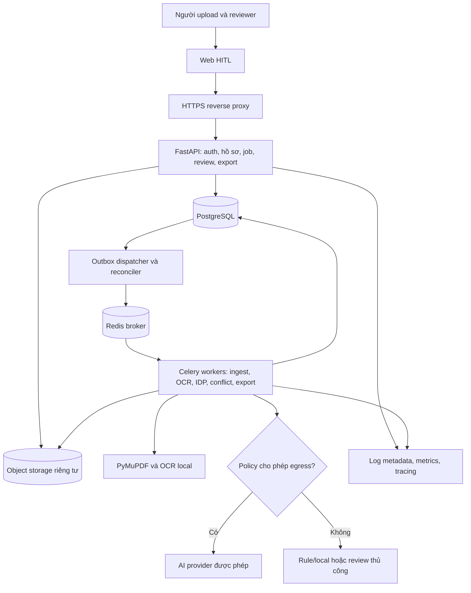
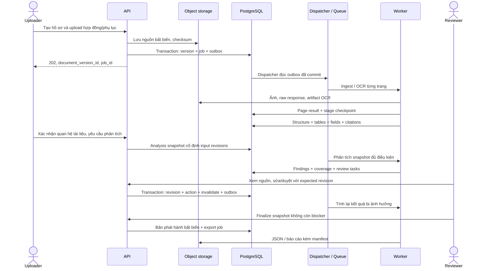
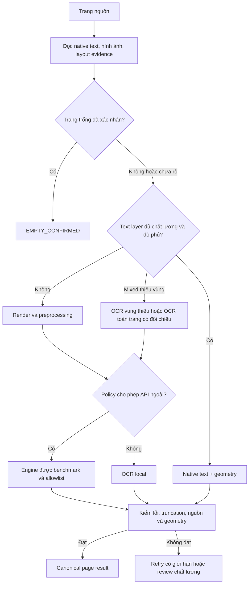
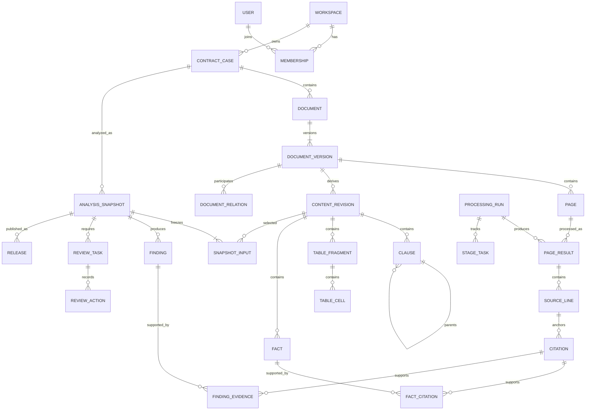

# DOC-04 — Kiến trúc hệ thống Contract Intelligence

> Ghi chú khi đưa vào monorepo: đây là phương án kiến trúc đề xuất từ OCR lab. [DOC-04 hiện có của nhóm](../docs/DOC-04-architecture.md) chọn backend Java/Spring Boot và AI service Python riêng; phương án FastAPI/modular monolith trong tài liệu này chưa thay thế quyết định đó. Nhóm và Mentor cần đối chiếu trước khi chốt. Các đường dẫn code bên dưới tính từ `ai-service/`.

| Thuộc tính | Nội dung |
|---|---|
| Dự án | Contract Intelligence — PROD-01, VSF OJT Batch 3 |
| Thời gian dự án | 11/09/2026–18/10/2026 |
| Phiên bản tài liệu | 0.2 — Đề xuất để Mentor review |
| Ngày cập nhật | 16/09/2026 |
| Owner sản phẩm | Trần Thị Kiều Trang — Team Leader / Frontend Engineer |
| Người cùng review | Nguyễn Đức Dũng, Trần Văn Dũng — AI; Phạm Hoàng Chương — Backend |
| Phạm vi | Kiến trúc đích cho OCR, IDP, trích dẫn, phát hiện xung đột và HITL |
| Phê duyệt | Chưa có bằng chứng Mentor phê duyệt; không coi tài liệu này là quyết định đã chốt |

> Đây là bản thiết kế, không phải báo cáo các tính năng đã triển khai. Các lựa chọn công nghệ, giới hạn và KPI bên dưới là đề xuất cần xác nhận bằng benchmark và review. Theo Way of Working, nhóm phải được Mentor review giải pháp, kiến trúc và project structure trước khi triển khai phần sản phẩm tương ứng.

## Mục lục

1. [Mục tiêu, người dùng và phạm vi](#1-mục-tiêu-người-dùng-và-phạm-vi)
2. [Căn cứ và hiện trạng](#2-căn-cứ-và-hiện-trạng)
3. [Nguyên tắc và quyết định kiến trúc](#3-nguyên-tắc-và-quyết-định-kiến-trúc)
4. [Thành phần hệ thống](#4-thành-phần-hệ-thống)
5. [Luồng dữ liệu đầu cuối](#5-luồng-dữ-liệu-đầu-cuối)
6. [Ingestion và quản lý bộ hợp đồng](#6-ingestion-và-quản-lý-bộ-hợp-đồng)
7. [Phân loại trang, OCR và chuẩn hóa](#7-phân-loại-trang-ocr-và-chuẩn-hóa)
8. [Bóc tách cấu trúc và bảng](#8-bóc-tách-cấu-trúc-và-bảng)
9. [Trích xuất giá trị và trích dẫn](#9-trích-xuất-giá-trị-và-trích-dẫn)
10. [Phát hiện xung đột](#10-phát-hiện-xung-đột)
11. [HITL và quản lý thay đổi](#11-hitl-và-quản-lý-thay-đổi)
12. [Mô hình dữ liệu và lưu trữ](#12-mô-hình-dữ-liệu-và-lưu-trữ)
13. [Job, retry và tính nhất quán](#13-job-retry-và-tính-nhất-quán)
14. [Hợp đồng API](#14-hợp-đồng-api)
15. [Bảo mật và vòng đời dữ liệu](#15-bảo-mật-và-vòng-đời-dữ-liệu)
16. [Triển khai, vận hành và chi phí](#16-triển-khai-vận-hành-và-chi-phí)
17. [Đánh giá và nghiệm thu](#17-đánh-giá-và-nghiệm-thu)
18. [Cấu trúc code và kế hoạch triển khai](#18-cấu-trúc-code-và-kế-hoạch-triển-khai)
19. [Quyết định cần Mentor xác nhận](#19-quyết-định-cần-mentor-xác-nhận)
20. [Nguồn tham khảo](#20-nguồn-tham-khảo)

## 1. Mục tiêu, người dùng và phạm vi

### 1.1 Bài toán và giá trị

Hợp đồng và phụ lục thường ở nhiều file, nhiều phiên bản, có scan mờ, bảng kéo dài qua nhiều trang và điều khoản tham chiếu lẫn nhau. Việc tìm số tiền, điều kiện thanh toán, thời hạn hoặc đối chiếu phụ lục bằng tay tốn thời gian; một kết quả OCR đọc được vẫn có thể sai dấu, mất dòng hoặc đổi nghĩa của số liệu.

Sản phẩm hỗ trợ người dùng đi từ tài liệu nguồn đến dữ liệu có cấu trúc, mỗi kết quả có bằng chứng và có người chịu trách nhiệm duyệt. Giá trị cần đo là giảm thời gian review, tăng khả năng tìm đúng nguồn và phát hiện các khác biệt đáng kiểm tra. Không đo thành công chỉ bằng số trang OCR hoặc số cảnh báo được tạo.

### 1.2 Người dùng và quyền

| Vai trò | Nhu cầu | Quyền sản phẩm đề xuất |
|---|---|---|
| Người phụ trách hợp đồng | Upload hợp đồng và phụ lục, theo dõi xử lý | Tạo hồ sơ, bổ sung phiên bản, xem hồ sơ được cấp quyền |
| Reviewer nghiệp vụ/pháp chế | Kiểm tra trường dữ liệu, nguồn, xung đột | Nhận task, sửa và duyệt kết quả trong hồ sơ được phân công |
| Project admin | Quản lý thành viên, policy xử lý, vận hành | Phân quyền, cấu hình và xử lý job; không mặc nhiên được sửa quyết định nghiệp vụ |
| Mentor | Đánh giá giải pháp và demo | Quyền đọc bộ dữ liệu demo đã được phép sử dụng |

Vai trò trong đội phát triển không tự động là vai trò truy cập dữ liệu trong sản phẩm. MVP một workspace vẫn kiểm tra quyền trên từng hồ sơ.

### 1.3 Phạm vi MVP và ngoài phạm vi

**Trong MVP:** PDF có text, PDF scan, PDF hỗn hợp; ảnh PNG/JPEG; tiếng Việt/Anh; Điều → Khoản → Điểm; bảng phụ lục cơ bản; trích giá trị kèm nguồn; xung đột nội bộ và hợp đồng–phụ lục trong cùng hồ sơ; HITL; xuất JSON và báo cáo review có phiên bản.

**Giới hạn đề xuất:** 50 MiB/file, 100 trang/file, 300 trang/hồ sơ; bảng phức tạp và chữ viết tay có thể chuyển sang review thủ công. Giới hạn này là đầu vào capacity test, chưa phải năng lực đã đo. TIFF nhiều frame, DOCX, email và ZIP chưa nhận trong MVP; cần đặc tả riêng nếu bổ sung.

**Ngoài phạm vi đợt OJT:** tư vấn hoặc kết luận pháp lý tự động; xác thực chữ ký/con dấu; ký điện tử; tự soạn/đàm phán hợp đồng; chatbot hỏi đáp tổng quát; tìm kiếm xuyên kho doanh nghiệp; huấn luyện foundation model; tự sửa tài liệu gốc; triển khai đa vùng hoặc cam kết SLA doanh nghiệp.

Không tìm thấy xung đột không đồng nghĩa hợp đồng hợp lệ. Kết quả chỉ phản ánh các quy tắc, tài liệu, phiên bản và phần dữ liệu hệ thống đã phân tích.

## 2. Căn cứ và hiện trạng

### 2.1 Thứ tự ưu tiên nguồn

1. Brief dự án và Way of Working người dùng cung cấp.
2. Code và schema hiện có để xác định năng lực thực tế.
3. Tài liệu nội bộ để hiểu ý định, nhưng phải đối chiếu code khi có khác biệt.
4. Tài liệu chính thức của thư viện và OWASP để hỗ trợ quyết định kỹ thuật.

Chưa được cung cấp bản Product Vision, BRD, PRD, API Spec đã duyệt, policy dữ liệu khách hàng hoặc kết quả benchmark đại diện được xác nhận. Không giả định đã đọc các tài liệu đó. Không đọc `.env` hoặc sử dụng hợp đồng riêng ngoài workspace để soạn tài liệu này.

### 2.2 Phân biệt hiện có và đề xuất

| Hạng mục | Bằng chứng trong workspace | Kiến trúc đích |
|---|---|---|
| OCR pipeline | `ProcessDocument`, classifier, preprocessing, adapter native/local/API | Tái sử dụng sau port; bổ sung stage theo trang, checkpoint và policy |
| Schema OCR | `Document/Page/Line/Word`, schema 1.0 | Giữ tương thích; thêm envelope kết quả IDP có schema riêng |
| API thử nghiệm | FastAPI `/api/engines`, `/api/ocr` | REST có auth, upload bền vững, job bất đồng bộ, review |
| Lưu trữ | File tạm cho web, artifact local cho benchmark | PostgreSQL và object storage riêng tư |
| Giao diện | HTML thử nghiệm | Web HITL với nguồn và kết quả song song |
| Xử lý đồng thời | Web có khóa `_process_lock`; API OCR ngoài tối đa 4 trang đồng thời | Worker độc lập với HTTP, giới hạn theo tài nguyên/provider |
| Citation geometry | Native/Paddle có geometry theo khả năng adapter; Vision hiện trả dòng text | Citation nhiều mức, tuyệt đối không tạo bbox giả |
| IDP, conflict, review | Chưa thấy module sản phẩm tương ứng | Các module mới phải qua review kiến trúc |

Các điểm lệch cần biết:

- `docs/ARCHITECTURE.md` mô tả baseline Sprint 1, có câu chưa có service/API ngoài; code hiện đã có test API và adapter ngoài. Không dùng câu đó để kết luận tình trạng hiện tại.
- `docs/CONTRACT_INTELLIGENCE_ARCHITECTURE.md` là bản đề xuất cũ, ghi đã chọn Luna và có ước lượng giá/tốc độ. Chưa có bằng chứng phê duyệt hoặc benchmark tương ứng trong các nguồn đã xem; bản này không kế thừa chúng thành sự thật.
- `openai_vision_ocr.py` hiện mặc định chuỗi model `gpt-5.6-terra`, trả text thành các `Line`, không cung cấp bbox/confidence và chưa kiểm tra rõ kết thúc do giới hạn output. Tên model trong code không xác nhận availability, giá hoặc chất lượng dịch vụ.
- `docs/VALIDATION.md` ghi kiểm thử phần mềm và smoke synthetic ở thời điểm viết; không phải bằng chứng chất lượng tất cả engine hiện tại. Tài liệu này không tuyên bố đã chạy lại các test đó.

`architecture.md` này là đề xuất tổng hợp mới cho DOC-04. Hai tài liệu cũ được giữ để truy nguyên; sau review, Team Leader ghi rõ phiên bản được Mentor phê duyệt vào tracker để tránh có nhiều bản “chính thức”.

## 3. Nguyên tắc và quyết định kiến trúc

### 3.1 Các bất biến

1. File nguồn là bất biến; upload thay thế tạo phiên bản mới, không ghi đè.
2. Kết quả máy, bản sửa của người và bản phát hành là các lớp dữ liệu khác nhau.
3. Mọi giá trị được chấp nhận phải có nguồn kiểm chứng; thiếu nguồn thì chuyển review.
4. Không suy ra bbox, confidence hoặc nội dung không đọc được từ một prompt yêu cầu “chính xác”.
5. Một lần phân tích cố định danh sách phiên bản nguồn, phiên bản nội dung và cấu hình. Không trộn kết quả cũ/mới.
6. Policy gửi dữ liệu ra ngoài áp dụng cho cả ảnh, text, embedding và mọi bước AI, không chỉ OCR.
7. Stage có thể chạy lại, nhưng không tạo tác dụng nghiệp vụ trùng lặp.
8. Trang thiếu/lỗi phải hiện rõ trong coverage; không được biến mất khỏi báo cáo.
9. Người duyệt quyết định kết quả cuối; LLM chỉ đề xuất nhận định.

### 3.2 Quyết định đề xuất (ADR rút gọn)

| ID | Quyết định | Lý do / đánh đổi |
|---|---|---|
| ADR-01 | Modular monolith, một codebase; API và worker là các process/container riêng | Phù hợp 4 người, dùng chung domain và migration; tránh vận hành microservice |
| ADR-02 | PostgreSQL là nguồn trạng thái nghiệp vụ | Quan hệ, transaction, ràng buộc và lịch sử; JSONB chỉ dùng chỗ linh hoạt |
| ADR-03 | Object storage riêng tư lưu binary và artifact lớn | DB giữ metadata/checksum; cần xử lý nhất quán giữa hai kho |
| ADR-04 | Celery + Redis cho queue; DB giữ job, checkpoint, outbox | Có retry và worker riêng; cần idempotency/reconciler, không coi queue là sổ cái |
| ADR-05 | Native-first có kiểm tra chất lượng và độ phủ | Tiết kiệm OCR nhưng phải xử lý trang mixed và text-layer hỏng |
| ADR-06 | Rule-based trước, LLM cho trường hợp mơ hồ | Giảm chi phí, dễ giải thích; rule có phạm vi giới hạn |
| ADR-07 | Citation theo source span, geometry là tùy chọn có nguồn | Đáp ứng cả engine text-only; highlight vùng chính xác cần geometry thật |
| ADR-08 | Không cần vector DB trong MVP | Lọc theo field/topic, tham chiếu và từ khóa đủ để dựng baseline; thêm embedding khi đo được lợi ích |
| ADR-09 | Frontend React + TypeScript; polling job trước | Đủ cho review phức tạp; SSE là mở rộng, chưa cần WebSocket |
| ADR-10 | Chọn model theo benchmark, capability và policy | Adapter thay được không có nghĩa chất lượng khi đổi model vẫn giữ nguyên |

FastAPI mô tả các công cụ như Celery là lựa chọn cho tác vụ nặng chạy ngoài process ứng dụng. Vì vậy OCR/IDP không dùng `BackgroundTasks` trong HTTP process làm cơ chế xử lý bền vững. [Nguồn: FastAPI](https://fastapi.tiangolo.com/tutorial/background-tasks/)

## 4. Thành phần hệ thống



| Module | Trách nhiệm | Không chịu trách nhiệm |
|---|---|---|
| Identity & Access | User, membership, quyền hồ sơ, policy workspace | Suy luận nội dung hợp đồng |
| Contract Registry | Hồ sơ, tài liệu, phiên bản, quan hệ phụ lục | OCR |
| Ingestion | Kiểm tra file, lưu nguồn, tạo page manifest | Phê duyệt nghiệp vụ |
| OCR | Render, routing, nhận dạng, source lines và geometry | Tự sửa nghĩa hoặc quyết định xung đột |
| IDP | Cây điều khoản, bảng, field và citation | Thay thế văn bản nguồn |
| Conflict Analysis | Lọc cặp, kiểm tra ngữ cảnh, rule/LLM, coverage | Kết luận pháp lý cuối cùng |
| Review | Task, chỉnh sửa có revision, approve/reject | Ghi đè artifact máy |
| Export | Snapshot dữ liệu đã duyệt và nguồn | Tự động dùng phiên bản mới nhất không kiểm tra |
| Orchestration | DAG stage, job, retry, checkpoint, outbox | Chứa logic đọc hợp đồng |

Các module trên là ranh giới code, không phải yêu cầu triển khai thành chín service. Ban đầu dùng một worker CPU và một worker I/O; có thể chia queue khi đo được nghẽn.

## 5. Luồng dữ liệu đầu cuối



### 5.1 Dữ liệu qua từng stage

| Stage | Input | Output bền vững | Cổng kiểm tra |
|---|---|---|---|
| Ingest | File + quyền + metadata | DocumentVersion, checksum, Page manifest | File hợp lệ, giới hạn, policy |
| OCR | Trang + cấu hình + policy | Raw output, PageResult, SourceLine | Không rỗng bất thường, không bị cắt, coverage |
| Normalize | Dòng text nguyên bản | Text revision + offset mapping | Không mất liên kết nguồn |
| Structure | Text theo reading order | Clause tree, bảng/cell, reference | Parent hợp lệ, không cycle, span tồn tại |
| Extract | Clause, table, schema field | Fact + typed value + citation | Parse giá trị, kiểm nguồn, trạng thái thiếu/không rõ |
| Analyze | Snapshot hồ sơ + facts + clauses | Findings, candidate coverage | So sánh cùng ngữ cảnh, đủ hai phía nguồn |
| Review | Kết quả máy + nguồn | ReviewAction, revision, effective value | Quyền, revision hiện tại, lý do sửa |
| Finalize | Snapshot đã review | Release manifest, export checksum | Không stale, không blocker, đủ coverage |

Mỗi output có `schema_version`, `input_manifest_hash`, `pipeline_version`, `created_at`. Raw artifact và metadata nguồn được giữ đủ để giải thích một kết quả mà không cần gọi lại model.

## 6. Ingestion và quản lý bộ hợp đồng

### 6.1 Khái niệm nghiệp vụ

- **ContractCase:** hồ sơ chứa hợp đồng và các tài liệu liên quan.
- **Document:** danh tính logic của một tài liệu, ví dụ hợp đồng chính hoặc phụ lục 01.
- **DocumentVersion:** một file bất biến của Document; phiên bản file mới khác với việc sửa OCR.
- **ContentRevision:** phiên bản text/structure/facts đã qua máy hoặc người sửa của một DocumentVersion.
- **DocumentRelation:** quan hệ giữa các phiên bản, ví dụ `ATTACHMENT_OF`, `AMENDS`, `SUPERSEDES`; có scope, nguồn chứng minh và trạng thái xác nhận.
- **AnalysisSnapshot:** tập phiên bản và revision cụ thể được dùng để phân tích hồ sơ.

Một PDF có thể chứa cả hợp đồng và phụ lục: lưu các `DocumentSection` với khoảng trang/span thay vì nhân bản file. Việc cùng nằm trong PDF hoặc có tên “phụ lục” chỉ là gợi ý; quan hệ sửa đổi và ngày hiệu lực cần bằng chứng và review.

### 6.2 Quy trình upload

1. API xác thực user, kiểm tra quyền hồ sơ và quota.
2. Đọc upload theo stream, dừng khi vượt giới hạn; tính SHA-256 trong lúc đọc. Không đọc cả file không giới hạn vào RAM.
3. Kiểm extension allowlist, signature/MIME và khả năng parse; không tin tên file từ client. Tạo object key bằng ID máy chủ.
4. Đưa file vào vùng quarantine; malware scan và parser chạy trong worker bị giới hạn RAM/CPU/thời gian, không có quyền thực thi nội dung tài liệu.
5. PDF mã hóa cần mật khẩu, file hỏng, số trang/pixel vượt giới hạn: trả lý do hỗ trợ được, không tự giải mã hoặc bỏ qua trang.
6. Khi object đã lưu và xác nhận checksum, commit DocumentVersion + ProcessingRun + OutboxEvent trong cùng DB transaction.
7. Trả `202 Accepted`; không chờ OCR. Upload thành công nghĩa là đã nhận bền vững, không có nghĩa nội dung hợp lệ hay OCR thành công.
8. Worker ingest tạo manifest đủ trang, kích thước, rotation, page hash và trạng thái. File không đạt kiểm tra sau upload chuyển `REJECTED`, giữ audit metadata theo policy.

Thứ tự object trước/DB sau có thể tạo object mồ côi nếu DB lỗi; sweeper xóa object staging không được tham chiếu sau TTL. Nếu DB đã có bản ghi nhưng object thiếu, reconciler đánh dấu `SOURCE_UNAVAILABLE` và chặn downstream. Không giả định transaction nguyên tử xuyên DB và object store.

Kiểm nhiều lớp cho upload, dùng tên server sinh, lưu ngoài vùng public và giới hạn kích thước là các biện pháp phù hợp hướng dẫn OWASP. [Nguồn: File Upload Cheat Sheet](https://cheatsheetseries.owasp.org/cheatsheets/File_Upload_Cheat_Sheet.html)

### 6.3 Trùng lặp và liên kết

`Idempotency-Key` xử lý retry cùng request; SHA-256 phát hiện cùng file nhưng không thay thế idempotency của nghiệp vụ. Trong cùng workspace, API có thể gợi ý tái sử dụng phiên bản đã có; không tự hợp nhất hai hồ sơ. Không trả thông tin “file đã tồn tại” từ workspace khác. Tái sử dụng artifact vẫn kiểm tra policy và quyền hiện tại.

Khi người dùng thêm phụ lục mới, tạo snapshot phân tích mới. Bản phát hành cũ vẫn giữ nguyên với nhãn phiên bản; không âm thầm đổi các xung đột trong bản đã duyệt.

## 7. Phân loại trang, OCR và chuẩn hóa

### 7.1 Routing theo trang và vùng



Classifier hiện tại dùng tối thiểu 20 ký tự, 3 từ, một span; `MIXED` khi có text và image coverage ≥ 0.5. Đây là heuristic của spike, chưa đủ để kết luận không thiếu nội dung. Một header có text không chứng minh bảng scan bên dưới đã được đọc.

Bổ sung quality evidence: tỷ lệ ký tự thay thế/control, text rác, vùng ảnh lớn chưa được phủ, dòng trùng, thứ tự cột bất thường, phân bố text. Ngưỡng phải được hiệu chỉnh trên tập validation; không biến các tín hiệu này thành xác suất “đúng” nếu chưa hiệu chuẩn.

MVP có thể OCR toàn trang mixed đáng ngờ để đối chiếu, giữ một nguồn text chính sau reconciliation. Không nối native text và OCR toàn trang một cách cơ học vì sẽ lặp nội dung. Khi hai nguồn khác ở số tiền/ngày/điều khoản, tạo issue cho reviewer; không tự lấy chuỗi dài hơn.

PyMuPDF lưu ý thứ tự text trích xuất không luôn là thứ tự đọc; bảng cũng cần xử lý layout riêng. Điều này là cơ sở để giữ bước reading-order và table reconstruction độc lập với OCR. [Nguồn: PyMuPDF Text](https://pymupdf.readthedocs.io/en/latest/recipes-text.html)

### 7.2 Render và preprocessing

- Giữ PDF/ảnh nguồn nguyên bản; render ảnh trang trong hệ tọa độ displayed page.
- Bắt đầu thử nghiệm 200–300 DPI; tăng DPI/crop có điều kiện cho chữ nhỏ, không tăng vô hạn. Áp dụng trần tổng pixel và RAM mỗi task.
- Deskew, contrast, denoise, threshold chỉ bật theo profile đã đo. Không luôn threshold vì có thể làm mất dấu tiếng Việt, dấu chấm và chữ trên nền màu.
- Lưu `render_dpi`, kích thước ảnh, rotation và ma trận biến đổi. Bbox từ ảnh đã xử lý phải inverse-map về trang gốc trước khi normalize.
- Crop/tile cần lưu origin, scale, overlap; bỏ bản sao trong vùng overlap bằng ID/geometry và nội dung, không bỏ dòng lặp hợp lệ ở vị trí khác.
- Với bảng hoặc điều khoản chạy qua hai trang, giữ page boundary; việc nối nội dung được thực hiện ở IDP.

### 7.3 Adapter và chọn model

Port `OCREngine` trả text, line/word geometry nếu có, raw response reference, engine/model identity và quality flags. Không yêu cầu mọi engine đều trả đủ dữ liệu. Capability registry gồm `supports_geometry`, `supports_confidence`, `is_external`, ngôn ngữ và giới hạn input/output đã kiểm thử.

Không chốt Luna/Terra/Gemini từ tên gọi hoặc giá được ghi trong tài liệu cũ. Chọn primary và fallback bằng: CER/WER, critical-field accuracy, citation coverage, thời gian p50/p95, chi phí/trang và policy dữ liệu trên cùng dataset. Pin model revision nếu provider hỗ trợ; nếu không, ghi model ID thực tế và thời điểm chạy.

Quy tắc fallback:

- Transient error: retry cùng provider trong budget trước.
- Engine unavailable: chuyển engine đã được phép và đã kiểm thử; nếu không có thì `BLOCKED_ENGINE`.
- Không bao giờ fallback từ local sang external nếu policy cấm.
- API trả text rỗng, output bị cắt hoặc schema sai: không đánh dấu thành công. Lưu raw artifact, retry có giới hạn/crop phù hợp, sau đó review.
- Prompt yêu cầu `[illegible]` chỉ là hướng dẫn; quality gate và HITL vẫn bắt buộc.

### 7.4 Raw, normalized và corrected text

| Lớp | Được sửa? | Mục đích |
|---|---|---|
| Raw response / raw text | Không | Điều tra lỗi, audit model |
| Canonical source lines | Không trong cùng OCR run | Tham chiếu nguồn và offset ổn định |
| Normalized text revision | Tạo bản mới | Unicode NFC, whitespace, reading order cho parser |
| Human correction revision | Tạo bản mới | Sửa OCR hoặc cấu trúc có người chịu trách nhiệm |

Giữ mapping từ normalized span về raw line/span khi gộp dòng hoặc chuẩn hóa Unicode. Không sửa dấu tiếng Việt, dấu thập phân, dấu âm, số điều hoặc tên bên bằng heuristic không có bằng chứng. Search text có thể bỏ dấu để tìm kiếm nhưng không dùng bản bỏ dấu làm nguồn trích dẫn.

`confidence = null` nghĩa engine không cung cấp, không phải 0 hoặc 1. Lưu riêng `engine_confidence`, `quality_flags`, `validation_status` và `review_status`; không lấy trung bình tùy tiện để gọi là xác suất đúng.

### 7.5 Hệ tọa độ và tương thích schema

Schema OCR 1.0 hiện dùng bbox chuẩn hóa `[x0, y0, x1, y1]` trong `[0,1]`, gốc trên trái của trang ở hướng hiển thị; rotation đã được áp dụng. FE nhân theo kích thước displayed page, không xoay thêm lần nữa. Trang FAILED với kích thước placeholder không dùng cho highlight.

Giữ `Document/Page/Line/Word` hiện có. Envelope sản phẩm v2 chứa ID phiên bản, run ID, artifact reference và các trạng thái bổ sung; không thêm field vào schema 1.0 rồi vẫn tuyên bố cùng contract. Public API không trả đường dẫn local `source_file`/`raw_output_path`; chuyển sang asset ID được kiểm quyền.

## 8. Bóc tách cấu trúc và bảng

### 8.1 Cây điều khoản

1. Phân loại block: heading, paragraph, list, table, header/footer, signature area.
2. Phát hiện header/footer lặp theo vị trí và nội dung giữa các trang; đánh dấu để loại khỏi nội dung phân tích nhưng vẫn giữ nguồn.
3. Regex/layout phát hiện `Điều 1`, `Article 1`, `1.1`, `a)`, tiêu đề chương và phụ lục. Một số tiền bắt đầu bằng “1.” không tự động là điều khoản.
4. Dựng cây theo numbering, indentation và ngữ cảnh; mỗi node có ID nội bộ, `label_raw`, `level`, `parent_id`, thứ tự, spans.
5. Nối đoạn tiếp diễn qua trang khi heading/numbering/layout phù hợp; node có thể có nhiều spans và nhiều trang.
6. Với ca mơ hồ, LLM nhận block IDs và nội dung có giới hạn; output chỉ được dùng IDs hợp lệ. Kiểm schema, parent cùng revision, không cycle và thứ tự hợp lệ.
7. Không tự renumber điều bị thiếu/trùng. Gắn `NUMBERING_GAP`, `DUPLICATE_LABEL` hoặc `STRUCTURE_AMBIGUOUS` để review.

Chunk theo boundary điều khoản và token budget, không chia cố định theo số ký tự. Mang theo heading cha, định nghĩa liên quan và overlap có source IDs; khi hợp nhất, deduplicate theo span. Điều khoản quá dài được chia segment cùng node cha, không tạo điều mới. Lưu phần không parse được dưới node `UNCLASSIFIED` thay vì bỏ mất.

Tham chiếu “theo khoản 2 Điều 5” được lưu thành `ClauseReference` gồm source span, target label, resolved target ID và resolution status. Có nhiều “Điều 5” trong các tài liệu thì phải dùng document scope; không gán ngẫu nhiên một target.

### 8.2 Bảng phụ lục

Mô hình bảng phải biểu diễn được `row_index`, `column_index`, `row_span`, `column_span`, `header_path`, `raw_text`, `typed_value`, `source_spans`, `bbox` nullable. Chỉ một chuỗi Markdown không đủ làm dữ liệu bảng chuẩn.

Quy trình:

1. Phát hiện vùng bảng từ đường kẻ/alignment hoặc layout model; tạo cell candidates.
2. OCR/nội suy cấu trúc từ nội dung và geometry; không bịa cell trống thành 0.
3. Xác định header nhiều cấp, đơn vị, currency, VAT và dòng tổng.
4. Nối bảng qua trang nếu header/schema cột và ngữ cảnh tiếp diễn khớp; giữ từng fragment và không tính header lặp như dữ liệu.
5. Chuẩn hóa kiểu từng cột với provenance; kiểm `quantity × unit_price`, tổng dòng, thuế và làm tròn theo quy tắc được cấu hình.
6. Sai số kiểm tra số học là `TABLE_ARITHMETIC_MISMATCH`; chưa kết luận xung đột nếu đơn vị, VAT hoặc điều kiện tính chưa rõ.

Nếu engine không có geometry, có thể đề xuất bảng từ text nhưng đánh dấu cấu trúc chưa xác minh. Bảng xoay, ô gộp phức tạp, thiếu đường kẻ hoặc mất hàng bắt buộc review. Không publish bảng chỉ vì JSON parse thành công.

## 9. Trích xuất giá trị và trích dẫn

### 9.1 Schema fact

Mỗi fact gồm `field_type`, `raw_value`, `normalized_value`, `value_type`, `scope`, `source_spans`, `extraction_status`, `validation_status`, `review_status` và lineage. Một field có thể có nhiều occurrences; không ép về một giá trị duy nhất trước khi giải quyết ngữ cảnh.

| Nhóm | Kiểu chuẩn hóa | Ngữ cảnh phải giữ |
|---|---|---|
| Số hợp đồng, mã số thuế | String | Giữ số 0 đầu, bên liên quan |
| Tên các bên | Raw name + party ID đã xác nhận | Bên A/B, vai trò mua/bán; không merge chỉ do tên gần giống |
| Tiền | Decimal dạng chuỗi + currency | Có/không VAT, tổng/đợt, đơn vị, bằng chữ |
| Ngày | ISO date khi không mơ hồ | Ngày ký, hiệu lực, giao hàng; raw text giữ nguyên |
| Thời hạn | Số lượng + đơn vị + loại ngày + trigger | Ngày làm việc/lịch, tính từ hóa đơn hay nghiệm thu |
| Tỷ lệ, số lượng | Decimal + unit + basis | Phần trăm của khoản nào; cái/kg/tấn |
| Tham chiếu | Label + resolved clause ID nullable | Tài liệu đích, hiệu lực và scope |

Không dùng float cho tiền. `1.000.000` và `1,000,000` cần locale/ngữ cảnh; `03/04/2026` có thể mơ hồ nếu chưa biết quy ước. Giữ `AMBIGUOUS` và raw value thay vì ép parse. Không tự đổi tiền tệ hoặc tự thêm năm/ngày còn thiếu.

Phân biệt `FOUND`, `NOT_FOUND`, `UNREADABLE`, `AMBIGUOUS`, `NOT_APPLICABLE`. `NOT_FOUND` chỉ có ý nghĩa trong phạm vi các trang được đọc; nếu thiếu trang, ghi thêm `coverage_incomplete=true`. Giá trị null không được hiểu là 0.

### 9.2 Citation là liên kết dữ liệu, không phải câu giải thích

Một citation phải cố định `document_version_id`, `content_revision_id`, `ocr_run_id`, `page_number`, line/span IDs, đoạn quote nguyên văn và geometry nếu có. Một fact có nhiều citations; một citation cũng có thể chứng minh nhiều facts thông qua bảng liên kết.

Ba mức hiển thị:

- `REGION`: span khớp nguồn và có geometry thực; highlight đúng line/cell. Nếu chỉ có line bbox thì highlight cả dòng, không giả word box.
- `TEXT_SPAN`: khớp dòng/offset nhưng chưa có bbox; mở đúng trang và hiển thị quote, không vẽ vùng giả.
- `PAGE_ONLY`: chỉ có trang hoặc chưa align được text; là evidence tạm, chưa đạt gate trích dẫn cho field quan trọng.

Đối với Vision text-only, dùng native/Paddle để align lại nếu muốn highlight. Matching gần đúng chỉ là candidate; trùng câu nhiều lần hoặc mismatch ở chữ số phải review. Không dùng LLM sinh tọa độ rồi coi như geometry đã xác minh.

### 9.3 Ví dụ contract dữ liệu đề xuất

Ví dụ minh họa tự tạo, không lấy từ hợp đồng thật; offsets là Unicode code points, khoảng nửa mở `[start,end)`. FE JavaScript phải chuyển đổi đúng vì index chuỗi mặc định là UTF-16 code units.

```json
{
  "schema_version": "2.0",
  "fact_id": "fact-payment-01",
  "document_version_id": "dv-contract-v1",
  "content_revision_id": "rev-1",
  "field_type": "PAYMENT_TERM",
  "raw_value": "30 ngày",
  "normalized_value": {
    "duration": 30,
    "unit": "DAY",
    "day_type": "UNSPECIFIED",
    "trigger": "RECEIPT_OF_VALID_INVOICE"
  },
  "scope": {"party": "BUYER", "obligation": "FINAL_PAYMENT"},
  "citations": [{
    "ocr_run_id": "ocr-run-1",
    "page_number": 2,
    "line_id": "line-018",
    "span_start": 0,
    "span_end": 7,
    "quote": "30 ngày",
    "geometry_level": "TEXT_SPAN",
    "bbox": null,
    "verification": "EXACT_SOURCE_MATCH"
  }],
  "extraction_status": "FOUND",
  "review_status": "PENDING"
}
```

Trigger trong ví dụ cũng phải có citation riêng tới câu quy định mốc tính trong payload đầy đủ. Không coi citation “30 ngày” là đủ chứng minh mọi thuộc tính ngữ nghĩa của fact.

Backend kiểm `quote == source_line[start:end]` trên revision bất biến, đồng thời kiểm quyền và nguồn thuộc snapshot. Trích dẫn tới text OCR chứng minh hệ thống lấy giá trị từ đâu, chưa chứng minh OCR đúng với ảnh; reviewer vẫn cần đối chiếu bản gốc.

## 10. Phát hiện xung đột

### 10.1 Đơn vị phân tích và phạm vi

Phân tích một `AnalysisSnapshot` gồm các document versions, content revisions, document relations, thời điểm hiệu lực cần xét và phiên bản rules/model. Các tài liệu chưa được xác nhận thuộc cùng hồ sơ không được tự đưa vào so sánh.

Một assertion tối thiểu có subject, obligation/action, value/unit, condition, trigger, temporal scope, exception và citations. Hai con số khác nhau chỉ là xung đột ứng viên khi nói về cùng nghĩa vụ và cùng điều kiện áp dụng.

### 10.2 Pipeline so sánh

1. **Resolve context:** liên kết bên A/B, thuật ngữ định nghĩa, clause references, quan hệ phụ lục và hiệu lực. Giữ trạng thái không rõ nếu không đủ nguồn.
2. **Sinh ứng viên:** ưu tiên tham chiếu trực tiếp, cùng field type, bên/nghĩa vụ, topic và từ khóa. Bao gồm cả cặp trong một tài liệu và cặp giữa các tài liệu.
3. **Baseline retrieval:** quét tất cả cặp facts trong cùng nhóm có thể so sánh ở hồ sơ nhỏ. Với nhóm lớn, dùng top-k có giới hạn và ghi số bị cắt; không tuyên bố đã xét toàn bộ nếu chỉ xét top-k.
4. **Deterministic rules:** so sánh tiền cùng currency/tax basis, thời hạn cùng trigger, khoảng ngày, tỷ lệ cùng basis, điều khoản tham chiếu thiếu và tổng bảng.
5. **Semantic review:** LLM chỉ nhận cặp ứng viên cùng định nghĩa/điều kiện liên quan; trả schema có label, lý do ngắn, citations hai phía, assumptions và thông tin còn thiếu.
6. **Validation:** IDs thuộc snapshot, quote tồn tại, đủ nguồn cho kết luận, label hợp lệ. Bất đồng rule/LLM hoặc nguồn không rõ chuyển `INSUFFICIENT_EVIDENCE`.
7. **Deduplicate và review:** gom finding cùng assertion pair/rule/context, không sinh nhiều cảnh báo vì cùng một câu xuất hiện trong overlap chunks.

Không cần embedding trong MVP. Nếu bổ sung, embedding chỉ giúp retrieval; phải đo candidate recall và áp dụng cùng policy egress như OCR. Không coi similarity cao là bằng chứng xung đột.

### 10.3 Phân loại kết quả

| Label | Ý nghĩa |
|---|---|
| `POTENTIAL_CONFLICT` | Có khác biệt có thể cùng áp dụng, cần reviewer xác nhận |
| `CONSISTENT` | Không thấy mâu thuẫn trong cặp và ngữ cảnh đã xét |
| `VALID_AMENDMENT` | Có bằng chứng sửa đổi/ưu tiên áp dụng đã được xác nhận |
| `DIFFERENT_SCOPE` | Khác bên, nghĩa vụ, thời điểm hoặc điều kiện |
| `INSUFFICIENT_EVIDENCE` | OCR, nguồn, quan hệ hoặc ngữ cảnh chưa đủ |

`severity` thể hiện mức tác động nghiệp vụ theo rubric; không phải confidence. Ví dụ tiền/thời hạn nghĩa vụ chính có thể high; sai tham chiếu có thể medium. Nhóm nghiệp vụ phải duyệt rubric trước khi dùng.

### 10.4 Ví dụ phân biệt xung đột với sửa đổi

- Hợp đồng: thanh toán trong **30 ngày từ khi nhận hóa đơn hợp lệ**.
- Phụ lục: thanh toán trong **45 ngày từ khi nhận hóa đơn hợp lệ**.
- Cùng nghĩa vụ, cùng hiệu lực, chưa thấy căn cứ thay thế: `POTENTIAL_CONFLICT`, dẫn nguồn cả hai.
- Phụ lục ghi rõ thay thế khoản thanh toán, có scope/ngày hiệu lực được xác nhận: `VALID_AMENDMENT` trong phạm vi đó; giữ cả quy định cũ và mới.
- Phụ lục nói **45 ngày từ nghiệm thu**: chưa so sánh chỉ bằng 30 và 45; trigger khác, cần kiểm quan hệ giữa các mốc.

Không đặt quy tắc “phụ lục luôn thắng” hoặc “file upload sau luôn có hiệu lực”. Ngày ký, ngày hiệu lực, ngày upload và phiên bản nội dung là bốn khái niệm khác nhau. Không suy ra hiệu lực pháp lý từ chữ ký/con dấu được OCR.

### 10.5 Coverage và giới hạn suy luận

Lưu số tài liệu/trang/điều khoản/facts đủ điều kiện, số ứng viên, số cặp đã xét, số bị bỏ qua, lý do và rules enabled. Lưu coverage của candidate generation tách biệt accuracy của judge.

Nếu một trang lỗi, có thể hiển thị kết quả tạm trên phần đọc được nhưng phải đánh dấu `PARTIAL_ANALYSIS`. Không hiển thị “Không có xung đột” khi phân tích chưa đủ; dùng “Chưa phát hiện trong phần dữ liệu đã xử lý”.

## 11. HITL và quản lý thay đổi

### 11.1 Giao diện và hàng đợi

Màn hình gồm viewer tài liệu gốc, cây điều khoản, bảng/fields và finding cards. Click citation mở đúng phiên bản, trang và vùng nếu có. Với `TEXT_SPAN`, hiển thị quote và thông báo không có tọa độ vùng.

Ưu tiên task: lỗi nguồn/trang → cấu trúc và quan hệ tài liệu → tiền/ngày/bên → conflict → field thông thường. Reviewer có thể approve, sửa, reject hoặc đánh dấu không đủ bằng chứng. Mọi edit phải có lý do và nguồn; không dùng bulk approve cho trang chưa đọc hoặc finding chưa mở nguồn.

### 11.2 Transaction sửa dữ liệu

1. Client gửi target ID, expected revision, action, giá trị mới, source references và reason.
2. Backend kiểm membership, quyền hồ sơ, assignment và revision hiện hành.
3. Trong một transaction: tạo revision mới, ghi ReviewAction bất biến, cập nhật effective projection, đánh dấu downstream stale, ghi outbox event.
4. Nếu revision đã đổi: trả `409 Conflict`, kèm revision hiện tại để người dùng đối chiếu. Không last-write-wins âm thầm.
5. Worker chạy lại phần phụ thuộc từ revision mới. Kết quả cũ vẫn đọc được trong lịch sử, không còn dùng để finalize.

`machine_value` được giữ nguyên; `effective_value` lấy từ revision được chấp nhận mới nhất. Approval luôn gắn target revision cụ thể. Rerun model không tự mang approval cũ sang kết quả mới, kể cả text trông giống nhau.

### 11.3 Dependency invalidation

| Thay đổi | Phải tính lại |
|---|---|
| OCR/text của trang | Structure spans bị ảnh hưởng, facts/citations, candidates và findings liên quan |
| Cấu trúc/parent điều khoản | Scope, references, extraction và findings phụ thuộc |
| Fact hoặc unit/trigger | Candidates/findings dùng fact đó |
| Quan hệ phụ lục/ngày hiệu lực | Toàn bộ phân tích ưu tiên áp dụng của snapshot mới |
| Chỉ ghi chú reviewer | Không chạy AI lại nếu không thay dữ liệu dùng suy luận |

MVP có thể invalidation toàn document hoặc toàn case để đảm bảo đúng, chấp nhận tốn thêm thời gian. Tối ưu dependency graph theo span là bước sau, không đánh đổi correctness để giảm số job.

### 11.4 Cổng phát hành

Chỉ tạo release khi: nguồn truy cập được; đủ trang xử lý hoặc trang trống được xác nhận; quan hệ tài liệu đã review; trường bắt buộc và citations được duyệt; findings đã có disposition; không còn task blocker; snapshot không stale; người finalize có quyền.

Nếu chưa đạt, vẫn cho xuất **bản nháp** với watermark/trạng thái, danh sách thiếu và coverage. Bản nháp không dùng cùng tên/trạng thái với bản đã duyệt. Sửa sau phát hành tạo release mới; release cũ không đổi.

## 12. Mô hình dữ liệu và lưu trữ

### 12.1 ERD khái niệm



ERD biểu diễn quan hệ chính, không thay DDL. DocumentRelation có hai FK version nguồn/đích; clause parent nullable cho node gốc. Citation thực tế có thể chứa nhiều CitationSpan/line, ERD rút gọn đường anchor để dễ đọc.

### 12.2 Bảng và trường thiết yếu

| Bảng | Trường chính / ràng buộc |
|---|---|
| `contract_cases` | id, workspace_id, title, owner_id, row_version, lifecycle_status |
| `case_access` | case_id, user_id, permission; unique bộ ba; membership cùng workspace |
| `documents` | id, case_id, logical_role, title; role chưa xác định được phép null |
| `document_versions` | id, document_id, version_no, asset_id, sha256, MIME, bytes, sensitivity, policy_id; unique(document_id, version_no) |
| `document_sections` | version_id, type, label, start/end spans; không vượt source |
| `document_relations` | from/to version, relation_type, scope, effective_from/to, citation, review_status |
| `assets` | id, workspace_id, object_key, checksum, size, MIME, retention_class, state |
| `pages` | id, version_id, page_number, width, height, unit, rotation; unique(version_id, page_number) |
| `processing_runs` | id, version_id/case_id, pipeline_version, config_hash, input_hash, policy_snapshot, status |
| `stage_tasks` | run_id, stage, item_key, status, attempt, lease_until, generation, error_code, artifact_id; unique(run_id, stage, item_key) |
| `page_results` | page_id, run_id, engine/model, text artifact, geometry flag, quality flags, status |
| `source_lines` | result_id, line_id, order, raw_text, bbox nullable, confidence nullable |
| `content_revisions` | id, version_id, base_ocr_run_id, parent_revision_id, origin, created_by, schema_version |
| `clauses` | revision_id, parent_id, level, label_raw, order, content, source span links |
| `tables/cells` | revision_id, logical table/fragment, row/column spans, typed/raw value, source links |
| `facts` | revision_id, clause_id nullable, field_type, raw_value, normalized JSONB, scope JSONB, validation |
| `citations/spans` | source version/revision/run, page/line, start/end, quote, bbox, verification |
| `analysis_snapshots/inputs` | case_id, input versions/revisions, relations revision, analysis config, input_hash, status, coverage |
| `findings/evidence` | snapshot_id, label, rule/model version, severity, rationale, pair/context hash; evidence role A/B/precedence |
| `review_tasks/actions` | target + target_revision, assignee, status; action, actor, before/after, reason, timestamp |
| `releases` | snapshot_id, review_revision, manifest_asset_id, checksum, created_by, published_at |
| `outbox_events` | id, type, payload IDs, created_at, dispatched_at, attempts |
| `audit_events` | actor, operation, target, request_id, outcome, timestamp; metadata không chứa toàn văn |

Các bảng nghiệp vụ mang `workspace_id` hoặc FK tổ hợp bảo đảm cùng workspace. ID kiểu UUID chỉ là định danh, không phải kiểm soát quyền. Quyền đọc object luôn truy ngược đến hồ sơ.

### 12.3 Ràng buộc và index

- FK parent clause phải thuộc cùng content revision; kiểm không cycle tại application/constraint trigger khi cần.
- Facts/citations/findings không tham chiếu revision ngoài snapshot. Validator chạy trước commit/finalize.
- Citation offsets nằm trong độ dài source; bbox có `0 ≤ x0 < x1 ≤ 1`, tương tự y; giá trị null hợp lệ khi không có geometry.
- Review target đa kiểu dùng các FK nullable có CHECK đúng một target, hoặc bảng target chung có FK; không chỉ lưu `target_type + target_id` không kiểm được tồn tại.
- Index theo `(workspace_id, case_id)`, `(version_id, page_number)`, `(run_id, status)`, `(snapshot_id, severity)`, `(assignee_id, status, created_at)`, outbox chưa dispatch và task lease hết hạn.
- Chỉ thêm GIN JSONB/full-text khi query thực tế cần; không index toàn raw response.
- Runtime DB role không là superuser/owner. Nếu dùng RLS, test cả role thực tế; PostgreSQL nêu table owner và role có BYPASSRLS thường có thể bỏ qua policy. [Nguồn: PostgreSQL Row Security](https://www.postgresql.org/docs/current/ddl-rowsecurity.html)

### 12.4 Object layout và lineage

```text
workspaces/{workspace_id}/cases/{case_id}/
  documents/{document_id}/versions/{version_id}/original/{asset_id}
  runs/{run_id}/pages/{page_number}/render.png
  runs/{run_id}/pages/{page_number}/raw-response.json
  runs/{run_id}/pages/{page_number}/ocr.json
  revisions/{revision_id}/structure.json
  analyses/{snapshot_id}/coverage.json
  releases/{release_id}/manifest.json
  releases/{release_id}/result.json
```

Object key không chứa tên khách hàng hoặc số hợp đồng. DB chứa checksum và asset IDs; raw responses được coi nhạy cảm như nguồn. Artifact dùng key bất biến theo attempt/generation hoặc content hash; chỉ publish reference sau khi lưu đủ và kiểm checksum.

Lineage cần trả lời: **giá trị này từ file nào → trang/dòng nào → OCR run nào → cấu hình/model nào → ai đã sửa → snapshot nào đã dùng → release nào công bố**. Manifest lưu commit SHA khi có repo chuẩn, dependency lock hash, prompt/rule/schema versions, input hashes, model identity, timestamps và review action IDs. Không có commit SHA thì ghi null và lý do, không bịa bằng chứng GitHub.

## 13. Job, retry và tính nhất quán

### 13.1 Tách trạng thái vận hành khỏi nghiệp vụ

| Đối tượng | Trạng thái |
|---|---|
| File ingestion | `QUARANTINED`, `ACCEPTED`, `REJECTED` |
| Stage task | `QUEUED`, `RUNNING`, `RETRY_WAIT`, `SUCCEEDED`, `FAILED`, `BLOCKED_POLICY`, `BLOCKED_ENGINE`, `CANCELLED` |
| Page processing | `PENDING`, `SUCCEEDED`, `EMPTY_CONFIRMED`, `FAILED`, `NEEDS_REVIEW` |
| Analysis snapshot | `WAITING_INPUTS`, `RUNNING`, `PARTIAL`, `READY_FOR_REVIEW`, `STALE`, `FAILED` |
| Review task | `OPEN`, `IN_REVIEW`, `APPROVED`, `REJECTED`, `NEEDS_INFO`, `SUPERSEDED` |
| Release | `DRAFT`, `PUBLISHED`, `SUPERSEDED` |

Stage `SUCCEEDED` chỉ nghĩa tính toán hoàn tất đúng contract, không nghĩa dữ liệu đã được người dùng duyệt. `REJECTED` của review là quyết định nghiệp vụ, không phải lỗi infrastructure. `SKIPPED` của schema lab phải được map theo lý do, không tự biến thành trang thành công.

### 13.2 DAG và barrier

`ingest → pages fan-out → page barrier → normalize/structure → extract/validate citations → document ready → case snapshot analysis → review → release/export`.

Barrier kiểm manifest trang và checkpoint DB, không dựa chỉ vào việc đã nhận đủ callback. Trang failure là terminal cho lần chạy đó nhưng gây incomplete coverage. Có thể chạy preview partial; finalize bị chặn. Blank page chỉ tính đã phủ khi được rule đáng tin hoặc reviewer xác nhận, không vì OCR trả chuỗi rỗng.

Conflict stage chỉ bắt đầu khi các inputs của snapshot đạt gate đã định. Không chạy extraction và conflict độc lập cùng lúc rồi để conflict đọc facts chưa xong.

### 13.3 Outbox và at-least-once

DB commit state và outbox cùng transaction. Dispatcher có thể publish một event hai lần nếu crash sau publish trước cập nhật dispatched; worker phải idempotent. Queue payload chỉ chứa IDs, stage/version và trace ID, không chứa toàn văn hoặc binary.

Worker claim task bằng conditional update/lock ngắn, nhận `generation` và lease. Tính toán ngoài transaction dài. Khi commit, kiểm generation vẫn hiện hành; worker quá hạn không được ghi kết quả đè worker mới. Commit result + checkpoint + outbox downstream trong một transaction, sau đó ACK.

Celery khuyến nghị task idempotent khi dùng late acknowledgment, đồng thời lưu ý một số trường hợp process chết vẫn có thể được ACK. Do đó `acks_late` không đủ để đảm bảo khôi phục: reconciler phải tìm task lease hết hạn và requeue theo giới hạn. [Nguồn: Celery Tasks](https://docs.celeryq.dev/en/stable/userguide/tasks.html)

### 13.4 Retry, timeout và lỗi

| Tình huống | Xử lý |
|---|---|
| 429, timeout, lỗi mạng, provider 5xx | Exponential backoff + jitter, tôn trọng Retry-After, tối đa 3 lần thử ban đầu |
| File hỏng/không hỗ trợ, 400 do input | Fail có error code; không retry cùng payload vô hạn |
| Auth provider 401/403, model không khả dụng | Block cấu hình, cảnh báo operator; không in secret |
| Output cắt hoặc JSON sai | Một lần retry sửa có giới hạn hoặc tách input; hết budget chuyển review |
| DB tạm mất kết nối | Không ACK trước durable commit; retry idempotent |
| Worker chết/OOM | Lease timeout, reconciler; giới hạn attempt, giảm batch hoặc manual intervention |
| Storage write lỗi | Không publish artifact reference; retry rồi báo failure |
| Cancel | Đánh cờ DB, worker kiểm trước stage/gọi provider; request đã gửi có thể vẫn phát sinh phí |

Timeout phải có cho connect/read/provider, stage và toàn job; chọn theo benchmark. Deadline job phải lớn hơn tổng stage hợp lệ nhưng có trần. Không sleep giữ worker quá lâu khi chờ provider; dùng delayed retry. Đưa task hết retry vào danh sách failed vận hành với nút rerun có audit.

External provider có thể đã tính phí khi client timeout nhưng chưa lưu được response. Tính idempotent nghiệp vụ không đảm bảo exactly-once billing; ghi request ID nếu có và budget dự phòng.

### 13.5 Cache

Cache key tối thiểu: workspace/policy scope + source/page hash + render/preprocess config + engine/model revision + prompt hash + schema version. IDP thêm source revision, rules và extraction schema; conflict thêm toàn snapshot hash.

Không dùng chỉ page hash, không dùng chung cache giữa workspace và không lấy cache làm nguồn trạng thái job. Đổi policy/quyền vẫn phải kiểm trước khi đọc cache. Khi hết TTL hoặc xóa hồ sơ, loại cả cache và derived artifacts theo retention.

## 14. Hợp đồng API

API dưới đây là đề xuất đầu vào DOC-05, chưa phải endpoint đã triển khai. Prefix `/api/v1`; giữ `/api/ocr` hiện tại cho lab tách môi trường.

| Method / route | Chức năng / response |
|---|---|
| `POST /cases` | Tạo hồ sơ, `201` |
| `POST /cases/{id}/documents` | Upload stream + metadata, `202`, version/job IDs |
| `POST /documents/{id}/versions` | Upload phiên bản mới, không overwrite |
| `GET /jobs/{id}` | Stage, progress, failure, retryable, coverage |
| `POST /jobs/{id}/retry` | Retry stage lỗi có policy và idempotency |
| `POST /jobs/{id}/cancel` | Yêu cầu cancel, không xóa lịch sử |
| `GET /document-versions/{id}/pages` | Page metadata có pagination |
| `GET /assets/{id}/access` | URL ngắn hạn sau kiểm quyền; không trả object key công khai |
| `GET /document-versions/{id}/content?revision=...` | Structure/facts/tables theo revision |
| `POST /cases/{id}/relations` | Tạo/xác nhận quan hệ và nguồn |
| `POST /cases/{id}/analyses` | Tạo snapshot với input IDs cụ thể, `202` |
| `GET /analyses/{id}/findings` | Findings + coverage, filter/pagination |
| `GET /review-tasks` | Task trong quyền của user |
| `POST /review-tasks/{id}/actions` | Approve/edit/reject, expected revision |
| `POST /analyses/{id}/finalize` | Kiểm gate và tạo release/export job |
| `GET /releases/{id}` | Manifest, status, link export được kiểm quyền |

Ví dụ response upload:

```json
{
  "document_id": "doc-001",
  "document_version_id": "dv-001",
  "job_id": "job-001",
  "status": "QUEUED",
  "status_url": "/api/v1/jobs/job-001"
}
```

Quy ước chung:

- `Idempotency-Key` cho upload, tạo analysis, review action và finalize; cùng key khác body hash trả 409; scope theo workspace/user/operation.
- `ETag`/`If-Match` hoặc `expected_revision` cho cập nhật; 409 nếu stale.
- Lỗi trả `{code, message, request_id, retryable, details}` với details đã lọc; không trả stack trace/đường dẫn/secrets.
- Dùng 401 chưa đăng nhập, 403 không quyền (hoặc 404 để không lộ resource), 413 quá kích thước, 415 định dạng không hỗ trợ, 422 input không hợp lệ, 429 quá quota, 503 dịch vụ phụ thuộc không sẵn sàng.
- Poll 2–5 giây khi tab hoạt động, backoff và dừng ở terminal state; progress theo task hoàn tất/tổng task và stage, không đếm token như phần trăm hoàn thành.
- Không nhúng ảnh base64/toàn văn mọi trang vào response danh sách. Tải từng page/artifact và lazy-load viewer.

## 15. Bảo mật và vòng đời dữ liệu

### 15.1 Policy dữ liệu xuyên pipeline

Mặc định `EXTERNAL_PROCESSING_DENIED` cho tài liệu chưa được phân loại. Policy do workspace admin/owner được ủy quyền quản lý, user upload không tự hạ cấp chính sách tổ chức. Worker kiểm policy hiện tại trước mỗi request ngoài, kể cả job được enqueue trước khi policy thay đổi.

| Policy | OCR | Structure/extraction/conflict | Khi không đủ năng lực |
|---|---|---|---|
| Local-only | Native hoặc OCR local | Rule/local model được phép | `NEEDS_MANUAL_REVIEW` hoặc `BLOCKED_POLICY` |
| External-approved | Provider/model allowlist | Provider cho từng mục đích được phép | Retry/fallback vẫn trong allowlist |
| Unknown | Không gửi ra ngoài | Không gửi text/embedding ra ngoài | Chờ phân loại hoặc xử lý local |

OCR local rồi gửi toàn text lên LLM vẫn là egress. Redaction không mặc nhiên ẩn danh hoàn toàn. Trước dùng dữ liệu thật, phải xác nhận điều khoản provider về lưu trữ, vùng xử lý, mục đích sử dụng và xóa dữ liệu; không suy diễn “không training” đồng nghĩa “không lưu”.

### 15.2 Kiểm soát kỹ thuật

- HTTPS, bucket private, mã hóa storage/backup và secret từ environment/secret manager; `.env` chỉ cho dev, không xuất nội dung vào log.
- Auth dùng thư viện/IdP đã kiểm thử; nếu cookie thì HttpOnly/Secure/SameSite và CSRF cho mutation; CORS allowlist cụ thể, không kế thừa `*` của lab lên staging.
- Kiểm quyền object-level ở mọi route và worker; URL ký ngắn hạn chỉ cấp sau kiểm quyền, không coi URL hết hạn là cơ chế thu hồi duy nhất.
- Sanitize Markdown/HTML từ model trước render; không chạy script/link chủ động từ tài liệu. CSV export escape công thức nếu sau này hỗ trợ.
- Model không có tool thực thi shell/SQL hoặc tự fetch URL. Tài liệu là dữ liệu không tin cậy; câu “ignore previous instructions” trong hợp đồng không được thành instruction hệ thống.
- Output LLM kiểm schema và source IDs ở server; instruction/prompt không thay thế authorization hoặc source validation.
- Dependency/model artifacts được pin, kiểm license và nguồn tải; parser/model worker có quyền tối thiểu và outbound network bị giới hạn.

Các biện pháp tách dữ liệu khỏi instruction, giảm quyền của model và kiểm output dựa trên nguy cơ prompt injection từ nội dung không tin cậy. [Nguồn: OWASP LLM Prompt Injection Prevention](https://cheatsheetseries.owasp.org/cheatsheets/LLM_Prompt_Injection_Prevention_Cheat_Sheet.html)

### 15.3 Retention và xóa

Đề xuất cho **dữ liệu demo**, cần Mentor/owner xác nhận: file tạm tối đa 24 giờ; raw provider/debug artifacts 7 ngày; hồ sơ demo 30 ngày hoặc đến khi kết thúc đợt cộng thời gian bàn giao được duyệt; backup vòng đời 7 ngày. Dữ liệu thật cần policy riêng; các số này không phải yêu cầu pháp lý.

Delete request: kiểm quyền → tombstone hồ sơ, chặn truy cập và hủy job → purge nguồn/derived/export/cache → xóa hoặc tối thiểu hóa dữ liệu DB → ghi bằng chứng purge. Backup không hứa xóa tức thời; hết hạn theo policy, và restore phải áp dụng lại deletion ledger để dữ liệu đã xóa không xuất hiện trở lại.

Audit nghiệp vụ giữ append-only theo retention được duyệt, tránh nhét nguyên văn vào log vận hành. Nếu audit chứa before/after có nội dung hợp đồng thì cũng thuộc dữ liệu cần bảo vệ/xóa theo policy. Quy tắc “không xóa dòng tracker” của Way of Working không có nghĩa phải giữ file người dùng vô thời hạn.

## 16. Triển khai, vận hành và chi phí

### 16.1 Môi trường

Dev giữ CLI/lab hiện có; production path triển khai Linux containers hoặc WSL2 cho parity. Không mặc định worker Celery chạy native Windows giống hệt staging; cần xác nhận môi trường worker được hỗ trợ trước triển khai.

Docker Compose staging đề xuất gồm reverse proxy/static frontend, API, worker CPU, worker I/O, dispatcher/reconciler, PostgreSQL, Redis và object storage S3-compatible. Pin phiên bản image theo lock/release đã kiểm thử. Không cần Kubernetes trong OJT.

DB/broker/storage không mở public. Có volume bền vững, healthcheck, migration job riêng, cấu hình dev/staging tách biệt. CPU worker giới hạn process theo RAM model; I/O worker giới hạn concurrency theo provider quota và workspace budget. Không chia sẻ đối tượng PDF/model không thread-safe giữa task tùy tiện.

### 16.2 Mục tiêu vận hành đề xuất

| Chỉ tiêu | Mục tiêu khởi đầu / cách kiểm |
|---|---|
| API metadata | p95 < 500 ms trên cấu hình staging và tải 10 user đồng thời, không tính tải file |
| Upload acceptance | p95 < 2 giây sau khi nhận đủ bytes, không gồm OCR/malware scan |
| OCR/IDP latency | Đo riêng theo engine, số trang, loại scan; chưa cam kết số giây/trang |
| Recovery task | Worker chết được phát hiện trong 2 phút, requeue nếu còn budget |
| Tính nhất quán | Retry/restart không tạo duplicate release/action hoặc mất trang |
| Recovery dữ liệu | RPO ≤ 24 giờ, RTO ≤ 4 giờ cho staging, phải diễn tập restore |

Đây là target để benchmark, không phải SLA đã đạt. RPO yêu cầu backup DB và object manifest cùng điểm logic; chỉ backup DB là không đủ phục hồi hồ sơ.

### 16.3 Capacity và backpressure

Ước lượng throughput OCR `concurrency / thời_gian_trung_bình_mỗi_trang`; đây là trần gần đúng, còn phụ thuộc quota, render, RAM, DB và stage sau. Ví dụ giả định 4 slot và 20 giây/trang cho khoảng 12 trang/phút trước overhead, không phải số đo hiện tại.

Đặt quota active jobs/workspace, giới hạn tổng pages pending, rate limit upload và provider calls. Queue quá tải thì giữ trạng thái chờ có giải thích hoặc trả 429/503; không tăng vô hạn thread hay tải mọi trang vào RAM. Tách queue tác vụ ngắn và OCR dài nếu metadata bị ảnh hưởng.

### 16.4 Chi phí

`cost_run = tổng(provider usage × bảng giá versioned) + compute/storage/egress ước lượng`.

Lưu input/output usage khi API cung cấp, số request/retry, model, pricing snapshot và estimated/actual flag. Không hardcode giá vào kiến trúc hoặc suy ra vision cost chỉ từ số ký tự OCR. Quota theo run/workspace/ngày; chạm budget thì pause có lý do để operator xử lý. Rerun downstream không gọi OCR lại nếu source/config phù hợp cache.

### 16.5 Observability và runbook

Log JSON gồm request/run/task/document/page IDs, stage, engine, latency, error_code, attempt; không gồm text, ảnh, API key hay URL ký. Metrics: queue age, worker heartbeat, stage failure, retry, 429, latency p50/p95, OCR quality flags, citation failure, stale snapshots, review backlog, cost/page và outbox lag.

Runbook tối thiểu:

1. Provider lỗi: mở circuit breaker có thời hạn, pause external queue, chỉ fallback được phép.
2. Worker OOM: giữ checkpoint, giảm concurrency/DPI trong run mới nếu hợp lệ, không thay config âm thầm trong cùng manifest.
3. Queue mất dữ liệu: reconciler tái tạo từ stage_tasks/outbox chưa hoàn tất.
4. DB/storage lỗi: chặn finalize, không trả job thành công khi artifact chưa durable.
5. Release lỗi: rollback image/config; migration theo expand/contract, không rollback phá dữ liệu.
6. Restore: phục hồi DB + objects, kiểm checksums và source references, áp dụng deletion ledger, chạy canary trước mở lại.

## 17. Đánh giá và nghiệm thu

### 17.1 Bộ dữ liệu

Tạo tập đại diện PDF native, scan sạch/xấu, mixed, trang xoay, bảng nhiều trang, song ngữ và hợp đồng có phụ lục sửa đổi. Mục tiêu khởi đầu khoảng 30 hồ sơ/tài liệu chỉ đủ benchmark định hướng, chưa đủ chứng minh độ tin cậy production.

Chia train/dev/test theo **hồ sơ và họ template**, không chia trang của cùng hợp đồng vào hai tập. Phụ lục và bản degradation của nguồn gốc đi cùng split để tránh rò rỉ. Giữ test set khóa; không chỉnh prompt dựa trên test rồi báo lại cùng test như đánh giá độc lập.

Annotation gồm text, clause tree, cells, fields, source spans, cặp xung đột và cặp khác scope/amendment. Các ca nghiệp vụ quan trọng do hai người gán nhãn, adjudicate bất đồng và lưu rubric. Dữ liệu synthetic ghi nhãn rõ, báo cáo riêng dữ liệu thật được phép sử dụng.

### 17.2 Metric theo tầng

| Tầng | Metric và ý nghĩa |
|---|---|
| OCR | CER/WER, lỗi dấu/chữ số, page failure; báo riêng loại tài liệu |
| Field | Precision/recall/F1 và exact match normalized cho money/date/tax code; có mẫu số |
| Structure | Heading detection F1, parent-edge accuracy, source-span coverage |
| Table | Cell text/value accuracy, row/column/span correctness; không chỉ OCR toàn bảng |
| Citation | Tỷ lệ resolved source, quote match, đúng trang, bbox IoU nếu có; tỷ lệ không có geometry |
| Candidate retrieval | Recall các conflict pairs ground truth có lọt vào candidate set |
| Conflict | Precision/recall theo loại, false-positive rate trên amendment/different scope |
| HITL | Median review time, correction rate, agreement; so cùng task với quy trình thủ công |
| Vận hành | End-to-end p50/p95, cost/page/case, recovery và duplicate rate |

Khi trang/model fail, báo tỷ lệ fail và end-to-end coverage riêng; không bỏ hết ca khó rồi chỉ báo accuracy trên phần thành công. Các điểm quality do model tự chấm không thay metric trên annotation.

### 17.3 Ngưỡng nghiệm thu đề xuất

Các ngưỡng sau chờ Mentor và benchmark baseline, không phải kết quả đã đo:

- 100% field được publish có citation resolve được và đã review; 0 bbox bịa.
- Critical-field exact match trước HITL ≥ 95% trên test đủ đọc; đồng thời công bố coverage và failure rate toàn tập.
- Candidate recall ≥ 95%, conflict precision ≥ 85%, recall ≥ 80% trên tập có nhãn; báo số lượng ca và khoảng bất định khi mẫu nhỏ.
- 100% tình huống local-only không phát sinh request external ở mọi stage.
- 100% case retry/worker restart trong suite không tạo duplicate nghiệp vụ.
- Không phát hành snapshot stale hoặc hồ sơ còn trang thiếu chưa xử lý.

### 17.4 Kịch bản kiểm thử bắt buộc

| Kịch bản | Kỳ vọng |
|---|---|
| Native 10 trang | Native-first, citation đúng source/rotation |
| Header native + bảng scan | Không bỏ sót bảng chỉ vì có đủ 20 ký tự native |
| Trang xoay/deskew | Overlay đúng trang displayed, không double-rotate |
| Vision text-only | Bbox null, UI không highlight vùng giả |
| OCR trả empty/truncated | Không SUCCESS im lặng; có issue và recovery |
| Bảng 2 trang, header lặp | Không nhân đôi dòng/header, giữ source mỗi cell |
| 30 ngày vs 45 ngày khác trigger | Không kết luận xung đột chỉ do khác số |
| Phụ lục thay thế điều khoản | Review quan hệ và hiệu lực trước label amendment |
| Hai reviewer sửa cùng revision | Một request stale nhận 409, không mất lịch sử |
| Reviewer sửa tiền | Findings liên quan stale, không finalize trước recompute |
| Worker crash sau DB commit trước ACK | Không nhân đôi kết quả, downstream vẫn chạy |
| Provider 429 / Redis restart | Retry bounded; có recovery từ DB |
| Upload cùng idempotency key | Cùng resource; body khác bị từ chối |
| Đoán asset/job ID của hồ sơ khác | Không đọc được nội dung hoặc metadata riêng |
| PDF có instruction độc hại | Không thực thi lệnh, không đổi policy/quyền |
| Xóa rồi restore backup | Deletion ledger tiếp tục chặn và purge dữ liệu |

Unit tests tập trung normalization, scope, citations, state transitions và rule; integration tests dùng DB/broker/storage thật trong môi trường test; E2E kiểm upload → review → release. Provider mock chỉ xác nhận contract/error handling, không chứng minh chất lượng model. Benchmark model thật cần dataset và budget được phép.

## 18. Cấu trúc code và kế hoạch triển khai

### 18.1 Cấu trúc đề xuất

```text
src/contract_ocr/
  domain/                 # Giữ OCR entities; thêm case, revision, fact, finding, review
  application/
    ports/                # OCR/PDF + repository, storage, queue, policy, IDP, clock
    use_cases/            # Upload, process stages, analyze, review, finalize
  infrastructure/
    ocr/                  # Adapter hiện có, bổ sung capability/error/usage
    pdf/                  # Native extraction
    image/                # Render và preprocessing
    persistence/          # SQLAlchemy repositories + transaction/outbox
    storage/              # Local dev / S3-compatible
    queue/                # Celery, dispatcher, reconciler
    idp/                  # Structuring/extraction/rules/provider adapters
    security/             # Auth/policy implementations
    observability/        # Structured logs, metrics, tracing
  web/                    # Composition root, versioned routers, API DTOs
  workers/                # Worker composition root, task entrypoints
  schemas/                # OCR v1 và product envelope v2 tách biệt
  cli/                    # Giữ benchmark CLI
frontend/                 # Web HITL; lab UI giữ riêng khi chuyển đổi
migrations/               # Versioned DB migrations
tests/{unit,integration,e2e}/
docs/                     # Vision, BRD, PRD, API Spec, ADR và benchmark reports
deploy/                   # Compose/config mẫu không chứa secret
```

Đây là cây dự kiến, không phải các thư mục đã được tạo. Dependency đi từ web/worker → application → domain; infrastructure triển khai ports và được inject ở composition roots. Không import SDK provider/SQLAlchemy vào domain. Tách API DTO khỏi OCR model để không lộ artifact path.

`ProcessDocument` hiện là orchestration theo document; cần trích logic xử lý trang thành use case có thể chạy độc lập, giữ regression tests cho CLI. Không bọc nguyên request `/api/ocr` bằng một background thread rồi coi là đã có kiến trúc queue.

### 18.2 Lộ trình phù hợp 4 thành viên

Khoảng 11/09–18/10 gồm 38 ngày nếu tính cả hai đầu; các sprint 1.5 + 2 + 2 tuần là thời lượng xấp xỉ. Team Leader cần chốt ranh giới lịch với Mentor. Lịch gợi ý: S1 11–20/09, S2 21/09–04/10, S3 05–18/10.

| Giai đoạn | Kết quả | Phụ thuộc / nghiệm thu |
|---|---|---|
| S1 | Cả nhóm hoàn thiện DOC-01; dataset/rubric, baseline OCR, DOC-04 và API draft | Product Vision có Problem/Users/Value/Out of scope; Mentor review giải pháp và structure trước product code |
| S2 đầu | Auth tối thiểu, hồ sơ/version, upload bền vững, queue, native/OCR checkpoint, viewer | Một lát cắt upload → source → job → OCR hoạt động |
| S2 cuối | Clause/table cơ bản, facts/citations, review revision, conflict rules đầu tiên | Demo 1–2 lần/tuần; ca phụ lục có nguồn hai phía |
| S3 đầu | Semantic conflict có kiểm nguồn, invalidation, release/export, error recovery | Không stale publish; benchmark và review workflow |
| S3 cuối | Security/load/recovery tests, restore rehearsal, tài liệu, demo và bàn giao | Bằng chứng theo tiêu chí, không chỉ screenshot giao diện |

Phân công đề xuất để planning, chưa phải task đã assign trên tracker:

| Thành viên | Ownership chính | Phối hợp |
|---|---|---|
| Trần Thị Kiều Trang | Product Vision điều phối, FE viewer/HITL, integration demo | Cùng toàn nhóm viết DOC-01; xác nhận UX và scope |
| Nguyễn Đức Dũng | OCR routing/quality, geometry, dataset OCR, bảng | Hợp đồng PageResult/Citation với FE và Backend |
| Trần Văn Dũng | Clause/fact extraction, conflict rules/LLM, evaluation | Rubric nghiệp vụ, annotation và HITL invalidation |
| Phạm Hoàng Chương | API/auth, DB/storage, queue/outbox, revision/audit, deployment | Tích hợp ports và end-to-end recovery |

Backend có tải lớn; ưu tiên vertical slice, tránh làm vector DB, chatbot, nhiều cloud hoặc quá nhiều engine cùng lúc. Nếu trễ, giảm độ phức tạp bảng và loại xung đột, giữ provenance/review/permission; ghi rõ phạm vi chưa hỗ trợ trong demo.

### 18.3 Definition of Ready / Done và bằng chứng

**Ready:** user story gắn requirement; có assignee, due date, story points; xác định input/output schema, acceptance cases, policy dữ liệu; phần thiết kế liên quan đã được Mentor review theo quy định.

**Done:** code/doc trong repo Mentor cấp, PR/commit link, kiểm thử tương ứng, minh chứng demo hoặc benchmark có input/config rõ, migration/rollback nếu cần, tài liệu cập nhật, không có lỗi blocker và tracker phản ánh đúng trạng thái.

Daily và báo cáo cuối ngày giữ ba ý theo Way of Working, kèm link bằng chứng. Planning tạo stories/tasks/subtasks đúng mẫu tracker; không tự chèn dòng/cột, không xóa task hủy, dùng `Cancelled`. Meeting minutes đăng Teams và lưu Meeting Log. Sprint Review ghi kết quả thực tế, nguyên nhân trễ và action cải tiến; mọi thông báo xác nhận bằng chữ.

File trong workspace chưa tự trở thành bằng chứng GitHub. Chưa xác nhận repo do Mentor cấp tại thư mục hiện tại; không tạo PR/commit URL giả hoặc khẳng định đã publish tài liệu.

## 19. Quyết định cần Mentor xác nhận

| Câu hỏi / quyết định | Người chuẩn bị | Điều kiện trước triển khai |
|---|---|---|
| Product Vision và nhóm người dùng trọng tâm | Cả nhóm, Trang điều phối | DOC-01 hoàn chỉnh để demo S1 |
| Modular monolith, project structure, stack đề xuất | Chương + AI + Trang | Review kiến trúc theo Way of Working |
| Dữ liệu nào được dùng và được gửi provider nào | Owner + Mentor | Policy xuyên pipeline, không chỉ checkbox UI |
| Field bắt buộc, loại conflict và rubric severity | Hai AI + nghiệp vụ/Mentor | Annotation examples và acceptance cases |
| Citation text/page có đủ MVP hay bắt buộc bbox mọi field | Trang + hai AI | Nếu bắt buộc bbox, phải bổ sung geometry/alignment và benchmark |
| Model primary/fallback, budget và timeout | Hai AI + Chương | Capability test, benchmark cùng dữ liệu, không dùng giá cũ |
| Quy tắc hiệu lực và quan hệ phụ lục | Mentor/người hiểu nghiệp vụ | Không giả định file mới tự thay thế file cũ |
| Retention, backup và môi trường staging | Chương + owner | Demo restore và policy dữ liệu |
| Giới hạn file/pages/users và KPI | Cả nhóm | Load test/benchmark, cập nhật target thực tế |
| Lịch sprint, repo và người approve | Trang + Mentor | Link bằng chứng được lưu vào tracker |

Các câu hỏi này là checklist review của tài liệu, không phải khẳng định việc phê duyệt đã diễn ra. Nếu chưa có local model cho semantic reasoning, MVP local-only phải công khai giới hạn rule/manual; không hứa đầy đủ AI khi policy cấm provider ngoài.

## 20. Nguồn tham khảo

### 20.1 Nguồn nội bộ đã đối chiếu

- Brief dự án/Way of Working trong yêu cầu hiện tại: phạm vi, nhân sự, quy tắc phê duyệt, evidence và lịch dự án.
- [README](README.md): mục tiêu OCR spike, test UI và hướng dẫn engine; số liệu/giá nội bộ chưa được dùng làm kết quả benchmark của thiết kế này.
- [Kiến trúc lab](docs/ARCHITECTURE.md): layering, routing, geometry và giới hạn mixed-page.
- [Bản kiến trúc sản phẩm trước](docs/CONTRACT_INTELLIGENCE_ARCHITECTURE.md): tham khảo ý định; các quyết định model và cơ chế sửa dữ liệu được xem xét lại.
- [Output schema](docs/OUTPUT_SCHEMA.md), [JSON Schema](docs/output.schema.json), [entities](src/contract_ocr/domain/entities.py): dữ liệu OCR và nullable geometry/confidence.
- [Classifier](src/contract_ocr/application/use_cases/classify_pdf.py), [pipeline](src/contract_ocr/application/use_cases/process_document.py): phân loại và orchestration hiện có.
- [API lab](src/contract_ocr/web/app.py), [Vision adapter](src/contract_ocr/infrastructure/ocr/openai_vision_ocr.py): giới hạn của web thử nghiệm và text-only output.
- [Validation](docs/VALIDATION.md), [dependencies](pyproject.toml): phạm vi validation được ghi nhận và stack hiện tại; không xem là chứng nhận production.

### 20.2 Nguồn kỹ thuật chính thức

Các trang sau được truy cập khi soạn ngày 16/09/2026. Chúng hỗ trợ nguyên tắc kỹ thuật; lựa chọn cụ thể, schema, workflow và các KPI là thiết kế đề xuất của dự án, không phải yêu cầu từ các nhà cung cấp.

1. [FastAPI — Background Tasks](https://fastapi.tiangolo.com/tutorial/background-tasks/): phân biệt background task trong app và công cụ xử lý nặng ngoài process.
2. [Celery — Tasks](https://docs.celeryq.dev/en/stable/userguide/tasks.html): idempotency, acknowledgment, retries, timeout và worker loss.
3. [PyMuPDF — Text](https://pymupdf.readthedocs.io/en/latest/recipes-text.html): text extraction, reading order và tables.
4. [PyMuPDF — OCR](https://pymupdf.readthedocs.io/en/latest/recipes-ocr.html): cân nhắc khi dùng OCR thay cho native extraction.
5. [PostgreSQL — Row Security Policies](https://www.postgresql.org/docs/current/ddl-rowsecurity.html): policy hàng dữ liệu và trường hợp bypass.
6. [OWASP — File Upload Cheat Sheet](https://cheatsheetseries.owasp.org/cheatsheets/File_Upload_Cheat_Sheet.html): kiểm tra và lưu trữ upload an toàn.
7. [OWASP — LLM Prompt Injection Prevention](https://cheatsheetseries.owasp.org/cheatsheets/LLM_Prompt_Injection_Prevention_Cheat_Sheet.html): phòng vệ trước instruction độc hại trong nội dung đưa cho LLM.

Không có tuyên bố đã tham khảo “mọi nguồn trên Internet”. Tài liệu tổng hợp các nguồn liên quan đã tiếp cận được và ghi rõ khoảng trống cần nhóm/Mentor cung cấp trước khi chốt.
