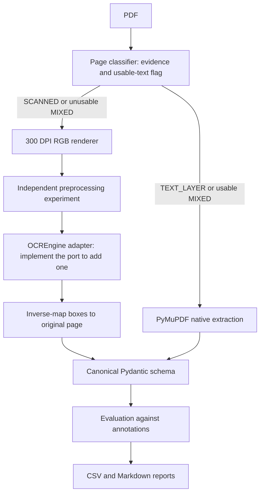

# Architecture

One Python package and a local CLI. No service, database or frontend is needed for Sprint 1.

The benchmark CLI currently ships no bundled OCR adapter beyond native PyMuPDF -- Paddle and local/API DeepSeek adapters that used to fill the `OE` node above were removed (no longer used). Adding a new engine to compare against native extraction means implementing `application.ports.ocr_engine.OCREngine` and wiring it in `cli/main.py`; see `infrastructure/ocr/mistral_ocr.py` (used by the separate `snapshot` command, not yet wired into `benchmark`) for a concrete adapter shape to follow.

## Dependencies

- `domain`: Pydantic entities, enums, bbox math. No SDK, filesystem or model imports.
- `application`: OCR, PDF, renderer, preprocessing, evaluation and reporting ports; page routing and experiment orchestration. Depends on domain and standard library, never on infrastructure.
- `infrastructure`: implements ports using PyMuPDF, OpenCV, RapidFuzz and local files; any given `OCREngine` adapter (see `infrastructure/ocr/`) implements the OCR port, imported lazily so the base install needs no OCR SDK.
- `cli`: composition root; builds adapters and injects them into application use cases.
- `schemas/output.py`: public exports of canonical domain models. Machine-readable schema is checked in at `docs/output.schema.json`.

The PDF SDK page object crosses the PDF port as an opaque object to keep this spike small. Application reads only page count, dimensions and rotation; replacing PyMuPDF requires a compatible page facade. A future API engine can implement `OCREngine` without changing orchestration, but no remote OCR endpoint is implemented here.

## Routing policy

Extract stripped text length, native word count, native span count and image coverage. Coverage is the rectangle-union area of displayed image bounds clipped to the rotated page, divided by page area. Overlapping images count once; this is geometric image coverage, not a pixel-level content mask.

Default usable-text thresholds: at least 20 characters, 3 words and 1 span. A usable page is TEXT_LAYER, or MIXED if image coverage is at least 0.5. A nonusable page is SCANNED, or MIXED when it has some native text and substantial image coverage. Evidence and the usable flag are saved per page.

MIXED always requires OCR, even when its native text layer is independently usable — `requires_ocr_regions` (not `usable_text` alone) gates the native-only fast path, precisely so a page with good text *and* a large embedded image (a signed/stamped page photographed and reinserted next to its own transcript, say) is never silently read native-only and left missing whatever only the image carries. Only TEXT_LAYER (usable text, no heavy image overlay) takes that fast path. A tiny watermark will generally fall below the image-coverage threshold and not force MIXED. OCR-region merging and text-layer quality scoring are future work. The classifier is intentionally inspectable rather than a learned model.

## Geometry

PyMuPDF words originate in unrotated PDF coordinates; apply `page.rotation_matrix` before normalizing against the displayed page. Renderer outputs that same displayed orientation. Preprocessing composes homogeneous affine matrices. OCR boxes are inverse-mapped through the matrix, enclosing all four transformed corners, then clipped to the original page and normalized. This can enlarge axis-aligned boxes after rotation; polygon IoU is not implemented.

An OCR adapter's own detection granularity (line-level vs word-level, measured vs derived) is preserved as-is in the canonical schema rather than upgraded or guessed at — see `docs/OUTPUT_SCHEMA.md` for how a specific engine's geometry is represented.

## Failure isolation and privacy

An OCR model loads lazily once and is reused by its experiments. Missing dependencies, unsupported configuration, unavailable model or hardware during initialization produce cached SKIPPED reasons. Per-page inference/render/extraction exceptions produce FAILED pages and do not stop following pages. Corrupt/missing PDF files produce FAILED sample rows; following samples still run. Invalid manifest/configuration is a preflight error.

A sample is SUCCESS only when all pages succeed. Partial samples remain visible and are excluded from summary accuracy to avoid comparing incomplete documents. Page JSON preserves successful partial output. Empty text is FAILED, even for an intentionally blank page; annotate and review blank-page policy before a larger study.

Structured page logs carry run/sample/document/page/engine/experiment/time/status, without text. Predictions and failure artifacts intentionally contain confidential text; keep run directories local and excluded from version control. No document is sent to a third-party API. Model weight downloads are separate from document inference.

## Reproducibility and timing

Runs refuse to overwrite existing directories. Save resolved configuration, normalized manifest, SHA-256 hashes of source and annotations, Python/package versions, hardware, model/backend/device metadata, initialization duration and end-to-end wall time. Page timing includes native extraction or render/preprocess/inference; sample timing additionally includes evaluation and artifact writes. Initialization is charged to the first OCR page and separately recorded; this is a cold-start-inclusive comparison, not a steady-state latency test. CPU peak working set is recorded where psutil exposes it.

Local external API cost is exactly zero. Infrastructure cost remains null for later estimates. Seeds control image degradation; GPU kernels/model versions can still change outputs. Pin model revisions/local weight copies for formal benchmarks. Package locks cannot pin upstream unversioned model downloads.
