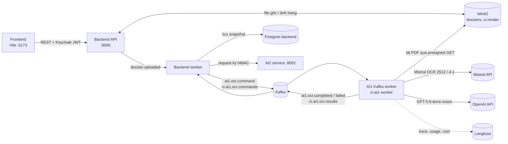
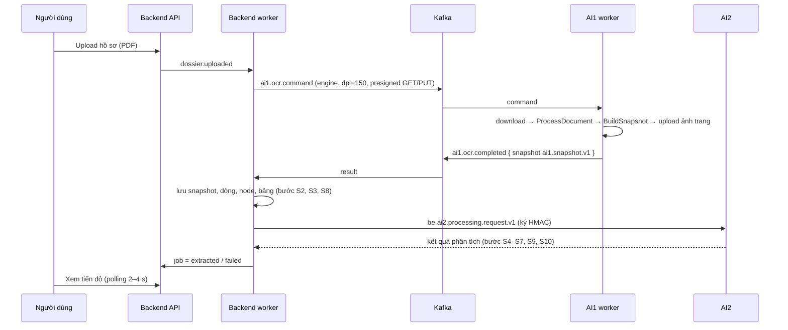
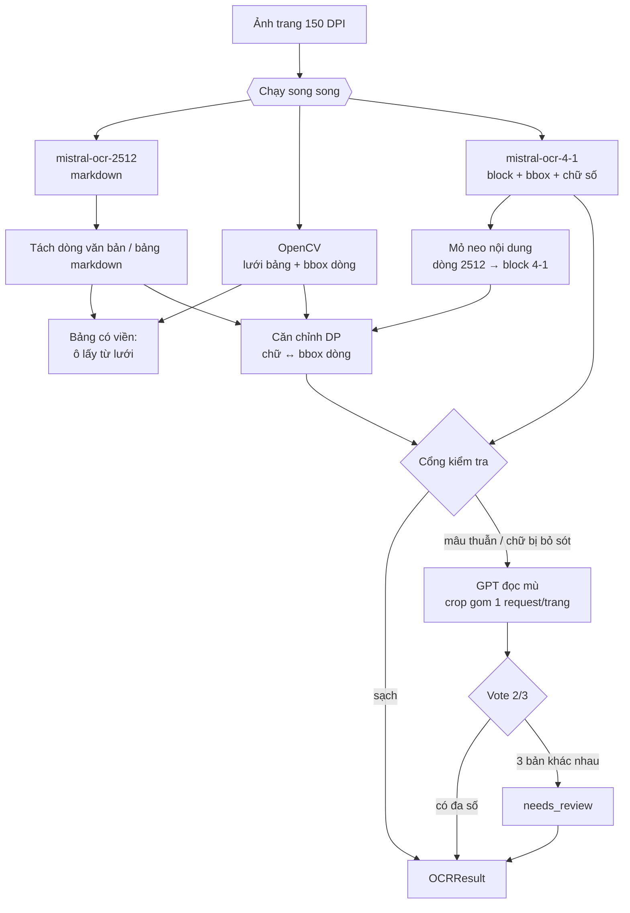

# Kiến trúc AI1 — OCR & dựng snapshot hợp đồng

> Tài liệu mô tả **trạng thái hiện tại của code** (nhánh `feature/code-full`, từ commit `ce7bed9`).
> `docs/ARCHITECTURE.md` là tài liệu cũ của OCR lab (benchmark/engine lựa chọn); phần OCR production
> dưới đây thay thế nó ở mọi điểm mâu thuẫn.

## Mục lục

1. [Mục tiêu và phạm vi](#1-mục-tiêu-và-phạm-vi)
2. [Vị trí AI1 trong hệ thống](#2-vị-trí-ai1-trong-hệ-thống)
3. [Luồng end-to-end của một hồ sơ](#3-luồng-end-to-end-của-một-hồ-sơ)
4. [Bốn tầng điều phối](#4-bốn-tầng-điều-phối)
5. [ProcessDocument — định tuyến từng trang](#5-processdocument--định-tuyến-từng-trang)
6. [VerifiedMistralOCREngine — đọc một trang scan](#6-verifiedmistralocrengine--đọc-một-trang-scan)
7. [Dựng snapshot và cấu trúc điều khoản](#7-dựng-snapshot-và-cấu-trúc-điều-khoản)
8. [Hợp đồng dữ liệu đầu ra `ai1.snapshot.v1`](#8-hợp-đồng-dữ-liệu-đầu-ra-ai1snapshotv1)
9. [Bản đồ module](#9-bản-đồ-module)
10. [Cấu hình](#10-cấu-hình)
11. [Xử lý lỗi và dự phòng](#11-xử-lý-lỗi-và-dự-phòng)
12. [Quan sát (Langfuse), chi phí, hiệu năng](#12-quan-sát-langfuse-chi-phí-hiệu-năng)
13. [Bằng chứng đo đạc đằng sau thiết kế](#13-bằng-chứng-đo-đạc-đằng-sau-thiết-kế)
14. [Kiểm thử](#14-kiểm-thử)
15. [Vận hành](#15-vận-hành)
16. [Giới hạn đã biết và lộ trình](#16-giới-hạn-đã-biết-và-lộ-trình)

---

## 1. Mục tiêu và phạm vi

**AI1 nhận một file PDF hợp đồng (bản có lớp chữ hoặc bản scan) và trả về một `ai1.snapshot.v1`**:
toàn văn theo từng trang, từng dòng kèm bounding box có nguồn gốc rõ ràng, bảng, cây điều khoản
(Điều → Khoản → Điểm), liên kết bảng qua trang, và cờ cần người kiểm tra (HITL).

Nguyên tắc thiết kế, theo thứ tự ưu tiên:

1. **Chính xác trước** — hợp đồng có giá trị pháp lý; một chữ số hay một dấu sai đổi nghĩa văn bản.
   Không bao giờ đoán: chỗ không chắc được gắn cờ `needs_review`, không lặng lẽ sửa.
2. **Không đánh mất nội dung** — OCR thô là bất biến; header/footer chỉ được *phân loại*, không xoá;
   dòng không có tọa độ vẫn giữ trong văn bản điều khoản.
3. **Tọa độ trung thực** — mỗi bbox mang `geometry_provenance` (MEASURED / DERIVED / CLAIMED),
   không bao giờ "nâng cấp" một tọa độ suy đoán thành đo được.
4. **Chi phí và tốc độ có kiểm soát** — người đọc đắt (GPT) chỉ được gọi cho đúng dòng có mâu thuẫn.
5. **Điều phối bằng luật cố định, không bằng LLM agent** — tái lập được, giải trình được, kiểm thử được.

Ngoài phạm vi AI1: trích xuất field/fact có kiểu, so sánh hợp đồng–phụ lục, RAG (thuộc AI2);
lưu trữ, phân quyền, UI (thuộc backend/frontend).

---

## 2. Vị trí AI1 trong hệ thống



| Thành phần | Container | Vai trò với AI1 |
|---|---|---|
| Backend worker | `ci-backend-worker` | Phát lệnh OCR, nhận kết quả, lưu, kích hoạt AI2, cập nhật trạng thái job |
| AI1 Kafka worker | `ci-ai1-worker` | Chạy toàn bộ AI1 (tài liệu này) |
| Kafka | `ci-kafka` | Topic `ci.ai1.ocr.commands` / `ci.ai1.ocr.results`, group `ci-ai1-ocr` |
| MinIO | `ci-minio` | Bucket `dossiers` (file gốc), `ci-render` (ảnh trang AI1 render) |
| AI2 | `ci-ai2-service` | Nhận snapshot của AI1 qua backend (request ký HMAC) |

---

## 3. Luồng end-to-end của một hồ sơ



Chi tiết trong AI1 (`backend_ocr_job._run_backend_ocr`), theo `current_stage` của job:

| Stage | Tiến độ | Việc làm |
|---|---|---|
| `download` | 5% | Tải PDF qua presigned URL, kiểm tra SHA-256, đếm trang |
| `ocr` | 15% | `ProcessDocument.execute` (mục 5–6) |
| `build_snapshot` | 80% | `BuildSnapshot.execute` (mục 7) |
| upload renders | — | PUT ảnh từng trang lên presigned URL của backend |
| `completed` | 100% | Trả `{"schema_version": "ai1.snapshot.v1", "snapshot": ...}` |

Lệnh OCR từ backend (`worker.py`): `render_target.dpi = 150`, `options.dpi = 150`,
`options.engine = AI1_OCR_ENGINE` (mặc định `mistral`), `language`, `document_role`, `filename`.
AI1 hiện chỉ nhận toàn bộ dải trang của tài liệu (`pages_to_process` phải khớp số trang PDF).

Idempotency: AI1 worker nhớ `event_id` đã xử lý **trong bộ nhớ tiến trình** (`_processed`) để bỏ
qua bản gửi lặp của Kafka; bộ nhớ này mất khi worker khởi động lại.

---

## 4. Bốn tầng điều phối

Không có LLM agent điều phối. "Planner" là code với luật cố định, chia bốn tầng:

```
Backend worker ─── điều phối HỒ SƠ            backend/src/contract_intelligence/worker.py
  │  upload → lệnh OCR → nhận kết quả → lưu → AI2 → trạng thái job
  ▼
AI1 Kafka worker ── điều phối JOB OCR          infrastructure/kafka_worker.py → backend_ocr_job.py
  │  tải PDF → ProcessDocument → BuildSnapshot → trả kết quả
  ▼
ProcessDocument ─── điều phối TỪNG TRANG       application/use_cases/process_document.py
  │  có lớp chữ → đọc native (0 API) │ trắng / ít chữ / trùng pixel → không OCR (0 API)
  │  scan/mixed còn lại → engine, song song 4 trang │ cuối cùng: đánh dấu trang trùng văn bản
  ▼
VerifiedMistralOCREngine ─ "planner" TRONG MỘT TRANG   infrastructure/ocr/verified_mistral_ocr.py
     3 nguồn song song → căn chỉnh → cổng kiểm tra → GPT phân xử → nhận/thay/cờ review
```

Các LLM trong AI1 **không quyết định luồng**: GPT chỉ đọc crop khi code gọi; DeepSeek gray-zone
agent cho nối bảng qua trang là tuỳ chọn, mặc định tắt (`table_continuity_agent=False`).

---

## 5. ProcessDocument — định tuyến từng trang

File: `application/use_cases/process_document.py`, `classify_pdf.py`.

1. Với mỗi trang, `PyMuPDFExtractor.evidence` đo lớp chữ gốc; `PdfPageClassifier` phân loại:

   | Ngưỡng | Giá trị | Ý nghĩa |
   |---|---|---|
   | `min_chars` | 20 | Dưới mức → `TEXT_TOO_SHORT` |
   | `min_words` | 3 | Dưới mức → `TOO_FEW_WORDS` |
   | `garbled_threshold` | 0.15 | Tỉ lệ ký tự rác (TCVN3/VNI, mojibake) ≥ mức → `GARBLED_TEXT_LAYER` |
   | `image_threshold` | 0.5 | Ảnh phủ ≥ mức trên trang có chữ dùng được → `MIXED` |

   - `TEXT_LAYER` (chữ dùng được, không bị ảnh phủ): đọc native bằng PyMuPDF, bbox từ glyph
     (DERIVED), bảng bằng `find_tables()` — **không gọi API nào**.
   - Các trang còn lại được render ở DPI của job (150) rồi qua **router trước OCR**
     (`infrastructure/image/page_ink.py`, chỉ OpenCV, không gọi mạng). Thứ tự kiểm tra:

     | Kiểm tra | Điều kiện | Kết quả |
     |---|---|---|
     | Trang trắng | Không có lớp chữ **và** không có vết mực nào ≥ ~1 mm. Mực = điểm tối hơn nền giấy ≥ 60 mức xám, nên chữ mờ/bút chì vẫn tính, còn chữ in hằn từ mặt sau thì không. Bỏ dải mép 2% (bóng máy scan) | `SUCCESS` + `blank_page`, **không gọi OCR** |
     | Trang ít chữ | Lớp chữ sạch nhưng dưới 20 ký tự / 3 từ (`SHORT_NATIVE_TEXT`), không có ảnh **và** mọi dòng mực trên ảnh render đều nằm trong bbox của dòng chữ gốc | `TEXT_LAYER`, đọc native (`SHORT_TEXT_COVERS_ALL_INK`), **không gọi OCR**. Còn dòng mực ngoài lớp chữ (chữ vẽ bằng vector, dán ảnh) → OCR |
     | Trang trùng pixel | Ảnh (sau tiền xử lý) có sha256 trùng một trang đã xếp OCR | Dùng lại kết quả OCR của trang gốc, cấp lại id dòng/từ/bảng theo số trang mới, cảnh báo `ocr:reused_reading_of_pN`. **Không gọi OCR lần hai** |
     | Còn lại | `SCANNED` / `MIXED` | `preprocessing=[]`, gửi engine OCR |

2. Đọc PDF, phân loại, render luôn tuần tự (đối tượng trang PyMuPDF không an toàn đa luồng).
   Chỉ lời gọi engine được song song: `max_workers = 4` cho engine gọi API (`openai`, `gemini`,
   `mistral`).
3. Nếu engine không trả bảng, `build_scanned_tables` dò bảng có kẻ viền bằng pixel làm dự phòng.
4. Engine không đọc ra chữ nào trên trang có mực (trang chỉ có chữ ký/con dấu/ảnh, hoặc đọc sót):
   trang vẫn `SUCCESS` nội bộ kèm `no_text_found`, snapshot đánh `PARTIAL` để người kiểm tra. Không
   còn `FAILED "Empty extraction result"`.
5. Trang lỗi thật (engine ném lỗi, render lỗi) → `Status.FAILED` riêng trang đó; tài liệu vẫn tiếp tục.
6. Sau khi mọi trang xong, `duplicate_pages.mark_duplicate_pages` so văn bản các trang, chỉ xét trang
   có ≥ 20 từ. Trang "PHỤ LỤC" lặp lại là hai mốc phụ lục chứ không phải trang trùng.
   - **Trùng nguyên văn** (sau khi chuẩn hoá khoảng trắng/markdown) → `Page.duplicate_of = N`: trang
     vẫn giữ text, nhưng không đưa vào cây điều khoản lần hai.
   - **Gần trùng** (cùng dãy chữ số, phần chữ giống ≥ 95%, vd bản scan lại) → `near_duplicate_of = N`:
     vẫn giữ trong cây điều khoản, snapshot `PARTIAL` + `possible_duplicate_of:pN`. Trang mẫu chỉ
     khác tên người cũng rơi vào đây, nên hệ thống không tự loại: loại nhầm là mất nội dung.

---

## 6. VerifiedMistralOCREngine — đọc một trang scan

File: `infrastructure/ocr/verified_mistral_ocr.py`. Được lắp trong `backend_ocr_job._get_engine("mistral")`.

### 6.1 Ba người đọc và một bộ đo

| Vai trò | Thành phần | Dùng để | Không dùng để |
|---|---|---|---|
| Người đọc chính | `MistralOCREngine(model=AI1_TEXT_MODEL)` — `mistral-ocr-2512` | Văn bản, dấu tiếng Việt, bảng markdown | Tọa độ (model không trả block/bbox/confidence) |
| Bộ đo hình học | `detect_bordered_tables` + `detect_text_lines` (OpenCV, local) | Bbox dòng, lưới ô bảng | Nội dung |
| Người đọc đối chiếu | `MistralOCREngine(model=AI1_VERIFIER_MODEL)` — `mistral-ocr-4-1` | Bbox block đo thật, chữ số, so từ theo khung chữ, phát hiện chữ bị bỏ sót | **Chữ cái có dấu** (thế hệ 4.x đọc sai dấu) |
| Trọng tài | `OpenAIRegionReader` — GPT-5.6-terra | Đọc mù các dòng mâu thuẫn và vùng mực bị bỏ sót | Tọa độ; người đọc chính |
| Dự phòng | `OpenAIVisionOCREngine` | Đọc cả trang khi người đọc chính lỗi | — |

### 6.2 Luồng năm bước



**Bước 1 — đọc và đo song song** (`ThreadPoolExecutor(3)`, context Langfuse được copy vào luồng).
Bộ đo local chạy xong trong lúc chờ API nên không cộng thêm thời gian. Với
`AI1_VERIFY_ALL_PAGES=false`, 4-1 không chạy ở bước này mà chỉ chạy ở bước 4 khi cổng nghi ngờ.

**Bước 2 — hình học.**

- *Tách markdown* (`_parse_markdown`): dòng bảng `| … |` gom thành bảng; heading `#`, đậm `**`,
  LaTeX được làm sạch (`clean_markdown_text`); đường kẻ `---` và dòng chỉ có `[image: …]` bị bỏ.
- *Bảng có viền* (`_place_grid_tables`): ghép bảng markdown với lưới theo thứ tự đọc, chỉ khi hình
  dạng tương thích (cùng số cột hoặc số hàng lệch ≤ 1). Khớp đúng kích thước → mỗi ô lấy bbox ô lưới
  (DERIVED), mỗi dòng bảng lấy dải hàng lưới. Lệch kích thước → bbox bảng MEASURED, ô chia đều
  (CLAIMED — "đừng trích dẫn đúng vị trí này").
- *Mỏ neo* (`_anchors`): so khớp từng từ (khung chữ bỏ dấu, `SequenceMatcher`) giữa dòng 2512 và
  dòng 4-1; một dòng được neo khi ≥ 50% số từ khớp, vào các block 4-1 góp ≥ 30% số từ khớp. Dòng
  2512 xuất lệch thứ tự (vd footer đưa lên đầu trang) được neo theo nội dung khi độ giống ≥ 85.
- *Căn chỉnh* (`text_geometry_alignment.align`, quy hoạch động): mỗi dòng văn bản lấy một dải box
  liên tiếp sao cho độ dài chữ khớp bề rộng mực theo tỉ lệ ký tự/pixel của chính trang. Được phép
  bỏ box (mực không ai đọc — có thể bỏ sót) và để dòng không có box (chữ không có mực — có thể bịa);
  cả hai bị phạt và **được báo cáo**, không bị giấu. Các hằng số:

  | Hằng | Giá trị | Ý nghĩa |
  |---|---|---|
  | `_LENGTH_SPREAD` | 0.12 | Lệch độ dài chấp nhận; chi phí bậc hai theo đơn vị này |
  | `_SKIP_PENALTY` / `_EMPTY_PENALTY` | 4 / 5 | Phạt gần như cố định cho bỏ box / dòng không box (sự kiện hiếm) |
  | `_GAP_PENALTY` | 6 | Mỗi lần một dải box "đứt đoạn": sang cột khác cùng hàng (> 4 lần cao dòng), nhảy lên đầu cột kế, hoặc cách xa > 2 lần cao dòng |
  | `_ANCHOR_PENALTY` | 25 | Mỗi box nằm ngoài vùng mỏ neo của dòng đó |
  | `_RATE_FACTORS` | 0.7 … 1.5 | Giải lại với nhiều tỉ lệ ký tự/pixel, lấy nghiệm rẻ nhất |
  | `POOR_ALIGNMENT_ERROR` | 0.35 | Lệch tương đối lớn hơn → bbox CLAIMED |
  | `MAX_RUN` | 16 | Số dòng hiển thị tối đa của một đoạn |

  Bbox dòng: 1 box → MEASURED; hợp nhiều box → DERIVED; căn kém → CLAIMED.
- *Thứ tự đọc* (`_best_order`): khi căn chỉnh gốc có bất thường, hoặc trang có khối 2 cột, thử thêm:
  (a) chuyển tối đa 3 dòng đầu/cuối là "đồ trang" (`_movable`: số trang, hoặc mã ≤ 2 từ có chữ số
  và không có chữ thường — không bao giờ là heading/đoạn văn) sang phía kia;
  (b) thứ tự box theo cột (`column_major_variant`, cho khối chữ ký "ĐẠI DIỆN BÊN A | BÊN B").
  Chọn phương án có chi phí thấp nhất; thứ tự xuất ra theo phương án đó.

**Bước 3 — cổng kiểm tra** (luật, không tốn API). Một dòng thành "mục tiêu phân xử" với các lý do:

| Lý do | Điều kiện | Nguồn |
|---|---|---|
| `spelling` | `vn_text.line_issues` khác rỗng (xem bảng dưới) | Bản 2512 |
| `critical` | Token quan trọng của dòng không có đủ trong bản 4-1, hoặc 4-1 có token mà 2512 thiếu | `critical_fields` |
| `content` | Hai bản đọc gọi tên từ khác nhau, **và** phía 4-1 là từ tiếng Việt hợp lệ (rác của 4-1 như "t ur", "dans", "Vietc" không tính) | `reading_agreement.disputes` |
| `amount` | Số tiền bằng số khác "(Bằng chữ: …)" | `critical_fields.amount_words_mismatch` |

`vn_text.line_issues` (ngưỡng trong code):

| Mã | Điều kiện |
|---|---|
| `FOREIGN_LETTERS` | Có chữ cái không thuộc tiếng Việt (ū, ē, ŋ, α…) |
| `LOW_DIACRITIC_DENSITY` | ≥ 8 âm tiết tiếng Việt và tỉ lệ âm tiết có dấu < 0.5 (văn bản đúng ≈ 0.75–0.9) |
| `MISSING_VOWEL_MODIFIER` | ≥ 2 từ có "ie/ye/uo" trước chữ cái khác mà thiếu mũ/móc ("kiém", "nghiem", "tuong") |
| `INVALID_SYLLABLES` | ≥ 2 âm tiết sai cấu trúc và ≥ 25% số từ viết thường (chỉ tính từ có dấu hoặc ≤ 3 chữ) |

Dòng chủ yếu tiếng Anh được bỏ qua; token viết hoa toàn bộ (viết tắt, mã) và email/URL không bị chấm.

Token quan trọng (`critical_fields.critical_tokens`, tính trên khung chữ bỏ dấu, chỉ giữ chữ số):
`money`, `number` (số có ≥ 2 nhóm nghìn), `percent`, `date` (dd/mm/yyyy và "ngày … tháng … năm …"),
`contract` (dạng `25/2026/HĐDV-MH-TT`), `id` (9–16 chữ số: MST, tài khoản, điện thoại).

**Bước 4 — người đọc đối chiếu.** Khi có bản 4-1: sửa bbox cho dòng căn kém (lấy bbox block 4-1
khớp nội dung ≥ 70), đặt bảng không viền bằng bbox bảng của 4-1, tính xung đột chữ số và tranh chấp
theo từ. Dòng đồ trang (`_movable`) không bị tính tranh chấp nội dung (đã có kiểm tra chữ số).
Không có 4-1 (lỗi/không gọi) → dòng có token quan trọng nhận `critical_field_unverified`.

**Bước 5 — phân xử mù và khôi phục chữ bị bỏ sót.**

- Crop theo bbox dòng, đệm 0.25 lần cao dòng theo chiều dọc và 0.5 theo chiều ngang (không lấn sang
  dòng bên cạnh), gom **mọi crop của trang vào một request**; GPT không được thấy bản đọc nào khác.
  Nếu có mục tiêu không có bbox tin cậy → GPT đọc cả trang một lần, định vị từng dòng bằng
  `partial_ratio_alignment` trên khung chữ giữ nguyên độ dài.
- Luật quyết định cho mỗi dòng (`_arbitrate`), `same_text` = khung chữ giống ≥ 80:

  | Tình huống | Kết quả |
  |---|---|
  | Token quan trọng của 2512 và GPT khác nhau; GPT giống nội dung và token của GPT có đủ trong 4-1 | Lấy bản GPT (GPT + 4-1 đa số) |
  | Token quan trọng khác nhau, không có đa số | Giữ 2512, `needs_review:critical_field_conflict` |
  | Tranh chấp từ; GPT khớp 2512 | Giữ 2512 |
  | Tranh chấp từ; GPT giống nội dung, không lỗi chính tả, gần bản 4-1 hơn 2512 | Lấy bản GPT |
  | Tranh chấp từ, ba bản khác nhau | Giữ 2512, `needs_review:content_conflict` |
  | Số tiền lệch "Bằng chữ"; GPT nhất quán | Lấy bản GPT, nếu không → `needs_review:amount_words_mismatch` |
  | Lỗi chính tả; GPT giống nội dung và sạch | Lấy bản GPT, nếu không → `needs_review:spelling_unverified` |
  | GPT lỗi/không trả kết quả | `needs_review:arbiter_unavailable` |

- *Khôi phục mực bị bỏ sót* (`_recoverable_ink`, `_insert_recovered`): chỉ khi 4-1 thấy từ hợp lệ mà
  2512 không có; khi đó các box bị bỏ ≥ 5 ký tự được crop (vùng có > 15% mực đỏ con dấu bị bỏ qua)
  và gửi chung request phân xử. Chèn khi: đọc được, không `[illegible]`, không lỗi chính tả, ≥ 50%
  từ có trong 4-1, chưa có sẵn trong trang (tránh trùng). Chuỗi từ khớp liền mạch với 4-1 → chèn
  bình thường; khớp một phần → chèn kèm `needs_review:recovered_text_unconfirmed`. Vị trí chèn theo
  thứ tự box đã chọn (tên người ký nằm dưới đúng cột của bên đó).

### 6.3 Bộ đo hình học (`infrastructure/image/line_geometry.py`)

1. Mặt nạ mực Otsu; bỏ pixel đỏ trội (R−G > 50 và R−B > 50) để con dấu không nuốt tên người ký.
2. Bỏ nét kẻ dài (ngang ≥ 1/8 bề rộng, dọc ≥ 1/8 chiều cao).
3. Chiều cao ký tự = trung vị chiều cao thành phần liên thông; giãn theo kernel
   (1.2 × cao chữ, 0.15 × cao chữ) để nối chữ trong một dòng.
4. Lấy bbox sát mực của mỗi thành phần, bỏ vụn, gắn dấu thanh tách rời vào dòng gần nhất
   (cách ≤ 0.6 cao chữ), gộp mảnh cùng hàng cách nhau ≤ 4 cao chữ (nhãn/giá trị), bỏ vùng cao
   > 3 cao chữ (chữ ký, logo, con dấu còn sót).
5. Thứ tự đọc theo hàng; `column_major_variant` cho khối 2 cột (hàng 2 box cùng một khe cột, cho
   phép hàng 1 box nằm gọn một bên, dừng khi cách xa > 4 cao dòng).

Đo được ~0.1–0.2 s/trang ở 150 DPI, không gọi mạng.

---

## 7. Dựng snapshot và cấu trúc điều khoản

File: `application/use_cases/build_snapshot.py`, `build_structure.py`, `running_text.py`,
`table_continuity.py`.

**Trang.** Dòng không có bbox không vào `lines[]` của snapshot (hợp đồng yêu cầu bbox) nhưng vẫn nằm
trong `text` của trang và của node. Trạng thái trang:

| `status` | Khi nào |
|---|---|
| `SUCCESS` | Không có cảnh báo làm giảm độ tin cậy; trang trắng (router quyết định từ ảnh render, mục 5) → `SUCCESS` + `blank_page` |
| `PARTIAL` | Có `missing_line_geometry`, `low_confidence_lines` (confidence < 0.5), bất kỳ `needs_review:*`, `no_text_found`, hoặc `possible_duplicate_of:pN` |
| `FAILED` | Engine lỗi/không chạy được trang (`SKIPPED` nội bộ cũng thành `FAILED` kèm lý do) |

"PDF không có chữ và không có ảnh" **không** còn được coi là trang trắng: chữ vẽ bằng đường vector
cũng không có cả hai nhưng vẫn đọc được. Việc quyết định trang trắng nằm hoàn toàn ở router.

Cờ `needs_review:<lý do>:<line_id nội bộ>` từ engine được `BuildSnapshot` đổi sang `line_id` của
snapshot (dòng không có bbox → `unpositioned`) để HITL tìm đúng dòng.

**Header/footer/số trang** (`running_text.detect_running_lines`). Một dòng là "đồ trang" khi thoả cả
hai điều kiện:

- **Nằm ở mép trang**: bbox trong dải 10% trên/dưới. Nếu không có bbox thì là tối đa 3 dòng
  đầu/cuối, nhưng không quá 1/3 số dòng, để trang ngắn không bị coi toàn bộ là "mép".
- **Là số trang, hoặc lặp lại** ở cùng mép trên ≥ 50% số trang *độc lập* (bỏ trang có `duplicate_of`
  / `near_duplicate_of`, vì toàn bộ chữ của trang trùng đều "lặp lại" trên hai trang).

Vì loại nhầm là mất nội dung, "lặp lại" được hiểu chặt:

- Dòng là mốc điều khoản (`Điều N.`, `N.N.`, `a)`, `Khoản N`) **không bao giờ** là đồ trang.
- Chữ số phải trùng khớp tuyệt đối. Ngoại lệ duy nhất là **bộ đếm trang**: con số đứng sau
  "Trang/Page" hoặc ở đầu/cuối dòng (không phải tổng số trang sau `/`, `of`, `trên`) và bằng số trang
  cộng độ lệch đánh số. Độ lệch (vd bìa không đánh số) được bầu từ chính các bộ đếm này trên các
  trang, tối đa ±5.
- Phần chữ so mờ ≥ 90 để chịu lỗi OCR nhỏ.

Dòng bảng `| … |` không bao giờ bị tính. Các dòng này bị loại khỏi cây điều khoản, vẫn giữ trong text
trang.

Trước đây hệ thống che *mọi* chữ số và coi mọi dòng của trang ngắn là mép. Hệ quả là "Điều 5 …" và
"Điều 6 …" trông như một dòng lặp lại, và một trang scan trùng làm cả Điều 2 biến mất khỏi cây điều
khoản. Cả hai trường hợp đã có test hồi quy.

**Cây điều khoản** (`BuildStructure`). Mốc lấy từ văn bản (`clause_parser.parse_marker`):
`Điều N` / `ĐIỀU N` / `Article N` (cấp 1), `1.1` / `1.1.1` / `Khoản N` (cấp 2+), `a)` `(a)` `1)`
`(i)`. Cây dựng tuần tự theo thứ tự đọc (`hierarchy_builder`), khoản còn mở tiếp tục sang trang sau.
Trang có `duplicate_of` bị bỏ qua (nội dung đã có một lần).
Vị trí node = mỏ neo dòng đầu/cuối trên từng trang (`regions`, START/END); không crop, không OCR lại.

**Bảng qua trang** (`link_continuities`): chặn cứng (dòng tổng lặp lại, heading mục mới, số thứ tự
reset) rồi chấm điểm; ghi `MERGE` / `SPLIT` / `NEEDS_REVIEW`, không tự gộp ô.

---

## 8. Hợp đồng dữ liệu đầu ra `ai1.snapshot.v1`

Schema: `docs/ai1.snapshot.v1.schema.json`, model: `domain/snapshot.py`.

```
DocumentSnapshot
├─ schema_version = "ai1.snapshot.v1", snapshot_id, source_digest (sha256), dossier_id,
│  document_id, filename, document_role, input_type, engine{name, version}, page_count, processing_ms
├─ pages[]  SnapshotPage
│   ├─ page_number, status, input_type, source_page_width/height, rotation_degrees, page_image_ref
│   ├─ text                  toàn văn trang (kể cả header/footer)
│   ├─ lines[]  {line_id, text, page_char_start/end, bbox_normalized, geometry_provenance, word_ids}
│   ├─ words[]  (chỉ có khi nguồn cho bbox từng từ, vd lớp chữ gốc)
│   ├─ tables[] {table_id, bbox_normalized, geometry_provenance, header[], rows[].cells[]}
│   ├─ table_status          DETECTED | NOT_PRESENT | NOT_CHECKED
│   └─ warnings[]            xem bảng mã bên dưới
├─ nodes[]  StructuralNode {node_id, type ARTICLE|CLAUSE|POINT|UNMARKED, label_raw, parent_id,
│           page_start, page_end, text, line_ids, regions[], bbox_normalized}
└─ table_continuity[] {from_table_id, to_table_id, decision, confidence, reason_codes}
```

`geometry_provenance`: **MEASURED** — đo trực tiếp (glyph PDF, box OpenCV, block Mistral);
**DERIVED** — tính từ hình học tin cậy (hợp các box dòng, ô từ lưới kẻ); **CLAIMED** — suy đoán,
không dùng để trích dẫn chính xác (ô chia đều, dòng căn kém).

Mã cảnh báo trang:

| Mã | Loại | Nghĩa |
|---|---|---|
| `needs_review:critical_field_conflict:<line>` | Làm trang PARTIAL | Chữ số quan trọng không có đa số |
| `needs_review:critical_field_unverified:<line>` | PARTIAL | Có số tiền/ngày… nhưng không có bản đọc thứ hai |
| `needs_review:content_conflict:<line>` | PARTIAL | Ba bản đọc gọi tên từ khác nhau |
| `needs_review:amount_words_mismatch:<line>` | PARTIAL | Số tiền bằng số ≠ bằng chữ, không phân định |
| `needs_review:spelling_unverified:<line>` | PARTIAL | Dòng lỗi chính tả, không có bản sạch thay thế |
| `needs_review:arbiter_unavailable:<line>` | PARTIAL | Cần phân xử nhưng GPT không trả kết quả |
| `needs_review:recovered_text_unconfirmed:<line>` | PARTIAL | Chữ khôi phục chỉ khớp một phần với 4-1 |
| `missing_line_geometry` | PARTIAL | Có dòng không gắn được bbox |
| `low_confidence_lines` | PARTIAL | Có dòng confidence < 0.5 |
| `no_text_found` | PARTIAL | Trang có mực nhưng không bản đọc nào ra chữ |
| `possible_duplicate_of:pN` | PARTIAL | Gần trùng trang N (vd bản scan lại); vẫn nằm trong cây điều khoản |
| `blank_page` | Thông tin | Trang trắng (router, không gọi OCR) |
| `duplicate_of:pN` | Thông tin | Trùng nguyên văn trang N; không đưa vào cây điều khoản lần hai |
| `ocr:reused_reading_of_pN` | Thông tin | Ảnh trùng pixel với trang N, dùng lại kết quả OCR |
| `ocr:text_reader_empty_fallback` | Thông tin | 2512 trả rỗng trên trang có dòng chữ, đã đọc lại bằng GPT cả trang |
| `ocr:text_reader_empty` | Thông tin | 2512 trả rỗng, không có/không gọi được dự phòng |
| `ocr:text_reader_fallback:<Exc>` | Thông tin | 2512 lỗi, đã đọc bằng GPT cả trang |
| `ocr:verifier_failed:<Exc>` | Thông tin | 4-1 lỗi |
| `ocr:unread_ink_lines:<n>` | Thông tin | Số dòng mực không được bản đọc chính đọc |
| `ocr:recovered_unread_ink:<n>` | Thông tin | Số dòng đã khôi phục |
| `render_upload_failed:<Exc>` | Thông tin | Không upload được ảnh trang |

---

## 9. Bản đồ module

Gốc: `ai-service/src/contract_ocr/`.

| Lớp | Module | Trách nhiệm |
|---|---|---|
| domain | `entities.py` | Model nội bộ (Line, Page, Table, OCRResult có `warnings`) |
| domain | `snapshot.py` | Hợp đồng `ai1.snapshot.v1` |
| domain | `vn_text.py` | Khung chữ, mật độ dấu, âm tiết, `line_issues` |
| domain | `critical_fields.py` | Token quan trọng, đối chiếu "Bằng chữ" |
| domain | `reading_agreement.py` | Tranh chấp từ giữa hai bản đọc |
| domain | `headings.py` | Nhận diện heading Phụ lục/Điều/Chương |
| application | `process_document.py` | Định tuyến trang, song song engine |
| application | `classify_pdf.py` | TEXT_LAYER / SCANNED / MIXED |
| application | `build_snapshot.py` | Dựng snapshot, dịch cờ review |
| application | `build_structure.py` | Cây điều khoản, loại đồ trang và trang trùng |
| application | `running_text.py` | Header/footer/số trang |
| application | `duplicate_pages.py` | Trang trùng nguyên văn / gần trùng |
| application | `table_continuity.py` | Nối bảng qua trang |
| infrastructure/ocr | `verified_mistral_ocr.py` | Planner một trang (mục 6) |
| infrastructure/ocr | `mistral_ocr.py` | Gọi Mistral OCR; `timeout_ms`, `price_per_page_usd` |
| infrastructure/ocr | `openai_vision_ocr.py` | `OpenAIVisionOCREngine` (cả trang), `OpenAIRegionReader` (crop) |
| infrastructure/ocr | `text_geometry_alignment.py` | Căn chỉnh DP chữ ↔ box |
| infrastructure/ocr | `markdown_tables.py` | Làm sạch markdown, parse bảng pipe |
| infrastructure/ocr | `prompts.py` | Prompt OCR "không đoán, dùng [illegible]" |
| infrastructure/image | `line_geometry.py` | Bbox dòng, khối cột |
| infrastructure/image | `page_ink.py` | Router trước OCR: trang trắng, dòng mực ngoài lớp chữ gốc |
| infrastructure/image | `table_grid.py` | Lưới bảng có viền |
| infrastructure/image | `renderer.py` | Render trang PDF |
| infrastructure | `backend_ocr_job.py` | Job OCR, lắp engine theo `engine_id` |
| infrastructure | `kafka_worker.py` | Consumer/producer Kafka |
| infrastructure | `observability.py` | Langfuse (tắt êm nếu thiếu cấu hình/thư viện) |

Engine theo `options.engine`: `pymupdf` (chỉ native), `openai`, `gemini`, `mistral`
(→ `VerifiedMistralOCREngine`).

---

## 10. Cấu hình

`ai-service/.env` (nạp vào `ci-ai1-worker` qua `env_file`; mẫu ở `.env.example`):

| Biến | Mặc định | Ý nghĩa |
|---|---|---|
| `MISTRAL_API_KEY` | — | Bắt buộc cho engine `mistral` |
| `OPENAI_API_KEY` | — | Trọng tài và dự phòng |
| `AI1_TEXT_MODEL` | `mistral-ocr-2512` | Người đọc chính (id chốt theo ngày, có thể bị ngừng — theo dõi) |
| `AI1_VERIFIER_MODEL` | `mistral-ocr-4-1` | Người đọc đối chiếu |
| `AI1_VERIFY_ALL_PAGES` | `true` | `false`: chỉ gọi 4-1 khi cổng nghi ngờ (rẻ hơn, có thể lọt lỗi thay từ) |
| `AI1_TEXT_TIMEOUT_MS` / `AI1_VERIFIER_TIMEOUT_MS` | `20000` | Quá hạn → dự phòng/bỏ qua |
| `AI1_TEXT_PRICE_PER_PAGE_USD` | `0.002` | Chi phí gắn vào Langfuse |
| `AI1_VERIFIER_PRICE_PER_PAGE_USD` | trống | Điền khi đã xác nhận giá |
| `LANGFUSE_*` | tắt | Tracing và chi phí |

Liên quan trực tiếp đến AI1 ở chỗ khác:

| Nơi | Biến | Ý nghĩa |
|---|---|---|
| `docker-compose.yml` → backend-worker | `AI1_OCR_ENGINE` (mặc định `mistral`) | Engine gửi trong lệnh OCR |
| `backend/.../worker.py` | `dpi: 150` | DPI render cho OCR (đo được: 300 DPI không cải thiện với Mistral) |
| `.env` ở gốc repo (gitignored) | `AI2_SERVICE_HMAC_SECRET` | Khoá chung backend ↔ AI2; thiếu → bước AI2 lỗi, job `failed` |

Đổi `.env` → phải tạo lại container: `docker compose up -d ai1-worker`. Mã nguồn `ai-service/src`
được mount read-only vào container, đổi code chỉ cần khởi động lại worker.

---

## 11. Xử lý lỗi và dự phòng

| Sự cố | Hành vi |
|---|---|
| 2512 lỗi / hết quota / quá timeout | GPT đọc cả trang (`fallback_reader`), cảnh báo `ocr:text_reader_fallback` |
| 2512 trả rỗng trên trang có dòng chữ | GPT đọc cả trang, cảnh báo `ocr:text_reader_empty_fallback` |
| Cả 2512 và GPT lỗi | Trang `FAILED`, tài liệu vẫn có snapshot |
| Mọi bản đọc đều rỗng trên trang có mực | Trang `PARTIAL` + `no_text_found` (không còn `FAILED`) |
| 4-1 lỗi | Cảnh báo `ocr:verifier_failed`; dòng có token quan trọng → `critical_field_unverified`; bbox căn kém giữ CLAIMED |
| GPT trọng tài lỗi | Các dòng cần phân xử → `needs_review:arbiter_unavailable`, giữ bản 2512 |
| OpenCV không tìm thấy dòng | Mọi dòng không có bbox → `missing_line_geometry`, văn bản vẫn đầy đủ |
| Exception khi dựng một trang snapshot | Trang đó `FAILED` (kích thước placeholder 1×1, không có ảnh trang), không làm mất cả snapshot |
| Thiếu `langfuse` / chưa cấu hình | Tracing tắt êm, OCR vẫn chạy |
| Kafka gửi lặp lệnh | Bỏ qua theo `event_id` (trong bộ nhớ tiến trình) |
| Bước AI2 lỗi (backend) | Job `failed` mã `AI2_PROCESSING_FAILED`; OCR đã lưu vẫn còn, có thể chạy lại riêng AI2 |

---

## 12. Quan sát (Langfuse), chi phí, hiệu năng

Span chính (chỉ metadata và số đếm, không có nội dung hợp đồng hay ảnh):

```
process-ocr-job (root, theo job)
├─ download-source
├─ process-document
│   └─ process-page (mỗi trang)
│       └─ verify-page   segments, boxes, grids, poor_geometry, unread_ink, critical_lines,
│           │            spelling_flags, content_disputes, verifier_called, arbitrated
│           ├─ transcribe-page (2512)       usage + cost_details
│           ├─ transcribe-page (4-1)        usage (+ cost khi có giá)
│           └─ arbitrate-regions (GPT)      region_count, usage + cost_details
├─ build-snapshot
└─ upload-renders
```

Chi phí ước tính cho **1000 trang scan** (`AI1_VERIFY_ALL_PAGES=true`):

| Thành phần | 1000 trang | Độ tin cậy |
|---|---|---|
| mistral-ocr-2512 | ~$2 | Giá cấu hình $0.002/trang |
| mistral-ocr-4-1 | ~$1–2 | Chưa xác nhận giá |
| GPT phân xử (~0.5 lượt/trang × $0.005–0.012) | ~$2.5–6 | Đo trên 1 tài liệu 12 trang |
| OpenCV, luật kiểm tra | $0 | — |
| **Tổng** | **~$5.5–10** | Trang có lớp chữ gốc: $0 |

Tham chiếu đã đo: GPT đọc cả trang $0.011 (3.336 token vào, 330–460 ra); GPT cho mọi trang
≈ $11.4/1000 trang và không có bbox. Chưa gồm bước AI2 và hạ tầng.

Hiệu năng đo trên file scan 12 trang (4 trang song song): ~19 s cho cả tài liệu; 2512 ~2–3 s/trang
(từng gặp 23 s → có timeout); 4-1 ~1–2 s chạy song song; OpenCV ~0.1–0.2 s/trang.

---

## 13. Bằng chứng đo đạc đằng sau thiết kế

Trên file scan thật `Hop_dong_dich_vu_12_trang_scan.pdf`:

| Phát hiện | Số liệu | Hệ quả thiết kế |
|---|---|---|
| Thế hệ Mistral OCR 4 sai dấu | 4 / 4-1 / latest: 6/12 trang sai (mật độ dấu 0.20–0.39), ở cả 150 và 300 DPI | Không dùng chữ của 4.x; không tăng DPI |
| 2512 và ocr-3 đọc đúng dấu | 12/12 trang, mật độ 0.76–0.92 | 2512 là người đọc chính |
| 2512 không trả hình học | 0 block, 0 bbox, 0 confidence | Đo bbox bằng OpenCV, neo bằng 4-1 |
| Confidence từng từ của Mistral không đáng tin | "bao" 0.995, "trich" 0.994, "cac" 0.999 — đều sai dấu | Cổng dùng luật ngôn ngữ, không dùng confidence |
| Ảnh không phải nguyên nhân | Trang render rất nét; GPT đọc đúng 100% cùng ảnh | Không cần tiền xử lý ảnh |
| 2512 thay từ hợp lệ | "tồn tại tại thời điểm" → "tồn tại thì điểm" | Bản đọc thứ hai trên mọi trang |
| 2512 bỏ sót tên người ký | "Nguyễn Văn An", "Trần Thu Bình" | Khôi phục mực bị bỏ sót có xác nhận |
| 2512 đảo thứ tự footer | Footer xuất trước header ở trang 4, 9 | Xoay thứ tự đồ trang + mỏ neo nội dung |
| Header/footer lọt vào điều khoản | Khoản 4.3 hiện "tr. 3-4" | `running_text` |
| Che mọi chữ số làm mất nội dung | PDF tổng hợp: tài liệu ngắn mất sạch node; trang scan trùng làm mất cả Điều 2 | Mốc điều khoản không bao giờ là đồ trang; chỉ bộ đếm trang được bỏ qua; trang trùng không tính là lặp |
| Trang trắng/ít chữ vẫn trả tiền OCR | Trang trắng tốn 2 lượt Mistral; tờ scan trắng ra `FAILED` | Router trước OCR theo mực trên ảnh render |

Kết quả sau cùng trên cùng tài liệu: 0 dòng bị cờ chính tả; Khoản 4.1/4.3 đúng từng chữ; 100% dòng
có bbox; 11/12 trang `SUCCESS`, 1 trang `PARTIAL` (tên người ký bị con dấu che, chờ người xác nhận);
12 lượt 2512 + 12 lượt 4-1 + 6 lượt GPT.

---

## 14. Kiểm thử

| File (trong `ai-service/tests/`, mặc định `unit/`) | Phủ |
|---|---|
| `test_vn_text.py` | Bản đọc sai/đúng thật của cùng trang; âm tiết; thiếu mũ/móc |
| `test_critical_fields.py` | Token sống sót khi mất dấu; lệch một chữ số; "Bằng chữ" |
| `test_reading_agreement.py` | Bắt lỗi thay từ; bỏ qua rác của 4-1 |
| `test_line_geometry.py` | Dòng, nét kẻ, mực con dấu, khối chữ ký 2 cột |
| `test_text_geometry_alignment.py` | Đoạn nhiều dòng, mực bị bỏ, chữ không có mực, mỏ neo |
| `test_verified_mistral_ocr.py` | Toàn engine với reader giả: vote 2/3, tranh chấp từ, chính tả, dự phòng, footer lệch thứ tự, khôi phục tên, bảng có viền |
| `test_running_text.py` | Header/footer/số trang, không loại tiêu đề/điều khoản, dòng mẫu khác số, bộ đếm trang lệch bìa, trang trùng |
| `test_duplicate_pages.py` | Trùng nguyên văn / gần trùng / trang mẫu khác số / trang ngắn |
| `test_page_ink.py` | Trang trắng có bụi và bóng mép, một chữ số, chữ mờ vs chữ hằn mặt sau, dòng mực ngoài lớp chữ |
| `integration/test_page_routing.py` | Router: trang trắng/ít chữ/trùng pixel không gọi OCR; trang có mực không ra chữ → `PARTIAL` |
| `test_mistral_ocr.py` | Engine Mistral với SDK giả |

```bash
cd ai-service
uv run pytest tests/unit tests/integration tests/word_adapters -q
```

Kiểm chứng end-to-end với API thật: chạy `ProcessDocument` + `BuildSnapshot` với
`_get_engine("mistral")` trong image `ai1-worker` (mount `src/`), in trạng thái/cảnh báo từng trang
và văn bản các node cần soát.

---

## 15. Vận hành

```bash
# Toàn bộ backend stack (build lại image có thay đổi)
docker compose up -d --build
docker compose --profile core up -d mailpit      # hộp thư test cho email mời

# Frontend
cd frontend && npm run dev                       # http://localhost:5173

# Theo dõi AI1
docker logs -f ci-ai1-worker
```

- Sau khi đổi `ai-service/.env`: `docker compose up -d ai1-worker`.
- Tài liệu đã xử lý trước khi đổi luồng không tự cập nhật: upload lại hoặc "Chạy lại OCR".
- Bước AI2 lỗi nhưng OCR đã lưu: sửa nguyên nhân rồi chạy lại riêng AI2 (hàm
  `worker._run_ai2_if_ready` với `dossier_id`, `tenant_id`, `run_id`), không cần OCR lại.
- Tránh bấm "Chạy lại OCR" nhiều lần khi lỗi nằm ở bước sau OCR — mỗi lần tốn chi phí cả tài liệu.

---

## 16. Giới hạn đã biết và lộ trình

| Hạng mục | Hiện trạng | Hướng xử lý |
|---|---|---|
| Phụ lục bị gộp vào khoản cuối | Không có mốc "Phụ lục" trong `clause_parser` | Thêm loại node `ANNEX` — đổi schema snapshot và adapter AI2 (`app/pipeline/ai1_ocr_lab_adapter.py`) |
| Cache giữa các lần chạy | Trang trắng, trang ít chữ và trang trùng pixel **trong cùng tài liệu** đã bỏ qua OCR (mục 5); chạy lại OCR vẫn đọc lại mọi trang | Fingerprint theo hash ảnh trang + phiên bản model, lưu kết quả giữa các job |
| Trang scan lại (không trùng pixel) | Vẫn trả tiền OCR; sau đó đánh `possible_duplicate_of` | So hash cảm nhận trước OCR — chưa làm vì trang chữ ở độ phân giải thấp trông gần giống nhau, dễ nhận nhầm |
| Chọn model rẻ hơn theo trang | Luôn dùng 2512 cho trang cần OCR | Trang scan rất ít chữ → model rẻ |
| Lỗi nguyên âm cùng khung chữ | "HỌP ĐỒNG" (đúng: "HỢP") không bắt được | Người đọc thứ ba trên dòng nghi vấn, hoặc từ điển tần suất |
| Tên người ký dưới con dấu | Có thể đọc sai → gắn cờ review | Tách màu con dấu tốt hơn trước khi crop |
| Bảng không viền | Bbox bảng từ 4-1, ô chia đều (CLAIMED) | Căn cột theo box từ |
| Chính sách PARTIAL cấp tài liệu | Trang lỗi không chặn tài liệu; lỗi AI2 làm cả job `failed` | Tách trạng thái OCR và phân tích |
| Giá 4-1 | Chưa xác nhận | Điền `AI1_VERIFIER_PRICE_PER_PAGE_USD` |
| Idempotency Kafka | Trong bộ nhớ, mất khi khởi động lại | Lưu `event_id` bền |
| Trích dẫn AI2 bị `citation_guard` loại (`no_ocr_span`) | Vị trí trích dẫn đến backend là 0–0 | Sửa khâu chuyển vị trí AI2 → backend (ngoài AI1) |
| Đánh giá định lượng | Mới đo trên 1 tài liệu | Benchmark CER / lỗi dấu / field quan trọng trên bộ ground truth `ocr-benchmark/data` |
