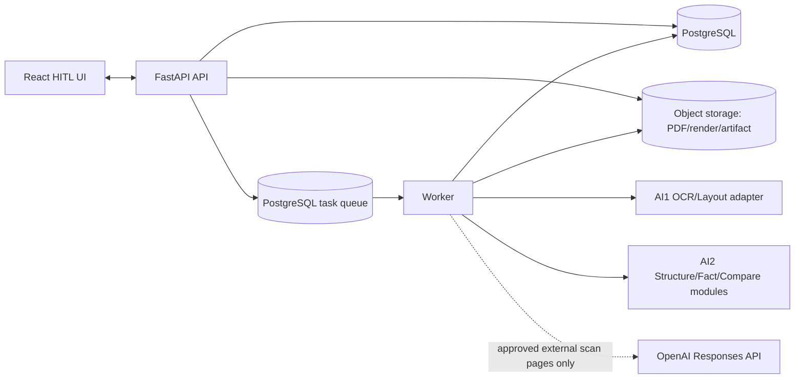
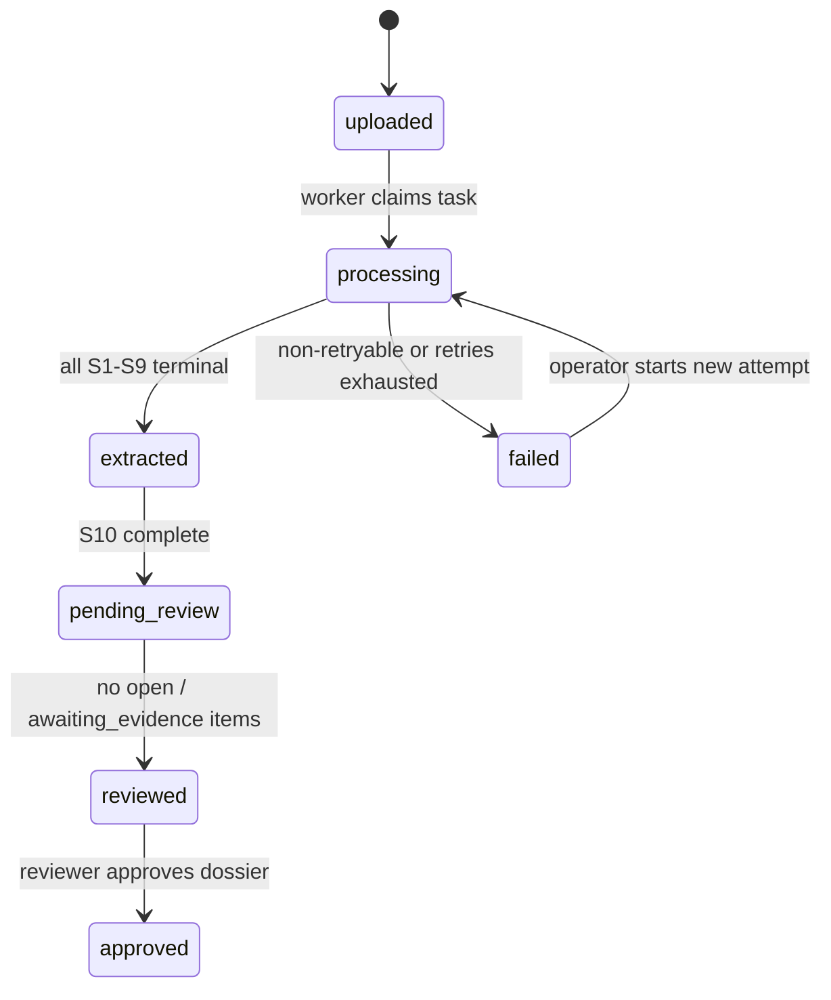

# DOC-04 · Architecture v2 — Contract Intelligence

**Trạng thái:** Proposed — chờ Leader/Mentor accept
**Thay thế:** `architecture.md` khi các quyết định mở ở mục 16 được chấp nhận
**Phạm vi:** MVP xử lý dossier gồm một hợp đồng và 0..n phụ lục: OCR/provenance, cấu trúc điều khoản, fact, comparison, review HITL và audit.

## 1. Mục tiêu, ranh giới và nguyên tắc

Hệ thống phát hiện khác biệt kỹ thuật trong hợp đồng/phụ lục; không kết luận hiệu lực pháp lý. Một finding chỉ được hiển thị là conflict khi hai phía có evidence truy vết được.

Nguyên tắc bắt buộc:

1. **Dossier là aggregate.** Một `dossier` có đúng một `contract` và 0..n `annex`; so sánh chỉ chạy trong dossier.
2. **No source, no conclusion.** Thiếu provenance hoặc geometry phù hợp tạo `needs_evidence`/`insufficient_evidence`, không tạo conflict.
3. **Raw text là source of truth cho offset.** Không NFC, trim, format lại hay thay line break trước khi tạo citation.
4. **Machine result bất biến.** Re-OCR/rerun sinh snapshot/run mới; review là revision append-only.
5. **Geometry có nguồn.** Bbox `native`/`detector` khác `line_only`/`estimated`; loại ước lượng không được tính pass trong word-level audit.
6. **AI2 không tự bịa OCR geometry.** AI2 chỉ tiêu thụ geometry từ AI1 hoặc đánh dấu thiếu evidence.

## 2. Ownership

| Phần | Owner | Deliverable |
|---|---|---|
| Upload, auth, storage, queue, DB, API | Backend | Dossier/job/run lifecycle, immutable persistence, access-controlled URI |
| PDF classify, render, OCR, line/word/bbox, snapshot | AI1 | `ai1.snapshot.v1`, source/render digest, page geometry |
| Physical layout/table detection | AI1 | Block/table/row/cell structure và bbox nếu có |
| Clause structure | AI2 | Điều/Khoản/Điểm, region derived/AI1, confidence |
| Fact/citation/context | AI2 | Fact normalized + citation + context gate |
| Annex linking/precedence candidate | AI2 | `annex_link`, evidence, validity gate |
| Comparison/finding | AI2 | Structured + semantic finding, dispositions, two sides |
| Review policy/priority | AI2 | Rules tạo review item, severity, needs-evidence workflow |
| Review UI/bbox edit | Frontend + Backend | Overlay theo CPS, append-only revision |

## 3. Container architecture



MVP là modular monolith. `api` và `worker` dùng chung image; queue dùng bảng PostgreSQL với claim atomically bằng `FOR UPDATE SKIP LOCKED`. Không cần broker, Kubernetes hay microservice.

## 4. Dossier, job và run lifecycle



| Entity | Invariants |
|---|---|
| `dossier` | Exactly one document role `contract`; 0..n role `annex`. |
| `document` | Immutable source bytes addressed by `source_digest`; `role` set by operator/intake, never inferred from filename. |
| `pipeline_run` | Immutable configuration snapshot, git SHA, input snapshot IDs, timestamps and status. Rerun creates a new row. |
| `task` | Has idempotency key `(run_id, step, document_id?, page_no?)`, attempt count and lease/heartbeat. |
| `job_step` | Transactional checkpoint; output is visible only after the step succeeds. |
| `review_item` | Targets one machine object and has `open`, `awaiting_evidence`, `resolved` state. |

S1-S7 run per document. S8-S10 run only after every document in the dossier has a terminal S7 result. Failed/partial documents are retained; S8-S9 receive their evidence availability explicitly.

## 5. AI1 handoff contract

AI1 MUST deliver [`ai1.snapshot.v1`](docs/ai2/sprint1-planning/AI1-OCR-SNAPSHOT-HANDOFF.v2.md) plus dossier manifest. The adapter validates both JSON Schemas before any AI2 processing.

### 5.1 Required mapping

| AI1 field | Internal field | Rule |
|---|---|---|
| `snapshot_id` | `ocr_snapshot.id` | Immutable; citation always carries it. |
| `source_digest` | `document.source_digest` | SHA-256 of original PDF bytes. |
| `page_image_ref.uri` + digest | `page.render_uri` + `render_digest` | URI is authorized; digest identifies exact image. |
| `TEXT_LAYER/SCANNED_OCR/MIXED` | same enum | Do not accept legacy `SCANNED`. |
| `lines[]`, `words[]` | `ocr_line`, `ocr_word` | IDs and spans preserve raw source text. |
| `bbox_normalized` | `bbox` in CPS | `[x0,y0,x1,y1]`, upright page, top-left origin. |
| `warnings/error/status` | `page_evidence_status` | Governs whether facts can be cited. |

The legacy Feddy JSON is not an AI1 snapshot: it has text but no snapshot/digest, no source render, no line/word arrays and no geometry. It may be stored as a diagnostic artifact only; it MUST NOT enter comparison as cited evidence.

### 5.2 Canonical Page Space (CPS)

All persisted bboxes are normalized in the upright rendered page frame:

```text
bbox = [x0, y0, x1, y1]
0 <= x0 < x1 <= 1; 0 <= y0 < y1 <= 1
origin = top-left
frame = page_image_ref after applying rotation exactly once
```

The page record retains source dimensions, CropBox/rotation, render dimensions, render digest and transform metadata. UI multiplies normalized coordinates by the dimensions of the exact render it displays.

## 6. OCR evidence and text offset contract

### 6.1 Raw and search text

`ocr_line.raw_text` is immutable UTF-8 OCR output. `line_char_start/end` and every citation span use Unicode code points, 0-based, end-exclusive, on this raw text.

`search_text_nfc` MAY be generated for matching only. It MUST retain a mapping to raw positions; it MUST NOT be used as `text_basis` for citation. Tests include combining accents and `A😀B` where `[1,2)` selects only 😀.

### 6.2 Geometry quality

| `geometry_status` | Allowed bbox sources | Citation/audit policy |
|---|---|---|
| `complete` | `native`, `detector` at word/line level | Eligible for word/line audit. |
| `line_only` | `native`, `detector` at line level | Eligible for line citation only; not word IoU. |
| `absent` | none | Page must be `PARTIAL`; no evidence-backed fact/finding. |
| `estimated` | derived geometry | May render with dashed UI indicator; never counted as measured OCR/bbox pass. |

Each `ocr_word`/`ocr_line` carries `bbox_source`, `confidence` (`null` if unavailable), and `geometry_status`. Engine confidence MUST NOT be invented. A page with missing geometry has status `PARTIAL` and warning `missing_line_geometry`/`missing_word_geometry`, not `SUCCESS`.

## 7. Data model

Core tables are append-only for machine outputs: `ocr_snapshot`, `ocr_line`, `ocr_word`, `doc_table`, `table_cell`, `clause_node`, `clause_region`, `fact`, `citation`, `annex_link`, `finding`, `finding_side`. Backend application role cannot update/delete them.

### 7.1 Citation

```json
{
  "citation_id": "cit_01",
  "snapshot_id": "ocr-20260916-001-contract",
  "document_id": "doc-contract-01",
  "source_digest": "sha256:...",
  "segments": [
    {
      "page_no": 1,
      "line_id": "doc-contract-01:s1:p001:l002",
      "char_start": 21,
      "char_end": 38,
      "word_ids": ["doc-contract-01:s1:p001:w0012"],
      "bbox_refs": ["bbox-line-2"],
      "bbox_source": "detector"
    }
  ],
  "quote": "1.000.000 VND/lần",
  "offset_unit": "unicode_code_point_0_based_end_exclusive",
  "render_digest": "sha256:..."
}
```

On INSERT, the service validates every reference, range, raw substring and bbox. A fuzzy matcher may locate a candidate source span, but persisted `quote` MUST be the exact raw source substring, never the model's approximate quote.

### 7.2 Fact and context

```json
{
  "fact_id": "fct-01",
  "business_role": "unit_price",
  "entity_type": "money",
  "raw_value": "1.000.000 VND/lần",
  "normalized_value": { "amount": 1000000, "currency": "VND", "unit": "lần" },
  "context": {
    "subject": "DV-A",
    "unit": "lần",
    "currency": "VND",
    "tax_basis": "unknown",
    "applicability_scope": "DV-A",
    "validity_start": "2026-09-01",
    "validity_end": null,
    "context_origin": "source_rule"
  },
  "citation_id": "cit_01",
  "validation_status": "passed"
}
```

`context_origin` is `source_rule`, `manual` or `unknown`. AI2 MUST NOT compare facts as equivalent unless required comparison context is known or explicitly compatible.

### 7.3 Finding and sides

```json
{
  "finding_id": "fnd-01",
  "finding_type": "structured",
  "comparison_scope": "contract_annex",
  "disposition": "candidate_amendment",
  "severity": "high",
  "left_fact_id": "fct-contract",
  "right_fact_id": "fct-annex",
  "left_citation_id": "cit-contract",
  "right_citation_id": "cit-annex",
  "precedence_evidence": ["cit-amendment-reference"],
  "method": "rule:money_compare@1",
  "rule_version": "compare.v1"
}
```

Both sides MUST have independent citations. `review_state` is not a machine disposition and is stored only in review revisions.

## 8. Pipeline S0–S10

| Step | Scope | Owner | Input → output |
|---|---|---|---|
| S0 Ingest | dossier | Backend | PDF/upload metadata → dossier, document, task |
| S1 Classify | page | AI1 | PDF page → TEXT_LAYER/SCANNED_OCR/MIXED |
| S2 Render | page | AI1 | source page → canonical render + digest + CPS metadata |
| S3 Preprocess | page | AI1 | scan image → preprocessed artifact + reversible transform |
| S4 OCR | page | AI1 | render → validated `ai1.snapshot.v1` lines/words/bboxes/warnings |
| S5 Layout/table | document | AI1 | lines + geometry → blocks/tables/cells when available |
| S6 Structure | document | AI2 | lines/tables → clause tree/regions/provenance |
| S7 Facts | document | AI2 | clauses/cells → typed facts/context/citations |
| S8 Annex link | dossier | AI2 | documents/facts → annex links + evidence |
| S9 Compare | dossier | AI2 | eligible facts/clauses → findings/two sides |
| S10 Review queue | dossier | AI2 policy + Backend | findings/facts → review items and priority |

If S4 data is `PARTIAL`, downstream steps MAY parse raw text but MUST carry `geometry_status`; S7/S9 cannot claim evidence-backed citation without valid geometry.

## 9. Annex linking and comparison

### 9.1 Annex link

AI2 stores link signals and citations, not only one score. Signals include contract number reference, party/tax identifier, explicit title, date and operator declaration. Output is:

`linked`, `linked_needs_review`, or `unlinked`.

Only `linked` or reviewer-confirmed `linked_needs_review` annexes enter `contract_annex` comparison. Versioned weights/thresholds and each signal value are retained in `annex_link`.

### 9.2 Context gate

Before a structured comparison, AI2 checks business role, subject, unit, currency, tax basis, scope and validity. Outcomes:

| Gate result | Disposition |
|---|---|
| Required evidence/geometry/value missing | `insufficient_evidence` |
| Context incompatible or conversion unsupported | `not_comparable` |
| Context compatible, normalized values equal | `comparable_match` |
| Context compatible, normalized values differ | Continue amendment gate |

### 9.3 Amendment gate

`candidate_amendment` requires all conditions:

1. Annex link is eligible.
2. Explicit amendment/reference citation resolves to the target clause/field.
3. Both sides pass context gate.
4. Effective date/validity relation is evidenced and compatible.

Otherwise a value difference is `comparable_difference`; it is never automatically presented as a legal conclusion. UI text is “cần reviewer xác nhận”, not “đang có hiệu lực”.

### 9.4 Semantic comparison

Candidate generation is deterministic and versioned. For every candidate it retains `generation_run_id`, source, score/rank, selection decision and skip reason. `MAX_SEMANTIC_PAIRS` limits cost but skipped pairs remain measurable for candidate recall. LLM output must provide exact source quotes; grounding failure creates `insufficient_evidence`, never a semantic conflict.

## 10. Conflict and Needs Evidence separation

`finding` is the machine record. UI views are separate:

| View | Includes |
|---|---|
| Conflict | `comparable_difference`, `candidate_amendment` |
| Needs evidence | `insufficient_evidence`, missing geometry, failed grounding, unresolved annex link |
| Non-comparable | `not_comparable` for transparency/audit |
| Matches | `comparable_match`, normally hidden from review queue |

Metrics use separate denominators. `insufficient_evidence` MUST NOT increase conflict count, conflict precision or conflict F1.

## 11. HITL and revision concurrency

Machine output is immutable. A review action creates a `review_revision`:

```json
{
  "revision_id": "rev-02",
  "previous_revision_id": "rev-01",
  "target_type": "finding",
  "target_id": "fnd-01",
  "expected_previous_revision_id": "rev-01",
  "actor": "reviewer-01",
  "timestamp": "2026-09-16T10:00:00+07:00",
  "action": "correct",
  "reason": "Annex reference verified",
  "corrected_payload": { "reviewed_disposition": "candidate_amendment" }
}
```

Backend rejects a stale `expected_previous_revision_id` with conflict response; the client reloads/rebases. Bbox correction has `{page_no, bbox, frame: "CPS"}` and is shown separately from machine bbox. Effective value is a deterministic view of the valid revision chain.

## 12. Audit and acceptance

An audit run records: `audit_run_id`, schema/rule version, selected snapshot IDs, source/render digests, auditor, time, case, side, expected/observed values, pass/fail/unverifiable and evidence URI.

| Gate | Pass criterion |
|---|---|
| Source | PDF/render reachable and digest matches snapshot. |
| Snapshot | Manifest and `ai1.snapshot.v1` validate. |
| Span | Unicode slice of raw line equals citation quote. |
| Geometry | Bbox range valid and source is `native`/`detector` for claimed level. |
| Overlay | Citation highlights correct source text on exact render. |
| Cross-document | Two citations and an eligible annex relationship exist. |

Missing inputs are `unverifiable`, not pass. One bad binding fails that binding but does not erase the run. Synthetic fixtures validate integration only and cannot claim real OCR quality.

## 13. Security, cost and observability

- PDF/render access is authenticated and short-lived; tokenized URLs never enter Git or traces.
- Retain `data_classification` and `retention_until`; purge is authorized, writes a tombstone, and removes source/artifacts under the defined retention policy.
- Only approved pages may be sent externally. `EXTERNAL_AI_ENABLED=false` forces local mode.
- Store model ID, prompt/schema version, usage, cache hit and cost per call in `usage_ledger`.
- Cache key includes source/render digest, preprocessing version, engine/model, prompt version, schema version and data classification scope.
- PostgreSQL is the source of truth for KPI; tracing stores redacted identifiers/metrics only.

The current public model reference supports image input and Structured Outputs for `gpt-5.6-terra`; pricing and availability must be checked again before deployment. [Official OpenAI documentation](https://developers.openai.com/api/docs/models/gpt-5.6-terra)

## 14. Test strategy

| Level | Required evidence |
|---|---|
| Contract | JSON Schema validation; ID/ref integrity; enum rejection including legacy `SCANNED`. |
| Offset | Raw text Unicode code-point tests, combining accents, exact quote round-trip. |
| Geometry | Range, transform inverse, rotated pages, source classification, overlay screenshot. |
| Pipeline | Retry/idempotency, crash recovery, partial page propagation, dossier barrier. |
| AI2 | C01–C15 ledger, context gate, amendment gate, semantic candidate skip audit. |
| Review | Append-only history, stale revision rejection, effective view, corrected bbox rendering. |
| Evaluation | OCR/CER/WER, geometry IoU by source, citation accuracy, conflict F1 and separate Needs-evidence rate. |

## 15. Delivery sequence

1. AI1 delivers a complete contract+annex synthetic dossier in `ai1.snapshot.v1`, including renders/digests.
2. Backend implements schema validation and immutable snapshot/run persistence.
3. AI2 implements S6–S9 against the adapter, C01–C15 and the context/amendment gates.
4. Frontend implements citation resolver and CPS overlay; joint team runs ST-020 audit.
5. Only after audit evidence exists does the team report citation/bbox quality or move ST-020 to Done.

## 16. Decisions requiring acceptance

| Decision | Owner | Required decision |
|---|---|---|
| External AI use | Mentor/Leader | Which data classifications may go to OpenAI. |
| Geometry provider | AI1 + AI2 | Detector/engine and minimum `complete`/`line_only` coverage. |
| Annex precedence | Leader/Reviewer | Business rule; machine remains candidate only. |
| Fact taxonomy/context | AI2 + Backend | Versioned schema and normalizers. |
| Retention/access | Backend + Mentor | URI authorization and purge duration. |
| Acceptance threshold | Leader/Mentor | Dataset, sample size and thresholds for OCR/citation/conflict metrics. |
