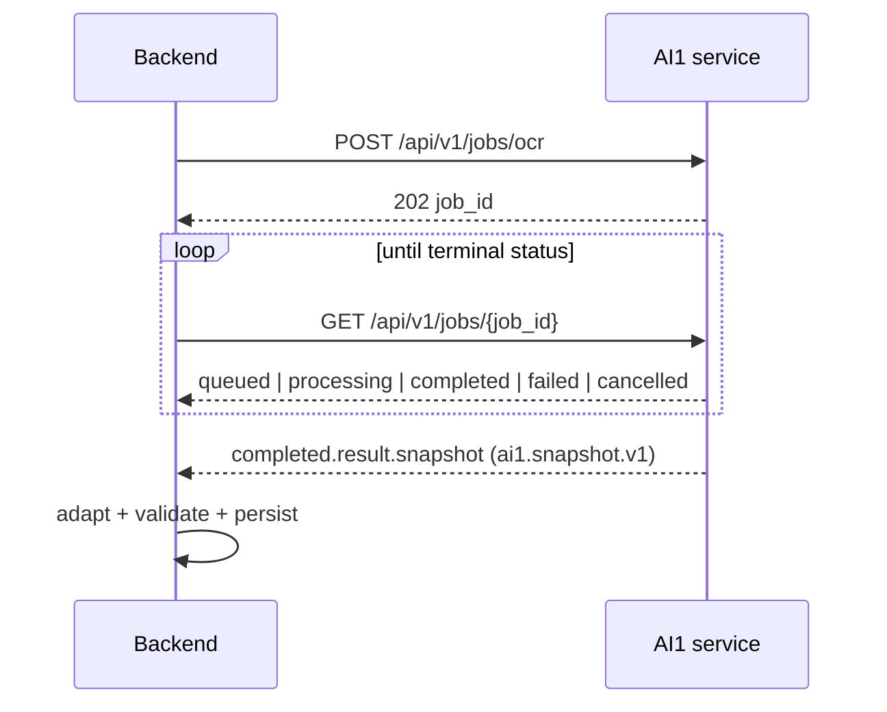

# AI1 OCR ↔ Backend integration

## Ownership

| Thành phần | Trách nhiệm |
|---|---|
| Backend | xác thực người dùng, tạo pipeline task, cấp URL PDF/render ngắn hạn, polling, lưu kết quả |
| AI1 `ai-service` | tải PDF từ URL đã cấp, OCR/layout/table reconstruction, tạo `ai1.snapshot.v1` |
| Frontend | chỉ gọi backend Swagger/API; không gọi AI1 trực tiếp trong luồng nghiệp vụ |

## HTTP contract

`source_blob_get_url` is a short-lived PDF download URL. AI1 verifies the bytes
against `source_sha256` before processing. `render_target.presigned_put_urls`
is optional: when present, AI1 uploads rendered PNGs; otherwise it emits the
`render_artifact_not_uploaded` page warning.

## Local verification

1. Run AI1 on port 8001 with `uv run --extra web uvicorn contract_ocr.web.app:app --port 8001`.
2. Configure backend with `AI_SERVICE_MODE=http` and `AI_SERVICE_URL=http://127.0.0.1:8001`.
3. Start backend on port 8000 and open `http://127.0.0.1:8000/docs`.
4. Confirm `GET /api/v1/readyz` reports `ai_service_ok: true`.

AI1 owns OCR only. The bridge does not claim to provide AI2 extraction or
comparison jobs; those endpoints stay disabled until their responsible service
implements their respective contracts.
