# AI2 · IDP và Optimization Pipeline

AI2 không OCR lại PDF, không suy role contract/annex từ filename, không tạo bbox OCR, và không đưa ra kết luận pháp lý. Đầu vào mới là `ai1.snapshot.v3` đã qua schema/provenance validation. AI2 có thể phát **EvidenceGapDetected** có mục tiêu khi thiếu evidence, nhưng không được tự sửa OCR hay gọi AI1 trực tiếp.

```mermaid
flowchart LR
    SRC[Source PDF] --> ORCH[Spring Orchestrator<br/>fan-out / quota / audit]
    ORCH --> AI1[AI1 page OCR/layout<br/>parallel + bounded concurrency]
    AI1 --> SNAP[AI1 Snapshot v3<br/>raw line/word · bbox · language · render digest]
    SNAP --> VAL[Spring Snapshot Gate<br/>schema · provenance · ledger]
    MAN[Confirmed Dossier Manifest<br/>contract · annex · relation] --> VAL
    VAL -->|ValidatedSnapshotPublished| ST[AI2 Structure Engine<br/>Điều · Khoản · Điểm]
    VAL -->|missing/invalid evidence| EQ[Evidence Queue<br/>PARTIAL / QUARANTINED]

    ST --> TB[Table + Reading-order Binding]
    TB --> FX[Fact Extraction<br/>raw value · typed value]
    FX --> CTX[Normalizer + Context Gate<br/>subject · unit · currency · VAT · scope · validity]
    CTX --> CIT[Citation Builder<br/>raw span · line/word/table refs]
    CIT --> AL[Annex Link Candidate]
    AL --> PAIR[Deterministic Pair Generator]
    PAIR --> CMP[Structured Comparator]
    CMP --> SEM[Semantic Candidate<br/>approved-only · grounded]

    SEM --> D{Evidence + context valid?}
    D -->|two valid sides| CF[Conflict / Amendment Candidate]
    D -->|evidence missing| NE[Needs Evidence]
    D -->|context incompatible| NC[Not Comparable]

    CF --> RI[Review Item]
    NE --> GAP{Evidence gap can be targeted?}
    NC --> RI
    GAP -->|no / budget exhausted| RI
    GAP -->|yes| RQ[AI2 EvidenceGapDetected<br/>target · reason · evidence refs]
    RQ --> GUARD[Spring persists ReOcrRequest<br/>schema · idempotency · repair policy · finite budget]
    GUARD -->|local approved| AI1
    GUARD -->|external review / denied| RI
    SNAP --> DEP[Dependency graph]
    DEP --> INV[Selective invalidation]
    INV --> ST
    RI --> REV[Append-only Review Revision<br/>confirm · correct · reject · request evidence]

    subgraph OPT["AI2 Optimization Loop — DEV only"]
        GOLD[Adjudicated DEV Gold<br/>facts · citations · dispositions]
        BASE[Baseline AI2 Config<br/>rules · normalizer · pair policy]
        RUN[Paired Evaluation]
        SCORE[Metric Engine<br/>fact/citation/context/F1]
        ERR[Redacted Error Slices]
        AGENT[Optimizer Sandbox<br/>typed candidate patch]
        CAND[Immutable Candidate Config]

        GOLD --> RUN
        BASE --> RUN
        RUN --> SCORE
        SCORE --> ERR
        ERR --> AGENT
        AGENT --> CAND
        CAND --> RUN
    end

    CAND -. only after sealed evaluation + approval .-> BASE

    style EQ fill:#fff1f1,stroke:#c34c4c
    style NE fill:#fff8e1,stroke:#c89820
    style NC fill:#f4f4f4,stroke:#777
    style OPT fill:#edf5ff,stroke:#4c81b8
```

## Vòng reasoning AI2 ↔ AI1

1. AI1 tạo snapshot theo từng trang. Một hợp đồng 50 trang được schedule thành page task có giới hạn concurrency; AI2 không cần chờ một prompt chứa toàn bộ tài liệu.
2. AI2 chỉ kết luận khi fact và context có citation resolve được. Tín hiệu như OCR quality thấp, số tiền/mã số mơ hồ, geometry thiếu, cell bảng không bind được, clause nối qua trang hoặc evidence hai nguồn bất nhất được ghi thành evidence gap.
3. Với gap có thể khoanh vùng, AI2 phát `evidence-gap-event.v2`: snapshot cha, document, tối đa một page hoặc cặp page, region nếu có, reason, coverage requirement, evidence/artifact refs, priority và repair suggestion. Spring tạo `reocr-request.v3`; đây là request có thể kiểm tra, không phải text correction.
4. Spring là enforcement point: xác thực request, gộp duplicate, chọn action `REGION_RESCAN`/`PAGE_PAIR_CONTEXT`/`OUTPUT_SPLIT`, áp quota/attempt/submission và chỉ chọn profile OCR local trong allowlist. `EXTERNAL_REVIEW_REQUIRED` luôn dừng tại `AWAITING_EXTERNAL_REVIEW`; chỉ approval grant đã audit mới chuyển thành `EXTERNAL_APPROVED` để schedule.
5. AI1 phát snapshot revision mới thay vì ghi đè. Dependency graph tính lại đúng clause/fact/citation/comparison/finding bị ảnh hưởng; review và result cũ vẫn được pin snapshot lịch sử.

## Chống hallucination cho tài liệu dài

- Không dùng OCR text như một nguồn đúng tuyệt đối: fact trọng yếu cần raw span, quote và geometry/reference hợp lệ.
- Page `PARTIAL` hoặc `FAILED` không được lấp bằng ngữ cảnh từ trang khác; kết quả là `Needs Evidence`, `Not Comparable` hoặc review.
- Re-OCR ưu tiên `region → page → page-pair`; lý do cross-page phải chỉ ra trang liền kề và artifact bị ảnh hưởng.
- Page ledger là `PENDING | PROCESSING | COMPLETED | BLANK_VERIFIED | NEEDS_REVIEW | FAILED`; chỉ `COMPLETED`/`BLANK_VERIFIED` evidence-eligible. Chunk chỉ final khi mọi continuation cần thiết evidence-eligible. AI2 không publish conclusion từ coverage thiếu.
- Mọi retry giữ execution/config provenance. Mặc định tối đa 3 transport attempts, 1 quality repair/logical target, 4 provider submissions, 4 crop con và depth 1. Hết ngân sách hoặc không có local profile phù hợp thì dừng tự động, nêu rõ thiếu evidence cho reviewer.

## Nguyên tắc AI2

- `Conflict` chỉ xuất hiện khi hai phía có citation/evidence hợp lệ; thiếu evidence luôn vào `Needs Evidence`.
- AI2 không sở hữu OCR text/bbox và không có public OCR credential; nó chỉ emit internal event đã audit. Operator chỉ retry/cancel request do Spring sở hữu.
- Snapshot cũ, citation cũ và review cũ không bị sửa sau re-OCR; snapshot revision có `parent_snapshot_id` và page revision lineage.
- Candidate amendment là cảnh báo kỹ thuật, không chọn văn bản có hiệu lực.
- Mọi `Fact`, `Citation`, `Finding` và run đều pin snapshot, manifest, rule/config version.
- Optimizer AI2 chỉ thay rules, normalization, pair policy hoặc prompt-template ID trong allowlist; không đọc raw holdout, không tự promotion và không thay đổi production config.
