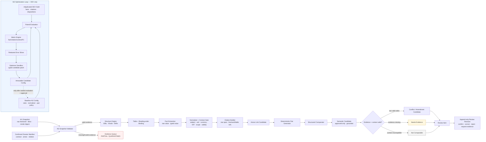

# AI2 · IDP và Optimization Pipeline

AI2 không OCR lại PDF, không suy role contract/annex từ filename, không tạo bbox OCR, và không đưa ra kết luận pháp lý. Đầu vào bắt buộc là `ai1.snapshot.v1` đã qua schema/provenance validation.

## Nguyên tắc AI2

- `Conflict` chỉ xuất hiện khi hai phía có citation/evidence hợp lệ; thiếu evidence luôn vào `Needs Evidence`.
- Candidate amendment là cảnh báo kỹ thuật, không chọn văn bản có hiệu lực.
- Mọi `Fact`, `Citation`, `Finding` và run đều pin snapshot, manifest, rule/config version.
- Optimizer AI2 chỉ thay rules, normalization, pair policy hoặc prompt-template ID trong allowlist; không đọc raw holdout, không tự promotion và không thay đổi production config.
