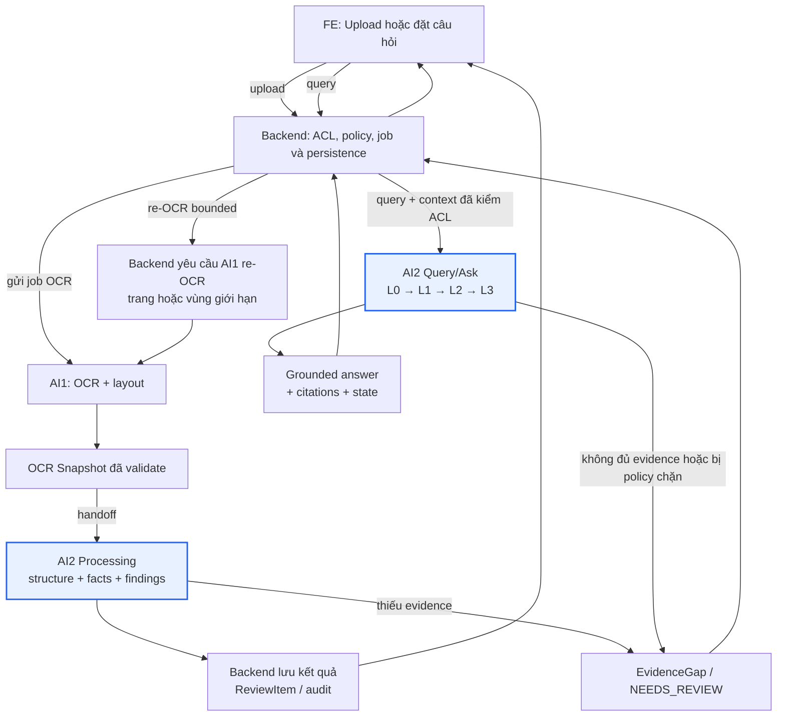

# AI2 — Hướng xử lý và vấn đề hiện tại

**Ngày:** 24/09/2026  
**Vai trò:** AI2 — Semantics & Reasoning

## 1. AI2 chịu trách nhiệm gì?

AI2 không làm OCR và không tự đọc PDF gốc. AI2 nhận `OCR Snapshot` đã được AI1 tạo và Backend validate, sau đó tạo ra kết quả có evidence để Backend và reviewer quyết định.

AI2 không tự kết luận pháp lý, không chọn `legal winner` và không tự publish active index.

## Sơ đồ tổng quan



**Nguyên tắc:** AI2 chỉ xử lý snapshot/query đã qua Backend; AI2 không gọi OCR trực tiếp. `EvidenceGap` quay về Backend để Backend quyết định re-OCR, không phải AI2 tự sửa hoặc đoán evidence.

## 2. Quy trình xử lý chính

### Processing path

```text
AI1 OCR Snapshot
  → validate schema/digest/quality
  → dựng cây body/annex/clause/table
  → dựng relation graph
  → trích xuất typed fact + citation
  → pair fact giữa body và annex
  → tạo CandidateFinding/IndexContribution(propose)
  → trả Backend persist và tạo ReviewItem
```

Nếu snapshot, bảng hoặc citation không đủ tin cậy, AI2 trả `NEEDS_REVIEW`, `INSUFFICIENT_EVIDENCE` hoặc `EvidenceGap`; không tự đoán dữ liệu. Backend sẽ quyết định có yêu cầu AI1 re-OCR hay không.

### Query/Ask path

```text
FE gửi câu hỏi
  → Backend kiểm ACL/policy
  → AI2 classify intent
  → L0 deterministic
  → L1 retrieval
  → L2 planner nếu query là compare/cascade
  → L3 grounding và kiểm citation
  → trả answer + citations + state cho Backend
```

AI2 chỉ trả `ANSWERED` khi citation tồn tại, đúng snapshot và khớp evidence. Nếu không đủ nguồn thì trả `INSUFFICIENT_EVIDENCE`; nếu bị policy chặn thì trả `BLOCKED`.

### Embedding và vector retrieval

Embedding là lớp hỗ trợ tìm kiếm ngữ nghĩa trong L1. AI2 chuyển clause/fact thành vector khi lập index; khi người dùng đặt query, AI2 chuyển query thành vector và tìm các node có ý nghĩa gần nhất.

```text
Clause/fact → embedding vector → vector index
Query       → embedding vector → tìm candidate gần nhất
                                      ↓
                           L3 kiểm citation/evidence
```

Embedding giúp tìm đúng nội dung khi cách hỏi khác cách viết trong hợp đồng, nhưng chỉ tạo **candidate retrieval**. Nó không tự tạo câu trả lời, không tự xác định conflict và không thay thế citation. Nếu embedding bị tắt, lỗi provider hoặc vượt budget, AI2 fallback về exact search → structured search → BM25 → `NEEDS_REVIEW`/`INSUFFICIENT_EVIDENCE`.

## 3. Hướng giải quyết đề xuất

1. Chốt một canonical snapshot contract giữa AI1–Backend–AI2, gồm version, digest, page/node/table/citation và quality state.
2. Tách AI2 khỏi upload/OCR trực tiếp; AI2 chỉ nhận snapshot đã validate từ Backend.
3. Chuẩn hóa hai job AI2 theo contract: extraction và comparison, trả output có schema, citation, evidence gap và review state.
4. Giữ query pipeline L0 → L1 → L2 → L3, trong đó L3 là bắt buộc trước khi trả lời.
5. Dùng embedding như lớp bổ sung trong L1 để tăng semantic recall; mọi vector hit vẫn phải qua L3 kiểm citation và evidence.
6. Dùng fixture/golden set để kiểm thử fact, citation, body–annex finding, query và các trường hợp thiếu evidence.
7. Tích hợp kết quả với Backend để persist, audit, review và re-OCR; không để AI2 ghi business data trực tiếp.

## 4. Vấn đề hiện tại

- Code hiện tại vẫn có demo `POST /api/ai2/analyze` nhận PDF, tự chạy OCR rồi mới chạy AI2. Đây chưa phải boundary production của AI2.
- AI2 job extraction/comparison qua Backend chưa hoàn tất end-to-end; contract đã được mô tả nhưng service adapter, job lifecycle và persistence cần ghép đầy đủ.
- Tài liệu hiện có dấu hiệu chưa thống nhất version snapshot (`ai1.snapshot.v1` và `ai1.snapshot.v3`); cần mentor/Backend chốt một version làm nguồn chuẩn.
- LLM, embedding provider và vector store production chưa được chốt; hiện chỉ có cấu hình local/demo.
- Chưa nên claim accuracy production nếu chưa có golden set được duyệt, denominator và benchmark có provenance.

## 5. Quyết định cần mentor xác nhận

1. Canonical snapshot version sẽ là version nào?
2. AI2 production nhận job qua HTTP hay Kafka, và Backend contract nào là authoritative?
3. LLM/embedding provider nào được phép dùng, trong điều kiện egress và budget nào?
4. Golden set và tiêu chí pass tối thiểu cho extraction, comparison và Query/Ask là gì?

**Mục tiêu gần nhất:** hoàn thành một vertical slice từ validated snapshot → AI2 processing → Backend persist/review và một query có citation được grounding đầy đủ.
