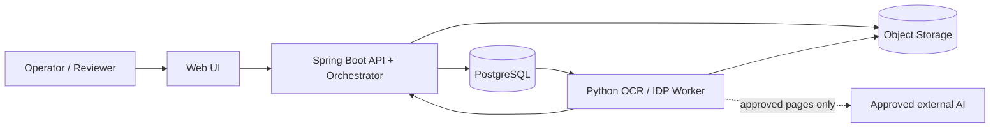
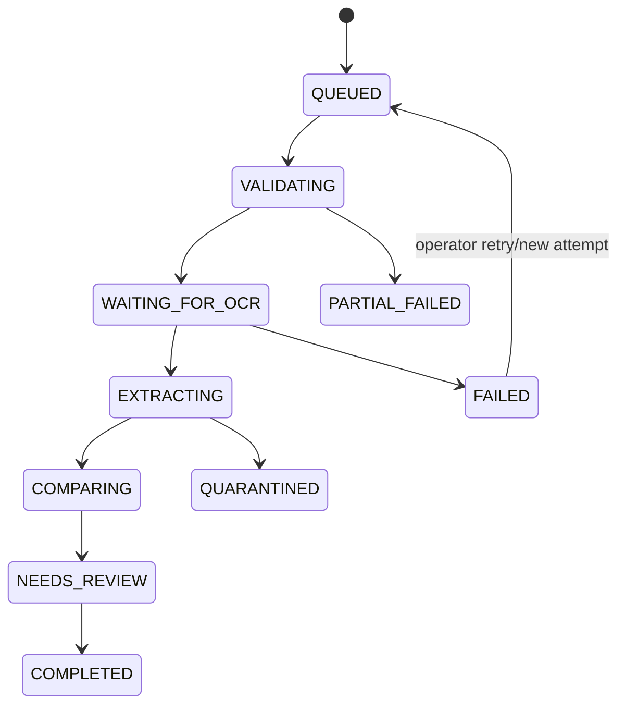
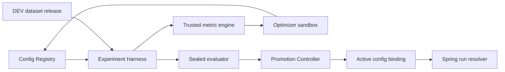

# DOC-04 · Architecture — Contract Intelligence

| Thuộc tính | Giá trị |
|---|---|
| Trạng thái | Proposed — chờ Leader/Mentor phê duyệt trước product code |
| Nguồn chuẩn | Architecture/SAD duy nhất của repository |
| Phạm vi MVP | Một dossier: đúng một hợp đồng và 0..n phụ lục; OCR, IDP, review có bằng chứng |
| Ngoài phạm vi | Kết luận/tư vấn pháp lý, tự xác lập hiệu lực phụ lục, training foundation model |

## 1. Quy ước và hiện trạng

Tài liệu này thay thế thiết kế contract đơn lẻ trước đây. Các bản `architecture.md`, `architecture.v2.md` và draft trong `docs/ai2/sprint1-planning/` là input/historical, không được dùng để chọn stack, queue, API hoặc data contract.

Repository chưa có runtime backend, worker, migration hay deployment đã triển khai. Mọi nội dung dưới đây là thiết kế đích, không phải tuyên bố production-ready.

`690758295-Scan-HỢP-ĐỒNG-Feddy.ocr.json` là OCR legacy chỉ có text. Nó thiếu source/render digest, snapshot ID, raw line/word refs và geometry, đồng thời có thể chứa PII. Artifact bị cấm làm citation, fact evidence, finding, fixture hoặc telemetry input. Chỉ source gốc được quyền re-OCR vào snapshot chuẩn sau khi qua policy dữ liệu.

## 2. Quyết định kiến trúc

| ADR | Quyết định |
|---|---|
| ADR-01 | Java 17+/Spring Boot là public API, RBAC, domain, persistence, orchestration và read-model owner. |
| ADR-02 | Python là OCR/IDP worker nội bộ; không là public authority và không ghi trực tiếp business tables. |
| ADR-03 | PostgreSQL là system of record và task queue MVP; không dùng đồng thời Redis/Celery/callback queue. |
| ADR-04 | Object storage qua port/adapter: filesystem local cho dev, S3-compatible khi triển khai. DB chỉ lưu metadata, digest và URI nội bộ. |
| ADR-05 | Local-first OCR/layout. Egress tới OCR/LLM ngoài tắt mặc định và chỉ mở khi policy, consent và Gate B cho phép. |
| ADR-06 | Snapshot, machine result và run bất biến; review là revision append-only với optimistic concurrency. |
| ADR-07 | Rules/normalizer tạo fact và so sánh có cấu trúc trước; LLM semantic chỉ tạo candidate có grounding, không kết luận pháp lý. |

## 3. Context và ownership



| Thành phần | Sở hữu | Không được làm |
|---|---|---|
| Spring API | dossier/manifest, auth, storage authorization, tasks/runs, validation, persistence, audit, review | Tự suy luận nội dung hoặc legal outcome |
| Python worker | classify, render, OCR/layout, structure, fact, comparison candidate | Suy role từ filename, quyết định quyền hoặc mutate canonical domain |
| Web UI | upload, manifest confirmation, evidence overlay, review/rebase UX | Tự tính provenance hoặc ghi đè machine output |
| Reviewer | confirm/correct/reject/request evidence | Biến candidate kỹ thuật thành legal decision ngoài policy |

## 4. Dossier, source và lifecycle

`Dossier` là đơn vị xử lý. Manifest bất biến theo version chứa đúng một `CONTRACT`, 0..n `ANNEX`, actor xác nhận, relation/effective date và evidence của relation nếu có. Hệ thống có thể gợi ý role/liên kết từ nội dung, nhưng operator phải xác nhận trước comparison liên tài liệu. Dossier một hợp đồng được OCR/extract bình thường; cross-document comparison bị `BLOCKED_MANIFEST`.

1. Spring kiểm magic-byte/MIME, AV, mật khẩu PDF, page/size/time limits; stage source, tính SHA-256 và phân loại dữ liệu.
2. Sau khi source đọc được và digest khớp, Spring transactionally tạo document version, manifest/run và outbox task.
3. Worker xử lý page/document; mọi artifact có URI nội bộ, SHA-256 và version producer.
4. Spring semantic-validate artifact, persist machine result bất biến và phát task phụ thuộc kế tiếp.
5. Retry giữ cùng run/config/input; re-OCR, đổi manifest/config/rule tạo snapshot/run mới. Bản cũ vẫn audit được.



`PARTIAL_FAILED` giữ evidence đọc được nhưng không tạo positive comparative claim từ nguồn thiếu. `QUARANTINED` giữ JobAttempt/error để operator xử lý, không làm job biến mất.

## 5. Queue, idempotency và recovery

- `task` có key unique `(run_id, step, scope_key)`; `scope_key` luôn NOT NULL để tránh uniqueness sai với NULL.
- Worker claim atomically bằng `FOR UPDATE SKIP LOCKED`, nhận `lease_token`; heartbeat/complete/reap đều điều kiện theo token và attempt.
- Spring là owner state: worker chỉ trả `{task_id, attempt_no, lease_token, artifact_uri, artifact_sha256, schema_version}` qua internal authenticated endpoint.
- Dispatcher chỉ phát S6–S10 khi prerequisite terminal; S8–S10 áp dụng barrier theo dossier.
- Retry bounded exponential backoff+jitter; idempotency provider/usage ledger theo task attempt; hết retry vào quarantine/dead-letter.
- Upload dùng staged object + digest + outbox; reconciler phát hiện blob orphan/document thiếu blob. Không giả định DB và object storage có transaction chung.

## 6. OCR/layout pipeline S0–S5

| Bước | Owner | Kết quả |
|---|---|---|
| S0 Intake | Spring | Source immutable, manifest, classification, run/task |
| S1 Classify | Python | `TEXT_LAYER`, `SCANNED_OCR` hoặc `MIXED`; quality warnings |
| S2 Render | Python | Upright render, dimensions, digest, CropBox/rotation/transform |
| S3 Preprocess | Python | Reversible/versioned transform và quality signals |
| S4 OCR | Python | Native text hoặc local OCR/layout; external route chỉ nếu policy cho phép |
| S5 Layout | Python | Reading order, blocks, table/row/cell, geometry provenance |

Native text layer chỉ dùng khi usable; hidden OCR, mojibake, image coverage và chất lượng thấp phải route lại. Hybrid recognition chỉ cấp word evidence khi text-to-detector alignment exact, persisted và có algorithm version. Không nội suy bbox theo số ký tự.

### Canonical Page Space (CPS)

Mọi bbox persisted là `[x0, y0, x1, y1]`, normalized 0..1, origin top-left, trên exact upright render sau rotation đúng một lần. Page giữ render/source digest, dimensions, transform và polygon nếu source có polygon. `bbox_source` là `native`, `detector`, `derived`, `human`, `line_only` hoặc `absent`; `geometry_status` biểu đạt coverage. Engine confidence có thể `null`; alignment/quality score là trường derived riêng, không được giả làm engine confidence.

## 7. Snapshot, provenance và citation contract

Mọi OCR output phải đạt [`ai1.snapshot.v1`](contracts/ai1.snapshot.v1.schema.json) và semantic validator trước khi vào IDP. Snapshot có source/render digest, schema/engine/model/prompt/preprocess/config version, pages, raw text/digest, line/word IDs, geometry, table refs, status/warnings/errors và lineage. Các invariant liên-field nằm trong [contract notes](contracts/README.md) và phải được Spring thực thi trước persist.

Citation component chứa `snapshot_id`, source/render digest, document/page, `line_id`, `char_start`, `char_end`, word/bbox refs và exact quote. Offset là Unicode code point, 0-based/end-exclusive trên raw UTF-8 line text; không NFC, trim hay thay line break trước khi cite. Search text được phép normalize nhưng phải có mapping về raw span.

Validator reject schema không hỗ trợ, digest mismatch, stale/missing reference, bbox ngoài CPS, span không round-trip exact quote, word/line/table reference sai hoặc legacy text-only output. Cross-language fixtures bắt buộc gồm `A😀B`, dấu tiếng Việt composed/decomposed, CRLF và token lặp.

## 8. IDP pipeline S6–S10

| Bước | Hành vi |
|---|---|
| S6 Structure | Rules-first Điều/Khoản/Điểm, coverage/hierarchy validation; fallback chỉ trả source IDs/ranges |
| S7 Facts | Typed raw + normalized value, context, exact citations; ambiguous value giữ raw và lý do |
| S8 Annex link | Signals + citation; không suy từ upload order/filename |
| S9 Compare | Context gate, deterministic candidate pair, structured first rồi semantic candidate approved-only |
| S10 Review | Tách Conflict, Needs evidence và Not comparable; ưu tiên reviewer |

Context gate kiểm subject, unit, currency, tax/VAT basis, scope và validity. Thiếu evidence trả `insufficient_evidence`; context không tương thích trả `not_comparable`. `candidate_amendment` cần relation/reference, wording sửa đổi, compatible scope/context và effective evidence; luôn là candidate kỹ thuật.

`comparison_candidate`/`evidence_binding` lưu cả nguồn thiếu hoặc invalid. Chỉ finding `comparable_difference`/`candidate_amendment` có hai bindings hợp lệ mới vào Conflict. Không trộn Needs evidence vào conflict metric hoặc queue.

## 9. Mô hình dữ liệu

| Nhóm | Entity chính |
|---|---|
| Intake | `dossier`, `document`, `document_version`, `dossier_manifest`, `manifest_document` |
| Execution | `pipeline_run`, `task`, `job_attempt`, `outbox_event`, `usage_ledger` |
| Evidence | `ocr_snapshot`, `page_snapshot`, `ocr_line`, `ocr_word`, `layout_block`, `doc_table`, `table_cell` |
| IDP | `clause_node`, `clause_region`, `fact`, `citation`, `annex_link`, `comparison_candidate`, `finding`, `finding_side` |
| HITL | `review_item`, `review_revision`, `effective_review_view` |

Machine tables append-only. DB constraints và application validator kiểm foreign reference, exact span, source/render digest và immutable lineage trước persist. Review có `expected_previous_revision_id`; stale request trả `409`, UI reload/rebase. Bbox correction là human overlay trên snapshot cụ thể, không sửa bbox machine hoặc metric machine.

## 10. API và internal worker boundary

Public API được mô tả trong `DOC-05-api-spec.yaml`: dossier creation/upload, manifest confirmation, status/run, evidence/finding queries, rerun/re-OCR và review revision. API không expose raw object URI công khai; evidence render dùng authorized short-lived access.

Internal worker result endpoint yêu cầu service authentication, task attempt và lease token. Không dùng `callback_url` do client cung cấp, public `file_url`, temporary clause IDs hoặc worker-owned Redis lifecycle.

## 11. Security, privacy và observability

- Classification, tenant authorization và external-route policy được kiểm trước render/egress; default là deny.
- External request chỉ chứa page/crop tối thiểu đã approved; provider/model/region/retention được allowlist và ghi usage/egress audit.
- TLS, encryption at rest, scoped object access, secrets management, AV/limits, RBAC và audit access là bắt buộc trước dữ liệu thật.
- Không log raw PDF/OCR/prompt/signed URL/ground truth. Trace chỉ metadata pseudonymous; cache key gồm tenant/classification + source/render/preprocess + engine/model/prompt/schema/rule versions.
- Retention dùng tombstone + async purge verification. Không tự upload, move hoặc delete legacy PII artifact trước khi data owner quyết định custody/retention.

## 12. Optimization Plane và controlled release

Optimization Plane là control plane tách khỏi đường xử lý dossier. Nó biến vòng lặp `config → evaluation → error analysis → candidate` thành research workflow có audit; nó không cho agent tự sửa hay tự deploy cấu hình production.



| Thành phần | Quyền | Bị cấm |
|---|---|---|
| Config Registry | Canonicalize, validate, digest, persist immutable config bundle | Tự activate/publish config |
| Experiment Harness | Enqueue `EVAL` task, reserve budget, pin input/config | Dùng production task pool hoặc customer output |
| Optimizer sandbox | Đọc aggregate/redacted error slices; tạo typed candidate patch | Raw source/OCR/prompt/gold/holdout, shell/SQL/URL, DB/object storage, egress, deployment |
| Sealed evaluator | Chạy locked holdout và score policy đã preregister | Tiết lộ membership/sample-level result cho optimizer |
| Promotion Controller | Enforce gate, approvals, shadow/canary/rollback binding | Sửa snapshot/finding/review lịch sử |
| Egress Broker | Cấp one-time request grant và usage audit | Cấp credential provider trực tiếp cho worker |

### 12.1 Config và execution reproducibility

`config_bundle` là canonical JSON bất biến cho toàn bộ S1–S10, có `id`, `digest`, `parent_id`, `schema_version`, `policy_version`, `code_image_digest`, `dependency_lock_digest` và component refs/digests cho routing, render, preprocess, OCR/layout, rules, normalizer, comparison, prompt/model template và timeout/retry. Bundle chỉ chứa declarative allowlist; không chứa secret, code, arbitrary URL hay provider/model không đăng ký.

Khi tạo run, Spring resolver chọn active binding theo tenant/classification/consent/policy và persist `execution_manifest`: source/document/page scope, parent lineage, bundle/policy/routing digest, container/code/runtime digest, requested/actual engine-model-provider, seed và replay status. Retry giữ manifest; rerun/re-OCR tạo run mới. Provider call không deterministic phải ghi `replay=false`, không được gọi là reproduction.

### 12.2 Dataset, experiment và promotion lifecycle

Dataset/gold release append-only, có consent/classification/retention, item manifest digest, gold/adjudication digest và split theo source/template/dossier family. `DEV` dùng cho vòng lặp; `SEALED_HOLDOUT` chỉ evaluator được đọc. Product review correction chỉ vào dataset release mới sau curation, consent, dual annotation và adjudication.

`optimization_campaign` pin baseline, DEV release, objective, allowed knobs, quota và iteration cap. Một proposal chỉ đổi một logical component hoặc coupled bundle đã được phê duyệt. Baseline/candidate chạy trên đúng cùng materialized inputs; metric lưu stratum, denominator, TP/FP/FN, failed/not-run, CI và redacted error taxonomy.

```text
DRAFT → STATIC_VALIDATED → DEV_EVALUATED → AWAITING_RELEASE
      → HOLDOUT_QUEUED → HOLDOUT_EVALUATED → APPROVED_FOR_SHADOW
      → SHADOWING → APPROVED_FOR_CANARY → CANARYING → ACTIVE → RETIRED
                                  ↘ REJECTED | PAUSED | ROLLED_BACK
```

Optimizer chỉ được tạo ba trạng thái đầu và tự chạy DEV trong quota. Holdout, shadow, canary, activation và rollback yêu cầu role người dùng riêng; proposer, evaluator holdout và release approver phải tách biệt.

### 12.3 Evidence-first promotion và rollback

`promotion_policy` preregister primary metric, strata, denominator, paired source-family CI/non-inferiority, safety/error/cost ceilings. Không dùng overall accuracy. Candidate phải không regression citation exact/validity, geometry coverage/IoU, critical fact, conflict false positive, failure hoặc Needs-evidence theo từng stratum; missing/failed không được loại khỏi mẫu số. Không có permitted dataset, policy threshold hoặc dual approval thì promotion bị disable.

Shadow chỉ ghi artifact cách ly, không tạo public finding/review. Canary dùng dossier-hash sticky routing, có expiry và auto-pause cho integrity, egress, budget hoặc hard-error violation. Rollback tạo binding mới tới last-known-good config cho run mới; run, snapshot, finding và review cũ vẫn pin manifest ban đầu.

### 12.4 Egress, cost và observability

Worker không có unrestricted outbound network hoặc provider credential. Egress Broker kiểm tenant, classification, consent, config/policy, provider/model/region/retention, page/crop scope và budget; rồi cấp grant single-use, expiry-bound theo task attempt. Provider outage/rate limit không được silent-switch engine trong cùng run.

`budget_reservation` và `usage_ledger` idempotent theo experiment/task/provider request; quota tách theo tenant/dataset/campaign và EVAL pool không được làm nghẽn PROD pool. Telemetry service, kể cả tracker experiment, là external processor: mặc định metadata-only, không raw PDF/OCR/prompt/output/annotation/signed URL; registry nội bộ vẫn là source of truth.

## 13. Evaluation và release gates

Synthetic fixtures chỉ kiểm integration, không là bằng chứng chất lượng. Gate B yêu cầu dataset được phép dùng, provenance source→render→snapshot, locked holdout tách source family, dual annotation/adjudication và report có denominator/CI.

Đo CER/WER/diacritic accuracy khi có gold; geometry coverage và IoU theo `bbox_source`; table/structure/fact/context/citation exact-match; structured finding precision/recall/F1; semantic candidate/reviewer outcome; Needs-evidence rate; latency/cost thực đo. Missing geometry là coverage failure, không được bỏ khỏi mẫu số. Không đặt số threshold, model winner hay cost claim trước benchmark và Leader/Mentor approval.

## 14. Delivery sequence và acceptance

1. Freeze ADR, DOC-05, snapshot schema, manifest/finding/review contracts; xây mock worker và cross-language contract tests.
2. Foundation Spring: storage, Flyway entities, outbox/task lease/recovery, validator, immutable audit và Config Registry/Execution Manifest.
3. Native/local OCR vertical slice: CPS/render/snapshot, citation overlay, quarantine legacy; Dataset/Gold Registry và deterministic metric harness.
4. DEV-only optimization campaign cho render/preprocess/OCR routing/rules; budget/queue isolation, error slices và no-egress proof.
5. Promotion Controller, sealed evaluator, shadow/canary/rollback binding; Gate B, rồi mới external semantic route và batch hardening.

Minimum acceptance: tampered digest/legacy input bị reject; unicode/rotation/table citation round-trip; duplicate/crash/reclaim/barrier test; concurrent review CAS; external-disabled proves no egress; optimizer forbidden-capability tests; family-split leakage rejection; promotion guardrail/approval failure; rollback preserves historical provenance; một provenance chain thật được audit trước rollout.
