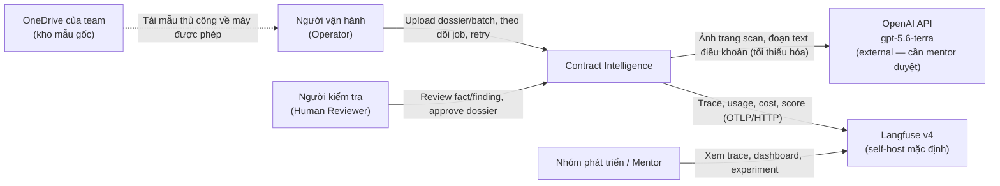
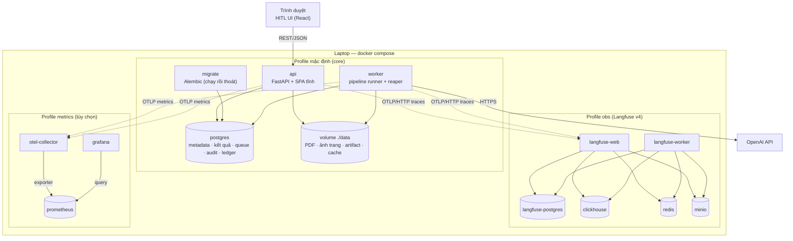
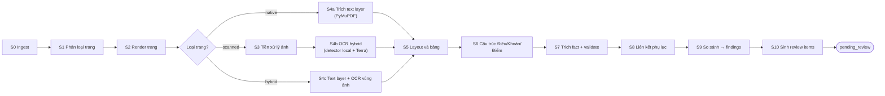
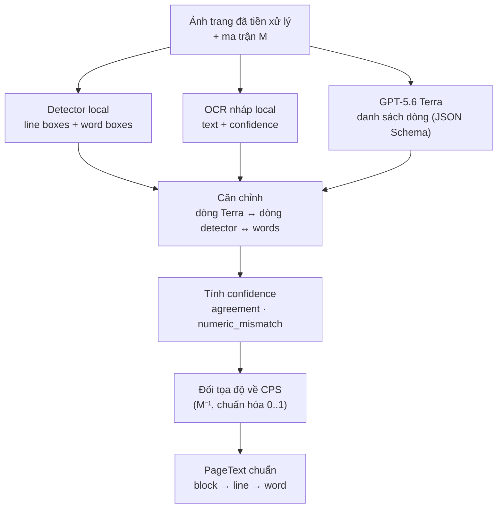
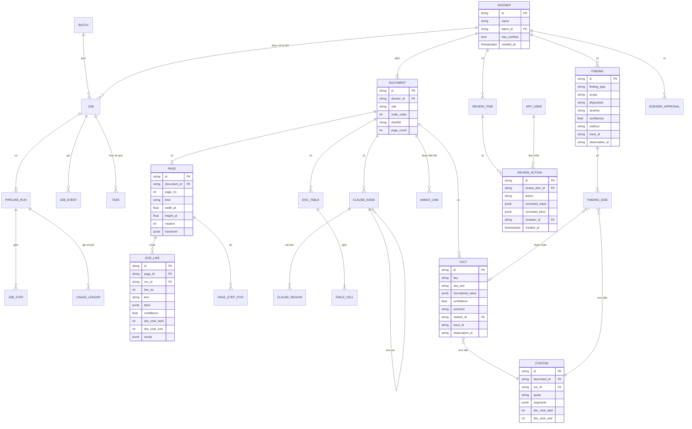
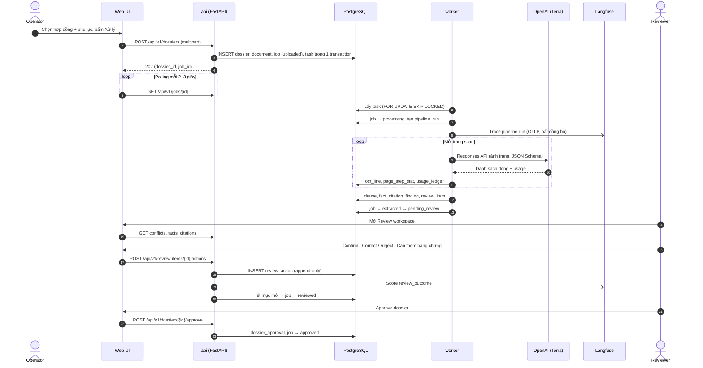
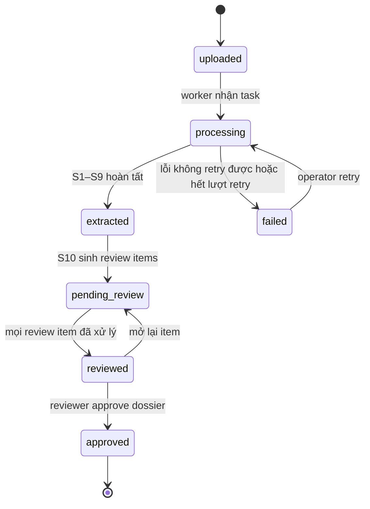
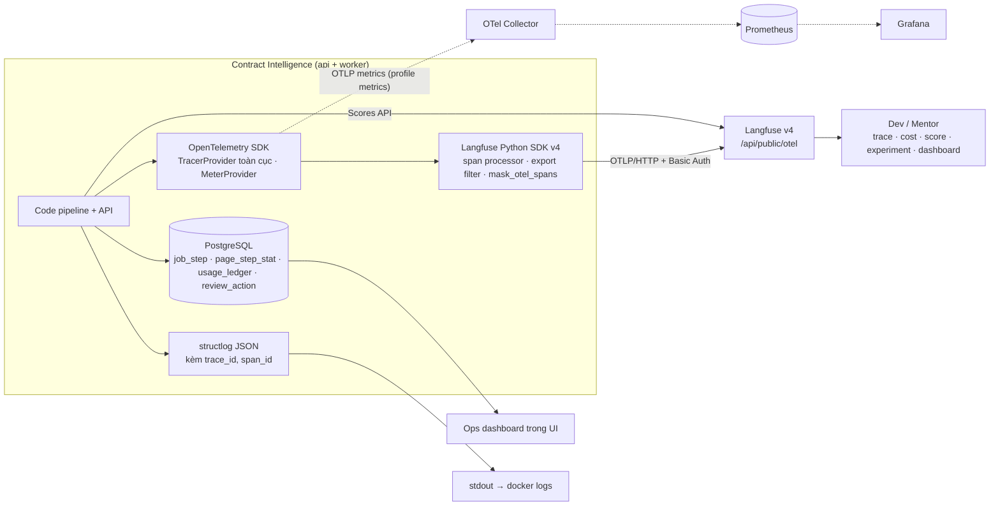

# DOC-04 · ARCHITECTURE — Contract Intelligence

**Kiến trúc hệ thống: OCR · IDP · Bounding Box · Citation · Conflict · Human-in-the-loop · Observability**

Dự án: VSF OJT Batch 3 · Phiên bản 0.1 — Bản nháp · Sprint 1
Ngày tạo: 16/09/2026 · Cập nhật lần cuối: 16/09/2026

---

## Mục lục

0. [Thông tin tài liệu](#0-thông-tin-tài-liệu)
1. [Tóm tắt kiến trúc](#1-tóm-tắt-kiến-trúc)
2. [Động lực kiến trúc và nguyên tắc thiết kế](#2-động-lực-kiến-trúc-và-nguyên-tắc-thiết-kế)
3. [Bối cảnh hệ thống (C4 — Level 1)](#3-bối-cảnh-hệ-thống-c4--level-1)
4. [Kiến trúc container (C4 — Level 2)](#4-kiến-trúc-container-c4--level-2)
5. [Technology stack](#5-technology-stack)
6. [Pipeline xử lý chi tiết (S0–S10)](#6-pipeline-xử-lý-chi-tiết-s0s10)
7. [Mô hình dữ liệu, Citation và Bounding Box](#7-mô-hình-dữ-liệu-citation-và-bounding-box)
8. [Vòng đời Job và xử lý nền](#8-vòng-đời-job-và-xử-lý-nền)
9. [Thiết kế API](#9-thiết-kế-api)
10. [Human-in-the-loop Web UI](#10-human-in-the-loop-web-ui)
11. [Observability & Monitoring (OpenTelemetry + Langfuse)](#11-observability--monitoring-opentelemetry--langfuse)
12. [Kiến trúc đánh giá (Evaluation)](#12-kiến-trúc-đánh-giá-evaluation)
13. [Mô hình chi phí và hiệu năng](#13-mô-hình-chi-phí-và-hiệu-năng)
14. [Bảo mật và quản trị dữ liệu](#14-bảo-mật-và-quản-trị-dữ-liệu)
15. [Triển khai và chạy local](#15-triển-khai-và-chạy-local)
16. [Chiến lược kiểm thử](#16-chiến-lược-kiểm-thử)
17. [Architecture Decision Records](#17-architecture-decision-records)
18. [Ma trận truy vết yêu cầu](#18-ma-trận-truy-vết-yêu-cầu)
19. [Rủi ro kiến trúc](#19-rủi-ro-kiến-trúc)
20. [Lộ trình theo Sprint](#20-lộ-trình-theo-sprint)
21. [Quyết định còn mở](#21-quyết-định-còn-mở)
22. [Phụ lục](#22-phụ-lục)

---

## 0. Thông tin tài liệu

| Trường | Nội dung |
|---|---|
| Tên tài liệu | TÀI LIỆU KIẾN TRÚC HỆ THỐNG — Contract Intelligence |
| Mã tài liệu | DOC-04 (đề xuất — chỉnh theo quy ước đánh số của team) |
| Dự án | VSF OJT Batch 3 |
| Loại tài liệu | Architecture Document |
| Phiên bản | 0.1 |
| Trạng thái | Bản nháp — chờ mentor review |
| Sprint | Sprint 1 |
| Người phụ trách | Trần Văn Dũng |
| Người tham gia | Cả team |
| Tài liệu đầu vào | DOC-02 BRD v0.2 (16/09/2026); DOC-03 (thuật ngữ, ràng buộc CON-04) |
| Tài liệu liên quan | `docs/adr/*` (Architecture Decision Records), `eval/README.md` |

### 0.1 Lịch sử thay đổi

| Phiên bản | Ngày | Người thực hiện | Nội dung |
|---|---|---|---|
| 0.1 | 16/09/2026 | Trần Văn Dũng, Phạm Hoàng Chương | Bản nháp đầu tiên: kiến trúc tổng thể, pipeline, dữ liệu, observability (OpenTelemetry + Langfuse), evaluation, chi phí |

### 0.2 Quy ước trong tài liệu

| Ký hiệu | Ý nghĩa |
|---|---|
| **MUST / SHOULD** | Giữ nguyên mức ưu tiên như BRD |
| `[TBD-bench]` | Chốt sau benchmark trên Sample Dataset v0 |
| `[Cần mentor duyệt]` | Cần mentor phê duyệt trước khi áp dụng với dữ liệu mentor cung cấp |
| `[Giả định]` | Giả định của team, cần xác nhận |
| `S0…S10` | Mã các bước pipeline nội bộ (mục 6) |
| CPS | Canonical Page Space — hệ tọa độ chuẩn của trang (mục 7.5) |

### 0.3 Giả định về model OCR

Tài liệu này hiểu "model 5.6 Terra light" là **GPT-5.6 Terra** của OpenAI (model id `gpt-5.6-terra`), chạy với *reasoning effort* thấp (`none` hoặc `low`) — gọi tắt là cấu hình "light". Đây là model đóng, gọi qua OpenAI API, nhận đầu vào text + ảnh và trả về text. `[Giả định]` Nếu team dùng tier khác trong họ GPT-5.6 (ví dụ Luna), kiến trúc không đổi: chỉ cần đổi biến `OCR_MODEL` và bảng giá `config/pricing.yaml`.

Thông số tham chiếu (theo trang model của OpenAI, truy cập 16/09/2026 — kiểm tra lại trước khi báo cáo):

| Thông số | Giá trị |
|---|---|
| Đầu vào / đầu ra | Text + ảnh / Text |
| Reasoning effort hỗ trợ | `none`, `low`, `medium` (mặc định), `high`, `xhigh`, `max` |
| Context window / max output | 1.050.000 / 128.000 tokens |
| Structured Outputs | Có |
| Giá (USD / 1M tokens) | Input 2,00 · Cached input 0,20 · Output 12,00 |
| Rate limit Tier 1 | 500 RPM · 500.000 TPM (Free tier không hỗ trợ) |

Hệ quả kiến trúc quan trọng của lựa chọn này:

| Hệ quả | Xử lý trong kiến trúc |
|---|---|
| Là dịch vụ AI bên ngoài → mâu thuẫn với giả định baseline "không dùng external API" (BRD §18, DOC-03 CON-04) | Ghi vào registry dịch vụ ngoài (mục 14.2), có cờ `EXTERNAL_AI_ENABLED`, `[Cần mentor duyệt]`; hệ thống vẫn chạy end-to-end ở chế độ `local_only` |
| VLM tổng quát không đảm bảo tọa độ chính xác ở cấp word/line (BR-09 cần bbox đo được IoU) | OCR **hybrid**: geometry lấy từ detector local, text lấy từ Terra, căn chỉnh hai nguồn (mục 6.5) |
| Không có confidence theo ký tự như OCR truyền thống | Confidence suy ra từ độ khớp giữa Terra và OCR nháp local + kiểm tra chữ số (mục 6.5.4) |
| Tính tiền theo token, output đắt gấp 6 lần input | Usage ledger, price book, OCR cache, bỏ qua trang native (mục 13) |
| Model có thể "sửa hộ" chính tả hoặc định dạng số | Prompt chép nguyên văn, đo độ khớp, kiểm tra chữ số, đánh giá CER/VDA (mục 6.5, 12) |

---

## 1. Tóm tắt kiến trúc

Contract Intelligence được thiết kế như một **modular monolith** viết bằng Python, chạy trên laptop bằng Docker Compose với **một lệnh duy nhất**. Hệ thống gồm một API FastAPI (kiêm phục vụ Web UI React đã build), một worker xử lý nền đọc hàng đợi nằm ngay trong PostgreSQL, một volume lưu file, và một stack quan sát Langfuse v4 tự host nhận trace theo chuẩn OpenTelemetry. Không có Kubernetes, không có microservice, không có message broker riêng — đúng tinh thần NFR-06 và danh sách ngoài phạm vi của BRD §6.

Mỗi dossier (1 hợp đồng + 0..n phụ lục) đi qua một pipeline 11 bước (S0–S10). Mỗi bước idempotent, ghi kết quả vào PostgreSQL gắn với một `pipeline_run`, và phát ra một span OpenTelemetry. Trang có lớp text được đọc trực tiếp bằng PyMuPDF (không tốn tiền OCR). Trang scan đi qua OCR hybrid: detector local cung cấp bounding box, GPT-5.6 Terra cung cấp văn bản, hai nguồn được căn chỉnh để vừa có chữ tiếng Việt tốt vừa có tọa độ đo được. Từ văn bản có tọa độ, hệ thống dựng cây Điều → Khoản → Điểm, bảng có cấu trúc, fact có kiểu, liên kết phụ lục, rồi sinh finding với đúng một disposition và citation cho cả hai phía.

Kết quả máy là **bất biến** theo từng run; mọi thao tác của reviewer được lưu dạng append-only và "giá trị hiệu lực" được tính bằng view — không bao giờ ghi đè âm thầm (NFR-05, BR-08). OpenTelemetry là chuẩn instrument trung lập; Langfuse là nơi xem trace, chi phí, điểm chất lượng, phản hồi của reviewer và các experiment đánh giá. Các KPI nghiệp vụ (throughput, cost/dossier) có nguồn sự thật trong PostgreSQL để báo cáo vẫn tái lập được kể cả khi tắt telemetry.

### 1.1 Các quyết định kiến trúc chính

| # | Quyết định | Lựa chọn đề xuất | Lý do chính | Liên quan |
|---|---|---|---|---|
| D1 | Kiểu kiến trúc | Modular monolith: `api` + `worker` chung codebase | Đơn giản, dễ bàn giao, chạy local | NFR-01, NFR-06 |
| D2 | Xử lý nền | Hàng đợi trên PostgreSQL (`FOR UPDATE SKIP LOCKED`) | Không thêm broker; enqueue cùng transaction với job | BR-18, BR-19 |
| D3 | OCR trang scan | Hybrid: detector local (geometry) + GPT-5.6 Terra (text) + OCR local (nháp, fallback) | Cần bbox word/line đo được; tiếng Việt có dấu | BR-03, BR-09, R-01, R-02 |
| D4 | Trang có text layer | PyMuPDF, không OCR | Rẻ, bbox chính xác | BR-02, NFR-03 |
| D5 | Cấu trúc điều khoản | Rules-first (regex + state machine), LLM chỉ là fallback có grounding | Giải thích được, rẻ, đo được | BR-04, BR-05 |
| D6 | Phát hiện conflict | Comparator có cấu trúc (rule) + comparator ngữ nghĩa (LLM, bắt buộc trích dẫn) | Hai loại conflict của BR-11, BR-12 | BR-11–BR-14 |
| D7 | Audit | Bảng máy chỉ INSERT; `review_action` append-only; view giá trị hiệu lực | Không ghi đè kết quả máy | NFR-05, BR-08 |
| D8 | Observability | OpenTelemetry (instrument) + Langfuse v4 self-host (backend) | Gợi ý của mentor; trung lập nhà cung cấp; có cost/score/experiment | BO-06, NFR-02, NFR-03 |
| D9 | Metrics hệ thống | KPI tính từ PostgreSQL + dashboard Langfuse; Prometheus/Grafana chỉ là profile tùy chọn | Tránh over-engineering | R-05 |
| D10 | Frontend | React + TypeScript (Vite), overlay bbox bằng SVG; sửa bbox bằng canvas (S2–3) | Team đã quen React; cần vẽ/sửa bbox | BR-15–BR-17 |
| D11 | Lưu file | Volume `./data` sau interface `BlobStore` | Đơn giản; đổi sang S3/MinIO không sửa pipeline | NFR-01 |
| D12 | Dữ liệu ra ngoài | Mọi lời gọi ra ngoài đi qua adapter có cờ bật/tắt, ghi usage và registry | Bảo mật mẫu, minh bạch chi phí | NFR-04, R-04 |

### 1.2 Cần mentor xác nhận trước Sprint 2

| # | Nội dung | Mục |
|---|---|---|
| M1 | Cho phép gửi ảnh trang scan và đoạn text điều khoản tới OpenAI (GPT-5.6 Terra) với loại dữ liệu nào (mẫu tự tạo / mẫu mentor) | 14.2 |
| M2 | Chế độ triển khai Langfuse: trên từng laptop, trên một máy chung của team, hay Langfuse Cloud (chỉ metadata) | 11.3 |
| M3 | Chính sách "ưu tiên hợp đồng – phụ lục" ở mức hiển thị đề xuất (không kết luận pháp lý) | 6.10.6 |
| M4 | Bộ metric và ngưỡng chấp nhận để chọn OCR engine/mode | 12.5 |

---

## 2. Động lực kiến trúc và nguyên tắc thiết kế

### 2.1 Architecture drivers

| ID | Driver | Nguồn BRD | Ảnh hưởng tới kiến trúc |
|---|---|---|---|
| AD-01 | Truy vết Tài liệu → Trang → Dòng OCR → Khoảng ký tự → BBox | BO-03, BR-07 | Citation dạng segment; version hóa theo `pipeline_run` |
| AD-02 | PDF native, scan và trộn lẫn **theo từng trang** | BR-02, BR-03 | Phân loại và định tuyến ở cấp trang |
| AD-03 | Giữ đúng dấu tiếng Việt | BR-03, R-02 | Chuẩn hóa Unicode NFC; metric dấu riêng; đối chiếu hai engine |
| AD-04 | Số liệu quan trọng không được sai | R-03 | Kiểm tra số ↔ chữ; lệch chữ số giữa hai engine → review ưu tiên cao |
| AD-05 | Không mất kết quả máy sau khi người sửa | BO-05, BR-08, NFR-05 | Bảng máy bất biến, review append-only |
| AD-06 | Khởi động toàn hệ thống bằng một lệnh | NFR-01 | Docker Compose + profiles + headless init |
| AD-07 | Báo cáo chất lượng, throughput, chi phí kèm tập mẫu và n | BO-06, NFR-02, NFR-03 | Usage ledger, tracing, experiment runner |
| AD-08 | Mẫu của mentor không được lộ | NFR-04 | Registry dịch vụ ngoài, masking telemetry, gitignore, pre-commit |
| AD-09 | Tránh over-engineering | NFR-06, R-05 | Monolith; thành phần nặng để ở profile tùy chọn |
| AD-10 | Mở rộng ngôn ngữ/engine về sau | BRD §5.1 | Adapter cho OCR/LLM; không khóa vào một nhà cung cấp |

### 2.2 Nguyên tắc thiết kế

| Mã | Nguyên tắc | Cách áp dụng cụ thể |
|---|---|---|
| P1 | Baseline → đo → chỉ thêm phức tạp khi có bằng chứng | Mọi thành phần "nâng cao" (LLM structuring, embedding, Prometheus) có điều kiện kích hoạt rõ ràng |
| P2 | Không có nguồn thì không có kết quả | Fact/finding không resolve được citation → `insufficient_evidence` |
| P3 | Máy đề xuất, người quyết định | Finding là kết quả so sánh kỹ thuật, không phải kết luận pháp lý; approve là hành động của người |
| P4 | Kết quả máy bất biến | Chạy lại tạo `pipeline_run` mới; sửa tạo `review_action` mới |
| P5 | Mọi model và dịch vụ ngoài nằm sau adapter | `OcrEngine`, `TextDetector`, `LlmClient`, `BlobStore`, `PriceBook` |
| P6 | Idempotent và chạy tiếp được | Checkpoint theo `(run, document, step)`; retry bỏ qua bước đã xong |
| P7 | Quan sát được theo mặc định, an toàn nội dung theo mặc định | `TRACE_CONTENT_MODE=metadata`: trace không chứa nội dung hợp đồng |
| P8 | Local-first | Mọi tính năng bắt buộc chạy được khi tắt Internet (chế độ `local_only`) |

### 2.3 Ngoài phạm vi kiến trúc

Kiến trúc không bao gồm các hạng mục BRD §6 đã loại trừ: tư vấn pháp lý, xác minh chữ ký, nhận dạng chữ viết tay nâng cao, chỉnh sửa PDF gốc, train OCR/foundation model, DMS doanh nghiệp đầy đủ, Enterprise Identity Management, Kubernetes, microservice phân tán, chatbot pháp lý tổng quát.

---

## 3. Bối cảnh hệ thống (C4 — Level 1)



| Tác nhân / hệ thống | Vai trò | Tương tác chính |
|---|---|---|
| Operator | Đưa dossier vào hệ thống, theo dõi xử lý | Upload, batch, xem trạng thái, retry (BRD §7.2) |
| Human Reviewer | Kiểm tra và sửa kết quả | Confirm/Correct/Reject/needs-more-evidence, approve (BR-16) |
| Nhóm phát triển, Mentor | Đánh giá kiến trúc, chất lượng, chi phí | Langfuse (trace, dashboard, experiment), báo cáo eval |
| OpenAI API | Nhận dạng chữ (OCR recognition), so sánh ngữ nghĩa, trích xuất có grounding | HTTPS, chỉ khi `EXTERNAL_AI_ENABLED=true` |
| Langfuse | Backend observability cho LLM/pipeline | OTLP/HTTP, Scores API, Experiments |
| OneDrive team | Kho lưu mẫu gốc được phép (NFR-04) | Ngoài hệ thống; tải thủ công |

---

## 4. Kiến trúc container (C4 — Level 2)



| Container | Công nghệ | Trách nhiệm | Cổng host | Profile |
|---|---|---|---|---|
| `api` | FastAPI + Uvicorn; phục vụ SPA React đã build | REST API, upload, review, citation resolver, ops summary, health | 8000 | mặc định |
| `worker` | Python, cùng image với `api` | Chạy pipeline S1–S10, reaper, rate limiter, budget guard | — | mặc định |
| `migrate` | Alembic | Tạo/nâng schema, seed tài khoản, rồi thoát | — | mặc định |
| `db` | PostgreSQL 16 | Metadata, kết quả, hàng đợi, audit, usage ledger | 5432 (chỉ mở khi dev) | mặc định |
| `./data` | Volume bind-mount | PDF gốc, ảnh trang, artifact theo run, OCR cache | — | mặc định |
| `langfuse-web`, `langfuse-worker` | Langfuse v4 | Nhận OTLP; UI trace/score/experiment/dashboard | 3000 | `obs` |
| `langfuse-postgres`, `clickhouse`, `redis`, `minio` | Hạ tầng lưu trữ của Langfuse | Không dùng chung với app để tách biệt | không mở ra host | `obs` |
| `otel-collector`, `prometheus`, `grafana` | OTel Collector (contrib), Prometheus, Grafana | Metrics hạ tầng theo thời gian | 3001 (Grafana) | `metrics` |

Hai điểm cần lưu ý: (1) Langfuse v4 gồm hai container ứng dụng (web, worker) cùng PostgreSQL, ClickHouse, Redis/Valkey và S3/Blob store — đây là stack nặng nhất của hệ thống nên được tách thành profile riêng; (2) `api` và `worker` dùng chung một image Docker, chỉ khác lệnh khởi động, giúp bàn giao và debug dễ hơn.

---

## 5. Technology stack

| Lớp | Lựa chọn | Lý do | Phương án thay thế đã cân nhắc |
|---|---|---|---|
| Ngôn ngữ backend | Python 3.12 | Hệ sinh thái PDF/OCR/AI mạnh; team quen | — |
| API | FastAPI + Pydantic v2 + Uvicorn | Async, OpenAPI tự sinh, validate schema chặt | Django (nặng hơn nhu cầu) |
| ORM / migration | SQLAlchemy 2.x + Alembic | Chuẩn, dễ bàn giao | SQLModel |
| CSDL | PostgreSQL 16 | JSONB, `SKIP LOCKED`, view, trigger; một DB cho mọi thứ; có thể thêm pgvector | SQLite (không đủ cho worker song song) |
| Hàng đợi nền | Bảng `task` trên PostgreSQL | Không thêm hạ tầng; enqueue cùng transaction | Celery + Redis, Dramatiq, Procrastinate (ADR-002) |
| PDF | PyMuPDF | Render, text + bbox, rotation, bảng native | pdfplumber (bảng native), pypdfium2 |
| Xử lý ảnh | OpenCV + NumPy | Deskew, denoise, CLAHE, phát hiện đường kẻ bảng | scikit-image |
| Text detection local | `[TBD-bench]` — ứng viên: detector của PaddleOCR, docTR, Tesseract (layout) | Cung cấp geometry word/line | — |
| OCR nháp / fallback local | `[TBD-bench]` — ứng viên: Tesseract `vie`, PaddleOCR, VietOCR | Baseline không phụ thuộc external; confidence đối chiếu | — |
| OCR recognition chính | GPT-5.6 Terra qua OpenAI SDK (Responses API, Structured Outputs) | Lựa chọn của team; chất lượng tiếng Việt cần đo | Mode `local_only` |
| So sánh ngữ nghĩa / trích xuất khó | GPT-5.6 Terra (hoặc LLM local qua Ollama nếu không được duyệt external) | Structured Outputs, grounding | `SEMANTIC_ENGINE=local` |
| So khớp chuỗi | rapidfuzz | Nhanh, fuzzy matching cho grounding và heading OCR lỗi | — |
| Embedding (S2+, chỉ khi cần) | Model embedding đa ngữ chạy local + pgvector | Không thêm vector DB riêng | — |
| Frontend | React 18 + TypeScript + Vite; TanStack Query; overlay SVG; react-konva cho sửa bbox (S2–3) | Team đã có kinh nghiệm React/TS | Next.js (không cần SSR) |
| Observability | OpenTelemetry Python SDK + Langfuse Python SDK v4; Langfuse v4 self-host | Gợi ý mentor; OTel-native | Langfuse Cloud (cần duyệt), Arize Phoenix, Jaeger |
| Logging | structlog (JSON) có `trace_id` | Tương quan log ↔ trace | logging chuẩn |
| Kiểm thử | pytest, hypothesis, Playwright (tùy chọn) | Unit + property-based cho tọa độ | — |
| Đóng gói | Docker, Docker Compose (profiles, `include`), Makefile, uv | Một lệnh khởi động | — |

---

## 6. Pipeline xử lý chi tiết (S0–S10)

### 6.0 Tổng quan



S0 chạy trong `api`. S1–S7 chạy trong `worker` theo từng tài liệu (các tài liệu trong cùng dossier có thể chạy song song). S8–S10 chạy ở cấp dossier sau khi mọi tài liệu xong S7.

| Bước | Tên | Cấp | Đầu vào | Đầu ra | Span |
|---|---|---|---|---|---|
| S0 | Ingest và validate | dossier | File upload | `dossier`, `document`, `job`, `task`, blob PDF | `api.create_dossier` |
| S1 | Phân loại trang | document | PDF | `page.kind`, `page.features` | `step.classify_pages` |
| S2 | Render | document | PDF | Ảnh 300 DPI + preview, kích thước, rotation | `step.render` |
| S3 | Tiền xử lý | page (scan/hybrid) | Ảnh render | Ảnh đã xử lý + ma trận `M` + chỉ số chất lượng | `step.preprocess` |
| S4 | Trích text / OCR | page | Ảnh hoặc text layer | `ocr_line` (kèm words), `document_text` | `step.ocr` |
| S5 | Layout và bảng | document | Line + ảnh | `doc_table`, `table_cell`, nhãn header/footer | `step.layout` |
| S6 | Cấu trúc điều khoản | document | Line | `clause_node`, `clause_region` | `step.structure` |
| S7 | Trích fact và validate | document | Clause, bảng | `fact`, `citation` | `step.extract_facts` |
| S8 | Liên kết phụ lục | dossier | Fact, tiêu đề | `annex_link` | `step.link_annexes` |
| S9 | So sánh | dossier | Fact, clause | `finding`, `finding_side`, `citation` | `step.compare` |
| S10 | Sinh review item | dossier | Fact, finding, link | `review_item`; job → `pending_review` | `step.review_items` |

Mỗi bước tuân theo cùng một hợp đồng: nhận `run_id` + đối tượng cần xử lý, kiểm tra checkpoint trong `job_step`, ghi kết quả trong một transaction, ghi artifact JSON vào `data/artifacts/<run_id>/…` để debug/replay, phát span, và ném `PipelineError(code, retryable)` khi lỗi.

### 6.1 S0 — Ingest và validate (BR-01, BR-18)

| Kiểm tra | Cách làm | Mã lỗi |
|---|---|---|
| Đúng định dạng PDF | Magic bytes `%PDF-` và mở được bằng PyMuPDF | `PDF_INVALID` |
| Có mật khẩu | Thuộc tính "cần mật khẩu" của PyMuPDF | `PDF_ENCRYPTED` |
| Giới hạn | Dung lượng, số trang, số phụ lục (mục 13.3) | `LIMIT_EXCEEDED` |
| Đúng 1 hợp đồng / dossier | Operator gán vai trò `contract`/`annex` khi upload; thứ tự phụ lục theo thứ tự upload | `DOSSIER_INVALID` |
| Trùng file | SHA-256 → dùng lại blob, vẫn tạo `document` mới | — |

Toàn bộ bản ghi `dossier`, `document`, `job` (trạng thái `uploaded`), `job_event` và `task` được ghi trong **một transaction**. Nhờ vậy không thể có job "mồ côi" hoặc job biến mất không trạng thái (BRD §14). API trả `202 Accepted` kèm `dossier_id`, `job_id`. File lưu theo địa chỉ nội dung: `data/blobs/pdf/<sha256>.pdf`.

### 6.2 S1 — Phân loại trang (BR-02)

| Đặc trưng | Cách tính | Dùng để |
|---|---|---|
| `text_chars` | Số ký tự không phải khoảng trắng từ text layer | Có text hay không |
| `text_quality` | Tỷ lệ ký tự hợp lệ (chữ Latin có dấu, số, dấu câu) trên tổng ký tự | Phát hiện rác, lỗi font |
| `legacy_font_suspect` | Dấu hiệu mojibake của bảng mã cũ (TCVN3, VNI) hoặc font không có ánh xạ Unicode | Chuyển sang OCR |
| `invisible_text` | Có text nhưng ở chế độ hiển thị ẩn (lớp OCR do máy scan chèn) — đọc qua API text trace của PyMuPDF | Coi là trang scan |
| `image_coverage` | Tổng diện tích ảnh / diện tích trang | Trang ảnh hay trang chữ |

Bảng quyết định (xét từ trên xuống, dừng ở dòng đầu tiên thỏa):

| Điều kiện | `page.kind` |
|---|---|
| `invisible_text` hoặc `legacy_font_suspect` | `scanned` (OCR lại; lớp OCR sẵn có có thể dùng làm "OCR nháp" miễn phí) |
| `text_chars ≥ T1` và `text_quality ≥ Q1` và `image_coverage < C1` | `native` |
| `text_chars ≥ T1` và `image_coverage ≥ C1` | `hybrid` |
| Còn lại | `scanned` |

Ngưỡng khởi điểm: `T1 = 50`, `Q1 = 0,9`, `C1 = 0,3` — `[TBD-bench]`. Toàn bộ đặc trưng được lưu vào `page.features` (JSONB) và gắn vào span để tinh chỉnh ngưỡng bằng dữ liệu thật. Một tài liệu có thể trộn cả ba loại trang; routing luôn diễn ra ở cấp trang.

### 6.3 S2 — Render và Canonical Page Space (BR-10)

**Canonical Page Space (CPS)** là hệ tọa độ duy nhất mà mọi bbox trong hệ thống dùng: trang *như người dùng nhìn thấy* trong trình xem PDF (đã áp dụng `/Rotate` và CropBox), gốc ở góc trên bên trái, trục x sang phải, trục y xuống dưới, chuẩn hóa về `[0, 1]` theo chiều rộng/chiều cao hiển thị.

S2 render mỗi trang bằng PyMuPDF thành hai biến thể: ảnh PNG 300 DPI (ứng viên ban đầu theo BRD §23) cho OCR và ảnh WebP ~150 DPI cho UI. Vì bbox đã chuẩn hóa nên overlay không phụ thuộc độ phân giải ảnh.

| Trường lưu cho mỗi trang | Ý nghĩa |
|---|---|
| `width_pt`, `height_pt` | Kích thước hiển thị (point) sau khi xoay |
| `rotation` | 0 / 90 / 180 / 270 (từ `/Rotate`) |
| `mediabox`, `cropbox` | Hộp gốc của PDF, phục vụ đổi tọa độ text layer |
| `render_dpi`, `width_px`, `height_px` | Thông số ảnh render |
| `render_uri`, `preview_uri` | Đường dẫn ảnh trong `BlobStore` |

Với trang native, tọa độ text của PyMuPDF nằm trong không gian trang *chưa xoay*; hệ thống áp dụng ma trận xoay của trang (`page.rotation_matrix`) rồi chia cho kích thước hiển thị để về CPS. Phần đổi tọa độ này có property-based test riêng (mục 16).

### 6.4 S3 — Tiền xử lý ảnh (trang scanned/hybrid)

| Thao tác | Mặc định | Ghi lại |
|---|---|---|
| Phát hiện hướng (0/90/180/270) | Bật | Góc xoay |
| Deskew (góc nhỏ, projection profile hoặc Hough) | Bật | Góc nghiêng |
| Khử nhiễu (median/bilateral) | `[TBD-bench]` | Tham số |
| Tăng tương phản (CLAHE) | `[TBD-bench]` | Tham số |
| Nhị phân hóa (Sauvola) | Tắt | Tham số |

Mọi phép biến đổi hình học được gộp thành một ma trận affine `M` (CPS pixel → pixel ảnh đã xử lý) và lưu vào `page.transform`. Sau OCR, mọi hộp được đưa về CPS bằng `M⁻¹`, rồi lấy hộp bao song song trục của đa giác đã biến đổi. Đây là điều kiện để overlay khớp với ảnh trang gốc mà reviewer nhìn thấy.

Chỉ số chất lượng ảnh được tính và gắn vào span: độ mờ (variance of Laplacian), độ tương phản, góc nghiêng, DPI ước lượng. Các chỉ số này cho phép phân tích R-01 ("OCR kém vì mờ hay vì nghiêng?") bằng dữ liệu. Chiến lược tiền xử lý cuối cùng được chọn bằng experiment A/B (mục 12).

### 6.5 S4 — Trích text và OCR (BR-03, BR-09)

#### 6.5.1 Định tuyến

| `page.kind` | Geometry (bbox) | Văn bản | Ghi chú |
|---|---|---|---|
| `native` | PyMuPDF words/lines | PyMuPDF | Không gọi API, không tốn tiền |
| `scanned` | Detector local (line + word boxes) | GPT-5.6 Terra (mặc định) hoặc OCR local | Xem 6.5.2 |
| `hybrid` | PyMuPDF cho vùng text; detector cho vùng ảnh | PyMuPDF + Terra cho vùng ảnh | Khử trùng lặp bằng IoU giữa hai nguồn |

| `OCR_MODE` | Hành vi | Khi dùng |
|---|---|---|
| `terra_hybrid` | Detector + OCR nháp local + Terra cho mọi trang scan | Mặc định khi external đã được duyệt |
| `local_then_terra` | OCR local trước; chỉ gọi Terra cho trang có confidence thấp | Tối ưu chi phí nếu benchmark chứng minh local đủ tốt |
| `local_only` | Không gọi external | Baseline CON-04, offline, chưa được duyệt |
| `terra_page_only` | Chỉ lấy text từ Terra, không geometry | **Chỉ dùng để benchmark** chất lượng text |

Nếu `EXTERNAL_AI_ENABLED=false`, mọi mode có Terra tự động hạ về `local_only`, ghi `job_event` và gắn tag `mode:local_only` vào trace. Demo vì vậy luôn chạy được kể cả khi chưa có API key.

#### 6.5.2 Luồng OCR hybrid cho một trang scan



Ba biến thể gọi Terra sẽ được benchmark; Sprint 1 bắt đầu bằng V3 vì đơn giản nhất:

| Biến thể | Cách gọi | Ưu | Nhược |
|---|---|---|---|
| V1 — trang + danh sách hộp | 1 request/trang, kèm ID và tọa độ từng dòng, yêu cầu chép chữ trong từng hộp | Ít request | Model có thể gán nhầm hộp |
| V2 — dải ảnh dòng | Ghép ~30 ảnh cắt dòng/request, mỗi dòng có ID | Căn chỉnh gần như chắc chắn | Nhiều request, mất ngữ cảnh trang |
| V3 — chép cả trang + căn chỉnh | 1 request/trang, chép từng dòng vật lý theo thứ tự đọc; hệ thống tự căn với dòng của detector | Đơn giản, 1 call/trang | Cần thuật toán căn chỉnh tốt; đo bằng tỷ lệ căn chỉnh thành công |

#### 6.5.3 Hợp đồng gọi Terra

JSON Schema đầu ra (Structured Outputs, chế độ strict):

```json
{
  "type": "object",
  "additionalProperties": false,
  "required": ["lines", "page_flags"],
  "properties": {
    "lines": {
      "type": "array",
      "items": {
        "type": "object",
        "additionalProperties": false,
        "required": ["text"],
        "properties": { "text": { "type": "string" } }
      }
    },
    "page_flags": {
      "type": "object",
      "additionalProperties": false,
      "required": ["has_table", "has_stamp_overlap", "illegible_count"],
      "properties": {
        "has_table": { "type": "boolean" },
        "has_stamp_overlap": { "type": "boolean" },
        "illegible_count": { "type": "integer" }
      }
    }
  }
}
```

| Quy tắc trong prompt `ocr_transcribe` | Lý do |
|---|---|
| Chép nguyên văn từng dòng vật lý theo thứ tự đọc | Căn chỉnh với detector |
| Giữ nguyên dấu, chính tả, hoa/thường, dấu câu; không sửa lỗi | OCR phải trung thực (R-06) |
| Giữ nguyên định dạng số (dấu chấm, dấu phẩy, khoảng trắng) | Tránh biến `100.000.000` thành `100,000,000` (R-03) |
| Chữ không đọc được ghi `[?]` | Không bịa nội dung |
| Không dịch, không tóm tắt, không thêm chú thích | Đầu ra chỉ là bản chép |
| Bảng: mỗi hàng một dòng, các ô ngăn bằng ký tự ` ¦ ` | Hỗ trợ S5 mà không phá JSON/Markdown |

Prompt lưu tại `prompts/ocr_transcribe.v1.yaml`; tên và version được ghi vào run config và vào generation trên Langfuse.

| Tham số gọi | Giá trị | Ghi chú |
|---|---|---|
| `model` | `gpt-5.6-terra` | Từ `OCR_MODEL` |
| Reasoning effort | `low` (thử thêm `none`) | Cấu hình "light"; đo đánh đổi chất lượng/chi phí |
| Định dạng đầu ra | Structured Outputs, JSON Schema strict | Model hỗ trợ Structured Outputs |
| Ảnh | PNG từ S3, cạnh dài tối đa `OCR_IMAGE_MAX_SIDE` | `[TBD-bench]` — cân bằng dấu tiếng Việt và input token |
| Timeout | 120 giây | `[TBD]` |
| Retry | 429/5xx/timeout: backoff lũy thừa + jitter, tối đa 5 lần, tôn trọng `retry-after` | Mã lỗi ở mục 8.6 |
| Đầu ra sai schema | Hỏi lại 1 lần, sau đó fallback OCR local cho trang đó + gắn cờ review | `OCR_SCHEMA_INVALID` |
| Lưu trữ phía nhà cung cấp | Tắt lưu response nếu API cho phép; ghi lại chính sách dữ liệu hiện hành | NFR-04 |
| Model thực tế | Ghi giá trị model trả về trong response vào `usage_ledger` | Tái lập kết quả khi alias đổi snapshot |

#### 6.5.4 Căn chỉnh và confidence

Căn chỉnh diễn ra hai tầng. **Tầng dòng**: quy hoạch động trên hai chuỗi dòng (dòng Terra và dòng detector có text nháp), chi phí ghép là CER giữa hai dòng, cho phép gộp/tách 1–2 và 2–1 để xử lý khác biệt ngắt dòng. **Tầng từ**: trong mỗi dòng đã ghép, căn chỉnh Levenshtein theo token; token của Terra khớp với token nháp nhận bbox của word box tương ứng (`bbox_source=detector`), token không khớp nhận bbox ước lượng bằng cách chia bbox dòng theo độ dài ký tự (`bbox_source=estimated`). Dòng Terra không ghép được với hộp nào bị đánh dấu `unaligned` và đưa vào review ở cấp trang.

```text
norm(s)              = NFC(s), gộp khoảng trắng, thay Ð (U+00D0) → Đ (U+0110)
agreement(line)      = 1 − CER(norm(text_terra), norm(text_draft))          ∈ [0, 1]
digits(s)            = chuỗi các chữ số trong s theo thứ tự
numeric_mismatch     = digits(text_terra) ≠ digits(text_draft)
confidence(line)     = w1·agreement + w2·conf_draft + w3·det_score          (0,6 / 0,2 / 0,2 — [TBD-bench])
nếu numeric_mismatch → confidence = min(confidence, 0,5) và gắn cờ ưu tiên cao
```

Văn bản được chọn mặc định là của Terra. Ở mode `local_only`, `confidence` lấy trực tiếp từ OCR local. `numeric_mismatch` là tín hiệu quan trọng nhất cho R-03: mọi fact trích từ dòng có cờ này tự động thành review item P1.

#### 6.5.5 Cache và ghi nhận chi phí

Kết quả Terra được cache theo khóa `sha256(ảnh đã xử lý) + model + prompt_version + tham số`, lưu ở `data/ocr_cache/<key>.json`. Chạy lại pipeline hoặc chạy experiment trên cùng dữ liệu không phải trả tiền lần hai. Mỗi call (kể cả cache hit, với chi phí 0 và cờ `cache_hit=true`) ghi một dòng `usage_ledger` và một generation trên Langfuse (mục 11.7).

#### 6.5.6 Cấu trúc PageText chuẩn

Mọi engine (PyMuPDF, local, Terra hybrid) đều phải trả về cùng một cấu trúc — đây là hợp đồng của interface `OcrEngine`:

```json
{
  "page_id": "pg_01J9ZQ0K7M",
  "run_id": "run_01J9ZQ0A2B",
  "kind": "scanned",
  "cps": { "width_pt": 595.3, "height_pt": 841.9, "rotation": 0 },
  "lines": [
    {
      "line_id": "ln_01J9ZQ0K7M_0012",
      "line_no": 12,
      "text": "Giá trị hợp đồng: 100.000.000 VNĐ",
      "bbox": [0.1123, 0.4310, 0.8741, 0.4522],
      "confidence": 0.93,
      "source": {
        "text": "gpt-5.6-terra@ocr_transcribe.v1",
        "geometry": "detector:<engine>@<version>"
      },
      "flags": { "numeric_mismatch": false, "unaligned": false, "region": "body" },
      "doc_char_span": [10234, 10268],
      "words": [
        { "text": "Giá", "bbox": [0.1123, 0.4310, 0.1402, 0.4522], "char_span": [0, 3], "bbox_source": "detector" }
      ]
    }
  ]
}
```

`document_text` là chuỗi ghép toàn bộ dòng của tài liệu theo thứ tự đọc (chuẩn NFC, mỗi dòng kết thúc bằng `\n`). `doc_char_span` của dòng là vị trí trong chuỗi này; `char_span` của word là vị trí trong dòng. Hai hệ offset này là nền của citation (mục 7.4).

### 6.6 S5 — Layout và bảng (BR-04)

| Tác vụ | Trang native | Trang scan |
|---|---|---|
| Header/footer | Dòng lặp lại ở ≥ 60% số trang tại vị trí y tương tự → gắn `region=header/footer` | Như native |
| Bảng có đường kẻ | Tìm bảng của PyMuPDF (hoặc pdfplumber) | OpenCV phát hiện đường kẻ ngang/dọc → lưới ô → gán word vào ô theo bbox |
| Bảng không đường kẻ | Tìm bảng của PyMuPDF theo căn lề text | Terra trích bảng dạng JSON (hàng/ô), sau đó căn text ô với word để lấy bbox `[TBD-bench]` |
| Số trang, mục lục | Mẫu regex, đánh dấu để loại khỏi text điều khoản | Như native |

Bảng **không bao giờ** được làm phẳng thành một đoạn text: `doc_table` → hàng → `table_cell(row_idx, col_idx, row_span, col_span, text, bbox, is_header, char_span)`. Bảng kéo dài nhiều trang được nối khi header lặp lại hoặc số cột và độ rộng cột khớp. Dòng thuộc bảng vẫn giữ trong `ocr_line` để citation hoạt động bình thường; ô bảng có thể được cite trực tiếp.

### 6.7 S6 — Cấu trúc Điều/Khoản/Điểm (BR-04, BR-05)

Mẫu nhận diện khởi điểm (áp dụng trên text đã chuẩn hóa, không phân biệt hoa/thường):

```yaml
# config/structure_patterns.yaml
annex:
  vi: '^\s*PHỤ\s+LỤC(\s+SỐ)?\s*[0-9IVXLC]+\b'
  en: '^\s*(APPENDIX|ANNEX)\s+[0-9A-Z]+\b'
article:
  vi: '^\s*Điều\s+(?P<num>\d+)\s*[.:\-–]?\s*(?P<title>.*)$'
  en: '^\s*Article\s+(?P<num>\d+)\s*[.:\-–]?\s*(?P<title>.*)$'
clause:
  vi: '^\s*(Khoản\s+)?(?P<num>\d+(\.\d+){0,2})[.)]?\s+(?P<text>\S.*)$'
  en: '^\s*(Clause\s+)?(?P<num>\d+(\.\d+){0,2})[.)]?\s+(?P<text>\S.*)$'
point:
  vi: '^\s*(?P<num>[a-zđ])[).]\s+(?P<text>\S.*)$'
  en: '^\s*\(?(?P<num>[a-z])\)\s+(?P<text>\S.*)$'
bullet: '^\s*[-–•+]\s+(?P<text>\S.*)$'
```

Parser là một state machine dùng ngăn xếp, duyệt các dòng `region=body` theo thứ tự đọc: dòng khớp mẫu cấp cao hơn sẽ đóng các node cấp thấp đang mở; dòng không khớp được nối vào node đang mở. Từ khóa heading bị OCR sai nhẹ (ví dụ "Ðiều", "Dieu") được nhận bằng fuzzy match của rapidfuzz trên token đầu dòng.

| Quy tắc chống nhận nhầm | Ví dụ |
|---|---|
| "Điều N" chỉ là heading khi đứng đầu dòng **và** dòng trước kết thúc câu hoặc có khoảng cách dọc lớn | "…theo Điều 5 của Hợp đồng" không phải heading |
| Số thứ tự phải liên tục; bước nhảy chỉ chấp nhận khi có bằng chứng định dạng (in đậm/cỡ chữ lớn ở trang native) | "Điều 4" sau "Điều 3" |
| Bỏ qua mục lục (dòng có chấm dẫn và số trang) | "Điều 1 ………… 3" |
| Loại header/footer khỏi text điều khoản (vẫn giữ để cite) | Tên công ty lặp ở đầu trang |
| Song ngữ cùng dòng ("Điều 5 / Article 5") → một node, `lang=bilingual` | — |
| Bố cục song ngữ hai cột → tách cột bằng phân cụm tọa độ x trước khi parse | `[TBD-bench]` |

Mỗi `clause_node` có: `node_type` (`annex`, `article`, `clause`, `point`, `preamble`, `signature_block`), `label` ("Điều 5"), `number`, `title`, `text`, `doc_char_span`, `line_ids`, `page_start`, `page_end`, `confidence`, và một hoặc nhiều `clause_region` (mỗi trang một hoặc nhiều hình chữ nhật — hợp của bbox các dòng, tách hình khi đổi cột). Đây là đủ metadata tối thiểu BR-05 yêu cầu.

ID ổn định theo đường dẫn: `<document_id>:annex-01/art-5/cl-2/pt-a`. ID giữ nguyên giữa các run nếu đánh số không đổi, giúp so sánh run và ghép với ground truth.

Tín hiệu chất lượng ghi vào span: số node từng cấp, `unparsed_ratio` (tỷ lệ ký tự không thuộc Điều nào), số lỗi đánh số. `structure_coverage = 1 − unparsed_ratio` được gửi làm score (mục 11.10). **Fallback LLM (chỉ từ Sprint 2, khi có bằng chứng rules thất bại)**: gửi dàn ý ứng viên cho Terra để sửa cấp bậc; model chỉ được trả về *ID dòng*, không được sinh text mới — grounding đạt được ngay từ thiết kế.

### 6.8 S7 — Trích fact và validate (BR-11, R-03)

Fact theo thuật ngữ DOC-03: một giá trị có kiểu, gồm `raw`, `normalized`, `context`, `citation`.

| `key` | Kiểu | Ví dụ raw | `normalized` | Phương pháp | Validation |
|---|---|---|---|---|---|
| `contract.number` | string | "Số: 123/2026/HĐMB-ABC" | `"123/2026/HĐMB-ABC"` | Regex quanh "Số", "Hợp đồng số" | Định dạng; khớp tham chiếu trong phụ lục |
| `party.name` | party | "CÔNG TY TNHH ABC" | `{"name": "Công ty TNHH ABC", "role": "A"}` | Vùng "BÊN A"/"BÊN B" | Chuẩn hóa loại hình doanh nghiệp |
| `party.tax_code` | tax_code | "Mã số thuế: 0101234567" | `"0101234567"` | Regex 10 số hoặc dạng 10-3 | Độ dài; checksum nếu xác nhận được thuật toán `[TBD]` |
| `price.total`, `price.unit` | money | "100.000.000 VNĐ (Bằng chữ: Một trăm triệu đồng)" | `{"amount": 100000000, "currency": "VND", "vat_included": null}` | Regex số + đơn vị; parser số bằng chữ | **Số ↔ chữ phải khớp** |
| `quantity` | quantity | "500 tấn" | `{"value": 500, "unit": "tấn"}` | Regex + danh mục đơn vị | Đơn vị trong whitelist |
| `date.signing`, `date.effective`, `date.delivery` | date | "ngày 15 tháng 09 năm 2026" | `"2026-09-15"` | Parser ngày VN/EN | Ngày hợp lệ; cảnh báo nếu ngày ký sau ngày hiệu lực |
| `term.duration` | duration | "12 (mười hai) tháng" | `{"months": 12}` | Regex + parser số bằng chữ | Số ↔ chữ |
| `payment.term` | duration | "trong vòng 30 ngày kể từ ngày nhận hóa đơn" | `{"days": 30, "anchor": "ngày nhận hóa đơn"}` | Rule; LLM có grounding khi rule không bắt được | — |
| `delivery.location`, `delivery.incoterm` | text/enum | "Giao tại kho Bên B" | `{"location": "kho Bên B"}` | Rule + LLM có grounding | — |
| `branch.list` | set | Bảng chi nhánh | `[{"name": "...", "address": "..."}]` | Từ `table_cell` | — |

Chuẩn hóa đặc thù tiếng Việt:

| Vấn đề | Cách xử lý |
|---|---|
| Dấu phân cách số | "100.000.000" (VN: chấm là phân cách nghìn) vs "100,000,000" (EN); chọn theo ngôn ngữ dòng và mẫu nhóm 3 chữ số; mơ hồ → giảm confidence |
| Số bằng chữ | Parser hỗ trợ "linh/lẻ", "mốt", "tư", "lăm", "nghìn/ngàn", "tỷ/tỉ". Ví dụ: "Một trăm hai mươi triệu đồng" → 120000000; "một trăm linh năm" → 105 |
| Ký tự dễ nhầm | NFC; "Ð" (U+00D0) → "Đ" (U+0110); chuẩn hóa dấu nháy, gạch ngang |
| Đơn vị tiền | "VNĐ", "VND", "đồng", "đ" → `VND`; "USD", "đô la Mỹ" → `USD` |

**Trích xuất có grounding bằng LLM** (chỉ cho field rule không bắt được): model trả `{key, value, quote}`; hệ thống tìm `quote` trong text của clause bằng fuzzy match (ngưỡng ≥ 90 trên text NFC). Tìm thấy → tính `char_span` → tạo citation. Không tìm thấy → loại bỏ giá trị, ghi score `grounding_pass=false`. `fact.extractor` ghi rõ `rule:<tên>@<version>` hoặc `llm:gpt-5.6-terra@<prompt>.<version>`.

`fact.confidence = min(confidence các dòng được cite, confidence của extractor) × hệ số validation`. Fact có `validation_status=failed` (ví dụ số ↔ chữ lệch) luôn thành review item P1.

### 6.9 S8 — Liên kết phụ lục (BR-06)

Vì mỗi dossier có đúng một hợp đồng, S8 chủ yếu **xác minh** phụ lục thật sự thuộc hợp đồng đó và xác định thứ tự hiệu lực.

| Tín hiệu | Trọng số khởi điểm | Mô tả |
|---|---|---|
| Số hợp đồng nhắc trong phụ lục khớp `contract.number` | 0,5 | Exact hoặc fuzzy sau chuẩn hóa |
| Tên bên / mã số thuế khớp | 0,2 | Ít nhất một bên khớp |
| Tiêu đề dạng "Phụ lục … của Hợp đồng …" | 0,1 | Regex |
| Ngày phụ lục ≥ ngày ký hợp đồng | 0,1 | Từ fact ngày |
| Operator đã gán vào dossier khi upload | 0,1 | Tín hiệu tiên nghiệm |

| Điểm | Trạng thái `annex_link` |
|---|---|
| ≥ 0,7 | `linked` |
| 0,4 – < 0,7 | `linked_needs_review` → review item P2 |
| < 0,4 | `unlinked` → review item P2, cảnh báo "có thể upload nhầm phụ lục" |

Trọng số và ngưỡng: `[TBD-bench]`. Thứ tự phụ lục (`annex_sequence`) xác định theo số phụ lục, rồi ngày, rồi thứ tự upload. Mỗi link có citation tới câu chứa bằng chứng (ví dụ dòng nhắc số hợp đồng).

### 6.10 S9 — So sánh và sinh finding (BR-11 – BR-14)

#### 6.10.1 Sinh cặp ứng viên

| Nguồn cặp | Cách tạo | Loại finding |
|---|---|---|
| Cùng `key` | Nhóm fact theo `key` + bộ phân biệt (tên hàng cho đơn giá, vai trò bên cho tên bên) | `structured` |
| Tham chiếu tường minh | Phụ lục có câu "sửa đổi/thay thế/bổ sung Điều N của Hợp đồng" → cặp (clause phụ lục, Điều N hợp đồng) ưu tiên cao | `semantic` |
| Cùng chủ đề | Bộ phân loại chủ đề bằng từ điển: thanh toán, giao hàng, bảo hành, phạt vi phạm, thời hạn, chấm dứt, bảo mật, bất khả kháng… | `semantic` |
| Tương đồng embedding (S2+, chỉ khi cần) | Top-k clause tương tự qua pgvector | `semantic` |

Phạm vi (`scope`) của mỗi cặp: `within_document` (cùng tài liệu, khác clause), `contract_annex`, `annex_annex`. Số cặp ngữ nghĩa bị chặn bởi `MAX_SEMANTIC_PAIRS` để kiểm soát chi phí.

#### 6.10.2 Comparator có cấu trúc

So sánh theo kiểu: tiền và ngày so khớp tuyệt đối; thời hạn quy đổi cùng đơn vị (ngày/tháng) trước khi so; chuỗi so sau chuẩn hóa. Bộ phân biệt khác nhau (hàng hóa khác, chi nhánh khác, VAT gồm/không gồm) → `not_comparable`. Kiểm tra số ↔ chữ lệch trong cùng tài liệu cũng sinh finding `within_document`.

#### 6.10.3 Tín hiệu sửa đổi

```yaml
# config/amendment_signals.yaml
verbs_vi: ["sửa đổi", "thay thế", "điều chỉnh", "bổ sung", "thay đổi", "hủy bỏ", "bãi bỏ"]
verbs_en: ["amend", "replace", "supersede", "modify", "supplement", "delete"]
reference_patterns:
  - '(Điều|Khoản)\s+\d+(\.\d+)*\s+(của\s+)?Hợp\s+đồng'
  - '(Article|Clause)\s+\d+(\.\d+)*\s+of\s+the\s+(Contract|Agreement)'
```

#### 6.10.4 Comparator ngữ nghĩa

Đầu vào: hai đoạn clause (kèm ID, vai trò tài liệu, ngày). Đầu ra (Structured Outputs):

```json
{
  "disposition": "comparable_difference",
  "topic": "payment.term",
  "side_a_quote": "thanh toán trong vòng 30 ngày",
  "side_b_quote": "thanh toán trong vòng 15 ngày",
  "rationale": "Hai điều khoản cùng quy định thời hạn thanh toán nhưng số ngày khác nhau.",
  "confidence": "high"
}
```

Hai quote bắt buộc phải tìm thấy trong nguồn (fuzzy ≥ 90) để tạo citation cho cả hai phía (BR-14); nếu không → hạ về `insufficient_evidence` và ghi `grounding_pass=false`. System prompt cấm đưa kết luận pháp lý (hiệu lực, vi phạm pháp luật…); `rationale` chỉ mô tả khác biệt kỹ thuật.

#### 6.10.5 Bảng quyết định disposition

Xét từ trên xuống, dừng ở dòng đầu tiên thỏa:

| Điều kiện | Disposition |
|---|---|
| Thiếu giá trị một phía, confidence < τ, `numeric_mismatch`, hoặc grounding thất bại | `insufficient_evidence` |
| Khác kiểu, khác đơn vị không quy đổi được, hoặc khác bộ phân biệt | `not_comparable` |
| Hai giá trị bằng nhau (sau chuẩn hóa) | `comparable_match` |
| Khác nhau **và** tài liệu sau có tín hiệu sửa đổi tham chiếu tới clause/field phía trước | `candidate_amendment` |
| Khác nhau, không có tín hiệu sửa đổi | `comparable_difference` |

| Mức nghiêm trọng | Áp dụng cho |
|---|---|
| `high` | Tiền, mã số thuế, số hợp đồng, tên bên |
| `medium` | Ngày, thời hạn, điều khoản thanh toán, số lượng |
| `low` | Còn lại |

**Conflict** (theo thuật ngữ DOC-03) là *view* trên `finding`, không phải bảng riêng hay pipeline riêng:

```sql
CREATE VIEW v_conflict AS
SELECT f.*
FROM finding f
WHERE f.disposition IN ('comparable_difference', 'candidate_amendment', 'insufficient_evidence')
   OR f.confidence < 0.6;   -- ngưỡng cấu hình
```

`comparable_match` vẫn được lưu (phục vụ đánh giá recall/precision và minh bạch) nhưng mặc định không hiển thị trong panel Conflict.

#### 6.10.6 Chính sách ưu tiên hợp đồng – phụ lục

BRD để TBD. Kiến trúc cung cấp interface `PrecedencePolicy` với chính sách mặc định: nếu có `candidate_amendment` từ tài liệu có ngày muộn hơn, UI hiển thị "giá trị **đề xuất** đang có hiệu lực (do máy suy luận)" kèm cảnh báo không phải kết luận pháp lý; reviewer xác nhận hoặc sửa. `[Cần mentor duyệt — M3]`

### 6.11 S10 — Sinh review item (BR-15 – BR-17)

| Nguồn | Điều kiện | Ưu tiên |
|---|---|---|
| Fact | `validation_status=failed` (số ↔ chữ lệch, mã số thuế sai định dạng) | P1 |
| Fact | confidence < τ_fact hoặc dòng nguồn có `numeric_mismatch` | P1 |
| Finding | Thuộc `v_conflict`, severity `high` | P1 |
| Finding | Thuộc `v_conflict`, severity khác | P2 |
| Annex link | `linked_needs_review` hoặc `unlinked` | P2 |
| Clause tree | `structure_coverage` thấp hoặc lỗi đánh số | P3 |
| Trang | `unaligned` nhiều, `illegible_count > 0`, agreement thấp | P3 |

Sau S10, job chuyển `extracted → pending_review` (kể cả khi không có item nào — reviewer vẫn cần approve dossier) và cờ `has_conflicts` được cập nhật.

### 6.12 Idempotency, checkpoint và version hóa

| Cơ chế | Mô tả |
|---|---|
| `pipeline_run` | Một lần chạy pipeline với **snapshot cấu hình** (mode OCR, model, reasoning effort, prompt versions, DPI, ngưỡng, git SHA). Mọi bảng kết quả máy mang `run_id` |
| Checkpoint | `job_step` duy nhất theo `(run_id, document_id, step)`; retry bỏ qua bước `succeeded` |
| Retry vs chạy lại | Retry (sau lỗi) tiếp tục **cùng run**; chạy lại với cấu hình mới tạo **job + run mới**, lịch sử cũ giữ nguyên |
| ID ổn định | `line_id` theo trang + số dòng trong run; `clause_node` theo đường dẫn đánh số |
| Artifact | JSON đầu ra từng bước ở `data/artifacts/<run_id>/<document_id>/<step>/` để replay và debug |
| So sánh run | Experiment và dashboard so sánh theo `pipeline_version` và cấu hình trong snapshot |

---

## 7. Mô hình dữ liệu, Citation và Bounding Box

### 7.1 Sơ đồ quan hệ (ERD rút gọn)



### 7.2 Danh mục bảng

| Bảng | Loại | Cột chính | Ghi chú |
|---|---|---|---|
| `app_user` | Tham chiếu | `id`, `display_name`, `role`, `password_hash` | Tài khoản local (mục 14.4) |
| `batch` | Nghiệp vụ | `id`, `name`, `created_by`, `auto_paused` | BR-19 |
| `dossier` | Nghiệp vụ | `id`, `name`, `batch_id`, `has_conflicts`, `latest_job_id` | BR-01 |
| `document` | Nghiệp vụ | `id`, `dossier_id`, `role` (`contract`/`annex`), `order_index`, `filename`, `sha256`, `blob_uri`, `page_count`, `lang_detected` | BR-01 |
| `page` | Nghiệp vụ | `id`, `document_id`, `page_no`, `kind`, `features`, kích thước, `rotation`, `transform`, `render_uri`, `preview_uri`, chỉ số chất lượng | BR-02, BR-10 |
| `job` | Điều phối | `id`, `dossier_id`, `batch_id`, `status`, `has_conflicts`, `current_run_id`, `error_code`, `error_detail` | BRD §14 |
| `job_event` | Audit (append-only) | `job_id`, `from_status`, `to_status`, `actor`, `reason`, `created_at` | NFR-05 |
| `pipeline_run` | Điều phối | `id`, `job_id`, `dossier_id`, `status`, `config_snapshot`, `pipeline_version`, `git_sha`, `trace_id`, thời điểm | Tái lập |
| `job_step` | Điều phối | `run_id`, `document_id`, `step`, `status`, `attempt`, `pages`, `duration_ms`, `error_code`, `metrics` | Checkpoint + KPI |
| `task` | Hàng đợi | Xem 8.3 | BR-18, BR-19 |
| `page_step_stat` | Đo lường | `page_id`, `run_id`, `step`, `engine`, `duration_ms`, `cache_hit` | Giây/trang theo loại trang (NFR-02) |
| `document_text` | Máy (bất biến) | `document_id`, `run_id`, `text`, `normalization` | Nền offset ký tự |
| `ocr_line` | Máy (bất biến) | Xem ERD; `words` là mảng JSONB | BR-03, BR-09 |
| `doc_table`, `table_cell` | Máy (bất biến) | Bảng → ô với `row_idx`, `col_idx`, span, `bbox`, `is_header`, `char_span` | BR-04 |
| `clause_node`, `clause_region` | Máy (bất biến) | Xem 6.7 | BR-04, BR-05 |
| `fact` | Máy (bất biến) | Xem 6.8 | BO-02 |
| `citation` | Máy (bất biến) | Xem 7.4 | BR-07 |
| `annex_link` | Máy (bất biến) | `annex_document_id`, `contract_document_id`, `score`, `status`, `annex_sequence`, `citation_id` | BR-06 |
| `finding`, `finding_side` | Máy (bất biến) | Xem 6.10; mỗi phía có `document_id`, `fact_id`/`clause_node_id`, `citation_id`, `value_snapshot` | BR-11–BR-14 |
| `review_item` | Nghiệp vụ | `id`, `dossier_id`, `run_id`, `target_type`, `target_id`, `reason`, `priority`, `status`, `source_trace_id`, `source_observation_id` | BR-15 |
| `review_action` | Audit (append-only) | Xem ERD; `action` ∈ `confirm`/`correct`/`reject`/`needs_more_evidence` | BR-08, BR-16, NFR-05 |
| `dossier_approval` | Audit (append-only) | `dossier_id`, `run_id`, `approved_by`, `approved_at`, `snapshot_sha256`, `comment` | BR-16 |
| `usage_ledger` | Đo lường (append-only) | Xem 7.2.1 | NFR-03 |

Quy ước ID: ULID có tiền tố theo loại (`dos_`, `doc_`, `pg_`, `run_`, `ln_`, `cit_`, `fct_`, `fnd_`, `ri_`, `ra_`) — dễ đọc trong log và trace, sắp xếp theo thời gian.

#### 7.2.1 DDL các bảng quan trọng cho audit và truy vết

```sql
CREATE TABLE citation (
    id              TEXT PRIMARY KEY,
    document_id     TEXT NOT NULL REFERENCES document(id),
    run_id          TEXT NOT NULL REFERENCES pipeline_run(id),
    quote           TEXT NOT NULL,
    quote_sha256    TEXT NOT NULL,
    segments        JSONB NOT NULL,          -- xem 7.4
    doc_char_start  INT  NOT NULL,
    doc_char_end    INT  NOT NULL,
    created_at      TIMESTAMPTZ NOT NULL DEFAULT now(),
    CHECK (doc_char_end > doc_char_start)
);

CREATE TABLE fact (
    id                 TEXT PRIMARY KEY,
    document_id        TEXT NOT NULL REFERENCES document(id),
    run_id             TEXT NOT NULL REFERENCES pipeline_run(id),
    key                TEXT NOT NULL,        -- ví dụ price.total
    fact_type          TEXT NOT NULL,        -- money | date | duration | party | ...
    raw_text           TEXT NOT NULL,
    normalized_value   JSONB,
    context_clause_id  TEXT REFERENCES clause_node(id),
    context_text       TEXT,
    confidence         REAL NOT NULL,
    extractor          TEXT NOT NULL,        -- rule:money@1 | llm:gpt-5.6-terra@extract.v1
    validation_status  TEXT NOT NULL DEFAULT 'passed',   -- passed | failed | skipped
    validation_notes   JSONB,
    citation_id        TEXT NOT NULL REFERENCES citation(id),
    trace_id           TEXT,                 -- liên kết Langfuse
    observation_id     TEXT,
    created_at         TIMESTAMPTZ NOT NULL DEFAULT now()
);

CREATE TABLE finding (
    id              TEXT PRIMARY KEY,
    dossier_id      TEXT NOT NULL REFERENCES dossier(id),
    run_id          TEXT NOT NULL REFERENCES pipeline_run(id),
    finding_type    TEXT NOT NULL CHECK (finding_type IN ('structured', 'semantic')),
    scope           TEXT NOT NULL CHECK (scope IN ('within_document', 'contract_annex', 'annex_annex')),
    key_or_topic    TEXT NOT NULL,
    disposition     TEXT NOT NULL CHECK (disposition IN (
                        'comparable_match', 'comparable_difference', 'candidate_amendment',
                        'not_comparable', 'insufficient_evidence')),
    severity        TEXT NOT NULL CHECK (severity IN ('high', 'medium', 'low')),
    confidence      REAL NOT NULL,
    rationale       TEXT,
    method          TEXT NOT NULL,           -- rule:money_compare@1 | llm:gpt-5.6-terra@semantic_compare.v1
    trace_id        TEXT,
    observation_id  TEXT,
    created_at      TIMESTAMPTZ NOT NULL DEFAULT now()
);

CREATE TABLE finding_side (
    finding_id      TEXT NOT NULL REFERENCES finding(id),
    side            TEXT NOT NULL CHECK (side IN ('a', 'b')),
    document_id     TEXT NOT NULL REFERENCES document(id),
    fact_id         TEXT REFERENCES fact(id),
    clause_node_id  TEXT REFERENCES clause_node(id),
    citation_id     TEXT NOT NULL REFERENCES citation(id),   -- BR-14: cả hai phía đều có citation
    value_snapshot  JSONB,
    PRIMARY KEY (finding_id, side)
);

CREATE TABLE review_action (
    id               TEXT PRIMARY KEY,
    review_item_id   TEXT NOT NULL REFERENCES review_item(id),
    target_type      TEXT NOT NULL CHECK (target_type IN ('fact', 'finding', 'annex_link', 'clause_node', 'table_cell', 'citation')),
    target_id        TEXT NOT NULL,
    action           TEXT NOT NULL CHECK (action IN ('confirm', 'correct', 'reject', 'needs_more_evidence')),
    corrected_value  JSONB,
    corrected_bbox   JSONB,                  -- [{page_no, bbox}] theo CPS, dùng từ S2–3
    comment          TEXT,
    reviewer_id      TEXT NOT NULL REFERENCES app_user(id),
    created_at       TIMESTAMPTZ NOT NULL DEFAULT now(),
    CHECK (action <> 'correct' OR corrected_value IS NOT NULL OR corrected_bbox IS NOT NULL)
);

CREATE TABLE usage_ledger (
    id              BIGSERIAL PRIMARY KEY,
    run_id          TEXT NOT NULL REFERENCES pipeline_run(id),
    dossier_id      TEXT NOT NULL,
    step            TEXT NOT NULL,           -- ocr | extract | compare
    provider        TEXT NOT NULL,           -- openai | local
    model_requested TEXT NOT NULL,
    model_returned  TEXT,
    input_tokens    INT NOT NULL DEFAULT 0,
    cached_tokens   INT NOT NULL DEFAULT 0,
    output_tokens   INT NOT NULL DEFAULT 0,
    reasoning_tokens INT,
    pages           INT NOT NULL DEFAULT 0,
    cache_hit       BOOLEAN NOT NULL DEFAULT false,
    latency_ms      INT,
    cost_usd        NUMERIC(12, 6) NOT NULL,
    price_version   TEXT NOT NULL,           -- phiên bản bảng giá đã dùng
    trace_id        TEXT,
    observation_id  TEXT,
    created_at      TIMESTAMPTZ NOT NULL DEFAULT now()
);
```

### 7.3 Quy tắc bất biến và audit (NFR-05, BR-08)

| Nhóm bảng | Quy tắc | Cách cưỡng chế |
|---|---|---|
| Kết quả máy (`document_text`, `ocr_line`, `doc_table`, `table_cell`, `clause_node`, `clause_region`, `fact`, `citation`, `annex_link`, `finding`, `finding_side`) | Chỉ INSERT | Trigger chặn UPDATE/DELETE; role ứng dụng không có quyền UPDATE/DELETE |
| Audit (`review_action`, `job_event`, `dossier_approval`, `usage_ledger`) | Append-only | Như trên |
| Điều phối (`job`, `job_step`, `task`, `review_item.status`) | Được cập nhật | Mọi chuyển trạng thái của `job` đi qua một hàm duy nhất và ghi `job_event` |
| Xóa dữ liệu theo yêu cầu quản trị | Chỉ script `purge` với role quản trị | Ghi tombstone (ID + hash + người thực hiện + thời điểm) |

```sql
CREATE OR REPLACE FUNCTION forbid_mutation() RETURNS trigger AS $$
BEGIN
    RAISE EXCEPTION 'Bảng % là bất biến (append-only)', TG_TABLE_NAME;
END;
$$ LANGUAGE plpgsql;

CREATE TRIGGER fact_immutable
    BEFORE UPDATE OR DELETE ON fact
    FOR EACH ROW EXECUTE FUNCTION forbid_mutation();
-- lặp lại cho các bảng máy và bảng audit khác
```

Giá trị hiệu lực sau review được tính bằng view — kết quả máy không bao giờ bị ghi đè:

```sql
CREATE VIEW v_fact_effective AS
SELECT f.id                AS fact_id,
       f.document_id,
       f.key,
       f.normalized_value  AS machine_value,
       CASE ra.action
           WHEN 'correct' THEN COALESCE(ra.corrected_value, f.normalized_value)
           WHEN 'reject'  THEN NULL
           ELSE f.normalized_value
       END                 AS effective_value,
       COALESCE(ra.action, 'unreviewed') AS review_state,
       ra.corrected_bbox,
       ra.reviewer_id,
       ra.created_at       AS reviewed_at,
       f.citation_id       AS original_citation_id
FROM fact f
LEFT JOIN LATERAL (
    SELECT a.*
    FROM review_action a
    WHERE a.target_type = 'fact' AND a.target_id = f.id
    ORDER BY a.created_at DESC
    LIMIT 1
) ra ON TRUE;
```

### 7.4 Citation (BR-07, BR-08, BR-14)

Citation hiện thực chính xác chuỗi truy vết của BRD: **Tài liệu → Trang → Dòng OCR → Khoảng ký tự → Bounding Box**. Một citation gồm một hoặc nhiều *segment*; mỗi segment nằm trọn trong một dòng, nên citation trải nhiều dòng hoặc nhiều trang vẫn biểu diễn được.

```json
{
  "citation_id": "cit_01J9ZR3F5Q",
  "document_id": "doc_01J9ZQ0C1D",
  "run_id": "run_01J9ZQ0A2B",
  "quote": "Giá trị hợp đồng: 100.000.000 VNĐ",
  "quote_sha256": "3f1c…",
  "text_basis": "document_text@NFC",
  "doc_char_span": [10234, 10268],
  "segments": [
    {
      "page_no": 3,
      "line_id": "ln_01J9ZQ0K7M_0012",
      "char_start": 0,
      "char_end": 34,
      "bbox": [0.1123, 0.4310, 0.8741, 0.4522],
      "bbox_level": "word_union"
    }
  ],
  "coord_system": {
    "space": "CPS",
    "range": "0..1",
    "origin": "top-left",
    "format": "x0,y0,x1,y1"
  }
}
```

| Bước resolve | Dữ liệu dùng |
|---|---|
| 1. Tài liệu | `document_id` → `document` → blob |
| 2. Trang | `segments[].page_no` → `page.preview_uri` |
| 3. Dòng OCR | `segments[].line_id` → `ocr_line` |
| 4. Khoảng ký tự | `char_start`, `char_end` trong `ocr_line.text` |
| 5. Bounding box | Hợp bbox các word giao với khoảng ký tự (`word_union`); nếu không có word box → bbox dòng (`line`) |

Endpoint `GET /api/v1/citations/{id}` trả sẵn URL ảnh trang và danh sách bbox để UI highlight bằng **một thao tác** (BR-07). Kiểm tra nhất quán khi ghi citation: `quote` phải bằng đúng phần text lấy theo `doc_char_span`; sai lệch là lỗi lập trình và làm fail bước.

Sau khi reviewer sửa (BR-08): citation gốc giữ nguyên; `review_action` lưu giá trị đã sửa, bbox đã sửa (nếu có), người sửa, thời điểm. UI hiển thị bbox gốc bằng nét đứt và bbox đã sửa bằng nét liền.

### 7.5 Bounding box và hệ tọa độ (BR-09, BR-10)

| Thuộc tính | Quy ước |
|---|---|
| Định dạng | `[x0, y0, x1, y1]`, số thực, 4–5 chữ số thập phân |
| Miền giá trị | `0 ≤ x0 < x1 ≤ 1`, `0 ≤ y0 < y1 ≤ 1` (clamp khi làm tròn) |
| Gốc | Góc trên bên trái của trang **đã xoay theo `/Rotate`** (CPS) |
| Cấp | `word_union`, `line`, `clause_region` (ô bảng `table_cell` là thực thể riêng, không phải cấp bbox của `ocr_line`) |
| Nguồn (`bbox_source`) | `native`, `detector`, `estimated`, `human` |
| Kèm theo trang | `width_pt`, `height_pt`, `rotation`, `transform` |

Công thức chuẩn hóa từ ảnh render: `x = px / width_px`, `y = py / height_px`. Từ OCR trên ảnh đã tiền xử lý: áp `M⁻¹` trước rồi mới chuẩn hóa. Từ text layer: áp ma trận xoay của trang, trừ gốc CropBox, rồi chia cho kích thước hiển thị. Vẽ overlay trên UI: `left = x0 × W_img`, `top = y0 × H_img`, với `W_img`, `H_img` là kích thước ảnh đang hiển thị.

### 7.6 Bố cục lưu trữ file

```text
data/                                   # gitignored — không bao giờ commit
├── blobs/pdf/<sha256>.pdf              # PDF gốc, địa chỉ theo nội dung
├── pages/<document_id>/<page_no>/
│   ├── render_300.png                  # ảnh cho OCR
│   ├── preprocessed.png                # ảnh sau S3 (trang scan)
│   └── preview_150.webp                # ảnh cho UI
├── artifacts/<run_id>/<document_id>/<step>/*.json
├── ocr_cache/<cache_key>.json          # phản hồi OCR đã chuẩn hóa
├── exports/<dossier_id>/<run_id>.json  # snapshot khi approve (kèm sha256)
└── eval/                               # dataset + ground truth (mục 12)
```

`BlobStore` là interface với hai hàm chính `put(bytes, key) → uri` và `open(uri) → stream`; bản cài đặt Sprint 1 là `LocalFsBlobStore`.

---

## 8. Vòng đời Job và xử lý nền

### 8.0 Luồng end-to-end



### 8.1 Máy trạng thái Job (BRD §14, khớp DOC-03)



| Từ | Sang | Điều kiện | Tác động phụ |
|---|---|---|---|
| — | `uploaded` | S0 thành công | Tạo `task`, ghi `job_event` |
| `uploaded` | `processing` | Worker lấy được task | Tạo/tiếp tục `pipeline_run`, bắt đầu trace |
| `processing` | `extracted` | S1–S9 `succeeded` cho mọi tài liệu | — |
| `extracted` | `pending_review` | S10 xong (luôn chuyển, kể cả 0 item) | Cập nhật `has_conflicts` |
| `pending_review` | `reviewed` | Không còn item `open` hoặc `awaiting_evidence` | Tự động sau review action cuối cùng |
| `reviewed` | `pending_review` | Reviewer mở lại một item | `job_event` ghi lý do |
| `reviewed` | `approved` | Reviewer bấm Approve dossier | Ghi `dossier_approval`, xuất snapshot JSON kèm SHA-256 |
| `processing` | `failed` | Lỗi `retryable=false` hoặc `attempts ≥ max_attempts` | Lưu `error_code`, `error_detail`, trace đánh dấu ERROR |
| `failed` | `processing` | Operator bấm Retry | Tiếp tục cùng run từ bước lỗi |

Toàn bộ chuyển trạng thái đi qua một hàm duy nhất `transition(job, to, actor, reason)`: kiểm tra bảng chuyển hợp lệ, cập nhật `job` với khóa hàng (`SELECT … FOR UPDATE`), ghi `job_event`, phát span event `job.status_changed`. `approved` là trạng thái cuối; muốn chạy lại với cấu hình mới phải tạo job mới cho cùng dossier. Theo ghi chú BRD §14, "có conflict" là **cờ** `has_conflicts` trên job/dossier, không phải trạng thái riêng.

### 8.2 Bước nội bộ và trạng thái hiển thị

| Trạng thái Job | Nội dung hiển thị trên UI | Nguồn |
|---|---|---|
| `uploaded` | "Đang chờ xử lý (vị trí trong hàng đợi: N)" | `task` |
| `processing` | "Đang xử lý: OCR trang 5/12 — Hợp đồng" + thanh tiến độ | `job_step`, `page_step_stat` |
| `extracted` | "Đã trích xuất, đang tạo danh sách kiểm tra" (thoáng qua) | `job` |
| `pending_review` | "Chờ kiểm tra: 6 mục (2 ưu tiên cao)" | `review_item` |
| `reviewed` | "Đã kiểm tra — chờ phê duyệt" | `job` |
| `approved` | "Đã phê duyệt bởi … lúc …" | `dossier_approval` |
| `failed` | "Lỗi ở bước OCR: OCR_RATE_LIMITED (đã thử 5 lần)" + nút Retry + link trace | `job`, `job_step` |

Tiến độ = số bước đã xong / tổng số bước dự kiến (tính theo số tài liệu và số trang scan).

### 8.3 Hàng đợi trên PostgreSQL

```sql
CREATE TABLE task (
    id            BIGSERIAL PRIMARY KEY,
    kind          TEXT NOT NULL,                     -- process_job
    job_id        TEXT NOT NULL REFERENCES job(id),
    batch_id      TEXT,
    payload       JSONB NOT NULL DEFAULT '{}',
    traceparent   TEXT,                              -- W3C trace context (tùy chọn)
    status        TEXT NOT NULL DEFAULT 'queued',    -- queued | running | succeeded | failed | dead
    priority      INT  NOT NULL DEFAULT 100,
    attempts      INT  NOT NULL DEFAULT 0,
    max_attempts  INT  NOT NULL DEFAULT 3,
    run_after     TIMESTAMPTZ NOT NULL DEFAULT now(),
    locked_by     TEXT,
    locked_at     TIMESTAMPTZ,
    heartbeat_at  TIMESTAMPTZ,
    last_error    JSONB,
    created_at    TIMESTAMPTZ NOT NULL DEFAULT now(),
    updated_at    TIMESTAMPTZ NOT NULL DEFAULT now()
);
CREATE INDEX task_ready_idx ON task (priority, run_after) WHERE status = 'queued';
```

Lấy task (nhiều worker chạy song song vẫn an toàn nhờ `SKIP LOCKED`):

```sql
UPDATE task
SET status = 'running', locked_by = :worker_id, locked_at = now(),
    heartbeat_at = now(), attempts = attempts + 1, updated_at = now()
WHERE id = (
    SELECT t.id
    FROM task t
    LEFT JOIN batch b ON b.id = t.batch_id
    WHERE t.status = 'queued'
      AND t.run_after <= now()
      AND COALESCE(b.auto_paused, false) = false
    ORDER BY t.priority, t.run_after
    FOR UPDATE OF t SKIP LOCKED
    LIMIT 1
)
RETURNING *;
```

| Cơ chế | Thiết kế |
|---|---|
| Heartbeat | Worker cập nhật `heartbeat_at` mỗi 15 giây khi đang chạy task |
| Reaper | Chạy mỗi 60 giây: task `running` có `heartbeat_at` cũ hơn 5 phút → nếu còn lượt thì trả về `queued` với backoff, nếu hết thì `dead` và job → `failed` với `WORKER_LOST` |
| Backoff | `run_after = now() + base × 2^attempts + jitter` (base 10 giây) |
| Lỗi retry được | Trả task về `queued` với backoff; `job_step` ghi `retrying` |
| Lỗi không retry được | Task `failed`; job → `failed` |
| Dead letter | Task `dead` giữ nguyên để điều tra; không bao giờ tự xóa |
| Tắt worker an toàn | Nhận SIGTERM → ngừng lấy task mới, chờ bước hiện tại commit rồi thoát |

Phương án thay thế (Celery + Redis, Dramatiq, Procrastinate) được ghi trong ADR-002; có thể đổi sau mà không ảnh hưởng pipeline vì worker chỉ gọi `orchestrator.run(job_id)`.

### 8.4 Song song và giới hạn tốc độ

| Tham số | Mặc định (tạm) | Ý nghĩa |
|---|---|---|
| `WORKER_CONCURRENCY` | 2 | Số dossier xử lý đồng thời trên một worker |
| `CPU_POOL_SIZE` | số core − 1 | Process pool cho render và tiền xử lý |
| `OCR_CONCURRENCY` | 4 | Số call Terra đồng thời (asyncio semaphore) |
| `OPENAI_RPM_LIMIT`, `OPENAI_TPM_LIMIT` | Theo tier tài khoản (Tier 1: 500 RPM, 500.000 TPM) | Token bucket chặn trước khi gọi, tránh 429 |
| `MAX_SEMANTIC_PAIRS` | 30 / dossier | Chặn chi phí so sánh ngữ nghĩa |
| Circuit breaker | Mở sau 5 lỗi liên tiếp, thử lại sau 2 phút | Khi mở: trang còn lại chạy local + gắn review |

Các giá trị này là `[TBD-bench]` và sẽ được thay bằng số đo (mục 13.3).

### 8.5 Batch (BR-19)

Batch được tạo qua UI hoặc `POST /api/v1/batches` với file ZIP kèm `manifest.csv`:

```csv
dossier_name,file,role,order
HD-2026-001,HD-2026-001/hop_dong.pdf,contract,0
HD-2026-001,HD-2026-001/phu_luc_01.pdf,annex,1
HD-2026-002,HD-2026-002/hop_dong.pdf,contract,0
```

Mỗi dossier trong batch là một job độc lập (lỗi của dossier này không chặn dossier khác). Tóm tắt batch:

```sql
CREATE VIEW v_batch_summary AS
SELECT j.batch_id,
       count(*)                                                        AS total,
       count(*) FILTER (WHERE j.status IN ('reviewed', 'approved'))    AS done,
       count(*) FILTER (WHERE j.status = 'pending_review')             AS needs_review,
       count(*) FILTER (WHERE j.status = 'failed')                     AS failed,
       count(*) FILTER (WHERE j.status IN ('uploaded', 'processing', 'extracted')) AS in_progress
FROM job j
WHERE j.batch_id IS NOT NULL
GROUP BY j.batch_id;
```

| Cột | Định nghĩa |
|---|---|
| Done | Job ở `reviewed` hoặc `approved` |
| Needs Review | Job ở `pending_review` |
| Failed | Job ở `failed` (kèm phân bố `error_code`) |
| In progress | `uploaded`, `processing`, `extracted` |
| Bổ sung | Tổng trang, tổng chi phí, thời gian wall-clock, dossier/giờ |

Nếu tỷ lệ `failed` của batch vượt `BATCH_FAIL_PAUSE_RATIO` (mặc định 30%, tính sau ít nhất 5 job), batch được đặt `auto_paused=true`; worker bỏ qua task còn lại cho đến khi operator tiếp tục. Tóm tắt batch xuất được ra CSV.

### 8.6 Danh mục mã lỗi

| Mã lỗi | Bước | Retry? | Hành động |
|---|---|---|---|
| `PDF_INVALID` | S0 | Không | Báo operator, file không phải PDF hợp lệ |
| `PDF_ENCRYPTED` | S0 | Không | Yêu cầu file không đặt mật khẩu |
| `LIMIT_EXCEEDED` | S0 | Không | Hiển thị giới hạn đã công bố |
| `DOSSIER_INVALID` | S0 | Không | Thiếu hoặc thừa hợp đồng |
| `RENDER_FAILED` | S2 | Có (1 lần) | Xem trace, thử DPI thấp hơn |
| `OCR_RATE_LIMITED` | S4 | Có (backoff, `retry-after`) | Giảm `OCR_CONCURRENCY` nếu lặp lại |
| `OCR_TIMEOUT`, `OCR_UPSTREAM_5XX` | S4 | Có | Circuit breaker nếu liên tiếp |
| `OCR_SCHEMA_INVALID` | S4 | Có (hỏi lại 1 lần) | Fallback OCR local cho trang, gắn review |
| `BUDGET_EXCEEDED` | S4, S7, S9 | Không (đến khi reset ngân sách) | Chạy local, gắn review |
| `EXTERNAL_DISABLED` | S4, S7, S9 | — (không phải lỗi job) | Chạy local; semantic → `insufficient_evidence` |
| `STRUCTURE_LOW_COVERAGE` | S6 | — (không phải lỗi job) | Review item P3 |
| `DB_ERROR`, `STORAGE_ERROR` | Mọi bước | Có | Kiểm tra container `db`, dung lượng đĩa |
| `WORKER_LOST` | Mọi bước | Có (qua reaper) | Kiểm tra RAM/OOM của worker |
| `INTERNAL_ERROR` | Mọi bước | Có (1 lần) | Mở trace, xem stack trace trong log |

---

## 9. Thiết kế API

### 9.1 Danh sách endpoint (REST, tiền tố `/api/v1`)

| Method | Đường dẫn | Mô tả | Yêu cầu |
|---|---|---|---|
| POST | `/dossiers` | Tạo dossier + upload (multipart: `contract`, `annexes[]`, `metadata`) → `202 {dossier_id, job_id}` | BR-01, BR-18 |
| GET | `/dossiers` | Danh sách; lọc `status`, `has_conflicts`, `batch_id`, `q` | BR-15 |
| GET | `/dossiers/{id}` | Chi tiết: tài liệu, trang, job mới nhất | BR-15 |
| POST | `/dossiers/{id}/reprocess` | Tạo job mới với cấu hình hiện tại | §6.12 |
| GET | `/jobs/{id}` | Trạng thái, tiến độ theo bước, lỗi, `trace_url` | BR-18, §14 |
| POST | `/jobs/{id}/retry` | Retry từ bước lỗi | BRD §7.2 |
| POST | `/batches` | Tạo batch (ZIP + manifest) → `202 {batch_id, job_ids}` | BR-19 |
| GET | `/batches/{id}/summary` | Done / Needs Review / Failed / In progress + chi phí, thời gian | BR-19 |
| POST | `/batches/{id}/resume` | Bỏ `auto_paused` | BR-19 |
| GET | `/documents/{id}/pages` | Metadata trang: loại, kích thước, rotation | BR-02, BR-10 |
| GET | `/documents/{id}/pages/{no}/image?variant=preview` | Ảnh trang | BR-15 |
| GET | `/documents/{id}/pages/{no}/ocr?level=line` | Text + bbox (`level=word` hoặc `line`) | BR-03, BR-09 |
| GET | `/documents/{id}/clauses` | Cây điều khoản kèm region | BR-04, BR-05 |
| GET | `/documents/{id}/tables` | Bảng có cấu trúc | BR-04 |
| GET | `/dossiers/{id}/facts?effective=true` | Fact kèm giá trị máy và giá trị hiệu lực | BR-08 |
| GET | `/dossiers/{id}/findings?disposition=&scope=` | Toàn bộ finding | BR-11–BR-13 |
| GET | `/dossiers/{id}/conflicts` | Finding cần reviewer xử lý (`v_conflict`) | Thuật ngữ DOC-03, BR-14 |
| GET | `/citations/{id}` | Resolve citation: URL ảnh trang + bbox | BR-07 |
| GET | `/dossiers/{id}/review-items?status=open` | Hàng đợi review | BR-15 |
| POST | `/review-items/{id}/actions` | `confirm` / `correct` / `reject` / `needs_more_evidence` | BR-16, BR-17 |
| POST | `/dossiers/{id}/approve` | Approve dossier (chỉ khi job `reviewed`) | BR-16 |
| GET | `/dossiers/{id}/audit` | Dòng thời gian `job_event` + `review_action` + approval | NFR-05 |
| GET | `/dossiers/{id}/export` | JSON kết quả máy + hiệu lực | BO-02 |
| GET | `/ops/summary?from=&to=` | KPI throughput, cost, failure (mục 11.11) | NFR-02, NFR-03 |
| GET | `/healthz`, `/readyz` | Health (sống) và readiness (kết nối DB, thư mục data) | NFR-01 |

### 9.2 Quy ước

| Chủ đề | Quy ước |
|---|---|
| Định dạng | JSON UTF-8; thời gian ISO 8601 có múi giờ |
| Lỗi | `application/problem+json` (RFC 9457) kèm `code` nội bộ (mục 8.6) và `trace_id` |
| Idempotency | `POST` nhận header `Idempotency-Key`; lặp lại trả cùng kết quả |
| Phân trang | Cursor (`?cursor=&limit=`) |
| Truy vết | Header phản hồi `X-Trace-Id` để báo lỗi kèm trace |
| Xác thực | Session cookie HttpOnly (mục 14.4) |
| Tài liệu API | OpenAPI tự sinh tại `/docs` |
| Tương thích | Thay đổi phá vỡ → `/api/v2` |

### 9.3 Ví dụ

Review action:

```http
POST /api/v1/review-items/ri_01J9ZT7W2C/actions
Content-Type: application/json
Idempotency-Key: 5d7a0c1e-7f7e-4a39-9d1f-2d7c3b8f9a10

{
  "action": "correct",
  "corrected_value": { "amount": 120000000, "currency": "VND" },
  "corrected_bbox": null,
  "comment": "OCR đọc thiếu chữ số 2; đối chiếu dòng Bằng chữ."
}
```

```json
{
  "review_action_id": "ra_01J9ZT8B4K",
  "item_status": "resolved",
  "effective_value": { "amount": 120000000, "currency": "VND" },
  "machine_value": { "amount": 100000000, "currency": "VND" },
  "job_status": "pending_review",
  "open_items_remaining": 5
}
```

Conflict:

```json
{
  "finding_id": "fnd_01J9ZS1M0P",
  "finding_type": "structured",
  "scope": "contract_annex",
  "key_or_topic": "price.total",
  "disposition": "candidate_amendment",
  "severity": "high",
  "confidence": 0.86,
  "sides": [
    { "side": "a", "role": "contract", "document_id": "doc_01J9ZQ0C1D",
      "value": { "amount": 100000000, "currency": "VND" }, "citation_id": "cit_01J9ZR3F5Q" },
    { "side": "b", "role": "annex", "document_id": "doc_01J9ZQ0D7E",
      "value": { "amount": 120000000, "currency": "VND" }, "citation_id": "cit_01J9ZR4H8N" }
  ],
  "rationale": "Phụ lục 01 có câu sửa đổi tham chiếu Điều 3 của Hợp đồng; giá trị khác nhau.",
  "method": "rule:money_compare@1 + rule:amendment_signal@1",
  "review": { "item_id": "ri_01J9ZT7W2C", "status": "open" },
  "disclaimer": "Kết quả so sánh kỹ thuật, không phải kết luận pháp lý."
}
```

---

## 10. Human-in-the-loop Web UI

### 10.1 Danh sách màn hình

| Màn hình | Mục đích | Thành phần chính | Yêu cầu |
|---|---|---|---|
| Danh sách dossier | Xem và lọc | Bảng: tên, trạng thái, số conflict, số mục review đang mở, batch, cập nhật lúc | BR-15 |
| Upload | Tạo dossier | Chọn 1 hợp đồng + 0..n phụ lục, sắp xếp thứ tự, gửi | BR-01, BR-18 |
| Batch | Tạo và theo dõi batch | Upload ZIP + manifest, tiến độ, tóm tắt Done/Needs Review/Failed, nút Resume | BR-19 |
| Job detail | Theo dõi xử lý | Tiến độ theo bước, lỗi, nút Retry, nút "Mở trace" | BRD §7.2 |
| Review workspace | Kiểm tra kết quả | Ba cột (xem 10.2) | BR-15–BR-17 |
| So sánh conflict | Xem hai phía | Hai viewer song song, highlight hai citation, disposition, rationale, nút hành động | BR-14 |
| Audit | Lịch sử | Dòng thời gian trạng thái, review action, approval | NFR-05 |
| Ops dashboard | Vận hành | KPI throughput, cost/dossier, dự phóng 1.000 dossier/tháng, lỗi theo bước, job treo, link Langfuse | NFR-02, NFR-03 |

### 10.2 Bố cục Review workspace

```text
┌────────────────┬────────────────────────────────────┬─────────────────────────┐
│ TÀI LIỆU       │ Trang 3/12   [Word][Line][Clause]  │ Facts │ Conflicts │     │
│ ▸ Hợp đồng     │ ┌────────────────────────────────┐ │ Tables │ Hàng đợi      │
│ ▸ Phụ lục 01   │ │                                │ │ ─────────────────────── │
│                │ │   Ảnh trang gốc                │ │ price.total  [P1]       │
│ CÂY ĐIỀU KHOẢN │ │   + overlay bbox (SVG)         │ │ Máy: 100.000.000 VND    │
│  Điều 1        │ │                                │ │ Cờ: số ↔ chữ lệch       │
│  Điều 3  ◀     │ │   Bấm một giá trị bên phải     │ │ [Confirm] [Correct]     │
│   Khoản 1      │ │   → nhảy tới trang + highlight │ │ [Reject] [Cần thêm BC]  │
│   Khoản 2      │ └────────────────────────────────┘ │                         │
└────────────────┴────────────────────────────────────┴─────────────────────────┘
```

| Tương tác | Hành vi |
|---|---|
| Bấm một fact/finding/citation | Chuyển tài liệu và trang, cuộn tới vùng, highlight bbox (một thao tác — BR-07) |
| Bật/tắt lớp Word/Line/Clause | Hiển thị bbox theo cấp (BR-09) |
| Bấm vào vùng trên ảnh | Hiện dòng OCR, confidence, nguồn text/geometry |
| Phím tắt | `C` confirm · `E` correct · `R` reject · `N` cần thêm bằng chứng · `J`/`K` mục kế/trước |
| Conflict | Mở chế độ so sánh hai phía với hai highlight đồng thời (BR-14) |
| Approve dossier | Chỉ bật khi job ở `reviewed`; yêu cầu xác nhận |

### 10.3 Ngữ nghĩa hành động review (BR-16)

| Hành động | Trạng thái item | Giá trị hiệu lực | Score gửi Langfuse |
|---|---|---|---|
| `confirm` | `resolved` | Bằng giá trị máy | `review_outcome = confirmed` |
| `correct` | `resolved` | Giá trị đã sửa (+ bbox đã sửa nếu có) | `review_outcome = corrected` |
| `reject` | `resolved` | Không dùng (fact → `null`; finding bị loại khỏi conflict) | `review_outcome = rejected` |
| `needs_more_evidence` | `awaiting_evidence` (chưa xong) | Chưa xác định | `review_outcome = needs_more_evidence` |

Với finding, `correct` cho phép đổi `disposition` (ví dụ máy nói `comparable_difference`, người sửa thành `candidate_amendment`). Approve dossier là hành động riêng ở cấp tài liệu, không gộp với confirm từng mục. Khi approve, hệ thống xuất snapshot kết quả hiệu lực ra `data/exports/…` kèm SHA-256 và ghi vào `dossier_approval`.

### 10.4 Chỉnh sửa bounding box (BR-17 — Should, Sprint 2–3)

Lớp overlay chuyển từ SVG sang canvas (react-konva) khi bật chế độ sửa: kéo góc để chỉnh bbox hiện có, hoặc vẽ bbox mới. Kết quả lưu thành `review_action` với `target_type=citation`, `action=correct`, `corrected_bbox` theo CPS. Bbox gốc giữ nguyên và vẫn hiển thị (nét đứt). Sprint 1 không bắt buộc tính năng này.

### 10.5 Công nghệ frontend

React 18 + TypeScript + Vite; TanStack Query cho gọi API và polling trạng thái job (mỗi 2–3 giây khi đang xử lý); overlay SVG tính từ bbox chuẩn hóa; ảnh trang tải lười theo trang. Bản build tĩnh được FastAPI phục vụ tại `/`, nên không cần container frontend riêng khi demo; khi phát triển dùng Vite dev server có proxy tới API.

---

## 11. Observability & Monitoring (OpenTelemetry + Langfuse)

### 11.1 Mục tiêu và các câu hỏi phải trả lời được

Observability phục vụ bốn nhu cầu: debug từng dossier từ đầu đến cuối; đo throughput, độ trễ, chi phí cho NFR-02/NFR-03; đánh giá chất lượng theo BRD §17; và khép vòng phản hồi từ reviewer về từng extractor/prompt. Tất cả phải làm được **mà không để lộ nội dung hợp đồng** (NFR-04).

| Câu hỏi | Tín hiệu | Xem ở đâu |
|---|---|---|
| Dossier X đang ở bước nào, lỗi vì sao? | `job_step`, span có level ERROR, `error_code` | UI Job detail → nút "Mở trace" → Langfuse |
| Bước nào chậm nhất? Giây/trang theo loại trang? | Thời lượng span, `page_step_stat` | Ops dashboard, dashboard Langfuse |
| Mỗi dossier tốn bao nhiêu? 1.000 dossier/tháng tốn bao nhiêu? | `usage_ledger`, cost của generation | Ops dashboard, Langfuse cost |
| Trang nào OCR kém, do mờ hay nghiêng? | Score `ocr_agreement`, metadata `blur_score`, `skew_deg` | Langfuse (lọc theo metadata) |
| Terra có "sửa hộ" chữ hoặc số không? | `numeric_mismatch`, `grounding_pass`, agreement thấp | Langfuse scores |
| Prompt/cấu hình mới có tốt hơn cũ không? | Score của experiment theo run | Langfuse Experiments + báo cáo eval |
| Reviewer phải sửa bao nhiêu phần trăm kết quả máy? | Score `review_outcome` theo extractor/prompt version | Langfuse scores, Ops dashboard |
| Có bị rate limit/timeout từ OpenAI? | Span lỗi, `OCR_RATE_LIMITED`, số lần retry | Langfuse, log |
| Batch có job treo hay tỷ lệ lỗi bất thường? | Heartbeat/reaper, `v_batch_summary` | Ops dashboard |

### 11.2 Kiến trúc telemetry và phân vai



| Thành phần | Vai trò | Vì sao |
|---|---|---|
| OpenTelemetry | **Chuẩn instrument**: API tạo span/metric, context propagation, resource attributes | Trung lập nhà cung cấp; đổi backend không phải sửa code nghiệp vụ |
| Langfuse Python SDK v4 | Tạo observation có kiểu (span, generation, guardrail…), gắn processor vào TracerProvider toàn cục, lọc span, masking, gửi score, chạy experiment | SDK Langfuse được xây trên OpenTelemetry nên hai lớp dùng chung một pipeline |
| Langfuse v4 (self-host) | **Backend**: trace, session, cost, score, dataset/experiment, dashboard | Chuyên cho ứng dụng LLM/pipeline AI — đúng nhu cầu OCR bằng Terra và so sánh ngữ nghĩa |
| PostgreSQL | **Nguồn sự thật** cho KPI báo cáo (thời gian, chi phí, trạng thái) | Báo cáo tái lập được kể cả khi tắt telemetry hoặc Langfuse đang dừng |
| structlog | Log có cấu trúc, tương quan bằng `trace_id` | Debug chi tiết mà không cần hạ tầng log riêng |
| Collector + Prometheus + Grafana | Metrics hạ tầng theo thời gian (tùy chọn) | Chỉ bật khi thật sự cần (P1, R-05) |

Những điểm kỹ thuật của Langfuse cần biết khi tích hợp:

| Điểm | Hệ quả thiết kế |
|---|---|
| Endpoint OTLP của Langfuse chỉ nhận HTTP (JSON/protobuf), không nhận gRPC; xác thực Basic Auth bằng public/secret key | Mọi exporter trỏ tới Langfuse dùng `http/protobuf` |
| Với Langfuse v4, exporter OTLP tự cấu hình nên gửi header `x-langfuse-ingestion-version: 4` để dữ liệu hiện gần như tức thời (thiếu header có thể trễ tới khoảng 10 phút) | Chỉ áp dụng nếu gửi trực tiếp bằng exporter OTel/Collector; SDK tự lo phần kết nối |
| Mặc định SDK chỉ export span "liên quan LLM": span do SDK Langfuse tạo, span có thuộc tính `gen_ai.*`, và span từ các instrumentor LLM đã biết | Span pipeline nên tạo bằng SDK Langfuse; span hạ tầng muốn gửi phải thêm vào `should_export_span` (11.5) |
| Thuộc tính cấp trace (session, user, metadata…) cần được lan truyền xuống mọi span con | Dùng `propagate_attributes()` ở root của mỗi run (11.6) |
| Metadata dùng để lọc/nhóm trên Langfuse có namespace riêng (`langfuse.observation.metadata.*`, `langfuse.trace.metadata.*`) | Trường nào cần lọc thì đặt qua `metadata=` của SDK thay vì chỉ gắn thuộc tính OTel thô |
| Không nên đưa dữ liệu nhạy cảm vào baggage | Chỉ lan truyền ID giả danh |
| `mask_otel_spans` chạy ở giai đoạn export, trên thuộc tính thô của mọi span đi qua Langfuse — kể cả span của thư viện bên thứ ba; hook lỗi thì cả batch bị bỏ | Hook phải nhanh, không gọi mạng, có test (11.13) |
| Stack self-host gồm web, worker, PostgreSQL, ClickHouse, Redis/Valkey, S3/Blob; tài liệu Langfuse khuyến nghị VM tối thiểu 4 core / 16 GiB cho Docker Compose | Tách thành profile `obs`; có các chế độ thay thế ở 11.3 |

### 11.3 Chế độ triển khai telemetry

| `TELEMETRY_MODE` | Trace đi đâu | Khi dùng | Dữ liệu rời máy? |
|---|---|---|---|
| `off` | Không gửi | Unit test, CI | Không |
| `console` | stdout (console exporter) | Laptop yếu, debug nhanh | Không |
| `langfuse_local` (**mặc định demo**) | Langfuse trong compose (profile `obs`) | Máy ≥ 16 GB RAM | Không |
| `langfuse_team` | Langfuse self-host trên một máy/VM chung trong mạng team | Laptop yếu nhưng cần UI chung | Trong mạng team — ghi vào registry |
| `langfuse_cloud` | Langfuse Cloud | **Chỉ khi mentor duyệt** (M2) | Có — bắt buộc `TRACE_CONTENT_MODE=metadata` |

| `TRACE_CONTENT_MODE` | Nội dung trong trace | Cho phép với |
|---|---|---|
| `metadata` (**mặc định**) | Chỉ ID, số đếm, độ dài, hash, thời gian, score. Không text hợp đồng, không ảnh | Mọi chế độ |
| `redacted` | Thêm đoạn trích ngắn (≤ 200 ký tự) đã che mã số thuế, số tiền, email, số điện thoại | `langfuse_local`, `langfuse_team` |
| `full` | Nội dung đầy đủ để debug sâu | Chỉ `langfuse_local` **và** dữ liệu tự tạo/public |

Khởi động sẽ **từ chối** các tổ hợp không hợp lệ (ví dụ `langfuse_cloud` + `full`).

### 11.4 Mô hình tracing

#### 11.4.1 Ánh xạ khái niệm

| Khái niệm Langfuse | Ánh xạ trong hệ thống | Cách đặt |
|---|---|---|
| Session | `dossier_id` — gom mọi run, retry và hành động review của một dossier | `propagate_attributes(session_id=…)` |
| User | ID giả danh của operator/reviewer | `propagate_attributes(user_id=…)` |
| Trace | Một `pipeline_run`, hoặc một hành động review | Root observation + `trace_name` |
| Observation `span` | Mỗi bước S1–S10, mỗi trang trong bước nặng | `start_as_current_observation(as_type="span")` |
| Observation `generation` | Mỗi lời gọi Terra: OCR, trích xuất có grounding, so sánh ngữ nghĩa | `as_type="generation"` + `model`, usage, cost |
| Observation `guardrail` | Kiểm tra grounding, số ↔ chữ, căn chỉnh OCR | `as_type="guardrail"` |
| Observation `event` | Chuyển trạng thái job, circuit breaker mở/đóng | `as_type="event"` |
| Observation `evaluator` | Chấm điểm online (agreement, coverage) | `as_type="evaluator"` |
| Metadata lọc được | `job_id`, `run_id`, `batch_id`, `ocr_mode`, `page_kind`, `pipeline_version` | `metadata=` (chuỗi ngắn) |
| Version | `pipeline_version` | `propagate_attributes(version=…)` |
| Environment | `local` / `team` / `demo` | `propagate_attributes(environment=…)` hoặc cấu hình client |
| Liên kết prompt | Tên + version prompt cho generation | Thuộc tính prompt name/version của observation |

**Quy tắc root trace**: mỗi `pipeline_run` là một trace **bắt đầu ở worker**, root là observation do SDK Langfuse tạo. Không dùng span HTTP tự động của FastAPI làm cha của pipeline, vì span đó có thể bị bộ lọc export loại bỏ và làm cây trace mất gốc. Thời gian chờ hàng đợi được tính từ `task.created_at` và ghi thành metadata `queue_wait_ms`. Cột `task.traceparent` được giữ sẵn nếu sau này cần nối trace API ↔ worker bằng W3C Trace Context.

#### 11.4.2 Quy ước đặt tên

Tên span **ít biến thiên** (low cardinality): `<nhóm>.<hành động>`. ID, số trang, tên tài liệu đặt trong metadata, không đặt trong tên.

| Tên | Kiểu | Metadata chính |
|---|---|---|
| `pipeline.run` | span (root) | `job_id`, `run_id`, `batch_id`, `doc_count`, `page_count`, `ocr_mode`, `queue_wait_ms` |
| `step.classify_pages` | span | `document_id`, `native`, `scanned`, `hybrid` |
| `step.render` | span | `dpi`, `pages` |
| `step.preprocess` / `preprocess.page` | span | `page_no`, `skew_deg`, `blur_score`, `contrast` |
| `step.ocr` / `ocr.page` | span | `page_no`, `page_kind`, `engine` |
| `ocr.detect_lines` | span | `lines`, `words` |
| `ocr.draft_local` | span | `mean_conf` |
| `ocr.terra_transcribe` | generation | `model`, usage, cost, `prompt=ocr_transcribe.v1`, `cache_hit` |
| `ocr.align` | guardrail | `agreement`, `unaligned`, `numeric_mismatch` |
| `step.layout` | span | `tables`, `header_lines` |
| `step.structure` | span | `articles`, `clauses`, `points`, `unparsed_ratio` |
| `step.extract_facts` | span | `facts`, `validation_failed` |
| `extract.llm_grounded` | generation | `key`, `grounding_pass` |
| `check.money_words` | guardrail | `key`, `status` |
| `step.link_annexes` | span | `linked`, `needs_review` |
| `step.compare` | span | `pairs`, số finding theo disposition |
| `compare.semantic` | generation | `topic`, `scope`, `prompt=semantic_compare.v1` |
| `check.grounding` | guardrail | `side_a_found`, `side_b_found` |
| `step.review_items` | span | `open_items`, `p1` |
| `job.status_changed` | event | `from`, `to`, `reason` |
| `review.action` | span (root, trace riêng) | `action`, `target_type`, `review_item_id` |

#### 11.4.3 Ví dụ cây trace

```text
pipeline.run                         [trace · session=dos_7c1 · version=0.1.0 · env=local]
├── step.classify_pages              span        doc=contract  native=4 scanned=8
├── step.render                      span        dpi=300 pages=12
├── step.preprocess                  span
│   └── preprocess.page              span        page_no=5 skew_deg=1.8 blur_score=92.1
├── step.ocr                         span
│   └── ocr.page                     span        page_no=5 page_kind=scanned
│       ├── ocr.detect_lines         span        lines=41
│       ├── ocr.draft_local          span        mean_conf=0.81
│       ├── ocr.terra_transcribe     generation  gpt-5.6-terra · in/out tokens · cost
│       └── ocr.align                guardrail   agreement=0.97 numeric_mismatch=0
├── step.structure                   span        articles=14 clauses=52 points=31 unparsed=0.02
├── step.extract_facts               span        facts=37 validation_failed=1
│   └── check.money_words            guardrail   key=price.total status=FAIL
├── step.link_annexes                span        linked=2/2
├── step.compare                     span        pairs=64 diff=3 amend=1 insufficient=2
│   ├── compare.semantic             generation  topic=payment.term scope=contract_annex
│   └── check.grounding              guardrail   side_a_found=true side_b_found=true
└── step.review_items                span        open_items=6 p1=2
```

#### 11.4.4 Quy ước thuộc tính

| Nhóm | Ví dụ | Ghi chú |
|---|---|---|
| Resource OTel | `service.name` (`contract-intel-api` / `contract-intel-worker`), `service.version` (git SHA), `deployment.environment.name` | Đặt một lần khi khởi tạo |
| `langfuse.*` | `langfuse.session.id`, `langfuse.observation.type`, `langfuse.observation.metadata.page_kind` | Do SDK đặt thông qua API; không tự viết tay trừ khi dùng OTel thuần |
| `gen_ai.*` | `gen_ai.request.model`, `gen_ai.usage.input_tokens`, `gen_ai.usage.output_tokens` | GenAI semantic conventions của OTel — vẫn đang tiến hóa, chỉ dùng cho span model |
| `ci.*` (riêng của dự án) | `ci.step`, `ci.page.kind`, `ci.ocr.engine`, `ci.error.code` | Khai báo tập trung trong `app/observability/attributes.py`, không dùng chuỗi rời rạc |

Context giữ nguyên qua `asyncio` (OTel dùng `contextvars`). Với thread pool dùng `ThreadingInstrumentor`. Với process pool (render, tiền xử lý), span được tạo **ở process cha** quanh lời gọi pool; process con chỉ trả số đo thời gian — tránh phải khởi tạo client telemetry trong từng process con.

### 11.5 Khởi tạo telemetry

```python
# app/observability/telemetry.py
"""Gọi init_telemetry() một lần khi process khởi động, TRƯỚC khi import code pipeline."""
import os

from opentelemetry import metrics, trace
from opentelemetry.sdk.resources import Resource
from opentelemetry.sdk.trace import TracerProvider
from opentelemetry.sdk.trace.export import BatchSpanProcessor, ConsoleSpanExporter

PIPELINE_SCOPE_PREFIX = "contract_intel"                      # tracer OTel thuần của dự án
EXTRA_EXPORT_SCOPES = ("opentelemetry.instrumentation.fastapi",)
VALID = {
    "off": {"metadata", "redacted", "full"},
    "console": {"metadata", "redacted", "full"},
    "langfuse_local": {"metadata", "redacted", "full"},
    "langfuse_team": {"metadata", "redacted"},
    "langfuse_cloud": {"metadata"},
}


def _should_export(span) -> bool:
    from langfuse.span_filter import is_default_export_span

    scope = span.instrumentation_scope.name if span.instrumentation_scope else ""
    return (
        is_default_export_span(span)                 # span SDK Langfuse, gen_ai.*, instrumentor LLM
        or scope.startswith(PIPELINE_SCOPE_PREFIX)
        or scope.startswith(EXTRA_EXPORT_SCOPES)     # thời gian request API
    )


def init_telemetry(service_name: str) -> None:
    mode = os.getenv("TELEMETRY_MODE", "langfuse_local")
    content_mode = os.getenv("TRACE_CONTENT_MODE", "metadata")
    if content_mode not in VALID[mode]:
        raise RuntimeError(f"TRACE_CONTENT_MODE={content_mode} không được phép với TELEMETRY_MODE={mode}")

    resource = Resource.create({
        "service.name": service_name,
        "service.version": os.getenv("GIT_SHA", "dev"),
        "deployment.environment.name": os.getenv("APP_ENV", "local"),
    })

    if mode != "off":
        provider = TracerProvider(resource=resource)
        trace.set_tracer_provider(provider)
        if mode == "console":
            provider.add_span_processor(BatchSpanProcessor(ConsoleSpanExporter()))
        else:
            from langfuse import Langfuse
            from app.observability.masking import mask_otel_spans

            # Khóa và địa chỉ đọc từ biến môi trường LANGFUSE_* (xem 15.3).
            # Langfuse gắn span processor của nó vào TracerProvider toàn cục đã đặt ở trên.
            Langfuse(
                should_export_span=_should_export,
                mask_otel_spans=mask_otel_spans,
                sample_rate=float(os.getenv("LANGFUSE_SAMPLE_RATE", "1.0")),
            )
        from opentelemetry.instrumentation.threading import ThreadingInstrumentor
        ThreadingInstrumentor().instrument()

    _init_metrics(resource)


def _init_metrics(resource: Resource) -> None:
    if os.getenv("METRICS_EXPORT", "none") != "otlp":
        return  # không có MeterProvider → OTel metrics API là no-op, code vẫn gọi được
    from opentelemetry.exporter.otlp.proto.http.metric_exporter import OTLPMetricExporter
    from opentelemetry.sdk.metrics import MeterProvider
    from opentelemetry.sdk.metrics.export import PeriodicExportingMetricReader

    # Dùng biến riêng OTEL_EXPORTER_OTLP_METRICS_ENDPOINT để không lẫn với exporter trace của Langfuse
    reader = PeriodicExportingMetricReader(OTLPMetricExporter(), export_interval_millis=15_000)
    metrics.set_meter_provider(MeterProvider(resource=resource, metric_readers=[reader]))
```

`app/main.py` gọi `init_telemetry("contract-intel-api")` rồi `FastAPIInstrumentor.instrument_app(app)`; `app/worker/runner.py` gọi `init_telemetry("contract-intel-worker")`. Khi process dừng, gọi `get_client().flush()` để không mất span cuối. Pin phiên bản `langfuse`, `opentelemetry-*` trong `pyproject.toml` vì API SDK có thể khác nhẹ giữa các bản.

### 11.6 Instrument một run và một bước

```python
# app/pipeline/instrument.py
import time
from contextlib import contextmanager

from langfuse import get_client, propagate_attributes

from app.observability.metrics import STEP_DURATION, STEP_FAILURES
from app.pipeline.errors import PipelineError


@contextmanager
def run_trace(run):
    """Root của một pipeline_run — mọi observation bên trong tự thành con."""
    lf = get_client()
    with lf.start_as_current_observation(as_type="span", name="pipeline.run") as root:
        with propagate_attributes(
            session_id=run.dossier_id,
            user_id=run.requested_by_pseudo_id,
            trace_name="pipeline.run",
            version=run.pipeline_version,
            metadata={
                "job_id": run.job_id,
                "run_id": run.id,
                "batch_id": run.batch_id or "none",
                "ocr_mode": run.config.ocr_mode,
            },
        ):
            run.save_trace_ref(trace_id=root.trace_id)   # để UI dựng link "Mở trace"
            yield root


@contextmanager
def step_span(step: str, **meta):
    lf = get_client()
    started = time.perf_counter()
    with lf.start_as_current_observation(as_type="span", name=f"step.{step}") as obs:
        obs.update(metadata={"step": step, **{k: str(v) for k, v in meta.items()}})
        try:
            yield obs
        except PipelineError as err:
            obs.update(level="ERROR", status_message=err.code)
            STEP_FAILURES.add(1, {"step": step, "error_code": err.code})
            raise
        finally:
            STEP_DURATION.record(time.perf_counter() - started, {"step": step})
```

Sử dụng trong orchestrator:

```python
with run_trace(run):
    for doc in run.documents:
        with step_span("ocr", document_id=doc.id, pages=doc.scanned_page_count):
            ocr_step.execute(run, doc)
```

Metadata chỉ nhận chuỗi ngắn; giá trị số lớn hoặc cấu trúc phức tạp để trong artifact, không đưa vào trace.

### 11.7 Instrument lời gọi GPT-5.6 Terra (usage và cost)

Không dùng wrapper tự động bắt input/output cho lời gọi OCR, vì input chứa ảnh base64 của trang hợp đồng. Thay vào đó, adapter tự tạo generation với input chỉ là **tham chiếu**:

```python
# app/adapters/ocr/terra_vlm.py (rút gọn)
import time

from langfuse import get_client
from openai import OpenAI

from app.adapters.pricing import price_book
from app.config import settings
from app.ledger import ledger

client = OpenAI()   # OPENAI_API_KEY lấy từ .env


def transcribe_page(image_data_url: str, page_ref, prompt, run_ctx):
    lf = get_client()
    with lf.start_as_current_observation(
        as_type="generation",
        name="ocr.terra_transcribe",
        model=settings.OCR_MODEL,                                   # "gpt-5.6-terra"
        input={"page_ref": page_ref.as_dict(), "prompt": f"{prompt.name}.{prompt.version}"},
        metadata={"reasoning_effort": settings.OCR_REASONING_EFFORT, "ocr_mode": settings.OCR_MODE},
    ) as gen:
        started = time.perf_counter()
        resp = client.responses.create(
            model=settings.OCR_MODEL,
            reasoning={"effort": settings.OCR_REASONING_EFFORT},    # "low" — cấu hình "light"
            input=[
                {"role": "developer", "content": prompt.system_text},
                {"role": "user", "content": [
                    {"type": "input_text", "text": prompt.user_text},
                    {"type": "input_image", "image_url": image_data_url},
                ]},
            ],
            text={"format": {"type": "json_schema", "name": "ocr_lines",
                             "schema": prompt.output_schema, "strict": True}},
        )
        latency_ms = int((time.perf_counter() - started) * 1000)
        usage = {"input": resp.usage.input_tokens, "output": resp.usage.output_tokens}
        cost = price_book.cost(settings.OCR_MODEL, usage)
        result = parse_and_validate(resp)                           # ném OCR_SCHEMA_INVALID nếu sai

        gen.update(
            usage_details=usage,
            cost_details={"total": cost},
            output={"line_count": len(result.lines), "chars": result.char_count},  # không có text
            metadata={"model_returned": resp.model},
        )
        ledger.record(run_ctx, step="ocr", provider="openai",
                      model_requested=settings.OCR_MODEL, model_returned=resp.model,
                      usage=usage, latency_ms=latency_ms, cost_usd=cost,
                      trace_id=gen.trace_id, observation_id=gen.id)
        return result
```

```yaml
# config/pricing.yaml — USD / 1M tokens. Nguồn: trang model OpenAI (kiểm tra lại trước mỗi báo cáo)
version: "2026-09-16"
models:
  gpt-5.6-terra:
    input: 2.00
    cached_input: 0.20
    output: 12.00
```

Chi phí được tính ở phía ứng dụng bằng `PriceBook` có version, rồi truyền cả vào Langfuse (`cost_details`) và `usage_ledger`, nên hai nơi luôn khớp nhau. Khi đo, cần xác nhận cách OpenAI báo cáo reasoning tokens trong `usage` (thường tính vào output) và ghi riêng vào `reasoning_tokens` nếu có. Nếu Langfuse chưa có định nghĩa giá cho `gpt-5.6-terra`, có thể khai báo model tùy chỉnh trong Langfuse — nhưng nguồn giá chuẩn của báo cáo vẫn là `pricing.yaml`.

### 11.8 Danh mục metrics

| Metric (tên OTel) | Loại | Đơn vị | Nhãn (ít biến thiên) | Phục vụ |
|---|---|---|---|---|
| `ci.pipeline.run.duration` | histogram | s | `status`, `ocr_mode` | NFR-02 |
| `ci.step.duration` | histogram | s | `step` | NFR-02, BRD §17.5 |
| `ci.step.failures` | counter | {failure} | `step`, `error_code` | Vận hành |
| `ci.pages.processed` | counter | {page} | `page_kind`, `engine` | Throughput |
| `ci.queue.wait` | histogram | s | — | Vận hành |
| `ci.jobs.status` | observable gauge | {job} | `status` | BR-19 |
| `ci.queue.depth` | observable gauge | {task} | `status` | Vận hành |
| `ci.llm.tokens` | counter | {token} | `model`, `step`, `direction` | NFR-03 |
| `ci.cost.usd` | counter | USD | `model`, `step` | NFR-03 |
| `ci.external.errors` | counter | {error} | `provider`, `error_code` | R-04, R-07 |
| `ci.ocr.agreement` | histogram | 1 | `page_kind` | R-01, R-02 |
| `ci.findings` | counter | {finding} | `disposition`, `scope`, `finding_type` | BR-11–BR-13 |
| `ci.review.actions` | counter | {action} | `action`, `target_type` | BO-05 |

Quy tắc: **không** dùng `dossier_id`, `page_no`, tên file làm nhãn metric (bùng nổ cardinality) — các giá trị đó thuộc về trace.

```python
# app/observability/metrics.py
from opentelemetry import metrics

meter = metrics.get_meter("contract_intel")

STEP_DURATION = meter.create_histogram("ci.step.duration", unit="s", description="Thời gian mỗi bước pipeline")
STEP_FAILURES = meter.create_counter("ci.step.failures", unit="{failure}")
PAGES_PROCESSED = meter.create_counter("ci.pages.processed", unit="{page}")
LLM_TOKENS = meter.create_counter("ci.llm.tokens", unit="{token}")
COST_USD = meter.create_counter("ci.cost.usd", unit="USD")
OCR_AGREEMENT = meter.create_histogram("ci.ocr.agreement", unit="1")


def _jobs_by_status(options):
    from app.db.repo import count_jobs_by_status          # truy vấn nhẹ, chạy theo chu kỳ export
    for status, n in count_jobs_by_status():
        yield metrics.Observation(n, {"status": status})


meter.create_observable_gauge("ci.jobs.status", callbacks=[_jobs_by_status], unit="{job}")
```

Mặc định (`METRICS_EXPORT=none`) các metric này là no-op, không tốn tài nguyên. Bật profile `metrics` và đặt `METRICS_EXPORT=otlp` là có dữ liệu trên Prometheus/Grafana mà không đổi dòng code nào — đây là lợi ích chính của việc instrument bằng OpenTelemetry. Các con số đưa vào báo cáo NFR-02/NFR-03 vẫn tính từ PostgreSQL (11.11).

### 11.9 Logging

Log dạng JSON một dòng qua structlog với các trường cố định: `ts`, `level`, `service`, `event`, `job_id`, `run_id`, `step`, `page_no`, `error_code`, `trace_id`, `span_id`. `trace_id`/`span_id` lấy từ span hiện hành của OpenTelemetry (định dạng hex 32/16 ký tự) để tìm chéo giữa log và Langfuse. Không log nội dung hợp đồng ở mức INFO trở lên; nội dung chỉ được log ở DEBUG khi `LOG_CONTENT=true` và chạy local với dữ liệu tự tạo. Lệnh `make logs JOB=<job_id>` lọc log của một job.

### 11.10 Scores

| Score | Kiểu | Gắn vào | Khi nào | Ý nghĩa |
|---|---|---|---|---|
| `ocr_agreement` | NUMERIC 0–1 | Generation OCR của trang | Online, mỗi trang scan | Độ khớp Terra ↔ OCR nháp |
| `numeric_mismatch` | BOOLEAN | Generation OCR của trang | Online | Có chữ số lệch giữa hai engine |
| `structure_coverage` | NUMERIC 0–1 | Span `step.structure` | Online | 1 − tỷ lệ text không thuộc Điều nào |
| `grounding_pass` | BOOLEAN | Generation trích xuất/so sánh | Online | Quote tồn tại trong nguồn |
| `money_words_consistent` | BOOLEAN | Guardrail `check.money_words` | Online | Số ↔ chữ khớp |
| `review_outcome` | CATEGORICAL | Observation đã sinh ra fact/finding | Khi reviewer thao tác | `confirmed` / `corrected` / `rejected` / `needs_more_evidence` |
| `dossier_correction_rate` | NUMERIC 0–1 | Trace `pipeline.run` | Khi approve | Số mục phải sửa hoặc loại / tổng số mục |
| `cer`, `wer`, `diacritic_acc`, `field_acc`, `bbox_iou`, `citation_acc`, `conflict_f1` | NUMERIC | Item và run của experiment | Offline | Mục 12 |

Score online và score từ reviewer được gửi bằng `create_score`, dựa vào `trace_id` + `observation_id` đã lưu trên `fact`/`finding`/`review_item`:

```python
# app/review/feedback.py
from langfuse import get_client

OUTCOME = {"confirm": "confirmed", "correct": "corrected",
           "reject": "rejected", "needs_more_evidence": "needs_more_evidence"}


def send_review_outcome(item, action) -> None:
    if not item.source_trace_id:
        return
    get_client().create_score(
        name="review_outcome",
        trace_id=item.source_trace_id,
        observation_id=item.source_observation_id,
        value=OUTCOME[action.action],
        data_type="CATEGORICAL",
    )
```

Nhờ vậy có thể trả lời "prompt `semantic_compare.v2` bị reviewer loại bao nhiêu phần trăm so với v1" ngay trên Langfuse — đây là thước đo precision gần đúng trong vận hành. Score config (tên và giá trị hợp lệ của score dạng categorical) được khai báo một lần trên Langfuse để dữ liệu nhất quán.

### 11.11 Dashboard

| Dashboard | Nội dung | Nguồn |
|---|---|---|
| D1 — Sức khỏe pipeline (Ops UI) | Job theo trạng thái; lỗi theo `error_code` và bước; job treo; số lần retry; batch bị tạm dừng | PostgreSQL |
| D2 — Hiệu năng (Ops UI + Langfuse) | p50/p95 giây/trang theo `page_kind` và bước; phút/dossier; dossier/giờ trong batch; thời gian chờ hàng đợi | `job_step`, `page_step_stat`; độ trễ trace |
| D3 — Chi phí (Ops UI + Langfuse) | USD/dossier (trung bình, p95); token theo bước; chi phí theo model; dự phóng 1.000 dossier/tháng | `usage_ledger`; cost trên Langfuse |
| D4 — Chất lượng online (Langfuse) | Phân bố `ocr_agreement`; tỷ lệ `grounding_pass`, `numeric_mismatch`; `review_outcome` theo version prompt/extractor | Scores |
| D5 — Đánh giá (Langfuse Experiments + báo cáo) | So sánh run: CER, WER, VDA, field accuracy, IoU, citation accuracy, F1 — luôn kèm tập mẫu và n | Experiments, `eval/reports` |

Truy vấn mẫu cho Ops dashboard:

```sql
-- Giây/trang theo bước và loại trang (p50/p95) trong 7 ngày
SELECT s.step, p.kind,
       percentile_cont(0.5)  WITHIN GROUP (ORDER BY s.duration_ms / 1000.0) AS p50_s,
       percentile_cont(0.95) WITHIN GROUP (ORDER BY s.duration_ms / 1000.0) AS p95_s,
       count(*) AS n_pages
FROM page_step_stat s
JOIN page p ON p.id = s.page_id
WHERE s.created_at > now() - interval '7 days'
GROUP BY s.step, p.kind
ORDER BY s.step, p.kind;

-- Chi phí mỗi dossier và dự phóng 1.000 dossier/tháng
WITH per_run AS (
    SELECT r.dossier_id, r.id AS run_id, sum(u.cost_usd) AS cost_usd
    FROM pipeline_run r
    JOIN usage_ledger u ON u.run_id = r.id
    WHERE r.status = 'succeeded'
    GROUP BY r.dossier_id, r.id
)
SELECT count(*)                                                    AS n_runs,
       avg(cost_usd)                                               AS mean_usd_per_dossier,
       percentile_cont(0.95) WITHIN GROUP (ORDER BY cost_usd)      AS p95_usd_per_dossier,
       avg(cost_usd) * 1000                                        AS projected_usd_per_1000,
       percentile_cont(0.95) WITHIN GROUP (ORDER BY cost_usd) * 1000 AS pessimistic_usd_per_1000
FROM per_run;
```

Mỗi job trên UI có nút **"Mở trace"** trỏ tới trace tương ứng trên Langfuse (dựng từ `LANGFUSE_BASE_URL`, project và `trace_id` đã lưu).

### 11.12 Cảnh báo và cơ chế bảo vệ (mức demo)

| Cơ chế | Cách hoạt động | Hành động |
|---|---|---|
| Job treo | Reaper kiểm tra heartbeat (8.3) | Retry hoặc `failed` với `WORKER_LOST`; hiển thị trên D1 |
| Tỷ lệ lỗi batch cao | Tính sau mỗi job hoàn tất | Vượt ngưỡng → `auto_paused`, chờ operator |
| Ngân sách | `MAX_COST_PER_DOSSIER_USD`, `DAILY_BUDGET_USD` tính từ `usage_ledger` trước mỗi lời gọi ngoài | Vượt → `BUDGET_EXCEEDED`, chuyển local, gắn review |
| Circuit breaker OpenAI | Đếm lỗi liên tiếp (8.4) | Mở breaker; event trên trace; trang còn lại chạy local |
| Giới hạn chi tiêu phía nhà cung cấp | Cấu hình giới hạn chi tiêu trên project OpenAI | Chặn cứng chi phí ngoài ý muốn |
| Cảnh báo Grafana | Chỉ khi bật profile `metrics` | Tùy chọn |

### 11.13 Bảo vệ dữ liệu trong telemetry (NFR-04)

| Rủi ro | Biện pháp |
|---|---|
| Nội dung hợp đồng lọt vào trace | `TRACE_CONTENT_MODE=metadata`; không truyền input/output thô; `mask_otel_spans` là lớp bảo vệ thứ hai |
| Ảnh trang (base64) lọt vào trace | Adapter OCR tự tạo generation, input chỉ là `page_ref`; không bật auto-capture cho lời gọi có ảnh |
| Span của thư viện bên thứ ba mang nội dung | Hook export-stage xử lý mọi span đi qua Langfuse; chỉ cho phép scope đã liệt kê trong `should_export_span` |
| Dữ liệu nhạy cảm trong baggage/metadata lan truyền | Chỉ ID giả danh; không tên bên, không mã số thuế |
| Trace lưu vô thời hạn | Đặt retention cho project Langfuse (ví dụ 30 ngày) qua headless init |
| Gửi song song tới backend khác | Masking của Langfuse không áp dụng cho exporter khác — backend khác phải có masking riêng |
| Khóa API bị lộ | `.env` không commit; secret scanning ở pre-commit |

```python
# app/observability/masking.py
import os
import re
from typing import Optional

from langfuse.types import MaskOtelSpansParams, MaskOtelSpansResult, OtelSpanPatch

MODE = os.getenv("TRACE_CONTENT_MODE", "metadata")          # metadata | redacted | full
CONTENT_KEY_PREFIXES = (
    "langfuse.observation.input", "langfuse.observation.output",
    "langfuse.trace.input", "langfuse.trace.output",
    "gen_ai.prompt", "gen_ai.completion",
    "gen_ai.input.messages", "gen_ai.output.messages",
)
PATTERNS = (
    (re.compile(r"\b\d{10}(?:-\d{3})?\b"), "[MST]"),               # mã số thuế
    (re.compile(r"\b\d{1,3}(?:[.,]\d{3}){2,}\b"), "[AMOUNT]"),      # số tiền lớn
    (re.compile(r"[\w.+-]+@[\w-]+\.[\w.]+"), "[EMAIL]"),
    (re.compile(r"(?:\+84|\b0)\d{9,10}\b"), "[PHONE]"),
)


def _redact(text: str, limit: int = 200) -> str:
    for pattern, repl in PATTERNS:
        text = pattern.sub(repl, text)
    return text[:limit]


def mask_otel_spans(*, params: MaskOtelSpansParams) -> Optional[MaskOtelSpansResult]:
    """Chạy ở giai đoạn export. Phải nhanh, không gọi mạng; lỗi ở đây làm mất cả batch span."""
    if MODE == "full":
        return None
    patches = {}
    for identifier, span in params.spans.items():
        to_set, to_delete = {}, []
        for key, value in (span.attributes or {}).items():   # snapshot chỉ đọc của thuộc tính span
            if not isinstance(value, str):
                continue
            if key.startswith(CONTENT_KEY_PREFIXES):
                if MODE == "metadata":
                    to_delete.append(key)
                else:
                    to_set[key] = _redact(value)
            else:
                masked = _redact(value, limit=1000)
                if masked != value:
                    to_set[key] = masked
        if to_set or to_delete:
            to_set["ci.masking.applied"] = True
            patches[identifier] = OtelSpanPatch(set_attributes=to_set, delete_attributes=tuple(to_delete))
    return MaskOtelSpansResult(span_patches=patches)
```

Hook này có unit test riêng với span giả chứa mã số thuế, số tiền, ảnh base64. Masking bằng regex chỉ là **lớp bảo vệ thứ hai** — lớp chính là không đưa nội dung vào span ngay từ đầu.

### 11.14 Runbook — debug một dossier lỗi hoặc kém chất lượng

| Bước | Việc cần làm | Công cụ |
|---|---|---|
| 1 | Mở Job detail: xem `error_code`, bước lỗi, số lần thử, thời điểm | Web UI |
| 2 | Bấm "Mở trace": tìm observation level ERROR, đọc status message, metadata trang, thời lượng | Langfuse |
| 3 | Lọc log theo job hoặc trace | `make logs JOB=<job_id>` |
| 4 | Lỗi tạm thời (429, timeout, 5xx) → Retry; lỗi dữ liệu (PDF hỏng, có mật khẩu) → báo operator | Web UI |
| 5 | Không lỗi nhưng kết quả kém → lọc trace theo `ocr_agreement` thấp hoặc `grounding_pass=false`, mở ảnh trang, xem `blur_score`/`skew_deg` | Langfuse + Review workspace |
| 6 | Đưa trang/dossier đó vào tập đánh giá (nếu là dữ liệu được phép) và chạy lại experiment sau khi sửa | `eval/` (mục 12) |
| 7 | Ghi nhận nguyên nhân gốc vào issue, gắn link trace | Issue tracker của team |

### 11.15 Profile `metrics` (tùy chọn)

Chỉ bật khi mentor hoặc team cần xem metrics hạ tầng theo thời gian (CPU/RAM từng container, độ sâu hàng đợi, pages/phút). Trace vẫn đi thẳng từ SDK tới Langfuse; Collector chỉ nhận metrics.

```yaml
# infra/metrics/otel-collector.yaml
receivers:
  otlp:
    protocols:
      http:
        endpoint: 0.0.0.0:4318
processors:
  memory_limiter:
    check_interval: 5s
    limit_mib: 256
  batch: {}
exporters:
  prometheus:
    endpoint: 0.0.0.0:8889
service:
  pipelines:
    metrics:
      receivers: [otlp]
      processors: [memory_limiter, batch]
      exporters: [prometheus]
```

Biến môi trường khi bật: `METRICS_EXPORT=otlp`, `OTEL_EXPORTER_OTLP_METRICS_ENDPOINT=http://otel-collector:4318/v1/metrics`, `OTEL_EXPORTER_OTLP_METRICS_PROTOCOL=http/protobuf`. Prometheus scrape `otel-collector:8889`; Grafana mở ở cổng 3001 để không trùng Langfuse (3000).

---

## 12. Kiến trúc đánh giá (Evaluation)

### 12.1 Dataset và ground truth

Dataset và ground truth nằm **ngoài repo** (`data/eval/`, gitignored). Trong repo chỉ có code, manifest không chứa nội dung, và fixture tổng hợp nhỏ để test.

```text
data/eval/dataset_v0/
├── manifest.yaml
└── samples/<sample_id>/
    ├── source.pdf
    └── gt/
        ├── text/page_001.txt        # NFC, mỗi dòng vật lý một dòng
        ├── bbox/page_001.json       # word / line / clause_region theo CPS
        ├── clauses.json             # cây Điều/Khoản/Điểm kỳ vọng
        ├── fields.json              # critical fields: key → normalized
        └── conflicts.json           # finding kỳ vọng (cấp dossier)
```

```yaml
# data/eval/dataset_v0/manifest.yaml (trích)
dataset: dataset_v0
version: 0.1
created: 2026-09-16
samples:
  - id: s001
    dossier: d01
    role: contract
    origin: self_made            # self_made | public_template | mentor (không dùng với external nếu chưa duyệt)
    tags: [text_layer, vi, table]
    sha256: "…"
  - id: s002
    dossier: d01
    role: annex
    origin: self_made
    tags: [clean_scan, vi, annex, seal_overlap]
    derived_from: s001-annex-src
    degradation: {rotation_deg: 1.5, blur_sigma: 0.8, jpeg_quality: 60}
```

Tag bám sát BRD §16.2: `text_layer`, `clean_scan`, `low_quality_scan`, `vi`, `en`, `bilingual`, `table`, `annex`, `seal_overlap`, `small_font`, `rotation`, `skew`, `blur`, `low_contrast`, `compression`.

**Sinh ground truth tổng hợp có độ chính xác tuyệt đối** (`scripts/make_synthetic_scans.py`):

| Bước | Mô tả |
|---|---|
| 1 | Lấy PDF có text layer (tự soạn hoặc template public) → trích word/line + bbox bằng PyMuPDF → đây chính là GT văn bản và GT bbox |
| 2 | Render 300 DPI |
| 3 | Áp suy giảm có tham số biết trước: xoay/nghiêng, blur, nhiễu, nén JPEG, giảm tương phản, giảm độ phân giải, chèn con dấu PNG bán trong suốt |
| 4 | Biến đổi GT bbox bằng đúng ma trận đã dùng ở bước 3 |
| 5 | Ghép ảnh thành PDF scan; lưu tham số suy giảm vào manifest |

Kỹ thuật này cho GT bbox chính xác mà không phải gán nhãn tay, và cho phép dựng ma trận "độ khó × metric" đúng như BRD §16. Để có tính thực tế, bổ sung một nhóm nhỏ **in ra rồi scan thật**: GT văn bản dùng lại từ bản gốc; GT bbox có được bằng cách căn ảnh scan với ảnh render gốc (homography qua đặc trưng ORB của OpenCV) hoặc gán nhãn tay một tập nhỏ.

**GT conflict**: team tạo biến thể phụ lục với thay đổi cài sẵn (giá, ngày, thời hạn thanh toán, tên bên, mã số thuế, danh sách chi nhánh), có hoặc không có câu sửa đổi, và ghi nhãn kỳ vọng:

```json
{
  "dossier": "d01",
  "expected_findings": [
    {
      "finding_type": "structured",
      "scope": "contract_annex",
      "key_or_topic": "price.total",
      "sides": [
        {"sample": "s001", "page_no": 2, "quote": "100.000.000"},
        {"sample": "s002", "page_no": 1, "quote": "120.000.000"}
      ],
      "disposition": "candidate_amendment"
    },
    {
      "finding_type": "semantic",
      "scope": "contract_annex",
      "key_or_topic": "payment.term",
      "sides": [
        {"sample": "s001", "page_no": 3, "quote": "trong vòng 30 ngày"},
        {"sample": "s002", "page_no": 1, "quote": "trong vòng 15 ngày"}
      ],
      "disposition": "comparable_difference"
    }
  ]
}
```

### 12.2 Định nghĩa metric

| Metric | Định nghĩa | Chuẩn hóa | Cấp báo cáo | BRD |
|---|---|---|---|---|
| CER | Khoảng cách Levenshtein ký tự / số ký tự GT | NFC, gộp khoảng trắng; giữ dấu, hoa/thường | Trang → tập con → tập | §17.1 |
| WER | Levenshtein theo từ / số từ GT | Như CER, tách theo khoảng trắng | Như trên | §17.1 |
| Vietnamese Diacritic Accuracy (VDA) | Trong các ký tự GT có dấu (tách bằng NFD thành chữ gốc + dấu), tỷ lệ ký tự được nhận đúng **cả chữ gốc lẫn toàn bộ dấu** sau căn chỉnh | NFD để tách dấu | Tập tiếng Việt | §17.1, R-02 |
| CER bỏ dấu (chẩn đoán) | CER sau khi bỏ toàn bộ dấu | — | Như CER | Chênh lệch với CER = phần lỗi do dấu |
| Critical Field Accuracy | Số field trích đúng (khớp tuyệt đối sau chuẩn hóa) / số field GT; báo riêng theo loại field | Normalizer dùng chung với S7 | Theo `key` | §17.1, R-03 |
| BBox IoU | IoU trung bình trên các cặp ghép (Hungarian, chi phí kết hợp text và vị trí) | CPS | Word / line / clause region **riêng biệt** | §17.2 |
| BBox Hit Rate@0,5 | Tỷ lệ box GT có box dự đoán với IoU ≥ 0,5 | CPS | Như trên | §17.2 |
| Citation Accuracy | Citation đúng khi: đúng tài liệu, đúng trang, dòng thuộc tập dòng GT, span trùng ≥ 80%, bbox IoU ≥ 0,5 | — | Từng thành phần + tổng | §17.3 |
| Conflict Precision / Recall / F1 | Ghép finding dự đoán với nhãn theo (key/topic, hai phía, disposition) | — | `structured`/`semantic` × `within_document`/`contract_annex`/`annex_annex` | §17.4 |
| Disposition accuracy | Trong các cặp đã ghép, tỷ lệ disposition đúng | — | Theo loại | Bổ sung |
| Throughput | Giây/trang, phút/dossier, dossier/giờ | — | Theo `page_kind` và `OCR_MODE` | §17.5 |
| Cost | USD/trang, USD/dossier, dự phóng 1.000 dossier/tháng | Theo version bảng giá | Theo `OCR_MODE` | §17.5, NFR-03 |

**Quy tắc báo cáo (BO-06)**: mỗi con số phải kèm tên và version dataset, bộ lọc tập con, và n (số trang / field / box / finding). Không báo cáo một con số trần.

### 12.3 Chạy experiment

Experiment dùng **dữ liệu local**: nội dung và ground truth không được tải lên Langfuse; với dataset local, Langfuse chỉ nhận trace và score. Trace của experiment đi qua cùng cơ chế masking ở 11.13.

```python
# eval/run_experiment.py (rút gọn — đối chiếu signature với SDK reference của version đã pin)
from langfuse import Evaluation, get_client

from app.observability.telemetry import init_telemetry
from eval.datasets import load_local_items        # đọc manifest + GT từ data/eval
from eval.metrics import cer, diacritic_accuracy, field_accuracy
from eval.runner import run_ocr_only

init_telemetry("contract-intel-eval")
lf = get_client()
CONFIG = {"ocr_mode": "terra_hybrid", "reasoning_effort": "low", "dpi": 300}
items = load_local_items("dataset_v0", tags_any=["clean_scan", "low_quality_scan"])
# mỗi item: {"input": {"pdf_path": ...}, "expected_output": {"pages": [...]}, "metadata": {"tags": ...}}


def task(*, item, **kwargs):
    result = run_ocr_only(item["input"]["pdf_path"], **CONFIG)
    return {"pages": result.page_texts}           # giữ trong bộ nhớ; trace chỉ nhận metadata


def cer_eval(*, input, output, expected_output, **kwargs):
    return Evaluation(name="cer", value=cer(output["pages"], expected_output["pages"]))


def vda_eval(*, input, output, expected_output, **kwargs):
    return Evaluation(name="diacritic_acc",
                      value=diacritic_accuracy(output["pages"], expected_output["pages"]))


def mean_cer(*, item_results, **kwargs):
    values = [e.value for r in item_results for e in r.evaluations if e.name == "cer"]
    return Evaluation(name="mean_cer", value=sum(values) / len(values),
                      comment=f"dataset_v0 · scan · n_docs={len(values)}")


result = lf.run_experiment(
    name=f"ocr-{CONFIG['ocr_mode']}-{CONFIG['reasoning_effort']}",
    description="OCR benchmark trên dataset_v0 (scan)",
    data=items,
    task=task,
    evaluators=[cer_eval, vda_eval],
    run_evaluators=[mean_cer],
)
print(result.format())
```

Ngoài Langfuse, `eval/report.py` luôn ghi báo cáo JSON + Markdown vào `eval/reports/<ngày>_<tên>/` (chỉ số tổng hợp, không có nội dung tài liệu) để đính kèm báo cáo Sprint. Trước khi merge thay đổi prompt, engine hoặc ngưỡng, team chạy experiment local làm **regression gate** (ví dụ CER trung bình không được tăng quá 0,5 điểm phần trăm). Không chạy experiment với dữ liệu mentor trên CI công khai.

### 12.4 Mẫu báo cáo so sánh engine (deliverable Sprint 1)

| `OCR_MODE` / cấu hình | Tập con | n trang | CER | WER | VDA | Field acc (n field) | Line IoU | giây/trang | USD/trang |
|---|---|---|---|---|---|---|---|---|---|
| `local_only` (engine A) | scan sạch | … | … | … | … | … | … | … | 0 |
| `local_only` (engine B) | scan sạch | … | … | … | … | … | … | … | 0 |
| `terra_hybrid`, effort `none` | scan sạch | … | … | … | … | … | … | … | … |
| `terra_hybrid`, effort `low` | scan sạch | … | … | … | … | … | … | … | … |
| `terra_hybrid`, effort `low` | scan chất lượng thấp | … | … | … | … | … | … | … | … |
| `terra_page_only` (chỉ đo text) | scan sạch | … | … | … | … | … | — | … | … |
| PyMuPDF | text layer | … | … | … | … | … | … | … | 0 |

Kèm theo: cấu hình laptop (CPU, RAM, OS), version bảng giá, ngày chạy, git SHA.

### 12.5 Quy tắc chọn engine dựa trên bằng chứng

Chọn cấu hình rẻ và nhanh nhất **thỏa ngưỡng chất lượng** do team đề xuất và mentor duyệt (M4) — ví dụ minh họa: Critical Field Accuracy ≥ 98% trên scan sạch, VDA ≥ 97%, line Hit Rate@0,5 ≥ 95%. Các benchmark thị giác công khai thường đo trên ảnh tổng quát và Terra không thuộc nhóm dẫn đầu ở tác vụ OCR/trích xuất dữ liệu trong ít nhất một bảng xếp hạng như vậy; điều đó không nói được gì chắc chắn cho hợp đồng tiếng Việt, nên quyết định **bắt buộc** dựa trên số đo của chính dataset v0.

---

## 13. Mô hình chi phí và hiệu năng

### 13.1 Công thức chi phí (NFR-03)

```text
cost_call      = (input_tokens − cached_tokens) × P_in + cached_tokens × P_cached + output_tokens × P_out
cost_dossier   = Σ cost_call (OCR + trích xuất + so sánh ngữ nghĩa) + C_hạ_tầng/dossier
projection_1k  = 1.000 × mean(cost_dossier)      (báo kèm p50, p95 và cơ cấu trang scan/native)

P_in = 2,00 · P_cached = 0,20 · P_out = 12,00   (USD / 1M tokens, gpt-5.6-terra, bảng giá 2026-09-16)
```

`C_hạ_tầng` khi demo trên laptop xấp xỉ 0; khi ước tính cho vận hành thật, quy đổi bằng giá VM tương đương × số giờ xử lý / số dossier `[TBD]`.

**Ví dụ minh họa — số token là GIẢ ĐỊNH, phải thay bằng số đo từ `usage_ledger`:**

| Hạng mục | Giả định | Chi phí |
|---|---|---|
| Dossier | 1 hợp đồng 12 trang + 2 phụ lục × 3 trang = 18 trang; 60% là scan ≈ 11 trang | — |
| OCR mỗi trang scan | 2.500 input + 1.800 output tokens | 0,0050 + 0,0216 = **0,0266 USD/trang** |
| OCR cả dossier | 11 trang | ≈ 0,293 USD |
| So sánh ngữ nghĩa | 15 cặp × (4.000 input + 400 output) | ≈ 0,192 USD |
| Trích xuất có grounding | 5 lời gọi × (3.000 input + 300 output) | ≈ 0,048 USD |
| **Tổng** | | **≈ 0,53 USD/dossier → ≈ 533 USD / 1.000 dossier/tháng** |

Trong ví dụ, output chiếm khoảng 81% chi phí OCR mỗi trang — nên đòn bẩy lớn nhất là giảm output token (reasoning effort thấp, không OCR trang native, không OCR lại nhờ cache).

### 13.2 Đòn bẩy chi phí

| Đòn bẩy | Tác động | Đánh đổi |
|---|---|---|
| Không OCR trang native | Bỏ hoàn toàn chi phí API cho trang có text layer tốt | Phụ thuộc chất lượng S1 |
| Reasoning effort `none`/`low` cho OCR | Giảm output (reasoning) tokens | Phải đo ảnh hưởng tới CER/VDA |
| OCR cache theo hash ảnh | Chạy lại và experiment không tốn tiền lần hai | Dung lượng đĩa |
| Phần prompt cố định đặt đầu request | Tận dụng giá cached input thấp hơn nhiều | Chỉ có lợi khi phần cố định đủ dài |
| Batch API của OpenAI cho batch không gấp (model hỗ trợ) | Có thể giảm chi phí — kiểm tra bảng giá batch hiện hành | Độ trễ cao, khó demo thời gian thực |
| Thu nhỏ ảnh gửi API | Giảm input tokens | Có thể mất dấu tiếng Việt ở chữ nhỏ |
| `local_then_terra` | Chỉ trả tiền cho trang khó | Cần OCR local đủ tốt |
| `MAX_SEMANTIC_PAIRS` + lọc cặp bằng rule | Chặn chi phí so sánh bùng nổ | Có thể bỏ sót conflict |
| Ngân sách + giới hạn chi tiêu phía nhà cung cấp | Chặn chi phí ngoài ý muốn | Job có thể phải chạy local |

### 13.3 Đo hiệu năng và công bố giới hạn (NFR-02)

`scripts/bench.py` chạy các tập con của dataset với số lượng tăng dần, mỗi cấu hình ít nhất 3 lần (phân biệt lần đầu và lần có cache), lấy số đo từ `job_step`, `page_step_stat`, `usage_ledger` và `docker stats`. Kết quả ghi vào `eval/reports/bench_<ngày>.md`.

| Giới hạn | Giá trị chặn tạm (guardrail) | Giá trị đã đo | Cách đo |
|---|---|---|---|
| Số trang / tài liệu | 200 | `[TBD]` | Tăng dần 10 → 50 → 100 → 200 trang |
| Số phụ lục / dossier | 20 | `[TBD]` | 0 → 5 → 10 → 20 |
| Số dossier / batch | 50 | `[TBD]` | 5 → 20 → 50 |
| Dung lượng file | 50 MB | `[TBD]` | — |
| Phút / dossier (p50/p95) | — | `[TBD]` | Theo `OCR_MODE` và cơ cấu trang |
| Giây / trang | — | `[TBD]` | Theo `page_kind` và bước |
| Dossier / giờ trong batch | — | `[TBD]` | Theo `WORKER_CONCURRENCY` |
| RAM đỉnh của worker | — | `[TBD]` | `docker stats` |

Giới hạn tốc độ của tài khoản OpenAI (RPM/TPM) là trần của độ song song OCR; báo cáo throughput phải ghi rõ tier tài khoản đang dùng.

---

## 14. Bảo mật và quản trị dữ liệu

### 14.1 Phân loại dữ liệu

| Loại dữ liệu | Ví dụ | Mức | Được phép lưu ở |
|---|---|---|---|
| Mẫu do mentor cung cấp | PDF hợp đồng thật | Mật | OneDrive team + máy cá nhân được phép; `./data` (gitignored) |
| Dữ liệu tự tạo / public | Template công khai, hợp đồng tự soạn, bản scan tổng hợp | Nội bộ | Như trên; được dùng cho demo và fixture test (bản tổng hợp nhỏ) |
| Kết quả trích xuất | Text OCR, fact, finding | Cùng mức với tài liệu nguồn | PostgreSQL local |
| Telemetry | Metadata trace, score | Nội bộ (ở mode `metadata` không chứa nội dung) | Langfuse |
| Bí mật | `OPENAI_API_KEY`, khóa Langfuse, mật khẩu DB | Bí mật | `.env` local |

### 14.2 Registry dịch vụ bên ngoài (NFR-04)

| Dịch vụ | Dữ liệu nhận | Mục đích | Điều kiện kích hoạt | Phê duyệt | Kiểm soát |
|---|---|---|---|---|---|
| OpenAI API — `gpt-5.6-terra` | Ảnh trang scan đã render; đoạn text clause cho so sánh/trích xuất | OCR recognition, so sánh ngữ nghĩa, trích xuất có grounding | `EXTERNAL_AI_ENABLED=true` và mode có Terra | **Chờ mentor duyệt (M1)**; mâu thuẫn giả định BRD §18 / CON-04 nếu không được duyệt | Chỉ gửi trang cần OCR; không gửi tên file, metadata dossier; ngân sách + giới hạn chi tiêu; `usage_ledger`; tắt lưu response phía nhà cung cấp nếu có thể; ghi lại chính sách dữ liệu API hiện hành của OpenAI tại thời điểm dùng |
| Langfuse self-host (`langfuse_local`) | Trace metadata, score | Observability | Mặc định | Không phải dịch vụ ngoài | Retention, masking |
| Langfuse self-host chung (`langfuse_team`) | Như trên | Observability dùng chung | Khi chọn | Thông báo mentor | Trong mạng team, có mật khẩu |
| Langfuse Cloud (`langfuse_cloud`) | Trace metadata, score — **không nội dung** | Observability | Chỉ khi được duyệt | **Cần duyệt (M2)** | Mode `metadata` bắt buộc; chọn region; retention |
| Google Colab / Kaggle | Chỉ dữ liệu public/tự tạo | Benchmark model local cần GPU | Khi cần | Cần duyệt nếu muốn dùng mẫu mentor | Không upload mẫu mentor |
| OneDrive team | Mẫu gốc | Lưu trữ | — | Được phép theo NFR-04 | Chia sẻ nội bộ team |
| GitHub (repo) | Code, manifest không nội dung, fixture tổng hợp | Quản lý mã nguồn | — | — | Không commit dữ liệu thật (14.3) |

Mọi dịch vụ mới phải được thêm vào bảng này **trước** khi gửi dữ liệu.

### 14.3 Vệ sinh repository

```gitignore
# .gitignore (trích)
data/
.env
*.pdf
!tests/fixtures/synthetic/*.pdf
eval/reports/**/raw/
```

Pre-commit hook: quét bí mật (ví dụ gitleaks), chặn file lớn, chặn PDF ngoài thư mục fixture tổng hợp, kiểm tra `.env` không bị thêm. CI chỉ chạy trên fixture tổng hợp, không bao giờ cần đến dữ liệu mentor.

### 14.4 Xác thực và phân quyền

Tài khoản local được seed khi khởi động (không phải Enterprise Identity Management — ngoài phạm vi). Mật khẩu băm bằng argon2; phiên đăng nhập bằng cookie HttpOnly, SameSite=Lax. Danh tính reviewer là bắt buộc cho audit (NFR-05).

| Quyền | operator | reviewer | admin |
|---|---|---|---|
| Upload dossier, tạo batch, retry, resume batch | ✓ | | ✓ |
| Xem dossier và kết quả | ✓ | ✓ | ✓ |
| Thực hiện review action | | ✓ | ✓ |
| Approve dossier | | ✓ | ✓ |
| Xem Ops dashboard | ✓ | | ✓ |
| Purge dữ liệu, quản lý tài khoản | | | ✓ |

### 14.5 Lưu giữ và xóa dữ liệu

`make purge DOSSIER=<id>` xóa blob, ảnh trang, artifact, cache liên quan và các bản ghi của dossier (chạy bằng role quản trị), đồng thời ghi tombstone (ID, hash, người thực hiện, thời điểm). Retention của Langfuse đặt qua headless init. Cuối OJT: chạy checklist xóa toàn bộ `data/`, volume PostgreSQL và volume Langfuse trên mọi máy, xác nhận với mentor.

---

## 15. Triển khai và chạy local

### 15.1 Docker Compose và profiles (NFR-01, NFR-06)

| Profile | Services | Bật bằng |
|---|---|---|
| (mặc định) | `db`, `migrate`, `api`, `worker` | Luôn chạy |
| `obs` | `langfuse-web`, `langfuse-worker`, `langfuse-postgres`, `clickhouse`, `redis`, `minio` | `COMPOSE_PROFILES=obs` trong `.env` |
| `metrics` | `otel-collector`, `prometheus`, `grafana` | `COMPOSE_PROFILES=obs,metrics` |

```yaml
# docker-compose.yml (rút gọn)
name: contract-intel

include:
  - path: infra/langfuse/compose.yaml     # dựa trên file compose chính thức của Langfuse, mỗi service thêm profiles: ["obs"]
  - path: infra/metrics/compose.yaml      # otel-collector, prometheus, grafana với profiles: ["metrics"]

x-app: &app
  build:
    context: .
    dockerfile: backend/Dockerfile        # multi-stage: build React → copy dist vào image Python
  env_file: .env
  volumes:
    - ./data:/app/data

services:
  db:
    image: postgres:16
    environment:
      POSTGRES_DB: ci
      POSTGRES_USER: ci
      POSTGRES_PASSWORD: ${CI_DB_PASSWORD}
    volumes:
      - pgdata:/var/lib/postgresql/data
    healthcheck:
      test: ["CMD-SHELL", "pg_isready -U ci -d ci"]
      interval: 5s
      retries: 30

  migrate:
    <<: *app
    command: ["sh", "-c", "alembic upgrade head && python -m app.scripts.seed"]
    depends_on:
      db:
        condition: service_healthy

  api:
    <<: *app
    command: ["uvicorn", "app.main:app", "--host", "0.0.0.0", "--port", "8000"]
    ports:
      - "8000:8000"
    depends_on:
      migrate:
        condition: service_completed_successfully
    healthcheck:
      test: ["CMD", "python", "-c", "import urllib.request; urllib.request.urlopen('http://localhost:8000/readyz')"]
      interval: 10s
      retries: 30

  worker:
    <<: *app
    command: ["python", "-m", "app.worker.runner"]
    stop_grace_period: 60s               # cho bước đang chạy kịp commit
    depends_on:
      migrate:
        condition: service_completed_successfully

volumes:
  pgdata: {}
```

```yaml
# infra/langfuse/compose.yaml (khung — lấy đầy đủ biến môi trường từ file compose chính thức của Langfuse)
services:
  langfuse-web:
    profiles: ["obs"]
    image: docker.io/langfuse/langfuse:${LANGFUSE_TAG}
    ports:
      - "3000:3000"
    environment:
      LANGFUSE_INIT_ORG_ID: ${LANGFUSE_INIT_ORG_ID}
      LANGFUSE_INIT_ORG_NAME: ${LANGFUSE_INIT_ORG_NAME}
      LANGFUSE_INIT_PROJECT_ID: ${LANGFUSE_INIT_PROJECT_ID}
      LANGFUSE_INIT_PROJECT_NAME: ${LANGFUSE_INIT_PROJECT_NAME}
      LANGFUSE_INIT_PROJECT_PUBLIC_KEY: ${LANGFUSE_PUBLIC_KEY}
      LANGFUSE_INIT_PROJECT_SECRET_KEY: ${LANGFUSE_SECRET_KEY}
      LANGFUSE_INIT_PROJECT_RETENTION: ${LANGFUSE_INIT_PROJECT_RETENTION}
      LANGFUSE_INIT_USER_EMAIL: ${LANGFUSE_INIT_USER_EMAIL}
      LANGFUSE_INIT_USER_NAME: ${LANGFUSE_INIT_USER_NAME}
      LANGFUSE_INIT_USER_PASSWORD: ${LANGFUSE_INIT_USER_PASSWORD}
      # … DATABASE_URL, CLICKHOUSE_*, REDIS_*, S3/MinIO, NEXTAUTH_*, SALT, ENCRYPTION_KEY theo file chính thức
  langfuse-worker:
    profiles: ["obs"]
    image: docker.io/langfuse/langfuse-worker:${LANGFUSE_TAG}
  # langfuse-postgres, clickhouse, redis, minio: profiles: ["obs"], KHÔNG mở cổng ra host
```

Headless initialization tạo sẵn organization, project, cặp API key và tài khoản đăng nhập ngay lần đầu khởi động, nên không cần thao tác tay trên UI Langfuse — điều kiện để giữ NFR-01 "một lệnh". Lưu ý của Langfuse: không bọc giá trị biến môi trường trong dấu ngoặc kép khi dùng với Docker Compose. Vì không gửi ảnh vào trace, hệ thống không phụ thuộc tính năng upload media qua MinIO (vốn cần cấu hình thêm để truy cập từ ngoài mạng Docker).

### 15.2 Một lệnh khởi động

```makefile
# Makefile (trích)
.PHONY: up down logs test eval bench purge reset

up:  ## Khởi động toàn hệ thống theo COMPOSE_PROFILES trong .env
	@test -f .env || (cp .env.example .env && echo ">> Đã tạo .env từ .env.example")
	docker compose up -d --build
	@python scripts/wait_ready.py
	@echo "UI + API : http://localhost:8000   (API docs: /docs)"
	@echo "Langfuse : http://localhost:3000   (nếu bật profile obs)"
	@echo "Grafana  : http://localhost:3001   (nếu bật profile metrics)"

down:
	docker compose down

logs:  ## make logs JOB=<job_id>
	docker compose logs --no-color api worker | grep -F "$(JOB)"

test:
	docker compose run --rm api pytest -q

eval:  ## make eval EXP=ocr_scan
	docker compose run --rm api python -m eval.run_experiment --name $(EXP)

bench:
	docker compose run --rm api python scripts/bench.py

purge:  ## make purge DOSSIER=<id>
	docker compose run --rm api python -m app.scripts.purge --dossier $(DOSSIER)

reset:  ## Xóa sạch dữ liệu local (hỏi xác nhận)
	python scripts/reset_local.py
```

`scripts/wait_ready.py` chờ `http://localhost:8000/readyz` trả 200 và, nếu profile `obs` bật, chờ endpoint health công khai của Langfuse (`/api/public/health`) — Langfuse thường cần vài phút cho lần khởi động đầu. README hướng dẫn người mới: cài Docker, `git clone`, `make up`. Máy Windows dùng WSL2 hoặc chạy trực tiếp `docker compose up -d --build`. Nếu `.env` chưa có `OPENAI_API_KEY`, hệ thống vẫn chạy ở `local_only` và hiển thị cảnh báo trên Ops dashboard.

### 15.3 `.env.example`

```dotenv
# ---------- Ứng dụng ----------
APP_ENV=local
GIT_SHA=dev
CI_DB_PASSWORD=change-me
DATABASE_URL=postgresql+psycopg://ci:change-me@db:5432/ci
DATA_DIR=/app/data
COMPOSE_PROFILES=obs
# để trống COMPOSE_PROFILES nếu máy yếu (không chạy Langfuse; dùng TELEMETRY_MODE=console)

# ---------- Pipeline ----------
PIPELINE_VERSION=0.1.0
RENDER_DPI=300
OCR_MODE=terra_hybrid
EXTERNAL_AI_ENABLED=false
OCR_MODEL=gpt-5.6-terra
OCR_REASONING_EFFORT=low
OCR_IMAGE_MAX_SIDE=2000
SEMANTIC_ENGINE=openai
MAX_SEMANTIC_PAIRS=30
WORKER_CONCURRENCY=2
OCR_CONCURRENCY=4
OPENAI_RPM_LIMIT=500
OPENAI_TPM_LIMIT=500000
MAX_COST_PER_DOSSIER_USD=2.0
DAILY_BUDGET_USD=10
BATCH_FAIL_PAUSE_RATIO=0.3
OPENAI_API_KEY=

# ---------- Telemetry ----------
TELEMETRY_MODE=langfuse_local
TRACE_CONTENT_MODE=metadata
LOG_CONTENT=false
LANGFUSE_PUBLIC_KEY=pk-lf-local-dev
LANGFUSE_SECRET_KEY=sk-lf-local-dev
# SDK v4 đọc LANGFUSE_BASE_URL; bản SDK cũ đọc LANGFUSE_HOST — đặt cả hai
LANGFUSE_BASE_URL=http://langfuse-web:3000
LANGFUSE_HOST=http://langfuse-web:3000
# URL mà trình duyệt dùng để mở trace
LANGFUSE_PUBLIC_URL=http://localhost:3000
LANGFUSE_SAMPLE_RATE=1.0
METRICS_EXPORT=none

# ---------- Langfuse self-host (profile obs) ----------
LANGFUSE_TAG=
# điền tag major theo file compose chính thức của Langfuse v4
LANGFUSE_INIT_ORG_ID=vsf-ojt
LANGFUSE_INIT_ORG_NAME=VSF OJT Batch 3
LANGFUSE_INIT_PROJECT_ID=contract-intel
LANGFUSE_INIT_PROJECT_NAME=Contract Intelligence
LANGFUSE_INIT_PROJECT_RETENTION=30
LANGFUSE_INIT_USER_EMAIL=dev@local.test
LANGFUSE_INIT_USER_NAME=dev
LANGFUSE_INIT_USER_PASSWORD=change-me-please
```

Mọi giá trị mặc định có dấu `[TBD-bench]` ở các mục trước sẽ được cập nhật sau benchmark. Khi chạy thật, đổi toàn bộ mật khẩu và khóa mẫu.

### 15.4 Ngân sách tài nguyên (ước lượng — phải đo lại)

| Thành phần | RAM ước lượng | Ghi chú |
|---|---|---|
| `db` + `api` + `worker` (chưa tính model local) | ~1–2 GB | Đo bằng `docker stats` |
| Detector / OCR local | Phụ thuộc engine | `[TBD-bench]` — yếu tố quyết định khi chọn engine |
| Stack Langfuse (6 container) | Vài GB | Langfuse khuyến nghị VM ≥ 4 core / 16 GiB cho Docker Compose → lý do tách profile `obs` và có chế độ `langfuse_team`/`console` |
| Profile `metrics` | ~0,5 GB | Tùy chọn |
| Đĩa | PDF + ảnh 300 DPI + cache | Ảnh 300 DPI khá nặng; có lệnh dọn artifact cũ |

### 15.5 Cấu trúc repository

```text
contract-intelligence/
├── README.md                      # hướng dẫn chạy bằng một lệnh
├── Makefile
├── docker-compose.yml
├── .env.example
├── .pre-commit-config.yaml
├── docs/
│   ├── architecture.md            # tài liệu này
│   ├── adr/                       # ADR-001 … ADR-011
│   └── runbook.md
├── backend/
│   ├── Dockerfile
│   ├── pyproject.toml
│   ├── alembic/
│   ├── prompts/                   # ocr_transcribe.v1.yaml, semantic_compare.v1.yaml, extract.v1.yaml
│   ├── config/                    # pipeline.yaml, pricing.yaml, structure_patterns.yaml,
│   │                              # amendment_signals.yaml, fact_catalog.yaml, topics.yaml
│   └── app/
│       ├── main.py                # FastAPI + phục vụ SPA
│       ├── api/                   # dossiers, jobs, batches, documents, review, citations, ops
│       ├── core/                  # settings, security, logging
│       ├── domain/                # entity, enum, state machine, lỗi
│       ├── db/                    # models, repositories, views, triggers
│       ├── pipeline/
│       │   ├── orchestrator.py
│       │   ├── instrument.py
│       │   └── steps/             # classify, render, preprocess, ocr, layout, structure,
│       │                          # facts, linking, compare, review_items
│       ├── adapters/
│       │   ├── ocr/               # base, native_pymupdf, detector_*, local_*, terra_vlm
│       │   ├── llm/               # base, openai_client, local_client
│       │   ├── storage/           # base, local_fs
│       │   └── pricing.py
│       ├── normalizers/           # money, number_words_vi, date, tax_code, text (NFC, Ð→Đ)
│       ├── review/                # actions, effective values, feedback scores
│       ├── worker/                # runner, queue, reaper, rate_limiter, budget
│       ├── observability/         # telemetry, masking, metrics, attributes
│       └── scripts/               # seed, purge
├── frontend/                      # React + TypeScript + Vite
├── eval/
│   ├── datasets.py
│   ├── metrics/                   # cer, diacritics, fields, bbox, citation, conflict
│   ├── run_experiment.py
│   └── report.py
├── scripts/                       # make_synthetic_scans.py, bench.py, wait_ready.py, reset_local.py
├── infra/
│   ├── langfuse/compose.yaml
│   └── metrics/                   # compose.yaml, otel-collector.yaml, prometheus.yml
├── tests/
│   ├── fixtures/synthetic/        # PDF tổng hợp nhỏ — dữ liệu duy nhất được commit
│   ├── unit/
│   ├── property/
│   └── integration/
└── data/                          # gitignored
```

---

## 16. Chiến lược kiểm thử

| Loại | Phạm vi | Ví dụ |
|---|---|---|
| Unit | Normalizer tiền/ngày/mã số thuế, parser số bằng chữ, regex điều khoản, bảng quyết định disposition, state machine job, masking hook | "Một trăm hai mươi triệu đồng" → 120000000; "một trăm linh năm" → 105 |
| Property-based (hypothesis) | Đổi tọa độ: xoay trang, deskew, chuẩn hóa ↔ nghịch đảo | Sai số sau biến đổi + nghịch đảo < 1e-6; bbox luôn trong [0, 1] |
| Golden / snapshot | Pipeline chạy trên PDF tổng hợp nhỏ (native, scan tổng hợp, trang xoay 90°) | So sánh JSON đầu ra với snapshot đã duyệt |
| Contract test adapter | `OcrEngine`, `LlmClient` với bản giả (không gọi mạng) | Đầu ra đúng schema PageText; lỗi mạng được map đúng mã lỗi |
| Integration | API + DB + worker trong compose | Upload → `pending_review`; retry sau lỗi giả lập; reaper xử lý worker bị kill |
| Nhất quán citation | Mọi citation sinh ra | `quote` bằng đúng text lấy theo `doc_char_span`; bbox trong trang |
| Bất biến audit | Trigger | UPDATE/DELETE bảng máy phải bị từ chối |
| Regression đánh giá | Experiment local trước khi merge thay đổi prompt/engine/ngưỡng | CER/VDA/F1 không giảm quá ngưỡng |
| UI smoke (tùy chọn) | Playwright | Bấm citation → đúng trang, có highlight |

Quy tắc: test trong repo chỉ dùng dữ liệu tổng hợp; mọi lời gọi OpenAI trong test đều được giả lập.

---

## 17. Architecture Decision Records

| ADR | Tiêu đề | Trạng thái | Tóm tắt |
|---|---|---|---|
| ADR-001 | Modular monolith + Docker Compose | Đề xuất | Một codebase, hai process (`api`, `worker`); không K8s, không microservice |
| ADR-002 | PostgreSQL làm hàng đợi | Đề xuất | `SKIP LOCKED` + heartbeat + reaper; phương án khác: Celery/Redis, Dramatiq, Procrastinate |
| ADR-003 | OCR hybrid: detector local + GPT-5.6 Terra | Đề xuất — cần duyệt external (M1) | Xem mẫu bên dưới |
| ADR-004 | Canonical Page Space và định dạng bbox `[x0, y0, x1, y1]` | Đề xuất | Một hệ tọa độ duy nhất cho mọi nguồn |
| ADR-005 | Kết quả máy bất biến + review append-only + view hiệu lực | Đề xuất | Đáp ứng NFR-05, BR-08 |
| ADR-006 | Cấu trúc điều khoản rules-first | Đề xuất | LLM chỉ là fallback trả về ID dòng |
| ADR-007 | Năm giá trị disposition và Conflict là view | Chấp nhận (từ DOC-03) | Không có bảng/pipeline conflict riêng |
| ADR-008 | OpenTelemetry + Langfuse v4 self-host | Đề xuất (gợi ý mentor) | Chế độ triển khai chờ M2 |
| ADR-009 | Telemetry mặc định chỉ metadata | Đề xuất | Masking là lớp bảo vệ thứ hai |
| ADR-010 | React SPA do FastAPI phục vụ | Đề xuất | Bớt một container |
| ADR-011 | Lưu file trên filesystem local qua `BlobStore` | Đề xuất | Đổi sang S3/MinIO khi cần |

### Mẫu đầy đủ — ADR-003: OCR hybrid với GPT-5.6 Terra

**Bối cảnh.** BRD yêu cầu OCR giữ đúng dấu tiếng Việt (BR-03, R-02), bounding box ở cấp word và line có thể đo IoU (BR-09, §17.2), và chi phí minh bạch (NFR-03). Team chọn GPT-5.6 Terra để nhận dạng chữ. Đây là model đóng qua API, trả về text; tọa độ do VLM tổng quát sinh ra không đủ tin cậy cho đánh giá IoU, và model không cung cấp confidence theo ký tự. BRD §18 giả định baseline không dùng external API.

**Quyết định.** Tách *geometry* khỏi *recognition*: detector local cung cấp hộp dòng/từ; Terra chép văn bản; một thuật toán căn chỉnh gắn văn bản Terra vào hộp. OCR nháp local chạy song song làm tín hiệu confidence và fallback. Trang native không đi qua OCR. Mọi lời gọi Terra nằm sau cờ `EXTERNAL_AI_ENABLED`, có cache, ledger và ngân sách. Chế độ `local_only` luôn chạy được end-to-end.

**Phương án đã cân nhắc.** (a) Chỉ dùng Terra, yêu cầu model trả tọa độ — bị loại vì không đo được và không ổn định. (b) Chỉ OCR local — giữ làm baseline, có thể thắng nếu benchmark cho thấy đủ tốt. (c) Gửi cả PDF cho Terra — bị loại vì mất kiểm soát theo trang, không có bbox, khó tính chi phí theo trang.

**Hệ quả.** Tích cực: bbox đo được; confidence có cơ sở; chạy được khi không có mạng; đổi engine không ảnh hưởng phần sau pipeline. Tiêu cực: thêm độ phức tạp của bước căn chỉnh; hai engine chạy trên mỗi trang scan; phụ thuộc phê duyệt external. Điều kiện xem lại: nếu `local_only` đạt ngưỡng M4 thì Terra chỉ dùng cho trang khó (`local_then_terra`).

Mẫu ADR cho các quyết định khác: *Bối cảnh → Quyết định → Phương án đã cân nhắc → Hệ quả → Điều kiện xem lại → Bằng chứng (link báo cáo eval)*.

---

## 18. Ma trận truy vết yêu cầu

| Yêu cầu | Thành phần / cơ chế | Mục | Bằng chứng demo / đo |
|---|---|---|---|
| BO-01 | Pipeline tự động + HITL workspace | 6, 10 | So sánh thời gian review với đọc thủ công trên vài dossier `[đo]` |
| BO-02 | S5–S7, mô hình dữ liệu, export | 6.6–6.8, 7 | JSON cây điều khoản, bảng, fact |
| BO-03 | Citation theo segment | 7.4 | Bấm citation → đúng trang, highlight |
| BO-04 | S9 hai comparator, ba phạm vi | 6.10 | Demo conflict trong tài liệu, hợp đồng–phụ lục, phụ lục–phụ lục |
| BO-05 | `review_action`, view hiệu lực | 7.3, 10.3 | Sửa giá trị, xem audit, giá trị máy còn nguyên |
| BO-06 | Evaluation + telemetry + ledger | 11, 12, 13 | Báo cáo metric có dataset và n |
| BR-01 | `dossier`/`document`, upload API | 6.1, 9 | Upload 1 hợp đồng + n phụ lục |
| BR-02 | S1 phân loại theo trang | 6.2 | `page.kind` hiển thị trên UI; PDF trộn loại trang |
| BR-03 | S4, PageText, NFC | 6.5 | CER, WER, VDA |
| BR-04 | S5, S6 | 6.6, 6.7 | Cây điều khoản; bảng có ô |
| BR-05 | `clause_node` + `clause_region` | 6.7, 7.2 | Metadata node trên API |
| BR-06 | S8 chấm điểm liên kết | 6.9 | Link + citation bằng chứng |
| BR-07 | Citation resolver + một thao tác trên UI | 7.4, 10.2 | Demo trực tiếp |
| BR-08 | Citation gốc giữ nguyên; `review_action` có người, thời điểm, bbox sửa | 7.3, 7.4 | Audit trail |
| BR-09 | Bbox word/line/clause region | 6.5, 6.7, 7.5 | IoU/Hit rate theo từng cấp |
| BR-10 | CPS, kích thước + rotation trang | 6.3, 7.5 | Overlay đúng trên trang xoay 90° |
| BR-11 | Comparator có cấu trúc | 6.10.2 | Giá 100 triệu vs 120 triệu |
| BR-12 | Comparator ngữ nghĩa có grounding | 6.10.4 | 30 ngày vs 15 ngày |
| BR-13 | `scope` ba giá trị | 6.10.1 | F1 theo phạm vi |
| BR-14 | `finding_side` × 2 citation, màn hình so sánh | 6.10, 10.1 | Demo hai highlight |
| BR-15 | Các màn hình UI | 10.1 | Demo |
| BR-16 | Bốn review action + approve riêng | 10.3, 9.1 | Demo |
| BR-17 | Sửa bbox (Should, S2–3) | 10.4 | Demo Sprint 2–3 |
| BR-18 | `POST /dossiers`, `GET /jobs/{id}` | 8, 9 | Job ID, trạng thái, kết quả |
| BR-19 | Hàng đợi, retry, batch summary | 8.3–8.5 | Batch có Done/Needs Review/Failed |
| BRD §14 | Máy trạng thái + `job_event` | 8.1 | Không job nào mất trạng thái (test reaper) |
| NFR-01 | Compose + `make up` + headless init | 15 | Người mới chạy từ README |
| NFR-02 | `bench.py`, `page_step_stat`, metrics | 11.8, 13.3 | Bảng giới hạn đã đo |
| NFR-03 | `usage_ledger`, `PriceBook` | 11.7, 13.1 | Cost/dossier, dự phóng 1.000/tháng |
| NFR-04 | Registry, masking, gitignore, pre-commit | 11.13, 14 | Registry được mentor duyệt |
| NFR-05 | Trigger bất biến, append-only | 7.3 | Test UPDATE bị từ chối |
| NFR-06 | Monolith, profile tùy chọn, ADR | 1, 15, 17 | Số container mặc định: 4 |

---

## 19. Rủi ro kiến trúc

| ID | Rủi ro | Khả năng / Tác động | Giảm thiểu trong kiến trúc |
|---|---|---|---|
| R-01 | OCR kém trên scan xấu | Cao / Cao | Tiền xử lý A/B, chỉ số chất lượng ảnh, agreement, fallback, review |
| R-02 | Sai dấu tiếng Việt | Cao / Cao | NFC, chuẩn hóa ký tự dễ nhầm, VDA, đối chiếu hai engine |
| R-03 | Sai số liệu quan trọng | Trung bình / Rất cao | Kiểm tra số ↔ chữ, `numeric_mismatch` → review P1, Critical Field Accuracy riêng |
| R-04 | Chi phí external API | Trung bình / Trung bình | Ledger, ngân sách, cache, bỏ qua trang native, giới hạn chi tiêu |
| R-05 | Over-engineering | Trung bình / Trung bình | Monolith; stack nặng ở profile tùy chọn; ADR có điều kiện kích hoạt |
| R-06 | VLM "sửa hộ" hoặc bịa nội dung | Trung bình / Cao | Prompt chép nguyên văn, agreement, grounding, đánh giá CER/VDA |
| R-07 | Phụ thuộc dịch vụ ngoài (rate limit, sự cố, alias model đổi snapshot) | Trung bình / Cao | Retry/backoff, circuit breaker, `local_only`, ghi model thực tế trong ledger |
| R-08 | Stack Langfuse nặng với laptop | Cao / Trung bình | Profile `obs`, chế độ `langfuse_team`/`console`; KPI tính từ PostgreSQL |
| R-09 | Lộ dữ liệu qua telemetry | Trung bình / Cao | Mode `metadata`, masking export-stage, retention, không gửi ảnh |
| R-10 | Sai lệch tọa độ khi xoay/deskew | Trung bình / Cao | CPS + ma trận `M`, property-based test, fixture trang xoay |
| R-11 | Text layer lỗi font (TCVN3/VNI) hoặc lớp OCR ẩn kém | Trung bình / Trung bình | Phát hiện mojibake/text ẩn → OCR lại |
| R-12 | Mentor không duyệt external API | Trung bình / Cao | `local_only` chạy end-to-end; adapter cho phép đổi engine/LLM local |
| R-13 | Phiên bản SDK Langfuse/OTel thay đổi API | Trung bình / Thấp | Pin version; gom telemetry vào `app/observability/`; test khởi tạo |

---

## 20. Lộ trình theo Sprint

| Sprint | Thành phần kiến trúc | Demo / deliverable |
|---|---|---|
| Sprint 1 | Compose (db, api, worker) + profile `obs`; S0–S4 với native, `local_only`, `terra_hybrid`; CPS + overlay bbox; telemetry cơ bản (`pipeline.run`, span các bước, generation có cost); `usage_ledger`; dataset v0 + GT tổng hợp; eval OCR + bbox; bảng so sánh engine | Bbox trên trang thật; test cả hai loại PDF; architecture direction; model/engine comparison; evaluation approach |
| Sprint 2 | S5–S8; citation đầy đủ; comparator có cấu trúc; review workspace với bốn action + approve; score `review_outcome`; Ops dashboard v1; masking + registry được duyệt | Structured conflict có citation hai phía; sửa kết quả có audit |
| Sprint 3 | Comparator ngữ nghĩa có grounding; batch + summary + auto-pause; sửa bbox; ngân sách + circuit breaker; bench và bảng giới hạn; báo cáo chi phí 1.000 dossier/tháng; hardening | Semantic conflict; batch run; báo cáo cuối có số liệu OCR, bbox, citation, conflict, throughput, cost |

---

## 21. Quyết định còn mở

| Quyết định | Trạng thái trong BRD | Đề xuất của kiến trúc | Cách chốt |
|---|---|---|---|
| OCR engine chính | TBD | GPT-5.6 Terra trong mode hybrid (ADR-003) | Benchmark 12.4 + duyệt M1 |
| OCR phụ / fallback | TBD | Engine local tốt nhất trong benchmark | Benchmark |
| Độ phân giải render | 300 DPI (ứng viên) | 300 DPI cho OCR, 150 DPI cho preview | So CER/VDA và thời gian ở 200/300/400 DPI |
| Tiền xử lý | TBD | Các thao tác bật/tắt được, chọn bằng A/B | Experiment |
| Phát hiện clause | Rules first | Rules + fallback LLM trả ID dòng (S2+) | `structure_coverage` trên GT |
| Trích xuất bảng | TBD | PyMuPDF (native), lưới OpenCV (có kẻ), Terra (không kẻ) | GT bảng |
| Conflict taxonomy | Draft (ST-016) | Năm disposition + danh mục `key` ở 6.8 | Review với mentor |
| Ưu tiên hợp đồng – phụ lục | TBD | `PrecedencePolicy` chỉ hiển thị "đề xuất" | M3 |
| Citation JSON | TBD | Định dạng ở 7.4 | Review với team + mentor |
| Human review states | Đã chốt (BR-16) | Áp dụng nguyên trạng | — |
| Công nghệ xử lý nền | TBD | PostgreSQL queue (ADR-002) | Review |
| Giới hạn song song batch | TBD | `WORKER_CONCURRENCY=2`, `OCR_CONCURRENCY=4` (tạm) | Bench + rate limit tài khoản |
| Kích thước dossier tối đa | Phải đo | Guardrail tạm ở 13.3 | Bench |
| Dịch vụ AI bên ngoài | TBD | OpenAI (Terra) theo registry 14.2 | M1 |
| Chi phí 1.000 dossier | TBD | Công thức 13.1 | Đo từ `usage_ledger` |
| Backend observability (mới) | — | OpenTelemetry + Langfuse v4 self-host | M2 |

---

## 22. Phụ lục

### 22.1 Thuật ngữ

| Thuật ngữ | Định nghĩa |
|---|---|
| Dossier | 1 hợp đồng + 0..n phụ lục; đơn vị xử lý của hệ thống |
| Fact | Giá trị có kiểu trích từ tài liệu, gồm raw / normalized / context / citation (DOC-03) |
| Finding | Kết quả so sánh kỹ thuật của máy, có đúng một disposition; không phải kết luận pháp lý (DOC-03) |
| Disposition | Một trong `comparable_match`, `comparable_difference`, `candidate_amendment`, `not_comparable`, `insufficient_evidence` |
| Conflict | Tên product/UI/API của tập finding cần reviewer xử lý; là view, không phải entity (DOC-03) |
| Citation | Tham chiếu Tài liệu → Trang → Dòng OCR → Khoảng ký tự → BBox |
| CPS | Canonical Page Space: hệ tọa độ trang đã xoay, gốc trên-trái, chuẩn hóa 0..1 |
| Pipeline run | Một lần chạy pipeline với snapshot cấu hình; kết quả máy gắn với run |
| Job step | Trạng thái nội bộ của từng bước worker, tổng hợp thành trạng thái Job trên UI |
| Review item | Mục cần người kiểm tra, sinh ở S10 |
| Agreement | Độ khớp văn bản giữa Terra và OCR nháp local của cùng một dòng |
| Grounding | Kiểm tra đoạn trích do LLM trả về có thật sự tồn tại trong nguồn |
| Trace / Observation / Session / Score | Khái niệm của Langfuse (11.4) |
| Experiment | Lần chạy pipeline trên dataset kèm evaluator để so sánh cấu hình |
| VDA | Vietnamese Diacritic Accuracy (12.2) |

### 22.2 Tài liệu tham khảo

| Nguồn | Liên kết |
|---|---|
| OpenTelemetry | https://opentelemetry.io/ |
| OTel GenAI semantic conventions | https://opentelemetry.io/docs/specs/semconv/gen-ai/ |
| Langfuse | https://langfuse.com/ |
| Langfuse — OpenTelemetry | https://langfuse.com/integrations/native/opentelemetry |
| Langfuse — Instrumentation (Python SDK) | https://langfuse.com/docs/observability/sdk/instrumentation |
| Langfuse — Advanced features (filter, sampling) | https://langfuse.com/docs/observability/sdk/advanced-features |
| Langfuse — Masking | https://langfuse.com/docs/observability/features/masking |
| Langfuse — Existing OTel setup | https://langfuse.com/faq/all/existing-otel-setup |
| Langfuse — Python SDK v3 → v4 | https://langfuse.com/docs/observability/sdk/upgrade-path/python-v3-to-v4 |
| Langfuse — Experiments via SDK | https://langfuse.com/docs/evaluation/experiments/experiments-via-sdk |
| Langfuse — Self-hosting | https://langfuse.com/self-hosting |
| Langfuse — Docker Compose | https://langfuse.com/self-hosting/deployment/docker-compose |
| Langfuse — Headless initialization | https://langfuse.com/self-hosting/administration/headless-initialization |
| OpenAI — GPT-5.6 Terra | https://developers.openai.com/api/docs/models/gpt-5.6-terra |
| PyMuPDF | https://pymupdf.readthedocs.io/ |
| RFC 9457 (Problem Details) | https://www.rfc-editor.org/rfc/rfc9457 |

### 22.3 Checklist báo cáo mentor

| Hạng mục | Trạng thái | Bằng chứng |
|---|---|---|
| Sơ đồ C4 Level 1–2 và danh sách container | Có trong tài liệu | Mục 3, 4 |
| Pipeline S0–S10 và hợp đồng từng bước | Có trong tài liệu | Mục 6 |
| Mô hình dữ liệu, citation, bbox | Có trong tài liệu | Mục 7 |
| Máy trạng thái job và batch | Có trong tài liệu | Mục 8 |
| Kế hoạch observability (trace, metrics, log, score, dashboard, runbook) | Có trong tài liệu | Mục 11 |
| Registry dịch vụ ngoài | Chờ duyệt | Mục 14.2 — M1, M2 |
| Dataset v0 + GT tổng hợp | Đang làm | `data/eval/dataset_v0/manifest.yaml` |
| Bảng so sánh engine có n và tập mẫu | Đang làm | `eval/reports/…` |
| Demo bbox trên trang thật | Đang làm | Review workspace |
| Chạy bằng một lệnh | Đang làm | `make up` + README |
| Ngưỡng chọn engine | Chờ duyệt | M4 |
| Chính sách ưu tiên hợp đồng – phụ lục | Chờ duyệt | M3 |
