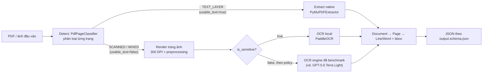

# DOC-04 · Architecture

> Tài liệu kiến trúc hệ thống **Contract Intelligence**.

---

## 🏗️ System Design (Thiết kế hệ thống)

> *Tổng quan kiến trúc, các thành phần, và luồng dữ liệu chính.*

### High-Level Architecture

```
┌─────────────────────────────────────────────────────────┐
│                     Frontend (Web)                       │
│  Upload → Clause Viewer → Conflict Review → Approve     │
└──────────────────────┬──────────────────────────────────┘
                       │ HTTP/REST
┌──────────────────────▼──────────────────────────────────┐
│               Backend (Java Spring Boot)                 │
│  Contract Module | Extraction Module | Conflict Module   │
│  Review Module | Shared Kernel                          │
└──────────────────────┬──────────────────────────────────┘
                       │ JPA / SQL
┌──────────────────────▼──────────────────────────────────┐
│               PostgreSQL (RDBMS)                         │
│  contracts | clauses | conflicts | review_logs           │
└─────────────────────────────────────────────────────────┘
                       │
                       │ Async / REST (optional)
┌──────────────────────▼──────────────────────────────────┐
│             AI Service (Python - Optional)              │
│  OCR → Text Extraction → LLM Clause Extraction          │
└─────────────────────────────────────────────────────────┘
```

### Component Diagram

<!--
[Cập nhật sau khi backend/ được generate đầy đủ]

┌──────────────┐     ┌──────────────────┐     ┌──────────────────┐
│   Frontend   │────▶│  ContractModule  │────▶│  PostgreSQL      │
│              │     │  ExtractionModule│     │                  │
│              │     │  ConflictModule  │     │                  │
│              │◀────│  ReviewModule    │     │                  │
└──────────────┘     └──────────────────┘     └──────────────────┘
                            │
                            ▼ (optional)
                     ┌──────────────────┐
                     │  AI Service      │
                     │  (OCR + LLM)      │
                     └──────────────────┘
-->

---

## 🗄️ Database Schema

> *Chi tiết bảng trong PostgreSQL. Xem Flyway migration scripts tại `backend/src/main/resources/db/migration/`.*

### Entity Relationship (mô tả)

```
contracts ──────< contract_pages
    │
    └────────────< clauses ──────────< clauses (self-ref: parent_clause_id)
                      │
                      └────────────< appendix_tables
    │
    └────────────< conflicts
    │
    └────────────< review_logs
```

### Bảng chính

| Bảng | Mô tả | Module |
|------|--------|--------|
| `contracts` | Hợp đồng gốc, metadata, trạng thái | contract |
| `contract_pages` | Mỗi trang của hợp đồng, lưu file path | contract |
| `clauses` | Điều khoản trích xuất, có cấu trúc phân cấp (Điều > Khoản > Điểm) | extraction |
| `appendix_tables` | Bảng phụ lục trích xuất từ hợp đồng | extraction |
| `conflicts` | Xung đột phát hiện giữa 2 điều khoản | conflict |
| `review_logs` | Audit trail: action của reviewer | review |

---

## 🔄 Flow / Luồng xử lý

> *Mô tả luồng end-to-end khi 1 hợp đồng được upload.*

```
1. Upload  ──▶ Tạo Contract (status=UPLOADED)
                     │
2. OCR/IDP ──▶ Trích xuất text từng trang (FileStorage)
                     │
3. Extraction ──▶ LLM parse → Clause tree (Điều > Khoản > Điểm)
                     │                  status=EXTRACTED
                     │
4. Conflict Detection ──▶ So sánh clause → Tạo Conflict entries
                     │                  status=PENDING
                     │
5. Review (HITL) ──▶ Reviewer sửa/confim clause, resolve conflicts
                     │                  status=PENDING_REVIEW
                     │
6. Approve ──▶ Contract status=APPROVED, review complete
```

---

## 🔍 OCR/Ingestion chi tiết (đóng góp từ AI Service)

> *Chi tiết hoá bước 2 "OCR/IDP" ở Flow trên. Bản đầy đủ, đã review nội bộ: `ai-service/architecture.md` §4, §5, §7.*



Phân loại và routing chạy **theo từng trang**, không theo cả tài liệu — một hợp đồng `MIXED` vẫn có trang native và trang OCR trong cùng một lần xử lý.
Nguồn code: [`classify_pdf.py:15-30`](../ai-service/src/contract_ocr/application/use_cases/classify_pdf.py), [`process_document.py:62-104`](../ai-service/src/contract_ocr/application/use_cases/process_document.py). Test xác nhận: `tests/integration/test_pipeline.py::test_native_routing_and_ocr`.

### Chọn engine OCR dựa trên benchmark

Tiêu chí chọn primary/fallback (ADR-10 trong `ai-service/architecture.md` §7.3): CER/WER, độ chính xác trường quan trọng (critical-field accuracy), citation coverage, thời gian p50/p95, chi phí/trang — đo trên cùng bộ dataset, không chọn theo tên gọi hay giá công bố của nhà cung cấp.

**Trạng thái hiện tại:** chưa có số benchmark chính thức để chốt engine — bộ dataset 30 mẫu mới có 10/30 (xem `ai-service/docs/DATASET.md`), chưa chạy `cli/main.py benchmark` đầy đủ. AI Service đang dùng **GPT-5.6 Terra Light** làm engine thử nghiệm mặc định trong lúc chờ số đo thật; đây là lựa chọn tạm, sẽ xác nhận lại bằng benchmark trước khi chốt chính thức.

---

## 🔌 Integration Points

> *Các điểm tích hợp với hệ thống bên ngoài.*

| Integration | Method | Mục đích |
|------------|--------|----------|
| AI Service (OCR/IDP) | REST call từ backend đến ai-service | Trích xuất text & clause |
| File Storage | Local filesystem (swapable sang S3) | Lưu file hợp đồng gốc |
| Email / Notification | Spring Mail / SMTP (tương lai) | Thông báo reviewer khi có contract cần duyệt |

---

## ⚠️ ADRs (Architecture Decision Records)

> *Ghi lại các quyết định kiến trúc quan trọng.*

| ADR # | Chủ đề | Quyết định | Lý do |
|-------|--------|-----------|-------|
| ADR-01 | Ngôn ngữ backend | Java 17 + Spring Boot 3.x | Mature, enterprise, strong typing |
| ADR-02 | Database | PostgreSQL | JSONB support cho clause metadata |
| ADR-03 | Kiến trúc | Clean Architecture + DDD | Tách business logic khỏi framework |
| ADR-04 | AI worker | Tách riêng ai-service/ (tuỳ chọn) | Scale OCR/LLM độc lập |
| ADR-05 | File storage | Local filesystem trước | Đơn giản v1, swap S3 sau |
| ADR-06 | Migration | Flyway | Version-controlled DB schema |

---

## 📁 Key Directories

```
backend/
├── src/main/java/com/vsf/contractintel/
│   ├── contract/      # Bounded Context: Upload & quản lý hợp đồng
│   ├── extraction/    # Bounded Context: Trích xuất điều khoản
│   ├── conflict/      # Bounded Context: Phát hiện xung đột
│   ├── review/        # Bounded Context: HITL review
│   └── shared/        # Shared Kernel
├── src/main/resources/
│   ├── application.yml
│   └── db/migration/  # Flyway scripts (V1, V2, V3…)
└── pom.xml
```
