# DOC-04 · KIẾN TRÚC PHẦN MỀM — Contract Intelligence

> Đây là thiết kế chuẩn để review mentor và làm baseline triển khai. Tài liệu là đề xuất kiến trúc, không phải bằng chứng benchmark, chất lượng production hoặc kết luận pháp lý.

| Thuộc tính | Nội dung |
|---|---|
| Mã tài liệu / sản phẩm | DOC-04 / Contract Intelligence (PROD-01) |
| Phiên bản / trạng thái | v0.7 — Draft · Ready for Review |
| Owner / Contributors | Architecture Lead / Backend, AI1, AI2, Frontend, QA |
| Reviewer | Mentor |
| Ngày hiệu lực / review | 17/09/2026 / TBD |
| Upstream | DOC-01, DOC-02, DOC-03, `contracts/` canonical |
| Downstream | DOC-05 API, DOC-06 evaluation, implementation/test plan |
| Thay thế | Architecture cũ trong `docs/archive/` — chỉ legacy/audit |

## Mục lục

1. [Tóm tắt kiến trúc](#1-tóm-tắt-kiến-trúc)
2. [Phạm vi, nguyên tắc và ADR](#2-phạm-vi-nguyên-tắc-và-adr)
3. [System context, trust boundary và module](#3-system-context-trust-boundary-và-module)
4. [Dossier, manifest và lifecycle](#4-dossier-manifest-và-lifecycle)
5. [Execution, queue và recovery](#5-execution-queue-và-recovery)
6. [OCR/layout cho tài liệu dài](#6-ocrlayout-cho-tài-liệu-dài)
7. [Evidence, CPS và grounding](#7-evidence-cps-và-grounding)
8. [IDP, annex link và comparison](#8-idp-annex-link-và-comparison)
9. [Vòng lặp re-OCR có giới hạn](#9-vòng-lặp-re-ocr-có-giới-hạn)
10. [Data, API và HITL](#10-data-api-và-hitl)
11. [Security, observability và egress](#11-security-observability-và-egress)
12. [Evaluation, release và acceptance](#12-evaluation-release-và-acceptance)
13. [API và boundary nội bộ chi tiết](#13-api-và-boundary-nội-bộ-chi-tiết)
14. [HITL, approval và UX evidence](#14-hitl-approval-và-ux-evidence)
15. [Observability, dashboard, alert và runbook](#15-observability-dashboard-alert-và-runbook)
16. [Dataset, ground truth và evaluation protocol](#16-dataset-ground-truth-và-evaluation-protocol)
17. [Chi phí, capacity và external service register](#17-chi-phí-capacity-và-external-service-register)
18. [Security, retention và vận hành local](#18-security-retention-và-vận-hành-local)
19. [Kiểm thử và quality gate](#19-kiểm-thử-và-quality-gate)
20. [Delivery roadmap, traceability và mentor review](#20-delivery-roadmap-traceability-và-mentor-review)
21. [IDP tốc độ cao và chống hallucination](#21-idp-tốc-độ-cao-và-chống-hallucination)
22. [Change record](#22-change-record)

## 1. Tóm tắt kiến trúc

Contract Intelligence xử lý một hợp đồng và `0..n` phụ lục PDF. Hệ thống tạo snapshot OCR/layout bất biến, dựng cấu trúc Điều–Khoản–Điểm/bảng, trích fact typed có citation, rồi tạo finding kỹ thuật có evidence hai phía. Reviewer kiểm tra và phê duyệt output nội bộ; hệ thống không tư vấn pháp lý hay tự quyết hiệu lực/phạm vi ưu tiên của hợp đồng.

Kiến trúc đi theo nguyên tắc **evidence-first**. OCR không chạy một lần rồi được tin tuyệt đối: AI2 chỉ phát hiện evidence gap; Backend FastAPI kiểm policy, phạm vi và ngân sách hữu hạn; AI1 re-OCR đúng vùng/trang/cặp trang cần thiết. Mọi source, output, retry và chỉnh sửa đều truy vết được.

Mô hình tích hợp là **backend-push**: Backend FastAPI sở hữu PostgreSQL task table, dispatcher claim task rồi gọi `ai-service` qua HTTP REST (`POST /jobs/...`, `GET /jobs/{id}` polling). `ai-service` là HTTP service stateless: không kết nối PostgreSQL, không sở hữu queue/lease, chỉ đọc artifact qua URL ngắn hạn do backend cấp và trả kết quả có digest cho backend validate rồi persist.

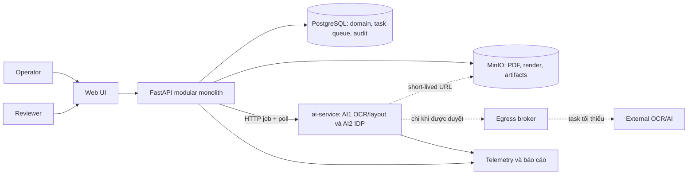

## 2. Phạm vi, nguyên tắc và ADR

### 2.1 Phạm vi

| Trong phạm vi | Ngoài phạm vi |
|---|---|
| PDF tiếng Việt native/scan/mixed; thử nghiệm Anh/song ngữ khi có data | Tư vấn pháp lý, tự kết luận hiệu lực/precedence, ký tự động |
| Clause/table/fact/finding có citation và bbox | Sửa PDF gốc, xác minh chữ ký, cam kết handwriting |
| Single dossier, batch, HITL, audit, bounded repair | Train model, microservice, Kubernetes, enterprise DMS/IAM |
| Local baseline và external route đã được duyệt | Gửi sample mentor ra ngoài khi chưa có policy/mentor approval |

### 2.2 Nguyên tắc không được phá vỡ

1. PDF nguồn, artifact máy, execution manifest và revision con người đều append-only.
2. Fact/finding tích cực chỉ được publish khi có source, citation, coverage evidence-eligible và context hợp lệ.
3. Output model là input không đáng tin: validate schema, định danh, quote, geometry, context và ledger trước persist.
4. Khác giá trị chưa là conflict: phải xét subject, unit, currency, VAT basis, scope và validity.
5. `CANDIDATE_AMENDMENT` chỉ là candidate kỹ thuật; Reviewer vẫn chịu trách nhiệm quyết định.
6. Task lỗi luôn có trạng thái/lý do; không được biến mất hay âm thầm thành công.

### 2.3 Architecture Decision Records

| ADR | Quyết định | Hệ quả |
|---|---|---|
| ADR-01 | Python 3.12 + FastAPI sở hữu public API, domain, RBAC, persistence và orchestration (thay quyết định Java/Spring trước 17/09/2026, xem [§22](#22-change-record)). | Một business authority, theo `backend/`. Runtime mục tiêu là 3.12; `pyproject.toml` hiện còn khai báo `>=3.11` và phải nâng đồng bộ trước merge. |
| ADR-02 | AI1/AI2 nằm trong `ai-service`, một Python HTTP service nội bộ, stateless, được backend gọi theo mô hình push (`POST /jobs`, `GET /jobs/{id}` polling). | `ai-service` không kết nối PostgreSQL, không sở hữu queue/lease/callback lifecycle, không ghi business table, không có public API. Mọi kết quả đi qua backend validate. |
| ADR-03 | PostgreSQL là system of record và task queue MVP; task table do backend dispatcher sở hữu độc quyền. | Không thêm Redis/Celery/second state store khi chưa có bằng chứng cần thiết. |
| ADR-04 | MinIO là S3-compatible object-storage adapter cho PDF/render; local compose dùng MinIO. | PostgreSQL chỉ lưu metadata/digest/object key, không lưu PDF/render lớn. |
| ADR-05 | `ai1.snapshot.v3` là handoff OCR/layout canonical. | Backend FastAPI semantic gate trước khi IDP nhận dữ liệu. |
| ADR-06 | CPS là hệ tọa độ trang đứng đã chuẩn hóa. | Mọi consumer dùng chung bbox convention. |
| ADR-07 | Finding là domain canonical; Conflict chỉ là queue/UI/API surface. | Không sinh entity/pipeline conflict thứ hai. |
| ADR-08 | AI2 trả `EvidenceGapDetected.v2` trong kết quả job; Backend FastAPI tạo `ReOcrRequest.v3`. | AI2 không bypass OCR, budget hay egress policy. |
| ADR-09 | Product workflow, run, review và re-OCR là state machine tách biệt. | Partial operation vẫn minh bạch. |
| ADR-10 | Reviewer có quyền approve output dossier nội bộ. | Khớp DOC-01/02/03; không phải legal approval. |
| ADR-11 | Page/chunk ledger là authority của completeness. | Không dùng word count để chứng minh tài liệu dài đã xử lý đủ. |
| ADR-12 | Retry/repair/provider dùng shared finite budget. | Không loop vô hạn hoặc phát sinh chi phí không kiểm soát. |

## 3. System context, trust boundary và module

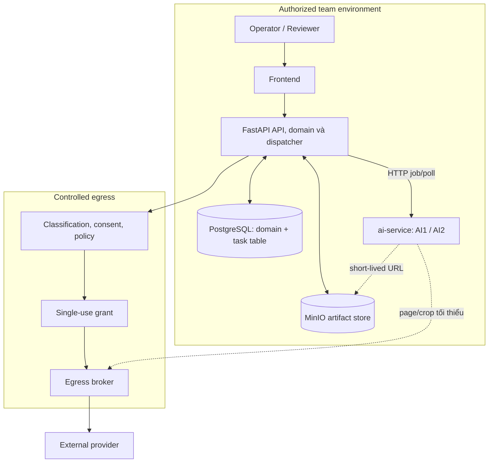

| Boundary | Cơ chế kiểm soát |
|---|---|
| Client → API | authentication, tenant/RBAC, MIME/magic-byte, AV, size/page limit, idempotency |
| API ↔ artifact | URI/digest private, đọc qua quyền ngắn hạn |
| FastAPI backend → ai-service | service credential (API key nội bộ Sprint 1, mTLS khi có hạ tầng), `task_id`/`attempt_id`, URL artifact ngắn hạn; ai-service không gọi ngược backend và không nhận callback URL từ client |
| ai-service → external | grant bất biến bind task/snapshot/target/policy/provider; default deny |
| Telemetry | chỉ metadata allowlist; không raw PDF/OCR/prompt/signed URL mặc định |

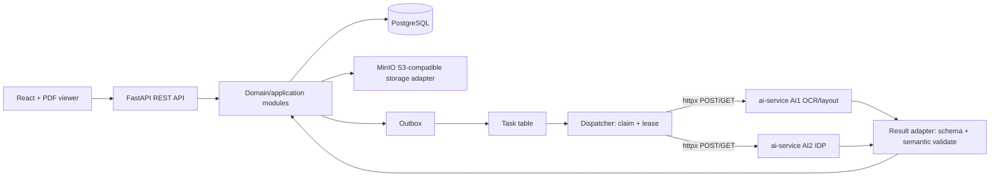

| Module | Sở hữu | Không được sở hữu |
|---|---|---|
| intake | dossier, document version, manifest, upload validation | OCR result hoặc legal conclusion |
| orchestration | run/task/lease/outbox/retry/coverage, dispatcher gọi ai-service | extraction/comparison semantics |
| evidence | snapshot validation, CPS, citation resolve | sửa source |
| AI1 (ai-service) | render/page route/OCR/layout/table candidate | public API, DB access, domain write |
| AI2 (ai-service) | structure/fact/link/compare/evidence-gap candidate | gọi OCR trực tiếp, DB access, kết luận pháp lý |
| review | revision append-only/CAS/approval | ghi đè output máy |
| policy/egress | consent/provider/usage/grant validation | cấp credential provider tùy ý |

### 3.1 Stack backend baseline

Bảng dưới tham chiếu skeleton trên branch `feature/backend-setup`. Skeleton là scaffold để mentor review cấu trúc project, không phải feature code đã được duyệt; theo DOC-03 CON-06, business logic chỉ bắt đầu sau khi mentor phê duyệt kiến trúc và cấu trúc project.

| Hạng mục | Công nghệ baseline / hướng triển khai |
|---|---|
| Runtime | Python 3.12 là target của team; branch hiện khai báo Python `>=3.11`, cần nâng `requires-python`, Ruff và MyPy target trước merge để khớp target. |
| HTTP/API | FastAPI + Uvicorn; OpenAPI tại `/openapi.json`, Swagger `/docs`, ReDoc `/redoc`. |
| Validation/settings | Pydantic v2 + pydantic-settings. |
| Persistence | SQLAlchemy 2.x async + `asyncpg`; migration bằng Alembic. |
| Queue MVP | PostgreSQL task table do backend dispatcher claim bằng lease token, `FOR UPDATE SKIP LOCKED`, heartbeat và bounded reclaim; ai-service không truy cập bảng này. |
| Object storage | MinIO S3-compatible; tách bucket PDF và render, adapter nằm ở infrastructure. |
| AI boundary | `extraction/infrastructure/ai_client` dùng `httpx` gọi `ai-service` (`POST /jobs/{kind}`, `GET /jobs/{id}`); Sprint 1 dùng REST polling, không callback, không để router gọi model trực tiếp. |
| Observability | OpenTelemetry FastAPI SDK + structlog; export là optional profile. |
| Test/quality | pytest/pytest-asyncio/httpx, Ruff, MyPy strict và import-linter. |

### 3.2 Clean Architecture và bounded context thực tế

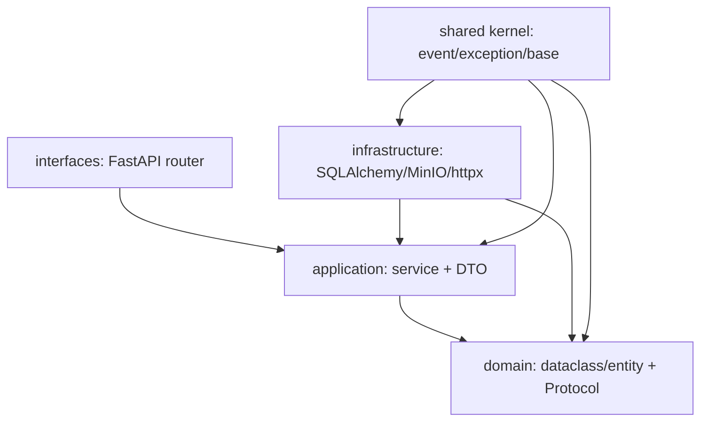

Backend có bốn bounded context: `contract` (Dossier/Document/Job), `extraction` (Page/OcrLine/Citation/ClauseNode/Fact/PipelineRun), `conflict` (Finding/FindingSide/AnnexLink) và `review` (ReviewItem/ReviewAction/DossierApproval). Mỗi context có `domain`, `application`, `infrastructure`, `interfaces`.

Dependency rule: `domain` chỉ stdlib/shared và không import FastAPI/SQLAlchemy/MinIO/httpx; `application` chỉ domain/shared; `infrastructure` implement Protocol và không import router; `interfaces` chỉ parse HTTP/DTO rồi gọi application service. `import-linter` là CI gate, không chỉ là convention.

## 4. Dossier, manifest và lifecycle

`Dossier` là đơn vị xử lý. Một manifest version có đúng một `CONTRACT` và `0..n ANNEX`. Mỗi relation có `relationship_id` bất biến, bind manifest/document/source digest/citation IDs. Relation do user khai báo phải được Reviewer `CONFIRM` đúng relation đó trước khi compare cross-document.

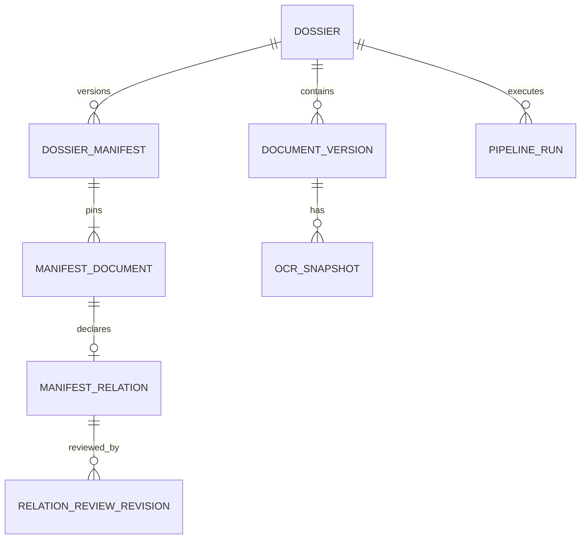

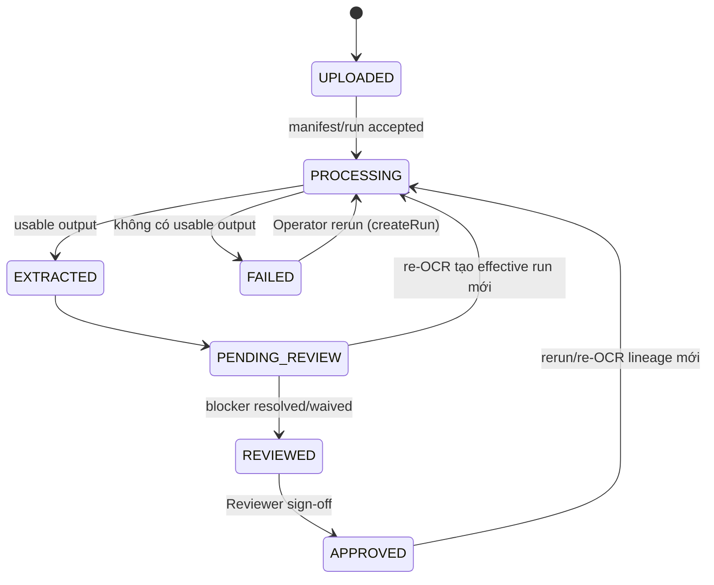

`conflict_detected` là nhãn hiển thị phái sinh. `FAILED` không phải trạng thái chết: Operator có thể tạo rerun whole-dossier (DOC-05 `createRun`) hoặc batch `RETRY`. Run/review/approval cũ vẫn audit được sau khi effective lineage thay đổi.

### Batch

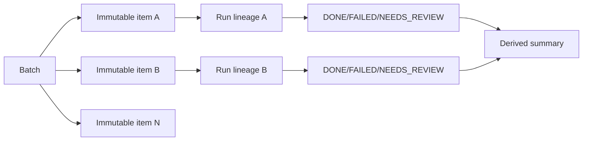

Batch action dùng ETag CAS. `RETRY` tạo đúng một run mới. `CANCEL` không tạo run và lưu `resulting_run_id = null`. Một item lỗi không abort các item khác.

## 5. Execution, queue và recovery

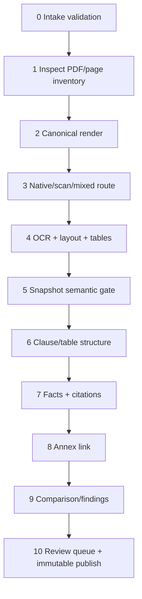

S1–S5 chạy theo page với concurrency bị giới hạn. S6/S7 có thể stream finalized chunk. S8–S10 chỉ chờ evidence liên quan, không chờ các task không liên quan.

```mermaid
sequenceDiagram
  participant O as Orchestrator (outbox)
  participant P as PostgreSQL task table
  participant D as Backend dispatcher
  participant S as ai-service HTTP
  participant A as Result adapter
  O->>P: enqueue unique(run,step,scope)
  D->>P: claim SKIP LOCKED + lease token
  D->>S: POST /jobs/{kind} (task_id, attempt_id, short-lived artifact URL, config digest)
  S-->>D: 202 job_id
  loop poll với backoff, heartbeat lease
    D->>S: GET /jobs/{job_id}
    S-->>D: RUNNING | SUCCEEDED(result + digest) | FAILED(error code)
  end
  D->>A: result + digest + attempt/lease token
  A->>P: schema/semantic validate, persist artifact + outbox atomically
  Note over D,P: lease hết hạn được reclaim với bounded retry; job ai-service mồ côi bị huỷ theo task_id
```

Task key là `(run_id, step, scope_key)` với scope không null. Result chỉ được nhận cho attempt/lease đang active; result trả về cho attempt cũ bị bỏ và ghi audit. `ai-service` job là ephemeral: backend là nơi duy nhất giữ trạng thái bền vững của task. Transport retry, quality repair và provider usage là các counter khác nhau.

## 6. OCR/layout cho tài liệu dài

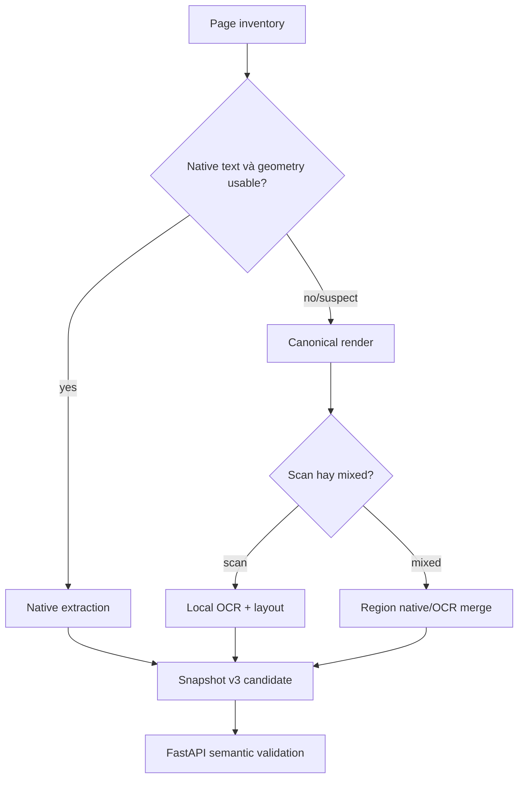

Native text chỉ được nhận khi content/geometry/coverage đều usable. Hidden OCR, mojibake, thiếu coverage sẽ route sang repair. Trang trắng là `BLANK_VERIFIED`, không bao giờ bị bỏ qua âm thầm.

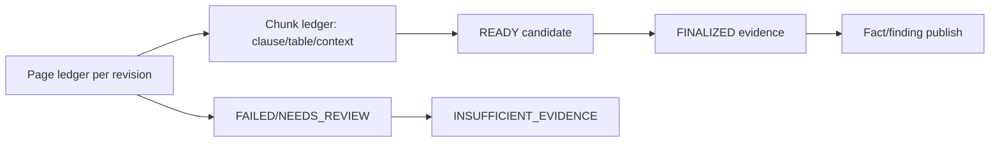

| Ledger | Quy tắc |
|---|---|
| Page | `PENDING`, `PROCESSING`, `COMPLETED`, `BLANK_VERIFIED`, `NEEDS_REVIEW`, `FAILED`; chỉ completed/blank evidence-eligible. |
| Chunk | `BLOCKED`, `READY`, `FINALIZED`; clause/table cross-page cần mọi continuation page. |

Ánh xạ từ `ai1.snapshot.v3` sang page ledger do backend thực hiện, không suy diễn từ word count:

| Snapshot page `status` / `quality.coverage_status` | Ledger state |
|---|---|
| `SUCCESS` / `COMPLETE` | `COMPLETED` |
| `SUCCESS` / `BLANK_VERIFIED` (bắt buộc `lines=[]`, `tables=[]`) | `BLANK_VERIFIED` |
| `SUCCESS` hoặc `PARTIAL` / `NEEDS_REVIEW` | `NEEDS_REVIEW` |
| `FAILED` / `FAILED`, hoặc page thiếu trong inventory | `FAILED` |
| Chưa có snapshot page cho revision hiện tại | `PENDING` / `PROCESSING` theo task |
| Partial output | Có thể hiển thị kèm issue; không được claim dossier complete hay positive finding từ evidence thiếu. |

Với hợp đồng 50 trang, OCR theo page/crop có checkpoint. Extraction theo clause/chunk. Comparison chỉ nhận hai nguồn và context cần thiết, không gửi cả dossier thành một prompt. Hỏng trang 27 chỉ invalidates dependency liên quan, không mặc định OCR lại toàn bộ.

Throughput control: giới hạn riêng render/OCR/provider/AI2; backpressure task/rendered bytes/RPM/TPM/budget; cache key gồm source/crop/render/preprocess/engine/model/prompt/schema/config. Candidate ban đầu: 3 transport attempts, 1 quality repair, 4 provider submissions, 4 crop children, depth 1 — không phải SLA.

## 7. Evidence, CPS và grounding

Bbox là `[x0,y0,x1,y1]`, normalized 0..1, origin top-left, trên exact upright render sau rotation đúng một lần. Page giữ render/source digest, dimensions và transform version.

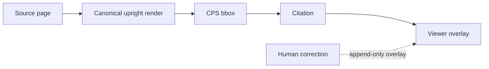

| Geometry source | Quy tắc evidence |
|---|---|
| `native`/`detector`, measured | Có thể là word-level geometry sau validation |
| `derived`/`line_only` | Chỉ region provenance, không được nâng thành measured word evidence |
| `absent` | Không claim bbox; tạo evidence gap/review nếu geometry cần thiết |

Citation bind snapshot/document/page/render digest, line, raw Unicode code-point span, exact quote, word IDs và geometry. Raw text không normalize/trim/rewrite trước cite. Fixture cover `A😀B`, tiếng Việt composed/decomposed, CRLF và repeated token.

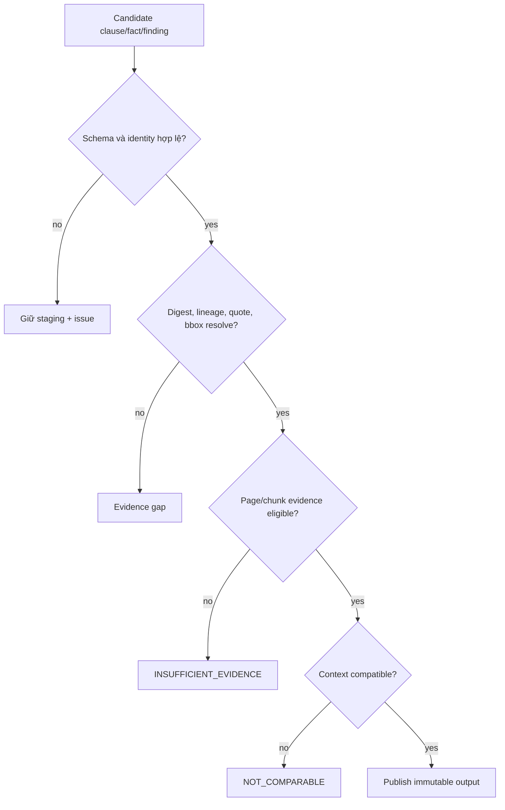

## 8. IDP, annex link và comparison

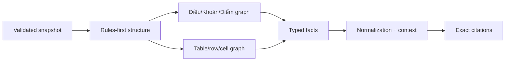

Fact giữ raw value, normalized value hoặc null+reason, business role, context và citation. Tiền tệ dùng decimal/minor-unit, không float. Ambiguity phải được giữ, không đoán.

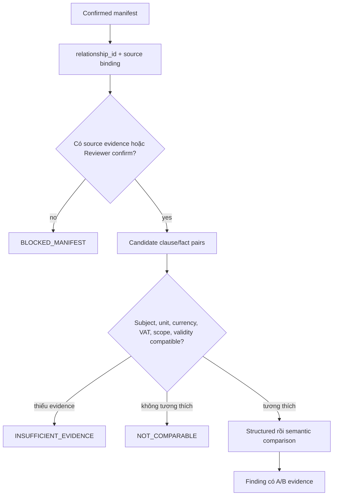

| Disposition | Nghĩa | Queue (DOC-05 `Finding.queue`) |
|---|---|---|
| `COMPARABLE_MATCH` | Giá trị/context comparable giống nhau | `null` — không tạo review item, vẫn hiển thị và tính vào denominator |
| `COMPARABLE_DIFFERENCE` | Khác nhau nhưng chưa có amendment proof | `CONFLICT` |
| `CANDIDATE_AMENDMENT` | Candidate kỹ thuật có relation/reference, amendment wording, effective evidence | `CONFLICT` |
| `NOT_COMPARABLE` | Context không tương thích | `NOT_COMPARABLE` |
| `INSUFFICIENT_EVIDENCE` | Thiếu/invalid evidence hoặc context | `NEEDS_EVIDENCE` |

Chỉ difference/amendment có evidence hai phía mới vào Conflict. Evidence thiếu là queue/metric riêng. Reviewer vẫn có thể mở review item thủ công cho một `COMPARABLE_MATCH` (target `FINDING`) nếu muốn phủ định; khi đó queue của review item là `CONFLICT`.

## 9. Vòng lặp re-OCR có giới hạn

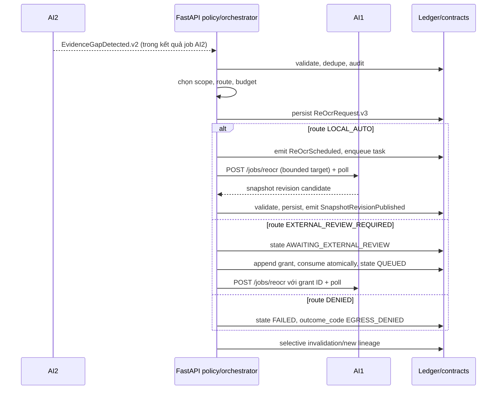

AI2 không gọi OCR hay thay raw text/bbox. AI1 không tự publish: backend validate kết quả rồi phát `SnapshotRevisionPublished`. Operator chỉ retry/cancel request local đã audit bằng ETag CAS.

| Action | Required scope | Coverage | Trường hợp |
|---|---|---|---|
| `REGION_RESCAN` | 1 page + CPS region | target | quality/geometry/critical ambiguity |
| `PAGE_PAIR_CONTEXT` | 2 page liền kề | target + continuation | cross-page context |
| `OUTPUT_SPLIT` | page hoặc pair | bounded split | output truncation |

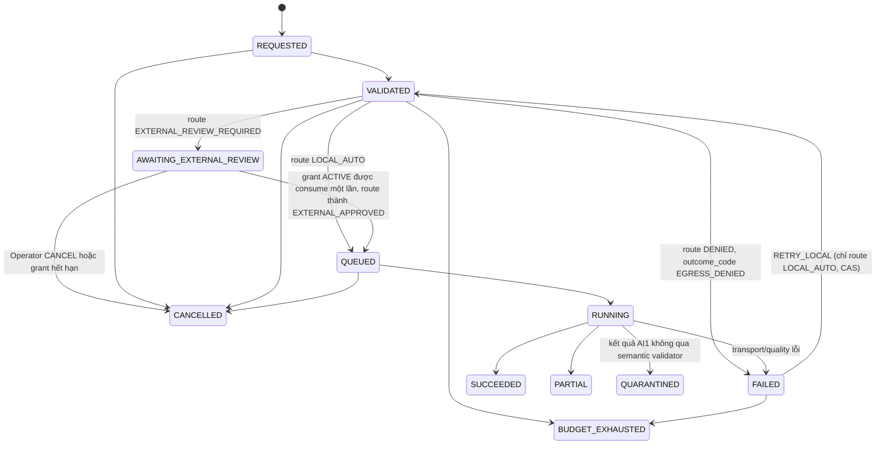

`state` và `resolved_route` là hai trục độc lập trong `reocr-request.v3`: `DENIED`/`EXTERNAL_APPROVED` là giá trị route, không phải state. Route `DENIED` luôn đi kèm state `FAILED` và `outcome_code`; route `EXTERNAL_REVIEW_REQUIRED` luôn đi kèm state `AWAITING_EXTERNAL_REVIEW`; approval grant đổi route sang `EXTERNAL_APPROVED` và state sang `QUEUED`. `QUARANTINED` là kết quả bị giữ lại vì vi phạm contract, không được retry tự động.

`external-egress-approval-grant.v1` bind request, source snapshot, target digest, tenant, policy/consent, provider/model/region/retention/profile, actor, expiry và single-use state. UUID không tự tạo quyền egress. Re-OCR tạo full snapshot inventory mới và selective invalidation.

## 10. Data, API và HITL

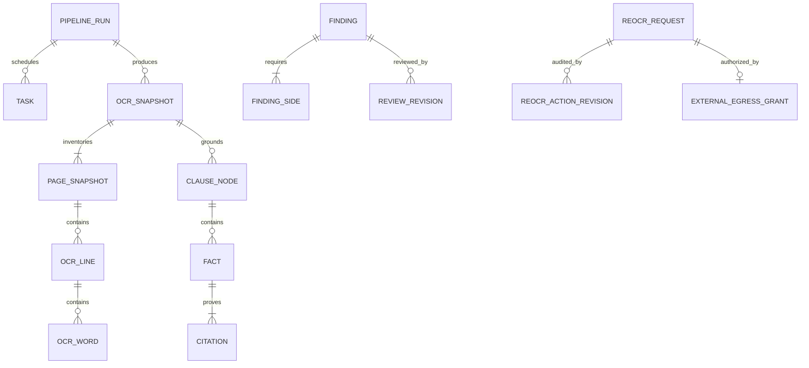

DOC-05 là authority của HTTP. FastAPI backend resolve child resource, kiểm tenant và path-parent containment, rồi mới RBAC. Mismatch trả `404` hoặc `403` theo anti-enumeration policy.

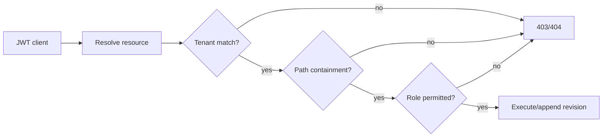

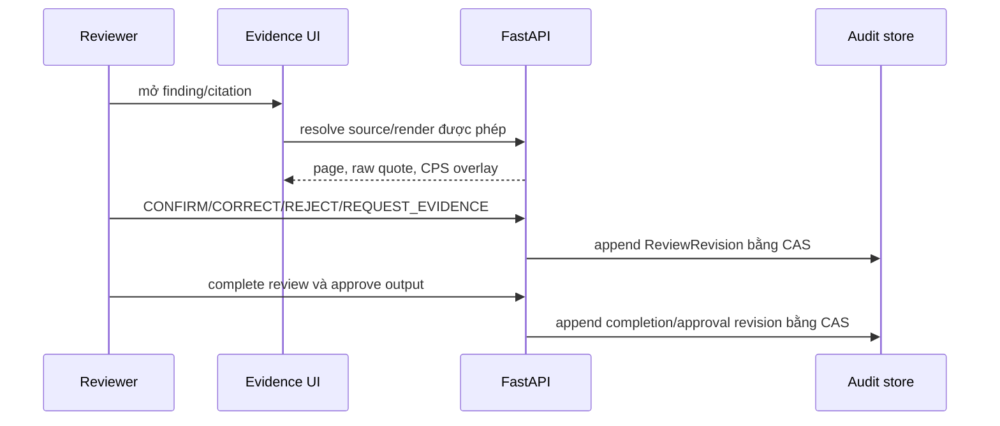

Review, relation review, batch action, re-OCR action phải giữ actor/time/reason/idempotency; stale revision trả `409`. Approval là internal sign-off của Reviewer, không phải legal approval.

## 11. Security, observability và egress

| Control | Kiến trúc áp dụng |
|---|---|
| Isolation | tenant + containment trước RBAC; storage/cache key theo tenant |
| Integrity | SHA-256, source/version bất biến, render/source digest lineage |
| Upload safety | MIME/magic, AV, encrypted/corrupt PDF handling, pixel/time limit |
| Audit | review/action/grant/retry append-only |
| Privacy | không log source/OCR/prompt/signed URL; retention tombstone/purge verification |

```mermaid
flowchart LR
  API[FastAPI API] --> OTEL[OpenTelemetry collector]
  AI[AI workers] --> OTEL
  OTEL --> MET[Metrics/dashboard]
  OTEL --> TRACE[Traces]
  OTEL --> LOG[Redacted logs]
  DB[(Business/audit ledger)] --> REP[Operational reports]
  MET --> ALERT[Alerts/runbook]
```

Theo dõi task age, lease reclaim, page/chunk eligibility, unresolved citation/reference, contract invalid, repair/submission counter, budget exhaustion, cache hit, batch state, cost và review queue age. Dossier/page ID chỉ nằm ở trace/audit, không làm metric label vô hạn.

```mermaid
flowchart TD
  E[External candidate] --> C{Classification và consent hợp lệ?}
  C -->|no| HOLD[DENIED/AWAITING_REVIEW]
  C -->|yes| P{Provider/model/region/retention allowlisted?}
  P -->|no| HOLD
  P -->|yes| B{Budget còn?}
  B -->|no| HOLD
  B -->|yes| G[Append immutable single-use grant]
  G --> U[Consume grant atomically]
  U --> Q[Queue page/crop tối thiểu]
```

## 12. Evaluation, release và acceptance

Fixture chứng minh contract integration, không chứng minh OCR quality. DOC-06 chỉ được claim khi có dataset được phép, gold/adjudication, denominator, execution/config provenance và điều kiện chạy.

| Dimension | Candidate measurement |
|---|---|
| OCR | CER, WER, diacritic accuracy, critical-field accuracy |
| Geometry/citation | bbox coverage/IoU, quote/span/word resolve exact |
| Structure/table | hierarchy và table/cell exactness |
| Fact/finding | precision/recall/F1 theo type/source pair, reviewer outcome |
| Operations | p50/p95 page/dossier, throughput, retry/cost |

Hai state machine tách biệt, khớp DOC-05 `ConfigBundle.status` và `ConfigBinding.state`:

```mermaid
stateDiagram-v2
  state "ConfigBundle" as B {
    [*] --> DRAFT
    DRAFT --> STATIC_VALIDATED
    STATIC_VALIDATED --> DEV_EVALUATED
    DEV_EVALUATED --> HOLDOUT_EVALUATED: QUEUE_SEALED_HOLDOUT + run
    HOLDOUT_EVALUATED --> APPROVED: human dual approval
    APPROVED --> ACTIVE: binding ACTIVE
    ACTIVE --> RETIRED
    DEV_EVALUATED --> REVOKED: gate failed
    HOLDOUT_EVALUATED --> REVOKED: gate failed / rejected
    APPROVED --> REVOKED
  }
  state "ConfigBinding" as R {
    [*] --> SHADOW: APPROVE_SHADOW
    SHADOW --> CANARY: APPROVE_CANARY
    CANARY --> ACTIVE: ACTIVATE
    SHADOW --> PAUSED
    CANARY --> PAUSED
    ACTIVE --> ROLLED_BACK: rollback tạo binding mới
  }
```

Config bundle immutable/digested. Dataset split theo source/template/dossier family. Promotion kiểm citation, geometry, critical fact, failure/needs-evidence, cost theo stratum; missing/failed vẫn thuộc denominator. Rollback tạo binding mới và giữ historical run.

### Acceptance và open decisions

Acceptance architecture: reject tampered digest/unknown schema/stale lease/unauthorized path; snapshot v3 full inventory và Unicode/CPS citation round-trip; 50-page dossier thấy rõ missing middle page; external OCR bị chặn khi chưa có valid consumed grant; CAS lineage cho review/relation/re-OCR/batch; finding hai phía nguồn; report có dataset, `n`, config và denominator.

| Open decision | Owner/evidence |
|---|---|
| OCR/layout engine chính và fallback | AI1 + DOC-06 benchmark + mentor |
| DPI/preprocessing profile | benchmark đo được, không mặc định quality promise |
| Laptop concurrency/dossier limit | operational measurement |
| External provider enablement | mentor/policy approval; default deny |
| Semantic comparison scope | DOC-02 và reviewer validation |

Mọi thay đổi ADR, contract, lifecycle, role hoặc evidence rule phải có change record theo ngày và đồng bộ DOC-01…DOC-06/contracts.

## 13. API và boundary nội bộ chi tiết

DOC-05 là authority cho đường dẫn, request/response DTO, RBAC và mã lỗi HTTP. DOC-04 chỉ định boundary và invariant; implementation không được tự mở endpoint OCR direct để “cho tiện demo”.

| Nhóm API | Năng lực | Invariant kiến trúc |
|---|---|---|
| Intake | List/tạo dossier, upload source, confirm manifest (kèm `declared_language_scope`) | Source chỉ được tạo version mới; manifest pin document/source digest và language scope. |
| Processing | Tạo/list/get run, coverage ledger | Rerun là whole-dossier; không mutate run/snapshot cũ. |
| Evidence | List page (render + OCR line/word), clause tree, fact, finding; resolve citation | Render/object URL phải scoped, short-lived và tenant-bound; page/line/clause/fact luôn pin `snapshot_id`/`run_id`. |
| Review | Append finding/relation/approval revision | Mọi ghi sửa là append-only, CAS, có actor/time/reason. |
| Batch | Tạo batch, list item, retry/cancel item | Membership bất biến; action không ảnh hưởng item khác. |
| Re-OCR | Query request, local retry/cancel audited | Public API không tạo direct re-OCR hoặc external route. |
| Internal policy | Append external approval grant | Service command qua security scheme riêng (`serviceIdentity`, mTLS-terminated), không phải public operator endpoint. |
| Backend → ai-service | `POST /jobs/{ocr\|reocr\|idp}`, `GET /jobs/{id}`, `DELETE /jobs/{id}` | Internal contract của ai-service, không nằm trong DOC-05 public API; request luôn mang `task_id`/`attempt_id`, artifact URL ngắn hạn và config digest. |

```mermaid
sequenceDiagram
  actor U as Client
  participant G as FastAPI API
  participant R as Resource resolver
  participant P as Policy/RBAC
  participant D as Domain service
  U->>G: Request + JWT + Idempotency-Key
  G->>R: Resolve resource và parent path
  R-->>G: tenant + containment result
  G->>P: Check tenant, role, data classification
  P-->>G: allow/deny
  alt allow
    G->>D: Execute immutable command/query
    D-->>G: Result + revision/ETag
    G-->>U: 2xx
  else deny hoặc stale
    G-->>U: 403/404/409/422 Problem Details
  end
```

### 13.1 Idempotency, CAS và audit action

* Command tạo resource dùng `idempotency_key` scoped theo tenant/operation/request digest.
* Action mutation dùng expected ETag hoặc expected previous revision. Khác revision phải trả `409`; server không last-write-wins.
* Re-OCR action revision giữ `prior_request_etag`, `resulting_request_etag`, actor, reason và idempotency key.
* Batch `CANCEL` không sinh `PipelineRun`; batch `RETRY` phải sinh chính xác một resulting run.
* Relation review bind đúng `relationship_id`, `manifest_id`, `document_id`, source digest và citation IDs, không dùng free-text relationship key.

## 14. HITL, approval và UX evidence

### 14.1 Các màn hình bắt buộc

| Màn hình | Dữ liệu phải hiện | Hành động |
|---|---|---|
| Danh sách dossier/job | trạng thái, tiến độ, lỗi đọc được, batch summary | mở, retry trong quyền hạn |
| Evidence viewer | PDF/render gốc, raw OCR, page/line/word/clause bbox, citation quote | zoom, điều hướng citation |
| Finding panel | disposition, context, evidence A/B, gap/reason | mở hai nguồn đồng thời |
| Review panel | machine value, human overlay, history revision; review item có thể target `FINDING`, `FACT`, `CLAUSE` hoặc `RELATION` | confirm/correct/reject/request evidence |
| Approval | manifest/run/review watermark được pin | approve nội bộ hoặc xem revision trước |

```mermaid
flowchart LR
  LIST[Dossier list] --> DETAIL[Dossier detail]
  DETAIL --> SOURCE[Source và OCR viewer]
  DETAIL --> FIND[Finding queue]
  FIND --> LEFT[Evidence A]
  FIND --> RIGHT[Evidence B]
  LEFT --> REV[Review revision]
  RIGHT --> REV
  REV --> COMPLETE[Review completion]
  COMPLETE --> APPROVE[Reviewer approval]
```

### 14.2 Quy tắc UX evidence

1. Highlight phải dựa trên CPS cùng render digest với citation; không vẽ bbox “ước lượng”.
2. `derived`, `line_only` và `absent` luôn có nhãn provenance rõ ràng.
3. Khi page/chunk không evidence-eligible, UI phải hiển thị `INSUFFICIENT_EVIDENCE`, không hiển thị finding như kết quả chắc chắn.
4. Correction của người dùng là overlay; màn hình luôn xem được machine output/citation gốc.
5. Reviewer approval chỉ xuất hiện khi policy review completion thỏa và output được pin.

## 15. Observability, dashboard, alert và runbook

### 15.1 Trace, metric, log

| Tín hiệu | Nội dung | Không được ghi |
|---|---|---|
| Trace | `dossier_id` hash/ref, run/task/attempt, config digest, route, duration, error code | raw PDF/OCR/prompt/signed URL |
| Metric | throughput, latency, error class, queue depth, coverage/gap, cache, budget | page/dossier ID làm high-cardinality label |
| Log | structured event, actor/service, correlation/idempotency, reason code | contract text, PII, credential |
| Audit ledger | source/version/revision/grant/usage/action lineage | thay thế bằng sampled telemetry |

```mermaid
flowchart TB
  API[FastAPI API spans] --> COL[OTel collector]
  W[Worker spans] --> COL
  COL --> TR[Trace backend]
  COL --> MT[Metrics backend]
  COL --> LG[Redacted logs]
  MT --> DB1[Operations dashboard]
  MT --> AL[Alert rules]
  AL --> RB[Runbook action]
  AUD[(PostgreSQL audit)] --> REP[Audit/cost report]
```

### 15.2 Dashboard tối thiểu

| Dashboard | Câu hỏi cần trả lời |
|---|---|
| Intake & queue | Dossier nào chờ, task nào lease quá hạn, worker có nghẽn không? |
| OCR/layout | Route native/scan/mixed, failed page, low-quality, geometry gap ở đâu? |
| Evidence/IDP | Chunk chưa finalize, citation unresolved, finding/gap theo loại? |
| Review | Queue age, stale CAS, correction/reject/request-evidence rate? |
| External/cost | External hold, grant consumed/revoked/expired, usage/budget exhaustion? |
| Batch | Done/failed/needs-review, retry, item không có progress? |

### 15.3 Alert và runbook

| Điều kiện | Alert | Runbook đầu tiên |
|---|---|---|
| Task lease hết hạn tăng | Worker/recovery degraded | xem task attempt, worker heartbeat, reclaim bounded task |
| Page coverage thiếu | Dossier evidence incomplete | xem page ledger, retry đúng page/region hoặc tạo review item |
| Citation resolve fail | Evidence integrity failure | kiểm snapshot/render digest, span/word mapping, không publish fact |
| Provider 429/5xx | External route degraded | dừng retry sau budget, giữ `NEEDS_EVIDENCE`, không silent-switch |
| Cost/budget gần cap | Policy budget warning | pause new external task, kiểm usage ledger và approval |
| 409 tăng bất thường | UX concurrency issue | reload/rebase client, kiểm ETag/action pattern |

## 16. Dataset, ground truth và evaluation protocol

### 16.1 Dataset manifest

Dataset release là append-only, có `dataset_id`, version, source permission/classification, item digest, language/quality tag, family split, ground-truth/adjudication version và retention policy. Raw mentor sample không được commit repo.

```mermaid
flowchart LR
  SRC[Permitted sources] --> MAN[Dataset manifest]
  MAN --> DEV[DEV split]
  MAN --> HOLD[Sealed holdout]
  DEV --> EXP[Benchmark/experiment]
  HOLD --> EVAL[Controlled evaluator]
  EXP --> REPORT[DOC-06 report]
  EVAL --> REPORT
```

| Nhóm mẫu cần cover | Ví dụ |
|---|---|
| PDF type | text-layer, clean scan, low-quality scan, mixed page |
| Ngôn ngữ | Việt, Anh, Việt–Anh, dấu tiếng Việt khó |
| Layout | Điều/Khoản/Điểm, bảng, merged cell, cross-page clause/table |
| Nhiễu | rotation, skew, blur, low contrast, compression, seal overlap |
| Dossier relation | contract-only, annex rõ tham chiếu, annex relation mơ hồ |
| Failure injection | missing middle page, output truncation, unresolved reference, stale citation |

### 16.2 Metric và denominator

| Năng lực | Metric | Quy tắc denominator |
|---|---|---|
| OCR | CER/WER/diacritic/critical-field accuracy | báo theo document class, language, scan quality |
| Geometry | coverage, IoU, citation hit/exact span | missing geometry là lỗi coverage, không loại khỏi mẫu |
| Structure/table | exact hierarchy/table-cell correctness | ghi rõ item count và annotation policy |
| Fact/finding | precision/recall/F1, candidate/reviewer outcome | failed/not-run/abstain phải được báo riêng |
| Operation | p50/p95, throughput, cost/dossier | cùng corpus, config, hardware và `n` |

Synthetic fixture chỉ chứng minh contract/integration; không được dùng thay kết quả OCR quality.

## 17. Chi phí, capacity và external service register

### 17.1 Usage ledger

`usage_ledger` idempotent theo task/provider request. Record tối thiểu: tenant, run/task/attempt, provider/profile/model, request/crop digest, input/output unit, currency, status, timestamp, policy/config digest và external grant ID nếu có.

```mermaid
flowchart LR
  TASK[Bounded task] --> RES[Budget reservation]
  RES --> GRANT[Policy/grant check]
  GRANT --> CALL[Provider call]
  CALL --> USE[Usage ledger]
  USE --> COST[Cost report]
  USE --> LIMIT[Quota/budget gate]
```

Cost report phải nêu corpus, số dossier/page, số local/external call, retry/repair, config/profile, thời gian và công thức estimate. Không công bố chi phí “mỗi 1.000 dossier” nếu chưa đo từng thành phần.

### 17.2 Capacity benchmark

Capacity được đo theo laptop/profile thực: max pages/document, annex/dossier, dossier/batch, memory peak, queue wait, p50/p95, provider rate limit và failure mode. Không suy capacity từ số worker cấu hình.

### 17.3 External service register

| Thuộc tính bắt buộc | Ý nghĩa |
|---|---|
| Provider/model/profile/version | quyết định chính xác engine nào xử lý artifact |
| Classification/consent/region/retention | quyết định dữ liệu có thể rời trust boundary không |
| Egress grant/usage | chứng minh ai duyệt, task nào dùng, đã consume bao nhiêu |
| Fallback policy | local fallback/hold/review, không silent provider switch |

## 18. Security, retention và vận hành local

### 18.1 Security control chi tiết

* Validate magic byte, MIME, encrypted/corrupt PDF, page count, pixel/render budget trước worker.
* Encrypt data at rest/in transit theo môi trường; secret chỉ từ secret store/environment, không in logs/repo.
* Object read bằng authorization theo tenant/resource; không expose internal URI/public callback URL.
* Egress broker là nơi duy nhất có credential provider. Worker không có unrestricted outbound network.
* Cache key chứa tenant/classification và digest/version để tránh artifact cross-tenant.
* Retention dùng tombstone + async purge verification; không tự xóa legacy sample khi data owner chưa quyết định custody.

### 18.2 Profile local và one-command

| Profile | Thành phần | Dùng cho |
|---|---|---|
| `local-baseline` | FastAPI, PostgreSQL, MinIO, AI1/AI2 local | development/demo mặc định |
| `observability` | thêm OTel/metrics/traces theo compose | debug/vận hành, metadata-only |
| `external-approved` | egress broker + profile allowlist | chỉ dataset/policy/mentor đã duyệt |

README implementation phải có một lệnh khởi động documented, health check, sample synthetic và shutdown/backup guide. Không khẳng định command đã chạy được nếu chưa có implementation thật.

### 18.3 Backup, restore và shutdown

Backup gồm PostgreSQL dump/point-in-time strategy, artifact digest inventory và config/execution manifest. Restore phải verify digest/object reference trước mở queue. Shutdown dừng intake, drain/lease-expire task theo policy, không mark task thành công giả tạo.

## 19. Kiểm thử và quality gate

| Lớp test | Case bắt buộc |
|---|---|
| Contract | JSON Schema, semantic validation, Unicode span, CPS ordering, source/line/word/table refs |
| Integration | outbox/inbox dedupe, lease/crash/reclaim, artifact digest, parent containment, RBAC |
| Pipeline | native/scan/mixed, blank page, long document missing page, cross-page continuation |
| IDP | context gate, all dispositions, two-sided evidence, relation confirm requirement |
| Re-OCR | scope/action matrix, bounded counter, external hold/grant/consume/revoke/expiry, invalidation lineage |
| HITL | append-only correction, stale CAS, viewer bbox/citation resolve, Reviewer approval pinning |
| Security | forbidden egress, prompt injection as data, secret/log redaction, cross-tenant access denial |
| Regression | fixed permitted corpus and synthetic failure fixtures per config change |

```mermaid
flowchart LR
  UNIT[Unit + contract] --> INT[Integration]
  INT --> PIPE[Pipeline regression]
  PIPE --> EVAL[Evaluation gate]
  EVAL --> MENTOR[Mentor/team review]
  MENTOR --> RELEASE[Controlled release]
```

Release bị block nếu valid fixture không được accept, invalid fixture không bị reject, source lineage không resolve, page ledger không reconcile, hoặc policy/consent/egress audit thiếu.

## 20. Delivery roadmap, traceability và mentor review

### 20.1 Delivery sequence

| Giai đoạn | Deliverable thực tế | Không được claim |
|---|---|---|
| Sprint 1 | DOC-01…06 draft, dataset/GT plan, OCR spike, bbox trên trang thật, wireframe | production readiness/accuracy chưa đo |
| Foundation | FastAPI schema/migration, MinIO, PostgreSQL task/lease, contract validator | full semantic model hoặc external route |
| Evidence slice | native+scan snapshot, CPS, clause/fact/citation viewer | chất lượng cho mọi scan/ngôn ngữ |
| Intelligence | annex link, finding, HITL revision, bounded repair/batch | legal amendment conclusion |
| Gate B | benchmark report, audit provenance, controlled external decision | SLA nếu chưa có capacity evidence |

### 20.2 Traceability matrix

| Nguồn yêu cầu | DOC-04 đáp ứng |
|---|---|
| DOC-01 evidence-first/human accountable | immutable provenance, grounding gate, reviewer approval |
| DOC-02 OCR/bbox/citation | snapshot v3, CPS, semantic validator, evidence viewer |
| DOC-02 dossier/finding/HITL/batch | manifest, context gate, revision, queue, batch item lineage |
| DOC-03 product acceptance | lifecycle, role, UX evidence, failure transparency |
| DOC-05 public contract | containment/RBAC/CAS/internal boundary |
| DOC-06 evaluation | dataset manifest, denominator, benchmark/cost protocol |

### 20.3 Kịch bản review mentor 10–15 phút

1. Nêu problem: PDF dài, scan/native/bảng/phụ lục khó kiểm chứng.
2. Upload dossier synthetic hoặc được phép; cho thấy manifest, page ledger và run state.
3. Mở fact/finding; click qua hai citation/bbox trên source.
4. Mô phỏng page quality gap; giải thích vì sao không hallucinate và chỉ repair phạm vi hẹp.
5. Thực hiện review correction/approval; chứng minh history append-only.
6. Cho thấy batch failure isolation, audit/cost/coverage report và các quyết định còn mở.

## 21. IDP tốc độ cao và chống hallucination

### 21.1 Ba đơn vị xử lý khác nhau

| Đơn vị | Mục đích | Không được làm |
|---|---|---|
| OCR chunk | 1 page hoặc crop | Không mất vùng chưa đọc, không đọc cả PDF vào RAM |
| Extraction chunk | Clause/subsegment có source IDs | Không cắt giữa câu, bảng, ngoại lệ hoặc continuation |
| Comparison packet | Fact/clause A+B và context/reference cần thiết | Không dùng summary thay raw source citation |

```mermaid
flowchart LR
  P[Page/crop OCR] --> S[Snapshot + source anchors]
  S --> C[Clause/table chunks]
  C --> F[Fact candidates + exact citation]
  F --> R[Reference/context retrieval]
  R --> K[Comparable A/B packet]
  K --> D[Structured/semantic comparison]
  D --> G[Grounding + coverage gate]
```

Overlap chunk phải giữ source IDs. Reducer deduplicate theo source anchor và field type, không chỉ theo text/value. Một giá trị giống nhau ở hai điều khoản vẫn là hai occurrence khác nhau.

### 21.2 Vòng repair đúng nguyên nhân

| Validation fail | Hành động repair | Điều kiện dừng |
|---|---|---|
| Quote/span không tồn tại | resolve source hoặc đọc lại crop cụ thể | không match → unknown/review |
| Money/date giữa engine bất đồng | crop có header/currency/context | còn bất đồng → review, không majority vote |
| Clause thiếu ngoại lệ | lấy neighbor/reference source rõ ràng | không resolve/hết budget → insufficient evidence |
| JSON/refusal/truncation | xử lý status, split output có giới hạn | không hợp lệ → task issue |
| Bbox không align | dùng geometry/alignment đã persist | không tự sinh bbox chính xác |

```mermaid
flowchart TD
  START[Task candidate] --> CALL[Bounded call/parse]
  CALL --> CHECK{Schema/source/context/coverage pass?}
  CHECK -->|yes| ART[Immutable candidate artifact]
  CHECK -->|no, actionable| REPAIR[Repair chỉ vùng/context lỗi]
  REPAIR --> BUD{Còn budget?}
  BUD -->|yes| CALL
  BUD -->|no| ISSUE[Unknown + reason + review task]
```

### 21.3 Confidence có ý nghĩa

Không dùng câu model tự báo `confidence=0.98` như 98% chính xác. OCR confidence là engine signal; fact/finding quality nên là tập signal: source resolved, exact span, normalization valid, context complete, OCR disagreement, coverage state. Nếu chưa calibration bằng held-out set, score phải có `score_kind=heuristic`, version công thức và không được auto-approve.

### 21.4 Envelope và partial result

```json
{
  "dossier_id": "...",
  "run_id": "...",
  "is_partial": true,
  "coverage": {"expected_pages": 50, "completed_pages": 49, "failed_pages": 1},
  "facts": [],
  "findings": [],
  "issues": [{"code": "PAGE_PROCESSING_FAILED", "page_number": 27}],
  "review_required": true
}
```

Đây là envelope minh họa; wire shape thật theo DOC-05/contracts. `not_found` chỉ được trả khi phạm vi tìm liên quan đã hoàn tất theo policy. Khi page/chunk còn thiếu, trạng thái đúng là `unknown_due_to_incomplete_processing` hoặc `INSUFFICIENT_EVIDENCE`, không phải “không có thông tin”.

## 22. Change record

Theo [DOCUMENT-GOVERNANCE.md](DOCUMENT-GOVERNANCE.md), mọi thay đổi ADR/contract/lifecycle phải ghi owner, ngày, lý do, requirement bị ảnh hưởng và tài liệu phải sửa.

| Ngày | Thay đổi | Lý do | Ảnh hưởng | Tài liệu đã đồng bộ | Owner |
|---|---|---|---|---|---|
| 2026-09-17 | ADR-01: backend từ Java 17/Spring Boot 3 sang Python 3.12/FastAPI; Flyway → Alembic; Maven → pyproject. | Team backend đã dựng skeleton FastAPI trên `feature/backend-setup`; một ngôn ngữ cho toàn stack giảm chi phí bàn giao OJT. | DOC-03 CON-02 (vẫn monolith DDD), NFR-06; không đổi business rule. | README gốc, `backend/README.md`, `ai-service/README.md`, DOC-03, DOC-05, `contracts/`, AI2 pipeline, archive manifest. | Architecture Lead + Backend |
| 2026-09-17 | ADR-02/03: chốt mô hình **backend-push**: dispatcher backend claim PostgreSQL task table rồi gọi `ai-service` qua HTTP REST + polling; `ai-service` stateless, không truy cập DB. | Trước đó DOC-04 mô tả song song hai mô hình (worker pull DB và httpx push), Backend và AI có thể implement khác nhau. | §1, §3, §5, §9, §13; ai-service README. | DOC-04, `ai-service/README.md`, `backend/README.md`, AI2 pipeline, `contracts/README.md`. | Architecture Lead + Backend + AI |
| 2026-09-17 | ADR-04: object storage development từ filesystem local sang MinIO S3-compatible. | Khớp skeleton backend và profile compose `local-baseline`. | NFR-01 local demo. | DOC-04 §18.2, README. | Backend |
| 2026-09-17 | Re-OCR: tách rõ `state` và `resolved_route`; thêm `QUARANTINED`; route `DENIED` ⇒ state `FAILED` + `outcome_code`. | DOC-04 state diagram dùng route như state, thiếu `QUARANTINED` so với schema/DOC-05. | BR-03, BR-06. | DOC-04 §9, `reocr-request.v3.schema.json`, `contracts/README.md`, fixtures, DOC-05. | Backend + AI2 |
| 2026-09-17 | Page ledger: thêm `quality.coverage_status = BLANK_VERIFIED` vào `ai1.snapshot.v3` và bảng ánh xạ snapshot → ledger. | ADR-11/DOC-06 yêu cầu `BLANK_VERIFIED` nhưng contract AI1 không có cách khai báo. | BR-02, BR-03, DOC-06 §6. | DOC-04 §6, snapshot v3 schema, fixtures, `contracts/README.md`. | AI1 + Backend |
| 2026-09-17 | Finding queue: `COMPARABLE_MATCH` ⇒ `queue = null`; review item có `target_type` (`FINDING`/`FACT`/`CLAUSE`/`RELATION`). | DOC-05 bắt buộc queue nhưng MATCH không thuộc queue nào; BR-08 sửa fact không có review item. | BR-08, BR-11…BR-16. | DOC-04 §8/§14, DOC-05, DOC-03. | AI2 + Backend + Frontend |
| 2026-09-17 | Dossier lifecycle: thêm `FAILED → PROCESSING` và `PENDING_REVIEW → PROCESSING`. | BR-19/BR-20 và `createRun` cho phép rerun nhưng state diagram để `FAILED` là dead-end. | BR-19, BR-20. | DOC-04 §4, DOC-03 §2. | Backend |
| 2026-09-17 | DOC-05: thêm `GET /dossiers`, page/clause/fact endpoints, `declared_language_scope` trong manifest, security scheme `serviceIdentity`, grant DTO dùng đúng field schema. | Màn hình DOC-04 §14 và DOC-03 §4 không có API tương ứng; fixture parity DTO ↔ schema không thể pass. | BR-15, DOC-03 §4, FR-HITL. | DOC-05, fixtures, `contracts/README.md`. | Backend + Frontend |
