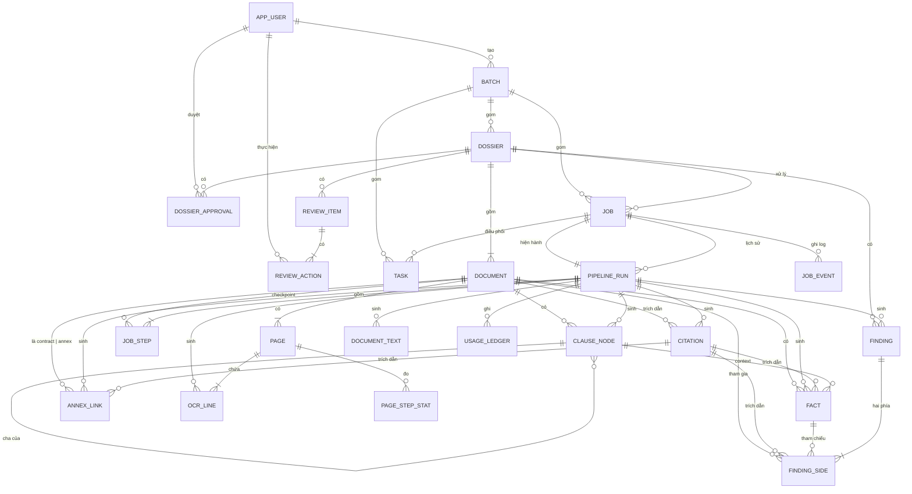
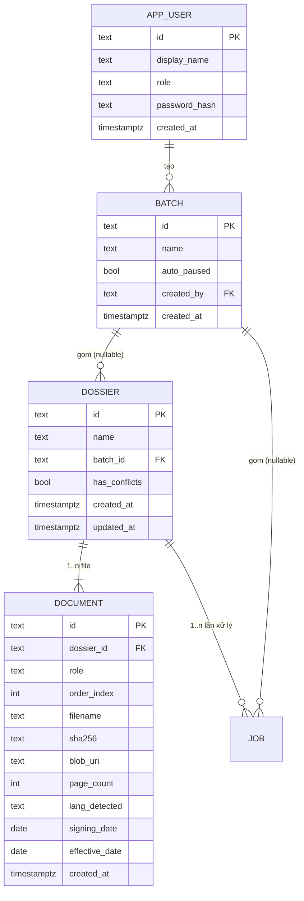
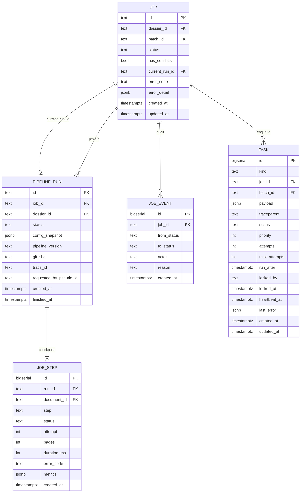
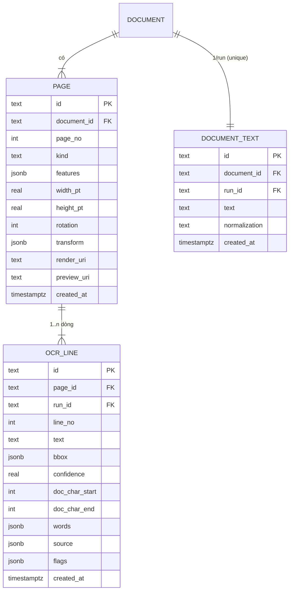
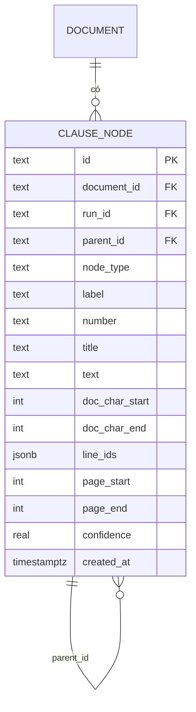
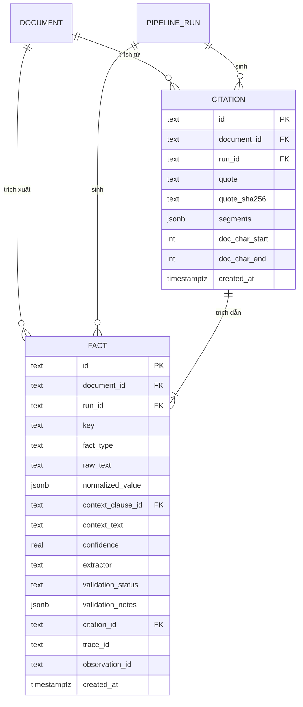
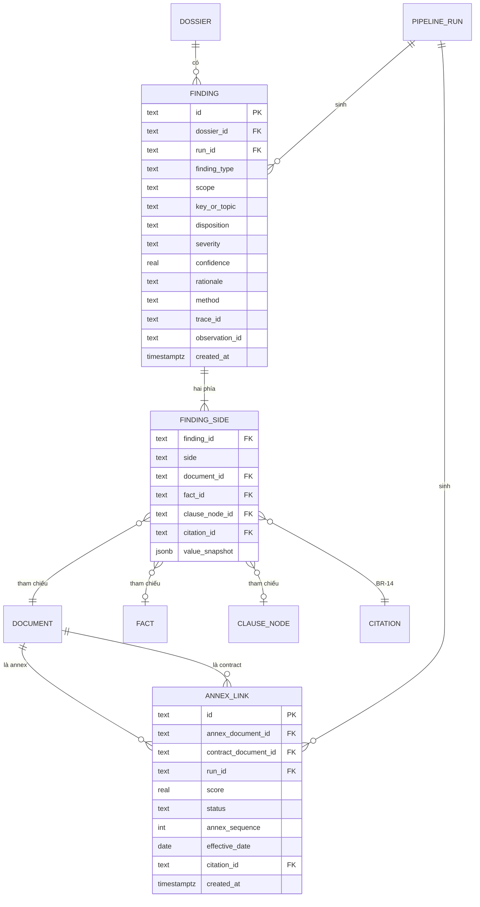
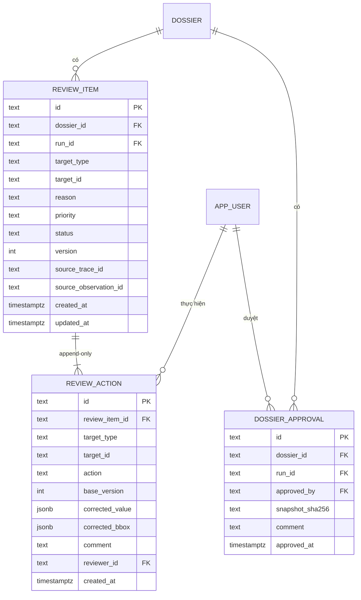
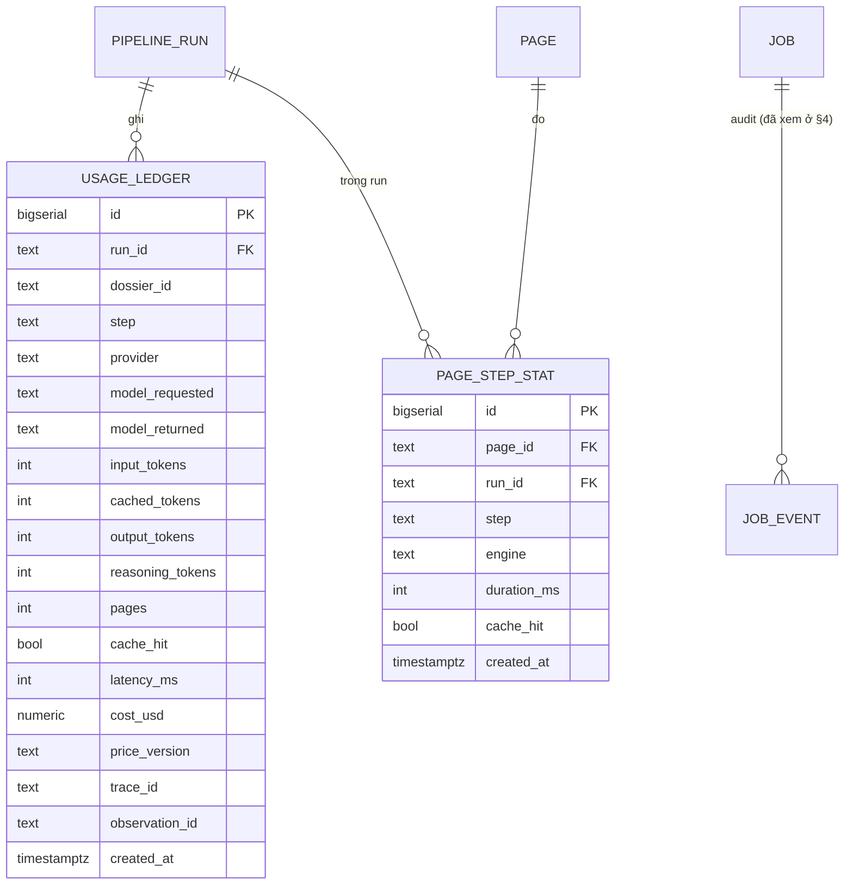

# DOC-04c · DATABASE ERD — Contract Intelligence

**Sơ đồ quan hệ thực thể (ERD) — PostgreSQL v1.0**

Dự án: VSF OJT Batch 3 · Phiên bản 1.0
Ngày tạo: 17/09/2026 · Cập nhật lần cuối: 17/09/2026

> **Tài liệu này dành cho:** người mới onboard dự án muốn hiểu nhanh toàn bộ 23 bảng; reviewer kiến trúc muốn đối chiếu ERD ↔ DDL; thành viên viết Alembic migration muốn biết quan hệ trước khi sửa.
> **DDL canonical:** `docs/DOC-04b-postgres-schema.sql` (516 dòng).
> **Quyết định kiến trúc:** xem `backend/CONTEXT.md` mục 5 (`5.2` Optimistic Concurrency, `5.3` Denormalize ngày, `5.4` Indexes).

---

## Mục lục

0. [Thông tin tài liệu](#0-thông-tin-tài-liệu)
1. [Tổng quan 23 bảng](#1-tổng-quan-23-bảng)
2. [ERD tổng (System Overview)](#2-erd-tổng-system-overview)
3. [Domain 1 — Tổ chức & Nghiệp vụ](#3-domain-1--tổ-chức--nghiệp-vụ)
4. [Domain 2 — Pipeline & Hàng đợi](#4-domain-2--pipeline--hàng-đợi)
5. [Domain 3 — Trang & OCR](#5-domain-3--trang--ocr)
6. [Domain 4 — Cấu trúc tài liệu](#6-domain-4--cấu-trúc-tài-liệu)
7. [Domain 5 — Citation & Fact](#7-domain-5--citation--fact)
8. [Domain 6 — Annex & Conflict](#8-domain-6--annex--conflict)
9. [Domain 7 — HITL Review](#9-domain-7--hitl-review)
10. [Domain 8 — Đo lường & Chi phí](#10-domain-8--đo-lường--chi-phí)
11. [Ma trận quan hệ đầy đủ](#11-ma-trận-quan-hệ-đầy-đủ)
12. [Quy tắc bất biến & Trigger](#12-quy-tắc-bất-biến--trigger)
13. [Bộ 23 chỉ mục hiệu năng](#13-bộ-23-chỉ-mục-hiệu-năng)
14. [Cardinality chuẩn](#14-cardinality-chuẩn)
15. [Quy ước đặt tên](#15-quy-ước-đặt-tên)
16. [Phụ lục — Truy vấn mẫu](#16-phụ-lục--truy-vấn-mẫu)

---

## 0. Thông tin tài liệu

| Trường | Nội dung |
|---|---|
| Tên tài liệu | SƠ ĐỒ QUAN HỆ THỰC THỂ — Database ERD |
| Mã tài liệu | DOC-04c |
| Dự án | VSF OJT Batch 3 |
| Loại tài liệu | Database Design — ERD Reference |
| Phiên bản | 1.0 |
| Trạng thái | Đã chốt — khớp DOC-04b v1.0 |
| Người phụ trách | Phạm Hoàng Chương |
| Tài liệu đầu vào | `docs/DOC-04b-postgres-schema.sql` (DDL), `docs/DOC-04-architecture.md` §7, `backend/CONTEXT.md` §5 |
| Tài liệu liên quan | `docs/DOC-05-api-spec.yaml` (API), `docs/adr/*` |

### 0.1 Lịch sử thay đổi

| Phiên bản | Ngày | Người thực hiện | Nội dung |
|---|---|---|---|
| 1.0 | 17/09/2026 | Trần Văn Dũng | ERD đầy đủ 23 bảng, 8 domain, 23 index, trigger; khớp DOC-04b v1.0 |

### 0.2 Quy ước trong tài liệu

| Ký hiệu | Ý nghĩa |
|---|---|
| **PK** | Primary Key |
| **FK** | Foreign Key |
| 🔒 | Bảng bất biến (chỉ INSERT) — có trigger `forbid_mutation` |
| ↻ | Bảng mutable, có trigger cập nhật thời gian |
| 📋 | Bảng nghiệp vụ cập nhật được |
| `→1`, `→*` | Cardinality (một, nhiều) |
| `[x0,y0,x1,y1]` | Bounding Box theo CPS, 0..1 |

---

## 1. Tổng quan 23 bảng

| # | Bảng | Domain | Bất biến? | Mục đích chính |
|---|---|---|---|---|
| 1 | `app_user` | 1 — Tổ chức | ❌ | Tài khoản local (operator/reviewer/admin) |
| 2 | `batch` | 1 — Tổ chức | ❌ | Gom nhiều dossier vào một đợt xử lý |
| 3 | `dossier` | 1 — Tổ chức | ❌ | Đơn vị nghiệp vụ: 1 hợp đồng + 0..n phụ lục |
| 4 | `document` | 1 — Tổ chức | ❌ | Một file PDF trong dossier (contract hoặc annex) |
| 5 | `job` | 2 — Pipeline | ❌ | Một lần xử lý dossier qua pipeline |
| 6 | `pipeline_run` | 2 — Pipeline | ❌ | Một lần chạy thực tế của pipeline (tái lập) |
| 7 | `job_step` | 2 — Pipeline | ❌ | Checkpoint theo bước (S0..S10) của một run |
| 8 | `task` | 2 — Pipeline | ❌ | Hàng đợi tác vụ nền (`FOR UPDATE SKIP LOCKED`) |
| 9 | `page` | 3 — Trang & OCR | ❌ | Một trang vật lý của document |
| 10 | `document_text` | 3 — Trang & OCR | 🔒 | Văn bản gộp toàn document (mỗi run) |
| 11 | `ocr_line` | 3 — Trang & OCR | 🔒 | Một dòng OCR (text + bbox CPS) |
| 12 | `citation` | 5 — Citation | 🔒 | Trích dẫn: quote + bbox — cốt lõi BR-07 |
| 13 | `clause_node` | 4 — Cấu trúc | 🔒 | Điều → Khoản → Điểm (cây) |
| 14 | `fact` | 5 — Citation | 🔒 | Một thực thể trích xuất (tiền, ngày, bên, …) |
| 15 | `annex_link` | 6 — Annex | 🔒 | Liên kết phụ lục ↔ hợp đồng chính |
| 16 | `finding` | 6 — Annex | 🔒 | Một phát hiện conflict hoặc khớp |
| 17 | `finding_side` | 6 — Annex | 🔒 | Hai phía (a, b) của finding |
| 18 | `review_item` | 7 — HITL | ❌ | Hàng đợi review cho reviewer |
| 19 | `review_action` | 7 — HITL | 🔒 | Append-only lịch sử thao tác reviewer |
| 20 | `dossier_approval` | 7 — HITL | 🔒 | Snapshot ký duyệt cuối cùng |
| 21 | `job_event` | 2 — Pipeline | 🔒 | Audit chuyển trạng thái job |
| 22 | `page_step_stat` | 8 — Đo lường | 🔒 | Thời gian xử lý theo trang × bước |
| 23 | `usage_ledger` | 8 — Đo lường | 🔒 | Token + USD cho mỗi call LLM |

**Tổng:** 23 bảng (10 bất biến 🔒, 13 mutable), 23 index, 12 trigger, 3 view.

---

## 2. ERD tổng (System Overview)



> **Đọc nhanh:** Mọi thứ xuất phát từ `DOSSIER` (đơn vị nghiệp vụ). Dossier → document → page → ocr_line → citation → fact/finding. Pipeline_run gắn với job và "sinh" ra tất cả kết quả máy (bất biến 🔒). Reviewer tương tác qua review_item → review_action (append-only).

---

## 3. Domain 1 — Tổ chức & Nghiệp vụ

Gồm 4 bảng: `app_user`, `batch`, `dossier`, `document`. Đây là khung nghiệp vụ, tất cả mutable, có `updated_at`.



### 3.1 Bảng `app_user` (📋, mutable)

| Cột | Kiểu | Ràng buộc | Mô tả |
|---|---|---|---|
| `id` | TEXT | PK, prefix `usr_` | ULID |
| `display_name` | TEXT | NOT NULL | Tên hiển thị |
| `role` | TEXT | CHECK ∈ `operator`, `reviewer`, `admin` | Phân quyền |
| `password_hash` | TEXT | NOT NULL | argon2id |
| `created_at` | TIMESTAMPTZ | NOT NULL DEFAULT now() | |

**Quan hệ:**
- `1 → * BATCH` (qua `batch.created_by`)
- `1 → * REVIEW_ACTION` (qua `review_action.reviewer_id`)
- `1 → * DOSSIER_APPROVAL` (qua `dossier_approval.approved_by`)

### 3.2 Bảng `batch` (📋, mutable)

| Cột | Kiểu | Ràng buộc | Mô tả |
|---|---|---|---|
| `id` | TEXT | PK, prefix `btc_` | |
| `name` | TEXT | NOT NULL | Tên đợt (vd: "Wave-3 2026-09") |
| `auto_paused` | BOOLEAN | NOT NULL DEFAULT false | Tạm dừng tự động khi lỗi |
| `created_by` | TEXT | FK → `app_user.id` | Người tạo |
| `created_at` | TIMESTAMPTZ | NOT NULL DEFAULT now() | |

**Quan hệ:**
- `1 → * DOSSIER` (qua `dossier.batch_id`, ON DELETE SET NULL)
- `1 → * JOB` (qua `job.batch_id`, ON DELETE SET NULL)
- `1 → * TASK` (qua `task.batch_id`, ON DELETE SET NULL)

### 3.3 Bảng `dossier` (📋, mutable)

| Cột | Kiểu | Ràng buộc | Mô tả |
|---|---|---|---|
| `id` | TEXT | PK, prefix `dos_` | |
| `name` | TEXT | NOT NULL | Tên hồ sơ |
| `batch_id` | TEXT | FK → `batch.id` (SET NULL) | Có thể không thuộc batch |
| `has_conflicts` | BOOLEAN | NOT NULL DEFAULT false | Cached flag — true khi có finding severity ≥ medium |
| `created_at` / `updated_at` | TIMESTAMPTZ | NOT NULL | |

**Quan hệ trung tâm:**
- `1 → * DOCUMENT` (CASCADE — xóa dossier xóa hết file)
- `1 → * JOB` (CASCADE)
- `1 → * FINDING` (CASCADE)
- `1 → * REVIEW_ITEM` (CASCADE)
- `1 → * DOSSIER_APPROVAL` (CASCADE)

### 3.4 Bảng `document` (📋, mutable)

| Cột | Kiểu | Ràng buộc | Mô tả |
|---|---|---|---|
| `id` | TEXT | PK, prefix `doc_` | |
| `dossier_id` | TEXT | FK → `dossier.id` CASCADE | |
| `role` | TEXT | CHECK ∈ `contract`, `annex` | Loại vai trò |
| `order_index` | INT | NOT NULL DEFAULT 0 | Thứ tự trong dossier |
| `filename` | TEXT | NOT NULL | Tên file gốc upload |
| `sha256` | TEXT | NOT NULL | Hash nội dung |
| `blob_uri` | TEXT | NOT NULL | Đường dẫn trong `BlobStore` (`./data/blobs/pdf/<sha256>.pdf`) |
| `page_count` | INT | NOT NULL DEFAULT 0 | |
| `lang_detected` | TEXT | DEFAULT `'vi'` | |
| **`signing_date`** | **DATE** | **NULL** | **denormalize từ `fact.key='date.signing'` (S7)** |
| **`effective_date`** | **DATE** | **NULL** | **denormalize từ `fact.key='date.effective'` (S7)** |
| `created_at` | TIMESTAMPTZ | NOT NULL | |

**Index:**
- `idx_document_dossier_id` — JOIN dossier
- `idx_document_order (dossier_id, role, order_index)` — list document theo dossier

**Quan hệ:**
- `→ DOSSIER` (cha)
- `1 → * PAGE` (CASCADE)
- `1 → * CLAUSE_NODE` (CASCADE)
- `1 → * FACT` (CASCADE)
- `1 → * CITATION` (CASCADE)
- `1 → * FINDING_SIDE` (CASCADE)
- `* ↔ * DOCUMENT` (qua `annex_link`)

---

## 4. Domain 2 — Pipeline & Hàng đợi

Gồm 5 bảng: `job`, `pipeline_run`, `job_step`, `task`, `job_event`. Cơ chế điều phối xử lý nền, không có broker ngoài.



### 4.1 Bảng `job` (📋, mutable)

Trạng thái: `uploaded → processing → extracted → pending_review → reviewed → approved` (hoặc `failed` ở bất kỳ bước nào).

| Cột | Kiểu | Ràng buộc | Mô tả |
|---|---|---|---|
| `id` | TEXT | PK, prefix `job_` | |
| `dossier_id` | TEXT | FK → `dossier.id` CASCADE | |
| `batch_id` | TEXT | FK → `batch.id` SET NULL | |
| `status` | TEXT | CHECK (7 giá trị) | |
| `has_conflicts` | BOOLEAN | | Cached |
| `current_run_id` | TEXT | FK → `pipeline_run.id` SET NULL (deferred) | Run hiện hành |
| `error_code` / `error_detail` | TEXT / JSONB | | Lưu lỗi cuối |
| `created_at` / `updated_at` | TIMESTAMPTZ | | |

**Index:** `idx_job_dossier_id`, `idx_job_status`.

### 4.2 Bảng `pipeline_run` (📋, mutable)

| Cột | Kiểu | Ràng buộc | Mô tả |
|---|---|---|---|
| `id` | TEXT | PK, prefix `run_` | |
| `job_id` | TEXT | FK → `job.id` CASCADE | |
| `dossier_id` | TEXT | FK → `dossier.id` CASCADE | |
| `status` | TEXT | CHECK ∈ `running`, `succeeded`, `failed` | |
| `config_snapshot` | JSONB | NOT NULL | Snapshot config lúc chạy → tái lập |
| `pipeline_version` | TEXT | NOT NULL | vd `1.0.0` |
| `git_sha` | TEXT | NOT NULL | vd `5c611d4` |
| `trace_id` | TEXT | | OpenTelemetry trace |
| `requested_by_pseudo_id` | TEXT | | Người yêu cầu (chưa auth đầy đủ) |
| `created_at` / `finished_at` | TIMESTAMPTZ | | |

> **Quan trọng:** Mỗi run tạo ra một bộ kết quả máy hoàn toàn mới trong các bảng 🔒 (ocr_line, fact, finding, …). Đây là nền tảng cho việc **tái lập** (replay).

### 4.3 Bảng `job_step` (📋, mutable) — Checkpoint

| Cột | Kiểu | Ràng buộc | Mô tả |
|---|---|---|---|
| `id` | BIGSERIAL | PK | |
| `run_id` | TEXT | FK → `pipeline_run.id` CASCADE | |
| `document_id` | TEXT | FK → `document.id` CASCADE (nullable) | Có thể là bước cả dossier |
| `step` | TEXT | NOT NULL | Mã bước `S0..S10` |
| `status` | TEXT | CHECK ∈ `queued`, `running`, `succeeded`, `failed`, `retrying` | |
| `attempt` | INT | NOT NULL DEFAULT 1 | Số lần retry |
| `pages` / `duration_ms` | INT | | |
| `metrics` | JSONB | | Số liệu riêng của bước |
| UNIQUE | | `(run_id, document_id, step)` | Idempotent retry |

**Index:** `idx_job_step_run_id`.

### 4.4 Bảng `task` (📋, mutable) — Hàng đợi nền

| Cột | Kiểu | Ràng buộc | Mô tả |
|---|---|---|---|
| `id` | BIGSERIAL | PK | |
| `kind` | TEXT | NOT NULL | vd `ocr_extract`, `fact_extract` |
| `job_id` | TEXT | FK → `job.id` CASCADE | |
| `batch_id` | TEXT | FK SET NULL | |
| `payload` | JSONB | NOT NULL DEFAULT '{}' | |
| `traceparent` | TEXT | | Truyền OpenTelemetry context |
| `status` | TEXT | CHECK ∈ `queued`, `running`, `succeeded`, `failed`, `dead` | |
| `priority` | INT | NOT NULL DEFAULT 100 | Thấp = trước |
| `attempts` / `max_attempts` | INT | | |
| `run_after` | TIMESTAMPTZ | NOT NULL DEFAULT now() | Cho delay/schedule |
| `locked_by` / `locked_at` / `heartbeat_at` | | | Worker lease |
| `last_error` | JSONB | | Lưu lỗi cuối |

**Index:**
- `idx_task_ready (priority, run_after) WHERE status = 'queued'` — partial index cho hot path
- `idx_task_job_id` — debug theo job

> **Worker dùng:** `SELECT … FOR UPDATE SKIP LOCKED` để claim task không tranh chấp. Sau khi xong, UPDATE status → `succeeded`/`failed`. Heartbeat chống worker chết giữa chừng.

### 4.5 Bảng `job_event` (🔒, bất biến)

Audit chuyển trạng thái job.

| Cột | Kiểu | Mô tả |
|---|---|---|
| `id` | BIGSERIAL | PK |
| `job_id` | TEXT | FK → `job.id` CASCADE |
| `from_status` / `to_status` | TEXT | |
| `actor` | TEXT | "worker" / "reviewer" / "admin" |
| `reason` | TEXT | |
| `created_at` | TIMESTAMPTZ | |

**Trigger:** `trg_immutable_job_event`.

---

## 5. Domain 3 — Trang & OCR

Gồm 3 bảng: `page`, `document_text`, `ocr_line`. Lớp dữ liệu cấp trang, đa phần bất biến.



### 5.1 Bảng `page` (📋, mutable)

| Cột | Kiểu | Ràng buộc | Mô tả |
|---|---|---|---|
| `id` | TEXT | PK, prefix `pg_` | |
| `document_id` | TEXT | FK → `document.id` CASCADE | |
| `page_no` | INT | NOT NULL | Số trang (1..n) |
| `kind` | TEXT | CHECK ∈ `native`, `scanned`, `hybrid` | Loại xử lý |
| `features` | JSONB | DEFAULT '{}' | Đặc trưng (có text layer, density, …) |
| `width_pt` / `height_pt` | REAL | NOT NULL | Kích thước PDF points |
| `rotation` | INT | NOT NULL DEFAULT 0 | 0/90/180/270 |
| `transform` | JSONB | | Ma trận biến đổi nếu đã xử lý ảnh |
| `render_uri` | TEXT | NOT NULL | Đường dẫn ảnh render |
| `preview_uri` | TEXT | NOT NULL | Ảnh thumbnail |
| UNIQUE | | `(document_id, page_no)` | |

**Index:** `idx_page_document_id`.

### 5.2 Bảng `document_text` (🔒, bất biến)

Văn bản gộp cho **mỗi (document, run)**. Dùng làm nền cho `doc_char_start`/`doc_char_end`.

| Cột | Kiểu | Ràng buộc |
|---|---|---|
| `id` | TEXT | PK |
| `document_id` | TEXT | FK → `document.id` CASCADE |
| `run_id` | TEXT | FK → `pipeline_run.id` CASCADE |
| `text` | TEXT | NOT NULL |
| `normalization` | TEXT | NOT NULL DEFAULT `'NFC'` |
| UNIQUE | | `(document_id, run_id)` |

**Trigger:** `trg_immutable_document_text`.

### 5.3 Bảng `ocr_line` (🔒, bất biến) — Kết quả OCR

| Cột | Kiểu | Mô tả |
|---|---|---|
| `id` | TEXT | PK, prefix `ln_` |
| `page_id` | TEXT | FK → `page.id` CASCADE |
| `run_id` | TEXT | FK → `pipeline_run.id` CASCADE |
| `line_no` | INT | NOT NULL (đếm trong trang) |
| `text` | TEXT | NOT NULL |
| `bbox` | JSONB | NOT NULL — `[x0,y0,x1,y1]` CPS 0..1 |
| `confidence` | REAL | NOT NULL |
| `doc_char_start` / `doc_char_end` | INT | Con trỏ vào `document_text.text` |
| `words` | JSONB | NOT NULL DEFAULT `'[]'` — mảng word bbox |
| `source` | JSONB | vd `{"engine":"terra","model":"gpt-5.6-terra"}` |
| `flags` | JSONB | DEFAULT '{}' — đánh dấu low-confidence, … |

**Index:** `idx_ocr_line_page_run (page_id, run_id)`.

**Trigger:** `trg_immutable_ocr_line`.

---

## 6. Domain 4 — Cấu trúc tài liệu

Bảng `clause_node` — cây Điều → Khoản → Điểm. Bất biến, có self-reference.



### 6.1 Bảng `clause_node` (🔒, bất biến)

| Cột | Kiểu | Mô tả |
|---|---|---|
| `id` | TEXT | PK, prefix `cln_` |
| `document_id` | TEXT | FK → `document.id` CASCADE |
| `run_id` | TEXT | FK → `pipeline_run.id` CASCADE |
| `parent_id` | TEXT | FK → `clause_node.id` (self-reference) |
| `node_type` | TEXT | vd `article`, `clause`, `point` |
| `label` / `number` / `title` | TEXT | "Điều", "1", "Mục đích" |
| `text` | TEXT | NOT NULL — nội dung điều |
| `doc_char_start` / `doc_char_end` | INT | Con trỏ vào `document_text` |
| `line_ids` | JSONB | NOT NULL DEFAULT `'[]'` — danh sách `ocr_line.id` dùng để vẽ |
| `page_start` / `page_end` | INT | NOT NULL |
| `confidence` | REAL | NOT NULL |

**Index:** `idx_clause_node_doc_run (document_id, run_id)`.

**Trigger:** `trg_immutable_clause_node`.

> **Cây:** Truy vấn đệ quy `WITH RECURSIVE` trên `parent_id` để dựng cây đầy đủ một document. UI render outline bên trái, click → scroll đến trang + highlight bbox.

---

## 7. Domain 5 — Citation & Fact

Hai bảng bất biến cốt lõi cho BR-07 (Citation), BR-09 (bbox), BO-02 (fact có kiểu).



### 7.1 Bảng `citation` (🔒, bất biến) — Cốt lõi BR-07/BR-08

Citation là **điểm chạm** giữa kết quả máy và giao diện người dùng. Một fact có đúng một citation. Một finding có đúng hai citation (BR-14, mỗi phía một).

| Cột | Kiểu | Ràng buộc | Mô tả |
|---|---|---|---|
| `id` | TEXT | PK, prefix `cit_` | |
| `document_id` | TEXT | FK → `document.id` CASCADE | |
| `run_id` | TEXT | FK → `pipeline_run.id` CASCADE | |
| `quote` | TEXT | NOT NULL | Chuỗi trích (NFC-normalized) |
| `quote_sha256` | TEXT | NOT NULL | Hash cho truy vết nhanh |
| `segments` | JSONB | NOT NULL | Mảng `{page_no, bbox, line_id, char_start, char_end}` |
| `doc_char_start` / `doc_char_end` | INT | NOT NULL, CHECK(end > start) | Con trỏ vào `document_text` |

**Index:** `idx_citation_document_run (document_id, run_id)`.

**Trigger:** `trg_immutable_citation`.

> **Cấu trúc segments:**
> ```json
> [
>   {"page_no": 3, "line_id": "ln_01HZ...1", "char_start": 412, "char_end": 488, "bbox": [0.10, 0.20, 0.85, 0.24]},
>   {"page_no": 3, "line_id": "ln_01HZ...2", "char_start": 489, "char_end": 530, "bbox": [0.10, 0.26, 0.85, 0.30]}
> ]
> ```
> Mỗi segment nằm trọn trong một dòng → dễ căn chỉnh với `ocr_line.bbox`.

### 7.2 Bảng `fact` (🔒, bất biến) — BR-09 + BO-02

| Cột | Kiểu | Ràng buộc | Mô tả |
|---|---|---|---|
| `id` | TEXT | PK, prefix `fct_` | |
| `document_id` | TEXT | FK → `document.id` CASCADE | |
| `run_id` | TEXT | FK → `pipeline_run.id` CASCADE | |
| `key` | TEXT | NOT NULL | vd `price.total`, `date.signing`, `party.buyer.name` |
| `fact_type` | TEXT | NOT NULL | `money`, `date`, `duration`, `party`, `percent`, … |
| `raw_text` | TEXT | NOT NULL | Nguyên văn |
| `normalized_value` | JSONB | | Giá trị đã chuẩn hóa |
| `context_clause_id` | TEXT | FK → `clause_node.id` | Khoản chứa fact |
| `context_text` | TEXT | | Ngữ cảnh rút gọn |
| `confidence` | REAL | NOT NULL | |
| `extractor` | TEXT | NOT NULL | `rule:money@1`, `llm:gpt-5.6-terra@extract.v1` |
| `validation_status` | TEXT | CHECK ∈ `passed`, `failed`, `skipped` | |
| `validation_notes` | JSONB | | |
| **`citation_id`** | TEXT | NOT NULL FK → `citation.id` | **Mỗi fact có ≥1 citation** |
| `trace_id` / `observation_id` | TEXT | | Langfuse linkage |

**Index:** `idx_fact_document_run`, `idx_fact_key`, `idx_fact_citation_id`.

**Trigger:** `trg_immutable_fact`.

---

## 8. Domain 6 — Annex & Conflict

3 bảng bất biến: `annex_link` (liên kết phụ lục ↔ hợp đồng), `finding` (một phát hiện), `finding_side` (hai phía a/b).



### 8.1 Bảng `annex_link` (🔒, bất biến) — BR-06

| Cột | Kiểu | Ràng buộc | Mô tả |
|---|---|---|---|
| `id` | TEXT | PK, prefix `alnk_` | |
| `annex_document_id` | TEXT | FK → `document.id` CASCADE | Phụ lục |
| `contract_document_id` | TEXT | FK → `document.id` CASCADE | Hợp đồng chính |
| `run_id` | TEXT | FK → `pipeline_run.id` CASCADE | |
| `score` | REAL | NOT NULL | 0..1, độ tự tin khi liên kết |
| `status` | TEXT | CHECK ∈ `linked`, `linked_needs_review`, `unlinked` | |
| `annex_sequence` | INT | NOT NULL DEFAULT 1 | Phụ lục số mấy (1, 2, …) |
| `effective_date` | DATE | | Ngày có hiệu lực riêng của phụ lục |
| `citation_id` | TEXT | FK → `citation.id` | Trích dẫn chỗ liên kết |
| UNIQUE | | `(annex_document_id, contract_document_id, run_id)` | |

**Trigger:** `trg_immutable_annex_link`.

### 8.2 Bảng `finding` (🔒, bất biến) — BR-11..BR-14

| Cột | Kiểu | CHECK | Mô tả |
|---|---|---|---|
| `id` | TEXT | PK, prefix `fnd_` | |
| `dossier_id` | TEXT | FK → `dossier.id` CASCADE | |
| `run_id` | TEXT | FK → `pipeline_run.id` CASCADE | |
| `finding_type` | TEXT | ∈ `structured`, `semantic` | So sánh rule hay LLM |
| `scope` | TEXT | ∈ `within_document`, `contract_annex`, `annex_annex` | Phạm vi |
| `key_or_topic` | TEXT | NOT NULL | vd `price.total`, "Phạm vi hợp đồng" |
| `disposition` | TEXT | ∈ `comparable_match`, `comparable_difference`, `candidate_amendment`, `not_comparable`, `insufficient_evidence` | Kết luận |
| `severity` | TEXT | ∈ `high`, `medium`, `low` | |
| `confidence` | REAL | NOT NULL | |
| `rationale` | TEXT | | Lý do ngắn |
| `method` | TEXT | NOT NULL | `rule:money_compare@1`, `llm:…` |
| `trace_id` / `observation_id` | TEXT | | Langfuse |

**Index:** `idx_finding_dossier_run (dossier_id, run_id)`.

**Trigger:** `trg_immutable_finding`.

### 8.3 Bảng `finding_side` (🔒, bất biến) — BR-14

| Cột | Kiểu | Ràng buộc | Mô tả |
|---|---|---|---|
| `finding_id` | TEXT | FK → `finding.id` CASCADE | |
| `side` | TEXT | CHECK ∈ `a`, `b` | Phía A (contract) hoặc B (annex hoặc annex khác) |
| `document_id` | TEXT | FK → `document.id` CASCADE | |
| `fact_id` | TEXT | FK → `fact.id` (nullable) | Nếu so sánh fact |
| `clause_node_id` | TEXT | FK → `clause_node.id` (nullable) | Nếu so sánh ngữ nghĩa theo điều |
| **`citation_id`** | TEXT | NOT NULL FK → `citation.id` | **Cả hai phía đều có citation (BR-14)** |
| `value_snapshot` | JSONB | | Giá trị phía đó lúc so sánh |
| PRIMARY KEY | | `(finding_id, side)` | |

**Index:** `idx_finding_side_finding_id`, `idx_finding_side_fact_id`, `idx_finding_side_citation_id`.

**Trigger:** `trg_immutable_finding_side`.

---

## 9. Domain 7 — HITL Review

3 bảng: `review_item` (mutable, có version), `review_action` (bất biến), `dossier_approval` (bất biến).



### 9.1 Bảng `review_item` (📋, mutable) — Optimistic Concurrency P0-05

| Cột | Kiểu | Ràng buộc | Mô tả |
|---|---|---|---|
| `id` | TEXT | PK, prefix `ri_` | |
| `dossier_id` | TEXT | FK → `dossier.id` CASCADE | |
| `run_id` | TEXT | FK → `pipeline_run.id` CASCADE | |
| `target_type` | TEXT | CHECK ∈ `fact`, `finding`, `annex_link`, `clause`, `table_cell`, `citation` | Loại đối tượng |
| `target_id` | TEXT | NOT NULL | ULID đối tượng |
| `reason` | TEXT | NOT NULL | Tại sao cần review |
| `priority` | TEXT | CHECK ∈ `P1`, `P2`, `P3` | |
| `status` | TEXT | CHECK ∈ `open`, `resolved`, `awaiting_evidence` | |
| **`version`** | INT | NOT NULL DEFAULT 1 | **Tăng mỗi khi có action (P0-05)** |
| `source_trace_id` / `source_observation_id` | TEXT | | Từ Langfuse |

**Index:** `idx_review_item_dossier (dossier_id, status)`, `idx_review_item_target (target_type, target_id)`.

> **Optimistic concurrency flow (xem `backend/CONTEXT.md` §5.2):**
> 1. Client mở review → nhận `version` hiện tại.
> 2. Client `POST /review-items/{id}/actions` gửi `base_version`.
> 3. Server trong 1 transaction:
>    ```sql
>    UPDATE review_item
>       SET version = version + 1, updated_at = now()
>     WHERE id = :ri_id AND version = :base_version;
>    -- 0 rows → trả 409 VERSION_CONFLICT
>    INSERT INTO review_action (...) VALUES (...);
>    ```
> 4. Client nhận 409 → refetch + hiển thị version mới cho reviewer xử lý xung đột.

### 9.2 Bảng `review_action` (🔒, bất biến) — Append-only

| Cột | Kiểu | Ràng buộc | Mô tả |
|---|---|---|---|
| `id` | TEXT | PK, prefix `ra_` | |
| `review_item_id` | TEXT | FK → `review_item.id` CASCADE | |
| `target_type` / `target_id` | TEXT | | Phiếm định (không FK để tránh vòng) |
| `action` | TEXT | CHECK ∈ `confirm`, `correct`, `reject`, `needs_more_evidence` | |
| **`base_version`** | INT | NOT NULL | **Echo lại version client đang xem (P0-05)** |
| `corrected_value` | JSONB | | Khi `correct` — giá trị đã sửa |
| `corrected_bbox` | JSONB | | Khi `correct` bbox — `[{page_no, bbox}]` CPS |
| `comment` | TEXT | | |
| `reviewer_id` | TEXT | FK → `app_user.id` | |
| CHECK | | `action != 'correct' OR corrected_value IS NOT NULL OR corrected_bbox IS NOT NULL` | |

**Index:** `idx_review_action_item (review_item_id, created_at DESC)`.

**Trigger:** `trg_immutable_review_action`.

> **Giá trị hiệu lực** đọc qua view `v_fact_effective` (xem §12). View `LATERAL JOIN` lấy action mới nhất theo `created_at DESC`.

### 9.3 Bảng `dossier_approval` (🔒, bất biến)

| Cột | Kiểu | Mô tả |
|---|---|---|
| `id` | TEXT | PK, prefix `apr_` |
| `dossier_id` | TEXT | FK → `dossier.id` CASCADE |
| `run_id` | TEXT | FK → `pipeline_run.id` CASCADE |
| `approved_by` | TEXT | FK → `app_user.id` |
| `snapshot_sha256` | TEXT | NOT NULL — hash toàn bộ kết quả effective |
| `comment` | TEXT | |
| `approved_at` | TIMESTAMPTZ | |

**Trigger:** `trg_immutable_dossier_approval`.

---

## 10. Domain 8 — Đo lường & Chi phí

3 bảng bất biến phục vụ KPI, hiệu năng và billing.



### 10.1 Bảng `page_step_stat` (🔒, bất biến)

| Cột | Kiểu | Mô tả |
|---|---|---|
| `id` | BIGSERIAL | PK |
| `page_id` | TEXT | FK → `page.id` CASCADE |
| `run_id` | TEXT | FK → `pipeline_run.id` CASCADE |
| `step` | TEXT | NOT NULL — `S2_ocr`, `S3_extract`, … |
| `engine` | TEXT | NOT NULL — `terra`, `local_detector`, `rule_money` |
| `duration_ms` | INT | NOT NULL |
| `cache_hit` | BOOLEAN | NOT NULL DEFAULT false |

### 10.2 Bảng `usage_ledger` (🔒, bất biến) — NFR-03

| Cột | Kiểu | Mô tả |
|---|---|---|
| `id` | BIGSERIAL | PK |
| `run_id` | TEXT | FK → `pipeline_run.id` CASCADE |
| `dossier_id` | TEXT | NOT NULL (không FK để tiện archive) |
| `step` | TEXT | NOT NULL — `ocr`, `extract`, `compare` |
| `provider` | TEXT | NOT NULL — `openai`, `local` |
| `model_requested` / `model_returned` | TEXT | |
| `input_tokens` / `cached_tokens` / `output_tokens` / `reasoning_tokens` | INT | |
| `pages` | INT | NOT NULL DEFAULT 0 |
| `cache_hit` | BOOLEAN | NOT NULL DEFAULT false |
| `latency_ms` | INT | |
| **`cost_usd`** | NUMERIC(12, 6) | NOT NULL — đã tính theo `price_version` |
| **`price_version`** | TEXT | NOT NULL — vd `gpt5.6-terra@2026-09-15` |
| `trace_id` / `observation_id` | TEXT | Langfuse linkage |

**Index:** `idx_usage_ledger_run`, `idx_usage_ledger_dossier`.

**Trigger:** `trg_immutable_usage_ledger`.

---

## 11. Ma trận quan hệ đầy đủ

| Bảng A | Cardinality | Quan hệ | Bảng B | FK column | ON DELETE |
|---|---|---|---|---|---|
| `app_user` | 1 → * | tạo | `batch` | `batch.created_by` | (không cascade) |
| `app_user` | 1 → * | thực hiện | `review_action` | `review_action.reviewer_id` | (không cascade) |
| `app_user` | 1 → * | duyệt | `dossier_approval` | `dossier_approval.approved_by` | (không cascade) |
| `batch` | 1 → 0..* | gom | `dossier` | `dossier.batch_id` | SET NULL |
| `batch` | 1 → 0..* | gom | `job` | `job.batch_id` | SET NULL |
| `batch` | 1 → 0..* | gom | `task` | `task.batch_id` | SET NULL |
| `dossier` | 1 → 1..* | gồm | `document` | `document.dossier_id` | CASCADE |
| `dossier` | 1 → 0..* | xử lý | `job` | `job.dossier_id` | CASCADE |
| `dossier` | 1 → 0..* | có | `finding` | `finding.dossier_id` | CASCADE |
| `dossier` | 1 → 0..* | có | `review_item` | `review_item.dossier_id` | CASCADE |
| `dossier` | 1 → 0..* | có | `dossier_approval` | `dossier_approval.dossier_id` | CASCADE |
| `document` | 1 → 1..* | có | `page` | `page.document_id` | CASCADE |
| `document` | 1 → 0..* | checkpoint | `job_step` | `job_step.document_id` | CASCADE |
| `document` | 1 → 0..* | có | `clause_node` | `clause_node.document_id` | CASCADE |
| `document` | 1 → 0..* | có | `fact` | `fact.document_id` | CASCADE |
| `document` | 1 → 0..* | trích dẫn | `citation` | `citation.document_id` | CASCADE |
| `document` | 1 → 0..* | tham gia | `finding_side` | `finding_side.document_id` | CASCADE |
| `document` | * ↔ * | liên kết | `document` | `annex_link.annex_document_id` + `contract_document_id` | CASCADE |
| `job` | 1 → 0..* | chạy | `pipeline_run` | `pipeline_run.job_id` | CASCADE |
| `job` | 1 → 0..1 | hiện hành | `pipeline_run` | `job.current_run_id` | SET NULL |
| `job` | 1 → 0..* | ghi log | `job_event` | `job_event.job_id` | CASCADE |
| `job` | 1 → 0..* | enqueue | `task` | `task.job_id` | CASCADE |
| `pipeline_run` | 1 → 1..* | checkpoint | `job_step` | `job_step.run_id` | CASCADE |
| `pipeline_run` | 1 → 0..1 | sinh | `document_text` | `document_text.run_id` | CASCADE |
| `pipeline_run` | 1 → 0..* | sinh | `ocr_line` | `ocr_line.run_id` | CASCADE |
| `pipeline_run` | 1 → 0..* | sinh | `citation` | `citation.run_id` | CASCADE |
| `pipeline_run` | 1 → 0..* | sinh | `clause_node` | `clause_node.run_id` | CASCADE |
| `pipeline_run` | 1 → 0..* | sinh | `fact` | `fact.run_id` | CASCADE |
| `pipeline_run` | 1 → 0..* | sinh | `annex_link` | `annex_link.run_id` | CASCADE |
| `pipeline_run` | 1 → 0..* | sinh | `finding` | `finding.run_id` | CASCADE |
| `pipeline_run` | 1 → 0..* | ghi | `usage_ledger` | `usage_ledger.run_id` | CASCADE |
| `pipeline_run` | 1 → 0..* | ghi | `page_step_stat` | `page_step_stat.run_id` | CASCADE |
| `page` | 1 → 0..* | chứa | `ocr_line` | `ocr_line.page_id` | CASCADE |
| `page` | 1 → 0..* | đo | `page_step_stat` | `page_step_stat.page_id` | CASCADE |
| `clause_node` | 1 → 0..* | cha | `clause_node` | `clause_node.parent_id` | (self) |
| `clause_node` | 1 → 0..* | context | `fact` | `fact.context_clause_id` | (không cascade) |
| `citation` | 1 → 0..* | trích | `fact` | `fact.citation_id` | (không cascade) |
| `citation` | 1 → 0..* | trích | `finding_side` | `finding_side.citation_id` | (không cascade) |
| `citation` | 1 → 0..1 | trích | `annex_link` | `annex_link.citation_id` | (không cascade) |
| `fact` | 1 → 0..* | tham chiếu | `finding_side` | `finding_side.fact_id` | (không cascade) |
| `clause_node` | 1 → 0..* | tham chiếu | `finding_side` | `finding_side.clause_node_id` | (không cascade) |
| `finding` | 1 → 2 | hai phía | `finding_side` | `finding_side.finding_id` | CASCADE |
| `review_item` | 1 → 1..* | append-only | `review_action` | `review_action.review_item_id` | CASCADE |

---

## 12. Quy tắc bất biến & Trigger

12 trigger trên 12 bảng bất biến. Hàm chung:

```sql
CREATE OR REPLACE FUNCTION forbid_mutation() RETURNS trigger AS $$
BEGIN
    RAISE EXCEPTION 'Bảng % là bất biến (append-only), không được phép UPDATE hoặc DELETE', TG_TABLE_NAME;
END;
$$ LANGUAGE plpgsql;
```

| Bảng 🔒 | Trigger | Mục đích |
|---|---|---|
| `document_text` | `trg_immutable_document_text` | Mỗi run có 1 văn bản gộp — không sửa |
| `ocr_line` | `trg_immutable_ocr_line` | Kết quả OCR cố định cho mỗi run |
| `citation` | `trg_immutable_citation` | Trích dẫn cố định (sửa qua `review_action`) |
| `clause_node` | `trg_immutable_clause_node` | Cấu trúc điều khoản cố định |
| `fact` | `trg_immutable_fact` | Kết quả trích xuất cố định (sửa qua `review_action`) |
| `annex_link` | `trg_immutable_annex_link` | Liên kết phụ lục cố định |
| `finding` | `trg_immutable_finding` | Phát hiện conflict cố định |
| `finding_side` | `trg_immutable_finding_side` | Hai phía của finding cố định |
| `review_action` | `trg_immutable_review_action` | Audit append-only |
| `job_event` | `trg_immutable_job_event` | Lịch sử trạng thái append-only |
| `usage_ledger` | `trg_immutable_usage_ledger` | Token/USD append-only cho billing |
| `dossier_approval` | `trg_immutable_dossier_approval` | Snapshot duyệt cuối append-only |

> **Cách "sửa" hợp lệ:** Ghi `review_action` với `action='correct'` kèm `corrected_value`/`corrected_bbox`. Đọc giá trị hiệu lực qua view `v_fact_effective`.

### 12.1 View nghiệp vụ

3 view hỗ trợ truy vấn phổ biến:

| View | Dựa trên | Mục đích |
|---|---|---|
| `v_conflict` | `finding` | Finding cần reviewer (disposition ∈ conflict + confidence < 0.6) |
| `v_fact_effective` | `fact` LEFT JOIN `review_item` LATERAL JOIN `review_action` | Fact + action mới nhất; có `current_item_version` để client echo |
| `v_batch_summary` | `job` GROUP BY | Tổng hợp trạng thái một batch |

```sql
-- v_fact_effective (rút gọn — xem DOC-04b §10)
CREATE OR REPLACE VIEW v_fact_effective AS
SELECT
    f.id                  AS fact_id,
    f.document_id,
    f.run_id,
    f.key,
    f.normalized_value    AS machine_value,
    CASE ra.action
        WHEN 'correct' THEN COALESCE(ra.corrected_value, f.normalized_value)
        WHEN 'reject'  THEN NULL
        ELSE f.normalized_value
    END                   AS effective_value,
    COALESCE(ra.action, 'unreviewed') AS review_state,
    ra.corrected_bbox,
    ra.reviewer_id,
    ra.created_at         AS reviewed_at,
    f.citation_id         AS original_citation_id,
    ri.id                 AS review_item_id,
    ri.version            AS current_item_version   -- echo vào base_version
FROM fact f
LEFT JOIN review_item ri
       ON ri.target_type = 'fact' AND ri.target_id = f.id
LEFT JOIN LATERAL (
    SELECT a.*
    FROM review_action a
    WHERE a.review_item_id = ri.id
    ORDER BY a.created_at DESC
    LIMIT 1
) ra ON TRUE;
```

---

## 13. Bộ 23 chỉ mục hiệu năng

| # | Index | Bảng | Cột | Phục vụ |
|---|---|---|---|---|
| 1 | `idx_document_dossier_id` | `document` | `dossier_id` | List document theo dossier |
| 2 | `idx_document_order` | `document` | `(dossier_id, role, order_index)` | Duyệt theo thứ tự role |
| 3 | `idx_page_document_id` | `page` | `document_id` | List page theo document |
| 4 | `idx_job_dossier_id` | `job` | `dossier_id` | Lịch sử job theo dossier |
| 5 | `idx_job_status` | `job` | `status` | Dashboard batch |
| 6 | `idx_job_step_run_id` | `job_step` | `run_id` | Checkpoint theo run |
| 7 | `idx_task_ready` | `task` | `(priority, run_after) WHERE status='queued'` | **Partial index — hot path worker** |
| 8 | `idx_task_job_id` | `task` | `job_id` | Debug theo job |
| 9 | `idx_ocr_line_page_run` | `ocr_line` | `(page_id, run_id)` | Resolve bbox cho citation |
| 10 | `idx_citation_document_run` | `citation` | `(document_id, run_id)` | Lookup fact/finding theo citation |
| 11 | `idx_clause_node_doc_run` | `clause_node` | `(document_id, run_id)` | Render cây điều khoản |
| 12 | `idx_fact_document_run` | `fact` | `(document_id, run_id)` | List fact theo document |
| 13 | `idx_fact_key` | `fact` | `key` | Lookup `price.total`, `date.signing`, … |
| 14 | `idx_fact_citation_id` | `fact` | `citation_id` | Truy ngược citation |
| 15 | `idx_finding_dossier_run` | `finding` | `(dossier_id, run_id)` | List finding theo dossier |
| 16 | `idx_finding_side_finding_id` | `finding_side` | `finding_id` | Join PK |
| 17 | `idx_finding_side_fact_id` | `finding_side` | `fact_id` | Truy ngược fact |
| 18 | `idx_finding_side_citation_id` | `finding_side` | `citation_id` | Truy ngược citation |
| 19 | `idx_review_item_dossier` | `review_item` | `(dossier_id, status)` | Hàng đợi reviewer |
| 20 | `idx_review_item_target` | `review_item` | `(target_type, target_id)` | Tìm item của một fact/finding |
| 21 | `idx_review_action_item` | `review_action` | `(review_item_id, created_at DESC)` | Action mới nhất |
| 22 | `idx_usage_ledger_run` | `usage_ledger` | `run_id` | Tổng chi phí theo run |
| 23 | `idx_usage_ledger_dossier` | `usage_ledger` | `dossier_id` | Tổng chi phí theo dossier |

> **Lưu ý vận hành:** PK index không tính trong danh sách 23 này (đếm riêng). Khi thêm truy vấn mới, hãy EXPLAIN trước; nếu Seq Scan trên bảng > 10k row, thêm index tương ứng.

---

## 14. Cardinality chuẩn

| Quan hệ | Ý nghĩa |
|---|---|
| 1 → 0..* | Một cha có 0 hoặc nhiều con (vd: dossier → document) |
| 1 → 1..* | Một cha có **ít nhất 1** con (vd: document → page) |
| 1 → 0..1 | Quan hệ 1-1 optional (vd: job.current_run_id) |
| 1 → 2 | Quan hệ cố định (vd: finding → finding_side) |
| * ↔ * | Quan hệ nhiều-nhiều qua bảng trung gian (vd: document ↔ document qua annex_link) |

---

## 15. Quy ước đặt tên

### 15.1 Tiền tố ID (ULID)

| Prefix | Bảng |
|---|---|
| `usr_` | `app_user` |
| `btc_` | `batch` |
| `dos_` | `dossier` |
| `doc_` | `document` |
| `pg_` | `page` |
| `job_` | `job` |
| `run_` | `pipeline_run` |
| `ln_` | `ocr_line` |
| `cit_` | `citation` |
| `cln_` | `clause_node` |
| `fct_` | `fact` |
| `alnk_` | `annex_link` |
| `fnd_` | `finding` |
| `ri_` | `review_item` |
| `ra_` | `review_action` |
| `apr_` | `dossier_approval` |

> BIGSERIAL bảng (`job_event`, `job_step`, `task`, `page_step_stat`, `usage_ledger`) không có prefix — ID chỉ cần đủ tăng dần cho debug log.

### 15.2 Bbox

Luôn dạng JSONB `[x0, y0, x1, y1]` theo **Canonical Page Space (CPS, 0..1)**. Công thức chuẩn hóa: `x = px / width_px`, `y = py / height_px`. Xem `DOC-04` §7.5.

### 15.3 JSONB shape thường gặp

| Trường | Shape | Ghi chú |
|---|---|---|
| `ocr_line.words` | `[{text, bbox, conf}]` | Mảng word trong dòng |
| `ocr_line.bbox` | `[x0, y0, x1, y1]` | CPS |
| `citation.segments` | `[{page_no, line_id, char_start, char_end, bbox}]` | Mỗi segment trong 1 dòng |
| `finding_side.value_snapshot` | `{...}` | Snapshot giá trị phía đó |
| `usage_ledger` cost | `NUMERIC(12, 6)` | USD |
| `pipeline_run.config_snapshot` | `{...}` | Toàn bộ config lúc chạy |

---

## 16. Phụ lục — Truy vấn mẫu

### 16.1 Lấy tất cả fact "hiệu lực" của một dossier

```sql
SELECT v.*
FROM v_fact_effective v
JOIN fact f ON f.id = v.fact_id
WHERE f.document_id IN (
    SELECT id FROM document WHERE dossier_id = 'dos_01J9X...'
)
ORDER BY f.key, f.document_id;
```

### 16.2 Hàng đợi reviewer của một dossier

```sql
SELECT id, target_type, target_id, reason, priority, version, status
FROM review_item
WHERE dossier_id = 'dos_01J9X...' AND status = 'open'
ORDER BY priority ASC, created_at ASC;
```

### 16.3 Ghi action với optimistic concurrency

```sql
BEGIN;

UPDATE review_item
   SET version = version + 1, updated_at = now()
 WHERE id = :ri_id AND version = :base_version;

-- Nếu 0 rows → rollback & trả 409 VERSION_CONFLICT
INSERT INTO review_action (id, review_item_id, target_type, target_id, action,
                           base_version, corrected_value, reviewer_id)
VALUES (:ra_id, :ri_id, :tgt_type, :tgt_id, 'correct',
        :base_version, :corrected, :reviewer_id);

COMMIT;
```

### 16.4 Worker claim task không tranh chấp

```sql
WITH next AS (
    SELECT id FROM task
     WHERE status = 'queued' AND run_after <= now()
     ORDER BY priority ASC, run_after ASC
     FOR UPDATE SKIP LOCKED
     LIMIT 1
)
UPDATE task t
   SET status = 'running',
       locked_by = :worker_id,
       locked_at = now(),
       heartbeat_at = now(),
       attempts = attempts + 1
  FROM next
 WHERE t.id = next.id
RETURNING t.*;
```

### 16.5 Tổng chi phí theo dossier

```sql
SELECT dossier_id,
       SUM(cost_usd)                            AS total_usd,
       SUM(input_tokens)                        AS total_in,
       SUM(output_tokens)                       AS total_out,
       COUNT(*)                                AS calls
FROM usage_ledger
WHERE dossier_id = 'dos_01J9X...'
GROUP BY dossier_id;
```

### 16.6 Finding cần reviewer (qua view)

```sql
SELECT * FROM v_conflict
WHERE dossier_id = 'dos_01J9X...'
ORDER BY
  CASE severity WHEN 'high' THEN 1 WHEN 'medium' THEN 2 ELSE 3 END,
  confidence ASC;
```

### 16.7 Cập nhật ngày hiệu lực lên document (S7)

```sql
UPDATE document d
   SET effective_date = (
       SELECT (normalized_value->>'value')::date
       FROM fact
       WHERE document_id = d.id AND key = 'date.effective'
       ORDER BY confidence DESC LIMIT 1
   ),
   signing_date = (
       SELECT (normalized_value->>'value')::date
       FROM fact
       WHERE document_id = d.id AND key = 'date.signing'
       ORDER BY confidence DESC LIMIT 1
   )
WHERE d.id = ANY(:doc_ids);
```

### 16.8 Tóm tắt batch

```sql
SELECT * FROM v_batch_summary WHERE batch_id = 'btc_01J9X...';
```

---

**Hết DOC-04c · Database ERD v1.0**
