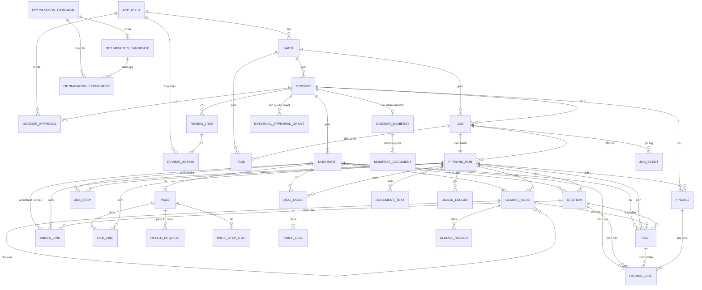
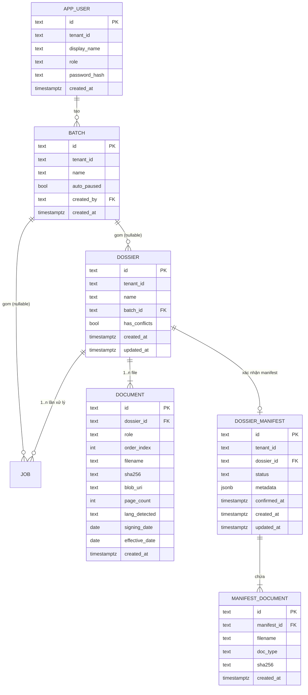
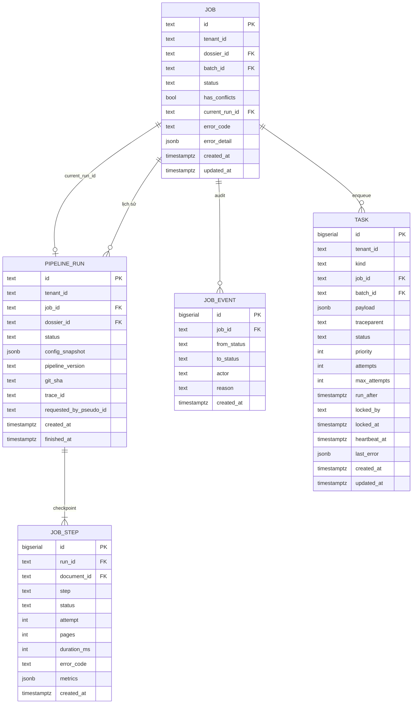
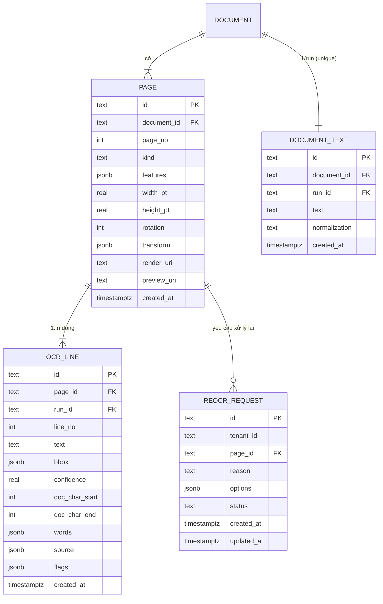
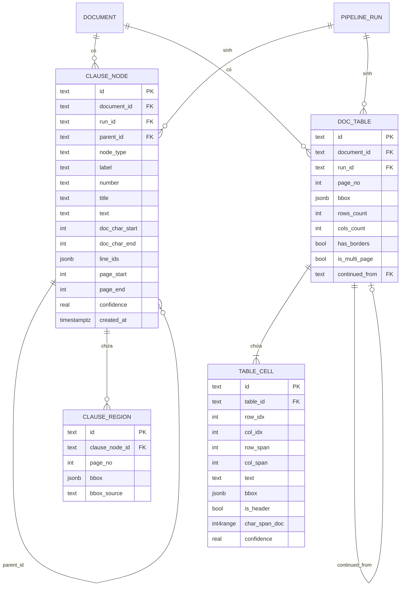
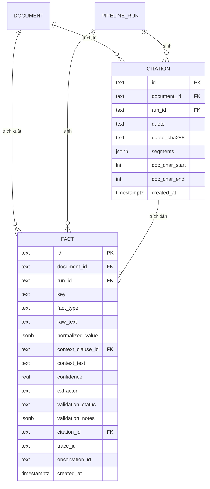
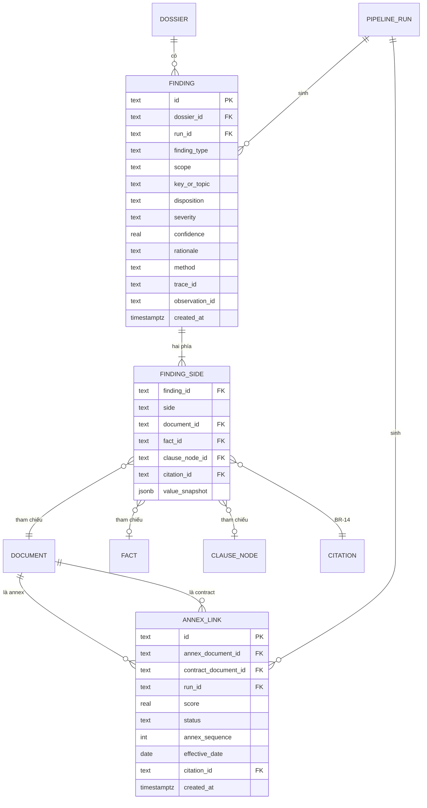
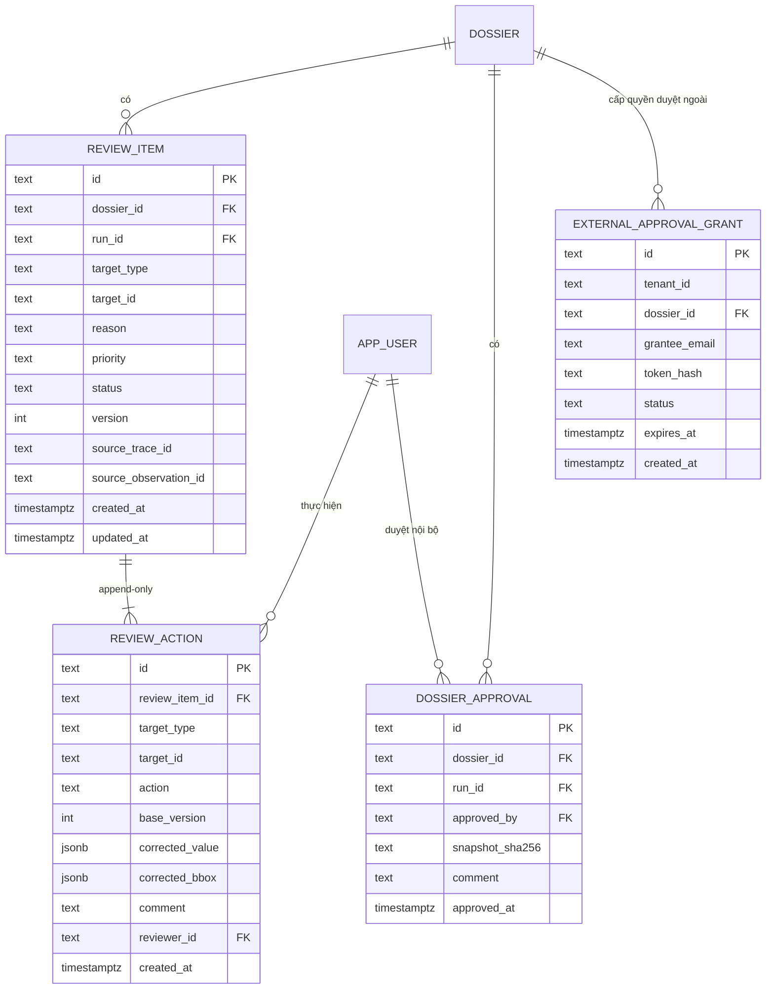
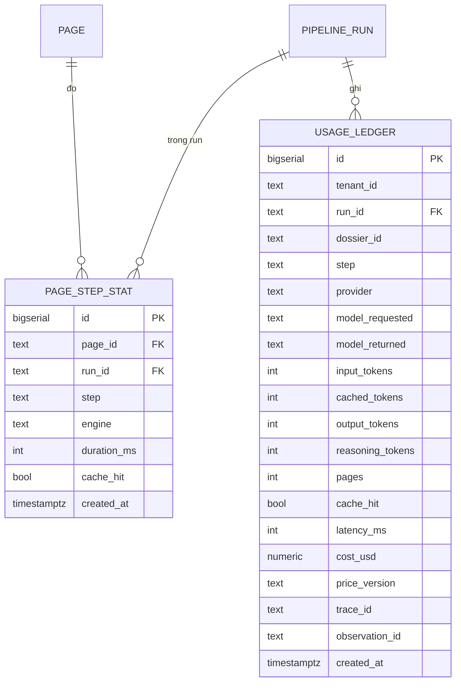
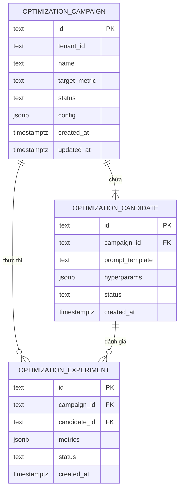

# DOC-04c · DATABASE ERD — Contract Intelligence

**Sơ đồ quan hệ thực thể (ERD) — PostgreSQL v1.2.0**

Dự án: VSF OJT Batch 3 · Phiên bản: v1.2.0 (SemVer)  
Ngày tạo: 17/09/2026 · Cập nhật lần cuối: 17/09/2026

> **Tài liệu này dành cho:** người mới onboard dự án muốn hiểu nhanh toàn bộ 33 bảng; reviewer kiến trúc muốn đối chiếu ERD ↔ DDL; thành viên viết Alembic migration muốn biết quan hệ trước khi sửa.  
> **DDL canonical:** `docs/DOC-04b-postgres-schema.sql` (v1.2.0).  
> **Quyết định kiến trúc:** xem `docs/DOC-04-architecture.md` (v0.7.0) và `backend/CONTEXT.md` mục 5 (`5.2` Optimistic Concurrency, `5.3` Denormalize ngày, `5.4` Indexes).

---

## Mục lục

0. [Thông tin tài liệu](#0-thông-tin-tài-liệu)
1. [Tổng quan 33 bảng](#1-tổng-quan-33-bảng)
2. [ERD tổng (System Overview)](#2-erd-tổng-system-overview)
3. [Domain 1 — Tổ chức, Nghiệp vụ & Manifest](#3-domain-1--tổ-chức-nghiệp-vụ--manifest)
4. [Domain 2 — Pipeline & Hàng đợi](#4-domain-2--pipeline--hàng-đợi)
5. [Domain 3 — Trang & OCR (kèm Re-OCR)](#5-domain-3--trang--ocr-kèm-re-ocr)
6. [Domain 4 — Cấu trúc tài liệu](#6-domain-4--cấu-trúc-tài-liệu)
7. [Domain 5 — Citation & Fact](#7-domain-5--citation--fact)
8. [Domain 6 — Annex & Conflict](#8-domain-6--annex--conflict)
9. [Domain 7 — HITL Review & Phê duyệt ngoài](#9-domain-7--hitl-review--phê-duyệt-ngoài)
10. [Domain 8 — Đo lường & Chi phí](#10-domain-8--đo-lường--chi-phí)
11. [Domain 9 — Vòng lặp tối ưu hóa (Optimization Loop)](#11-domain-9--vòng-lặp-tối-ưu-hóa-optimization-loop)
12. [Ma trận quan hệ đầy đủ](#12-ma-trận-quan-hệ-đầy-đủ)
13. [Quy tắc bất biến & Trigger](#13-quy-tắc-bất-biến--trigger)
14. [Bộ 33 chỉ mục hiệu năng](#14-bộ-33-chỉ-mục-hiệu-năng)
15. [Cardinality chuẩn](#15-cardinality-chuẩn)
16. [Quy ước đặt tên](#16-quy-ước-đặt-tên)
17. [Phụ lục — Truy vấn mẫu](#17-phụ-lục--truy-vấn-mẫu)

---

## 0. Thông tin tài liệu

| Trường | Nội dung |
|---|---|
| Tên tài liệu | SƠ ĐỒ QUAN HỆ THỰC THỂ — Database ERD |
| Mã tài liệu | DOC-04c |
| Dự án | VSF OJT Batch 3 |
| Loại tài liệu | Database Design — ERD Reference |
| Phiên bản | v1.2.0 (SemVer) |
| Trạng thái | Đã chốt — Khớp hoàn toàn DOC-04b v1.2.0 & DOC-04 v0.7.0 |
| Người phụ trách | Phạm Hoàng Chương / Antigravity |
| Tài liệu đầu vào | `docs/DOC-04b-postgres-schema.sql` (DDL v1.2.0), `docs/DOC-04-architecture.md` (v0.7.0), `backend/CONTEXT.md` §5 |
| Tài liệu liên quan | `docs/DOC-05-api-spec.yaml` (API v0.3.0), `docs/adr/*` |

### 0.1 Lịch sử thay đổi

| Phiên bản | Ngày | Người thực hiện | Nội dung |
|---|---|---|---|
| 1.0.0 | 17/09/2026 | Phạm Hoàng Chương | Khởi tạo baseline 23 bảng |
| 1.1.0 | 17/09/2026 | Claude | +doc_table, table_cell, clause_region; cập nhật 23→26 bảng, CHECK target_type; khớp DOC-04b v1.1 |
| 1.2.0 | 17/09/2026 | Antigravity | Đồng bộ kiến trúc Enterprise v0.7.0 / schema v1.2.0: thêm cột `tenant_id` & index cho Tenant Isolation, chuẩn hóa vai trò `OPERATOR`, `REVIEWER`, `ADMINISTRATOR`, thêm 7 bảng mới (`dossier_manifest`, `manifest_document`, `reocr_request`, `external_approval_grant`, `optimization_campaign`, `optimization_candidate`, `optimization_experiment`), nâng tổng số bảng lên 33 và tổng chỉ mục lên 33. |

### 0.2 Quy ước trong tài liệu

| Ký hiệu | Ý nghĩa |
|---|---|
| **PK** | Primary Key |
| **FK** | Foreign Key |
| 🔒 | Bảng bất biến (chỉ INSERT) — có trigger `forbid_mutation` |
| ↻ | Bảng mutable, có trigger cập nhật thời gian |
| 📋 | Bảng nghiệp vụ cập nhật được |
| `→1`, `→*` | Cardinality (một, nhiều) |
| `[x0,y0,x1,y1]` | Bounding Box theo CPS, 0..1 |

---

## 1. Tổng quan 33 bảng

| # | Bảng | Domain | Bất biến? | Mục đích chính |
|---|---|---|---|---|
| 1 | `app_user` | 1 — Tổ chức | ❌ | Tài khoản người dùng (OPERATOR/REVIEWER/ADMINISTRATOR) kèm `tenant_id` |
| 2 | `batch` | 1 — Tổ chức | ❌ | Gom nhiều dossier vào một đợt xử lý kèm `tenant_id` |
| 3 | `dossier` | 1 — Tổ chức | ❌ | Đơn vị nghiệp vụ: 1 hợp đồng + 0..n phụ lục kèm `tenant_id` |
| 4 | `document` | 1 — Tổ chức | ❌ | Một file PDF trong dossier (`CONTRACT` hoặc `ANNEX`) |
| 5 | `dossier_manifest` | 1 — Tổ chức | ❌ | **[MỚI]** Khai báo danh mục tài liệu dự kiến kèm `tenant_id` |
| 6 | `manifest_document` | 1 — Tổ chức | ❌ | **[MỚI]** Chi tiết từng tài liệu trong manifest khai báo |
| 7 | `job` | 2 — Pipeline | ❌ | Một lần xử lý dossier qua pipeline kèm `tenant_id` |
| 8 | `pipeline_run` | 2 — Pipeline | ❌ | Một lần chạy thực tế của pipeline (tái lập) kèm `tenant_id` |
| 9 | `job_step` | 2 — Pipeline | ❌ | Checkpoint theo bước (S0..S10) của một run |
| 10 | `task` | 2 — Pipeline | ❌ | Hàng đợi tác vụ nền (`FOR UPDATE SKIP LOCKED`) kèm `tenant_id` |
| 11 | `page` | 3 — Trang & OCR | ❌ | Một trang vật lý của document |
| 12 | `document_text` | 3 — Trang & OCR | 🔒 | Văn bản gộp toàn document (mỗi run) |
| 13 | `ocr_line` | 3 — Trang & OCR | 🔒 | Một dòng OCR (text + bbox CPS) |
| 14 | `reocr_request` | 3 — Trang & OCR | ❌ | **[MỚI]** Yêu cầu chạy lại OCR nâng cao cho trang kém kèm `tenant_id` |
| 15 | `clause_node` | 4 — Cấu trúc | 🔒 | Điều → Khoản → Điểm (cây) |
| 16 | `clause_region` | 4 — Cấu trúc | 🔒 | Bbox trên mỗi trang cho clause_node (CPS) |
| 17 | `doc_table` | 4 — Cấu trúc | 🔒 | Bảng phát hiện (layout) trên một trang |
| 18 | `table_cell` | 4 — Cấu trúc | 🔒 | Ô trong doc_table (row/col/size/bbox/header) |
| 19 | `citation` | 5 — Citation | 🔒 | Trích dẫn: quote + bbox — cốt lõi BR-07 |
| 20 | `fact` | 5 — Citation | 🔒 | Một thực thể trích xuất (tiền, ngày, bên, …) |
| 21 | `annex_link` | 6 — Annex | 🔒 | Liên kết phụ lục ↔ hợp đồng chính |
| 22 | `finding` | 6 — Annex | 🔒 | Một phát hiện conflict hoặc khớp |
| 23 | `finding_side` | 6 — Annex | 🔒 | Hai phía (a, b) của finding |
| 24 | `review_item` | 7 — HITL | ❌ | Hàng đợi review cho reviewer |
| 25 | `review_action` | 7 — HITL | 🔒 | Append-only lịch sử thao tác reviewer |
| 26 | `dossier_approval` | 7 — HITL | 🔒 | Snapshot ký duyệt cuối cùng của nội bộ |
| 27 | `external_approval_grant` | 7 — HITL | ❌ | **[MỚI]** Cấp quyền truy cập phê duyệt cho bên ngoài kèm `tenant_id` |
| 28 | `job_event` | 2 — Pipeline | 🔒 | Audit chuyển trạng thái job |
| 29 | `page_step_stat` | 8 — Đo lường | 🔒 | Thời gian xử lý theo trang × bước |
| 30 | `usage_ledger` | 8 — Đo lường | 🔒 | Token + USD cho mỗi call LLM kèm `tenant_id` |
| 31 | `optimization_campaign` | 9 — Tối ưu | ❌ | **[MỚI]** Chiến dịch tối ưu hóa prompt / hyperparam kèm `tenant_id` |
| 32 | `optimization_candidate` | 9 — Tối ưu | ❌ | **[MỚI]** Ứng viên prompt / cấu hình trong chiến dịch |
| 33 | `optimization_experiment` | 9 — Tối ưu | ❌ | **[MỚI]** Thử nghiệm chạy đánh giá ứng viên |

**Tổng:** 33 bảng (15 bất biến 🔒, 18 mutable 📋), 33 index hiệu năng, 15 trigger, 3 view.

---

## 2. ERD tổng (System Overview)



> **Đọc nhanh:** Mọi nghiệp vụ xuất phát từ `DOSSIER` trong một `tenant_id`. Dossier có thể được khai báo qua `DOSSIER_MANIFEST` trước khi upload `DOCUMENT`. Document sinh ra `PAGE` và các `OCR_LINE`. `PIPELINE_RUN` gắn với `JOB` và sinh ra toàn bộ kết quả máy bất biến 🔒 (`ocr_line`, `fact`, `finding`, …). Reviewer tương tác qua `REVIEW_ITEM` → `REVIEW_ACTION` (append-only) hoặc cấp quyền phê duyệt đối tác qua `EXTERNAL_APPROVAL_GRANT`. Phân hệ tối ưu hóa chạy độc lập qua `OPTIMIZATION_CAMPAIGN` để tinh chỉnh prompt/model.

---

## 3. Domain 1 — Tổ chức, Nghiệp vụ & Manifest

Gồm 6 bảng: `app_user`, `batch`, `dossier`, `document`, `dossier_manifest`, `manifest_document`. Tất cả là bảng nghiệp vụ mutable, có hỗ trợ cô lập `tenant_id`.



### 3.1 Bảng `app_user` (📋, mutable)

| Cột | Kiểu | Ràng buộc | Mô tả |
|---|---|---|---|
| `id` | TEXT | PK, prefix `usr_` | ULID |
| `tenant_id` | TEXT | NOT NULL DEFAULT 'default' | Định danh không gian tenant |
| `display_name` | TEXT | NOT NULL | Tên hiển thị |
| `role` | TEXT | NOT NULL, CHECK ∈ `OPERATOR`, `REVIEWER`, `ADMINISTRATOR` | Phân quyền RBAC chuẩn |
| `password_hash` | TEXT | NOT NULL | argon2id |
| `created_at` | TIMESTAMPTZ | NOT NULL DEFAULT now() | |

**Index:**
- `idx_app_user_tenant (tenant_id)`

**Quan hệ:**
- `1 → * BATCH` (qua `batch.created_by`)
- `1 → * REVIEW_ACTION` (qua `review_action.reviewer_id`)
- `1 → * DOSSIER_APPROVAL` (qua `dossier_approval.approved_by`)

### 3.2 Bảng `batch` (📋, mutable)

| Cột | Kiểu | Ràng buộc | Mô tả |
|---|---|---|---|
| `id` | TEXT | PK, prefix `btc_` | ULID |
| `tenant_id` | TEXT | NOT NULL DEFAULT 'default' | Định danh không gian tenant |
| `name` | TEXT | NOT NULL | Tên đợt (vd: "Wave-3 2026-09") |
| `auto_paused` | BOOLEAN | NOT NULL DEFAULT false | Tạm dừng tự động khi lỗi |
| `created_by` | TEXT | FK → `app_user.id` | Người tạo |
| `created_at` | TIMESTAMPTZ | NOT NULL DEFAULT now() | |

**Index:**
- `idx_batch_tenant (tenant_id)`

**Quan hệ:**
- `1 → * DOSSIER` (qua `dossier.batch_id`, ON DELETE SET NULL)
- `1 → * JOB` (qua `job.batch_id`, ON DELETE SET NULL)
- `1 → * TASK` (qua `task.batch_id`, ON DELETE SET NULL)

### 3.3 Bảng `dossier` (📋, mutable)

| Cột | Kiểu | Ràng buộc | Mô tả |
|---|---|---|---|
| `id` | TEXT | PK, prefix `dos_` | ULID |
| `tenant_id` | TEXT | NOT NULL DEFAULT 'default' | Định danh không gian tenant |
| `name` | TEXT | NOT NULL | Tên hồ sơ |
| `batch_id` | TEXT | FK → `batch.id` (SET NULL) | Có thể không thuộc batch |
| `has_conflicts` | BOOLEAN | NOT NULL DEFAULT false | Cached flag — true khi có finding severity ≥ medium |
| `created_at` / `updated_at` | TIMESTAMPTZ | NOT NULL | |

**Index:**
- `idx_dossier_tenant (tenant_id)`

**Quan hệ trung tâm:**
- `1 → * DOCUMENT` (CASCADE)
- `1 → 0..1 DOSSIER_MANIFEST` (CASCADE)
- `1 → * JOB` (CASCADE)
- `1 → * FINDING` (CASCADE)
- `1 → * REVIEW_ITEM` (CASCADE)
- `1 → * DOSSIER_APPROVAL` (CASCADE)
- `1 → * EXTERNAL_APPROVAL_GRANT` (CASCADE)

### 3.4 Bảng `document` (📋, mutable)

| Cột | Kiểu | Ràng buộc | Mô tả |
|---|---|---|---|
| `id` | TEXT | PK, prefix `doc_` | ULID |
| `dossier_id` | TEXT | FK → `dossier.id` CASCADE | Hồ sơ chứa tài liệu |
| `role` | TEXT | NOT NULL, CHECK ∈ `CONTRACT`, `ANNEX` | Phân loại vai trò tài liệu |
| `order_index` | INT | NOT NULL DEFAULT 0 | Thứ tự trong dossier |
| `filename` | TEXT | NOT NULL | Tên file gốc upload |
| `sha256` | TEXT | NOT NULL | Hash nội dung file |
| `blob_uri` | TEXT | NOT NULL | Đường dẫn trong `BlobStore` |
| `page_count` | INT | NOT NULL DEFAULT 0 | |
| `lang_detected` | TEXT | DEFAULT `'vi'` | |
| `signing_date` | DATE | NULL | Denormalize từ `fact.key='date.signing'` (S7) |
| `effective_date` | DATE | NULL | Denormalize từ `fact.key='date.effective'` (S7) |
| `created_at` | TIMESTAMPTZ | NOT NULL | |

**Index:**
- `idx_document_dossier_id` — JOIN dossier
- `idx_document_order (dossier_id, role, order_index)` — list document theo dossier

### 3.5 Bảng `dossier_manifest` (📋, mutable) — [MỚI]

Khai báo trước danh mục tài liệu dự kiến cần thu thập cho một dossier.

| Cột | Kiểu | Ràng buộc | Mô tả |
|---|---|---|---|
| `id` | TEXT | PK, prefix `mnf_` | ULID |
| `tenant_id` | TEXT | NOT NULL DEFAULT 'default' | Định danh không gian tenant |
| `dossier_id` | TEXT | FK → `dossier.id` CASCADE | Dossier liên kết |
| `status` | TEXT | NOT NULL, CHECK ∈ `DRAFT`, `CONFIRMED` | Trạng thái xác nhận manifest |
| `metadata` | JSONB | NOT NULL DEFAULT '{}' | Metadata mở rộng |
| `confirmed_at` | TIMESTAMPTZ | NULL | Thời điểm xác nhận hoàn tất |
| `created_at` / `updated_at` | TIMESTAMPTZ | NOT NULL | |

### 3.6 Bảng `manifest_document` (📋, mutable) — [MỚI]

Chi tiết từng tài liệu được liệt kê trong một manifest.

| Cột | Kiểu | Ràng buộc | Mô tả |
|---|---|---|---|
| `id` | TEXT | PK, prefix `mfd_` | ULID |
| `manifest_id` | TEXT | FK → `dossier_manifest.id` CASCADE | Manifest cha |
| `filename` | TEXT | NOT NULL | Tên file quy định |
| `doc_type` | TEXT | NOT NULL | Loại tài liệu dự kiến |
| `sha256` | TEXT | NULL | Checksum dự kiến hoặc khi đã nhận diện |
| `created_at` | TIMESTAMPTZ | NOT NULL DEFAULT now() | |

---

## 4. Domain 2 — Pipeline & Hàng đợi

Gồm 5 bảng: `job`, `pipeline_run`, `job_step`, `task`, `job_event`. Cơ chế điều phối xử lý bất đồng bộ, không cần broker ngoài (PostgreSQL Listen/Notify + SKIP LOCKED).



### 4.1 Bảng `job` (📋, mutable)

| Cột | Kiểu | Ràng buộc | Mô tả |
|---|---|---|---|
| `id` | TEXT | PK, prefix `job_` | ULID |
| `tenant_id` | TEXT | NOT NULL DEFAULT 'default' | Định danh không gian tenant |
| `dossier_id` | TEXT | FK → `dossier.id` CASCADE | |
| `batch_id` | TEXT | FK → `batch.id` SET NULL | |
| `status` | TEXT | CHECK ∈ `uploaded`, `processing`, `extracted`, `pending_review`, `reviewed`, `approved`, `failed` | Trạng thái job |
| `has_conflicts` | BOOLEAN | | Cached flag |
| `current_run_id` | TEXT | FK → `pipeline_run.id` SET NULL (deferred) | Run hiện hành |
| `error_code` / `error_detail` | TEXT / JSONB | | Lưu lỗi cuối cùng |
| `created_at` / `updated_at` | TIMESTAMPTZ | | |

**Index:**
- `idx_job_tenant (tenant_id)`
- `idx_job_dossier_id`
- `idx_job_status`

### 4.2 Bảng `pipeline_run` (📋, mutable)

| Cột | Kiểu | Ràng buộc | Mô tả |
|---|---|---|---|
| `id` | TEXT | PK, prefix `run_` | ULID |
| `tenant_id` | TEXT | NOT NULL DEFAULT 'default' | Định danh không gian tenant |
| `job_id` | TEXT | FK → `job.id` CASCADE | |
| `dossier_id` | TEXT | FK → `dossier.id` CASCADE | |
| `status` | TEXT | CHECK ∈ `running`, `succeeded`, `failed` | |
| `config_snapshot` | JSONB | NOT NULL | Snapshot config lúc chạy → tái lập |
| `pipeline_version` | TEXT | NOT NULL | SemVer vd `1.0.0` |
| `git_sha` | TEXT | NOT NULL | SHA commit code chạy |
| `trace_id` | TEXT | | OpenTelemetry trace |
| `requested_by_pseudo_id` | TEXT | | Người yêu cầu |
| `created_at` / `finished_at` | TIMESTAMPTZ | | |

**Index:**
- `idx_pipeline_run_tenant (tenant_id)`

### 4.3 Bảng `job_step` (📋, mutable) — Checkpoint

| Cột | Kiểu | Ràng buộc | Mô tả |
|---|---|---|---|
| `id` | BIGSERIAL | PK | Tăng dần |
| `run_id` | TEXT | FK → `pipeline_run.id` CASCADE | |
| `document_id` | TEXT | FK → `document.id` CASCADE (nullable) | |
| `step` | TEXT | NOT NULL | Mã bước `S0..S10` |
| `status` | TEXT | CHECK ∈ `queued`, `running`, `succeeded`, `failed`, `retrying` | |
| `attempt` | INT | NOT NULL DEFAULT 1 | Số lần retry |
| `pages` / `duration_ms` | INT | | Thống kê |
| `metrics` | JSONB | | Số liệu riêng của bước |
| UNIQUE | | `(run_id, document_id, step)` | Chống chạy trùng |

**Index:**
- `idx_job_step_run_id`

### 4.4 Bảng `task` (📋, mutable) — Hàng đợi nền

| Cột | Kiểu | Ràng buộc | Mô tả |
|---|---|---|---|
| `id` | BIGSERIAL | PK | |
| `tenant_id` | TEXT | NOT NULL DEFAULT 'default' | Định danh không gian tenant |
| `kind` | TEXT | NOT NULL | vd `ocr_extract`, `fact_extract` |
| `job_id` | TEXT | FK → `job.id` CASCADE | |
| `batch_id` | TEXT | FK SET NULL | |
| `payload` | JSONB | NOT NULL DEFAULT '{}' | Tham số thực thi |
| `traceparent` | TEXT | | W3C TraceContext |
| `status` | TEXT | CHECK ∈ `queued`, `running`, `succeeded`, `failed`, `dead` | |
| `priority` | INT | NOT NULL DEFAULT 100 | Ưu tiên (thấp hơn = chạy trước) |
| `attempts` / `max_attempts` | INT | | Kiểm soát retry |
| `run_after` | TIMESTAMPTZ | NOT NULL DEFAULT now() | Hỗ trợ delay/backoff |
| `locked_by` / `locked_at` / `heartbeat_at` | | | Worker lease mechanism |
| `last_error` | JSONB | | |

**Index:**
- `idx_task_tenant (tenant_id)`
- `idx_task_ready (priority, run_after) WHERE status = 'queued'` — partial index cho hot path worker
- `idx_task_job_id`

### 4.5 Bảng `job_event` (🔒, bất biến)

Audit trail bất biến ghi nhận mọi bước chuyển trạng thái của `job`.

| Cột | Kiểu | Mô tả |
|---|---|---|
| `id` | BIGSERIAL | PK |
| `job_id` | TEXT | FK → `job.id` CASCADE |
| `from_status` / `to_status` | TEXT | Trạng thái chuyển dịch |
| `actor` | TEXT | "worker" / "reviewer" / "admin" |
| `reason` | TEXT | Lý do thay đổi |
| `created_at` | TIMESTAMPTZ | |

---

## 5. Domain 3 — Trang & OCR (kèm Re-OCR)

Gồm 4 bảng: `page`, `document_text`, `ocr_line`, `reocr_request`.



### 5.1 Bảng `page` (📋, mutable)

| Cột | Kiểu | Ràng buộc | Mô tả |
|---|---|---|---|
| `id` | TEXT | PK, prefix `pg_` | ULID |
| `document_id` | TEXT | FK → `document.id` CASCADE | |
| `page_no` | INT | NOT NULL | Số trang (1..n) |
| `kind` | TEXT | CHECK ∈ `native`, `scanned`, `hybrid` | Phân loại trang |
| `features` | JSONB | DEFAULT '{}' | Đặc trưng text layer, density, ... |
| `width_pt` / `height_pt` | REAL | NOT NULL | Kích thước PDF points |
| `rotation` | INT | NOT NULL DEFAULT 0 | Góc xoay |
| `transform` | JSONB | | Biến đổi ảnh |
| `render_uri` / `preview_uri` | TEXT | NOT NULL | URI ảnh render và thumbnail |
| UNIQUE | | `(document_id, page_no)` | |

**Index:** `idx_page_document_id`.

### 5.2 Bảng `document_text` (🔒, bất biến)

Văn bản gộp toàn document cho mỗi `(document_id, run_id)`. Dùng làm nền tham chiếu ký tự toàn tài liệu (`doc_char_start`/`doc_char_end`).

### 5.3 Bảng `ocr_line` (🔒, bất biến)

Dòng OCR với tọa độ Bbox theo chuẩn **CPS (Canonical Page Space, 0..1)**, phục vụ highlight trực tiếp trên giao diện frontend.

**Index:** `idx_ocr_line_page_run (page_id, run_id)`.

### 5.4 Bảng `reocr_request` (📋, mutable) — [MỚI]

Quản lý yêu cầu chạy lại OCR với cấu hình nâng cao (bộ lọc khử nhiễu, engine khác, tăng DPI) cho các trang có chất lượng nhận dạng thấp.

| Cột | Kiểu | Ràng buộc | Mô tả |
|---|---|---|---|
| `id` | TEXT | PK, prefix `req_` | ULID |
| `tenant_id` | TEXT | NOT NULL DEFAULT 'default' | Định danh không gian tenant |
| `page_id` | TEXT | FK → `page.id` CASCADE | Trang cần re-OCR |
| `reason` | TEXT | NOT NULL | Lý do yêu cầu |
| `options` | JSONB | NOT NULL DEFAULT '{}' | Tùy chọn cấu hình OCR mới |
| `status` | TEXT | NOT NULL, CHECK ∈ `PENDING`, `PROCESSING`, `COMPLETED`, `REJECTED` | Trạng thái yêu cầu |
| `created_at` / `updated_at` | TIMESTAMPTZ | NOT NULL | |

---

## 6. Domain 4 — Cấu trúc tài liệu

Gồm 4 bảng bất biến 🔒: `clause_node`, `clause_region`, `doc_table`, `table_cell`.



- **`clause_node` (🔒):** Cây cấu trúc pháp lý Điều → Khoản → Điểm. Self-reference qua `parent_id`.
- **`clause_region` (🔒):** Tọa độ CPS Bbox của điều khoản trên từng trang (xử lý chia cột, ngắt trang).
- **`doc_table` (🔒):** Cấu trúc bảng layout phát hiện được trên trang (hỗ trợ bảng ngắt nhiều trang qua `continued_from`).
- **`table_cell` (🔒):** Vị trí hàng, cột, merge cell và nội dung văn bản trong từng ô bảng.

---

## 7. Domain 5 — Citation & Fact

Hai bảng bất biến 🔒 cốt lõi cho nguyên tắc "không ảo giác, có bằng chứng trích dẫn":



- **`citation` (🔒):** Trích dẫn chính xác nguyên văn (`quote`) kèm mảng segments chứa tọa độ Bbox CPS từng trang và dòng OCR. Mọi fact bắt buộc phải có `citation_id` hợp lệ.
- **`fact` (🔒):** Thực thể có cấu trúc trích xuất từ văn bản (`price.total`, `date.signing`, `party.buyer.name`, ...), bao gồm cả giá trị thô và giá trị chuẩn hóa (`normalized_value`).

---

## 8. Domain 6 — Annex & Conflict

Gồm 3 bảng bất biến 🔒: `annex_link`, `finding`, `finding_side`.



- **`annex_link` (🔒):** Liên kết ngữ nghĩa giữa file phụ lục và file hợp đồng chính kèm điểm số tự tin (`score`) và thứ tự phụ lục.
- **`finding` (🔒):** Phát hiện xung đột hoặc sửa đổi giữa các điều khoản / fact với mức độ nghiêm trọng (`severity`: `high`, `medium`, `low`) và kết luận pháp lý (`disposition`).
- **`finding_side` (🔒):** Mô hình hóa đối sánh 2 phía (Side A: hợp đồng gốc, Side B: phụ lục). Cả hai phía bắt buộc có `citation_id` để kiểm chứng song song trên UI.

---

## 9. Domain 7 — HITL Review & Phê duyệt ngoài

Gồm 4 bảng: `review_item`, `review_action`, `dossier_approval`, `external_approval_grant`.



### 9.1 Bảng `review_item` (📋, mutable) & Cơ chế Optimistic Concurrency

- Mỗi item có cột `version INT NOT NULL DEFAULT 1`.
- Reviewer gửi `base_version` khi commit action; server chỉ cập nhật nếu `version = base_version`, chống ghi đè đồng thời.

### 9.2 Bảng `review_action` (🔒, bất biến — Append-only)

Lưu vết toàn bộ quyết định của chuyên viên (`confirm`, `correct`, `reject`, `needs_more_evidence`). Khi sửa đổi (`correct`), lưu giá trị đã sửa (`corrected_value`) hoặc tọa độ mới (`corrected_bbox`).

### 9.3 Bảng `dossier_approval` (🔒, bất biến)

Lưu trữ chữ ký số nội bộ và snapshot checksum (`snapshot_sha256`) tại thời điểm phê duyệt chính thức dossier.

### 9.4 Bảng `external_approval_grant` (📋, mutable) — [MỚI]

Cấp phát liên kết có chữ ký tạm thời cho phép đối tác bên ngoài hoặc lãnh đạo cấp cao phê duyệt dossier mà không cần tài khoản thường trực trong hệ thống.

| Cột | Kiểu | Ràng buộc | Mô tả |
|---|---|---|---|
| `id` | TEXT | PK, prefix `eag_` | ULID |
| `tenant_id` | TEXT | NOT NULL DEFAULT 'default' | Định danh không gian tenant |
| `dossier_id` | TEXT | FK → `dossier.id` CASCADE | Dossier được cấp quyền |
| `grantee_email` | TEXT | NOT NULL | Email bên ngoài nhận quyền |
| `token_hash` | TEXT | NOT NULL | Hash của access token cấp phát |
| `status` | TEXT | NOT NULL, CHECK ∈ `ACTIVE`, `REVOKED`, `EXPIRED` | Trạng thái ủy quyền |
| `expires_at` | TIMESTAMPTZ | NOT NULL | Thời điểm hết hạn |
| `created_at` | TIMESTAMPTZ | NOT NULL DEFAULT now() | |

---

## 10. Domain 8 — Đo lường & Chi phí

Gồm 2 bảng bất biến 🔒 phục vụ quan sát, hạch toán chi phí và audit SLA:



- **`page_step_stat` (🔒):** Ghi nhận thời gian thực thi chi tiết của từng engine theo từng trang và từng bước xử lý.
- **`usage_ledger` (🔒):** Ghi sổ chi tiết lượng token tiêu thụ, cache hits, độ trễ và chi phí USD cho từng tác vụ LLM có gắn liền `tenant_id` phục vụ chargeback.

---

## 11. Domain 9 — Vòng lặp tối ưu hóa (Optimization Loop)

Gồm 3 bảng nghiệp vụ 📋: `optimization_campaign`, `optimization_candidate`, `optimization_experiment`. Phục vụ tinh chỉnh tự động prompt và siêu tham số LLM.



### 11.1 Bảng `optimization_campaign` (📋, mutable) — [MỚI]

Quản lý một chiến dịch tối ưu hóa (ví dụ: "Tối ưu trích xuất ngày ký", "Giảm hallucination cho điều khoản phạt").

| Cột | Kiểu | Ràng buộc | Mô tả |
|---|---|---|---|
| `id` | TEXT | PK, prefix `cmp_` | ULID |
| `tenant_id` | TEXT | NOT NULL DEFAULT 'default' | Định danh không gian tenant |
| `name` | TEXT | NOT NULL | Tên chiến dịch |
| `target_metric` | TEXT | NOT NULL | Chỉ số mục tiêu (F1, Accuracy, Cost, ...) |
| `status` | TEXT | NOT NULL, CHECK ∈ `ACTIVE`, `PAUSED`, `COMPLETED` | Trạng thái chiến dịch |
| `config` | JSONB | NOT NULL DEFAULT '{}' | Cấu hình bộ dữ liệu test / tiêu chí dừng |
| `created_at` / `updated_at` | TIMESTAMPTZ | NOT NULL | |

### 11.2 Bảng `optimization_candidate` (📋, mutable) — [MỚI]

Lưu trữ các biến thể prompt template và bộ siêu tham số được đề xuất thử nghiệm.

| Cột | Kiểu | Ràng buộc | Mô tả |
|---|---|---|---|
| `id` | TEXT | PK, prefix `cnd_` | ULID |
| `campaign_id` | TEXT | FK → `optimization_campaign.id` CASCADE | Chiến dịch cha |
| `prompt_template` | TEXT | NOT NULL | Nội dung prompt đề xuất |
| `hyperparams` | JSONB | NOT NULL DEFAULT '{}' | Siêu tham số (temperature, top_p, ...) |
| `status` | TEXT | NOT NULL, CHECK ∈ `CANDIDATE`, `SELECTED`, `ARCHIVED` | Trạng thái ứng viên |
| `created_at` | TIMESTAMPTZ | NOT NULL DEFAULT now() | |

### 11.3 Bảng `optimization_experiment` (📋, mutable) — [MỚI]

Ghi nhận kết quả chạy thử nghiệm ứng viên trên tập dữ liệu benchmark.

| Cột | Kiểu | Ràng buộc | Mô tả |
|---|---|---|---|
| `id` | TEXT | PK, prefix `exp_` | ULID |
| `campaign_id` | TEXT | FK → `optimization_campaign.id` CASCADE | |
| `candidate_id` | TEXT | FK → `optimization_candidate.id` CASCADE | Ứng viên được test |
| `metrics` | JSONB | NOT NULL DEFAULT '{}' | Điểm số đạt được (F1, Token cost, ...) |
| `status` | TEXT | NOT NULL, CHECK ∈ `RUNNING`, `COMPLETED`, `FAILED` | Trạng thái thực nghiệm |
| `created_at` | TIMESTAMPTZ | NOT NULL DEFAULT now() | |

---

## 12. Ma trận quan hệ đầy đủ

| Bảng A | Cardinality | Quan hệ | Bảng B | FK column | ON DELETE |
|---|---|---|---|---|---|
| `app_user` | 1 → * | tạo | `batch` | `batch.created_by` | (không cascade) |
| `app_user` | 1 → * | thực hiện | `review_action` | `review_action.reviewer_id` | (không cascade) |
| `app_user` | 1 → * | duyệt | `dossier_approval` | `dossier_approval.approved_by` | (không cascade) |
| `batch` | 1 → 0..* | gom | `dossier` | `dossier.batch_id` | SET NULL |
| `batch` | 1 → 0..* | gom | `job` | `job.batch_id` | SET NULL |
| `batch` | 1 → 0..* | gom | `task` | `task.batch_id` | SET NULL |
| `dossier` | 1 → 1..* | gồm | `document` | `document.dossier_id` | CASCADE |
| `dossier` | 1 → 0..1 | khai báo | `dossier_manifest` | `dossier_manifest.dossier_id` | CASCADE |
| `dossier` | 1 → 0..* | xử lý | `job` | `job.dossier_id` | CASCADE |
| `dossier` | 1 → 0..* | có | `finding` | `finding.dossier_id` | CASCADE |
| `dossier` | 1 → 0..* | có | `review_item` | `review_item.dossier_id` | CASCADE |
| `dossier` | 1 → 0..* | có | `dossier_approval` | `dossier_approval.dossier_id` | CASCADE |
| `dossier` | 1 → 0..* | cấp quyền ngoài | `external_approval_grant` | `external_approval_grant.dossier_id` | CASCADE |
| `dossier_manifest` | 1 → 1..* | danh mục | `manifest_document` | `manifest_document.manifest_id` | CASCADE |
| `document` | 1 → 1..* | có | `page` | `page.document_id` | CASCADE |
| `document` | 1 → 0..* | checkpoint | `job_step` | `job_step.document_id` | CASCADE |
| `document` | 1 → 0..* | có | `clause_node` | `clause_node.document_id` | CASCADE |
| `document` | 1 → 0..* | có | `doc_table` | `doc_table.document_id` | CASCADE |
| `document` | 1 → 0..* | có | `fact` | `fact.document_id` | CASCADE |
| `document` | 1 → 0..* | trích dẫn | `citation` | `citation.document_id` | CASCADE |
| `document` | 1 → 0..* | tham gia | `finding_side` | `finding_side.document_id` | CASCADE |
| `document` | * ↔ * | liên kết | `document` | `annex_link.annex_document_id` + `contract_document_id` | CASCADE |
| `page` | 1 → 0..* | chứa | `ocr_line` | `ocr_line.page_id` | CASCADE |
| `page` | 1 → 0..* | yêu cầu re-ocr | `reocr_request` | `reocr_request.page_id` | CASCADE |
| `page` | 1 → 0..* | đo | `page_step_stat` | `page_step_stat.page_id` | CASCADE |
| `job` | 1 → 0..* | chạy | `pipeline_run` | `pipeline_run.job_id` | CASCADE |
| `job` | 1 → 0..1 | hiện hành | `pipeline_run` | `job.current_run_id` | SET NULL |
| `job` | 1 → 0..* | ghi log | `job_event` | `job_event.job_id` | CASCADE |
| `job` | 1 → 0..* | enqueue | `task` | `task.job_id` | CASCADE |
| `pipeline_run` | 1 → 1..* | checkpoint | `job_step` | `job_step.run_id` | CASCADE |
| `pipeline_run` | 1 → 0..1 | sinh | `document_text` | `document_text.run_id` | CASCADE |
| `pipeline_run` | 1 → 0..* | sinh | `ocr_line` | `ocr_line.run_id` | CASCADE |
| `pipeline_run` | 1 → 0..* | sinh | `citation` | `citation.run_id` | CASCADE |
| `pipeline_run` | 1 → 0..* | sinh | `clause_node` | `clause_node.run_id` | CASCADE |
| `pipeline_run` | 1 → 0..* | sinh | `doc_table` | `doc_table.run_id` | CASCADE |
| `pipeline_run` | 1 → 0..* | sinh | `fact` | `fact.run_id` | CASCADE |
| `pipeline_run` | 1 → 0..* | sinh | `annex_link` | `annex_link.run_id` | CASCADE |
| `pipeline_run` | 1 → 0..* | sinh | `finding` | `finding.run_id` | CASCADE |
| `pipeline_run` | 1 → 0..* | ghi | `usage_ledger` | `usage_ledger.run_id` | CASCADE |
| `pipeline_run` | 1 → 0..* | ghi | `page_step_stat` | `page_step_stat.run_id` | CASCADE |
| `clause_node` | 1 → 0..* | cha | `clause_node` | `clause_node.parent_id` | (self) |
| `clause_node` | 1 → 0..* | region | `clause_region` | `clause_region.clause_node_id` | CASCADE |
| `clause_node` | 1 → 0..* | context | `fact` | `fact.context_clause_id` | (không cascade) |
| `doc_table` | 1 → 0..* | ô | `table_cell` | `table_cell.table_id` | CASCADE |
| `doc_table` | 1 → 0..1 | nối | `doc_table` | `doc_table.continued_from` | (self) |
| `citation` | 1 → 0..* | trích | `fact` | `fact.citation_id` | (không cascade) |
| `citation` | 1 → 0..* | trích | `finding_side` | `finding_side.citation_id` | (không cascade) |
| `citation` | 1 → 0..1 | trích | `annex_link` | `annex_link.citation_id` | (không cascade) |
| `fact` | 1 → 0..* | tham chiếu | `finding_side` | `finding_side.fact_id` | (không cascade) |
| `clause_node` | 1 → 0..* | tham chiếu | `finding_side` | `finding_side.clause_node_id` | (không cascade) |
| `finding` | 1 → 2 | hai phía | `finding_side` | `finding_side.finding_id` | CASCADE |
| `review_item` | 1 → 1..* | append-only | `review_action` | `review_action.review_item_id` | CASCADE |
| `optimization_campaign` | 1 → 1..* | chứa | `optimization_candidate` | `optimization_candidate.campaign_id` | CASCADE |
| `optimization_campaign` | 1 → 0..* | thực nghiệm | `optimization_experiment` | `optimization_experiment.campaign_id` | CASCADE |
| `optimization_candidate` | 1 → 0..* | thử nghiệm | `optimization_experiment` | `optimization_experiment.candidate_id` | CASCADE |

---

## 13. Quy tắc bất biến & Trigger

Hệ thống duy trì 15 trigger bất biến ngăn chặn mọi thao tác `UPDATE` hoặc `DELETE` trên các bảng kết quả máy và audit:

```sql
CREATE OR REPLACE FUNCTION forbid_mutation() RETURNS trigger AS $$
BEGIN
    RAISE EXCEPTION 'Bảng % là bất biến (append-only), không được phép UPDATE hoặc DELETE', TG_TABLE_NAME;
END;
$$ LANGUAGE plpgsql;
```

| Bảng 🔒 | Trigger | Mục đích |
|---|---|---|
| `document_text` | `trg_immutable_document_text` | Mỗi run có 1 văn bản gộp — không sửa |
| `ocr_line` | `trg_immutable_ocr_line` | Kết quả OCR cố định cho mỗi run |
| `citation` | `trg_immutable_citation` | Trích dẫn cố định (sửa qua `review_action`) |
| `clause_node` | `trg_immutable_clause_node` | Cấu trúc điều khoản cố định |
| `clause_region` | `trg_immutable_clause_region` | Region bbox điều khoản cố định |
| `doc_table` | `trg_immutable_doc_table` | Bảng layout cố định |
| `table_cell` | `trg_immutable_table_cell` | Ô bảng cố định |
| `fact` | `trg_immutable_fact` | Kết quả trích xuất cố định (sửa qua `review_action`) |
| `annex_link` | `trg_immutable_annex_link` | Liên kết phụ lục cố định |
| `finding` | `trg_immutable_finding` | Phát hiện conflict cố định |
| `finding_side` | `trg_immutable_finding_side` | Hai phía của finding cố định |
| `review_action` | `trg_immutable_review_action` | Audit append-only |
| `job_event` | `trg_immutable_job_event` | Lịch sử trạng thái append-only |
| `usage_ledger` | `trg_immutable_usage_ledger` | Token/USD append-only cho billing |
| `dossier_approval` | `trg_immutable_dossier_approval` | Snapshot duyệt cuối append-only |

### 13.1 View nghiệp vụ

| View | Dựa trên | Mục đích |
|---|---|---|
| `v_conflict` | `finding` | Lọc finding có conflict hoặc độ tự tin thấp cần reviewer xử lý |
| `v_fact_effective` | `fact` LEFT JOIN `review_item` LATERAL JOIN `review_action` | Truy vấn fact kèm giá trị hiệu lực mới nhất do reviewer hiệu chỉnh |
| `v_batch_summary` | `job` GROUP BY | Báo cáo tiến độ và tỷ lệ lỗi của toàn batch |

---

## 14. Bộ 33 chỉ mục hiệu năng

Bao gồm 26 chỉ mục nghiệp vụ chuyên sâu và 7 chỉ mục tối ưu hóa Tenant Isolation:

| # | Index | Bảng | Cột | Phục vụ |
|---|---|---|---|---|
| 1 | `idx_document_dossier_id` | `document` | `dossier_id` | List document theo dossier |
| 2 | `idx_document_order` | `document` | `(dossier_id, role, order_index)` | Duyệt theo thứ tự role |
| 3 | `idx_page_document_id` | `page` | `document_id` | List page theo document |
| 4 | `idx_job_dossier_id` | `job` | `dossier_id` | Lịch sử job theo dossier |
| 5 | `idx_job_status` | `job` | `status` | Dashboard batch |
| 6 | `idx_job_step_run_id` | `job_step` | `run_id` | Checkpoint theo run |
| 7 | `idx_task_ready` | `task` | `(priority, run_after) WHERE status='queued'` | **Partial index — hot path worker claim** |
| 8 | `idx_task_job_id` | `task` | `job_id` | Debug theo job |
| 9 | `idx_ocr_line_page_run` | `ocr_line` | `(page_id, run_id)` | Resolve bbox cho citation |
| 10 | `idx_citation_document_run` | `citation` | `(document_id, run_id)` | Lookup fact/finding theo citation |
| 11 | `idx_clause_node_doc_run` | `clause_node` | `(document_id, run_id)` | Render cây điều khoản |
| 12 | `idx_clause_region_node` | `clause_region` | `clause_node_id` | Region theo điều khoản |
| 13 | `idx_doc_table_document` | `doc_table` | `document_id` | Table theo document |
| 14 | `idx_table_cell_table` | `table_cell` | `(table_id, row_idx, col_idx)` | Ô theo bảng |
| 15 | `idx_fact_document_run` | `fact` | `(document_id, run_id)` | List fact theo document |
| 16 | `idx_fact_key` | `fact` | `key` | Lookup `price.total`, `date.signing`, … |
| 17 | `idx_fact_citation_id` | `fact` | `citation_id` | Truy ngược citation |
| 18 | `idx_finding_dossier_run` | `finding` | `(dossier_id, run_id)` | List finding theo dossier |
| 19 | `idx_finding_side_finding_id` | `finding_side` | `finding_id` | Join PK |
| 20 | `idx_finding_side_fact_id` | `finding_side` | `fact_id` | Truy ngược fact |
| 21 | `idx_finding_side_citation_id` | `finding_side` | `citation_id` | Truy ngược citation |
| 22 | `idx_review_item_dossier` | `review_item` | `(dossier_id, status)` | Hàng đợi reviewer |
| 23 | `idx_review_item_target` | `review_item` | `(target_type, target_id)` | Tìm item của một fact/finding |
| 24 | `idx_review_action_item` | `review_action` | `(review_item_id, created_at DESC)` | Action mới nhất |
| 25 | `idx_usage_ledger_run` | `usage_ledger` | `run_id` | Tổng chi phí theo run |
| 26 | `idx_usage_ledger_dossier` | `usage_ledger` | `dossier_id` | Tổng chi phí theo dossier |
| 27 | `idx_app_user_tenant` | `app_user` | `tenant_id` | **Tenant isolation filter** |
| 28 | `idx_batch_tenant` | `batch` | `tenant_id` | **Tenant isolation filter** |
| 29 | `idx_dossier_tenant` | `dossier` | `tenant_id` | **Tenant isolation filter** |
| 30 | `idx_job_tenant` | `job` | `tenant_id` | **Tenant isolation filter** |
| 31 | `idx_pipeline_run_tenant` | `pipeline_run` | `tenant_id` | **Tenant isolation filter** |
| 32 | `idx_task_tenant` | `task` | `tenant_id` | **Tenant isolation filter** |
| 33 | `idx_usage_ledger_tenant` | `usage_ledger` | `tenant_id` | **Tenant isolation filter** |

---

## 15. Cardinality chuẩn

| Quan hệ | Ý nghĩa | Ví dụ điển hình |
|---|---|---|
| 1 → 0..* | Một cha có 0 hoặc nhiều con | `dossier` → `document` |
| 1 → 1..* | Một cha có **ít nhất 1** con | `document` → `page` |
| 1 → 0..1 | Quan hệ 1-1 tùy chọn | `job` → `pipeline_run` (`current_run_id`) |
| 1 → 2 | Quan hệ cố định 2 nhánh | `finding` → `finding_side` (phía a & phía b) |
| * ↔ * | Quan hệ nhiều-nhiều qua bảng phụ | `document` ↔ `document` (qua `annex_link`) |

---

## 16. Quy ước đặt tên

### 16.1 Tiền tố ID (ULID)

| Prefix | Bảng |
|---|---|
| `usr_` | `app_user` |
| `btc_` | `batch` |
| `dos_` | `dossier` |
| `doc_` | `document` |
| `mnf_` | `dossier_manifest` |
| `mfd_` | `manifest_document` |
| `pg_` | `page` |
| `req_` | `reocr_request` |
| `job_` | `job` |
| `run_` | `pipeline_run` |
| `ln_` | `ocr_line` |
| `cit_` | `citation` |
| `cln_` | `clause_node` |
| `clr_` | `clause_region` |
| `tbl_` | `doc_table` |
| `tcl_` | `table_cell` |
| `fct_` | `fact` |
| `alnk_` | `annex_link` |
| `fnd_` | `finding` |
| `ri_` | `review_item` |
| `ra_` | `review_action` |
| `apr_` | `dossier_approval` |
| `eag_` | `external_approval_grant` |
| `cmp_` | `optimization_campaign` |
| `cnd_` | `optimization_candidate` |
| `exp_` | `optimization_experiment` |

> BIGSERIAL bảng (`job_event`, `job_step`, `task`, `page_step_stat`, `usage_ledger`) không có prefix — ID tăng dần thuần túy cho mục đích ghi vết.

### 16.2 Bounding Box chuẩn CPS

Toàn bộ tọa độ lưu trữ dưới dạng JSONB `[x0, y0, x1, y1]` theo **Canonical Page Space (CPS, 0..1)**, độc lập với độ phân giải DPI của ảnh render: `x = px / width_px`, `y = py / height_px`.

---

## 17. Phụ lục — Truy vấn mẫu

### 17.1 Lấy tất cả dossier theo tenant kèm số lượng document

```sql
SELECT d.id, d.name, d.has_conflicts, COUNT(doc.id) AS total_docs
FROM dossier d
LEFT JOIN document doc ON doc.dossier_id = d.id
WHERE d.tenant_id = :tenant_id
GROUP BY d.id, d.name, d.has_conflicts
ORDER BY d.created_at DESC;
```

### 17.2 Lấy tất cả fact "hiệu lực" của một dossier

```sql
SELECT v.*
FROM v_fact_effective v
JOIN fact f ON f.id = v.fact_id
WHERE f.document_id IN (
    SELECT id FROM document WHERE dossier_id = :dossier_id
)
ORDER BY f.key, f.document_id;
```

### 17.3 Hàng đợi reviewer của một dossier

```sql
SELECT id, target_type, target_id, reason, priority, version, status
FROM review_item
WHERE dossier_id = :dossier_id AND status = 'open'
ORDER BY priority ASC, created_at ASC;
```

### 17.4 Ghi review action với optimistic concurrency

```sql
BEGIN;

UPDATE review_item
   SET version = version + 1, updated_at = now()
 WHERE id = :ri_id AND version = :base_version;

-- Nếu không có dòng nào được cập nhật -> ROLLBACK & trả mã 409 Conflict
INSERT INTO review_action (
    id, review_item_id, target_type, target_id, action,
    base_version, corrected_value, reviewer_id
)
VALUES (
    :ra_id, :ri_id, :tgt_type, :tgt_id, 'correct',
    :base_version, :corrected, :reviewer_id
);

COMMIT;
```

### 17.5 Worker claim task không tranh chấp có lọc tenant

```sql
WITH next AS (
    SELECT id FROM task
     WHERE tenant_id = :tenant_id
       AND status = 'queued'
       AND run_after <= now()
     ORDER BY priority ASC, run_after ASC
     FOR UPDATE SKIP LOCKED
     LIMIT 1
)
UPDATE task t
   SET status = 'running',
       locked_by = :worker_id,
       locked_at = now(),
       heartbeat_at = now(),
       attempts = attempts + 1
  FROM next
 WHERE t.id = next.id
RETURNING t.*;
```

### 17.6 Tổng chi phí token và USD theo dossier & tenant

```sql
SELECT tenant_id, dossier_id,
       SUM(cost_usd)                            AS total_usd,
       SUM(input_tokens)                        AS total_in,
       SUM(output_tokens)                       AS total_out,
       COUNT(*)                                 AS calls
FROM usage_ledger
WHERE tenant_id = :tenant_id AND dossier_id = :dossier_id
GROUP BY tenant_id, dossier_id;
```

---

**Hết DOC-04c · Database ERD v1.2.0 (SemVer)**
