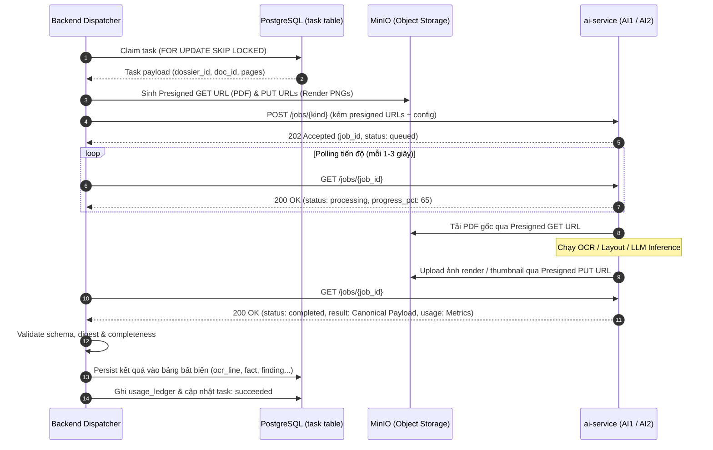

# DOC-05c · BACKEND–AI SERVICE CONTRACT — Contract Intelligence

**Đặc tả Hợp đồng Giao tiếp Kỹ thuật & Bàn giao Dữ liệu Backend ↔ AI Service**

| Thuộc tính | Nội dung |
|---|---|
| Mã tài liệu | **DOC-05c** / Contract Intelligence (PROD-01) |
| Phiên bản / SemVer | **`v1.0.0`** — Official Contract Baseline |
| Trạng thái | Đã chốt — Sẵn sàng triển khai Backend Client & AI Service Server |
| Owner | Architecture Lead / Backend Lead / AI1 Lead / AI2 Lead |
| Ngày hiệu lực | 17/09/2026 |
| Upstream | `docs/DOC-04-architecture.md` (v0.7.0, ADR-02, ADR-05, ADR-08), `docs/DOC-04b-postgres-schema.sql` (v1.2.0), `docs/DOC-05-api-spec.yaml` (v0.3.0) |
| Downstream | `backend/src/extraction/infrastructure/ai_client/`, `ai-service/app/` |

---

## Mục lục

1. [Nguyên tắc Thiết kế & Ranh giới Trách nhiệm (Trust Boundary)](#1-nguyên-tắc-thiết-kế--ranh-giới-trách-nhiệm-trust-boundary)
2. [Mô hình Tích hợp (Backend-Push & Polling)](#2-mô-hình-tích-hợp-backend-push--polling)
3. [Giao thức Bảo mật & Headers Chuẩn Nội bộ](#3-giao-thức-bảo-mật--headers-chuẩn-nội-bộ)
4. [Danh mục API Nội bộ của AI Service](#4-danh-mục-api-nội-bộ-của-ai-service)
   - [4.1 `POST /jobs/ocr` — Xử lý OCR & Layout Toàn diện (AI1)](#41-post-jobsocr--xử-lý-ocr--layout-toàn-diện-ai1)
   - [4.2 `POST /jobs/reocr` — Xử lý Lại OCR Nâng cao (AI1 Bounded Repair)](#42-post-jobsreocr--xử-lý-lại-ocr-nâng-cao-ai1-bounded-repair)
   - [4.3 `POST /jobs/extract` — Trích xuất Thực thể Pháp lý & Điều khoản (AI2)](#43-post-jobsextract--trích-xuất-thực-thể-pháp-lý--điều-khoản-ai2)
   - [4.4 `POST /jobs/compare` — Đối soát Chéo Hợp đồng vs Phụ lục (AI2)](#44-post-jobscompare--đối-soát-chéo-hợp-đồng-vs-phụ-lục-ai2)
   - [4.5 `GET /jobs/{id}` — Polling Trạng thái & Lấy Kết quả](#45-get-jobsid--polling-trạng-thái--lấy-kết-quả)
   - [4.6 `DELETE /jobs/{id}` — Hủy Job Đang Xử lý](#46-delete-jobsid--hủy-job-đang-xử-lý)
   - [4.7 `GET /healthz` & `GET /readyz` — Health & Model Readiness Probe](#47-get-healthz--get-readyz--health--model-readiness-probe)
5. [Đặc tả Định dạng Bàn giao Dữ liệu Chuẩn (Canonical Data Handoffs)](#5-đặc-tả-định-dạng-bàn-giao-dữ-liệu-chuẩn-canonical-data-handoffs)
   - [5.1 `ai1.snapshot.v3` (OCR & Layout Snapshot)](#51-ai1snapshotv3-ocr--layout-snapshot)
   - [5.2 `ai2.extraction.v2` (Facts, Citations & Evidence Gaps)](#52-ai2extractionv2-facts-citations--evidence-gaps)
   - [5.3 `ai2.comparison.v2` (Annex Links & Findings)](#53-ai2comparisonv2-annex-links--findings)
   - [5.4 `UsageLedgerReport` (Hạch toán Chi phí Token & Latency)](#54-usageledgerreport-hạch-toán-chi-phí-token--latency)
6. [Bộ Mã Pydantic Schemas / Python Typing Dùng Chung](#6-bộ-mã-pydantic-schemas--python-typing-dùng-chung)
7. [Xử lý Lỗi, Idempotency & Bounded Retry Policy](#7-xử-lý-lỗi-idempotency--bounded-retry-policy)

---

## 1. Nguyên tắc Thiết kế & Ranh giới Trách nhiệm (Trust Boundary)

Tuân thủ nghiêm ngặt theo các Quyết định Kiến trúc cốt lõi tại `DOC-04`:

1. **ADR-02: AI Service là một Python HTTP service nội bộ, hoàn toàn stateless:**
   - `ai-service` **KHÔNG** kết nối cơ sở dữ liệu (PostgreSQL).
   - `ai-service` **KHÔNG** sở hữu hàng đợi (Queue), không quản lý lease token, không duy trì trạng thái nghiệp vụ lâu dài (no persistent business state).
   - `ai-service` **KHÔNG** có Public API ra ngoài Internet và **KHÔNG** gọi ngược lại Backend (không callback URL).
2. **ADR-03: Backend là Trung tâm Điều phối & System of Record:**
   - Backend FastAPI độc quyền sở hữu bảng hàng đợi `task` trong PostgreSQL, sử dụng cơ chế `SELECT ... FOR UPDATE SKIP LOCKED` để dispatch công việc cho các worker.
   - Backend chịu trách nhiệm tạo Presigned URL MinIO (S3-compatible) có thời hạn ngắn để `ai-service` đọc tài liệu gốc và đẩy ảnh render lên lưu trữ.
3. **ADR-05: Handoff Canonical & Semantic Gate:**
   - Dữ liệu OCR/Layout bàn giao từ AI1 sang Backend bắt buộc theo chuẩn **`ai1.snapshot.v3`**.
   - Backend đóng vai trò là "Semantic Gate" kiểm tra tính toàn vẹn (validate schema, SHA-256 digest, completeness trang) trước khi chuyển tiếp cho AI2 xử lý.
4. **ADR-08: Phản hồi Thiếu Chứng cứ (Evidence Gap):**
   - Khi AI2 phát hiện vùng văn bản bị mờ, đứt đoạn hoặc không thể đối soát chắc chắn, AI2 trả về cấu trúc **`EvidenceGapDetected.v2`**.
   - Backend sẽ quyết định chính sách (Policy/Budget) để tạo yêu cầu Re-OCR hữu hạn (`ReOcrRequest.v3`) chuyển cho AI1 chạy lại.

---

## 2. Mô hình Tích hợp (Backend-Push & Polling)

Giao tiếp giữa Backend Dispatcher và AI Service hoạt động theo mô hình **Push Job & Polling Status**:



---

## 3. Giao thức Bảo mật & Headers Chuẩn Nội bộ

Mọi request từ Backend tới `ai-service` bắt buộc phải gửi trong mạng nội bộ (Private Network / VPC) và kèm các HTTP Headers sau:

| Header | Bắt buộc? | Ví dụ | Mục đích |
|---|:---:|---|---|
| `X-Internal-Service-Key` | Bắt buộc | `sec_ai_k9f8a7...` | Khóa xác thực dịch vụ nội bộ (Pre-shared key / mTLS) |
| `X-Tenant-Id` | Bắt buộc | `tenant_vgr_01` | Định danh không gian khách hàng để gắn vết audit/chi phí |
| `X-Task-Id` | Bắt buộc | `102938` (BIGSERIAL) | ID của task tương ứng trong bảng `task` PostgreSQL |
| `X-Attempt-Id` | Bắt buộc | `1` | Lần thử hiện tại (phục vụ retry kiểm soát) |
| `X-Trace-Id` | Khuyến nghị | `4bf92f3577b34da6...` | W3C TraceContext liên kết OpenTelemetry từ Backend sang AI Service |
| `Content-Type` | Bắt buộc | `application/json` | Định dạng payload trao đổi |

---

## 4. Danh mục API Nội bộ của AI Service

Base URL nội bộ: `http://ai-service.internal:8000/api/v1`

### 4.1 `POST /jobs/ocr` — Xử lý OCR & Layout Toàn diện (AI1)
Tiếp nhận tài liệu PDF, phân loại trang (`native`, `scanned`, `hybrid`), nhận diện chữ, xuất tọa độ Bbox CPS, phát hiện bảng biểu và cây điều khoản sơ bộ.

- **Request Body:**
  ```json
  {
    "task_id": 102938,
    "attempt_id": 1,
    "tenant_id": "tenant_vgr_01",
    "document_id": "doc_01J9X1AB",
    "source_blob_get_url": "http://minio:9000/contracts/pdf/a1b2c3...?token=...",
    "source_sha256": "a1b2c3d4e5f6789...",
    "pages_to_process": [1, 2, 3, 4, 5],
    "render_target": {
      "dpi": 150,
      "format": "PNG",
      "presigned_put_urls": {
        "1": "http://minio:9000/renders/pg_01J9X1AB_1.png?token=...",
        "2": "http://minio:9000/renders/pg_01J9X1AB_2.png?token=..."
      }
    },
    "options": {
      "language": "vi",
      "detect_tables": true,
      "extract_clauses": true
    }
  }
  ```
- **Response `202 Accepted`:**
  ```json
  {
    "job_id": "ai_job_01J9X999",
    "kind": "ocr",
    "status": "queued",
    "created_at": "2026-09-17T15:30:00Z"
  }
  ```

---

### 4.2 `POST /jobs/reocr` — Xử lý Lại OCR Nâng cao (AI1 Bounded Repair)
Áp dụng profile xử lý ảnh chuyên sâu (`high_res_binarize`, `table_optimized`, `contrast_boost`) cho một trang hoặc vùng crop cụ thể khi chuyên viên yêu cầu hoặc AI2 báo `EvidenceGapDetected`.

- **Request Body:**
  ```json
  {
    "task_id": 102945,
    "attempt_id": 1,
    "tenant_id": "tenant_vgr_01",
    "document_id": "doc_01J9X1AB",
    "page_id": "pg_01J9X1AB_3",
    "page_no": 3,
    "source_page_render_url": "http://minio:9000/renders/pg_01J9X1AB_3.png?token=...",
    "crop_bbox": [0.10, 0.40, 0.90, 0.65],
    "profile": "high_res_binarize",
    "options": {
      "enhance_dpi": 300,
      "deskew": true,
      "denoise": true
    }
  }
  ```
- **Response `202 Accepted`:**
  ```json
  {
    "job_id": "ai_job_01J9X998",
    "kind": "reocr",
    "status": "queued",
    "created_at": "2026-09-17T15:35:00Z"
  }
  ```

---

### 4.3 `POST /jobs/extract` — Trích xuất Thực thể Pháp lý & Điều khoản (AI2)
Nhận đầu vào là dữ liệu văn bản từ `ai1.snapshot.v3`, gọi mô hình ngôn ngữ (LLM) để trích xuất các fact có cấu trúc kèm tọa độ chứng cứ (`citation`).

- **Request Body:**
  ```json
  {
    "task_id": 102950,
    "attempt_id": 1,
    "tenant_id": "tenant_vgr_01",
    "document_id": "doc_01J9X1AB",
    "snapshot_digest": "sha256_snapshot_778899...",
    "document_text_nfc": "CỘNG HÒA XÃ HỘI CHỦ NGHĨA VIỆT NAM\nĐộc lập - Tự do - Hạnh phúc...",
    "clause_tree": [ ... ],
    "requested_schema_keys": [
      "price.total",
      "date.signing",
      "date.effective",
      "party.buyer.name",
      "party.seller.name"
    ],
    "llm_config": {
      "model": "gpt-5.6-terra",
      "temperature": 0.0,
      "prompt_version": "extract.v2.1"
    }
  }
  ```
- **Response `202 Accepted`:**
  ```json
  {
    "job_id": "ai_job_01J9X997",
    "kind": "extract",
    "status": "queued",
    "created_at": "2026-09-17T15:40:00Z"
  }
  ```

---

### 4.4 `POST /jobs/compare` — Đối soát Chéo Hợp đồng vs Phụ lục (AI2)
So sánh ngữ nghĩa và giá trị có cấu trúc giữa Hợp đồng chính và các Phụ lục, phát hiện các điểm mâu thuẫn hoặc điều khoản sửa đổi bổ sung.

- **Request Body:**
  ```json
  {
    "task_id": 102960,
    "attempt_id": 1,
    "tenant_id": "tenant_vgr_01",
    "dossier_id": "dos_01J9X100",
    "contract_document": {
      "document_id": "doc_contract_01",
      "facts": [ ... ],
      "clauses": [ ... ]
    },
    "annex_documents": [
      {
        "document_id": "doc_annex_01",
        "facts": [ ... ],
        "clauses": [ ... ]
      }
    ],
    "comparison_keys": ["price.total", "term.delivery", "penalty.breach"]
  }
  ```
- **Response `202 Accepted`:**
  ```json
  {
    "job_id": "ai_job_01J9X996",
    "kind": "compare",
    "status": "queued",
    "created_at": "2026-09-17T15:45:00Z"
  }
  ```

---

### 4.5 `GET /jobs/{id}` — Polling Trạng thái & Lấy Kết quả

- **Response khi đang xử lý (`200 OK`):**
  ```json
  {
    "job_id": "ai_job_01J9X999",
    "kind": "ocr",
    "status": "processing",
    "progress_pct": 60,
    "current_stage": "layout_analysis",
    "created_at": "2026-09-17T15:30:00Z",
    "updated_at": "2026-09-17T15:30:15Z"
  }
  ```
- **Response khi hoàn thành (`200 OK`):**
  ```json
  {
    "job_id": "ai_job_01J9X999",
    "kind": "ocr",
    "status": "completed",
    "progress_pct": 100,
    "result": { ... },
    "usage": {
      "provider": "local_terra",
      "model_requested": "terra-layout-v1",
      "model_returned": "terra-layout-v1",
      "input_tokens": 0,
      "output_tokens": 0,
      "reasoning_tokens": 0,
      "pages_processed": 5,
      "latency_ms": 14200,
      "cost_usd": 0.0,
      "price_version": "internal@v1"
    },
    "finished_at": "2026-09-17T15:30:25Z"
  }
  ```
- **Response khi thất bại (`200 OK` hoặc `500`):**
  ```json
  {
    "job_id": "ai_job_01J9X999",
    "kind": "ocr",
    "status": "failed",
    "error": {
      "code": "CORRUPTED_PDF_STREAM",
      "message": "Unable to parse PDF xref table on page 4",
      "details": { "page_no": 4, "offset": 104857 }
    },
    "finished_at": "2026-09-17T15:30:10Z"
  }
  ```

---

### 4.6 `DELETE /jobs/{id}` — Hủy Job Đang Xử lý
Cho phép Backend hủy khẩn cấp một tác vụ đang chạy (ví dụ: khi người dùng bấm Cancel Batch/Run hoặc task bị quá timeout).

- **Response `200 OK`:**
  ```json
  {
    "job_id": "ai_job_01J9X999",
    "status": "cancelled",
    "message": "Processing interrupted by backend request."
  }
  ```

---

### 4.7 `GET /healthz` & `GET /readyz` — Health & Model Readiness Probe
Phục vụ Docker container healthcheck và Kubernetes readiness probe:
- `GET /healthz`: Kiểm tra server HTTP còn sống.
- `GET /readyz`: Kiểm tra các mô hình nặng (PaddleOCR, LayoutLM, Embedding weights) đã tải hoàn tất vào VRAM/RAM chưa.
  ```json
  {
    "status": "ready",
    "vram_allocated_mb": 4200,
    "vram_free_mb": 7800,
    "loaded_models": ["paddle_ocr_vi", "table_detector_v2"]
  }
  ```

---

## 5. Đặc tả Định dạng Bàn giao Dữ liệu Chuẩn (Canonical Data Handoffs)

### 5.1 `ai1.snapshot.v3` (OCR & Layout Snapshot)
Bàn giao từ AI1 cho Backend sau bước `POST /jobs/ocr`. Backend sẽ lưu trữ trực tiếp vào các bảng `page`, `document_text`, `ocr_line`, `clause_node`, `doc_table`, `table_cell`.

```json
{
  "schema_version": "ai1.snapshot.v3",
  "document_id": "doc_01J9X1AB",
  "total_pages": 3,
  "pages": [
    {
      "page_no": 1,
      "width_pt": 595.28,
      "height_pt": 841.89,
      "rotation": 0,
      "kind": "native",
      "render_blob_uri": "renders/pg_01J9X1AB_1.png",
      "preview_blob_uri": "previews/pg_01J9X1AB_1.png",
      "features": { "has_text_layer": true, "density": 0.35 }
    }
  ],
  "full_text_nfc": "CỘNG HÒA XÃ HỘI CHỦ NGHĨA VIỆT NAM...",
  "lines": [
    {
      "page_no": 1,
      "line_no": 1,
      "text": "CỘNG HÒA XÃ HỘI CHỦ NGHĨA VIỆT NAM",
      "bbox": [0.25, 0.08, 0.75, 0.11],
      "confidence": 0.992,
      "doc_char_start": 0,
      "doc_char_end": 35,
      "words": [
        { "text": "CỘNG", "bbox": [0.25, 0.08, 0.35, 0.11], "conf": 0.99 },
        { "text": "HÒA", "bbox": [0.36, 0.08, 0.45, 0.11], "conf": 0.99 }
      ]
    }
  ],
  "clauses": [
    {
      "node_type": "article",
      "label": "Điều",
      "number": "1",
      "title": "Đối tượng và Phạm vi Hợp đồng",
      "text": "Bên A đồng ý cung cấp và Bên B đồng ý tiếp nhận...",
      "page_start": 1,
      "page_end": 1,
      "confidence": 0.95,
      "doc_char_start": 412,
      "doc_char_end": 850,
      "regions": [
        { "page_no": 1, "bbox": [0.10, 0.20, 0.90, 0.40], "bbox_source": "detector" }
      ]
    }
  ],
  "tables": [
    {
      "page_no": 2,
      "bbox": [0.10, 0.30, 0.90, 0.60],
      "rows_count": 3,
      "cols_count": 4,
      "has_borders": true,
      "cells": [
        {
          "row_idx": 0,
          "col_idx": 0,
          "row_span": 1,
          "col_span": 1,
          "text": "STT",
          "bbox": [0.10, 0.30, 0.20, 0.35],
          "is_header": true,
          "confidence": 0.98
        }
      ]
    }
  ]
}
```

---

### 5.2 `ai2.extraction.v2` (Facts, Citations & Evidence Gaps)
Bàn giao từ AI2 cho Backend sau bước `POST /jobs/extract`.

```json
{
  "schema_version": "ai2.extraction.v2",
  "document_id": "doc_01J9X1AB",
  "facts": [
    {
      "key": "price.total",
      "fact_type": "money",
      "raw_text": "150.000.000 VNĐ (Một trăm năm mươi triệu đồng)",
      "normalized_value": {
        "value": 150000000,
        "currency": "VND",
        "raw_unit": "đồng"
      },
      "confidence": 0.975,
      "extractor": "llm:gpt-5.6-terra@extract.v2.1",
      "context_text": "Tổng giá trị hợp đồng trước thuế là 150.000.000 VNĐ",
      "citation": {
        "quote": "150.000.000 VNĐ (Một trăm năm mươi triệu đồng)",
        "quote_sha256": "4a7d1ed414474e4033ac29ccb8653d9b...",
        "doc_char_start": 1204,
        "doc_char_end": 1251,
        "segments": [
          {
            "page_no": 2,
            "line_id": "ln_01J9X123",
            "char_start": 1204,
            "char_end": 1251,
            "bbox": [0.35, 0.52, 0.85, 0.55]
          }
        ]
      }
    }
  ],
  "evidence_gaps": [
    {
      "page_no": 3,
      "crop_bbox": [0.10, 0.60, 0.90, 0.80],
      "reason": "Chữ ký và con dấu đè lên ngày ký, không thể OCR chính xác năm ký",
      "severity": "medium",
      "suggested_profile": "contrast_boost"
    }
  ]
}
```

---

### 5.3 `ai2.comparison.v2` (Annex Links & Findings)
Bàn giao từ AI2 cho Backend sau bước `POST /jobs/compare`.

```json
{
  "schema_version": "ai2.comparison.v2",
  "dossier_id": "dos_01J9X100",
  "annex_links": [
    {
      "annex_document_id": "doc_annex_01",
      "contract_document_id": "doc_contract_01",
      "score": 0.94,
      "annex_sequence": 1,
      "effective_date": "2026-10-01",
      "status": "linked",
      "citation": {
        "quote": "Phụ lục số 01 kèm theo Hợp đồng kinh tế số 12/2026",
        "quote_sha256": "8f8a123...",
        "segments": [
          { "page_no": 1, "line_id": "ln_ax_01", "char_start": 0, "char_end": 51, "bbox": [0.10, 0.05, 0.90, 0.08] }
        ]
      }
    }
  ],
  "findings": [
    {
      "finding_type": "structured",
      "scope": "contract_annex",
      "key_or_topic": "price.total",
      "disposition": "candidate_amendment",
      "severity": "high",
      "confidence": 0.92,
      "rationale": "Phụ lục số 01 điều chỉnh tăng tổng giá trị hợp đồng từ 150.000.000 lên 180.000.000 VND",
      "method": "rule:money_compare@1",
      "side_a": {
        "document_id": "doc_contract_01",
        "fact_id": "fct_01J9X_contract_price",
        "citation": {
          "quote": "150.000.000 VNĐ",
          "quote_sha256": "4a7d1...",
          "segments": [{ "page_no": 2, "line_id": "ln_01", "char_start": 1204, "char_end": 1219, "bbox": [0.35, 0.52, 0.55, 0.55] }]
        },
        "value_snapshot": { "value": 150000000, "currency": "VND" }
      },
      "side_b": {
        "document_id": "doc_annex_01",
        "fact_id": "fct_01J9X_annex_price",
        "citation": {
          "quote": "180.000.000 VNĐ",
          "quote_sha256": "9b2c3...",
          "segments": [{ "page_no": 1, "line_id": "ln_02", "char_start": 450, "char_end": 465, "bbox": [0.30, 0.40, 0.50, 0.43] }]
        },
        "value_snapshot": { "value": 180000000, "currency": "VND" }
      }
    }
  ]
}
```

---

### 5.4 `UsageLedgerReport` (Hạch toán Chi phí Token & Latency)
Mọi response hoàn thành từ AI Service bắt buộc có object `usage` để Backend ghi sổ `usage_ledger`:

```json
{
  "provider": "openai",
  "model_requested": "gpt-5.6-terra",
  "model_returned": "gpt-5.6-terra-2026-09",
  "input_tokens": 1420,
  "cached_tokens": 512,
  "output_tokens": 380,
  "reasoning_tokens": 128,
  "pages_processed": 3,
  "cache_hit": true,
  "latency_ms": 1850,
  "cost_usd": 0.003150,
  "price_version": "gpt5.6-terra@2026-09-15"
}
```

---

## 6. Bộ Mã Pydantic Schemas / Python Typing Dùng Chung

Backend Client (`backend/`) và AI Service Server (`ai-service/`) có thể dùng chung file `shared/contracts/ai_service_schema.py`:

```python
"""
CONTRACT INTELLIGENCE — BACKEND <-> AI SERVICE CONTRACT SCHEMAS
Phiên bản: v1.0.0 (SemVer)
"""
from enum import Enum
from typing import List, Optional, Dict, Any, Tuple
from pydantic import BaseModel, Field

BBox = Tuple[float, float, float, float]  # [x0, y0, x1, y1] CPS 0..1

class PageKind(str, Enum):
    NATIVE = "native"
    SCANNED = "scanned"
    HYBRID = "hybrid"

class JobStatus(str, Enum):
    QUEUED = "queued"
    PROCESSING = "processing"
    COMPLETED = "completed"
    FAILED = "failed"
    CANCELLED = "cancelled"

class UsageLedgerReport(BaseModel):
    provider: str
    model_requested: str
    model_returned: str
    input_tokens: int = 0
    cached_tokens: int = 0
    output_tokens: int = 0
    reasoning_tokens: int = 0
    pages_processed: int = 0
    cache_hit: bool = False
    latency_ms: int
    cost_usd: float
    price_version: str

# ----------------------------------------------------
# AI1 Schemas (OCR & Layout)
# ----------------------------------------------------

class WordItem(BaseModel):
    text: str
    bbox: BBox
    conf: float

class OcrLineItem(BaseModel):
    page_no: int
    line_no: int
    text: str
    bbox: BBox
    confidence: float
    doc_char_start: int
    doc_char_end: int
    words: List[WordItem] = Field(default_factory=list)

class ClauseRegionItem(BaseModel):
    page_no: int
    bbox: BBox
    bbox_source: str = "detector"

class ClauseNodeItem(BaseModel):
    node_type: str  # article | clause | point
    label: str
    number: str
    title: str
    text: str
    page_start: int
    page_end: int
    confidence: float
    doc_char_start: int
    doc_char_end: int
    regions: List[ClauseRegionItem] = Field(default_factory=list)

class TableCellItem(BaseModel):
    row_idx: int
    col_idx: int
    row_span: int = 1
    col_span: int = 1
    text: str
    bbox: BBox
    is_header: bool = False
    confidence: float

class DocTableItem(BaseModel):
    page_no: int
    bbox: BBox
    rows_count: int
    cols_count: int
    has_borders: bool
    cells: List[TableCellItem]

class PageItem(BaseModel):
    page_no: int
    width_pt: float
    height_pt: float
    rotation: int = 0
    kind: PageKind
    render_blob_uri: str
    preview_blob_uri: str
    features: Dict[str, Any] = Field(default_factory=dict)

class Ai1SnapshotPayload(BaseModel):
    schema_version: str = "ai1.snapshot.v3"
    document_id: str
    total_pages: int
    pages: List[PageItem]
    full_text_nfc: str
    lines: List[OcrLineItem]
    clauses: List[ClauseNodeItem] = Field(default_factory=list)
    tables: List[DocTableItem] = Field(default_factory=list)

# ----------------------------------------------------
# AI2 Schemas (Extraction & Comparison)
# ----------------------------------------------------

class CitationSegmentItem(BaseModel):
    page_no: int
    line_id: str
    char_start: int
    char_end: int
    bbox: BBox

class CitationItem(BaseModel):
    quote: str
    quote_sha256: str
    doc_char_start: int
    doc_char_end: int
    segments: List[CitationSegmentItem]

class FactItem(BaseModel):
    key: str
    fact_type: str
    raw_text: str
    normalized_value: Dict[str, Any]
    confidence: float
    extractor: str
    context_text: Optional[str] = None
    citation: CitationItem

class EvidenceGapItem(BaseModel):
    page_no: int
    crop_bbox: BBox
    reason: str
    severity: str
    suggested_profile: Optional[str] = None

class Ai2ExtractionPayload(BaseModel):
    schema_version: str = "ai2.extraction.v2"
    document_id: str
    facts: List[FactItem]
    evidence_gaps: List[EvidenceGapItem] = Field(default_factory=list)

class FindingSideItem(BaseModel):
    document_id: str
    fact_id: Optional[str] = None
    clause_node_id: Optional[str] = None
    citation: CitationItem
    value_snapshot: Optional[Dict[str, Any]] = None

class FindingItem(BaseModel):
    finding_type: str  # structured | semantic
    scope: str         # contract_annex | within_document | annex_annex
    key_or_topic: str
    disposition: str
    severity: str      # high | medium | low
    confidence: float
    rationale: str
    method: str
    side_a: FindingSideItem
    side_b: FindingSideItem

class AnnexLinkItem(BaseModel):
    annex_document_id: str
    contract_document_id: str
    score: float
    annex_sequence: int
    effective_date: Optional[str] = None
    status: str
    citation: CitationItem

class Ai2ComparisonPayload(BaseModel):
    schema_version: str = "ai2.comparison.v2"
    dossier_id: str
    annex_links: List[AnnexLinkItem]
    findings: List[FindingItem]
```

---

## 7. Xử lý Lỗi, Idempotency & Bounded Retry Policy

### 7.1 Bảng Mã Lỗi Nội Bộ của AI Service
Khi một job thất bại, trường `error` trong phản hồi `GET /jobs/{id}` trả về mã lỗi cụ thể:

| Mã lỗi (`code`) | Ý nghĩa | Backend Dispatcher Action |
|---|---|---|
| `CORRUPTED_PDF_STREAM` | Không đọc được file PDF hoặc thiếu trang | Đánh dấu task thất bại vĩnh viễn (`dead`), không retry |
| `INVALID_PRESIGNED_URL` | URL MinIO hết hạn hoặc không kết nối được S3 | Sinh lại Presigned URL và retry ngay lập tức |
| `GPU_OOM` | Hết bộ nhớ VRAM khi xử lý ảnh độ phân giải cao | Giảm `render_dpi` (150 -> 100) và retry (tối đa 2 lần) |
| `LLM_RATE_LIMIT` | Bị giới hạn số lượt gọi OpenAI/LLM API (429) | Áp dụng Exponential Backoff (chờ 10s, 30s) rồi retry |
| `LLM_CONTEXT_EXCEEDED` | Văn bản vượt quá giới hạn cửa sổ ngữ cảnh context | Cắt nhỏ tài liệu thành từng phần (chunking) rồi chạy lại |
| `INTERNAL_CRASH` | Lỗi ngoại lệ không kiểm soát trong code AI | Ghi log OpenTelemetry và chuyển trạng thái task sang `failed` |

### 7.2 Tính Bất Biến & Idempotency
- Mỗi lần Dispatcher gọi `POST /jobs/{kind}` đều gửi kèm `X-Task-Id` và `X-Attempt-Id`.
- Nếu AI Service nhận trùng cặp `(task_id, attempt_id)` đang trong trạng thái xử lý, AI Service **không khởi tạo job mới** mà trả về ngay `job_id` đang chạy kèm mã `200 OK` (hoặc `202 Accepted`).

### 7.3 Bounded Retry Policy (ADR-12)
- Mọi tác vụ OCR / Extraction / Comparison có hạn ngạch retry tối đa **`max_attempts = 3`**.
- Sau 3 lần thất bại, Dispatcher khóa task vào trạng thái `dead` và thông báo trên Dashboard Reviewer để người dùng can thiệp thủ công, tránh gây lãng phí chi phí LLM và tài nguyên server.

---

**Hết DOC-05c · Backend–AI Service Contract v1.0.0 (SemVer)**
