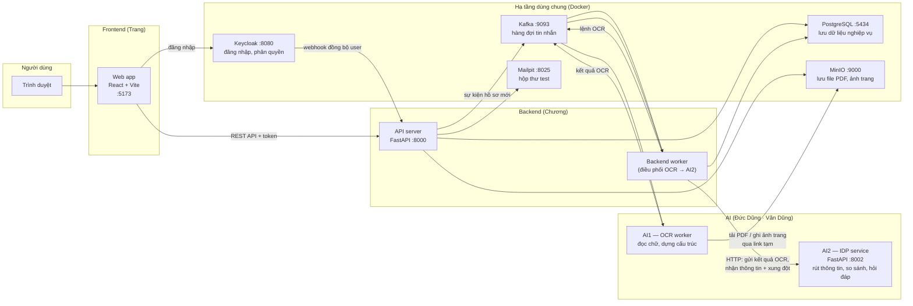
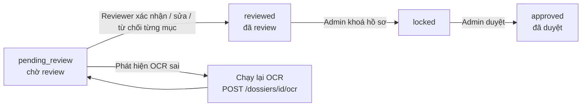
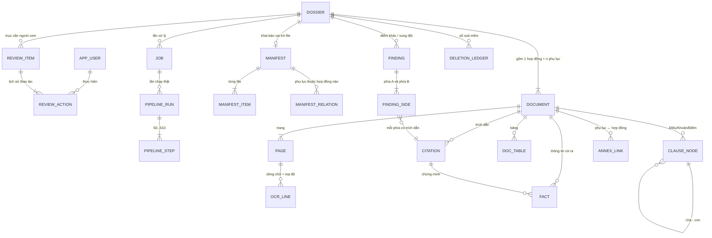
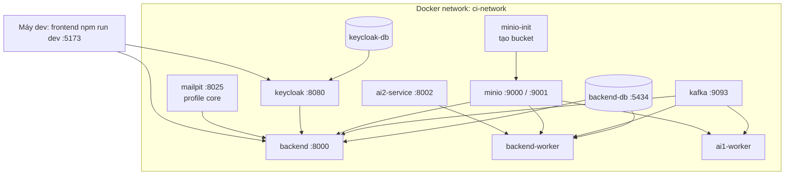

# DOC-09 · SAD — Tài liệu kiến trúc phần mềm (Sprint 2 MVP)

> **Contract Intelligence** — Hệ thống đọc hợp đồng tự động, tách điều khoản, phát hiện điểm mâu thuẫn giữa hợp đồng và phụ lục, và để con người kiểm tra lại trước khi duyệt.

---

## 0. Thông tin tài liệu

| Trường | Nội dung |
|---|---|
| Mã tài liệu | DOC-09 — Software Architecture Document (SAD) |
| Phạm vi | Sprint 2 MVP — những gì **đang có và chạy được** trên nhánh `feature/code-full` |
| Mục đích | Để mentor nghiệm thu: hệ thống gồm những phần gì, chạy như thế nào, chỗ nào đã xong, chỗ nào sẽ làm tiếp |
| Ngày | 27/09/2026 |
| Team | Lead & FE: Trang · BE: Chương · AI1-OCR: Đức Dũng · AI2-Reasoning: Văn Dũng |
| Tài liệu gốc để đối chiếu | DOC-04 (kiến trúc), DOC-04c (sơ đồ bảng), DOC-05 (API), DOC-05d/05e (Kafka), DOC-07 (khung dự án) |

**Cách đọc tài liệu này:** mỗi mục đều bám vào code thật trong repo (có ghi đường dẫn file). Mục 15 là checklist để mentor tick khi nghiệm thu. Mục 16 là những điểm còn mở, sẽ làm ở Sprint 3.

**Ghi chú quan trọng:** một vài tài liệu cũ (README gốc, DOC-04 bản đầu) mô tả backend bằng Java Spring Boot. Thực tế team đã chốt **Python FastAPI** cho backend từ Sprint 2. Tài liệu này viết theo code hiện tại.

---

## 1. Hệ thống này làm gì?

Người dùng (nhân viên pháp chế, kế toán, mua hàng…) có một bộ hồ sơ gồm **1 file hợp đồng chính** và **0 hoặc nhiều phụ lục** dạng PDF (có thể là bản scan). Hệ thống sẽ:

1. **Đọc chữ** trong PDF (kể cả bản scan) — gọi là OCR.
2. **Dựng lại cấu trúc** Điều → Khoản → Điểm và các bảng trong tài liệu.
3. **Rút ra thông tin quan trọng** (các bên, giá trị hợp đồng, ngày ký, thời hạn thanh toán…) kèm **trích dẫn**: thông tin này nằm ở trang nào, dòng nào, tọa độ nào trên trang.
4. **So hợp đồng với phụ lục** để tìm điểm khác nhau / mâu thuẫn.
5. **Đưa cho người kiểm tra** (reviewer) xem, sửa, xác nhận từng điểm; cuối cùng **admin duyệt** hồ sơ.
6. Cho phép **hỏi đáp** trong phạm vi một hồ sơ ("giá trị hợp đồng là bao nhiêu?") và trả lời kèm trích dẫn.

**Nguyên tắc xuyên suốt:** máy chỉ đề xuất, con người quyết định. Mọi thông tin máy rút ra đều phải có trích dẫn về đúng chỗ trong tài liệu gốc; kết quả máy không bị ghi đè, mọi chỉnh sửa của người đều được lưu thành bản mới.

### 1.1 Mục tiêu Sprint 2 MVP

Chạy thông suốt **luồng cốt lõi**: đăng nhập → tải hồ sơ lên → OCR → phân tích → xem cấu trúc, xem xung đột → review → duyệt. Không yêu cầu hoàn thiện mọi màn hình hay mọi loại tài liệu.

---

## 2. Bức tranh tổng thể

Hệ thống chia thành **4 phần chính** do 4 thành viên phụ trách, cộng thêm các dịch vụ hạ tầng dùng chung.



**Nói ngắn gọn:**

- Frontend là nơi người dùng thao tác. Nó **không** gọi thẳng AI, chỉ nói chuyện với Backend (và Keycloak để đăng nhập).
- Backend là "nhạc trưởng": giữ dữ liệu, kiểm tra quyền, quyết định khi nào gọi AI1, khi nào gọi AI2.
- AI1 chỉ làm việc **đọc chữ và dựng cấu trúc**; AI2 chỉ làm việc **hiểu nội dung**. Hai bên không gọi nhau, mọi thứ đi qua Backend.
- Kafka là hàng đợi để Backend và AI1 trao đổi mà không cần chờ nhau (OCR có thể mất vài phút).

---

## 3. Các thành phần (module / service)

### 3.1 Frontend — `frontend/`

| Hạng mục | Nội dung |
|---|---|
| Công nghệ | React 19, TypeScript, Vite 7, Tailwind CSS 4, React Router 7, `oidc-client-ts` (đăng nhập SSO), `pdfjs-dist` (hiển thị PDF) |
| Đăng nhập | Chuyển hướng sang Keycloak; sau khi đăng nhập, mọi request tới Backend gắn token và mã tổ chức (`X-Tenant-Id`) — xem `src/api/client.ts` |
| Phân quyền trên UI | 2 nhóm: **admin** (role Keycloak `ADMINISTRATOR`) và **user** (role `OPERATOR` / `REVIEWER`). Menu và trang khác nhau theo nhóm — xem `src/auth/session.ts`, `RequireRole.tsx` |
| Cấu trúc code | `pages/` (màn hình) · `components/` (khối giao diện tái sử dụng) · `api/` (gọi Backend) · `structure/` (dựng cây Điều/Khoản/Điểm, bảng, trích dẫn từ dữ liệu OCR) · `auth/` |
| Test | Vitest, 17 file test trong `frontend/tests/` (cây cấu trúc, bảng nối trang, trích dẫn xung đột, hàng đợi finding, timeline review…) |

Danh sách màn hình ở mục 5.

### 3.2 Backend API — `backend/src/contract_intelligence/`

| Hạng mục | Nội dung |
|---|---|
| Công nghệ | Python 3.11+, FastAPI, SQLAlchemy 2 (async), Alembic (tạo/sửa bảng), Pydantic v2, `aiokafka`, `minio`/`aioboto3`, `PyJWT`, `python-keycloak`, `structlog` |
| Cách tổ chức | Chia theo **4 mảng nghiệp vụ**: `contract/` (hồ sơ, tài liệu, job), `extraction/` (kết quả OCR, cấu trúc, fact, trích dẫn), `conflict/` (xung đột), `review/` (kiểm tra & duyệt). Thêm `identity/` (người dùng, Keycloak) và `shared/` (dùng chung) |
| Mỗi mảng có 4 tầng | `domain/` (khái niệm nghiệp vụ, không dính framework) → `application/` (xử lý nghiệp vụ) → `infrastructure/` (ghi DB, MinIO, gọi AI) → `interfaces/` (API). Quy tắc "tầng ngoài gọi tầng trong, không gọi ngược" được **máy kiểm tra tự động** bằng `import-linter` trong CI |
| Điểm vào | `main.py` — lắp tất cả router, middleware CORS, header `X-Request-Id`/`X-Backend-Version`, tự chạy Alembic khi khởi động, mở kết nối Kafka |
| Trả về | Mọi API trả cùng một khung `{ "data": ..., "meta": ... }`; lỗi trả `{ "error": { code, message, details } }` |

### 3.3 Backend worker — `backend/src/contract_intelligence/worker.py`

Chạy như một tiến trình riêng (`python -m contract_intelligence.worker`). Nhiệm vụ:

1. Nghe sự kiện `dossier.uploaded` trên Kafka → đánh dấu hồ sơ **đang xử lý**, tạo một "lần chạy" (`pipeline_run`) với 11 bước S0…S10 → tạo **link tải PDF tạm thời** và **link ghi ảnh trang** trên MinIO → gửi **lệnh OCR** cho từng file (hợp đồng và phụ lục) lên Kafka.
2. Nghe kết quả OCR từ AI1 → lưu trang, dòng chữ, cấu trúc vào PostgreSQL → lưu bản snapshot OCR vào `pipeline_run.config_snapshot` để nếu worker khởi động lại vẫn không mất.
3. Khi đã có đủ OCR của mọi file và hồ sơ đã được xác nhận vai trò (hợp đồng / phụ lục) → gọi **AI2 qua HTTP** (`POST /jobs/idp`, rồi hỏi trạng thái `GET /jobs/{id}`) → lưu fact, finding, trích dẫn, tạo các mục cần review → chuyển hồ sơ sang **chờ review**.
4. Có chống xử lý trùng (cùng một sự kiện đến 2 lần sẽ bị bỏ qua).

### 3.4 AI1 — OCR worker — `ai-service/src/contract_ocr/`

| Hạng mục | Nội dung |
|---|---|
| Chạy dưới dạng | Kafka worker (`infrastructure/kafka_worker.py`), service `ai1-worker` (nhiều replica, `AI1_WORKER_REPLICAS`) |
| Đầu vào | Lệnh OCR: link tải PDF, mã hash để kiểm tra file, danh sách trang, engine, link ghi ảnh trang |
| Cách xử lý | Trang có sẵn lớp chữ (PDF gõ máy) → đọc trực tiếp bằng PyMuPDF, nhanh và miễn phí. Trang scan → gọi engine OCR. Engine mặc định trong compose: **Mistral OCR** (có bản "verified": đọc 2 lần bằng 2 model để đối chiếu chữ và tọa độ). Tuỳ chọn khác: OpenAI Vision, Gemini Vision, hoặc `pymupdf` thuần để test không tốn phí |
| Dựng cấu trúc | `reconstruction/` — tách header/footer, gộp đoạn, nhận diện Điều/Khoản/Điểm; `table_reconstruct/` — dựng bảng, nối bảng qua trang |
| Đầu ra | Một **snapshot** JSON theo chuẩn `ai1.snapshot.v1`: trang, dòng chữ + tọa độ, cây cấu trúc, bảng, hash nguồn, engine đã dùng. Snapshot **không bao giờ sửa**; OCR lại thì tạo snapshot mới |
| Ngoài luồng chính | Có web demo riêng (`web/app.py`, `frontend/index.html`) và bộ benchmark đo chất lượng OCR (`src/benchmark/`, `ocr-benchmark/`) — mục 14 |

### 3.5 AI2 — IDP service — `ai-service/app/`

| Hạng mục | Nội dung |
|---|---|
| Chạy dưới dạng | FastAPI HTTP service (`app/api/main.py`), container `ci-ai2-service`, cổng 8002 |
| API Backend dùng | `POST /jobs/idp` (nhận snapshot AI1 + danh sách thành viên hồ sơ, trả `job_id`, xử lý nền), `GET /jobs/{job_id}` (hỏi kết quả), `POST /query` (hỏi đáp trong hồ sơ), `GET /health` |
| Bảo mật giữa 2 service | Mỗi request Backend gửi kèm một **phong bì chữ ký** (service envelope, ký HMAC) chứa tổ chức, hồ sơ, người gọi, số ngẫu nhiên chống gửi lại; AI2 kiểm tra rồi mới xử lý |
| Việc AI2 làm (`app/pipeline/`) | Chuẩn hoá snapshot → dựng cây cấu trúc chuẩn → rút fact (bên A/B, số tiền, ngày, thời hạn…) có trích dẫn → ghép hợp đồng với phụ lục → so từng cặp để ra **finding** (khớp / khác / bổ sung / không so được / thiếu bằng chứng) → kiểm tra mọi trích dẫn có trỏ về đúng chỗ thật trong snapshot không |
| Hỏi đáp (`app/reasoning/`) | 4 lớp: L0 quy tắc cứng → L1 tìm kiếm từ khoá (và vector nếu bật) → L2 lập kế hoạch so sánh → L3 kiểm chứng bằng chứng trước khi trả lời. Trả lời kèm trạng thái: đã trả lời / cần người xem / thiếu bằng chứng / bị chặn |
| LLM | Gọi qua endpoint tương thích OpenAI, cấu hình bằng `AI2_LLM_BASE_URL`, `AI2_LLM_MODEL`. Nếu chưa cấu hình, phần dùng quy tắc vẫn chạy, không làm sập luồng |
| Lưu trữ nội bộ | SQLite trong volume `ai2_data` để nhớ job; đây là bộ nhớ tạm của AI2, **nguồn sự thật vẫn là PostgreSQL của Backend** |

### 3.6 Hạ tầng dùng chung (chạy bằng Docker Compose)

| Service | Container | Cổng máy | Vai trò |
|---|---|---|---|
| Keycloak 26 (+ Phase Two) | `ci-keycloak` | 8080 | Đăng nhập một cửa (SSO), quản lý user và role, gửi webhook khi user thay đổi. Realm `contract-intelligence` tự nạp từ `keycloak/realm-export.json`, giao diện đăng nhập tuỳ biến theme `lexis` |
| PostgreSQL 16 (Keycloak) | `ci-keycloak-db` | 5433 | DB riêng cho Keycloak |
| PostgreSQL 16 (Backend) | `ci-backend-db` | 5434 | DB nghiệp vụ `contract_intelligence` |
| Apache Kafka 3.7 (KRaft) | `ci-kafka` | 9093 | Hàng đợi tin nhắn; cho phép gói tin tới 10 MB vì kết quả OCR lớn |
| MinIO | `ci-minio` | 9000 / 9001 | Kho file kiểu S3: bucket `dossiers` (PDF gốc), `ci-render` (ảnh trang) |
| Mailpit | `ci-mailpit` | 8025 | Hộp thư giả để xem thư mời / thư chia sẻ (không gửi ra ngoài) |

---

## 4. Luồng dữ liệu chính

### 4.1 Luồng xử lý một hồ sơ (upload → review → duyệt)

```mermaid
sequenceDiagram
    autonumber
    actor U as Operator / Admin
    participant FE as Frontend
    participant API as Backend API
    participant K as Kafka
    participant W as Backend worker
    participant S3 as MinIO
    participant AI1 as AI1 OCR worker
    participant AI2 as AI2 service
    participant DB as PostgreSQL

    U->>FE: Chọn PDF hợp đồng (+ phụ lục), đặt tên
    FE->>API: POST /api/v1/dossiers (multipart)
    API->>S3: Lưu file PDF
    API->>DB: Tạo dossier, document, job (uploaded)
    API-->>FE: 202 { dossier_id, job_id }
    API->>K: dossier.uploaded

    K->>W: dossier.uploaded
    W->>DB: dossier → processing, tạo pipeline_run S0..S10
    W->>S3: Tạo link tải PDF + link ghi ảnh trang (có hạn)
    W->>K: ai1.ocr.command (mỗi file một lệnh)

    K->>AI1: ai1.ocr.command
    AI1->>S3: Tải PDF, kiểm tra hash
    AI1->>AI1: Đọc chữ (PyMuPDF / Mistral), dựng Điều-Khoản-Điểm, bảng
    AI1->>S3: Ghi ảnh từng trang (PNG)
    AI1->>K: ai1.ocr.completed (snapshot ai1.snapshot.v1)

    K->>W: ai1.ocr.completed
    W->>DB: Lưu page, ocr_line, clause_node, doc_table; job → extracted
    W->>W: Đủ OCR mọi file? Vai trò đã xác nhận?
    W->>AI2: POST /jobs/idp (snapshots + thành viên hồ sơ, có chữ ký)
    loop hỏi trạng thái
        W->>AI2: GET /jobs/{id}
    end
    AI2-->>W: SUCCEEDED: facts, findings, citations, review_state
    W->>DB: Lưu fact, finding, finding_side, citation, annex_link, review_item
    W->>DB: dossier → pending_review

    FE->>API: Poll GET /dossiers/{id}, /runs/{id}/steps
    FE-->>U: Hiện tiến trình, rồi cấu trúc + xung đột
```

Sau đó là phần **con người**:



### 4.2 Trạng thái hồ sơ

Định nghĩa tại `contract/domain/entities/job.py`:

| Trạng thái | Ý nghĩa dễ hiểu | Ai chuyển |
|---|---|---|
| `uploaded` | File đã lên, chưa xử lý | Backend API khi upload |
| `processing` | Đang OCR / phân tích | Backend worker |
| `extracted` | OCR xong, có dữ liệu cấu trúc | Backend worker |
| `pending_review` | Đã có fact / xung đột, chờ người xem | Backend worker sau AI2 |
| `reviewed` | Người đã xử lý hết các mục | Backend khi mọi review item đóng |
| `approved` | Admin đã duyệt | Admin qua `POST /dossiers/{id}/approve` |
| `failed` | Lỗi ở OCR hoặc AI2, có mã lỗi | Backend worker |
| `cancelled` | Bị huỷ | Admin |

Mỗi lần chuyển trạng thái đều ghi lại lịch sử để truy vết.

### 4.3 Luồng hỏi đáp trong hồ sơ

```
Người dùng gõ câu hỏi trên FE
  → POST /api/v1/dossiers/{id}/query  (Backend kiểm tra quyền xem hồ sơ)
  → Backend gọi AI2 POST /query, gửi kèm mã snapshot của hồ sơ
  → AI2 chạy L0 → L1 → L2 → L3, trả { state, answer, citations[], retrieval_layer, reasoning_trace }
  → Backend ghi lại dấu vết câu hỏi (ai hỏi, hỏi gì, trích dẫn nào) rồi trả FE
  → FE hiện câu trả lời; bấm trích dẫn thì mở đúng trang, tô đúng vùng
```

Nếu AI2 không đủ bằng chứng, `state` là `INSUFFICIENT_EVIDENCE` và không có câu khẳng định.

### 4.4 Luồng đăng nhập và đồng bộ người dùng

```
FE → Keycloak (đăng nhập, lấy token)
FE → Backend: gửi token trong header Authorization
Backend: kiểm tra chữ ký token bằng khoá công khai của Keycloak (JWKS), đọc role, đọc tenant
Backend: đối chiếu user trong bảng app_user (tự tạo nếu chưa có)

Admin tạo user mới trên FE → Backend gọi Keycloak Admin API → Keycloak gửi thư mời đặt mật khẩu (vào Mailpit)
Keycloak có thay đổi user → gửi webhook (có chữ ký HMAC) → POST /api/v1/auth/webhooks/keycloak → Backend cập nhật app_user
```

---

## 5. Màn hình Frontend (đã có trong `src/App.tsx`)

| Đường dẫn | Tên màn hình | Ai thấy | Gọi API chính | Trạng thái |
|---|---|---|---|---|
| `/` | Đăng nhập (SSO Keycloak) | Tất cả | Keycloak | Xong |
| `/tong-quan` | Tổng quan hệ thống | Admin | `GET /admin/activity`, `GET /admin/storage` | Xong |
| `/nguoi-dung-phan-quyen` | Người dùng & Phân quyền | Admin | `GET/POST/PATCH /users`, `/users/{id}/invite`, `/disable`, `/enable` | Xong |
| `/ho-so` · `/ho-so-cua-toi` | Danh sách hồ sơ | Admin · User | `GET /dossiers`, `DELETE`, `PATCH`, `PUT /dossiers/{id}/access` | Xong |
| `/tao-ho-so` | Tải lên tài liệu | Operator, Admin | `POST /dossiers` (multipart) | Xong |
| `/ocr/:dossierId` | Tiến trình OCR | Tất cả | `GET /dossiers/{id}/documents`, `/documents/{id}/pages`, `POST /dossiers/{id}/ocr` (chạy lại) | Xong |
| `/xac-nhan-manifest/:dossierId` | Xác nhận vai trò & quan hệ (file nào là hợp đồng, file nào là phụ lục) | Operator, Admin | `GET /dossiers/{id}/manifest`, `POST .../manifest/confirm` | Xong |
| `/tien-trinh-phan-tich/:dossierId` | Tiến trình phân tích (S0…S10) | Tất cả | `GET /dossiers/{id}/facts`, `/findings`, `/runs/{id}/steps` | Xong |
| `/cau-truc/:dossierId` | Cấu trúc hợp đồng: cây Điều/Khoản/Điểm, bảng, sơ đồ tư duy, ảnh trang, tìm kiếm | Tất cả | `GET /documents/{id}/clauses`, `/tables`, `/pages/{n}/image`, `/content`, `POST /dossiers/{id}/search`, `GET /dossiers/{id}/conflicts` | Xong |
| `/doi-soat-xung-dot` | Đối soát xung đột giữa hợp đồng và phụ lục, đánh dấu trên cây điều khoản | Tất cả | `GET /dossiers/{id}/conflicts`, `GET/POST /findings/{id}/review`, `/clause-nodes/{id}/review` | Xong |
| `/ho-so-hop-dong` | Hồ sơ hợp đồng — hàng đợi review, timeline, khoá, duyệt | Reviewer, Admin | `GET /dossiers/{id}/review-items`, `POST /review-items/{id}/actions`, `POST /dossiers/{id}/lock`, `/approve` | Xong |
| `/doi-soat-trich-dan` · `/nhan-xet-chinh-sua` · `/chinh-sua-trich-dan` | Đối soát / nhận xét / chỉnh sửa trích dẫn (xem PDF hai bên, tô vùng) | Reviewer, Admin | Như trên | Xong |
| `/quyen-truy-cap` | Quyền truy cập hồ sơ | Tất cả | `PUT /dossiers/{id}/access` | Xong |
| `/nhat-ky-hoat-dong` · `/nhat-ky-phap-ly` | Nhật ký hoạt động / kiểm soát | Tất cả | `GET /admin/activity`, revisions | Xong |
| `/cai-dat` | Cài đặt | Tất cả | — | Cơ bản |
| `/duoc-chia-se-voi-toi`, `/tim-kiem-xuyen-ho-so`, `/trung-tam-phan-tich`, `/kho-dieu-khoan-mau`, `/tuan-thu-rui-ro` | Các trang mở rộng | — | — | **Placeholder** (chỉ có khung, Sprint 3) |

---

## 6. API Backend (nhóm theo chức năng)

Tất cả nằm dưới `/api/v1`, cần token trừ `/health`. Xem đầy đủ tại `http://127.0.0.1:8000/docs` (Swagger) khi chạy.

| Nhóm | Endpoint chính | Ghi chú |
|---|---|---|
| Sức khoẻ | `GET /health`, `GET /api/v1/healthz`, `/readyz` | Docker healthcheck dùng `/health` |
| Đăng nhập | `GET /auth/me`, `POST /auth/webhooks/keycloak` | Webhook có kiểm chữ ký |
| Người dùng (Admin) | `GET/POST /users`, `PATCH /users/{id}`, `POST /users/{id}/invite|disable|enable` | Tạo user qua Keycloak Admin API |
| Hồ sơ | `POST /dossiers` (upload), `GET /dossiers`, `GET/PATCH/DELETE /dossiers/{id}`, `PUT /dossiers/{id}/access`, `POST /dossiers/{id}/ocr`, `POST /dossiers/{id}/search`, `POST /dossiers/{id}/query` | Upload cần role OPERATOR/ADMINISTRATOR |
| Tài liệu & manifest | `GET /dossiers/{id}/documents`, `GET /documents/{id}`, `/content`, `GET /dossiers/{id}/manifest`, `POST .../manifest/confirm` | `/content` trả PDF gốc |
| Lần chạy (pipeline) | `POST /dossiers/{id}/runs`, `/reprocess`, `GET /runs`, `/runs/{id}`, `/runs/{id}/steps`, `POST /runs/{id}/cancel`, `GET /runs/{id}/events` (SSE) | S0…S10 |
| Kết quả OCR / cấu trúc | `GET /documents/{id}/pages`, `/pages/{n}/image`, `/clauses`, `/tables`, `GET /pages/{id}` | Ảnh trang lấy từ MinIO |
| Fact & trích dẫn | `GET /dossiers/{id}/facts`, `/documents/{id}/facts`, `GET /facts/{id}`, `GET /citations/{id}` | `?effective=true` trả giá trị sau khi người sửa |
| Xung đột | `GET /dossiers/{id}/findings`, `/conflicts`, `GET /findings/{id}` | |
| Review | `GET /dossiers/{id}/review-items`, `GET /review-items/{id}`, `/revisions`, `POST /review-items/{id}/actions`, `GET/POST /clause-nodes/{id}/review`, `GET/POST /findings/{id}/review` | Gửi kèm `base_version`; sai phiên bản → 409 |
| Duyệt | `POST /dossiers/{id}/lock`, `/approve`, `POST/GET /dossiers/{id}/external-approvals`, `POST /external-approvals/callback` | Admin |
| OCR lại | `POST /documents/{id}/re-ocr`, `GET /documents/{id}/re-ocr-requests`, `GET /re-ocr-requests/{id}` | |
| Admin / vận hành | `GET /admin/activity`, `/admin/storage`, `POST/GET /batches`, `/batches/{id}/summary|cancel|resume`, `GET /ops/metrics`, `/optimization/*` | `optimization/*` xem mục 14 |

---

## 7. Cơ sở dữ liệu

### 7.1 Bảng thực tế đang được tạo (Sprint 2)

Bảng được tạo từ ORM qua Alembic (`v4__create_core_schema` tạo từ model; các bản v5–v9 thêm cột / bảng). Hiện có **21 bảng**:



| Nhóm | Bảng | Dùng để |
|---|---|---|
| Người dùng | `app_user` | Bản sao thông tin user từ Keycloak (email, tên, role, tenant, `keycloak_sub`) để join với nhật ký |
| Hồ sơ | `dossier`, `document`, `manifest`, `manifest_item`, `manifest_relation` | Hồ sơ, từng file PDF (vai trò CONTRACT / ANNEX, hash, vị trí trong MinIO), khai báo vai trò & quan hệ file |
| Xử lý | `job`, `pipeline_run`, `pipeline_step` | Trạng thái hồ sơ, từng lần chạy (kèm bản snapshot OCR để phục hồi), 11 bước S0…S10 với thời gian/số trang/lỗi |
| OCR | `page`, `ocr_line` | Trang (kích thước, loại native/scan, link ảnh), từng dòng chữ với toạ độ chuẩn 0..1 |
| Cấu trúc | `clause_node`, `doc_table` | Cây Điều/Khoản/Điểm (tự tham chiếu cha-con), bảng (kèm nối bảng qua trang) |
| Bằng chứng | `citation`, `fact` | Trích dẫn (câu gốc, trang, toạ độ), fact (loại, giá trị thô, giá trị chuẩn hoá, độ tin cậy, trích dẫn) |
| Xung đột | `annex_link`, `finding`, `finding_side` | Phụ lục nào thuộc hợp đồng nào; mỗi finding có 2 phía, mỗi phía một trích dẫn |
| Review | `review_item`, `review_action` | Mục chờ review (có số phiên bản để chống 2 người sửa cùng lúc), lịch sử thao tác chỉ thêm không sửa |
| Xoá | `deletion_ledger` | Sổ ghi xoá mềm và dọn dẹp sau đó |

### 7.2 Nguyên tắc dữ liệu

- **Kết quả máy không sửa tại chỗ.** `ocr_line`, `clause_node`, `citation`, `fact`, `finding`, `review_action` là loại "chỉ thêm". Muốn sửa thì thêm `review_action` mới; API `?effective=true` sẽ trả giá trị cuối cùng sau khi người sửa.
- **Mọi thứ gắn với một lần chạy (`run_id`).** OCR lại tạo run mới, dữ liệu cũ vẫn còn.
- **Toạ độ dùng chuẩn 0..1** theo kích thước trang, nên tô vùng trên ảnh ở độ phân giải nào cũng đúng.
- **Có `tenant_id`** trên các bảng chính để tách dữ liệu giữa các tổ chức.

### 7.3 Đối chiếu với thiết kế DOC-04c (33 bảng)

Thiết kế đầy đủ có 33 bảng. Sprint 2 hiện thực hoá **21 bảng** phục vụ luồng cốt lõi. Các bảng chưa tạo (thuộc Sprint 3): `batch`, `task`, `job_event`, `document_text`, `clause_region`, `table_cell`, `reocr_request`, `dossier_approval`, `external_approval_grant`, `page_step_stat`, `usage_ledger`, `optimization_*`. Một số chức năng tương ứng (batch, optimization) hiện có API nhưng lưu tạm trong bộ nhớ hoặc trả dữ liệu mẫu — xem mục 14.

---

## 8. Công nghệ sử dụng

| Lớp | Công nghệ | Lý do chọn (ngắn) |
|---|---|---|
| Giao diện | React 19 + TypeScript + Vite + Tailwind 4 | Nhanh, phổ biến, dễ chia component; TypeScript bắt lỗi sớm |
| Đăng nhập | Keycloak 26 + `oidc-client-ts` | Không tự viết đăng nhập; có sẵn quản lý user, role, quên mật khẩu, thư mời |
| Backend | Python 3.11 + FastAPI + SQLAlchemy async + Alembic | Cùng ngôn ngữ với AI, dễ ghép; FastAPI tự sinh Swagger |
| Cơ sở dữ liệu | PostgreSQL 16 | Ổn định, hỗ trợ JSON cho dữ liệu linh hoạt |
| Lưu file | MinIO (S3-compatible) | Chạy local như S3; sau này chuyển lên cloud không đổi code |
| Hàng đợi | Apache Kafka 3.7 (KRaft, không cần Zookeeper) | OCR chạy lâu, cần tách khỏi API; giữ tin nhắn nếu worker tắt |
| OCR | PyMuPDF (PDF có chữ), Mistral OCR (bản scan), tuỳ chọn OpenAI / Gemini | Trang có chữ đọc miễn phí; scan mới tốn phí API |
| Hiểu nội dung | LLM qua endpoint tương thích OpenAI (`gpt-4o-mini` mặc định), BM25 tự viết, SQLite vector (tuỳ chọn) | Đổi model chỉ cần đổi biến môi trường |
| Quan sát | `structlog` (log có cấu trúc), OpenTelemetry (chuẩn bị), Langfuse cho AI1 (tuỳ chọn) | Truy vết theo `trace_id` = `run_id` |
| Đóng gói | Docker + Docker Compose | Một lệnh dựng đủ 10 service |
| Kiểm tra code | Ruff, mypy, import-linter, pytest (backend); ESLint, Prettier, Vitest (frontend) | Chạy tự động trong GitHub Actions |

---

## 9. Tích hợp & hợp đồng dữ liệu giữa các phần

### 9.1 Backend ↔ AI1 qua Kafka (`docs/DOC-05d`)

| Topic | Chiều | Nội dung |
|---|---|---|
| `dossier_events` | API → worker | `{ event: "dossier.uploaded", dossier_id }` |
| `ci.ai1.ocr.commands` | worker → AI1 | Phong bì `ci.kafka.v1`: `event_id`, `trace_id`, `tenant_id`, `correlation{dossier_id, document_id, run_id}`, `payload{source_blob_get_url, source_sha256, pages_to_process, render_target.presigned_put_urls, options.engine}` |
| `ci.ai1.ocr.results` | AI1 → worker | Cùng phong bì, `event_type` = `ai1.ocr.completed` / `ai1.ocr.failed`, `payload.result.snapshot` là `ai1.snapshot.v1` |

Cả hai bên đều **chống xử lý trùng** theo `event_id`. AI1 chỉ commit offset sau khi đã gửi kết quả.

### 9.2 Backend ↔ AI2 qua HTTP (`docs/contracts/BE-AI2-PROCESSING-CONTRACT.vi.md`)

| Bước | Backend gọi | Nội dung |
|---|---|---|
| Gửi việc | `POST {AI2_BASE_URL}/jobs/idp` | Body `be.ai2.processing.request.v1`: `snapshots[]` (ai1.snapshot.v1), `dossier_members[]` (file nào là body, file nào là annex), `role_relation_map[]`, `policy_flags`, `service_envelope` (chữ ký HMAC) → trả `202 { job_id, status: QUEUED }` |
| Hỏi kết quả | `GET {AI2_BASE_URL}/jobs/{job_id}` + header `X-AI2-Service-Envelope` | Trả `ai2.be.processing.result.v1`: `status`, `review_state`, `result{facts, findings, citations, annex_links, coverage}` |
| Hỏi đáp | `POST {AI2_BASE_URL}/query` | `{ query, dossier_id, snapshot_digest, policy_flags }` → `{ state, answer, citations, retrieval_layer, reasoning_trace }` |

AI2 chỉ có **một** đường: worker gọi HTTP như trên, sau khi mọi tài liệu của run đã có snapshot AI1. Phương án Kafka cho AI2 trong DOC-05e (`ci.ai2.idp.commands/results`) **không dùng** — backend không publish/consume các topic này.

### 9.3 Các điểm tích hợp khác

| Điểm | Cách làm |
|---|---|
| FE ↔ Backend | REST JSON, token Bearer, header `X-Tenant-Id`, `X-Request-Id`; khung trả về `{data, meta}` |
| FE ↔ Keycloak | OIDC Authorization Code + PKCE, tự làm mới token ngầm (`/auth/silent-callback`) |
| Keycloak → Backend | Webhook Phase Two, ký HMAC bằng `KEYCLOAK_WEBHOOK_SECRET` |
| Backend → Keycloak Admin | Client credentials (`contract-intel-backend`) để tạo user, gửi thư mời |
| Backend / AI1 ↔ MinIO | Link có thời hạn (presigned URL, mặc định 1 giờ): AI1 không cần biết mật khẩu MinIO |
| Backend → SMTP | Thư chia sẻ hồ sơ; local đi vào Mailpit |
| Backend → FE realtime | `GET /runs/{id}/events` (SSE) để đẩy tiến trình; FE hiện tại chủ yếu poll |

---

## 10. Triển khai & hạ tầng

### 10.1 Sơ đồ Docker Compose (`docker-compose.yml` ở gốc repo)



Dữ liệu được giữ trong **named volume** (`keycloak_pgdata`, `backend_pgdata`, `kafka_data_v2`, `minio_data`, `ai2_data`) nên tắt/mở lại không mất. Thứ tự khởi động có kiểm tra sức khoẻ (DB sẵn sàng mới chạy Keycloak/Backend). Backend tự chạy Alembic migration khi khởi động.

### 10.2 Biến môi trường bắt buộc để chạy

| Biến | Ở đâu | Bắt buộc | Ghi chú |
|---|---|---|---|
| `MISTRAL_API_KEY` | `ai-service/.env` | **Có** nếu `AI1_OCR_ENGINE=mistral` (mặc định) | Đổi `AI1_OCR_ENGINE=pymupdf` để test không tốn phí (chỉ đọc PDF có lớp chữ) |
| `AI2_LLM_BASE_URL`, `AI2_LLM_API_KEY`, `AI2_LLM_MODEL` | `ai-service/.env` | Không bắt buộc | Không có thì AI2 vẫn chạy phần quy tắc; chất lượng rút fact/so sánh giảm |
| `AI2_SERVICE_HMAC_SECRET` | compose / env | Nên có | Dùng chung giữa backend và ai2-service để ký phong bì |
| `VITE_API_BASE_URL`, `VITE_KEYCLOAK_URL`, `VITE_KEYCLOAK_REALM`, `VITE_KEYCLOAK_CLIENT_ID` | `frontend/.env.local` | **Có** | Giá trị local: `http://127.0.0.1:8000`, `http://localhost:8080`, `contract-intelligence`, `contract-intel-frontend` |
| DB, Kafka, MinIO, Keycloak của backend | đã đặt sẵn trong compose | Không cần sửa cho local | Mẫu đầy đủ ở `backend/.env.example` |

### 10.3 Lệnh chạy local

```powershell
# 1. Từ gốc repo — dựng toàn bộ backend + hạ tầng + AI
docker compose --profile core up -d --build

# 2. Kiểm tra
#    http://127.0.0.1:8000/health         → {"status":"ok"}
#    http://127.0.0.1:8000/docs           → Swagger
#    http://localhost:8080                → Keycloak (admin / admin)
#    http://localhost:9001                → MinIO console (admin / password123)
#    http://localhost:8025                → Mailpit
#    http://127.0.0.1:8002/health         → AI2

# 3. Frontend
cd frontend
npm install
npm run dev        # http://localhost:5173

# Tài khoản seed: admin@ci.local / Admin@CI123 (role ADMINISTRATOR)
```

Hướng dẫn kiểm tra từng chặng (log cần thấy ở mỗi bước) có trong `HUONG-DAN-TEST-E2E-UPLOAD.md`.

### 10.4 Chạy không dùng Docker

Có thể chạy từng phần bằng `uv run uvicorn contract_intelligence.main:app` (backend), `uv run python -m contract_intelligence.worker`, `uv run --extra kafka python -m contract_ocr.infrastructure.kafka_worker` (AI1)… nhưng vẫn cần PostgreSQL, Kafka, MinIO, Keycloak chạy ở đâu đó. Vì vậy Docker Compose là cách chạy khuyến nghị cho demo.

---

## 11. Bảo mật & phân quyền

| Khía cạnh | Cách làm hiện tại |
|---|---|
| Đăng nhập | Keycloak cấp token; Backend **không tự cấp token**, chỉ kiểm tra chữ ký bằng khoá công khai (JWKS, cache 1 giờ) và kiểm tra `aud` |
| Vai trò | 3 role realm: `OPERATOR` (tải hồ sơ), `REVIEWER` (kiểm tra), `ADMINISTRATOR` (quản trị, duyệt). Backend map qua `KEYCLOAK_ROLE_MAP`; mỗi endpoint khai báo role được phép (`require_role(...)`) |
| Tách tổ chức | `tenant_id` trong token phải khớp header `X-Tenant-Id`; dữ liệu lọc theo tenant |
| Quyền trên từng hồ sơ | Danh sách người được xem/sửa (`PUT /dossiers/{id}/access`); kiểm tra trước khi đọc, tìm kiếm, hỏi đáp, review |
| User bị vô hiệu | `is_active=false` trong `app_user` → 401 dù token Keycloak còn hạn |
| Giữa các service | Backend ↔ AI2 ký HMAC (phong bì có nonce, hash body, hạn dùng); Keycloak → Backend webhook ký HMAC |
| File | PDF và ảnh trang trong MinIO bucket private; truy cập qua link có hạn |
| Chống ghi đè đồng thời | Review action gửi `base_version`; lệch phiên bản trả 409 |
| Dữ liệu nhạy cảm | Không commit PDF/hợp đồng vào repo (`pr-guard` chặn); log không chứa nội dung hợp đồng; Langfuse chỉ ghi số liệu tổng |

---

## 12. Chất lượng & kiểm thử

| Phần | Có gì |
|---|---|
| Backend | `tests/unit/` (~40 file: router, service, ACL, JWT, job queue, persistence AI2…), `tests/integration/` (auth, contract, AI pipeline, deletion, review flow), `tests/architecture/` (kiểm tra quy tắc tầng) |
| Frontend | 17 file Vitest: dựng cây cấu trúc, nối bảng qua trang, trích dẫn xung đột, hàng đợi finding, timeline review, luồng sửa từ AI2 |
| AI service | `ai-service/tests/`, bộ 56 ca biên (`fixtures/cases/EC-001…056`) + ca happy path, bộ `evals/` chấm điểm hợp đồng theo ground truth |
| CI (GitHub Actions) | `backend-ci.yml`: import-linter → ruff → mypy → pytest unit/architecture → integration auth. `frontend.yml`: `npm ci` → lint → build. `pr-guard.yml`: kiểm tra tên nhánh, tiêu đề PR, chặn file PDF/ảnh. `ai-service.yml`: chưa có bước kiểm tra |
| Quy trình | Nhánh `feature/*` → PR vào `develop` (2 approval) → `main`. Không push thẳng |

---

## 13. Các quyết định thiết kế quan trọng

| # | Quyết định | Vì sao | Hệ quả |
|---|---|---|---|
| D1 | Backend dùng **Python FastAPI** thay Java Spring Boot như dự kiến ban đầu | Cùng ngôn ngữ với hai team AI, chia sẻ model dữ liệu (Pydantic) và schema JSON dễ; team nhỏ, một stack | README/DOC-04 cũ cần cập nhật; các tài liệu DOC-04d, DOC-05 đã theo FastAPI |
| D2 | **Backend là nguồn sự thật duy nhất**; AI1/AI2 không giữ trạng thái hồ sơ, không gọi nhau | Dễ truy vết, dễ thay engine AI, tránh 3 chỗ cùng ghi một dữ liệu | AI2 có SQLite riêng nhưng chỉ là bộ nhớ tạm của job |
| D3 | **Kafka giữa Backend và AI1** thay vì gọi HTTP chờ | OCR chạy lâu (phút), API không thể treo; worker tắt thì tin nhắn còn đó | Phải chống xử lý trùng theo `event_id`; tăng giới hạn gói tin lên 10 MB |
| D4 | **AI2 gọi HTTP có chữ ký** ở Sprint 2, để ngỏ đường Kafka cho sau | Kết quả OCR đã nằm trong DB; gọi HTTP đơn giản, dễ debug; phong bì HMAC đủ để xác thực nội bộ | Nếu AI2 chạy lâu hơn, chuyển sang Kafka theo DOC-05e mà không đổi payload |
| D5 | **Snapshot OCR bất biến**, mỗi lần OCR lại tạo bản mới; kết quả máy chỉ thêm không sửa | Người kiểm tra luôn thấy được máy đã nói gì; sửa gì cũng có dấu vết | Cần bảng `review_action` kiểu nhật ký; API `effective=true` để lấy giá trị cuối |
| D6 | **Mọi fact / finding phải có trích dẫn** trỏ về toạ độ thật; không có bằng chứng thì trả "thiếu bằng chứng" thay vì đoán | Hợp đồng là tài liệu pháp lý; sai một con số là hậu quả lớn | AI2 có bước kiểm tra trích dẫn trước khi trả; FE tô đúng vùng trên ảnh trang |
| D7 | **Keycloak** cho đăng nhập thay vì tự viết | Có sẵn SSO, role, quên mật khẩu, thư mời, audit; giảm rủi ro bảo mật | Thêm 1 service + 1 DB khi triển khai; cần webhook để đồng bộ user về Backend |
| D8 | **MinIO + link có hạn** cho file | Local như S3, sau này lên cloud không đổi code; AI1 không cần biết mật khẩu kho file | Link hết hạn sau 1 giờ, job OCR quá lâu phải cấp lại |
| D9 | **Clean Architecture 4 tầng** + `import-linter` chạy trong CI | Người mới biết đặt code ở đâu; đổi MinIO→S3 hay đổi ORM không chạm nghiệp vụ | Nhiều file hơn; mỗi kết nối ngoài phải khai báo Protocol |
| D10 | **Trang có lớp chữ đọc bằng PyMuPDF, chỉ trang scan mới gọi OCR trả phí** | Tiết kiệm chi phí và thời gian; kết quả native chính xác hơn | Snapshot ghi rõ trang nào đi đường nào (`input_type`) |
| D11 | Toạ độ **chuẩn hoá 0..1** thay vì pixel | Ảnh trang có thể render ở nhiều độ phân giải; FE tô vùng không lệch | Cần đổi toạ độ một lần ở AI1 |

---

## 14. Các phần phụ trợ có trong repo (không thuộc luồng chính MVP)

Mentor có thể xem để hiểu thêm, nhưng không nằm trong tiêu chí nghiệm thu luồng cốt lõi:

| Thư mục / tính năng | Là gì | Trạng thái |
|---|---|---|
| `ai-service/frontend/`, `ai-service/app/static/`, các API `/api/workspace/*`, `/api/cases/*` | Web demo riêng của team AI để thử OCR / AI2 với một PDF mà không cần Backend | Chạy được, dùng để phát triển và demo nội bộ AI |
| `ai-service/ocr-benchmark/`, `src/benchmark/`, `scripts/benchmark.py` | Bộ đo chất lượng OCR (CER/WER, bbox, số tiền/ngày) trên tập mẫu | Chạy được; chưa có tập 30 hợp đồng gán nhãn đầy đủ |
| `evals/` | Bộ chấm điểm tự động cho gói kết quả AI2 và câu trả lời hỏi đáp, có ngưỡng đạt/không đạt | Chạy được offline |
| API `/optimization/*`, `/batches/*`, `/ops/metrics` | Khung cho tối ưu prompt, xử lý theo lô, số liệu vận hành | Có endpoint; lưu tạm trong bộ nhớ hoặc trả dữ liệu mẫu, chưa có bảng DB |
| API `/external-approvals/*` | Cho người ngoài duyệt qua link | Có endpoint khung, chưa nối email thật |
| `backend/tests/architecture/`, `.importlinter` | Kiểm tra tự động quy tắc kiến trúc | Chạy trong CI |
| `ai1/`, `plans/`, `output/`, `docs/reviews/` | Ví dụ snapshot, kế hoạch làm việc của team AI, kết quả chạy thử, biên bản review | Tham khảo |

---

## 15. Checklist nghiệm thu Sprint 2 MVP

Mentor có thể dùng bảng này để tick. Mỗi dòng ghi cách kiểm tra cụ thể.

| # | Hạng mục | Cách kiểm tra | Đạt |
|---|---|---|---|
| 1 | Dựng được toàn bộ hệ thống bằng một lệnh | `docker compose --profile core up -d --build`; `docker compose ps` thấy `ci-backend` healthy, `ci-backend-worker`, `ai1-worker` (2 replica), `ci-ai2-service`, `ci-keycloak`, `ci-kafka`, `ci-minio` Up | ☐ |
| 2 | Đăng nhập SSO và phân quyền | Mở `http://localhost:5173`, đăng nhập `admin@ci.local`; thấy menu admin (Tổng quan, Người dùng). Tạo user role REVIEWER, nhận thư mời trong Mailpit, đăng nhập bằng user đó thấy menu khác | ☐ |
| 3 | Tải hồ sơ (hợp đồng + phụ lục) | Trang "Tải lên tài liệu", chọn PDF; API trả 202 với `dossier_id`, `job_id`; file xuất hiện trong MinIO bucket `dossiers` | ☐ |
| 4 | OCR chạy qua Kafka | Log `ci-backend-worker` có `ocr_command_published`; log `ai1-worker` (`docker compose logs ai1-worker`) nhận lệnh và gửi kết quả; log worker có `ai1_result.persisted`; trang "Tiến trình OCR" hiện ảnh từng trang | ☐ |
| 5 | Xác nhận vai trò file | Trang "Xác nhận vai trò và quan hệ" hiển thị file nào là hợp đồng, file nào là phụ lục; xác nhận được | ☐ |
| 6 | AI2 phân tích | Log worker có `worker.ai2.completed` với số `facts`, `findings`; hồ sơ chuyển `pending_review`; trang "Tiến trình phân tích" thấy các bước S0…S10 xong | ☐ |
| 7 | Xem cấu trúc | Trang "Cấu trúc hợp đồng" hiện cây Điều/Khoản/Điểm, bảng, sơ đồ tư duy; bấm một điều khoản thì mở đúng trang và tô đúng vùng | ☐ |
| 8 | Xem xung đột | Trang "Đối soát xung đột" liệt kê các điểm khác giữa hợp đồng và phụ lục, mỗi điểm có hai phía với trích dẫn; đánh dấu trên cây điều khoản | ☐ |
| 9 | Review có dấu vết | Trang "Hồ sơ hợp đồng": xác nhận / sửa / từ chối một mục; xem lại lịch sử (`revisions`); hai người sửa cùng lúc thì người sau nhận 409 | ☐ |
| 10 | Khoá và duyệt | Admin bấm Khoá rồi Duyệt; trạng thái hồ sơ thành `approved`; nhật ký hoạt động ghi lại | ☐ |
| 11 | Hỏi đáp có trích dẫn | Tìm kiếm / hỏi trong hồ sơ; câu trả lời kèm trích dẫn mở đúng chỗ; câu không có trong tài liệu trả "thiếu bằng chứng" | ☐ |
| 12 | Chạy lại OCR không mất dữ liệu cũ | Bấm "Chạy lại OCR"; run mới xuất hiện, run cũ vẫn xem được | ☐ |
| 13 | Kiểm tra chất lượng code tự động | GitHub Actions xanh trên PR: backend (lint, type, layer, test), frontend (lint, build), pr-guard | ☐ |
| 14 | Tài liệu khớp code | DOC-05 (API), DOC-05d (Kafka AI1), contracts JSON schema trong `docs/contracts/` khớp payload thật | ☐ |

---

## 16. Hướng phát triển Sprint 3

Những điểm dưới đây là **phạm vi tiếp theo**, không phải lỗi của Sprint 2:

| Chủ đề | Hiện tại (S2) | Hướng S3 |
|---|---|---|
| Phụ lục | Upload và OCR mọi file; AI2 so hợp đồng với phụ lục đã tải | Mở rộng quan hệ nhiều tầng (phụ lục của phụ lục), nhiều hợp đồng trong một hồ sơ |
| Đường Backend → AI2 | HTTP + hỏi trạng thái | Chuyển sang Kafka theo DOC-05e nếu AI2 chạy lâu hoặc cần scale nhiều worker |
| Cơ sở dữ liệu | 21 / 33 bảng | Thêm `usage_ledger` (chi phí token), `job_event`, `table_cell`, `clause_region`, `dossier_approval`, batch, optimization |
| Màn hình FE | 5 trang còn là placeholder | Tìm kiếm xuyên hồ sơ, chia sẻ, kho điều khoản mẫu, tuân thủ & rủi ro |
| Realtime | FE poll định kỳ; SSE `/runs/{id}/events` có sẵn | FE chuyển sang nghe SSE để cập nhật tức thì |
| Chống trùng & phục hồi | Trong bộ nhớ tiến trình + snapshot bền trong `pipeline_run` | Lưu `event_id` đã xử lý vào DB để đổi máy vẫn nhớ |
| Chất lượng OCR/AI | Bộ benchmark và 56 ca biên; chưa có tập 30 hợp đồng gán nhãn chéo | Chốt tập ground truth, đo CER/WER và độ chính xác fact thật, viết DOC-06 |
| CI cho ai-service | Chưa có bước kiểm tra | Thêm ruff + pytest |
| Vận hành | Log có cấu trúc, `trace_id`; OpenTelemetry chuẩn bị | Bật export trace, dashboard chi phí/thời gian |
| Tài liệu | README gốc còn ghi Java | Cập nhật README, DOC-04 theo stack thật |

---

## Phụ lục A — Bản đồ thư mục nhanh

```
contract-intelligence-core/
├── docker-compose.yml          # Dựng đủ 10 service
├── HUONG-DAN-CHAY.md           # Chạy local
├── HUONG-DAN-TEST-E2E-UPLOAD.md# Kiểm tra từng chặng
├── frontend/                   # React app (mục 3.1, 5)
├── backend/                    # FastAPI + worker (mục 3.2, 3.3, 6, 7)
│   ├── src/contract_intelligence/{contract,extraction,conflict,review,identity,shared}
│   ├── src/contract_intelligence/worker.py
│   └── alembic/versions/       # v1..v9 tạo/sửa bảng
├── ai-service/
│   ├── src/contract_ocr/       # AI1 OCR (mục 3.4)
│   └── app/                    # AI2 IDP service (mục 3.5)
├── keycloak/                   # realm-export.json, theme đăng nhập
├── docs/                       # DOC-01..09, contracts/ (JSON schema), ai2/
└── evals/                      # Bộ chấm điểm tự động
```

## Phụ lục B — Từ khoá hay gặp, giải thích ngắn

| Từ | Nghĩa trong dự án |
|---|---|
| Dossier / hồ sơ | Một hợp đồng chính + các phụ lục đi kèm |
| OCR | Đọc chữ từ ảnh / PDF scan |
| Snapshot | Bản kết quả OCR đóng băng của một file, không sửa |
| Fact | Một thông tin rút ra (bên A, số tiền, ngày ký…) |
| Citation / trích dẫn | Thông tin đó nằm ở trang nào, dòng nào, toạ độ nào |
| Finding | Một điểm khác / mâu thuẫn / khớp giữa hai tài liệu, có hai phía |
| Review item | Một mục cần người kiểm tra |
| Manifest | Bản khai file nào là hợp đồng, file nào là phụ lục |
| Pipeline run | Một lần chạy xử lý, gồm 11 bước S0…S10 |
| Tenant | Một tổ chức / khách hàng; dữ liệu tách theo tenant |
| HITL | Human-in-the-loop: máy đề xuất, người quyết định |
| IDP | Intelligent Document Processing: hiểu tài liệu, không chỉ đọc chữ |

---

**Hết DOC-09 · SAD Sprint 2 MVP**
