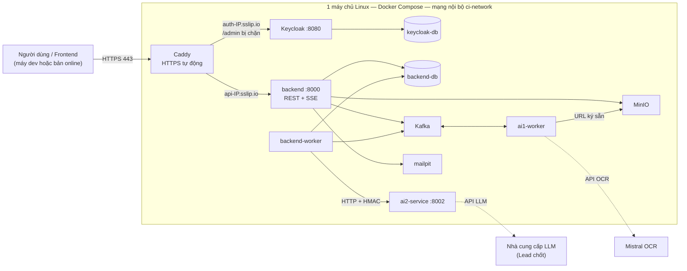

# DOC-12 · Kế hoạch triển khai backend online

> **Contract Intelligence** — Đưa toàn bộ service lên một máy chủ online để demo và để frontend, AI1, AI2 dùng chung. Tài liệu này xin mentor duyệt trước khi triển khai.

---

## 0. Thông tin

| Trường | Nội dung |
|---|---|
| Mã tài liệu | DOC-12 — Kế hoạch triển khai backend online |
| Ngày viết | 29/09/2026 |
| Người viết | Phạm Hoàng Chương (Backend) |
| Trạng thái | **Chờ mentor duyệt** |
| Căn cứ | Nhận xét mentor 29/09 (DOC-11 §1 dòng 4, 5, 8, 10, 11), DOC-11 §4.2 #13 |
| Mã nguồn | `develop` @ `297d03b` (đã merge PR #28). Cấu hình ở thư mục `deploy/` |

Kế hoạch **không đổi MVP và không đổi luồng kỹ thuật đã chốt**:

- Đăng nhập Keycloak.
- AI1 nhận lệnh và trả kết quả qua Kafka.
- Backend gọi AI2 qua HTTP.
- Dữ liệu nghiệp vụ nằm ở PostgreSQL, file nằm ở MinIO.

Chỉ thêm một lớp HTTPS phía trước và siết cấu hình cho môi trường có người ngoài truy cập.

---

## 1. Mục tiêu và phạm vi

| Mentor yêu cầu (DOC-11 §1) | Cách đáp ứng trong kế hoạch này |
|---|---|
| #10 Bản online đủ service, cổng AI2 không mở ra Internet | 12 container trên một máy. Chỉ cổng 80/443 (Caddy) mở ra ngoài. AI2 chỉ nghe trong mạng nội bộ |
| #8 Mật khẩu người dùng lưu ở đâu | Chỉ ở Keycloak. Backend không có cột mật khẩu. Tài khoản demo đổi mật khẩu khi triển khai (§4) |
| #4 Một database | Dữ liệu nghiệp vụ của backend ở PostgreSQL. **AI2 còn SQLite**, việc chuyển thuộc Văn Dũng ở Sprint 3 (§8) |
| #5 Image không nhét dữ liệu chạy thử | Backend và AI1 build từ git, không mang `data/`. **Image AI2 còn copy `data/`**, cần `.dockerignore` của Văn Dũng trước khi deploy (§8) |
| #11 Test file 50 MB và PDF ~200 trang | Chạy trên máy chủ sau khi AI1 upload kết quả OCR qua MinIO (§6, bước 5.3) |

Ngoài phạm vi: nhiều máy / tự co giãn, domain riêng, giám sát chuyên dụng. Ghi ở §9 là việc sau MVP.

---

## 2. Kiến trúc triển khai

| Service | Ra Internet | Ghi chú |
|---|---|---|
| Caddy | **Có: 80, 443** | Tự lấy và gia hạn chứng chỉ Let's Encrypt |
| backend | Qua Caddy: `https://api-<ip>.sslip.io` | API cho frontend, `/docs`, SSE tiến độ |
| Keycloak | Qua Caddy: `https://auth-<ip>.sslip.io` | Trang đăng nhập, OIDC. **`/admin` trả 404**, quản trị qua SSH tunnel |
| backend-worker, ai1-worker, ai2-service | Không | AI1 ↔ backend qua Kafka. Backend → AI2 qua HTTP nội bộ có chữ ký HMAC |
| backend-db, keycloak-db, Kafka, MinIO, mailpit | Không | Chỉ trong mạng Docker |

`sslip.io` phân giải `api-1-2-3-4.sslip.io` thành `1.2.3.4`, nên có HTTPS thật mà không cần mua domain. Muốn đổi sang domain riêng thì chỉ sửa 2 biến `API_HOST`, `AUTH_HOST`.

---

## 3. Yêu cầu hạ tầng

| Hạng mục | Tối thiểu | Khuyên dùng | Ghi chú |
|---|---|---|---|
| Máy chủ | 4 vCPU, 8 GB RAM, 60 GB SSD | 4–8 vCPU, 16 GB RAM, 100 GB SSD | Ubuntu 22.04/24.04 hoặc Debian 12. Dưới 16 GB RAM thì `bootstrap.sh` tự thêm 4 GB swap |
| Mạng | IPv4 công khai, mở 22/80/443 | | Firewall `ufw` chỉ mở 3 cổng này |
| Mistral API key | Có | | AI1 OCR. Có trần chi tiêu |
| LLM API key cho AI2 | Có | | Lead chốt nhà cung cấp, người giữ key và trần chi tiêu (DOC-11 hạn 30/09). Không demo trên gói miễn phí |
| SMTP thật | Không bắt buộc | Nên có khi mời người ngoài nhóm | Chưa có thì thư mời và đặt lại mật khẩu vào mailpit, đọc qua SSH tunnel |

RAM **ước tính** theo cấu hình hiện tại, chưa đo trên máy thật:

| Service | Ước tính |
|---|---|
| Keycloak | ~0,7–1 GB |
| Kafka | ~0,8 GB (heap giới hạn 512 MB) |
| 2 PostgreSQL | ~0,5 GB |
| backend + worker | ~0,6 GB |
| AI2 | ~0,5–1 GB |
| AI1 | ~1–2 GB lúc render trang 150 DPI |
| MinIO, Caddy, mailpit | ~0,4 GB |
| **Tổng** | **~5–7 GB** |

Tổng này là lý do đặt mức tối thiểu 8 GB. Số đo thật sẽ ghi vào mục 6 sau lần triển khai đầu.

---

## 4. Bảo mật

| Rủi ro | Biện pháp đã có trong `deploy/` |
|---|---|
| Lộ cổng nội bộ (DB, Kafka, MinIO, AI2) | `compose.prod.yml` gỡ mọi cổng publish, chỉ Caddy mở 80/443. `deploy.sh` tự kiểm tra cổng 8002 đóng từ bên ngoài |
| Mật khẩu và secret mặc định trong repo | `bootstrap.sh` sinh 10 secret ngẫu nhiên (48 ký tự hex) vào `deploy/.env.prod` (quyền 600, không commit). Compose từ chối chạy nếu thiếu secret |
| 3 tài khoản demo có mật khẩu công khai trong `realm-export.json` | `keycloak_configure.py` đặt mật khẩu mới cho cả 3 khi triển khai, rồi gửi riêng cho nhóm |
| Secret client backend là giá trị dev | Được thay bằng secret sinh ngẫu nhiên |
| Dò mật khẩu trên trang đăng nhập công khai | Bật chống dò: khoá tạm sau 5 lần sai, tăng dần tới 15 phút |
| Trang quản trị Keycloak | `/admin` bị chặn ở Caddy. Chỉ vào qua SSH tunnel |
| Dữ liệu ngoài quyền | Bộ test M-07 trên 31 endpoint: **0/132 request lộ dữ liệu** (PR #28). Chia sẻ có `read`/`edit` và hạn dùng |
| Nghe lén | HTTPS ở ngoài. Nội bộ là mạng Docker riêng. Backend → AI2 ký HMAC. AI1 đọc và ghi file qua URL ký sẵn có hạn |
| Đầy đĩa vì log | Docker xoay vòng log 5 × 20 MB mỗi container |
| Mất dữ liệu | `backup.sh`: dump 2 DB + sao chép MinIO mỗi đêm, giữ 7 ngày. Backup thêm trước mỗi lần cập nhật |

Mật khẩu người dùng chỉ nằm trong database của Keycloak (`keycloak-db`). Backend chỉ giữ email, tên, vai trò (bảng `app_user` đã bỏ `password_hash` ở migration `v3__keycloak_sso_refactor`).

---

## 5. Các bước triển khai

| # | Bước | Người làm | Kết quả kiểm tra |
|---|---|---|---|
| 5.1 | Lead chốt máy chủ, LLM provider, người giữ key, trần chi tiêu | Trang | Có IP, quyền SSH cho Chương, 2 API key |
| 5.2 | Văn Dũng thêm `.dockerignore` cho AI2 (không đóng gói `data/`) | Văn Dũng | `docker image` của AI2 không chứa `runs.sqlite` |
| 5.3 | Clone repo vào `/opt/contract-intelligence`, checkout tag `deploy-2026MMDD-1` từ `develop` | Chương | `git describe` đúng tag |
| 5.4 | `sudo deploy/bootstrap.sh` | Chương | Docker, firewall 22/80/443, swap, `deploy/.env.prod` có secret |
| 5.5 | Điền `AI2_LLM_*` trong `deploy/.env.prod`, `MISTRAL_API_KEY` trong `ai-service/.env` | Chương + người giữ key | Không key nào nằm trong git |
| 5.6 | `sudo deploy/deploy.sh` | Chương | Build, chạy, migrate DB tới v16, cấu hình Keycloak. Smoke test qua (mục 6, nhóm A) |
| 5.7 | Gửi nhóm: 4 biến `VITE_*`, mật khẩu demo (kênh riêng) | Chương | Frontend trên máy dev đăng nhập được vào server |
| 5.8 | Chạy kiểm thử nghiệm thu (mục 6, nhóm B, C) | Cả nhóm | Bảng mục 6 điền đủ số đo |
| 5.9 | Bật cron backup, thử khôi phục một lần | Chương | Có bản backup và khôi phục được vào DB tạm |
| 5.10 | Báo mentor kết quả + link | Trang | |

Thời gian dự kiến cho 5.3–5.7 khoảng 2 giờ khi đã có máy và key. Build image lần đầu chiếm phần lớn thời gian.

---

## 6. Tiêu chí nghiệm thu

**A. Tự động trong `deploy.sh`:**

| Kiểm tra | Mong đợi |
|---|---|
| `GET https://api-…/health` | `{"status":"ok"}` |
| OIDC issuer | `https://auth-…/realms/contract-intelligence` |
| `https://auth-…/admin/…` | 404 |
| `http://<ip>:8002` từ ngoài | Không kết nối được |

**B. Luồng MVP trên server (tay, có người ghi lại):**

| # | Bước | Mong đợi |
|---|---|---|
| B1 | Đăng nhập bằng tài khoản demo operator | Vào được, token có vai trò OPERATOR |
| B2 | Tạo hồ sơ với PDF 20 trang | 202. Màn tiến độ nhận sự kiện SSE, không hỏi lại định kỳ |
| B3 | OCR xong → cấu trúc → xung đột | Job tới `pending_review`, không kẹt `processing` |
| B4 | Thẩm định bởi reviewer (được chia sẻ `edit`) | Ghi được. Người được chia sẻ `read` nhận 403 khi sửa |
| B5 | Hỏi đáp có trích dẫn | Trả lời có citation. Người ngoài quyền nhận 403 |
| B6 | Chia sẻ có hạn, chờ quá hạn | Người được chia sẻ mất quyền (403, biến khỏi danh sách) |

**C. Tải và lỗi (Sprint 3, ghi số đo):**

| # | Kiểm tra | Mong đợi | Phụ thuộc |
|---|---|---|---|
| C1 | File ~50 MB | Upload nhận (≤ 50 MB/file), OCR xong hoặc lỗi có mã, không treo | |
| C2 | PDF ~200 trang | Kết quả OCR qua MinIO, message Kafka vài KB | AI1 làm phía upload `result_ref` (DOC-05d §5) |
| C3 | Tắt AI1 giữa chừng | Job `failed` với `AI1_TIMEOUT` sau hạn theo số trang | |
| C4 | Restart `backend-worker` khi đang xử lý | Không xử lý trùng, không mất job | |
| C5 | RAM/CPU lúc chạy C1, C2 | Ghi số đo thật, thay bảng ước tính ở mục 3 | |

---

## 7. Vận hành, cập nhật, quay lại bản cũ

**Cập nhật bản mới:**

1. Merge vào `develop`, CI xanh.
2. Gắn tag `deploy-YYYYMMDD-N`.
3. Trên server: `sudo deploy/backup.sh`.
4. `git fetch && git checkout <tag>`.
5. `sudo deploy/deploy.sh`.

Mỗi lần cập nhật báo trước trong nhóm. Không cập nhật trong lúc mentor đang xem demo.

**Quay lại bản cũ:**

1. `git checkout <tag trước>`.
2. `sudo deploy/deploy.sh`.
3. Nếu bản lỗi đã chạy migration mới thì khôi phục DB từ bản backup trước lần cập nhật đó (`pg_restore`, lệnh trong `deploy/README.md`). Migration chỉ chạy tiến, nên backup trước mỗi lần cập nhật là bắt buộc.

**Hằng ngày:**

- `docker compose … ps` xem sức khoẻ; container lỗi tự khởi động lại (`restart: unless-stopped`).
- Log ở `docker compose … logs`.
- Backup 02:00 mỗi đêm.

**Người chịu trách nhiệm:**

| Việc | Người |
|---|---|
| Máy chủ, deploy, backup | Chương |
| Key AI1 | Đức Dũng |
| Key AI2 | Văn Dũng / người Lead chỉ định |
| Quyết định cập nhật trước demo | Trang |

---

## 8. Rủi ro và phương án

| Rủi ro | Khả năng | Ảnh hưởng | Phương án |
|---|---|---|---|
| Hết quota LLM/OCR giữa demo (đã gặp 429 ngày 29/09) | Trung bình | Job lỗi | Trần chi tiêu + key trả phí. Backend thử lại lỗi tạm có trần. Tách mã `RATE_LIMITED`/`UNAVAILABLE` ở Sprint 3 (DOC-11 #6) |
| PDF > ~144 trang vượt trần Kafka 10 MB | Cao với file lớn | OCR không về backend, job `AI1_TIMEOUT` | Backend đã sẵn nhận kết quả qua MinIO. Chờ AI1 làm phía upload. Trước đó giới hạn demo ≤ 100 trang |
| Thiếu RAM | Trung bình ở máy 8 GB | Container bị kill | Swap 4 GB, heap Kafka 512 MB. Đo ở C5, nâng máy nếu cần |
| AI2 còn SQLite, image còn `data/` | Chắc chắn tới khi Văn Dũng xong | Mentor #4, #5 chưa đạt đủ | Bước 5.2 bắt buộc trước deploy. SQLite AI2 để trong volume `ai2_data`. Chuyển PostgreSQL ở Sprint 3 |
| Kafka không lưu ra đĩa | Thấp | Restart mất message đang bay | Watchdog fail run với mã lỗi, người dùng chạy lại. Không mất dữ liệu đã lưu |
| Máy chủ hỏng hoặc mất dữ liệu | Thấp | Mất hồ sơ | Backup đêm, thử khôi phục ở bước 5.9. Nên chép backup ra ngoài máy (việc sau) |
| Let's Encrypt giới hạn số lần cấp | Thấp | Chưa có HTTPS vài giờ | Không xoá volume `caddy_data` khi deploy lại |

---

## 9. Cần mentor / Lead quyết

| # | Câu hỏi | Đề xuất của backend |
|---|---|---|
| 1 | Duyệt kiến trúc 1 máy + Docker Compose + Caddy cho bản online MVP | Duyệt. Đủ cho demo và thử nghiệm của nhóm, ít thay đổi so với môi trường dev |
| 2 | Máy chủ ở đâu, ai trả chi phí | Lead chốt. Cấu hình theo mục 3 |
| 3 | LLM provider, người giữ key, trần chi tiêu | Lead chốt trước 30/09 (DOC-11) |
| 4 | Dùng `sslip.io` hay cần domain riêng | `sslip.io` cho MVP. Đổi domain chỉ sửa 2 biến |
| 5 | Có cần SMTP thật cho bản online không | Chưa cần khi chỉ nhóm dùng. Cần khi mời người ngoài |
| 6 | Dữ liệu thử trên server: được dùng hợp đồng thật không | Chỉ dùng hợp đồng mẫu đã ẩn thông tin, theo quy định không commit dữ liệu hợp đồng |

Việc sau MVP (không làm trong đợt này):

- Domain riêng.
- Giám sát và cảnh báo.
- Backup ra ngoài máy.
- Tách DB sang dịch vụ quản lý.
- Nhiều máy.

---

## 10. Lịch dự kiến

| Ngày | Việc |
|---|---|
| 29/09 | Gửi DOC-12 cho mentor |
| 30/09 | Mentor phản hồi. Lead chốt máy, LLM, key (bước 5.1). Văn Dũng xong `.dockerignore` (5.2) |
| 30/09 – 01/10 | Triển khai (5.3–5.7), nhóm A, B |
| 01/10 | Frontend nối server. Nghiệm thu nhóm B cùng cả nhóm |
| 02/10 | Đóng băng code nếu demo Sprint 2 đúng lịch (DOC-11). Demo trên bản online |
| Sprint 3 (05/10 – 18/10) | Nhóm C sau khi AI1 upload kết quả OCR qua MinIO. Ghi số đo vào DOC-06 |

---

**Hết DOC-12 · Kế hoạch triển khai backend online**
