# IDP OCR + Optimization Pipeline

```mermaid
flowchart LR
    U[Operator / Reviewer] --> API[Spring Boot API<br/>RBAC · Dossier · Run]
    API --> OS[(Object Storage<br/>source · render · artifacts)]
    API --> Q[(PostgreSQL<br/>task queue · audit · config)]

    Q --> W[Python Worker]
    OS --> W

    subgraph DP["Production Data Plane"]
        W --> S1[S1 Classify]
        S1 --> S2[S2 Render + CPS]
        S2 --> S3[S3 Preprocess]
        S3 --> S4[S4 Native / Local OCR]
        S4 --> S5[S5 Layout + Table]
        S5 --> V[Snapshot Validator<br/>digest · span · bbox]
        V --> S6[S6 Clause structure]
        S6 --> S7[S7 Facts + Citations]
        S7 --> S8[S8 Annex linking]
        S8 --> S9[S9 Context gate + Compare]
        S9 --> S10[S10 HITL queues]
    end

    S10 --> C[Conflict]
    S10 --> NE[Needs evidence]
    S10 --> NC[Not comparable]
    C --> R[Append-only Review Revision]
    NE --> R
    NC --> R
    R --> API

    subgraph OP["Optimization Plane — tách biệt production"]
        CR[Config Registry<br/>immutable config bundle]
        DS[DEV Dataset + Gold Registry]
        EH[Experiment Harness<br/>EVAL queue riêng]
        ME[Metric Engine<br/>evidence-first scorecard]
        OA[Optimizer Sandbox<br/>typed candidate only]
        SE[Sealed Holdout Evaluator]
        PG[Human Promotion Gate]
        RB[Config Binding<br/>shadow → canary → active]

        CR --> EH
        DS --> EH
        EH --> ME
        ME --> OA
        OA --> CR
        EH --> SE
        SE --> PG
        PG --> RB
    end

    RB --> API

    EB[Egress Broker<br/>one-time grant · budget · policy]
    W -. external route approved only .-> EB
    EB -. allowed provider/model/region only .-> EXT[External OCR / LLM]

    style DP fill:#eaf7ee,stroke:#31945b
    style OP fill:#edf5ff,stroke:#4c81b8
    style C fill:#fff1f1,stroke:#c34c4c
    style NE fill:#fff8e1,stroke:#c89820
```

## Cách đọc sơ đồ

- **Production Data Plane** xử lý dossier thật, tạo evidence bất biến và chỉ đưa kết quả sang HITL.
- **Optimization Plane** chỉ thử nghiệm immutable config trên dataset được phép; agent không thể tự deploy production.
- Config chỉ được route vào run mới sau sealed evaluation, phê duyệt của con người, shadow và canary.
- External OCR/LLM chỉ được gọi qua Egress Broker khi policy, consent, budget, provider, region và config đều hợp lệ.
