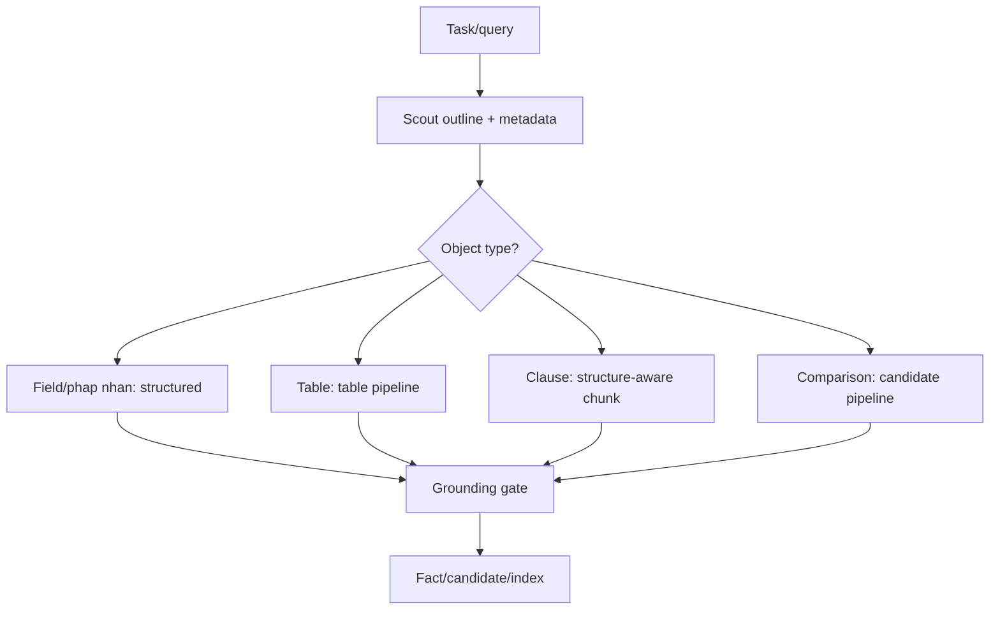
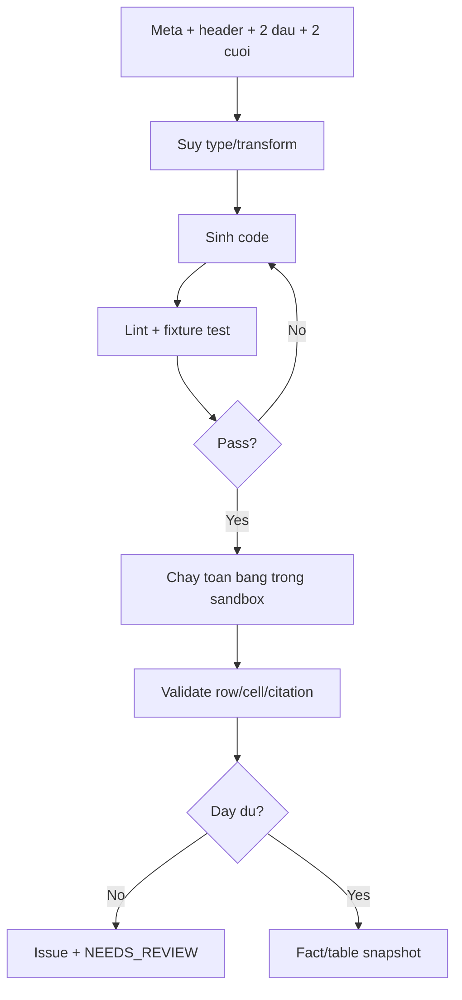
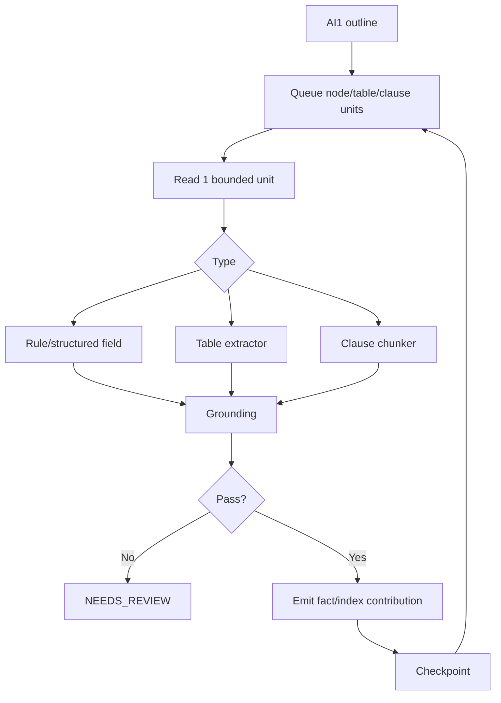
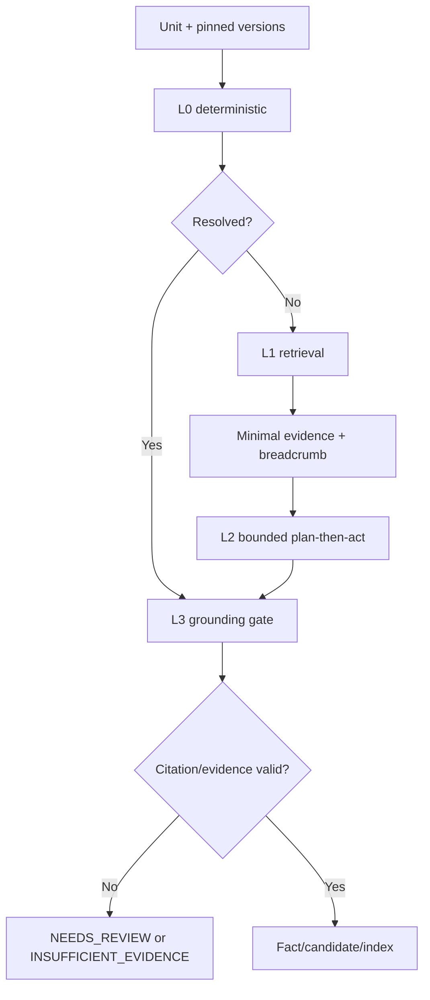

# AI2-02 — Extraction Engine Design

**Phiên bản:** v0.1 (Draft)  
**Ngày:** 19/09/2026  
**Phạm vi:** Fact extraction, candidate comparison, retrieval và bounded reasoning sau AI1.

## Nguồn yêu cầu

- [DOC-01 — Product Vision](../DOC-01-product-vision.md)
- [DOC-02 — BRD](../DOC-02-brd.md)
- [DOC-04 — Architecture](../DOC-04-architecture.md)

> Ba file trên là nguồn yêu cầu duy nhất. Các external reference cuối tài liệu chỉ là tham khảo thiết kế.

## §1 — PRD ngắn của AI2

### 1.1 Scope

AI2 nhận snapshot có cấu trúc từ AI1 và tạo `Fact`, `Candidate`, chunk/index contribution và grounded query result. Mục tiêu là findability, evidence và bounded free-form Q&A; AI2 không phải chatbot không giới hạn, legal advisor hoặc hệ thống tự quyết hiệu lực pháp lý.

### 1.2 Functional requirements

| ID | Requirement | Nguồn |
|---|---|---|
| FR-AI2-01 | Trích fact typed value, context và citation; không evidence thì không publish. | BR-FUN-013/014, BR-RUL-005 |
| FR-AI2-02 | Giữ `StructuralNode`, table/row/cell và label gốc. | BR-FUN-005/006 |
| FR-AI2-03 | Tạo candidate có evidence hai phía, không legal conclusion. | BR-FUN-015, BR-RUL-004 |
| FR-AI2-04 | Đóng góp keyword/structured/semantic index theo version. | BR-FUN-022/023 |
| FR-AI2-05 | Route exact → structured → semantic → bounded reasoning cho cả câu hỏi tự do, trả status/citation. | BR-FUN-009..013 |
| FR-AI2-06 | Tách `INSUFFICIENT_EVIDENCE` và `NEEDS_REVIEW`. | BR-FUN-014, BR-RUL-003/011 |

### 1.3 Non-goals và ownership

AI2 không direct-edit value, reject/request-evidence workflow, auto-retrain, precedence/hiệu lực pháp lý, tự publish index active hoặc ghi business table trực tiếp.

- **AI1:** page processing, OCR/layout, reconstruction.
- **AI2:** fact, candidate, comparison, bounded retrieval/reasoning.
- **BE:** persistence, state transition, tenant/ACL, lifecycle và publish gate.

AI2 dùng cùng source ID, page revision, citation và bbox convention; không tự lọc tenant thay server hoặc bypass publish gate.

### 1.4 Acceptance và open decisions

Acceptance chính: AC-004/011, AC-005..010, AC-015/016, AC-018, AC-031. Tên enum comparison, canonical taxonomy/profile, model provider và quality thresholds là open decisions; không tự đặt numeric target trước baseline.

### 1.5 Mục tiêu mở rộng đã khóa [2026-09-23]

Wave đầu gồm `SALES`, `SUPPLY_SERVICE`, `LEASE`, `CONSTRUCTION_WORK`,
`EMPLOYMENT` và `NDA`, cùng các profile extension cho phụ lục giá/số lượng/kỹ
thuật/tiến độ/SLA/thanh toán/nghiệm thu/điều chỉnh. Mỗi profile có version, field
key, alias, normalization rule và evidence policy; profile không xác định không
được ép vào field của loại khác.

AI2 phải dựng cây body/annex/clause/table có parent/order/scope, relation graph có
citation và comparison theo `WITHIN_DOCUMENT`, `CONTRACT_ANNEX`, `ANNEX_ANNEX`.
Người dùng được hỏi tự do trong dossier scope; query phải đi qua bounded retrieval
và L3 grounding. Thiếu source hoặc relation không resolve được trả
`INSUFFICIENT_EVIDENCE`/`NEEDS_REVIEW`.

95 case hiện chỉ là candidate corpus `UNVERIFIED`. Không dùng chúng làm ground
truth nếu chưa có human review; không claim business accuracy trước golden set.

## §2 — Thiết kế sâu

### 2.1 AI1 → AI2 handoff

AI2 không nhận raw PDF như context reasoning. AI2 nhận:

- `PageSnapshot`: text, block, bbox, dimensions, rotation, coverage, quality, provenance;
- `StructuralNode`: type, raw label, parent/order, page range, source blocks, status;
- table snapshot: title, header, row/cell, continuation, row identity, subtotal/footnote và issue;
- source/OCR/reconstruction/profile/policy/model version pins;
- explicit `PARTIAL`, `FAILED`, `UNKNOWN`, `NEEDS_REVIEW` state.

Logical handoff:

```json
{
  "tenant_id": "tenant_001",
  "dossier_id": "dossier_001",
  "version_pins": {
    "manifest_version": 2,
    "source_snapshot_digest": "sha256:...",
    "tenant_profile_version": 5,
    "policy_version": 2,
    "ocr_run_version": 3,
    "reconstruction_version": 2,
    "extraction_version": 7
  },
  "page": {
    "page_revision_id": "page_10_rev_2",
    "quality": "OK",
    "coverage": 0.98,
    "rotation": 0,
    "source_block_ids": ["p10_b18"]
  },
  "node": {
    "node_id": "node_5_3",
    "type": "CLAUSE",
    "raw_label": "Điều 5.3",
    "parent_id": "node_5",
    "status": "CONFIRMED"
  }
}
```

Thiếu pin hoặc lifecycle không hợp lệ thì AI2 trả `BLOCKED`; source span, parent relation, page quality/coverage hoặc table cell/continuation signal không đủ thì trả `NEEDS_REVIEW`, không đoán.

### 2.2 Router và tool-calling



Tool surface là logical interface:

```text
list_structure(dossier_id)
  -> node_id, type, raw_label, parent, order, has_children
get_node(node_id)
  -> bounded text, page range, ancestors, citation
list_tables(dossier_id)
  -> table_id, title, row_count, column_count
get_table_meta(table_id)
  -> headers, row_count, column_count, first_rows[2], last_rows[2]
get_table_rows(table_id, start, end)
  -> bounded row slice with row/cell citations
search_structured(key, filters)
  -> field/node/value/citation
search_semantic(query, k)
  -> chunk/node/score/citation
run_code(code, table_id)
  -> sandboxed result, validation errors, output citations
```

Tool trả ID/metadata trước; payload chỉ lấy khi cần. Tool phải kiểm tenant/dossier ACL, lifecycle và version pin trước khi trả data.

### 2.3 Bảng dài và code generation

Với bảng 300 dòng × 4 cột:

1. Lấy metadata, header, 2 dòng đầu, 2 dòng cuối và row count.
2. Suy schema, column type, unit/currency và transform rule từ mẫu nhỏ.
3. Sinh parser/transform code một lần.
4. Lint/test trong sandbox; sửa có giới hạn.
5. Chạy deterministic trên toàn bộ row bằng decimal-safe representation.
6. Validate row count, missing cell, duplicate key, subtotal và citation.
7. Cache code theo schema/profile version.



Không nối hai bảng chỉ vì cùng số cột. Cần title/header, page adjacency, column alignment, unit/currency, row identity, repeated header và incomplete-row signal. Header kế thừa phải trỏ về header nguồn thật.

### 2.4 Điều khoản dài, structure và RAG

Detect/count clause từ `StructuralNode`, giữ raw label và parent/order. Không split mù theo character hoặc dấu chấm. Chunk theo clause/topic, bullet/level và page boundary; sentence boundary chỉ là fallback.

Mỗi chunk giữ `chunk_id`, parent node/table, page range, source block IDs, text span/bbox fragments, ancestor breadcrumb, continuation flag và index/embedding version. Overlap chỉ là context; dedupe fact theo source/context key. Exact/structured retrieval luôn trước semantic. Semantic/vector chỉ là lớp recall tuỳ chọn: AI2 dò model embedding trên NineRouter, batch theo segment, cache theo snapshot/model/dimension; kết quả phải qua filter tenant/dossier/source-role, kiểm tra node + span/citation rồi mới được đưa vào context. Không có model, egress hoặc citation hợp lệ thì fallback deterministic và có thể trả `INSUFFICIENT_EVIDENCE`/`NEEDS_REVIEW`.

### 2.5 Token/output budget

32k output không phải lý do để gửi cả tài liệu. AI2:

- xử lý build-time theo unit độc lập;
- giới hạn input bằng bounded context + ancestor breadcrumb;
- emit fact theo unit;
- trả result theo page/chunk/table slice;
- checkpoint sau mỗi unit;
- dừng khi vượt token/cost budget với trạng thái rõ;
- ghi mode, version và usage vào QueryTrace.

### 2.6 Fact và candidate schema

```json
{
  "fact_id": "f_001",
  "raw_value": "1.000.000",
  "normalized_value": "1000000",
  "subject": "Bên Bán",
  "role": "SELLER",
  "unit": "VND",
  "currency": "VND",
  "vat_basis": "EXCL_VAT",
  "condition": "qty < 1000",
  "scope": "region_A",
  "validity": "from_signing_plus_30d",
  "citation": {
    "node_id": "node_5_3",
    "page_revision_id": "page_10_rev_2",
    "bbox": [0.08, 0.51, 0.91, 0.63],
    "text_span": "1.000.000"
  },
  "provenance": "OCR",
  "review_state": "NEEDS_REVIEW"
}
```

```json
{
  "candidate_id": "c_001",
  "left_id": "f_001",
  "right_id": "f_042",
  "finding_type": "COMPARABLE_DIFFERENCE",
  "model_disposition": "UNCLEAR",
  "review_state": "NEEDS_REVIEW",
  "evidence_left": [{"node_id": "node_5_3", "page_revision_id": "page_10_rev_2", "bbox": [], "text_span": "1.000.000"}],
  "evidence_right": [{"node_id": "node_8_2", "page_revision_id": "page_20_rev_1", "bbox": [], "text_span": "1.100.000"}],
  "disposition": "COMPARABLE_DIFFERENCE",
  "reason": "..."
}
```

Không có source thì không publish fact. Không pair nếu subject/role/unit/scope/validity chưa tương thích. Candidate là technical finding, không legal conclusion.

### 2.7 Failure boundary

| Vướng mắc | Hướng xử lý AI2 |
|---|---|
| Context quá lớn | Scout → retrieve → read bounded unit |
| Model quên context | Ancestor breadcrumb + task state nhỏ |
| Bảng thiếu dòng/cell | Issue, partial state, `NEEDS_REVIEW`; không đoán tổng |
| OCR nhiễu | Giữ raw, coverage gate, citation audit |
| Confidence cao nhưng sai | Grounding + gold evaluation |
| Relation không rõ | `UNKNOWN/NEEDS_REVIEW`, không suy filename |
| Candidate mơ hồ | Evidence hai phía + reviewer |
| Agent không biết đọc đâu | Allowlisted tools + address-passing |

### 2.8 Case study: hợp đồng 50+ trang / 500k ký tự

AI2 làm như người rà hợp đồng: nhìn outline, tìm đúng mục, đọc phần liên quan, trích fact và ghi nguồn.



Build-time không nạp 50 trang một lần; unit lỗi không làm mất artifact hợp lệ của unit khác. Query-time route exact → structured → semantic → bounded reasoning. Thiếu evidence trả `INSUFFICIENT_EVIDENCE`, không resend toàn PDF.

### 2.9 Reasoning 4 lớp



- **L0:** typed rules, structured lookup, table code.
- **L1:** exact → structured → semantic; optional rerank.
- **L2:** model lập kế hoạch nhỏ, gọi tool allowlist, mỗi task một unit.
- **L3:** resolve span/bbox, kiểm ACL/version/context, tách result/review state.

### 2.10 Kiến trúc tham khảo ngoài

Đây là external design reference, không phải requirement:

- Agentic PDF: search-first/read-later, outline trước, address-passing, cache theo source digest + extraction version.
- Table: weak-to-strong type inference, generic extraction rồi deterministic mapping, lint/test/self-repair và cache code.
- Retrieval: hybrid BM25+dense, RRF/rerank là lựa chọn cần benchmark; structure-aware chunk là mặc định; GraphRAG chỉ cân nhắc cho amendment multi-hop.
- Grounding: schema-constrained output chỉ bảo đảm format; anchor-first và extract-then-restore cần được dùng để kiểm value/citation.

Không tự chốt model/provider.

### 2.11 Đánh giá chiều sâu 12 bánh răng

| Gear | Verdict | Guardrail | Lớp |
|---|---|---|---|
| G1 Intake/normalize | Cần reading-order và trust flag | Raw immutable | L0 |
| G2 Reasoning loop | Plan-execute workflow dài; ReAct trong unit | Cap step/retry/replan, loop detect | L2 |
| G3 Fact | Cần anchor/restore | Không restore thì không publish | L3 |
| G4 Table | Hướng đủ, cần fixture | Sandbox, decimal-safe, cache | L0 |
| G5 Clause | Cần legal-aware segmentation | Giữ raw span/parent | L0/L1 |
| G6 Comparison | Segment → align → classify changed unit | Không precedence/LEGAL_WINNER | L1/L3 |
| G7 Entity | Blocking → field scoring → adjudication | Link, không merge khi MST mâu thuẫn | L0/L2 |
| G8 Embedding/rerank | Open decision | Pin model/version, benchmark VN/EN | L1 |
| G9 Query | Route đủ | ACL trước retrieval | L1 |
| G10 Grounding | Gate bắt buộc | Citation bắt buộc | L3 |
| G11 Cost/idempotency | Cần checkpoint/resume | Lease/fencing/bounded retry | L0/L2 |
| G12 Evaluation | Frozen task set + verifier | `n`, denominator, version | Tất cả |

## §3 — Evaluation

Metrics AI2: structural mapping coverage, table/row/cell correctness, citation correctness theo document/page/span/bbox, Recall@k riêng exact/structured/semantic, reviewer escalation/`NEEDS_REVIEW`, cost per query/run và cache hit rate khi có ledger.

Protocol phải có ground truth độc lập, `n`, denominator, sample, version, missing/failed/not-run. Không dùng model confidence thay accuracy. Chưa có baseline thì không đặt numeric target.

Fixture bắt buộc gồm table nhiều trang, header kế thừa, row bị cắt, duplicate row key, missing middle, subtotal, footnote, numbered/unnumbered structure, scan quality thấp, insufficient evidence và negative ACL access.

## Appendix A — Edge-case register

Mỗi case ghi: triệu chứng → gear/layer → hướng xử lý → kết quả → acceptance.

### A. Contract, structure và clause

1. **Hợp đồng dài:** outline, unit queue, bounded context, checkpoint; AC-004..007/031.
2. **Điều khoản dài:** split theo node/bullet/level, giữ parent/page/span; AC-004/007.
3. **Không đánh số:** `UNNUMBERED_BLOCK`, giữ raw label; AC-004/011.
4. **Trùng số điều:** node ID riêng theo document/parent; không merge.
5. **Nhảy số:** issue gap, không tự tạo điều khoản.
6. **Đánh số hỗn hợp:** giữ level/parent, không ép scheme.
7. **Header/footer giữa điều:** dùng reconstruction/source block, không nối mù.
8. **Định nghĩa dùng nơi khác:** index definition và đưa definition liên quan làm breadcrumb.
9. **Tham chiếu điều/phụ lục:** resolve node/relation; thiếu target → insufficient.

### B. Table

10. **Bảng 300 dòng:** meta + mẫu hai đầu, sinh code, chạy deterministic.
11. **Bảng hai trang:** continuation/header/row identity; thiếu cell → issue.
12. **Subtotal/footnote:** tách boundary; không cộng subtotal như total.
13. **Merged cell:** cần span signal, derived context trỏ cell nguồn.
14. **Header hai tầng:** giữ raw parent/child header path.
15. **Empty/dash/N/A/zero:** sentinel khác nhau; missing không phải zero.
16. **`1.234`/`1,234`/ngoặc âm:** suy format từ mẫu + unit; raw/normalized riêng.
17. **Hai bảng cùng số cột:** cần title/header/page/row evidence.
18. **Một cell bị OCR tách thành nhiều row:** dùng boundary signal; mơ hồ → review.
19. **Landscape/rotation:** dùng page transform/rotation; bbox pin page revision.

### C. Fact/entity

20. **MST/pháp nhân lặp hoặc lệch:** giữ từng fact/citation; candidate, không tự chọn.
21. **Số bằng chữ khác số:** parse hai anchor; lệch → review.
22. **Ngày tương đối:** giữ raw/validity; thiếu mốc không bịa.
23. **Giá trị bậc thang:** giữ condition/scope; không flatten.
24. **USD và VND:** không tự quy đổi; khác currency/scope → not comparable.
25. **Alias tenant:** dùng TenantProfile pin; thiếu field → unknown.
26. **Tên gần giống, MST khác:** blocking + scoring; link candidate, không merge.

### D. Candidate/amendment

27. **Body/table/annex mâu thuẫn:** pair khi context tương thích; evidence hai phía.
28. **Implicit amendment:** candidate chỉ khi subject/scope/effective context đủ rõ.
29. **Nhiều annex cùng sửa:** hiển thị chain/uncertainty; không precedence.
30. **Khác scope:** `NOT_COMPARABLE`, không gọi conflict.
31. **Song ngữ lệch nghĩa:** giữ hai span/ngôn ngữ; semantic candidate.
32. **Cosmetic/substantive:** align deterministic trước; LLM chỉ classify unit đổi.
33. **Defined-term cascade:** trace dependency làm candidate review, không legal winner.

### E. Retrieval/reasoning

34. **Aggregation nhiều nguồn:** retrieve từng mảnh; thiếu mảnh → insufficient.
35. **Prompt injection trong PDF:** PDF untrusted; chỉ tool allowlist.
36. **Index processing/failed:** dùng active index cũ.
37. **Query EN, document VI:** cross-lingual semantic có citation.
38. **Overlap duplicate:** dedupe theo source/context key.
39. **Confidence cao nhưng sai:** grounding + gold evaluation.
40. **Boundary ambiguous:** bounded classifier; không resolve → review.

### F. Scan/input

41. **Skew/watermark/con dấu:** quality/coverage flag; không đoán.
42. **Chữ ký che số:** partial evidence + issue.
43. **Scan quality không đều:** per-page processing, không bỏ denominator.
44. **Dấu tiếng Việt/OCR sai:** raw/normalized riêng, citation audit.
45. **Encrypted/corrupt/empty PDF:** lỗi input rõ; empty không phải success.
46. **Trang trắng/ảnh không chữ:** giữ inventory; không tạo fact.
47. **File vượt budget:** dừng có kiểm soát; trả partial/policy error.

### G. Scale/version/security

48. **Nhiều annex nổ unit:** queue/checkpoint/incremental.
49. **Rerun đồng thời:** lease/idempotency/fencing; worker cũ không publish.
50. **Embedding cost lớn:** dedupe/cache/quota trước provider.
51. **Profile đổi:** run/version mới, giữ output cũ.
52. **Re-OCR một page:** citation pin page revision; review cũ stale.
53. **Vector cross-tenant:** tenant/dossier/index filter ở record và query.
54. **Cache sai quyền:** key gồm tenant, ACL revision, dossier, index version, query, mode; hit recheck ACL.
55. **Egress chưa approval:** block + audit.
56. **Legal hold/purge:** artifact nằm trong purge inventory; hold chặn purge.

## External references — design reference only

- Agentic PDF: [5 patterns](https://blog.jztan.com/ai-agent-pdf-reading-patterns/), [pdf-mcp](https://github.com/VooDisss/pdf-mcp).
- Table code generation: [CodeGenWrangler](https://doi.org/10.18653/v1/2025.naacl-industry.70), [MegaTran](https://www.vldb.org/pvldb/vol18/p2371-tang.pdf), [TabulaX](https://doi.org/10.14778/3749646.3749657).
- Retrieval: [text+table RAG](https://arxiv.org/html/2604.01733v1), [hybrid retrieval](https://denser.ai/blog/hybrid-search-for-rag/).
- Grounding/evaluation: [ExtractBench](https://arxiv.org/html/2607.29677v2), [JSONSchemaBench](https://arxiv.org/html/2501.10868v1), [anchor-constrained extraction](https://doi.org/10.3390/computers15030178).
- Amendment/comparison: [semdiff](https://github.com/brian-benzinger/semdiff), [amenddiff](https://github.com/alsayadi/amenddiff).
- Agent loops: [planning loops](https://www.aiwisdom.dev/articles/agentic-systems/planning-loops), [self-correction](https://wandb.ai/site/articles/agentic-ai-self-correction-how-to-build-systems-that-fix-their-own-mistakes/).

External references do not override Product Vision, BRD or architecture. Provider, model, thresholds, SLA, accuracy and scale remain open until benchmark evidence exists.
