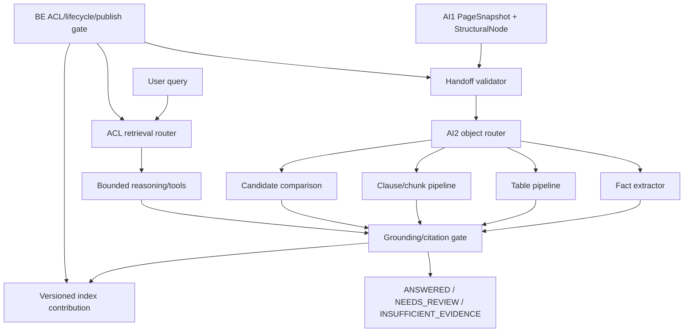
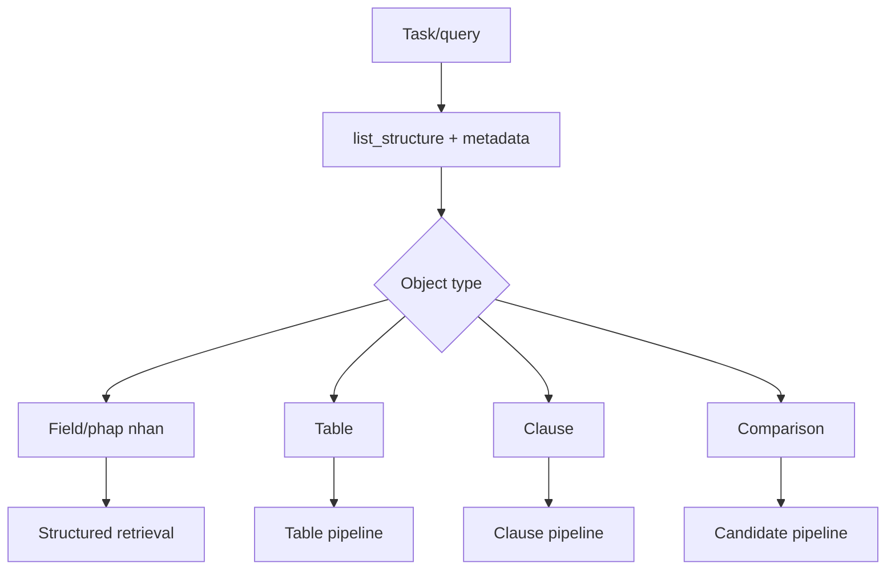
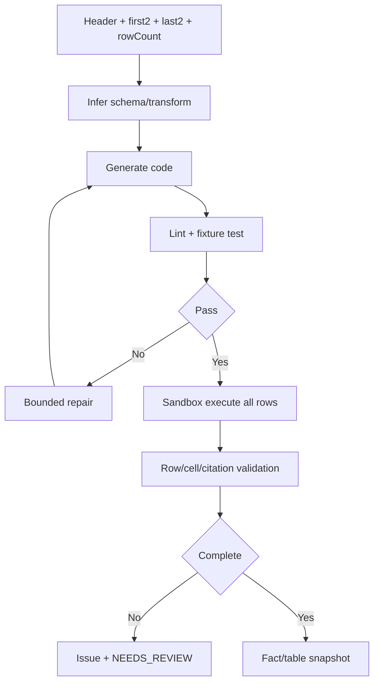

# AI2-03 — Kế hoạch thiết kế chi tiết AI2

**Phiên bản:** v0.1 (Draft)  
**Ngày:** 19/09/2026  
**Phạm vi:** Thiết kế triển khai AI2 sau AI1, gồm handoff, extraction, table/clause processing, comparison, reasoning, retrieval, governance và evaluation.

## 1. Mục tiêu và ranh giới

AI2 xử lý snapshot có cấu trúc do AI1 tạo ra. AI2 không nhận toàn bộ PDF vào reasoning, không tự cấp quyền, không tự publish index active và không đưa ra kết luận pháp lý.

Nguồn yêu cầu:

- [AI2-01 Business/Policy](AI2-01-business-policy-perspective.vi.md)
- [AI2-02 Extraction Engine](AI2-02-extraction-engine-design.vi.md)
- [DOC-01 — Product Vision](../DOC-01-product-vision.md)
- [DOC-02 — BRD](../DOC-02-brd.md)
- [DOC-04 — Architecture](../DOC-04-architecture.md)

## 2. Kiến trúc mục tiêu



## 3. Phase 1 — Handoff contract và validator

### 3.1 Contract đầu vào

AI2 cần `tenant_id`, `dossier_id`, manifest/source/profile/policy/OCR/reconstruction/extraction versions, page inventory, `PageSnapshot`, `StructuralNode`, table snapshot và explicit partial/failure state.

```json
{
  "tenant_id": "tenant_001",
  "dossier_id": "dossier_001",
  "version_pins": {
    "manifest_version": 2,
    "source_snapshot_digest": "sha256:...",
    "tenant_profile_version": 5,
    "policy_version": 2,
    "ocr_run_version": 3,
    "reconstruction_version": 2,
    "extraction_version": 7
  },
  "page": {
    "page_revision_id": "page_10_rev_2",
    "quality": "OK",
    "coverage": 0.98,
    "rotation": 0,
    "source_block_ids": ["p10_b18"]
  },
  "node": {
    "node_id": "node_5_3",
    "type": "CLAUSE",
    "raw_label": "Điều 5.3",
    "parent_id": "node_5",
    "status": "CONFIRMED"
  }
}
```

### 3.2 Validator trước extraction

Validator kiểm:

1. version pins đầy đủ và cùng generation;
2. tenant/dossier context do BE cấp;
3. page revision, text span, bbox, rotation và source block resolve;
4. parent/order/label của node;
5. table row/cell/continuation signal;
6. quality/coverage và explicit failed pages;
7. profile/policy compatibility.

Thiếu pin/lifecycle hoặc page encrypted thì `BLOCKED`; thiếu thông tin, quality thấp, page fail, node unknown hoặc table mơ hồ thì tạo issue/`NEEDS_REVIEW`, không âm thầm bỏ dữ liệu.

### 3.3 Edge-case được chặn

- Scan lỗi hoặc một page OCR fail: giữ inventory, xử lý phần hợp lệ, đánh dấu partial.
- Profile đổi: tạo run mới, không overwrite output cũ.
- Re-OCR: citation pin `page_revision_id` mới; review cũ stale.
- Template không rõ: `UNKNOWN/NEEDS_REVIEW`, không ép canonical type.

## 4. Phase 2 — Object router và tool surface

Router chọn extractor trước khi lấy nội dung:



Allowlist tools:

```text
list_structure(dossier_id)
get_node(node_id)
list_tables(dossier_id)
get_table_meta(table_id)
get_table_rows(table_id, start, end)
search_structured(key, filters)
search_semantic(query, k)
run_code(code, table_id)
```

Tool contract phải truyền ID và metadata trước payload. Mọi tool kiểm tenant, dossier ACL, lifecycle, pinned version và allowed operation. Model không có filesystem, arbitrary URL, provider endpoint hoặc tool chưa đăng ký.

## 5. Phase 3 — Fact extraction, anchor grounding và citation restore

### 5.1 Deterministic-first

Các field có pattern rõ như MST, ngày, tiền, đơn vị, currency, VAT và số lượng đi qua typed extractor trước. Model chỉ xử lý ambiguity có context bounded.

Fact phải giữ:

```text
raw_value
normalized_value
subject
role/entity
unit/currency
vat_basis
condition
scope
validity
source node/page/span/bbox
provenance
review_state
```

### 5.2 Anchor-first

Trước khi chấp nhận value, AI2 lập anchor gồm text span, character offset, page revision, block và bbox. Sau extraction, AI2 restore value về anchor theo thứ tự:

```text
exact match
→ controlled fuzzy match
→ schema/alias match
→ source text search
→ NEEDS_REVIEW nếu không restore được
```

Valid JSON không đồng nghĩa đúng value. Không restore được citation thì không publish fact.

### 5.3 Edge-case

- MST/pháp nhân lặp: giữ nhiều fact và candidate; không tự chọn.
- Số bằng chữ khác số: hai anchor, review.
- Ngày “30 ngày kể từ ngày ký”: giữ raw/validity, không bịa mốc.
- USD/VND: không tự quy đổi; khác scope → `NOT_COMPARABLE`.
- Alias tenant: chỉ dùng `TenantProfile` version đã pin.

## 6. Phase 4 — Table pipeline và code-generation sandbox

### 6.1 Flow

1. `get_table_meta` lấy header, multi-row header, row count, column count, 2 dòng đầu/cuối, unit/currency và continuation signals.
2. Model suy schema và transform type trên mẫu nhỏ.
3. Model sinh code một lần.
4. Lint và fixture-test trong sandbox.
5. Chạy deterministic toàn bảng bằng decimal-safe arithmetic.
6. Validate row/cell count, duplicate key, missing middle, subtotal, footnote, merged cell và citation.
7. Cache code theo schema/profile/extraction version.



### 6.2 Edge-case

- Bảng 300 dòng: model chỉ thấy metadata và mẫu; code chạy toàn bộ.
- Bảng hai trang: cần title/header/page adjacency/row identity, không nối chỉ vì cùng số cột.
- Merged cell: derived context phải trỏ cell nguồn.
- Empty/`-`/`N/A`/zero: giữ sentinel riêng, không coi missing là zero.
- `1.234`, `1,234`, ngoặc âm: normalize bằng code, giữ raw.
- Subtotal/footnote: boundary riêng, không đoán tổng.
- Landscape: bbox dùng rotation/transform của page revision.

## 7. Phase 5 — Clause, chunk và index

`StructuralNode` là boundary chính. AI2 giữ raw label, parent/order và `UNNUMBERED_BLOCK`; không ép mọi hợp đồng thành Điều–Khoản–Điểm.

Chunk theo clause/topic, bullet/level và page boundary. Mỗi chunk giữ:

```text
chunk_id
parent_node_id/table_id
page_range
source_block_ids
text_span/bbox_fragments
ancestor_breadcrumb
continuation_flag
index/embedding_version
```

Exact/structured retrieval luôn trước semantic. Overlap chỉ làm context; dedupe theo source/context key.

Edge-case:

- clause dài: unit nhỏ, không gửi toàn clause một lần;
- clause không đánh số: raw label + unnumbered node;
- trùng/nhảy số: node riêng hoặc issue;
- header/footer: dùng reconstruction/source block;
- definition/cross-reference: index definition và resolve đúng node;
- song ngữ: giữ span từng ngôn ngữ, không tự dịch thành truth.

## 8. Phase 6 — Candidate comparison và amendment analysis

Pipeline:

```text
segment
→ deterministic exact/near/moved align
→ classify chỉ unit thực sự thay đổi
→ attach evidence hai phía
→ model disposition
→ review state
```

Pair chỉ khi subject, role, unit, scope và validity tương thích. Candidate tách:

```text
finding_type
model_disposition
review_state
```

Có relation graph explicit gồm node nguồn/defined-term và edge `PARENT_OF`, `SAME_CLAUSE`, `REFERENCES`, `AMENDS`, `DEFINES`, `USES_DEFINED_TERM`, luôn kèm snapshot digest và citation. Có thể tạo defined-term dependency graph và affected-section list để reviewer định hướng. AI2 chỉ surface candidate amendment, relation, effective context và uncertainty; không chạy precedence engine, không gắn `LEGAL_WINNER`. Relation không resolve được hoặc citation không validate được thì giữ `INSUFFICIENT_EVIDENCE`/`NEEDS_REVIEW`.

Edge-case:

- body/table/annex mâu thuẫn: giữ evidence hai phía;
- implicit amendment: thiếu câu sửa/effective context thì review;
- nhiều annex cùng sửa: hiện chain/uncertainty, không quyết định ưu tiên;
- cosmetic vs substantive: alignment deterministic lọc thay đổi bề mặt;
- defined-term cascade: surface affected section, không kết luận pháp lý.

## 9. Phase 7 — Bounded reasoning orchestration

Chọn pattern theo task:

- deterministic-first cho typed fields, table và structured lookup;
- plan-and-execute cho dossier dài, tạo queue/checkpoint;
- DAG/ReWOO cho tool calls độc lập;
- ReAct trong một unit khi cần đọc thêm;
- self-repair chỉ khi có verifier: lint/test, schema hoặc citation restore.

Guardrail:

- giới hạn số bước, retry và replan;
- giới hạn input/output token và cost;
- phát hiện loop và duplicate tool call;
- reset context giữa các unit;
- fallback `NEEDS_REVIEW` khi verifier không đạt.

Reasoning call chỉ nhận task/query, evidence tối thiểu, ancestor/relation cần thiết và citation IDs. Không đưa toàn bộ scratchpad hoặc PDF.

## 10. Phase 8 — Retrieval, cache và QueryTrace

Query route:

```text
authenticated tenant/dossier ACL
→ exact/keyword
→ structured
→ semantic top-k (tuỳ chọn, chỉ recall ứng viên)
→ metadata filter + citation validation
→ bounded reasoning nếu cần
→ ANSWERED hoặc INSUFFICIENT_EVIDENCE
```

Khi index mới `PROCESSING/FAILED`, active index cũ tiếp tục phục vụ. Aggregation thiếu source phải trả `INSUFFICIENT_EVIDENCE`.

Cache key tối thiểu:

```text
tenant_id
acl_revision
dossier_id
index_version
normalized_query
mode
profile/policy/model_version
```

Cache hit vẫn kiểm ACL/lifecycle. `QueryTrace` pin query, actor, result, citation, retrieval modes, source/index/profile/model versions và usage.

## 11. Phase 9 — Security, lifecycle, cost và idempotency

- Tenant/dossier filter ở index write/read và cache.
- External OCR/LLM chỉ sau policy approval/service register; thiếu thì block + audit.
- Soft-delete dừng job, thu hồi access/signed URL; late response không publish.
- Rerun dùng lease, idempotency key và generation/fencing.
- Quota/rate/cost gate trước expensive operation; ghi estimated/actual/ambiguous usage.
- Purge inventory bao gồm facts, chunks, embeddings, indexes, cache và operational copies.
- Legal hold chặn purge.

## 12. Phase 10 — Evaluation và rollout gates

### 12.1 Frozen fixtures

Fixture phải gồm:

- bảng dài, bảng nhiều trang, row bị cắt, duplicate key, missing middle, subtotal/footnote;
- numbered và unnumbered clauses;
- scan quality thấp, watermark, chữ ký che số;
- amendment/candidate và insufficient evidence;
- profile change/re-OCR;
- negative ACL cross-tenant;
- index failure/fallback;
- quota, cache và lifecycle purge.

### 12.2 Metrics

Đo riêng structural mapping, table/row/cell correctness, value accuracy, citation correctness theo document/page/span/bbox, Recall@k theo exact/structured/semantic, `NEEDS_REVIEW`, cost/query và cache hit.

Report phải có `n`, denominator, sample, version, missing/failed/not-run. Không dùng confidence thay accuracy, không đặt target số trước baseline.

### 12.3 Rollout order

```text
handoff validator
→ deterministic facts
→ table/clause pipelines
→ citation gate
→ index contribution
→ retrieval
→ comparison
→ bounded reasoning
→ governance/evaluation
```

## 13. Deliverables

- Handoff contract và validator checklist.
- Router/tool registry có ACL/version enforcement.
- Fact, citation, candidate và chunk contracts.
- Table code-generation sandbox và fixture suite.
- Clause/chunk/index pipeline design.
- Candidate/amendment candidate design.
- Reasoning orchestrator có budget/loop guardrails.
- QueryTrace, usage, lifecycle và purge reconciliation design.
- Edge-case test matrix liên kết AC-004..AC-034 và metrics.

## 14. Điều kiện dừng

Không claim AI2 MVP ready nếu chưa có evidence cho source/citation integrity, tenant isolation, bounded processing tài liệu dài, table/scan failure safety, index fallback, lifecycle purge coverage và evaluation độc lập.
