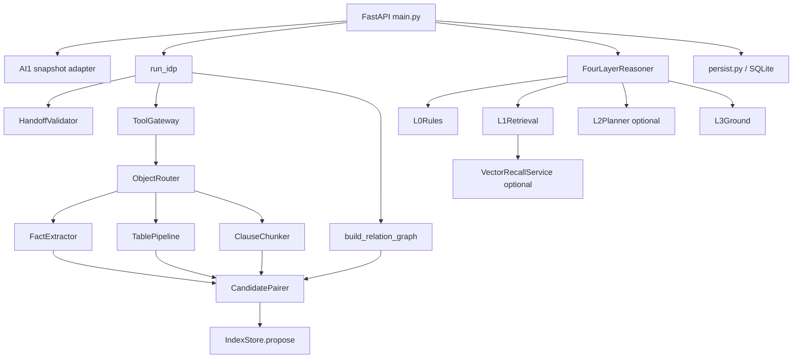
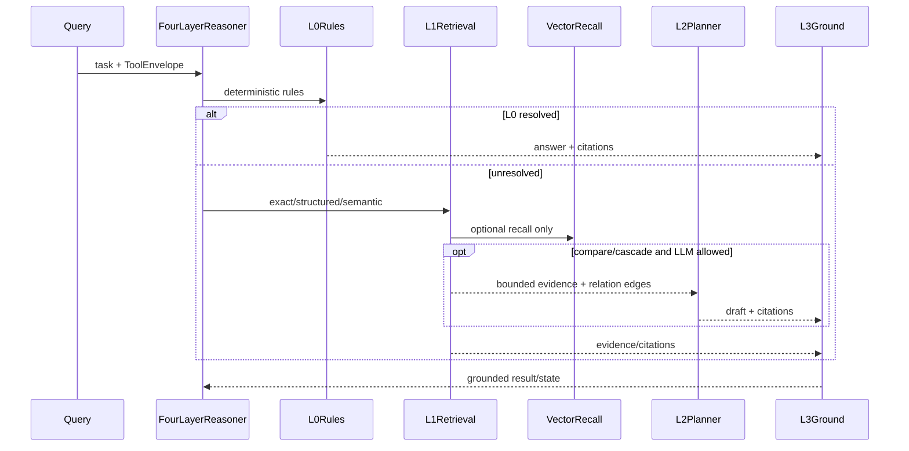

# AI2-05 — Component và Software Design Description

**Phiên bản:** v2.0
**Ngày:** 21/09/2026
**Vai trò:** component/dependency/interface view theo IEEE 1016; mô tả implementation hiện tại, không phải target service.

Architecture description tổng thể: [AI2-DOC-04](AI2-DOC-04-architecture.vi.md). Phương pháp view: [AI2-architecture-method](AI2-architecture-method.vi.md).

## 1. Component topology



Invariant chung:

- Mọi access vào snapshot trong pipeline/reasoning đi qua `ToolGateway`.
- Evidence phải giữ `node_id`, `page_revision_id`, `text_span` và snapshot digest khi có.
- Không component nào được biến LLM output thành fact authoritative nếu chưa qua grounding.
- `IndexStore.propose` không tự publish active index.

## 2. Interface và data contracts

### 2.1. `ToolEnvelope`

```json
{
  "auth": {
    "actor_id": "demo-user",
    "tenant_id": "tenant_demo",
    "dossier_id": "dossier_001",
    "acl_revision": 1,
    "permissions": ["READ_CONTENT"],
    "lifecycle": "ACTIVE"
  },
  "pins": {
    "manifest_version": 4,
    "source_snapshot_digest": "sha256:...",
    "tenant_profile_version": 1,
    "policy_version": 1,
    "ocr_run_version": 1,
    "reconstruction_version": 1,
    "extraction_version": 1,
    "index_version": null
  }
}
```

`ToolGateway` kiểm tra tenant/dossier, permission, lifecycle, pins và allowlist. Demo có context này để kiểm thử boundary; không phải production identity/ACL service.

### 2.2. `DossierRecord`

```text
DossierRecord
├── tenant_id, dossier_id, lifecycle, acl_revision
├── pages[]              # page text, quality, revision, table coverage
├── nodes[]              # structural tree, text, geometry/status
├── tables[]             # rows/cells/citations nếu AI1 cung cấp
├── source_files[]       # body/annex, digest, page count
├── profile, pins
├── facts[], chunks[]    # sau extraction
├── relation_graph       # nodes, edges, issues
└── policy/index flags   # egress, budgets, lease, lifecycle
```

`pdf_bytes` không thuộc `DossierRecord`; upload blob nằm trong session và chỉ được trả qua file viewer endpoint.

### 2.3. Output contracts

```text
JobResult
├── job_id
├── status: SUCCEEDED | FAILED
├── review_state
├── handoff_issues[]
└── contribution?
    ├── facts[]
    ├── chunks[]
    ├── candidates[]
    ├── evidence_issues[]
    ├── coverage
    ├── proposed_index_version
    └── publish = "propose"
```

Question output bổ sung `answer`, `citations`, `locations`, `layers_used`, `relation_edges`, `relation_issues`, `retrieval_trace`, `policy` và `review_state`.

## 3. Component contracts

### `HandoffValidator`

- Input: record pages/nodes/tables/profile/pins/lifecycle.
- Output: `ValidatedHandoff`, issues và `blocked`.
- Block khi: lifecycle không active, pin/schema nghiêm trọng, encrypted/failed handoff hoặc issue blocked.
- Review khi: page LOW/EMPTY, node không confirmed, table coverage chưa chắc chắn.
- Không đọc raw PDF và không tự tạo geometry.

### `ObjectRouter` và `ToolGateway`

- `ObjectRouter.scout` lấy outline trước, sau đó route node thành `FIELD`, `TABLE`, `CLAUSE`.
- `ToolGateway` là boundary kiểm tra quyền/pin và cung cấp các thao tác read-only/sandbox allowlisted.
- Không gửi payload dossier-sized vào LLM.

### `FactExtractor`

- Giữ `raw_value`, tạo `normalized_value` và metadata subject/role/unit/scope/validity.
- Citation phải trỏ về node/page revision/text span.
- Fact dựa trên page/node quality thấp bị hạ `NEEDS_REVIEW`.

### `TablePipeline`

- Chỉ xử lý table snapshot/cells mà AI1 cung cấp.
- Giữ sparse cell, missing, `-`, `N/A` khác zero.
- Không merge bảng chỉ vì cùng số cột.
- Thiếu cells/geometry thì tạo issue hoặc degraded result; không dựng bảng giả.

### `ClauseChunker`

- Cắt theo structural node, breadcrumb, page range, source block và continuation.
- Giữ raw label và parent relation.
- Boundary mơ hồ hoặc text không đủ citation → `NEEDS_REVIEW`.

### `build_relation_graph`

- Tạo node cho structural/source objects.
- Tạo edge loại `PARENT_OF`, `SAME_CLAUSE`, `REFERENCES`, `AMENDS`, `DEFINES`, `USES_DEFINED_TERM` khi có support.
- Edge có support `STRUCTURAL`, `EXPLICIT_TEXT` hoặc `HEURISTIC`, citation và source digest.
- Edge heuristic không được biến thành kết luận chắc chắn.

### `CandidatePairer`

- Pair body/annex theo subject, role, item key, unit, scope, validity và relation context.
- Phân biệt consistent, conflicting, incomplete, unclear.
- Không trả `LEGAL_WINNER` và không tự chọn điều khoản có hiệu lực pháp lý cao hơn.

### `IndexStore`

- Lưu fact/chunk/candidate/evidence issue/coverage thành contribution.
- Proposal có extraction version và proposed index version.
- Không đổi active index pointer.

## 4. Reasoning components



### `L0Rules`

Deterministic lookup/party/field/security/too-broad/not-comparable handling. Không gọi external model.

### `L1Retrieval`

Thứ tự chính: exact label → structured key → deterministic semantic/BM25 → ancestor/same-clause → relation graph → optional vector candidates. Kết quả bị dedupe và giới hạn trước khi trả về.

### `VectorRecallService`

- Chỉ chạy khi `use_vector=true`, task phù hợp, egress và embedding budget cho phép.
- Segment khoảng 1.600 ký tự, overlap 200; batch mặc định từ environment.
- SQLite index lọc snapshot digest/model/dimension/source metadata.
- Validate node tồn tại, node không failed và text span còn là substring.
- Status có thể là `DISABLED`, `BUDGET_EXCEEDED`, `EGRESS_DENIED`, `PROVIDER_ERROR`, `READY`, `UNAVAILABLE`.
- Vector hit không đi thẳng tới answer.

### `L2Planner`

- Chỉ dành cho compare/cascade không quá rộng.
- Context đã trim; tool allowlist; tối đa step/replan theo implementation.
- LLM output là plan/draft, không phải source of truth.
- Lỗi LLM fallback về deterministic/review nếu còn evidence.

### `L3Ground`

Kiểm tra allowed outline, node/page revision, text span, citation, extractive answer, invented annex, forbidden claim và blocked state. Kết quả không đủ evidence bị chuyển thành `NEEDS_REVIEW` hoặc `INSUFFICIENT_EVIDENCE`.

## 5. Policy/error contract

| Condition | Behavior |
|---|---|
| Handoff blocked | `JobResult.FAILED`, `BLOCKED`, không extraction |
| Handoff review | Có thể chạy; facts/chunks/candidates hạ review |
| Processing budget hit | deterministic partial/review; external LLM extraction blocked |
| Embedding budget hit | chạy không vector; vector status `BUDGET_EXCEEDED` |
| Egress denied | local deterministic được phép; LLM/embedding bị block/denied |
| Tool blocked | job/query blocked, không leak resource |
| Thiếu nguồn | `INSUFFICIENT_EVIDENCE`, không đoán |
| Relation conflict/mơ hồ | `NEEDS_REVIEW`, giữ edges/issues |

## 6. Traceability

| Component | Code | Test/coverage |
|---|---|---|
| Adapter | `app/pipeline/ai1_snapshot_adapter.py` | snapshot adapter tests |
| Handoff | `app/pipeline/handoff.py` | handoff/API tests |
| Extraction | `app/pipeline/idp.py` và pipeline modules | full pytest/input coverage |
| Reasoning | `app/reasoning/*` | reasoning/hybrid/API tests |
| Persistence | `app/tools/persist.py` | demo/API tests |
| Vector | `app/reasoning/vector_recall.py` | hybrid retrieval/live smoke |

Nếu implementation thay đổi, phải cập nhật component table, diagram C4 và output contract cùng một change.
