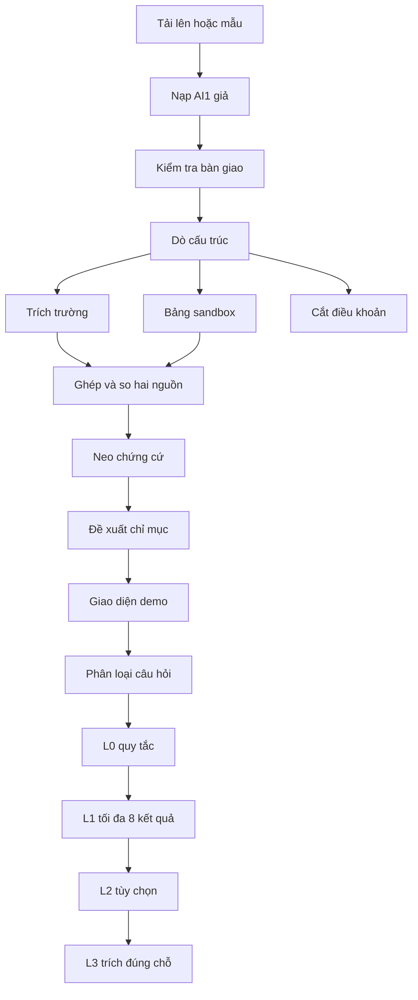

# AI2-07 — Luồng đầy đủ (đầu vào / xử lý / đầu ra)

**Phiên bản:** v1.1  
**Ngày:** 20/09/2026  
**Đối chiếu mã:** `ai-service` đang chạy (FastAPI `app.api.main`, `run_idp`, `FourLayerReasoner`).  
**Không mô tả:** mô hình CPS / đơn vị vô trạng thái, OCR đám mây, kho vector, quyền trên backend. Các hạng mục đó nằm cột giả hoặc ngoài phạm vi trong [AI2-06](AI2-06-implementation-gap.vi.md).

Đọc kèm: [AI2-06](AI2-06-implementation-gap.vi.md) · kiến trúc C0–C4 [AI2-08](AI2-08-architecture-c0-c4.vi.md) · đích đội bốn người [DOC-04](../DOC-04-architecture.md) (không khẳng định đã chạy).

## Mục tiêu wave hiện tại [2026-09-23]

Luồng này là nền cho Outcome Contract AI2 mới: profile theo loại hợp đồng
(`SALES`, `SUPPLY_SERVICE`, `LEASE`, `CONSTRUCTION_WORK`, `EMPLOYMENT`, `NDA`),
cây body/annex/clause/table, relation graph, comparison trong một hồ sơ và
free-form Q&A có citation. Các capability mới phải được đánh dấu partial cho tới
khi targeted tests và release artifacts chứng minh; không suy ra “đã tổng quát” từ
hai JSON OCR-lab hoặc từ candidate corpus chưa được review.

## Lệnh cấm xuyên suốt

| Cấm | Chỗ chặn |
|---|---|
| Đưa `pdf_bytes` vào AI2 | `HandoffValidator` → `BLOCKED` |
| Gắn nhãn bên thắng / `LEGAL_WINNER` | Kiểm tra trên `Candidate` |
| Đổi ngoại tệ rồi coi là khớp | `compare.py` → `NOT_COMPARABLE` |
| Gộp phạt khác khóa mục / khác phụ lục | `_context_key` và ghép đúng hai nguồn |
| Tự công bố chỉ mục | Chỉ `IndexStore.propose`; nút công bố demo không đổi bản đóng góp |
| Gộp hàng bảng trống thành một sự kiện | `TablePipeline` không gộp hàng OCR bị tách |
| Truy vấn tự do ra ngoài hồ sơ | Query scope + L3 grounding; thiếu source → `INSUFFICIENT_EVIDENCE`/`NEEDS_REVIEW` |

Trạng thái dùng `ReviewState`: `PASS` (đạt) · `NEEDS_REVIEW` (cần rà) · `INSUFFICIENT_EVIDENCE` (thiếu chứng) · `BLOCKED` (chặn) · `ANSWERED` (đã trả lời hỏi) · `NOT_COMPARABLE` (không so được). Giao diện có thể gọi tắt “cần rà” cho `NEEDS_REVIEW`.



---

## A. Luồng demo và trích xuất

### A1. Tải lên hoặc hồ sơ mẫu

**Đầu vào**

- HTTP `POST /api/workspace/sample`, `sample-compare`, hoặc `upload` (mảng tệp).
- Tệp PDF trên đĩa người dùng, chọn từ trình duyệt. Không cổng DMS.

**Xử lý**

- `ingest_files` (`ai1_ingest.py`): giả AI1 trong cùng tiến trình — danh sách trang, nút cấu trúc, ảnh bảng, ghim phiên bản. Không đọc PDF bằng máy OCR đám mây.

**Đầu ra**

- Phiên: `session_id`, hồ sơ `DossierRecord` (trang, nút, bảng, ghim, vòng đời), phong bì công cụ `ToolEnvelope`.
- Tệp PDF trên đĩa máy; siêu dữ liệu SQLite `data/ai2` (lát mỏng, không phải cổng backend).

**Trạng thái:** phiên sẵn sàng; chưa trích sự kiện.

**Cấm:** không gửi đủ `pdf_bytes` vào bộ kiểm tra bàn giao hay LLM.

### A2. Kiểm tra bàn giao

**Đầu vào:** mã khách, mã hồ sơ, ghim phiên bản, danh sách trang, nút, bảng, hồ sơ tenant, vòng đời; tùy chọn `pdf_bytes`.

**Xử lý:** `HandoffValidator.validate`.

**Đầu ra:** `ValidatedHandoff` gồm cờ chặn và danh sách sự cố.

| Điều kiện | Trạng thái |
|---|---|
| Có `pdf_bytes` | `BLOCKED` (mã `NO_PDF_BYTES`) |
| Hồ sơ đã xóa / đang xóa hẳn | `BLOCKED` |
| Thiếu ghim | `BLOCKED` |
| Lệch phiên bản ở ToolGateway | `BLOCKED` |
| Trang trống/thấp hoặc node partial | `NEEDS_REVIEW` (không chặn cả hồ sơ, nhưng output liên quan không được PASS) |
| Hợp lệ | tiếp tục |

### A3. Dò cấu trúc và định tuyến

**Đầu vào:** phong bì công cụ và `list_structure`.

**Xử lý:** `ObjectRouter.scout` rồi `route_node`.

**Đầu ra:** dàn bài các nút (`node_id`, `type`, `raw_label`, …). Đường: trường (`FIELD`), bảng (`TABLE`), điều (`CLAUSE` gồm mục và khối không số).

**Cấm:** đổ nguyên PDF vào tác nhân.

### A4. Trường — trích sự kiện

**Đầu vào:** phong bì, `node_id`, hồ sơ tenant (bí danh, khóa trường).

**Xử lý:** lấy chữ nút qua cổng công cụ. Chuẩn hóa: bí danh lớp 0; số và phần trăm giữ dạng số thập phân; tiền Việt chỉ lấy chữ số khi có `vnd`/`đồng` và không có `%`; cụm `một|hai|ba tỷ|triệu|nghìn` (không bắt từ đơn `năm`/`một` trong câu). LLM tùy chọn trả JSON `{normalized, unit}`.

**Đầu ra:** sự kiện `Fact`: mã, giá trị thô (bắt buộc khác rỗng), giá trị chuẩn, khóa mục / phạm vi, đơn vị, vai trò nguồn thân hoặc phụ lục, trích dẫn, nguồn L0 hoặc L2, trạng thái rà.

### A5. Bảng — sandbox

**Đầu vào:** `table_id` khớp `node_id` (không lấy bảng đầu tiên nếu lệch). Siêu dữ liệu bảng (tiêu đề, số hàng, vài hàng đầu/cuối, cờ nối trang), chạy mã trong danh sách trắng.

**Xử lý:** mã mặc định đọc cột số tiền; ô thiếu là `None`, không phải `0`. LLM có thể sinh mã; lỗi thì thử lại mạnh hơn. Nếu vẫn lỗi hoặc không có output cho bảng không rỗng, job trả `FAILED` kèm issue, không trả success rỗng.

**Đầu ra:** danh sách sự kiện. Ô thiếu: giá trị thô `MISSING`, chuẩn hóa rỗng, `NEEDS_REVIEW`. Bảng nối trang: sự kiện `NEEDS_REVIEW`. Không gộp hai hàng bị OCR tách.

**Cấm:** nuốt hàng trống hợp lệ (EC-015).

Điều khoản: `ClauseChunker` cắt `Chunk[]`; **không** tạo sự kiện (đúng định tuyến). Đoạn vẫn lưu để hỏi và định vị trên trang.

### A6. So hai nguồn

**Đầu vào:** danh sách sự kiện; nhãn phụ lục có mặt trong hồ sơ.

**Xử lý:** `CandidatePairer.pair_with_issues` gọi `compare_facts`. Nhóm theo khóa ngữ cảnh `(item_key hoặc scope)`. Không ghép hàng loạt nhóm `mst_seller` (dấu MST xử lý riêng). Ghép thân ↔ phụ lục cùng ngữ cảnh, không nhân mọi cặp. Phần trăm: số thập phân sau khi đổi `,` thành `.` — không xóa hết ký tự không phải số (`0.2%` không thành `2`). Sửa đổi chỉ khi câu có sửa/thay/amends, không bắt `lại`, `phiên bản`, `quy trình`.

**Đầu ra:** ứng viên so sánh và sự cố chứng cứ.

| Tình huống | Kết quả / trạng thái |
|---|---|
| Cùng số sau chuẩn hóa | Khớp / `PASS`, hoặc `NEEDS_REVIEW` nếu trích dẫn yếu |
| Khác số, không câu sửa | Khác biệt |
| Có câu sửa/thay và khác số | Ứng viên sửa đổi / `NEEDS_REVIEW` |
| Ngoại tệ hoặc khác đơn vị tiền | `NOT_COMPARABLE` |
| Văn bản dẫn phụ lục nhưng hồ sơ không có | Sự cố chứng cứ `INSUFFICIENT_EVIDENCE` |
| Khác phạm vi phí | Khoảng trống + `NOT_COMPARABLE` |

**Cấm:** `LEGAL_WINNER`; không kết luận điều nào “thắng”.

Scope comparison được xác định rõ là `WITHIN_DOCUMENT`, `CONTRACT_ANNEX` hoặc
`ANNEX_ANNEX`. So sánh giữa hồ sơ độc lập chỉ chạy khi caller chỉ rõ scope; không
dùng `dossier_id` trùng nhau làm quan hệ pháp lý.

### A7. Neo chứng cứ

**Đầu vào:** sự kiện, đoạn nguồn, hồ sơ tenant (tùy chọn).

**Xử lý:** chuỗi đúng trong đoạn; gần đúng; bí danh. Không tự nâng từ cần rà / thiếu chứng / chặn lên `PASS` chỉ vì chuỗi thô xuất hiện trong đoạn (bảng nối trang không đi qua cổng này).

**Đầu ra:** cùng sự kiện, trạng thái rà đã cập nhật.

### A8. Đề xuất chỉ mục, lưu, lớp rà soát

**Đầu vào:** sự kiện, đoạn, ứng viên, sự cố, số đếm phủ, phiên bản trích.

**Xử lý:** `IndexStore.propose` — đóng góp ở trạng thái đề xuất. Lưu phiên SQLite; lớp rà xác nhận / sửa / từ chối (không sửa chữ gốc). Trích lại thì lớp rà đánh dấu hết hạn.

**Đầu ra HTTP:** khung phiên (sự kiện, phát hiện, sự cố, việc thành công hoặc thất bại).

Nút công bố demo chỉ ghi nhận thao tác phiên; `IndexStore.active_pointer` không đổi và contribution vẫn có `publish="propose"`.

---

## B. Luồng hỏi

HTTP `POST /api/workspace/{session_id}/ask` với `{ query, use_llm }`.

### B1. Phân loại

**Đầu vào:** chuỗi câu hỏi.

**Xử lý:** `classify_ask` → việc `{ type, query, ... }`.

**Đầu ra:** việc cho bốn lớp. Câu quá rộng không đẩy so sánh lớp 2.

### B2. Lớp 0 — quy tắc

**Đầu vào:** phong bì công cụ và việc.

**Xử lý:** MST, đếm bên, khối không số, câu độc hại, ngoại tệ, bảng, biên điều khoản. Khớp `Điều {n}` không ăn số dài hơn — `Điều 3` không dính `Điều 35`. Có nút khớp thì trả rỗng để lớp 1 làm. Không bịa nút.

**Đầu ra:** gói đã giải (trạng thái, câu trả, trích dẫn, ghi chú) hoặc rỗng.

Nếu đã giải: vẫn neo lớp 3 rồi trả; các lớp đã dùng gồm L0 và L3.

### B1.1. Free-form Q&A trong dossier

Câu hỏi tự do được xử lý theo scope:

```text
tenant → dossier → selected contract/annex members → bounded retrieval → L3 grounding
```

Các câu hỏi quan hệ nhiều bước có thể đi qua relation graph và comparison. Câu hỏi
ngoài scope, thiếu target hoặc thiếu citation không được mở rộng bằng cách đọc toàn
văn; trả safe state và nêu phần evidence còn thiếu.

### B3. Lớp 1 — truy hồi tối đa 8

**Đầu vào:** việc và dàn bài.

**Xử lý:** khớp đúng → khóa có cấu trúc → từ vựng → semantic/vector recall tùy chọn; tối đa 8 kết quả. Vector chỉ là recall, phải lọc scope và validate citation trước khi dùng.

**Đầu ra:** danh sách trúng, mã nút dàn bài. Công cụ bị chặn → `BLOCKED`.

### B4. Lớp 2 — tùy chọn

**Khi:** loại việc thuộc so sánh và câu không quá rộng. Cần LLM đã cấu hình.

**Đầu vào:** kết quả lớp 1 (mã nút, không PDF).

**Xử lý:** lập kế hoạch rồi gọi công cụ trong danh sách trắng. Tối đa 8 bước.

**Đầu ra:** bản nháp (câu trả, trích dẫn, đủ hay chưa) và các bước. So sánh / dây chuyền luôn `NEEDS_REVIEW`. Không LLM: cần rà kèm trích dẫn, không bịa.

### B5. Lớp 3 — trích đúng chỗ

**Đầu vào:** bản nháp hoặc gói chữ lớp 1.

**Xử lý:** chỉ giữ đoạn có trên nút; bỏ nút giả.

**Đầu ra:** trạng thái, câu trả, trích dẫn, vị trí hộp trên trang. `ANSWERED` nếu đủ và không phải so sánh.

---

## C. Kiểm tra thực tế và giới hạn claim

- Đã có regression/gold cho `HD-TONG-HOP`, `SALE-BRD-07`, `SERVICE-BRD-08`, missing cell/zero, currency/scope, query rộng, injection và ACL/lifecycle.
- Đã có fixture cho EC-001..EC-056, nhưng nhóm bảng nhiều trang, OCR/scan, ngày tương đối, bilingual, queue/version và cost vẫn là partial/mock hoặc ngoài AI2.
- Candidate corpus 95 case chưa phải golden evidence; repo manifest hiện được kiểm kê 65 case records. Chưa claim accuracy nghiệp vụ nếu chưa có human-reviewed golden set.
- `extract_page_texts`/PDF encryption là trách nhiệm intake AI1; AI2 chỉ bảo đảm chặn khi nhận snapshot `ENCRYPTED` hoặc bị truyền `pdf_bytes`.
- Không dùng nhãn `REVIEW` hoặc `COMPARABLE_DIFF` thay cho enum thật; phải dùng enum trong `app/contracts/models.py`.

## D. Việc không nằm trong “đã xong”

OCR Paddle/Tesseract, quyền và hàng rào backend, worker Postgres, vector, sổ chi phí, nhận file mã hóa — xem AI2-06. Không nhét vào cột đã xong của luồng này.
