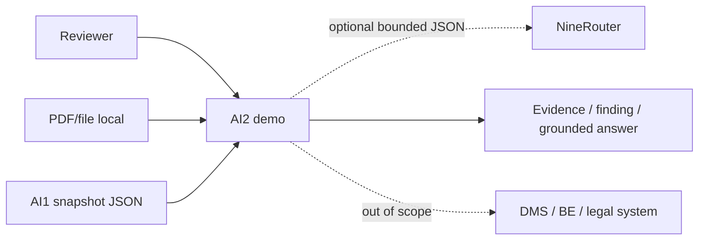
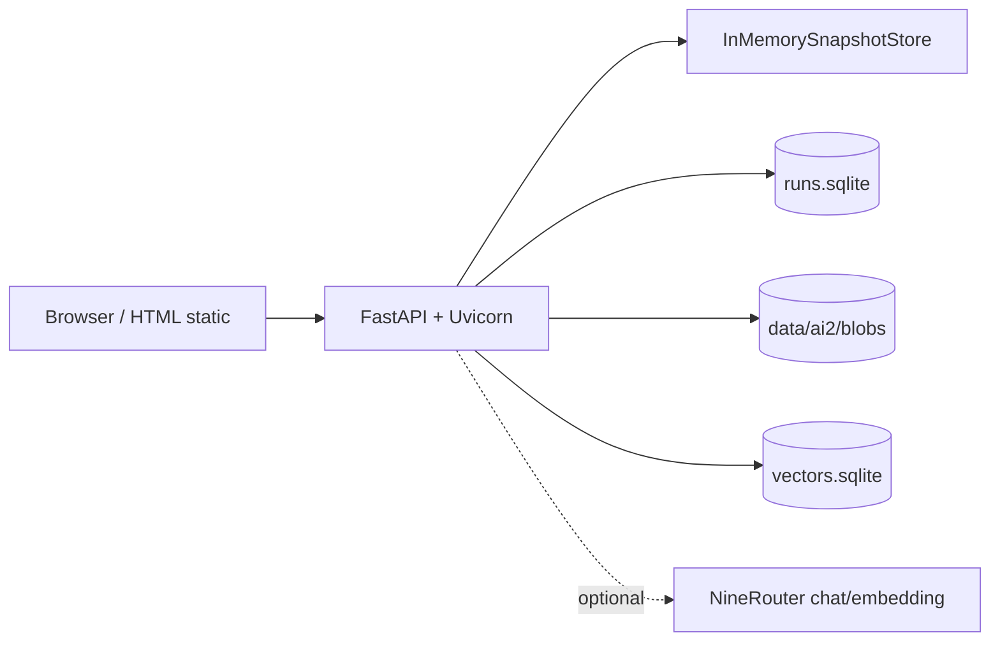
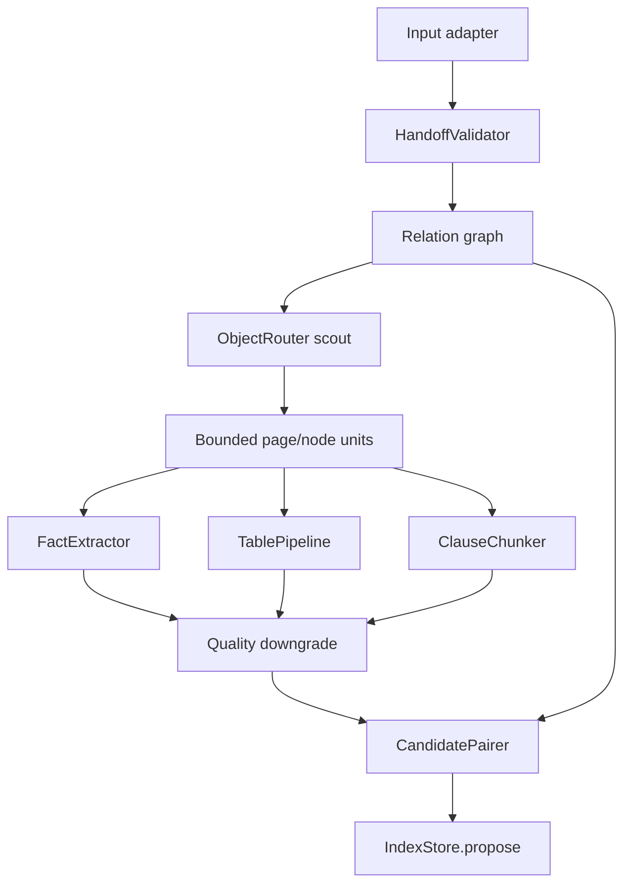
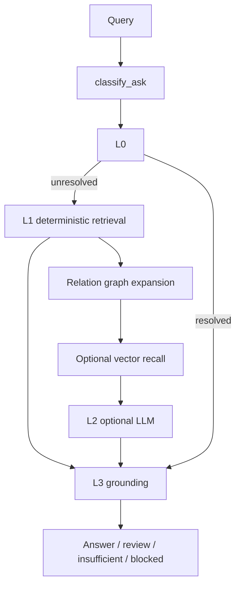
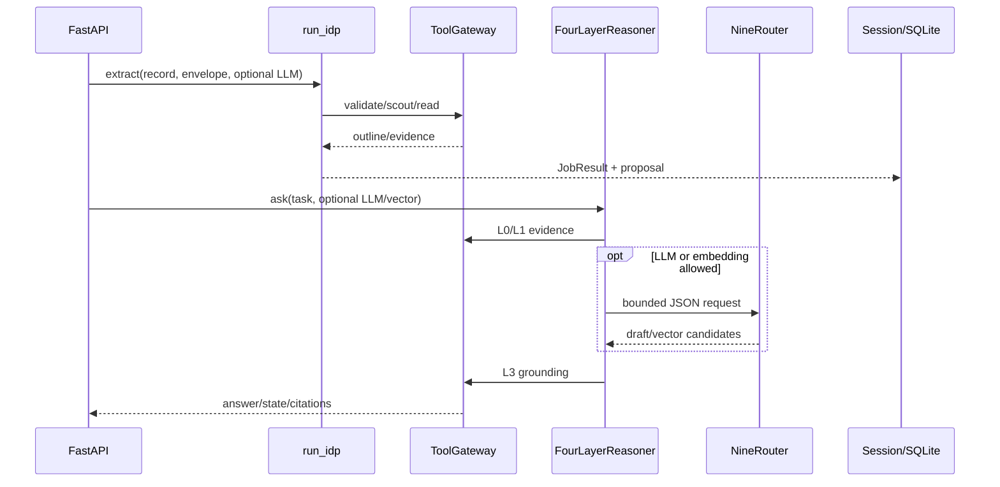
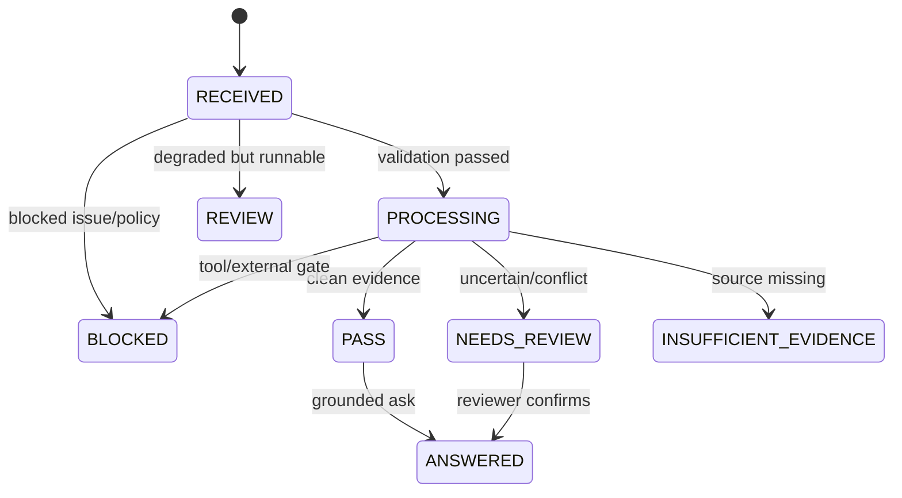

# AI2-08 — C0 đến C4 theo implementation hiện tại

**Phiên bản:** v2.0
**Ngày:** 21/09/2026
**Mục đích:** trình bày cùng một hệ thống ở các mức context → deployment → data/process → code. Đây là cách nhóm view, không phải claim rằng AI2 đã có production platform.

Phương pháp tham chiếu: [AI2-architecture-method](AI2-architecture-method.vi.md).

## C0 — System context

C0 trả lời: hệ thống nào nằm trong scope, ai dùng, external system nào không thuộc demo. Không mô tả DMS, ACL service hay active index production như đã triển khai.

## C1 — Container/runtime boundary

Input paths:

- Upload/sample gọi `ingest_files` và lưu blob riêng cho viewer.
- AI1 snapshot gọi `adapt_ai1_input`.
- Evaluation fixture dùng cùng session/API.

`pdf_bytes` không nằm trong snapshot/record/prompt; file route chỉ trả blob cho UI.

## C2 — Data/process flow

### Extraction

### Ask

C2 tập trung vào data movement và process, không dùng để thể hiện chi tiết class/module.

## C3 — Component/code view

| C3 component | Implementation |
|---|---|
| API/session | `app/api/main.py` |
| Input contract | `app/pipeline/ai1_snapshot_adapter.py` |
| Validation/gateway | `HandoffValidator`, `ToolGateway` |
| Scout/routing | `ObjectRouter`, `plan_units` |
| Extraction | `FactExtractor`, `TablePipeline`, `ClauseChunker` |
| Relation/pairing | `build_relation_graph`, `CandidatePairer` |
| Proposal | `IndexStore` |
| Ask | `FourLayerReasoner`, `L0Rules`, `L1Retrieval`, `L2Planner`, `L3Ground` |
| Vector | `VectorRecallService`, `SQLiteVectorIndex` |
| Persistence | `DossierRecord`, `JobResult`, `persist.py` |

### C3 invariants

- Handoff trước extraction.
- Relation edge phải có loại/support/citation/digest khi được tạo.
- Table structure thiếu thì không invent cells/geometry.
- Vector result không đi thẳng vào conclusion.
- LLM draft phải qua L3.
- Proposal không phải active index.

## C4 — Runtime sequence và state

C4 chỉ mô tả call sequence hiện có. Demo chưa có distributed worker, message broker, active index service hoặc resume checkpoint thật.

## C0–C4 mapping với 4+1 và IEEE 1016

| C-level | 4+1 / SDD concern | Nội dung AI2 |
|---|---|---|
| C0 | Scenario/context | Reviewer, AI1, files, NineRouter, hệ thống ngoài scope |
| C1 | Deployment/process boundary | Browser, FastAPI, memory, SQLite, blob/vector store |
| C2 | Logical/process/information | Extraction, ask, record, evidence và state |
| C3 | Development/logical | Component, module, interface, invariant |
| C4 | Process/development trace | Call sequence, policy gate, output và state transition |

Không ánh xạ máy móc C0–C4 thành “5 view 4+1”; C0–C4 là navigation level của dự án, còn 4+1 là cách tổ chức các concern trong mỗi level.

## Boundary cases phải thấy trong C0–C4

| Case | Architecture behavior |
|---|---|
| Hợp đồng/phụ lục không có bảng | `NOT_PRESENT` hợp lệ; bỏ qua TablePipeline |
| Không biết có bảng | issue `UNKNOWN/UNAVAILABLE`; text degraded, không kết luận |
| Có bảng nhưng không có cells/geometry | Không dựng bảng giả |
| 50 trang | Bounded units, top-k retrieval, capped L2 context |
| Body + nhiều annex | Relation graph + candidate pair; conflict/review nếu không đủ evidence |
| Missing annex | `INSUFFICIENT_EVIDENCE`, không suy ra nội dung |
| Vector provider lỗi | deterministic retrieval/review, không crash conclusion |
| LLM không có hoặc policy block | deterministic partial/review hoặc `BLOCKED` theo operation |
