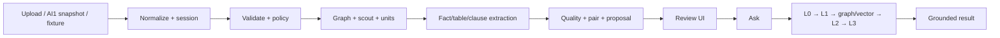
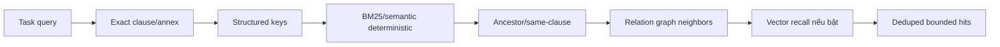

# AI2-10 — Luồng chi tiết hiện tại

**Phiên bản:** v2.1
**Ngày:** 22/09/2026
**Mục tiêu:** mô tả từng bước theo dạng input → xử lý → output → failure cho demo hiện tại.

## 1. Tổng quan



Có hai dữ liệu đi song song:

```text
JSON snapshot -> DossierRecord -> pipeline/reasoning
file bytes    -> session blob  -> chỉ viewer
```

## 2. Bước 1 — Mở input

### Input

- Upload/sample: file bytes và role body/annex.
- AI1 handoff: JSON `ai1.snapshot.v1` theo contract canonical.
- Evaluation case: fixture record/envelope.

Hai lane input được giữ tách biệt:

- `/api/workspace/ai1-snapshot` dành cho snapshot/legacy workspace lane;
- `/api/workspace/ai1-result` chỉ dành cho `ai1.result.v0.1` compatibility lane;
- `/jobs/idp` chỉ nhận `be.ai2.processing.request.v1` chứa `ai1.snapshot.v1`.

Một lane không được fallback hoặc tự chuyển đổi sang lane còn lại.

### Xử lý

- `ingest_files` tạo record demo từ file/sample.
- Backend lưu nguyên snapshot và chuyển payload cho AI2; adapter AI2 chỉ dựng model nội bộ sau khi nhận handoff.
- `_open_session` tạo session, envelope, metadata và job rỗng.
- Upload bytes lưu riêng trong `blobs`; không đưa vào record.

### Output

`session_id`, record summary, pages/nodes/tables, pins, policy, files và UI tree.

### Failure

- Snapshot sai contract: HTTP 422.
- Catalog test gửi vào handoff: reject trước reasoning.
- File rỗng/quá giới hạn: HTTP 400.

## 3. Bước 2 — Handoff pass-through

### Input

`DossierRecord.pages`, `nodes`, `tables`, `profile`, `pins`, lifecycle và policy flags.

### Xử lý

Tầng vận chuyển giữ nguyên payload AI1. Đường Backend canonical dùng `be.ai2.processing.request.v1`, manifest/body–annex membership, service envelope và schema/semantic validation. Đây là contract processing riêng, không thay shape `ai1.snapshot.v1`. Đường demo `/api/workspace/ai1-result` nhận `machine/effective` v0.1; kiểm tra inventory trùng và dùng digest nội dung thực cho pin/revision. Endpoint này từ chối snapshot v1; ngược lại snapshot lane cũng từ chối result envelope v0.1.

### Output

AI2 dựng model nội bộ gồm pages/nodes/tables/profile; raw snapshot vẫn là nguồn evidence.

### Failure/state

| Tình huống | Kết quả |
|---|---|
| Payload thiếu dữ liệu | Giữ nguyên payload, AI2 hạ review state khi cần |
| Page `LOW`/`EMPTY` | Có thể chạy, hạ review |
| Node không `CONFIRMED` | Có thể chạy, output review |
| `FAILED` page | Không kết luận “không có dữ liệu”; giữ lỗi |

## 4. Bước 3 — Policy gate

### Input

`processing_budget`, `embedding_budget`, `egress_approved`, `index_status`, request flags `use_llm`/`use_vector`.

### Xử lý

Policy được áp dụng theo operation:

- deterministic local được giữ làm lớp chính;
- external LLM bị chặn khi egress, processing budget hoặc lease không cho phép;
- embedding có gate riêng và có thể bị tắt mà không chặn deterministic.

### Output

Policy view gồm `deterministic`, `external`, `gates` và trace status.

### Failure

Không được âm thầm fallback external khi policy deny. Nếu request explicitly yêu cầu operation bị cấm thì trả `BLOCKED`; nếu vector riêng bị cấm thì chạy không vector.

## 5. Bước 4 — Relation graph

### Input

Structural nodes, parent/ancestor, source role, labels, explicit references và snapshot digest.

### Xử lý

`build_relation_graph` tạo node/edge rõ ràng. Edge có relation type, support, citations, review state và digest. Heuristic edge chỉ dùng để mở rộng candidate, không làm bằng chứng cuối.

### Output

`RelationGraph.nodes`, `edges`, `issues`; UI có endpoint xem graph.

### Failure

Reference mơ hồ hoặc target không có trong snapshot tạo issue. Không tự tạo node cho phụ lục bị thiếu.

## 6. Bước 5 — Scout và bounded units

### Input

`ToolEnvelope` và record.

### Xử lý

- `ObjectRouter.scout` lấy outline qua gateway.
- `plan_units` nhóm page/node thành unit nhỏ, deterministic.
- Outline được sắp theo unit order.

Demo chạy synchronous; units là bounded ordering metadata, chưa phải worker resume thật.

### Output

Outline route và `coverage.n_units/unit_ids`.

## 7. Bước 6 — Route và extraction

### Input

Từng outline node và record evidence.

### Xử lý

| Route | Component | Kết quả |
|---|---|---|
| `FIELD` | `FactExtractor` | Fact có raw/normalized value và citation |
| `TABLE` | `TablePipeline` | Rows/facts/cell citations/issues |
| `CLAUSE` | `ClauseChunker` | Clause chunk có parent/page/span/breadcrumb |

Mỗi operation bị giới hạn qua `ToolGateway`. LLM extraction nếu bật chỉ nhận bounded content.

### Output

Facts, table facts, chunks và extraction issues.

### Failure

Tool blocked, table extraction error hoặc exception trả job failed/review issue; không trả success rỗng.

## 8. Bước 7 — Quality downgrade

### Input

Facts/chunks vừa tạo và handoff page/node quality.

### Xử lý

Nếu citation trỏ page revision xấu, node chưa confirmed hoặc page quality không `OK`, output bị hạ `NEEDS_REVIEW`.

### Output

Raw evidence vẫn được giữ để audit; review state phản ánh độ tin cậy.

## 9. Bước 8 — Pair body/annex

### Input

Facts, source role, item key, relation graph, clause context.

### Xử lý

`CandidatePairer` chỉ ghép khi context tương thích: subject, role, unit, scope, validity hoặc explicit relation. Không nhân mọi fact body với mọi fact annex.

### Output

Candidate gồm left/right, finding type, disposition, review state, evidence trái/phải.

### Failure

- Một phía thiếu: incomplete/insufficient.
- Conflict: needs review.
- Scope/unit khác: not comparable.
- AI2 không chọn legal winner.

## 10. Bước 9 — Index proposal

### Input

Facts, chunks, candidates, graph issues, handoff issues, coverage và extraction version.

### Xử lý

`IndexStore.propose` đóng gói contribution. Session lưu job/result; UI hiển thị finding và coverage. Publish endpoint hiện chỉ lưu review/session proposal.

### Output

```text
JobResult
├── status
├── review_state
├── handoff_issues
└── contribution
    ├── facts
    ├── chunks
    ├── candidates
    ├── evidence_issues
    ├── coverage
    └── publish = "propose"
```

## 11. Bước 10 — Review UI

UI có thể xem session, tree, page, table, relation graph, task, findings và citations. Reviewer có thể accept/reject/edit overlay theo demo contract. Raw machine evidence không bị sửa; rerun có thể làm review cũ stale.

## 12. Bước 11 — Classify query

### Input

Query string, current record, envelope và request flags.

### Xử lý

`classify_ask` tạo task như `lookup_clause`, `lookup_term`, `party_card`, `field_card`, `compare`, `cascade`, `too_broad`, `security`, `not_comparable`.

### Output

Task type, query, retrieval parameters, must-cite, forbidden và source role nếu có.

## 13. Bước 12 — L0 deterministic

L0 xử lý các câu rõ bằng structured/index helper: party, MST, field, clause exact, security, prompt injection, too broad và not-comparable.

Nếu L0 trả answer, answer vẫn qua L3 để validate citation. Nếu không giải được, chuyển L1.

## 14. Bước 13 — L1 retrieval



L1 trả hits, outline IDs, structured keys, relation edges/issues và retrieval trace. L1 chưa được phép kết luận pháp lý.

## 15. Bước 14 — Vector recall

### Input

Query, record, snapshot digest, optional source metadata và embedding capability từ NineRouter.

### Xử lý

- Chia node text thành segment bounded.
- Discover model/dimension.
- Embed theo batch và lưu SQLite vector index.
- Search cùng snapshot/model/dimension.
- Validate node, status, char range, substring và citation.

### Output

`vector_status`, model, dimension, number of hits, candidates và trace.

### Không làm

Vector hit không trực tiếp tạo answer. Nếu vector provider lỗi hoặc bị block, deterministic retrieval vẫn là lớp chính.

## 16. Bước 15 — L2 optional planner

L2 chỉ chạy chủ yếu cho `compare`/`cascade`, query không quá rộng và khi LLM/policy cho phép.

LLM nhận task, evidence đã trim, relation edges và tool allowlist. L2 có step/replan/prompt cap; không nhận toàn bộ 50 trang, không tự lấy PDF bytes và không gọi tool ngoài allowlist.

Kết quả là draft/steps/citations/sufficient. Draft chưa grounded thì chưa được trả cho user.

## 17. Bước 16 — L3 grounding

L3 kiểm tra:

1. Answer có citation phù hợp.
2. Citation node tồn tại.
3. Node thuộc evidence/outline được phép.
4. Page revision và text span còn khớp.
5. Không bịa annex/node.
6. Không có forbidden claim.
7. `BLOCKED` không được trả answer.

Output cuối gồm answer, citations đã lọc, locations, layers, trace và `review_state`.

## 18. Long document

Với tài liệu 50 trang trở lên:

```text
snapshot pages/nodes
→ bounded processing units
→ facts/chunks/citations
→ retrieval top-k
→ context trim
→ optional L2
→ L3 grounding
```

Không đưa toàn bộ dossier vào một prompt. Unit, segment, top-k, L2 step và prompt đều có giới hạn. Nếu không tìm đủ nguồn, trả `INSUFFICIENT_EVIDENCE` thay vì tóm tắt dựa trên phần nhớ được.

## 19. Quan hệ hợp đồng và nhiều phụ lục

Với câu hỏi về Điều 5 và nhiều phụ lục:

1. Classify thành relation/compare.
2. Exact retrieve Điều 5.
3. Relation graph mở rộng `SAME_CLAUSE`, `REFERENCES` hoặc ancestor.
4. L1 giữ citation từ body và từng annex.
5. Vector chỉ bổ sung candidate nếu cần.
6. L2 có thể tổng hợp các evidence bounded.
7. L3 kiểm tra citation từng nguồn.

Nếu phụ lục được dẫn chiếu nhưng không có trong snapshot, output là `INSUFFICIENT_EVIDENCE`; không suy ra nội dung phụ lục.

## 20. Không có bảng

| Input condition | Behavior |
|---|---|
| Body và annex đều `NOT_PRESENT` | Dossier hợp lệ, không tạo lỗi thiếu bảng |
| `UNKNOWN`/`UNAVAILABLE` | Có thể xử lý text degraded, tạo issue phù hợp |
| `DETECTED` nhưng thiếu cells | Không dựng bảng, tạo structure issue |
| Hỏi số liệu “trong bảng” khi không có bảng evidence | `INSUFFICIENT_EVIDENCE` |
| Số xuất hiện trong clause text | Không được tự gán thành table value |

## 21. Kết quả cuối và ý nghĩa

| State | Ý nghĩa |
|---|---|
| `PASS` | Extraction/evidence sạch ở mức hiện tại |
| `ANSWERED` | Answer grounded, citation hợp lệ |
| `NEEDS_REVIEW` | Conflict, OCR thấp, relation heuristic hoặc draft chưa đủ chắc |
| `INSUFFICIENT_EVIDENCE` | Không đủ nguồn để trả lời an toàn |
| `NOT_COMPARABLE` | Khác scope/unit/condition |
| `BLOCKED` | Handoff, tool, lifecycle, lease hoặc external policy chặn |

## 22. Các giới hạn cần hiển thị cho người dùng

Kết quả review ngày 22/09 và cách chạy lại: [AI2 result v0.1 audit](../reviews/AI2-REVIEW-2026-09-22.vi.md).
Adapter giữ raw nodes; active hierarchy là lớp suy ra từ heading/vị trí. Bảng không header chỉ kế thừa header của ứng viên cùng scope ở trang liền trước và luôn cần review; không ghép hàng hoặc tổng tiền tự động.
Citation ô bảng dùng `table_id`/`cell_id` và kiểm tra text/bbox/hash trên ô nguồn. Đây là xác minh trung thực JSON, không thay thế kiểm chứng OCR trên PDF hoặc yêu cầu line/span của assignment.

- Không có OCR thật trong AI2 khi input chỉ là legacy/text degraded.
- Không tái tạo geometry/table cells bị thiếu.
- Không có active index publish thật.
- Demo synchronous; bounded units chưa phải worker distributed.
- Live LLM/embedding phụ thuộc NineRouter, model discovery, egress và budget.
- LLM/vector không thay thế evidence của AI1.
