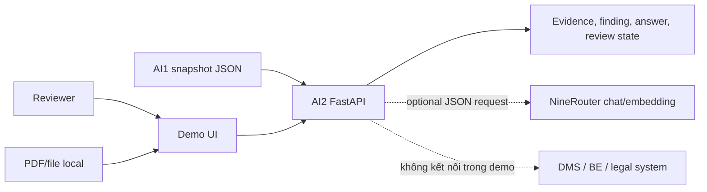
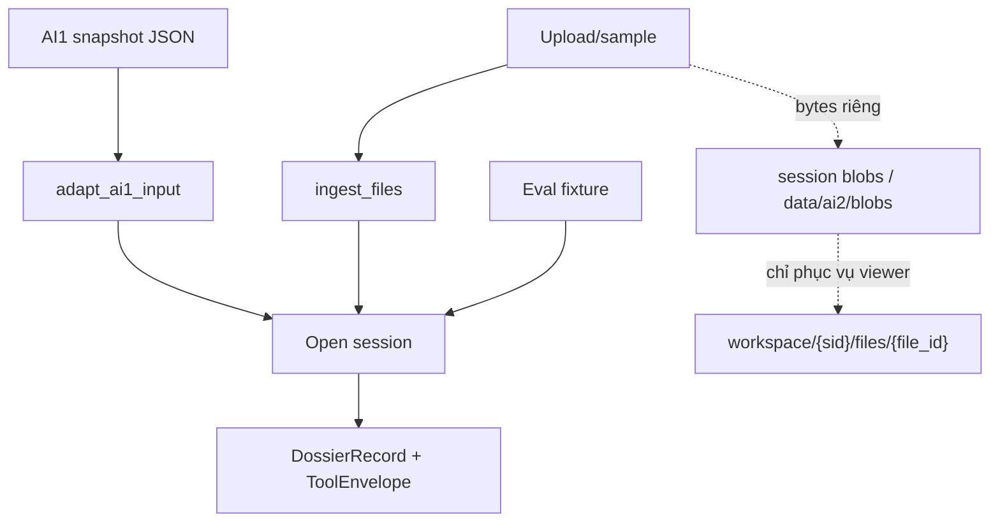
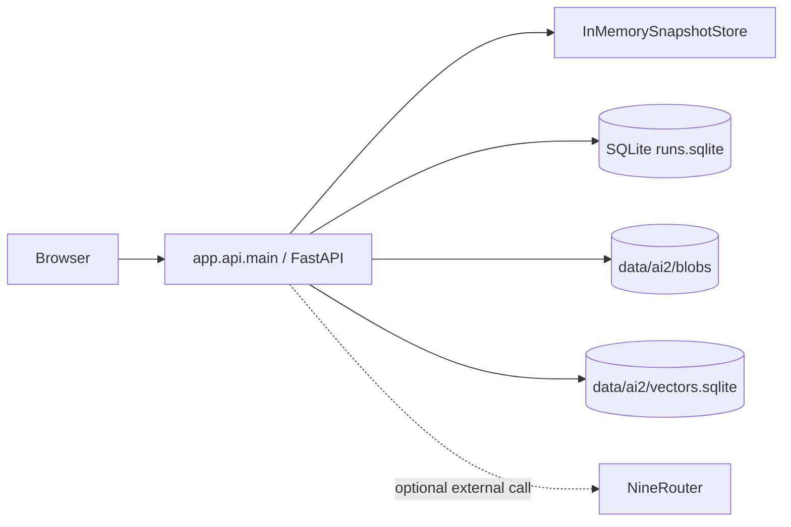
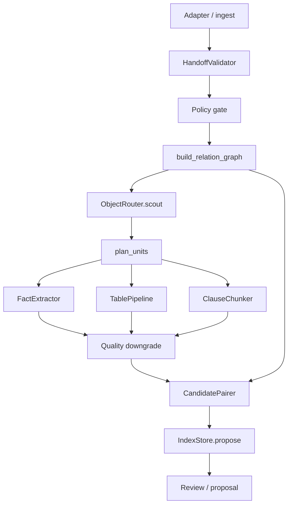
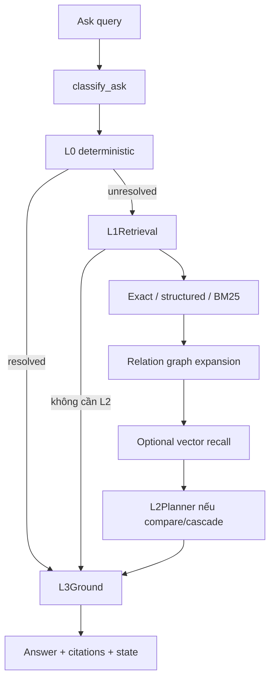
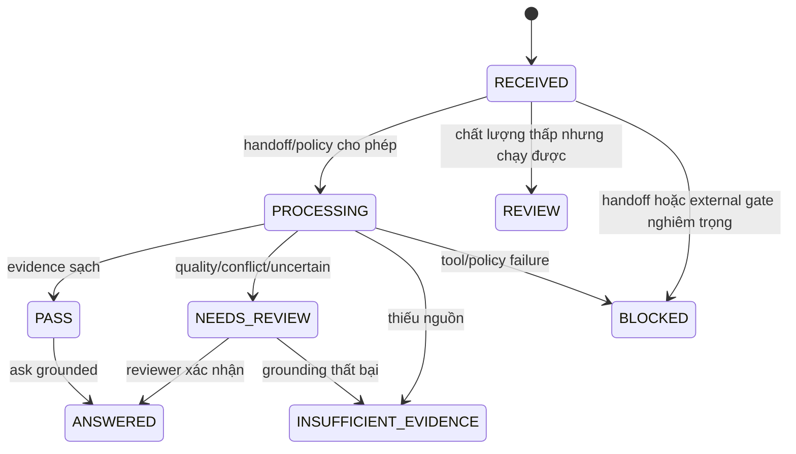

# DOC-04 — Architecture AI2 theo luồng demo hiện tại

**Phiên bản:** v2.0
**Ngày:** 21/09/2026
**Trạng thái:** Current implementation description
**Phạm vi:** `ai-service` chạy local bằng FastAPI/Uvicorn và giao diện demo.

Đây là architecture description của hệ thống đang chạy, không phải production target. Phương pháp tổ chức view xem tại [AI2-architecture-method](AI2-architecture-method.vi.md).

## 1. Phạm vi, stakeholder và nguyên tắc

| Stakeholder | Câu hỏi cần trả lời |
|---|---|
| Reviewer nghiệp vụ | Evidence nằm ở trang/node nào? Có thể kết luận hay cần review? |
| Product owner | Demo hỗ trợ những luồng nào và giới hạn ở đâu? |
| AI2 engineer | Input, pipeline, relation graph, retrieval và grounding nối với nhau thế nào? |
| Operator | LLM/embedding có được gọi không? Vì sao bị `BLOCKED`, `REVIEW` hoặc `INSUFFICIENT_EVIDENCE`? |

Nguyên tắc an toàn:

- AI1 snapshot JSON là nguồn dữ liệu OCR/structure chính của AI2.
- `pdf_bytes` chỉ là blob riêng để viewer mở file trong demo; không đi vào `DossierRecord`, retrieval hoặc prompt.
- Text trong tài liệu là dữ liệu không tin cậy; prompt injection không phải instruction.
- LLM không phải nguồn sự thật và không được tự tạo citation.
- Vector embedding chỉ tìm candidate ở lớp recall; mọi candidate phải qua filter và grounding.
- AI2 chỉ tạo `IndexContribution.publish = "propose"`; không tự đổi active index.

## 2. C0 — Context view

AI2 không phải DMS, hệ thống ký số hoặc hệ thống phán quyết pháp lý. AI2 chỉ đưa ra kết quả grounded/reviewable từ snapshot hiện tại.

## 3. C1 — Input boundary và entrypoint

Demo có ba cách mở một workspace:

| Entry | Route | Hành vi |
|---|---|---|
| Sample/upload | `POST /api/workspace/sample`, `/sample-compare`, `/upload` | Demo gọi `ingest_files`; AI1 giả nằm trong process, blob giữ riêng để viewer |
| AI1 thật | `POST /api/workspace/ai1-snapshot` | `adapt_ai1_input` nhận canonical v1; result envelope và legacy chỉ đi qua compatibility path riêng |
| Evaluation case | `POST /api/workspace/case/{case_id}` | Mở fixture kiểm thử bằng cùng workspace UI |

### 3.1. AI2 nhận gì

Snapshot v1 là document-level wire contract gồm root provenance/execution metadata và `pages[]` với lines, words, tables, geometry, quality, table coverage và warnings. `nodes`, `source_files`, profile, pins nội bộ và AI2 facts không nằm trong wire snapshot; dossier grouping/body-annex mapping chưa thuộc contract AI1–AI2 hiện tại. Schema và semantic validation là gate hiện tại; quarantine vận hành là future phase. `ai2.ocr_edge_cases.v1` không phải handoff payload.

### 3.2. AI2 không nhận gì

- Không đưa nguyên PDF hoặc `pdf_bytes` vào reasoning.
- Không dựng lại word geometry/table cells nếu AI1 không gửi.
- Không coi `tables: []` là “chắc chắn không có bảng” nếu `table_coverage` là `UNKNOWN`.

## 4. C2 — Runtime/deployment view

| Thành phần | Vai trò hiện tại |
|---|---|
| FastAPI/Uvicorn | API workspace, extraction, reasoning, ask, review, publish proposal |
| `InMemorySnapshotStore` | Store record để `ToolGateway` đọc trong process |
| SQLite `runs.sqlite` | Persistence của session, record, job, review và metadata blob |
| `data/ai2/blobs` | Lưu bytes upload riêng cho file viewer |
| SQLite vector index | Lưu evidence segment/vector theo snapshot digest, model, dimension |
| NineRouter | Chat LLM hoặc OpenAI-compatible embedding khi policy/flag cho phép |

Demo hiện chạy synchronous. `plan_units` tạo thứ tự bounded theo page/node để tránh prompt toàn dossier và chuẩn bị cho resume; đây chưa phải distributed worker/checkpoint system.

## 5. C3 — Functional/pipeline view

### 5.1. Extraction sequence

1. Validate policy, lifecycle, pins và handoff.
2. Dựng relation graph từ node, parent, source role và explicit references.
3. Scout outline trước khi lấy nội dung.
4. Chia processing units bounded.
5. Route node thành `FIELD`, `TABLE` hoặc `CLAUSE`.
6. Tạo fact/table rows/chunks có citation.
7. Hạ `review_state` nếu page/node quality không chắc chắn.
8. Pair body–annex theo context, không Cartesian product.
9. Tạo `IndexContribution` và lưu proposal.

### 5.2. Table semantics

- `NOT_PRESENT`: hợp đồng/phụ lục thực sự không có bảng; hợp lệ, không tạo lỗi.
- `DETECTED` nhưng thiếu table/cells: `TABLE_STRUCTURE_UNAVAILABLE`.
- `UNKNOWN`/`UNAVAILABLE`: text có thể chạy degraded, không kết luận về bảng.
- `FAILED`: giữ lỗi extraction; không kết luận là không có bảng.
- Không có cells/geometry: không dựng merged cells, bbox hoặc row structure giả.
- Missing, `-`, `N/A` không bị biến thành zero.

## 6. C3 — Question/reasoning view

### 6.1. L0

Xử lý deterministic cho lookup, field card, party/MST, clause rõ ràng, security/prompt injection, query quá rộng và một số not-comparable case. Nếu giải được thì chỉ đi qua L3 để xác nhận citation.

### 6.2. L1

Ưu tiên exact label, structured key và deterministic semantic/BM25. Với `compare`/`cascade`, L1 thêm ancestor, same-clause và relation graph neighbors. Kết quả tối đa được giới hạn trước khi đóng gói context.

### 6.3. Vector recall

Vector service chỉ được gọi khi request bật `use_vector` và task phù hợp. Segment khoảng 1.600 ký tự, overlap khoảng 200 ký tự; index SQLite lọc theo snapshot digest, model, dimension và metadata. Candidate bị loại nếu node failed, span không còn khớp hoặc citation không hợp lệ.

### 6.4. L2 và L3

- L2 chỉ dùng cho compare/cascade, query không quá rộng và khi LLM/policy cho phép.
- L2 dùng tool allowlist, giới hạn step/replan/context; không gửi full PDF.
- L3 kiểm tra node, page revision, text span, allowed outline, citation và forbidden claim.
- Không đủ evidence: `INSUFFICIENT_EVIDENCE`.
- Quan hệ mơ hồ/conflict: `NEEDS_REVIEW`.
- Policy external bị chặn: `BLOCKED`.

## 7. C4 — Code/component view

| Concern | Implementation hiện tại |
|---|---|
| API/session | `app/api/main.py` |
| AI1 compatibility | `app/pipeline/ai1_snapshot_adapter.py` |
| Handoff | `HandoffValidator` |
| Scout/routing | `ObjectRouter`, `ToolGateway` |
| Extraction | `FactExtractor`, `TablePipeline`, `ClauseChunker` |
| Relation | `build_relation_graph`, `RelationGraph` |
| Pair/proposal | `CandidatePairer`, `IndexStore` |
| Reasoning | `FourLayerReasoner`, `L0Rules`, `L1Retrieval`, `L2Planner`, `L3Ground` |
| Vector | `VectorRecallService`, `SQLiteVectorIndex` |
| Persistence | `persist.py`, `DossierRecord`, `JobResult` |

Không dùng các tên `QueryRouter`, `ReasoningOrchestrator` hoặc `ActiveIndex` như component đã tồn tại; đó chỉ là khái niệm cũ/target nếu xuất hiện trong tài liệu khác.

## 8. API surface chính

| Nhóm | Route |
|---|---|
| Health/UI | `GET /`, `GET /health` |
| Open workspace | `POST /api/workspace/sample`, `/sample-compare`, `/upload`, `/ai1-snapshot`, `/case/{case_id}` |
| Inspect | `GET /api/workspace/{sid}`, `/tree`, `/page/{n}`, `/locate/{node_id}`, `/relation-graph`, `/tables/{table_id}`, `/files/{file_id}` |
| Process | `POST /api/workspace/{sid}/extract`, `/reason`, `/ask` |
| Review | `POST /api/workspace/{sid}/review`, `/publish`; publish hiện chỉ proposal/session state |
| Evaluation | `/api/cases`, `/api/cases/{case_id}/run`, `/query`, `/reason`, `/relation-graph`, `/tables` |
| Job | `GET /jobs/{job_id}` |

## 9. State và policy

Policy split hiện tại:

| Tình huống | Deterministic | External LLM | Vector |
|---|---|---|---|
| Processing budget exceeded | Cho partial/review | Block | Không ảnh hưởng trực tiếp |
| Embedding budget exceeded | Cho chạy không vector | Có thể dùng nếu LLM gate còn mở | `BUDGET_EXCEEDED` |
| Egress denied | Local only | Block | `EGRESS_DENIED` |
| Index leased | Block index write/reasoning theo gate | Block | Không tự bypass |
| LLM không cấu hình | Chạy fallback deterministic/review | Không dùng LLM | Độc lập |

## 10. Giới hạn hiện tại và out of scope

- Không khôi phục geometry/table nếu AI1 không cung cấp.
- Không suy ra nội dung phụ lục bị thiếu.
- Không chọn “bên thắng” về mặt pháp lý.
- Không có production ACL/DMS/BE/worker/Postgres trong demo.
- Không có active index publish thật; chỉ proposal.
- Không coi fixture hoặc live test là bằng chứng OCR thật đã được nghiệm thu.

## 11. Liên kết view

- [AI2 architecture method](AI2-architecture-method.vi.md)
- [AI2-05 component/SDD view](AI2-05-architecture.vi.md)
- [AI2-08 C0–C4 view](AI2-08-architecture-c0-c4.vi.md)
- [AI2-09 AI1 handoff](AI2-09-ai1-snapshot-handoff.vi.md)
- [AI2-10 detailed current flow](AI2-10-current-flow.vi.md)
- Sơ đồ Mermaid sẽ được tổ chức lại trong đợt chuẩn hóa diagrams tiếp theo.
