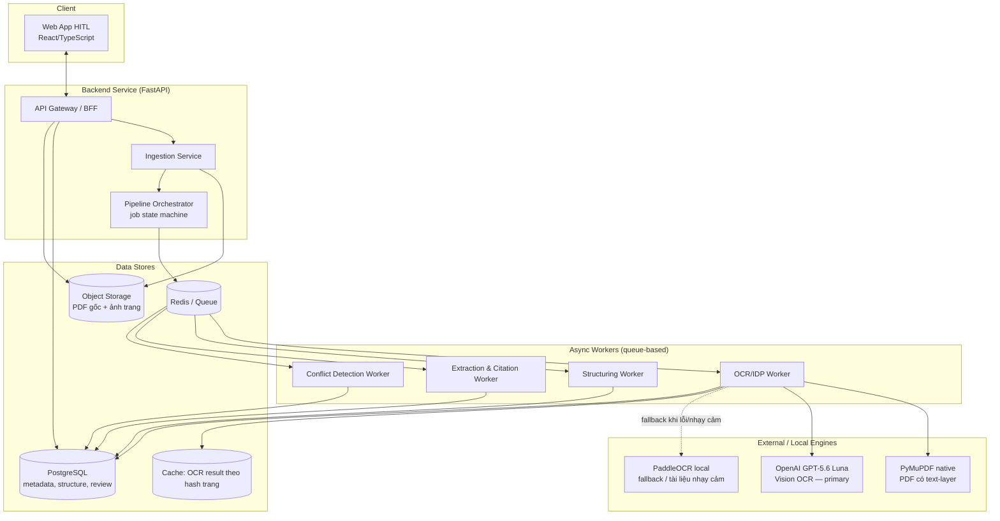
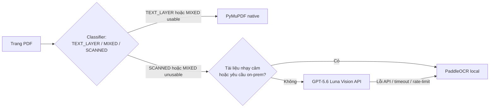
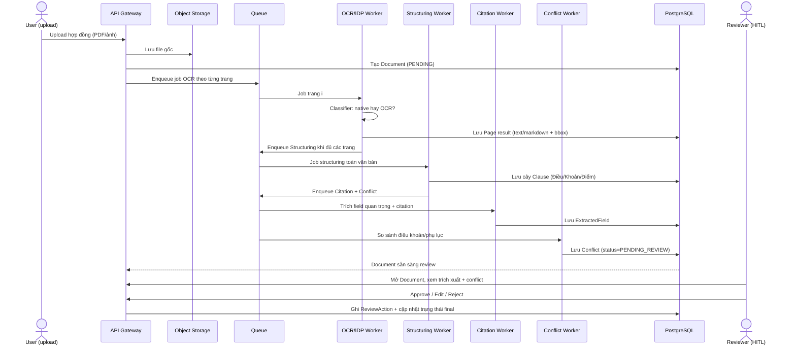
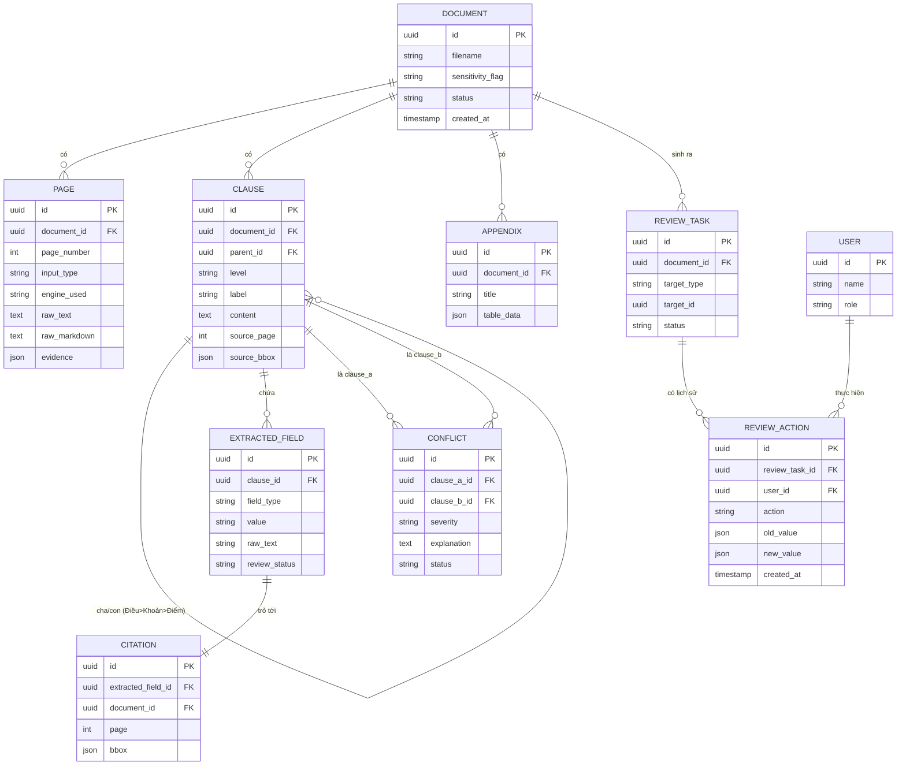

# DOC-04 — Kiến trúc hệ thống: Contract Intelligence (PROD-01)

| | |
|---|---|
| **Dự án** | Contract Intelligence — PROD-01 (VSF OJT Batch 3) |
| **Phiên bản** | 0.1 — Draft |
| **Trạng thái** | Chờ Mentor review (theo quy tắc §III.5 — phải duyệt kiến trúc trước khi code) |
| **Phạm vi** | Toàn bộ hệ thống sản phẩm (Sprint 2–3), kế thừa spike OCR Sprint 1 (`contract-ocr-lab`) |
| **Quyết định đã chốt** | Engine OCR chính = **OpenAI GPT-5.6 "Luna" (Lunar Light)** — vision API, bản rẻ/nhẹ của dòng GPT-5.6 |

> Tài liệu này mô tả kiến trúc cho **toàn bộ sản phẩm** Contract Intelligence. Nó khác với [`docs/ARCHITECTURE.md`](ARCHITECTURE.md), vốn chỉ mô tả spike benchmark OCR nội bộ của Sprint 1 (không service, không DB, không frontend). Tài liệu này **mở rộng** codebase Sprint 1 (`src/contract_ocr/`) thành một hệ thống có backend service, database, hàng đợi xử lý bất đồng bộ và web UI HITL.

---

## 1. Mục tiêu & phạm vi

Xây dựng hệ thống xử lý hợp đồng thương mại (PDF số hoặc bản scan) qua 4 năng lực cốt lõi đã chốt trong Product Vision:

1. Trích xuất văn bản (OCR) & bóc tách cấu trúc: Chương/Điều → Khoản → Điểm, bảng phụ lục.
2. Trích dẫn (citation) các giá trị quan trọng — mỗi giá trị trích xuất phải trỏ ngược được về đúng trang/vị trí trong văn bản gốc.
3. Phát hiện xung đột giữa các điều khoản trong cùng hợp đồng, và giữa hợp đồng với phụ lục.
4. Quy trình đánh giá HITL qua giao diện web: người review duyệt/sửa/từ chối kết quả máy trích xuất.

Tài liệu này **không** đặc tả chi tiết từng API (xem `API_SPEC.md` — DOC-05, làm sau khi kiến trúc được duyệt) và không mô tả UI wireframe chi tiết (thuộc PRD/Frontend).

---

## 2. Nguyên tắc thiết kế

- **Native-first, OCR-second.** PDF có text-layer dùng thẳng (PyMuPDF), không gọi OCR/LLM — tái dùng nguyên bộ phân loại trang (`classify_pdf.py`) đã build và đo ở Sprint 1. Đây là cơ chế kiểm soát chi phí quan trọng nhất vì GPT-5.6 Luna tính phí theo ảnh/token.
- **Không bịa nội dung (anti-hallucination).** Mọi engine OCR/LLM dùng chung system prompt cấm đoán chữ không đọc được, bắt buộc đánh dấu `[illegible]` — tái dùng `infrastructure/ocr/prompts.py` đã có và đã test trên ảnh scan mờ.
- **Con người là lưới an toàn cuối (HITL).** Structuring, trích dẫn, phát hiện xung đột đều là suy luận LLM — có thể sai. Không có trạng thái "tự động duyệt final" cho các trường quan trọng (tiền, ngày, mã số thuế, số điều khoản) mà chưa qua review.
- **Kiến trúc phân lớp (đã có sẵn, giữ nguyên).** Tái sử dụng `domain / application / infrastructure` (Clean Architecture) của `contract_ocr` thay vì viết lại — thêm các port/adapter mới (structuring, conflict detection, HITL) theo đúng pattern hiện có thay vì tạo kiến trúc song song.
- **Engine có thể thay được.** OCR/structuring engine đứng sau một `port` (interface); đổi model (vd. Luna → Terra, hoặc thêm Gemini) không được phép làm thay đổi orchestration — bài học rút ra trực tiếp từ việc Sprint 1 đã phải hỗ trợ 5 engine OCR song song.
- **Không tự thiết kế lại cái đã đo.** Routing native/OCR, contract JSON schema, cơ chế inverse-map bbox giữ nguyên từ Sprint 1; kiến trúc mới chỉ cộng thêm các bước xử lý *sau* OCR.

---

## 3. Kiến trúc tổng quan (Container view)

**Vì sao có Worker/Queue thay vì gọi đồng bộ trong request?** OCR qua vision API + LLM structuring cho một hợp đồng nhiều trang có thể mất hàng chục giây đến vài phút (Sprint 1 đo PaddleOCR CPU vài phút/trang, GPT-5.6 Terra ~9s/trang tuần tự, nhanh hơn khi chạy song song nhiều trang). Xử lý trong HTTP request là không khả thi cho hợp đồng dài; cần hàng đợi + trạng thái job mà frontend poll hoặc nhận qua WebSocket.

---

## 4. Quyết định lựa chọn OCR Engine

### 4.1 Bảng so sánh (kế thừa số liệu đo ở Sprint 1)

| Engine | Vị trí chạy | Chi phí | Tốc độ | Ghi chú |
|---|---|---|---|---|
| PyMuPDF (native) | Local | Miễn phí | Rất nhanh | Chỉ dùng được khi PDF có text-layer thật; không phải OCR |
| PaddleOCR PP-OCRv6 | Local CPU | Miễn phí (tốn compute) | Chậm trên CPU (vài chục giây–vài phút/trang) | Không rời máy → an toàn cho tài liệu nhạy cảm; là fallback bắt buộc |
| DeepSeek-OCR-2 | Local GPU (CUDA) | Miễn phí (cần GPU) | Nhanh nếu có GPU | Team hiện không có máy GPU NVIDIA sẵn sàng → **không chọn làm chính** |
| Gemini 3 Flash | API ngoài | Trả phí | ~30s/trang | Độ chính xác dấu tiếng Việt tốt trong test nội bộ, nhưng ngoài phạm vi quyết định lần này |
| **GPT-5.6 Terra** | API ngoài | ~$2/1M input – $12/1M output | ~9s/trang (tuần tự), ~53s cho 6 trang chạy song song | Bản giữa dòng, dùng làm baseline Sprint 1 |
| **GPT-5.6 Luna (Lunar Light) — ĐÃ CHỌN** | API ngoài | ~$0.20/1M input – $1.20/1M output (~10x rẻ hơn Terra) | Tương đương hoặc nhanh hơn Terra (model nhẹ hơn) | Cùng adapter, cùng system prompt chống bịa; đổi qua tham số `model`, không cần code mới |

### 4.2 Lý do chọn Luna thay vì Terra

- Chi phí trên mỗi trang là chi phí vận hành lặp lại (không phải chi phí một lần) — với khối lượng hợp đồng nhiều trang + phụ lục, chênh lệch ~10x giữa Terra và Luna là đáng kể cho một dự án OJT không có ngân sách API lớn.
- Adapter `openai_vision_ocr.py` đã hỗ trợ đổi model qua config (`model=`) mà không cần sửa code — rủi ro kỹ thuật khi hạ cấp model gần như bằng 0.
- Cùng chịu ràng buộc API `gpt-5.6+` (dùng `max_completion_tokens`, không chỉnh `temperature`) — adapter đã xử lý sẵn.
- Rủi ro chính là **độ chính xác thấp hơn Terra trên chữ nhỏ/mờ** (model nhẹ hơn) — đây là lý do bắt buộc phải có bước đo lại CER/WER trên bộ 30 mẫu gán nhãn trước khi chốt dùng Luna cho production (xem §13, §16 — cần dữ liệu benchmark thật trước khi merge, đúng tinh thần Sprint 1: "Sprint 2: … quyết định engine bằng dữ liệu đo thực").

### 4.3 Chiến lược routing (không đổi so với Sprint 1, chỉ đổi engine đích)

- Cờ "tài liệu nhạy cảm" là một trường trên job (do người upload đánh dấu, hoặc do policy khách hàng quy định) — quyết định có gửi ảnh trang ra ngoài OpenAI hay không. Đây là điểm **bắt buộc phải có** trước khi lên production, khác với Sprint 1 chỉ cảnh báo bằng tài liệu (README).
- Cache kết quả OCR theo hash nội dung trang (SHA-256 ảnh render) để tránh gọi lại API khi retry pipeline hoặc khi phụ lục trùng lặp giữa nhiều hợp đồng mẫu.

---

## 5. Chi tiết các thành phần

### 5.1 Ingestion Service
- Nhận upload PDF/ảnh, validate định dạng và kích thước, lưu file gốc vào Object Storage, tạo bản ghi `Document` ở trạng thái `PENDING`.
- Tách trang thành job con, đẩy vào queue theo đúng thứ tự trang.

### 5.2 OCR/IDP Worker
- Tái sử dụng `application/use_cases/classify_pdf.py` và `process_document.py` từ Sprint 1.
- Thêm adapter routing theo cờ nhạy cảm (§4.3).
- Output: JSON theo canonical schema đã có (`schemas/output.py`, `docs/output.schema.json`) — **không đổi schema OCR cấp trang**, chỉ thêm các bảng mới ở tầng structuring phía sau.

### 5.3 Structuring Engine (mới)
- Input: text/markdown thô theo trang (kể cả `raw_markdown` từ Luna) + geometry có sẵn.
- Dùng LLM (cùng model Luna, hoặc model text-only rẻ hơn nếu tách được OCR khỏi structuring) để bóc tách cây: `Chương → Điều → Khoản → Điểm`, và bảng trong phụ lục thành dạng có cấu trúc (rows/columns).
- Output ghi vào bảng `Clause` (§7) với `parent_id` tạo cây, giữ `source_page` + `source_bbox` để phục vụ trích dẫn.

### 5.4 Extraction & Citation Worker (mới)
- Trích các trường quan trọng đã biết loại: số tiền, ngày tháng, mã số thuế, số điều khoản tham chiếu, tên các bên.
- Mỗi field trích ra bắt buộc có `citation`: `{document_id, page, bbox | clause_id}` trỏ về đúng vị trí nguồn — đây là yêu cầu tính năng #2 (Trích dẫn), không phải tùy chọn.
- Áp dụng cùng nguyên tắc "không bịa": field không tìm thấy → để trống + lý do, không suy đoán.

### 5.5 Conflict Detection Worker (mới)
- So sánh cặp điều khoản (trong hợp đồng, và hợp đồng ↔ phụ lục) bằng kết hợp: lọc ứng viên theo embedding similarity trên cùng loại field (vd. cùng nói về "thời hạn thanh toán"), sau đó dùng LLM làm "judge" phán đoán có mâu thuẫn hay không, kèm giải thích.
- Output: bản ghi `Conflict` với `clause_a_id`, `clause_b_id`, `severity`, `explanation`, `status` (chờ review).
- Đây là bước có rủi ro false-positive cao nhất → luôn đi qua HITL, không tự động hiển thị là "lỗi hợp đồng" chưa qua người duyệt.

### 5.6 HITL Review Module
- Hàng đợi review theo `Document` hoặc theo `Conflict`/`ExtractedField` riêng lẻ.
- Reviewer: xem trang gốc (ảnh) song song với giá trị trích xuất, bấm chọn Approve / Edit / Reject; sửa tay được ghi đè lên bản máy trích xuất và lưu lịch sử (audit trail — ai sửa, khi nào, giá trị cũ/mới).
- Đây là nơi thu thập dữ liệu để sau này đánh giá lại độ chính xác của Luna so với Terra bằng dữ liệu thật (không phải dataset tổng hợp).

### 5.7 API Gateway / BFF
- REST API cho web app: upload, lấy trạng thái job, lấy cây cấu trúc + citation, danh sách conflict, submit review action.
- Đặc tả chi tiết thuộc DOC-05 (API Spec), làm sau khi kiến trúc này được duyệt.

---

## 6. Luồng dữ liệu end-to-end

---

## 7. Mô hình dữ liệu

`field_type` gợi ý ban đầu: `MONEY`, `DATE`, `TAX_CODE`, `PARTY_NAME`, `CLAUSE_REF` — khớp với `ground_truth_critical_fields` đã dùng ở Sprint 1 (`MONEY`, v.v.), để có thể tái dùng annotation cũ khi đánh giá lại.

---

## 8. Ngăn xếp công nghệ

| Lớp | Lựa chọn | Lý do |
|---|---|---|
| Backend API | FastAPI (Python) | Đã dùng ở Sprint 1 (`web/app.py`), team đã quen |
| Async job | Redis + RQ hoặc Celery | Nhẹ, đủ cho khối lượng OJT, dễ vận hành với 1 backend engineer |
| Database | PostgreSQL | Hỗ trợ JSON field (bbox, evidence) + quan hệ cây (Clause) |
| Object Storage | Local disk (dev) → S3-compatible (MinIO/S3) khi lên staging | Không cần hạ tầng phức tạp cho quy mô OJT |
| OCR engine chính | OpenAI GPT-5.6 Luna (vision) | Quyết định của dự án (mục tiêu tài liệu này) |
| OCR engine fallback | PaddleOCR PP-OCRv6 (local) | Tài liệu nhạy cảm / khi API lỗi — đã có adapter |
| Structuring/Citation/Conflict | LLM (cùng nhà cung cấp OpenAI để đơn giản hoá vận hành key/billing) | Tái dùng client OpenAI đã có, giảm số lượng tích hợp bên ngoài |
| Frontend HITL | React + TypeScript (Vite) | Team Leader là Frontend Engineer; cần state phức tạp (diff viewer, review queue) hơn mức 1 file HTML tĩnh của Sprint 1 |
| Kiến trúc code | Clean Architecture (domain/application/infrastructure) | Giữ nguyên pattern đã có trong `contract_ocr` |

---

## 9. Bảo mật & quyền riêng tư

Đây là rủi ro lớn nhất khi chuyển từ spike sang production, vì **hợp đồng thương mại thật là dữ liệu nhạy cảm** và GPT-5.6 Luna là **API bên thứ ba** (ảnh trang rời khỏi hạ tầng nội bộ).

- **Bắt buộc có cờ sensitivity ở cấp Document**, mặc định an toàn (coi là nhạy cảm) trừ khi người dùng/khách hàng xác nhận rõ ràng là được phép gửi ra ngoài.
- Tài liệu đánh dấu nhạy cảm **luôn** route qua PaddleOCR local, không có ngoại lệ, không phụ thuộc lỗi cấu hình FE/BE (kiểm tra ở tầng OCR Worker, không chỉ ở UI).
- Không log nội dung văn bản trong log vận hành (structured log chỉ chứa metadata: run/document/page/engine/status) — tái dùng nguyên tắc đã áp dụng ở Sprint 1.
- API key OpenAI lưu qua secret manager/biến môi trường, không commit vào repo (đã có `.gitignore` cho `.env`).
- Cân nhắc: cấu hình OpenAI ở chế độ không lưu dữ liệu để training (zero data retention), xác nhận với Mentor/khách hàng trước khi bật engine ngoài cho dữ liệu thật — **đây là câu hỏi mở, cần Mentor duyệt** (xem §13).
- Kiểm soát truy cập review: role-based (Reviewer chỉ thấy tài liệu được gán), audit trail đầy đủ cho mọi ReviewAction.

---

## 10. Hiệu năng, chi phí & khả năng mở rộng

- **Kiểm soát chi phí:** native-first routing là cơ chế giảm chi phí chính; cache theo hash trang là cơ chế thứ hai (tránh OCR lại phụ lục lặp giữa nhiều hợp đồng mẫu cùng loại).
- **Song song hoá:** các trang gọi GPT-5.6 Luna là API không trạng thái → xử lý song song nhiều trang/nhiều job (giới hạn qua số worker, tương tự `WEB_MAX_WORKERS` ở Sprint 1). PaddleOCR local chỉ có 1 model dùng chung → giữ tuần tự.
- **Giới hạn tốc độ (rate limit):** cần retry có backoff khi OpenAI trả lỗi 429; hàng đợi giúp hấp thụ burst khi nhiều hợp đồng được upload cùng lúc.
- **Quy mô OJT:** không cần Kubernetes/microservices tách rời — 1 service backend + 1–2 loại worker process là đủ cho 5 tuần triển khai còn lại (Sprint 2–3) và đúng năng lực đội (1 backend engineer).

---

## 11. Triển khai & môi trường

- **Dev:** chạy local bằng Docker Compose (Postgres + Redis + backend + worker), giữ nguyên cách chạy 2 server độc lập (backend API port riêng, frontend riêng) như Sprint 1 để dễ debug.
- **Staging/Prod (nếu kịp Sprint 3):** container hoá tương tự, deploy lên VM đơn hoặc dịch vụ container đơn giản — không over-engineer cho một sản phẩm OJT chưa có tải thật.
- **Repository:** chỉ dùng GitHub repo do Mentor cấp (theo quy tắc §III.5); mọi thay đổi kiến trúc phải qua PR có review trước khi merge vào nhánh chính.

---

## 12. Observability & vận hành

- Structured logging theo `run/document_id/page/engine/status` (không chứa nội dung), kế thừa nguyên tắc Sprint 1.
- Theo dõi chi phí API theo document (số trang gọi Luna × đơn giá) để có số liệu thật báo cáo Sprint Review, tránh lặp lại tình trạng "chi phí GPU/CPU chưa ước tính" đã ghi nhận ở Sprint 1.
- Theo dõi tỉ lệ SUCCESS/FAILED/SKIPPED theo engine — tái dùng logic phân loại trạng thái đã có trong `reporting.py`.

---

## 13. Rủi ro & phương án giảm thiểu

| Rủi ro | Ảnh hưởng | Giảm thiểu |
|---|---|---|
| GPT-5.6 Luna kém chính xác hơn Terra trên chữ nhỏ/mờ | Sai lệch số tiền/ngày tháng — nghiêm trọng cho hợp đồng | Bắt buộc benchmark CER/WER trên bộ 30 mẫu đã gán nhãn trước khi chốt dùng Luna cho production; giữ khả năng đổi lại Terra qua config (đã hỗ trợ sẵn) |
| Gửi ảnh hợp đồng thật ra ngoài OpenAI | Rò rỉ dữ liệu khách hàng | Cờ sensitivity bắt buộc + route cứng qua PaddleOCR cho tài liệu nhạy cảm; xác nhận chính sách zero-retention với Mentor |
| LLM structuring/conflict detection "bịa" mâu thuẫn hoặc cấu trúc sai | Mất niềm tin người dùng, quyết định sai | Bắt buộc qua HITL trước khi coi là final; system prompt chống bịa dùng chung mọi engine |
| Phụ thuộc một nhà cung cấp (OpenAI) cho cả OCR lẫn LLM structuring | Rủi ro downtime/đổi giá/đổi tên model (đã từng xảy ra với Gemini ở Sprint 1) | Engine đứng sau port/interface, đổi model qua config, không đổi orchestration |
| Chi phí vượt ngân sách nếu không có native-first routing | Tốn tiền không cần thiết | Routing native-first là mặc định bắt buộc, không tùy chọn tắt ở production |
| Timeline ngắn (Sprint 2–3, ~4 tuần) cho khối lượng kiến trúc lớn | Không kịp | Ưu tiên build thẳng theo Clean Architecture đã có, không viết lại; HITL UI có thể bắt đầu bằng bản tối giản rồi hoàn thiện ở Sprint 3 |

---

## 14. Ngoài phạm vi (Out of scope) — bản nháp để thống nhất trong Product Vision

- Huấn luyện/fine-tune model OCR riêng.
- Ký số điện tử, tích hợp ERP/CRM của khách hàng.
- Ứng dụng mobile (chỉ web).
- Xử lý ngôn ngữ ngoài tiếng Việt/tiếng Anh.
- Tự động "quyết định cuối" không qua HITL cho các trường quan trọng.

*(Mục này cần được đội thống nhất chính thức trong tài liệu Product Vision — DOC-01, không phải quyết định riêng của kiến trúc.)*

---

## 15. Ánh xạ theo Sprint

- **Sprint 1 (đã xong):** spike `contract-ocr-lab` — routing native/OCR, adapter đa engine, schema OCR, anti-hallucination prompt.
- **Sprint 2:** dựng khung service (API + DB + queue), chuyển adapter GPT-5.6 Luna vào pipeline thật, build Structuring + Citation worker, HITL UI bản tối giản (approve/reject).
- **Sprint 3:** Conflict Detection worker, HITL UI đầy đủ (edit, audit trail), benchmark Luna vs Terra trên dữ liệu thật, hoàn thiện bảo mật (cờ sensitivity, secret management), chuẩn bị production-ready.

---

## 16. Câu hỏi mở cần Mentor duyệt trước khi code (theo quy tắc §III.5)

1. Có được phép gửi ảnh hợp đồng thật (không chỉ dữ liệu demo) ra OpenAI API khi đã có xác nhận "không nhạy cảm" từ khách hàng/Mentor không, hay bắt buộc PaddleOCR-only cho mọi dữ liệu thật trong giai đoạn OJT?
2. Ngân sách API cho Sprint 2–3 là bao nhiêu — có đủ cho benchmark Luna vs Terra trên toàn bộ 30 mẫu, cộng chi phí structuring/conflict detection (cũng dùng LLM)?
3. Hạ tầng triển khai staging/prod: dùng máy chủ nào (Mentor cấp hay tự dựng), có Docker sẵn không?
4. Cấu trúc bảng phụ lục có bắt buộc giữ định dạng gốc (merged cells, v.v.) hay chỉ cần trích đúng nội dung theo hàng/cột logic?

---

### Tài liệu liên quan
- [`docs/ARCHITECTURE.md`](ARCHITECTURE.md) — kiến trúc chi tiết pipeline OCR nội bộ (Sprint 1 spike), vẫn đúng ở tầng OCR Worker của tài liệu này.
- [`docs/OUTPUT_SCHEMA.md`](OUTPUT_SCHEMA.md) / `docs/output.schema.json` — schema JSON cấp trang, không đổi.
- `src/contract_ocr/infrastructure/ocr/openai_vision_ocr.py` — adapter OpenAI, đổi `DEFAULT_MODEL` sang `gpt-5.6-luna` khi triển khai (hoặc truyền `model="gpt-5.6-luna"` qua config, không cần sửa code).
