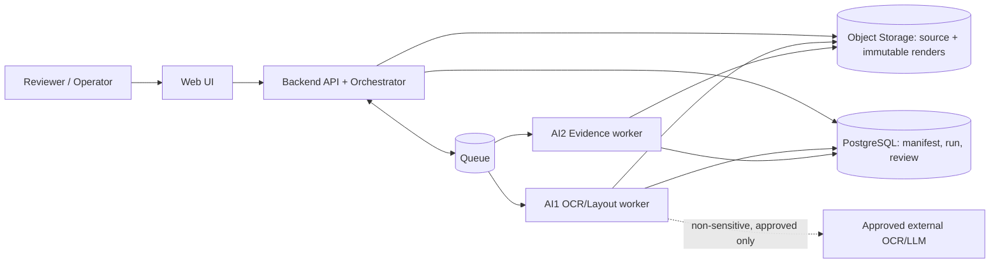

# DOC-04 v0.4 — Thiết kế hệ thống: Contract Intelligence (PROD-01)

| Thuộc tính | Nội dung |
|---|---|
| **Trạng thái** | Draft chờ team và Mentor review; chưa là phê duyệt để bắt đầu product code |
| **Thay thế** | `DOC-04-v0.3-system-design.md`; v0.3 được giữ nguyên để audit |
| **Phạm vi** | Contract data model, AI1→AI2 provenance, AI2 domain, HITL và lifecycle cho Sprint 2–3 |
| **Nguyên tắc** | Không claim quality/cost/production readiness trước Gate B có source, audit và run log thật |

## 1. Mục tiêu và ranh giới ownership

Hệ thống nhận một **dossier** gồm một contract và 0..n annexes, OCR/layout các document, trích structure/facts có evidence, phát hiện candidate khác biệt/mâu thuẫn và cho reviewer quyết định.

| Owner | Trách nhiệm | Không sở hữu |
|---|---|---|
| AI1 | PDF intake OCR/layout snapshot, raw text, geometry, table, render artifact | Fact nghiệp vụ, conflict, legal/precedence decision |
| AI2 | Validate snapshot; clause/fact/context/citation; structured + semantic candidate; evaluation semantics | OCR nguồn, dossier role, persistence/API/auth |
| Backend | Manifest, database, job/batch, API, idempotency, RBAC, revision CAS | Tự suy luận content nghiệp vụ |
| Frontend | Viewer hai nguồn, bbox transform, review/bbox-edit UI | Tự tính provenance/current review state |
| Leader/Mentor/Reviewer | Dossier policy, reviewer/adjudicator, external-data policy, acceptance | Để máy kết luận hiệu lực pháp lý |

AI2 không suy `CONTRACT`/`ANNEX` từ filename/upload order, không overwrite raw OCR, và không gọi finding là legal advice.

### 1.1 Container và data flow



1. Backend nhận dossier, tạo manifest `PENDING_CONFIRMATION`, lưu source kín và enqueue intake/OCR sau khi role policy hợp lệ.
2. AI1 tạo snapshot/render immutable; Backend lưu metadata và enqueue `VALIDATE_SNAPSHOT`.
3. AI2 validator chỉ nhận snapshot `READY`; sau đó tạo clause, fact, semantic claim, finding run và evidence refs.
4. Backend phục vụ read model cho FE; FE chỉ render source/evidence và gửi ReviewRevision. Backend kiểm tra CAS, RBAC và append-only history.
5. Snapshot/source missing, partial hoặc policy-blocked không bị che giấu: PipelineRun thể hiện `WAITING_FOR_AI1`/`PARTIAL_FAILED`/`QUARANTINED` cùng reason.

API wire format do Backend/API Spec chốt, nhưng mọi request/query liên quan processing phải dùng `dossier_id`, `manifest_id`, `pipeline_run_id` và versioned evidence refs; không dùng `document_id` đơn lẻ làm unit xử lý liên-document.

## 2. Aggregate dossier và manifest bất biến

`Dossier` là aggregate xử lý. `Document` là file vật lý và chỉ thuộc một dossier trong MVP.

```text
Dossier(id, tenant_id, status, created_at, batch_id?)
  └─ DossierManifest(id, dossier_id, version, status, created_by, created_at)
       └─ ManifestDocument(document_id, role, upload_order, annex_no?, effective_date?,
                           relationship_source, relationship_citation_ids[])
```

- `role ∈ {CONTRACT, ANNEX}`; manifest cần đúng một contract trước khi AI2 compare liên document.
- `relationship_source ∈ {USER_DECLARED, SOURCE_EVIDENCE}`; nguồn tự khai phải giữ actor/timestamp, nguồn trong văn bản phải có citation.
- Mỗi `ExtractionRun`/`FindingRun` pin chính xác `manifest_id` và version. Thiếu manifest hoặc annex relation chưa xác nhận: AI2 chỉ trích fact nội bộ document, trả `BLOCKED_MANIFEST` cho cross-document compare.
- Scope: `WITHIN_DOCUMENT`, `CONTRACT_ANNEX`, `ANNEX_ANNEX` luôn yêu cầu các document cùng dossier/manifest version.

## 3. AI1 snapshot và geometry contract

### 3.1 Snapshot canonical

AI1 bàn giao `ai1.snapshot.v1`, immutable theo document:

```text
OcrSnapshot(snapshot_id, schema_version, dossier_id, document_id, source_digest,
            engine_name, engine_version, model_version?, prompt_version?,
            page_count, processing_ms, created_at, status)
  └─ PageSnapshot(page_no, input_type, status, text_raw, text_digest,
                  warnings[], error_code?, error_message?)
       ├─ PageRender(render_id, render_uri, render_digest, upright_width_px,
       │             upright_height_px, source_page_index, rotation_degrees,
       │             renderer_version, render_profile, transform_spec)
       ├─ OcrLine(line_id, line_index, text_raw, page_char_start, page_char_end,
       │           bbox_normalized, word_ids[], language?)
       ├─ OcrWord(word_id, line_id, text, char_start, char_end,
       │           bbox_normalized, confidence?)
       ├─ Block(block_id, line_ids[], reading_order, language?, bbox_normalized)
       └─ TableFragment(table_fragment_id, logical_table_id, bbox_normalized,
                        rows[])
```

`input_type ∈ {TEXT_LAYER, SCANNED_OCR, MIXED}`; `status ∈ {SUCCESS, PARTIAL, FAILED}`. `MIXED` phải khai báo ở page level. Re-OCR luôn tạo snapshot mới; snapshot/render cũ không bị update hoặc thay URI nội dung.

### 3.2 Geometry invariants

- Bbox duy nhất dùng shape `[x0, y0, x1, y1]`, với `0 ≤ x0 < x1 ≤ 1`, `0 ≤ y0 < y1 ≤ 1`.
- Origin là top-left của `PageRender` upright; `upright_width_px`/`upright_height_px` là kích thước dùng để render overlay. Không xoay lần hai ở FE/AI2.
- Offsets là Unicode code point, 0-based/end-exclusive, tính trên `OcrLine.text_raw`. Mọi consumer JavaScript dùng `Array.from(text)` để cắt span.
- `PageSnapshot.text_raw` phải reconstruct được từ ordered lines theo delimiter đã công bố; `text_digest` kiểm chứng invariant này.
- Bbox/line/word/table ref chỉ hợp lệ trong `snapshot_id` chứa chúng. Backend validate `document_id` của citation phải trùng document của snapshot.

### 3.3 Table và clause region

```text
Table(logical_table_id, snapshot_id, document_id)
  └─ TableFragment(page_no, fragment_id, bbox_normalized)
       └─ TableRow(row_id, row_index, cells[])
            └─ TableCell(cell_id, col_index, text_raw, bbox_normalized,
                         rowspan, colspan, header_cell_ids[], line_ids[], citation_ids[])

Clause(clause_id, extraction_run_id, document_id, parent_clause_id?, level, label,
       title?, text_raw, citation_ids[])
  └─ ClauseRegion(region_id, page_no, bbox_normalized, line_ids[])
```

AI1 gửi table/line/word geometry; mỗi cell phải giữ `line_ids[]` tương ứng với raw text để citation vẫn resolve qua OCR line/span. AI2 tạo semantic clause và clause regions từ line refs nếu AI1 chưa có region. Một clause/table nhiều trang có nhiều region/fragments; không gộp bbox qua trang. Mỗi Clause/TableCell được công bố ra UI phải có ít nhất một citation resolve được.

## 4. Citation, fact và semantic claim

### 4.1 Citation đa thành phần

```json
{
  "citation_id": "cit-amount-01",
  "snapshot_id": "snapshot-contract-01",
  "document_id": "contract-01",
  "components": [
    {
      "page_no": 3,
      "line_id": "p3-l15",
      "char_start": 22,
      "char_end": 37,
      "word_ids": ["p3-w78", "p3-w79"],
      "bbox_refs": [
        {"type": "word", "id": "p3-w78"},
        {"type": "word", "id": "p3-w79"}
      ]
    }
  ]
}
```

`bbox_refs.type ∈ {LINE, WORD, CLAUSE_REGION, TABLE, TABLE_CELL}`. Citation có thể nhiều component để biểu diễn value/context qua nhiều dòng hoặc trang. Mỗi component luôn có `line_id` và raw span; citation table cell thêm `TABLE_CELL` ref, không thay line/span bằng cell bbox. UI highlight toàn bộ component theo đúng page riêng.

### 4.2 Facts

```text
ExtractionRun(id, manifest_id, snapshot_ids[], rule_version, normalizer_version,
              producer_version, status, created_at)
Fact(id, extraction_run_id, entity_type, business_role, raw_value,
     normalized_value?, normalization_reason?, context, citation_ids[], context_citation_ids[],
     clause_id?, table_cell_id?, status)
```

`entity_type ∈ {PRICE, QUANTITY, DATE, DURATION, PARTY, TAX_CODE, REFERENCED_CONTRACT_NUMBER}`. Nếu text không đọc rõ, giữ raw observation/citation khi có nhưng `normalized_value=null` và reason `UNREADABLE`/`AMBIGUOUS`; citation không resolve là integration failure riêng, không được đổi thành value đúng.

Fact được dùng để compare phải có ít nhất một citation resolve được. `context` gồm subject, unit, currency, VAT basis, applicability scope, validity start/end và `context_origin`. Context quan trọng phải có `context_citation_ids`, không mượn citation của value.

### 4.3 Semantic claims

Semantic không dùng bảy structured fact thay thế. AI2 tạo:

```text
SemanticClaim(id, extraction_run_id, clause_id, subject, action, object, recipient,
              modality, polarity, time, conditions, citation_ids[], status, reason?)
```

Claim thiếu subject/action/condition cần thiết có `status=INSUFFICIENT_EVIDENCE`; không được semantic judge thành conflict chỉ vì có từ phủ định.

## 5. Comparison và finding

### 5.1 Compatibility gate

Trước pairing/comparison, AI2 phải kiểm role nghiệp vụ, subject, unit, currency, VAT, scope và validity. Khác context trả `not_comparable`; thiếu value/context/citation trả `insufficient_evidence`. Pair identity canonical gồm left/right source, scope, family, finding type và policy version để rerun không tạo finding đảo chiều/trùng.

### 5.2 Finding bất biến

```text
FindingRun(id, manifest_id, extraction_run_ids[], snapshot_ids[], pair_policy_version,
           rule_version, execution_status, created_at)
Finding(id, finding_run_id, dossier_id, family, finding_type, comparison_scope,
        model_disposition, severity?, explanation, left_fact_or_claim_id,
        right_fact_or_claim_id, left_citation_ids[], right_citation_ids[],
        precedence_evidence_citation_ids[])
```

- `family ∈ {STRUCTURED, SEMANTIC}`.
- `model_disposition ∈ {comparable_match, comparable_difference, candidate_amendment, not_comparable, insufficient_evidence}`.
- Finding không có `review_status`; đó là overlay từ ReviewRevision.
- Structured dùng rule/normalizer versioned. Semantic là candidate kỹ thuật hẹp; chỉ dùng embedding/LLM sau mentor duyệt external-service, cost và data policy. Baseline mặc định là rule/claim matching local.

### 5.3 Amendment/precedence

`candidate_amendment` chỉ khi có đủ citation cho: (1) base clause/document reference, (2) wording sửa đổi/thay thế, (3) subject/scope tương thích và (4) effective date muộn hơn. Nếu thiếu một điều kiện thì trả `comparable_difference` hoặc `insufficient_evidence` theo evidence hiện có. Máy không chọn document “thắng”; reviewer/adjudicator xác nhận disposition cuối.

## 6. HITL: append-only overlay và concurrent edit

```text
ReviewRevision(id, target_type, target_id, parent_revision_id?, actor_id, created_at,
               action, reason?, patch_value?, patch_evidence_selection?)
```

- `target_type ∈ {FACT, FINDING, CLAUSE, EVIDENCE_SELECTION}`.
- `action ∈ {CONFIRM, CORRECT, REJECT, REQUEST_EVIDENCE}`.
- `patch_evidence_selection` là citation component/bbox overlay trong cùng snapshot/page/render; không update AI1 geometry, raw OCR, machine citation hoặc machine disposition.
- API nhận `expected_parent_revision_id`. Nếu khác current revision, Backend trả `409` cùng current revision để FE rebase; không last-write-wins.
- Current review state là read model được fold từ revision chain. Machine entities và revision records đều immutable.

## 7. Job, batch và recovery

```text
Batch(id, tenant_id, status ∈ {QUEUED, RUNNING, COMPLETED, PARTIAL_FAILED, FAILED}, created_at)
BatchItem(batch_id, dossier_id, ordinal, status)
PipelineRun(id, dossier_id, manifest_id, batch_id?, status, idempotency_key,
            snapshot_set_digest, rule_version, created_at)
Job(id, pipeline_run_id, step, target_kind, target_id, status, lease_expires_at?)
JobAttempt(id, job_id, attempt_no, status, error_code?, error_message?,
           started_at, finished_at, worker_id?)
```

`step ∈ {OCR, VALIDATE_SNAPSHOT, STRUCTURING, EXTRACTION, CONFLICT_DETECTION, REVIEW_PREP}`. Pipeline state:

```text
QUEUED → VALIDATING → WAITING_FOR_AI1 → EXTRACTING → COMPARING → NEEDS_REVIEW
      → COMPLETED | PARTIAL_FAILED | FAILED | QUARANTINED
```

- Idempotency key gồm dossier identity, manifest version, source/snapshot set digest và rule version.
- Retry policy theo step, bounded attempts và backoff; lease hết hạn được reclaim an toàn; quá giới hạn chuyển `QUARANTINED` với JobAttempt history.
- Completion barrier chỉ enqueue structuring khi mọi OCR source required có trạng thái terminal. Nếu source required `FAILED`/`PARTIAL`, run là `PARTIAL_FAILED`/`WAITING_FOR_AI1`; không tạo comparative finding khẳng định. Có thể lưu fact phần đọc được kèm missing-evidence reason.
- Batch summary báo từng dossier `completed`, `failed`, `partial_failed`, `needs_review`; job/attempt không bị xóa sau crash.

## 8. Engine, chi phí, privacy và cache

| Bước | Default | Điều kiện |
|---|---|---|
| Text-layer | PyMuPDF native | Phải giữ line/word geometry theo snapshot contract |
| Scan sensitive | PaddleOCR local | Không gửi source/ảnh ra external service |
| Scan non-sensitive | `gpt-5.6-luna` candidate | Chỉ sau benchmark, data-policy và mentor/leader approval |
| Structure/extraction | Rule-first local baseline | LLM là decision riêng, có model/prompt/version/cost log |
| Semantic candidate | Local claim matching baseline | Embedding/LLM chỉ sau approval; luôn qua HITL |

Không mô tả giá token là cost/dossier. Gate B phải báo pages, input type, engine/model/prompt version, time, money, n và projection 1.000 dossier/tháng.

Mọi external service nhận dữ liệu phải có trong external-service register được Mentor duyệt. Source/render không commit Git, không log `text_raw`; secrets qua secret manager/environment. Object storage/Postgres dùng encryption at rest, TLS in transit, RBAC upload/download, audit access và retention/deletion policy do leader chốt. Cache key gồm tenant, source digest, render/preprocess version, engine/model/prompt/schema version; cache encrypted, retention cụ thể theo policy, bị xóa khi dossier/source bị xóa.

## 9. Ngôn ngữ

`Document.language` và `PageSnapshot.language` dùng BCP-47 (`vi`, `en`, `und`); `Block.language` cho phép trang song ngữ. Raw evidence luôn giữ ngôn ngữ nguồn; không dịch/normalize trước khi tính offsets. Test gate gồm contract Việt, contract Anh và một trang bilingual có block/reading order riêng.

## 10. Phạm vi triển khai và acceptance theo Sprint

### Sprint 2 — single dossier vertical slice

Phải có: dossier/manifest, snapshot versioned, word-line-clause bbox contract, table cell evidence, citation components, basic correction revision, structured facts/context/comparison, two-source viewer và audit một dossier contract+annex trên scan lẫn text-layer.

Chỉ có thể tối giản UX/polish; không được bỏ provenance, immutable correction hay bbox word/line/clause. Nếu AI1 không bàn giao table/geometry đúng contract, milestone được ghi `blocked`, không claim hỗ trợ table/citation pass.

### Sprint 3 — conflict, batch và hardening

Phải có: three conflict scopes, semantic pilot, bbox evidence selection edit, batch retry/recovery/summary, re-OCR lineage, privacy controls, evaluation report. Coverage table multi-page/merged-cell, richer semantic retrieval và WebSocket progress có thể giới hạn nếu core acceptance đã pass.

## 11. Gate review và test bắt buộc

1. Mentor duyệt architecture/project structure trước product code.
2. AI1 conformance: text-layer và scan cùng schema; source/render digest; rotation; blank/partial/failed; table cell; re-OCR immutable.
3. Citation: multi-line/multi-page/context/table cell, Unicode `A😀B`, Vietnamese composed/decomposed text; quote reconstruct đúng raw source.
4. Comparison: C01–C15, three scopes, controls not-comparable/insufficient-evidence, candidate amendment có đủ bốn evidence.
5. HITL: fact/finding correction, evidence overlay, two concurrent reviewers rebase, machine output cũ không đổi.
6. Recovery: duplicate submit, retry, crash lease, failed page, batch summary và no silent disappearance.
7. Gate B: gold/snapshot/rule version freeze; report n, denominator, TP/FP/FN, missing/failed/not-run, citation/bbox audit, time/cost thực đo.

## 12. Open decisions cần Mentor/Leader chốt

1. External OCR/LLM nào được nhận mentor/customer data và retention policy áp dụng?
2. Ai xác nhận dossier membership/role/effective date và ai adjudicate candidate amendment?
3. Hạ tầng demo/staging, Redis/Postgres/Object storage và key management do ai cung cấp?
4. Budget API, benchmark sample/owner và Gate B target là gì?

Trước khi các quyết định này được ghi evidence, tài liệu giữ trạng thái Draft và chỉ cho phép fixture/example-only hoặc local development không dùng dữ liệu thật.
