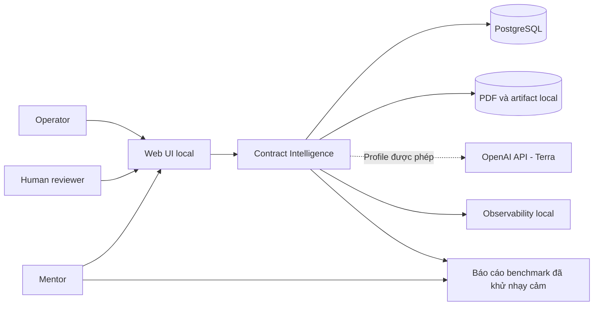
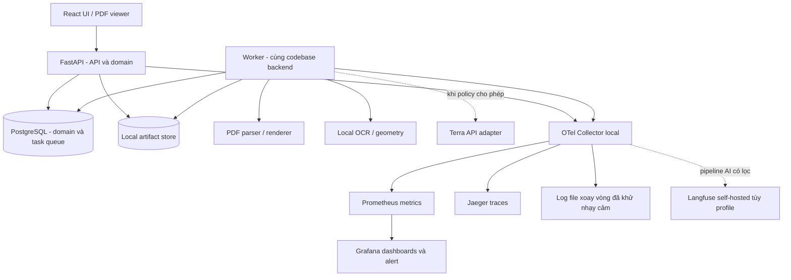
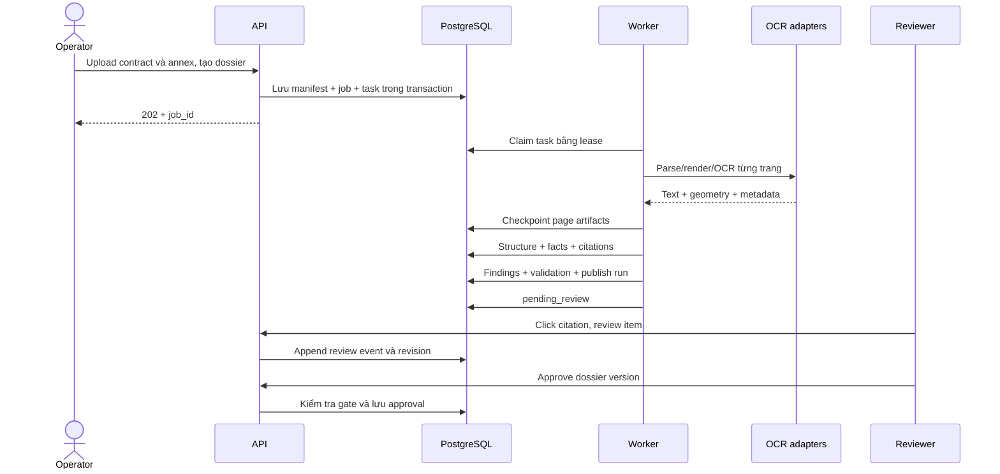
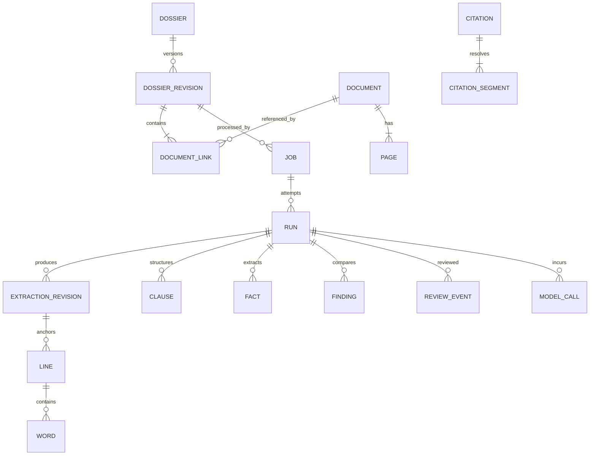
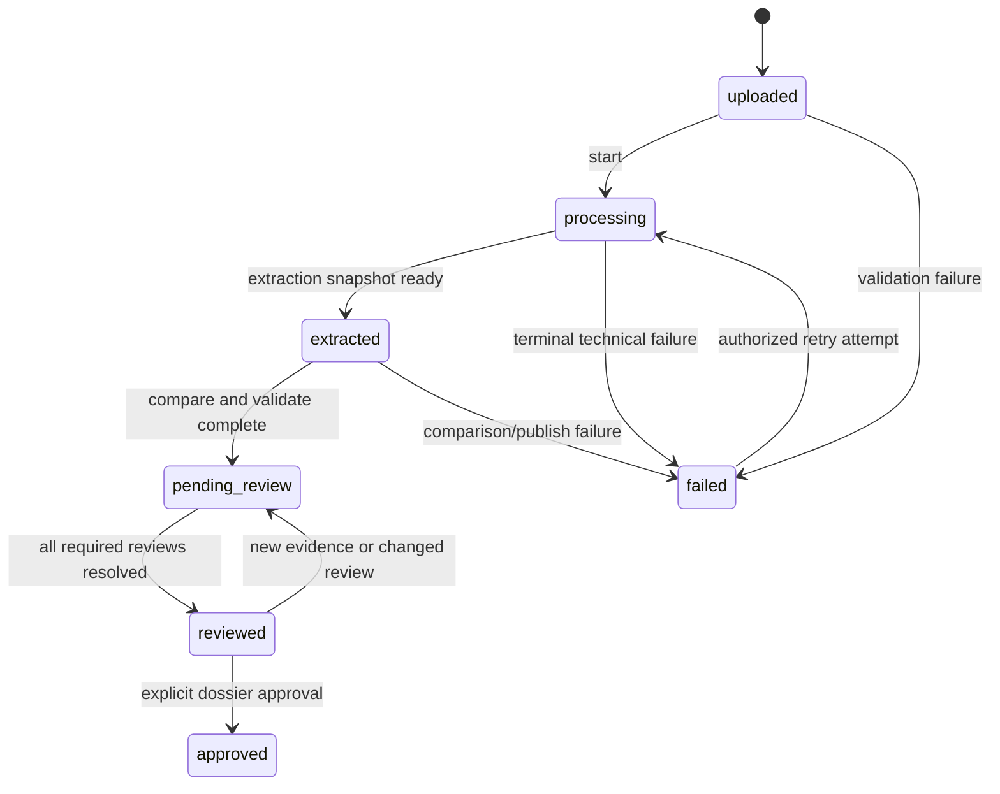
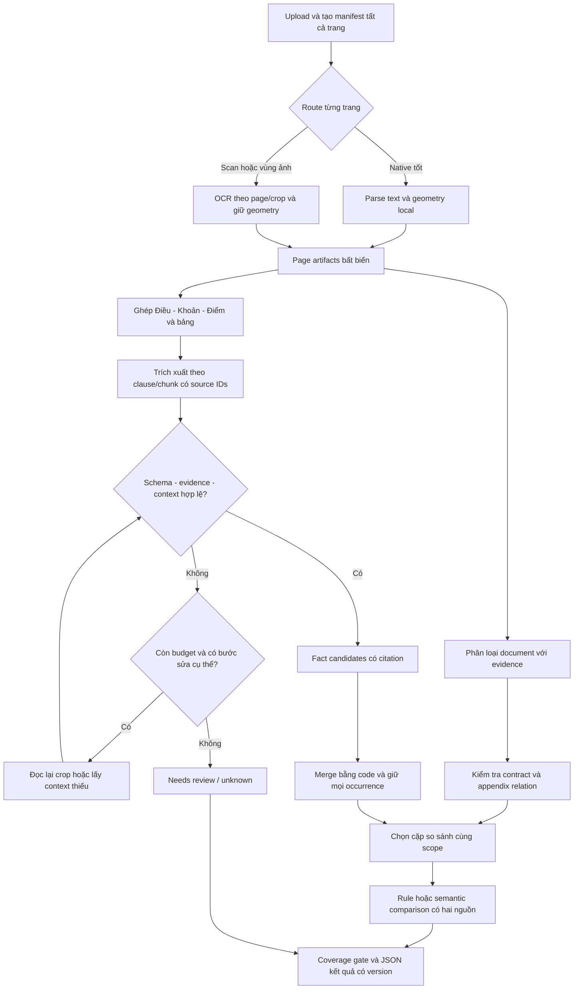

# DOC-04 · SOFTWARE ARCHITECTURE — Contract Intelligence

> Thiết kế đề xuất để review với mentor và làm cơ sở triển khai. Đây chưa phải mô tả hệ thống đã được xây dựng hoặc kết quả benchmark đã đo.

| Thuộc tính | Nội dung |
|---|---|
| Dự án | VSF OJT Batch 3 |
| Phiên bản | 0.2 — Bổ sung thiết kế IDP tài liệu dài, vòng lặp và output contract |
| Ngày | 16/09/2026 |
| Nguồn yêu cầu | DOC-02 BRD v0.2 do team cung cấp |
| Người phụ trách BRD | Trần Văn Dũng |
| Đối tượng đọc | Mentor, backend, AI/OCR, frontend, QA, người vận hành |
| Trạng thái | Chờ team/mentor review các quyết định ghi rõ trong §24 |
| Mô hình triển khai | Modular monolith + background worker, chạy local bằng Docker Compose |
| OCR theo định hướng người dùng | GPT-5.6 Terra cấu hình nhẹ, kết hợp lớp geometry local; có baseline không external API |

**Quy ước:** “Bắt buộc” xuất phát từ BRD; “đề xuất” là quyết định kiến trúc trong tài liệu này; “mục tiêu” chưa phải số đo; “TBD” phải được chốt bằng benchmark hoặc quyết định nghiệp vụ. DOC-03/ST-016 chưa được cung cấp: chỉ kế thừa các thuật ngữ và ràng buộc được trích trong BRD, chưa tuyên bố đã đối chiếu toàn bộ hai tài liệu đó.

## Mục lục

1. [Tóm tắt để báo cáo mentor](#1-tóm-tắt-để-báo-cáo-mentor)
2. [Phạm vi, nguyên tắc và các quyết định nền tảng](#2-phạm-vi-nguyên-tắc-và-các-quyết-định-nền-tảng)
3. [Kiến trúc tổng thể](#3-kiến-trúc-tổng-thể)
4. [Công nghệ và ranh giới module](#4-công-nghệ-và-ranh-giới-module)
5. [Luồng xử lý dossier](#5-luồng-xử-lý-dossier)
6. [OCR, Terra và chất lượng đầu vào](#6-ocr-terra-và-chất-lượng-đầu-vào)
7. [Geometry, bounding box và citation](#7-geometry-bounding-box-và-citation)
8. [Cấu trúc, bảng và fact](#8-cấu-trúc-bảng-và-fact)
9. [Liên kết phụ lục và phát hiện finding](#9-liên-kết-phụ-lục-và-phát-hiện-finding)
10. [Mô hình dữ liệu và version](#10-mô-hình-dữ-liệu-và-version)
11. [Job, retry và batch](#11-job-retry-và-batch)
12. [API](#12-api)
13. [HITL và phê duyệt](#13-hitl-và-phê-duyệt)
14. [Observability: OpenTelemetry và Langfuse](#14-observability-opentelemetry-và-langfuse)
15. [Dashboard, alert và runbook](#15-dashboard-alert-và-runbook)
16. [Evaluation và ground truth](#16-evaluation-và-ground-truth)
17. [Chi phí và capacity](#17-chi-phí-và-capacity)
18. [Bảo mật và external services](#18-bảo-mật-và-external-services)
19. [Triển khai local và vận hành](#19-triển-khai-local-và-vận-hành)
20. [Kiểm thử và tiêu chí nghiệm thu](#20-kiểm-thử-và-tiêu-chí-nghiệm-thu)
21. [Lộ trình Sprint](#21-lộ-trình-sprint)
22. [Ma trận truy vết BRD](#22-ma-trận-truy-vết-brd)
23. [Architecture Decision Records](#23-architecture-decision-records)
24. [Quyết định còn mở và rủi ro](#24-quyết-định-còn-mở-và-rủi-ro)
25. [Kịch bản báo cáo mentor](#25-kịch-bản-báo-cáo-mentor)
26. [Nguồn tham khảo](#26-nguồn-tham-khảo)
27. [Thiết kế IDP tốc độ cao và kiểm soát hallucination](#27-thiết-kế-idp-tốc-độ-cao-và-kiểm-soát-hallucination)

## 1. Tóm tắt để báo cáo mentor

Hệ thống nhận **một hợp đồng và 0..n phụ lục**, xử lý nền thành văn bản, cấu trúc Điều/Khoản/Điểm, bảng, fact và finding. Mỗi kết quả có bằng chứng dẫn về tài liệu gốc. Reviewer kiểm tra, sửa, từ chối hoặc yêu cầu thêm bằng chứng; phê duyệt dossier là thao tác riêng.

Kiến trúc đề xuất có một codebase backend, một cơ sở dữ liệu nghiệp vụ, một worker và một web UI. API và worker chạy hai process/container nhưng dùng chung domain và schema; đây không phải hệ thống microservice. File gốc và artifact đặt trên ổ đĩa local được phép. PostgreSQL giữ trạng thái job, hàng đợi, dữ liệu có cấu trúc, lịch sử review và sổ chi phí.

**Định hướng OCR:** giữ GPT-5.6 Terra theo yêu cầu người dùng trong profile external được phép. Native PDF ưu tiên lấy text/geometry trực tiếp. Scan dùng Terra đọc nội dung và một OCR/layout engine local để xác định word/line; cần kiểm tra alignment giữa hai nguồn. Không coi tọa độ model tự sinh là bbox chính xác mặc định.

**Monitoring có ba lớp:** OpenTelemetry đo và liên kết traces/metrics/logs; dashboard vận hành theo dõi job, lỗi, tốc độ, tài nguyên; Langfuse theo dõi lời gọi AI, phiên bản prompt, usage và điểm đánh giá. PostgreSQL là nguồn chuẩn cho trạng thái nghiệp vụ, audit và chi phí; telemetry không thay thế chúng.

**Hai điểm cần mentor chốt:** BRD yêu cầu baseline không external API, trong khi Terra qua API là external; và NFR-04 giới hạn nơi lưu sample. Vì vậy bản thiết kế luôn có `local_baseline`, còn `terra_assisted` chỉ được bật cho dataset có quyền sử dụng phù hợp. Soạn kiến trúc không đòi hỏi gửi sample ra ngoài.

**Kết quả báo cáo dự kiến:** demo một dossier có scan và native PDF; click một fact và một finding hai phía; sửa một giá trị vẫn giữ machine output; retry sau lỗi; xem batch summary; mở trace và báo cáo chất lượng/chi phí có denominator. Không đưa số accuracy, tốc độ hay chi phí giả định thành kết quả thực nghiệm.

## 2. Phạm vi, nguyên tắc và các quyết định nền tảng

### 2.1 Phạm vi năng lực

| Nhóm | Bắt buộc/đích cuối OJT | Should hoặc chưa chốt |
|---|---|---|
| Input | Native, scan, mixed theo từng trang; 1 contract + 0..n annex | Ngưỡng dung lượng/trang phải đo |
| Ngôn ngữ | Tiếng Việt | Anh và song ngữ trên bộ mẫu; BRD §21 có đích demo tiếng Anh, không suy thành production đa ngữ |
| IDP | Clause hierarchy, bảng/hàng/cell, fact typed | Model hỗ trợ cấu trúc sau benchmark |
| Evidence | Word/line/clause bbox; citation mọi fact/finding | Bbox editor Sprint 2–3 |
| Comparison | Structured và semantic; ba phạm vi so sánh | Quy tắc precedence pháp lý chưa chốt |
| Review | Confirm/correct/reject/needs-more-evidence; approve riêng | Gán reviewer nâng cao không cần Sprint 1 |
| Processing | Single, batch, background, retry, failure summary | Tăng concurrency sau đo |
| Reporting | Chất lượng, throughput, cost và tập mẫu | SLO chính thức sau baseline |

### 2.2 Nguyên tắc không được phá vỡ

1. Source PDF, machine output, run manifest và review history bất biến theo phiên bản.
2. Không có evidence hợp lệ thì không phát hành fact như dữ liệu đã được chứng minh.
3. Finding có đúng một disposition trong năm giá trị BRD; `Conflict` chỉ là tên view/UI/API.
4. Khác số chưa đủ kết luận mâu thuẫn: phải xét đối tượng, thời gian, đơn vị, điều kiện và phạm vi.
5. Không tự kết luận phụ lục mới nhất có hiệu lực cao nhất. `candidate_amendment` cần reviewer.
6. Model output là dữ liệu không tin cậy: validate schema, evidence và giá trị trước khi publish.
7. Lỗi backend/AI/telemetry không được làm job biến mất hoặc âm thầm báo thành công.
8. Mọi ngưỡng chất lượng, retry, timeout và resource limit đều version hóa trong run config.
9. Monitoring không tự tạo ground truth; điểm AI tự chấm không thay thế human-labelled evaluation.
10. Không tư vấn pháp lý, xác minh chữ ký, sửa PDF gốc, train model riêng, Kubernetes hay enterprise IAM.

## 3. Kiến trúc tổng thể

### 3.1 Context



### 3.2 Container và đường dữ liệu



Sơ đồ Langfuse rút gọn một box: khi triển khai phải gồm toàn bộ dependency theo bản Compose chính thức đã pin, không coi nó là một container độc lập nhẹ. Không bắt worker chờ hệ monitoring để hoàn tất nghiệp vụ.

### 3.3 Ranh giới tin cậy

| Vùng | Dữ liệu | Chính sách |
|---|---|---|
| Laptop được phép | PDF, ảnh trang, OCR raw, citation, review | Quyền truy cập local; ổ đĩa bảo vệ; backup được phép |
| Observability local | Metadata đã allowlist; trace không chứa hợp đồng mặc định | Cùng trust boundary; tài khoản riêng |
| OpenAI API | Ảnh crop/trang và đoạn text cần xử lý | Chỉ gửi khi dataset policy và mentor cho phép |
| Langfuse Cloud | Tắt mặc định | Muốn bật phải ghi nhận approval và loại metadata được phép |
| Repository/CI | Code, schema, dữ liệu synthetic | Không sample mentor, key, raw response hoặc artifact thật |

## 4. Công nghệ và ranh giới module

### 4.1 Stack đề xuất

| Thành phần | Lựa chọn | Lý do / điều kiện |
|---|---|---|
| Frontend | React + TypeScript, PDF.js hoặc canvas ảnh trang | Hiển thị evidence, hai nguồn, overlay bbox |
| Backend | Python + FastAPI + Pydantic | Hợp với xử lý PDF/OCR, typed API và schema |
| Persistence | PostgreSQL + SQLAlchemy + migration | Transaction, versioning, queue, audit cùng nguồn chuẩn |
| Job queue | Bảng task PostgreSQL + worker polling/lease | Không thêm Redis/Celery chỉ cho app khi quy mô chưa cần |
| Native PDF | Adapter PyMuPDF hoặc thư viện tương đương | Text/word geometry/render; kiểm tra giấy phép trước khi chọn bản phân phối |
| Scan baseline | Tesseract `vie+eng` làm ứng viên đầu; benchmark engine khác nếu cần | CPU local, output word/line; không cam kết accuracy trước đo |
| VLM OCR | `gpt-5.6-terra`, reasoning nhẹ theo §6 | Đúng định hướng người dùng; external có policy |
| Table | Native geometry/rules; scan layout + text alignment | Bảng phải có cell, không flatten |
| Artifact | Local filesystem, metadata/hash trong DB | Dễ demo/backup, chưa cần object store cho domain |
| Telemetry | OTel SDK + Collector | Instrument chung API, worker, AI |
| Vận hành | Prometheus + Grafana + Jaeger khi bật profile | Metrics, alert và trace view |
| AI observability | Langfuse self-hosted, profile riêng | Prompt/model/version, LLM calls và eval scores |
| Packaging | Docker Compose + bootstrap script | Một command sau prerequisites |

Đây là stack đề xuất của dự án, không phải yêu cầu cứng BRD. Pin phiên bản thực tế trong lockfile/Compose tại implementation; không dùng tag `latest` trong bản demo bàn giao. Spike phải xác nhận CPU, Windows Docker, giấy phép và schema output của engine.

### 4.2 Module backend

| Module | Trách nhiệm | Không được làm |
|---|---|---|
| `ingestion` | Validate PDF, hash, dossier manifest, file policy | Tự quyết annex thuộc contract dựa trên upload order duy nhất |
| `orchestration` | Task DAG, lease, checkpoint, retry, trạng thái | Chứa prompt hoặc logic so sánh giá |
| `document_processing` | Render, phân loại trang, OCR adapters, transforms | Ghi đè source/machine output |
| `structure` | Clause tree, table/cell, reading order | Làm mất evidence khi nối trang |
| `facts` | Typed extraction, normalization, validation | Dùng float cho tiền |
| `evidence` | Citation create/resolve/validate, geometry mapping | Tự đoán span khi không khớp |
| `comparison` | Candidate generation, comparability, dispositions | Đưa kết luận pháp lý |
| `review` | Append correction, optimistic locking, approval | Sửa trực tiếp record machine |
| `reporting` | Batch summary, quality, throughput, cost exports | Lấy sampled traces làm ledger đầy đủ |
| `observability` | Span/metric/log, redaction, export | Ghi text tài liệu/key vào log mặc định |
| `policy` | Permission, external egress, dataset classification | Tin nhãn permission từ frontend |

### 4.3 Contract adapter

Các adapter cùng trả typed result: `artifact_id`, `engine`, `engine_version`, `config_hash`, `duration_ms`, `warnings`, `usage_ref`, `source_revision`. OCR trả thêm `raw_text`, words/lines nếu có, geometry source và confidence nullable. Không buộc mọi provider phải có calibrated confidence.

Không dùng agent tự chọn tool hoặc tự gọi web cho pipeline này. Luồng xử lý cố định, có giới hạn và kiểm tra tại từng stage; model chỉ thực hiện task hẹp.

## 5. Luồng xử lý dossier

### 5.1 Sequence chính



### 5.2 Stage DAG

| Stage | Input → Output | Gate / hành vi lỗi |
|---|---|---|
| 01 Ingest | PDFs → immutable documents + manifest | Đúng một contract; MIME/header/parser hợp lệ |
| 02 Inspect | Document → page metadata/type | Encrypted/corrupt bị báo lỗi có mã |
| 03 Render | Page → ảnh canonical + transform | Timeout và pixel budget; không render toàn tài liệu vào RAM |
| 04 Extract | Native/scan/mixed → text + word/line candidates | Policy AI, quota, schema, completeness |
| 05 Align | Text + geometry → evidence anchors | Không khớp phải giữ cảnh báo/unanchored candidate |
| 06 Structure | Anchors → clauses/tables/cells | Parent/page/span hợp lệ; giữ fragment qua trang |
| 07 Facts | Nodes → typed facts + context + citations | Kiểm tra normalize, source và ambiguity |
| 08 Link | Manifest + metadata → annex relation | Ambiguous relation cần reviewer |
| 09 Compare | Fact/clause candidates → findings | Đủ scope/context/evidence hai phía |
| 10 Validate | Run outputs → coverage/quality flags | Không publish evidence giả hoặc bỏ trang âm thầm |
| 11 Publish | Staged run → immutable result revision | Transaction atomic; trạng thái review rõ ràng |

Stage thực hiện theo dependency; page extraction có thể song song trong giới hạn. Stage comparison chỉ chạy sau khi có snapshot extraction nhất quán. Một trang thiếu xử lý khiến `coverage_complete=false`; UI vẫn xem được phần đã có, nhưng không được xem kết quả là đầy đủ hoặc approve.

## 6. OCR, Terra và chất lượng đầu vào

### 6.1 Model name và cấu hình nhẹ

Tài liệu chính thức mô tả model ID `gpt-5.6-terra`, nhận image input và hỗ trợ structured outputs. Danh sách reasoning effort có `low`, không ghi tên `light`. Vì vậy **đề xuất diễn giải “5.6 terra light” thành `gpt-5.6-terra` + `reasoning.effort=low`**, cần xác nhận với cấu hình thực của team; không tự tạo model ID `gpt-5.6-terra-light`. [S1]

Model chọn trong Codex không tự chứng minh backend đã có API credential/quota cho model đó. Backend dùng adapter và credential riêng; kiến trúc không sử dụng phiên UI Codex làm OCR server.

```yaml
# Thiết kế cấu hình; chưa phải file triển khai đã kiểm thử.
pipeline_profile: local_baseline  # hoặc terra_assisted khi được phép
ocr:
  native_route: native_text_with_geometry
  scan_route: local_ocr
  external_candidate:
    provider: openai
    model: gpt-5.6-terra
    reasoning_effort: low
    prompt_version: ocr-verbatim-v1
    output_schema_version: ocr-page-v1
    max_attempts: 3
    request_timeout_seconds: 120
  geometry_engine: local_word_line_ocr
  render_dpi: 300
  external_calls_enabled: false
```

Trong `terra_assisted`, scan route chuyển sang Terra transcription + local geometry. Native route vẫn lấy text trực tiếp nếu chất lượng đủ; không phát sinh AI cost cho mọi trang chỉ vì đã chọn Terra. Tất cả giá trị số ở cấu hình trên là điểm khởi đầu spike.

### 6.2 Phân loại theo trang

Đọc số ký tự, tỷ lệ ký tự lỗi, vị trí glyph, coverage text, image regions và khả năng select text. Không chỉ dựa vào việc PDF có text layer: scan có OCR layer hỏng vẫn cần fallback.

| Page type | Đường xử lý |
|---|---|
| Native text tốt | Lấy text và word/line geometry trực tiếp; render để UI đối chiếu |
| Scan | Render; orientation/skew; local geometry; OCR theo profile |
| Mixed | Chia vùng native/image, OCR vùng image cần thiết; merge theo reading order |
| Text layer đáng ngờ | Soát consistency với ảnh/coverage; OCR lại theo policy và ghi lý do |
| Blank | Ghi `blank_verified`; không tính là lỗi hay âm thầm bỏ trang |

Native text và OCR vùng chồng nhau phải deduplicate bằng geometry và text overlap. Không ghép hai lần cùng nội dung. Lưu `route_reason`, classifier version và kết quả phân loại để phân tích sai route.

### 6.3 Preprocessing

Giữ ảnh canonical dùng hiển thị nguyên trạng; ảnh deskew/contrast là derivative. Benchmark 200/300 DPI hoặc crop phù hợp; 300 DPI là candidate BRD, không phải lời hứa chất lượng. Lưu transform cho rotate, crop, resize, deskew. Nếu transform phi tuyến không có inverse đáng tin cậy thì không dùng nó cho evidence chính xác.

Không xóa dấu đỏ/chữ ký bằng filter có nguy cơ làm mất chữ. Case seal overlap, font nhỏ, blur, low contrast và JPEG noise cần tag riêng trong benchmark.

### 6.4 Prompt contract và response validation

Prompt OCR yêu cầu chép nguyên văn, giữ dấu tiếng Việt, số, ký hiệu, xuống dòng hợp lý; không sửa chính tả theo suy đoán, không diễn giải hợp đồng. Đoạn không đọc được trả marker/uncertain region theo schema. Các chỉ dẫn xuất hiện bên trong tài liệu được coi là nội dung tài liệu, không phải lệnh cho hệ thống.

Output schema gồm `page_id`, `blocks`, `lines`, `text`, `uncertain_regions`, `warnings`, `completion_status`. ID nguồn chỉ được chọn từ danh sách server cung cấp. Với OCR ảnh, ID line do server gán sau validate; model không tự tạo citation cuối cùng.

Kiểm tra JSON/schema, page ID, số ký tự, dấu hiệu truncation, duplicate region, coverage và alignment với ảnh/geometry. Refusal, output incomplete hoặc schema invalid không được coi là OCR thành công. Re-prompt sửa schema có giới hạn và tính cost; không vòng lặp vô hạn.

### 6.5 Confidence và fallback

- `engine_confidence`: score do engine có hỗ trợ trả, kèm thang đo; không có thì `null`.
- `model_self_reported_confidence`: nếu thu thập chỉ là nhận định model, không dùng như xác suất đã hiệu chuẩn.
- `alignment_score`, `schema_valid`, `coverage_status`, `critical_field_checks`: tín hiệu riêng, không cộng tùy ý thành accuracy.
- OCR local và Terra bất đồng ở số tiền/ngày/MST: giữ cả hai machine candidates, tạo review task; không chọn số có vẻ hợp lý hơn.
- External bị chặn/hết quota: dùng baseline local nếu profile cho phép degraded result và ghi route; nếu không thể xử lý đủ thì fail rõ ràng. Không trình bày kết quả fallback như kết quả Terra.

Vision có hạn chế với định vị không gian chính xác, chữ nhỏ và ảnh xoay. Vì vậy bbox từ VLM là candidate cần đo, không thay thế geometry đã kiểm chứng. [S2]

## 7. Geometry, bounding box và citation

### 7.1 Hệ tọa độ chuẩn

Canonical page là vùng CropBox hiển thị sau khi áp dụng rotation của PDF, trước preprocessing OCR. Gốc trên trái, x sang phải, y xuống dưới, bbox `[x0,y0,x1,y1]` chuẩn hóa trong `[0,1]`. Luôn giữ `MediaBox`, `CropBox`, page size gốc, rotation gốc, canonical width/height và render DPI.

```text
x_norm = x_canonical_pixel / canonical_width_pixel
y_norm = y_canonical_pixel / canonical_height_pixel

p_canonical = inverse(T_preprocess_from_canonical) × p_ocr
p_viewport  = T_viewport_from_canonical × p_canonical
```

Với bbox OCR trên ảnh đã deskew, biến đổi cả bốn góc thành polygon rồi lấy envelope nếu cần rectangle. Lưu polygon khi hình bị nghiêng; không chỉ biến đổi hai góc. Nếu dùng PDF viewer thay ảnh canonical, phải map qua CropBox/rotation/viewport của viewer, tránh xoay hai lần.

`bbox` hợp lệ khi `0 <= x0 < x1 <= 1` và `0 <= y0 < y1 <= 1`. Mỗi region thuộc đúng một trang. Clause qua nhiều trang dùng danh sách regions, tuyệt đối không gộp thành một bbox vượt trang.

### 7.2 Word, line và clause region

Word lưu text, bbox/polygon, line ID, reading index và source engine. Line lưu raw text bất biến, word IDs và char offsets. Clause region là tập hợp region theo trang từ các line thuộc clause, giữ nhiều rectangle nếu nhiều cột/khoảng trống.

Native word geometry lấy từ parser; scan geometry lấy local OCR/layout. Align text Terra với line/word bằng thứ tự, string alignment và không gian. Alignment many-to-many phải lưu explicit mapping; không suy bbox từng ký tự bằng chia đều chiều rộng chữ rồi gọi đó là ground truth.

Với text Terra không khớp local OCR nhưng có line/crop xác định, lưu transcription candidate gắn line region, `anchor_precision=line` và cần review. Muốn công bố word bbox phải có word alignment hợp lệ. Nếu chưa có anchor đáng tin cậy, candidate ở staging, không xuất thành fact có citation giả.

### 7.3 Citation contract

Citation trỏ vào **source text revision bất biến**, không trỏ text normalized hoặc field đã sửa. Quy ước offset: Unicode code point, zero-based, nửa mở `[start,end)`, chỉ tính trong `line.raw_text`. Frontend TypeScript phải chuyển code point sang UTF-16 index khi cần; không slice trực tiếp bằng offset nếu chưa chuyển.

```json
{
  "citation_id": "cit_001",
  "schema_version": "1.0",
  "document_id": "doc_contract",
  "document_sha256": "<sha256-of-source-pdf>",
  "extraction_revision_id": "extract_001",
  "segments": [
    {
      "page_id": "page_01",
      "page_number": 1,
      "line_id": "line_007",
      "char_start": 0,
      "char_end": 7,
      "quote": "Giá trị",
      "word_ids": ["word_021", "word_022"],
      "bbox": [0.12, 0.31, 0.25, 0.34],
      "coordinate_space": "canonical_normalized",
      "anchor_precision": "word"
    }
  ],
  "validation_status": "valid"
}
```

Ví dụ chỉ minh họa schema; tọa độ không được lấy làm benchmark. `page_number` hiển thị 1-based, internal page index nếu dùng 0-based phải đặt tên khác.

### 7.4 Resolver và integrity gate

Resolver xác thực quyền truy cập dossier, tồn tại document/revision/page/line, offset nằm trong raw text, `quote == raw_text[start:end]`, bbox hợp lệ và source hash khớp. Trả ảnh/trang có quyền truy cập, regions và đoạn quote. Một click mở đúng trang và highlight.

Fact phải có ít nhất một citation hợp lệ. Finding so sánh phải có evidence phía A và B. Nếu thiếu phía B, tạo extraction/review issue; không phát hành một finding so sánh hai phía giả. `insufficient_evidence` vẫn có thể dùng khi hai vùng nguồn tồn tại nhưng thiếu context để kết luận, ví dụ không xác định VAT hoặc kỳ áp dụng.

Citation multi-line/multi-page là nhiều segments. Correction không thay offset citation gốc; bbox/citation human là revision riêng. Thay engine hoặc OCR lại tạo revision mới; review cũ không tự gắn vào source mới bằng ID vị trí có thể đã đổi.

## 8. Cấu trúc, bảng và fact

### 8.1 Clause tree

Node types: `document`, `article`, `clause`, `point`, `annex_section`, `table`, `unclassified`. Mỗi node có UUID, label gốc, title nullable, raw text fragments, parent ID, order, source pages và citation/regions.

Rules-first nhận diện “Điều 1”, “1.1”, “a)”, “Article”, “Section”; kết hợp indent, font và reading order. Không dùng numbering làm primary key vì tài liệu có thể lặp hoặc nhảy số. Header/footer lặp được đánh dấu, không xóa khỏi raw extraction. Paragraph không nhận diện được vẫn lưu `unclassified`, không bỏ dữ liệu.

Merge clause qua trang dựa vào numbering/continuation, giữ fragment từng trang. Song ngữ giữ bản Việt/Anh riêng và liên kết `translation_candidate`; không tự xem hai bản là hai nghĩa vụ độc lập hoặc suy bản nào ưu tiên nếu chưa có điều khoản ngôn ngữ.

### 8.2 Table schema

```text
Table(id, document_id, page_regions[], continuation_group_id, header_rows[])
Row(id, table_id, row_index, source_row_label)
Cell(id, row_id, column_index, row_span, column_span,
     raw_text, typed_value?, citation_ids[], header_path[])
```

Bảng native ưu tiên line/word geometry; scan dùng layout detection/rules và alignment. Merged cell có span; empty cell khác missing OCR. Bảng qua trang giữ từng fragment, loại header lặp ở logical view nhưng vẫn giữ source. Mỗi fact từ bảng giữ `table_id`, `row_id`, `cell_id`, item key và header context để không so giá của hai mặt hàng khác nhau.

### 8.3 Fact contract

```json
{
  "fact_id": "fact_price_01",
  "type": "money",
  "field": "contract_value",
  "raw": "100.000.000 VNĐ",
  "normalized": {"amount": "100000000", "currency": "VND"},
  "context": {
    "subject": "total_contract",
    "tax_basis": "unknown",
    "effective_from": null,
    "effective_to": null,
    "condition": null,
    "clause_id": "clause_03",
    "table_cell_id": null
  },
  "citation_ids": ["cit_price_01"],
  "normalization_status": "valid",
  "machine_revision_id": "run_001"
}
```

Tiền và số lượng dùng decimal string/NUMERIC; ngày dùng ISO khi xác định được format, giữ raw và locale. `03/04/2026` mơ hồ không tự normalize theo locale mặc định. Deadline tương đối biểu diễn duration + trigger + calendar/business day + exceptions. MST/số hợp đồng là string để giữ số 0 đầu. Party name có normalized search form nhưng không gộp thực thể chỉ vì tên gần giống.

Derived fact như tổng dòng hàng phải ghi công thức, version và tất cả input citations; không trình bày số tính được như số xuất hiện nguyên văn trong PDF.

## 9. Liên kết phụ lục và phát hiện finding

### 9.1 Liên kết contract–annex

Upload manifest cho người dùng chỉ định contract và danh sách annex. Hệ thống kiểm tra số hợp đồng, parties, title, references và thời gian; upload order chỉ là tín hiệu phụ. Mismatch tạo `link_review_required`. Chưa xác nhận relation thì không tự coi annex là amendment của contract.

Lưu `relation_status=declared|suggested|confirmed|rejected`, evidence, method và người xác nhận. Dossier có đúng một contract; thay contract tạo dossier revision mới. Annex scan không tìm được số tham chiếu vẫn có thể được reviewer liên kết, với lý do và nguồn.

### 9.2 Candidate generation

Sinh candidate trong từng tài liệu, contract–annex, annex–annex. Chặn so sánh ngoài dossier. Group theo field/topic, subject/item key, parties, scope/time; dùng keyword/rules trước, có thể bổ sung embedding local nếu benchmark chứng minh cải thiện recall.

Không gọi model cho mọi cặp clause O(n²) mà không kiểm soát. Lưu số clause, số cặp thô, số cặp sau filter, số đã so sánh và số bị budget skip. Candidate retrieval recall phải đo riêng; semantic classifier không thể phát hiện cặp đã bị retrieval bỏ sót. Cặp chưa xét là `not_evaluated`, không phải `comparable_match`.

### 9.3 Comparability và disposition

| Disposition | Điều kiện kỹ thuật | Ví dụ |
|---|---|---|
| `comparable_match` | Cùng đối tượng/phạm vi/điều kiện, cùng giá trị hoặc ý nghĩa | 100 triệu VND và 100.000.000 VNĐ |
| `comparable_difference` | So sánh được, giá trị/nghĩa khác, chưa có bằng chứng amendment | Cùng kỳ thanh toán, 30 ngày và 15 ngày |
| `candidate_amendment` | Khác biệt kèm evidence điều khoản sửa/thay thế | Phụ lục ghi sửa Điều 3 từ 100 lên 120 triệu |
| `not_comparable` | Biết rõ khác phạm vi/đối tượng | Giá mặt hàng A với mặt hàng B |
| `insufficient_evidence` | Có hai nguồn nhưng thiếu thông tin để xác định quan hệ | Không rõ giá trước/sau VAT hoặc hiệu lực |

Finding có `comparison_kind=structured|semantic`, `scope=within_document|contract_annex|annex_annex`, `topic`, `severity`, `rationale`, `rule/model_version`, `citations_a`, `citations_b`, `disposition`. Severity chỉ là ưu tiên review, không phải mức rủi ro pháp lý đã kết luận.

### 9.4 Structured và semantic

Structured comparator normalize currency/unit/date/entity và áp dụng rule có version. Không quy đổi tỷ giá hoặc calendar/business day ngầm. Tolerance phải theo loại field, mặc định exact cho số tiền đã chuẩn hóa cùng currency, không dùng epsilon float.

Semantic comparator nhận hai clause, context liên quan và source IDs; trả disposition candidate + rationale ngắn + evidence spans. Kiểm tra subject, nghĩa vụ, phủ định, ngoại lệ, điều kiện kích hoạt, deadline và scope. Chỉ yêu cầu lý do có thể kiểm chứng; không lưu hidden chain-of-thought.

Local baseline có rule semantic hẹp như “thanh toán trong N ngày từ cùng trigger”; hỗ trợ phủ định/ngoại lệ trong tập pattern đã định nghĩa. Phải công bố coverage hạn chế, không gọi đó là semantic reasoning tổng quát. Profile Terra có thể bổ sung semantic adapter sau benchmark riêng; dùng Terra cho OCR không mặc nhiên chứng minh chất lượng semantic comparison.

### 9.5 Conflict view

Không có bảng `conflicts` độc lập. `GET /conflicts` là view của `findings` cần review: difference, amendment candidate, insufficient evidence và các finding được flag. Match/not-comparable vẫn có thể xem bằng filter để audit.

Confirm finding nghĩa là reviewer đồng ý kết quả kỹ thuật; reject nghĩa là không chấp nhận finding; không tự sửa disposition machine. Kết luận human là overlay. Không tự phát hành “giá trị hiện đang có hiệu lực” nếu chưa xác nhận precedence; có thể trình bày timeline và giá trị được reviewer chấp thuận trong snapshot.

## 10. Mô hình dữ liệu và version

### 10.1 Quan hệ chính



Sơ đồ rút gọn; evidence nối bằng bảng link, review trỏ entity cụ thể. Không dùng ER diagram này thay DDL/migrations.

### 10.2 Entity và trường tối thiểu

| Entity | Trường và constraint chính |
|---|---|
| Dossier / revision | ID, title, revision, manifest hash, active run, created_by; một contract/revision |
| Document / link | Source hash, role, filename riêng tư, storage key, relation status, dataset policy |
| Page | Document, number unique, dimensions, rotation, crop/media box, page type |
| Artifact | Key, content hash, MIME, size, producer/version, immutable flag |
| Job | Dossier revision, public status, internal stage, progress, failure code, active run |
| Run | Input hashes, config, model/prompt/schema/rule versions, git commit, timing, completeness |
| Task / attempt | Task key unique, dependency, lease owner/token, lease_until, retry_at, attempt, result ref |
| Extraction revision | Run, page, engine, raw output ref, text revision, transforms, warnings |
| Word / line | Geometry, raw text, offsets, confidence nullable, reading index |
| Clause | Parent, type, original label, title, fragments, regions |
| Table / row / cell | Logical indices, spans, source regions, header relationships |
| Fact | Type, raw, normalized JSON, context, validation status, machine revision |
| Citation / segment | Document hash, extraction revision, page/line/span/word anchors |
| Finding | One disposition CHECK constraint, kind/scope/topic, references A/B, rule/model version |
| Review task | Target entity, reason, priority, status, assignee nullable, current version |
| Review event | Actor, action, target revision, before/after refs, reason, timestamp, supersedes |
| Approval | Actor, dossier revision, run/result hash, review version, time; immutable |
| Model call / usage | Call UUID, attempt, provider request ID, model, token categories, cost basis/status |
| Evaluation run | Dataset version/hash, config, cohort, denominators, metric values, artifact refs |
| Audit event | Actor, action, object, request ID, timestamp, result; append-only |

### 10.3 Integrity và indexing

Foreign keys bảo vệ source lineage; unique `(document_id,page_number)`, task idempotency key và review event request key. Index job status/created time, task status/retry_at/lease, finding run/disposition, review target/revision, usage run/call ID.

Trước publish, validator kiểm tra mọi fact có citation và mọi finding có hai phía hợp lệ. JSON schema validation không thay thế relational integrity. DB role ứng dụng không được UPDATE/DELETE machine snapshot và audit event qua đường CRUD thông thường; sửa dữ liệu qua revision mới.

### 10.4 Machine, human và effective view

`machine_result` bất biến; `review_event` append-only; `effective_view` tính từ machine + chuỗi correction mới nhất hợp lệ. UI cho chuyển Machine/Human/Effective. Reject không xóa item. Correct giữ raw gốc và corrected value riêng.

Khi correction thay đổi input comparison, tạo analysis revision mới cho finding liên quan, đánh dấu finding cũ superseded/stale. Chặn approve khi có derived finding stale. Không ghi lại machine finding cũ theo giá trị đã được người sửa.

## 11. Job, retry và batch

### 11.1 Trạng thái công khai



`processing` có internal stage `inspect/render/ocr/align/structure/facts/link/compare/validate`. `extracted` nghĩa là snapshot extraction đã lưu, không nghĩa toàn pipeline hoàn thành. Mọi dossier sau comparison vào pending_review để có reviewer kiểm tra completeness, kể cả không phát hiện difference.

`reviewed` chỉ khi hết required review task đang mở, hết needs-more-evidence và không có stale result. `approved` gắn đúng revision; thêm annex/re-OCR sau approval tạo revision/job mới, giữ approval cũ trong lịch sử. Technical failure xảy ra ở request review không tự đổi job reviewed thành failed; báo lỗi API và rollback transaction.

### 11.2 Queue và recovery

API tạo job và task trong cùng transaction. Worker claim task bằng `SELECT ... FOR UPDATE SKIP LOCKED`, set lease rồi commit; không giữ DB lock suốt lúc gọi AI. Worker heartbeat gia hạn lease bằng owner/token đúng. Khi commit output, kiểm tra fencing token còn hiệu lực để worker hết lease không ghi đè kết quả worker mới.

Lease hết hạn được sweeper requeue có giới hạn attempt. Artifact ghi file tạm, fsync/close theo platform rồi atomic rename; DB publish pointer sau khi file hoàn chỉnh. Orphan cleanup có grace period, không xóa artifact đang được reference.

Task idempotency key gồm input hash + stage + model/engine + prompt/schema/config hash. Cache hit tái dùng artifact có lineage, cost mới bằng 0 và ghi cache origin; không gán usage cũ thành cost mới. Queue at-least-once; domain commit idempotent. Không hứa exactly-once với external API: timeout có thể xảy ra sau khi provider đã xử lý và tính phí.

### 11.3 Retry policy đề xuất

| Lỗi | Xử lý |
|---|---|
| 429 / provider 5xx / transient network | Exponential backoff + jitter, tôn trọng Retry-After, tối đa 3 attempts mặc định |
| Timeout sau gửi request | Usage `unknown`; ghi request ID nếu có; retry có thể tính thêm phí |
| 401/403/model không khả dụng | Không retry tự động; báo cấu hình/quyền |
| Invalid JSON/truncated | Một lần sửa/chia nhỏ có kiểm soát trong tổng budget; không coi output thiếu là đầy đủ |
| PDF corrupt/encrypted unsupported | Fail non-retryable; yêu cầu input hợp lệ |
| Evidence validation fail | Giữ artifact, tạo review issue hoặc fail publish; không fabricate |
| Worker chết | Lease expiry, resume checkpoint; attempt cũ giữ lịch sử |
| Disk full/DB unavailable | Dừng claim mới, alert; không bỏ job hoặc xóa source tự động |

Mặc định spike: một worker, một dossier active, tối đa hai page tasks/AI calls đang chạy tổng cộng nếu đo cho phép. Giới hạn toàn cục dùng DB lease/semaphore hoặc một coordinator; semaphore riêng từng process không bảo vệ global quota khi tăng worker.

### 11.4 Batch summary không đếm trùng

Batch lưu danh sách job cố định cho một lần chạy. Retry không thêm dossier vào denominator. Category loại trừ nhau:

```text
Failed       = failed
Done         = reviewed hoặc approved
Needs Review = pending_review
In Progress  = processing hoặc extracted
Queued       = uploaded
Total        = Failed + Done + Needs Review + In Progress + Queued
```

UI phải hiển thị tối thiểu Done/Failed/Needs Review theo BRD, đồng thời có Queued/In Progress để tổng luôn đúng. `machine_completed_count` là metric riêng, gồm pending_review/reviewed/approved, không cộng thêm vào total. Batch có thể hoàn thành xử lý máy nhưng còn Needs Review. Job retry chuyển category theo snapshot hiện tại; cumulative attempts báo riêng.

## 12. API

API prefix `/api/v1`; UTC ISO-8601 cho timestamps, UI hiển thị Asia/Ho_Chi_Minh. RBAC đơn giản operator/reviewer/admin/mentor-readonly; backend lấy actor từ session, không tin actor ID do client tự gửi.

| Method / Endpoint | Chức năng | Response chính |
|---|---|---|
| `POST /dossiers` | Tạo dossier metadata | 201, dossier ID/revision |
| `POST /dossiers/{id}/documents` | Upload PDF với role | 201, document ID/hash |
| `POST /dossiers/{id}/jobs` | Validate manifest và enqueue | 202, job ID/status URL |
| `GET /dossiers` | Danh sách có filter/cursor | Items + next cursor |
| `GET /jobs/{id}` | Public status, stage, progress, warnings | Snapshot trạng thái |
| `POST /jobs/{id}/retry` | Retry task lỗi được phép | 202, attempt/run ref |
| `GET /dossiers/{id}/results?run_id=...` | Snapshot có version/completeness | Clauses/facts/finding summary |
| `GET /dossiers/{id}/clauses` | Clause tree phân trang khi cần | Nodes + source refs |
| `GET /dossiers/{id}/facts` | Fact typed và overlay human | Machine/effective refs |
| `GET /dossiers/{id}/findings` | Tất cả dispositions | Items + filters |
| `GET /dossiers/{id}/conflicts` | View finding cần review | Cùng finding IDs |
| `GET /citations/{id}/resolve` | Resolve và validate evidence | Page refs, quote, regions |
| `GET /documents/{id}/pages/{number}` | Ảnh/trang có kiểm quyền | Private image stream |
| `POST /review-events` | Confirm/correct/reject/needs-more-evidence | 201, event ID, new review version |
| `POST /dossiers/{id}/approve` | Phê duyệt revision sau gate | 201, immutable approval |
| `POST /batches` | Enqueue danh sách dossier revisions | 202, batch ID/job IDs |
| `GET /batches/{id}` | Summary + trạng thái từng dossier | Total và 5 categories |
| `GET /reports/quality` | Evaluation theo dataset/run/cohort | Metrics + denominators |
| `GET /reports/costs` | Cost actual/estimated/unknown | Breakdown + sample size |
| `GET /health/live` | Process alive | Không kiểm toàn bộ downstream |
| `GET /health/ready` | DB/schema/storage sẵn sàng | Telemetry outage không làm unready |

Mutation hỗ trợ `Idempotency-Key`; cùng key khác body trả 409. Review/approve gửi `expected_revision` hoặc `If-Match`; stale version trả 409/412, UI refresh và cho reviewer so sánh. Upload và start tách để user có thể thêm đủ annex trước khi snapshot manifest.

Ví dụ lỗi:

```json
{
  "error": {
    "code": "CITATION_ANCHOR_INVALID",
    "message": "Bằng chứng không còn khớp phiên bản nguồn đã chọn.",
    "retryable": false,
    "request_id": "req_123",
    "job_id": "job_123"
  }
}
```

Dùng 413 cho vượt giới hạn đã cấu hình, 422 input/schema không hợp lệ, 403 quyền/policy, 429 quota, 409 state conflict. Không trả raw provider response hoặc stack trace chứa nội dung hợp đồng. Sprint đầu dùng polling 2–5 giây; SSE là nâng cấp tùy nhu cầu, không bắt buộc WebSocket.

## 13. HITL và phê duyệt

### 13.1 Màn hình

1. **Dossier list:** tên/ID, status, số tài liệu/trang, unresolved review, cost status, last update.
2. **Dossier detail:** cây clause/fact bên trái, trang gốc ở giữa, chi tiết evidence/review bên phải.
3. **Conflict panel:** hai phía A/B, topic, disposition machine, context khác nhau và lý do ngắn; click mỗi citation mở vị trí tương ứng.
4. **Review history:** giá trị gốc, corrections, actor/time/reason, bbox cũ/mới, phiên bản đang xem.
5. **Batch:** category summary, progress, lỗi, retry từng dossier; retry không reset dossier thành công.
6. **Reports:** bộ mẫu, quality, coverage, throughput, cost và liên kết trace dành cho người có quyền.

UI phân biệt “máy không tìm thấy khác biệt” với “chưa xử lý/thiếu bằng chứng”. Không dùng màu xanh thành công cho trang bị skip.

### 13.2 Hành động review

| Action | Lưu gì | Ảnh hưởng |
|---|---|---|
| Confirm | Target revision, actor/time, note tùy chọn | Đóng review task tương ứng |
| Correct | Corrected value/context/citation hoặc bbox + reason | Tạo human revision; invalidate downstream liên quan |
| Reject | Reason + target | Đánh dấu không chấp nhận; machine vẫn tồn tại |
| Needs-more-evidence | Reason + evidence yêu cầu | Task vẫn mở, chặn reviewed/approved |
| Approve dossier | Run/result hash + review version | Chỉ khi gates đạt; không gộp confirm item |

Reviewer reject một critical extracted value phải nêu disposition xử lý: không áp dụng hoặc cần tái trích xuất/bổ sung. Không dùng reject để làm biến mất lỗi coverage. Số lượng task unresolved và critical blockers tính phía backend.

### 13.3 Approval gate

Phải có coverage đầy đủ, annex relation được xác nhận hoặc xử lý rõ ràng, mọi required item đã review, không missing citation, không stale comparison, không needs-more-evidence. Approval được transaction cùng kiểm tra revision để tránh review mới chen giữa check và save.

BBox editor Should: drag/resize trên canonical page, clamp phạm vi, reject zero-area, lưu corrected region và source revision; hỗ trợ nhiều vùng/trang. Human bbox không sửa word geometry machine gốc.

## 14. Observability: OpenTelemetry và Langfuse

### 14.1 Phân công rõ ràng

| Công cụ / storage | Trả lời câu hỏi | Không thay thế |
|---|---|---|
| OTel SDK + Collector | Request/job đi qua stage nào; duration, lỗi; thu và route signals | Database nghiệp vụ, dashboard storage |
| Prometheus + Grafana | Hàng đợi, throughput, lỗi, RAM/disk, alert | OCR ground truth |
| Jaeger | Trace API/worker/DB/OCR end-to-end | Ledger cost đầy đủ |
| Langfuse | Call model nào, prompt version nào, latency/usage, score nào | General host monitoring hoặc audit nghiệp vụ |
| PostgreSQL + report artifacts | Trạng thái, review history, usage ledger và evaluation | Trace UI chuyên dụng |

OTel cung cấp traces, metrics, logs và context; Collector thu, xử lý và export, cần backend để lưu/xem. Langfuse nhận trace qua OTLP và có mapping phục vụ LLM. [S3][S4][S5]

### 14.2 Chọn một đường xuất trace

Đề xuất API/worker dùng một OTel tracer provider, gửi Collector local. Collector route toàn bộ operational trace tới Jaeger và bản AI/dossier workflow đã lọc tới Langfuse. Không đồng thời bật auto-export Langfuse SDK cho cùng spans: dễ trùng observation và cost hiển thị.

Langfuse có endpoint OTLP HTTP `/api/public/otel`; trace-specific path `/api/public/otel/v1/traces`. Tài liệu hiện tại không hỗ trợ gRPC cho endpoint này; không gửi trực tiếp OTLP gRPC sang Langfuse. Pin server/SDK và kiểm tra mapping/header ingestion theo version đã chọn; không sao chép cấu hình v2 legacy. [S5]

Nếu team chọn SDK Langfuse để tạo generation/prompt integration, phải cấu hình dùng cùng context và chỉ một exporter cho nhánh Langfuse. Integration test xác nhận một `model_call_id` xuất hiện đúng một observation, trace ID khớp và usage không nhân đôi.

### 14.3 Trace structure và context qua worker

```text
HTTP POST /dossiers/{id}/jobs
  └─ enqueue job (trace context persisted)

dossier.process (consumer root, link tới enqueue)
  ├─ document.inspect
  ├─ page.process [page index]
  │   ├─ page.render
  │   ├─ ocr.geometry.local
  │   ├─ ai.ocr.generate [model_call_id, attempt]
  │   └─ evidence.align
  ├─ structure.build
  ├─ facts.extract
  ├─ annex.link
  ├─ comparisons.generate
  ├─ ai.semantic.compare / rule.compare
  ├─ evidence.validate
  └─ run.publish

review.action (trace riêng, link tới run)
```

Task lưu `traceparent`/`tracestate` được validate. Vì job dài và có retry, dùng trace riêng mỗi attempt với span link tới enqueue/attempt trước; không giữ HTTP span mở hàng phút. `job_id/run_id` là business correlation xuyên trace. Nếu xử lý ngắn, parent-child qua queue cũng được nhưng phải thống nhất một convention và kiểm thử.

Trace attributes allowlist: service/version/environment, stage, engine, model, prompt/schema version, page type, attempt, status, error code, opaque dossier/job/run ID, counts, usage status. Không đưa tên khách hàng, filename, số hợp đồng, email, MST, raw quote hoặc image URL vào attributes/baggage.

### 14.4 Metrics contract

Metric names dưới đây là custom của dự án, không tuyên bố là tên semantic convention chuẩn. Khi export Prometheus, kiểm tra tên sau SDK suffix/unit conversion trước khi viết query.

| Metric | Type / đơn vị | Labels thấp cardinality | Ý nghĩa |
|---|---|---|---|
| `ci_jobs_started_total` | Counter | profile | Job thực sự bắt đầu |
| `ci_job_attempts_total` | Counter | outcome | Retry/attempt workload |
| `ci_jobs_current` | Gauge | state | Số job hiện tại theo DB snapshot |
| `ci_job_duration_seconds` | Histogram | profile,outcome | Processing từ first start tới machine terminal, có retry/backoff |
| `ci_queue_wait_seconds` | Histogram | task_type | Từ enqueue tới claim |
| `ci_queue_depth` | Gauge | task_type | Tasks sẵn sàng claim |
| `ci_queue_oldest_age_seconds` | Gauge | task_type | Tuổi task chờ lâu nhất |
| `ci_stage_duration_seconds` | Histogram | stage,engine,outcome | Stage service time |
| `ci_pages_processed_total` | Counter | page_type,engine,outcome | Throughput processing; attempts báo rõ |
| `ci_document_pages_incomplete` | Gauge | reason | Trang thiếu coverage trong run active |
| `ci_ai_requests_total` | Counter | model,task,outcome | Calls thực gửi provider |
| `ci_ai_request_duration_seconds` | Histogram | model,task | Provider latency |
| `ci_ai_tokens_total` | Counter | model,category | Token categories đã chuẩn hóa |
| `ci_ai_cost_usd_total` | Counter | model,task | Cost được ghi ledger; không theo sampled traces |
| `ci_ai_usage_unknown_total` | Counter | provider,reason | Calls chưa biết usage/cost |
| `ci_schema_failures_total` | Counter | stage,reason | Output không hợp lệ |
| `ci_citation_validation_total` | Counter | result,reason | Integrity checks, không phải human accuracy |
| `ci_unanchored_candidates_total` | Counter | engine,reason | Text/fact candidate chưa có anchor |
| `ci_review_items_current` | Gauge | status,reason | Review backlog |
| `ci_review_actions_total` | Counter | action,target_type | Hoạt động review |
| `ci_worker_heartbeat_age_seconds` | Gauge | worker_slot | Phát hiện worker treo |
| `ci_artifact_disk_free_bytes` | Gauge | volume_role | Storage health |
| `ci_telemetry_dropped_total` | Counter | signal,reason | Mất telemetry do buffer/export |

Không dùng `dossier_id`, `document_id`, `trace_id`, request ID hoặc free-text error làm metric labels. Cần drill-down thì dùng traces/logs/report database. CPU/RAM/process/container metrics lấy qua instrumentation/receiver phù hợp và xác minh metric thực tế; không mặc định Collector tự thu mọi host metric.

Gauges trạng thái lấy từ một collector/report process để không nhân đôi khi có nhiều worker. Counters usage có event key/dedup trong DB; dashboard tài chính cuối cùng truy vấn ledger, vì process restart có thể làm telemetry delivery thiếu hoặc lặp.

### 14.5 Structured logging

```json
{
  "timestamp": "2026-09-16T03:00:00Z",
  "level": "WARN",
  "service": "ci-worker",
  "event": "ocr.retry_scheduled",
  "trace_id": "<trace-id>",
  "job_id": "job_123",
  "run_id": "run_123",
  "stage": "ocr",
  "attempt": 2,
  "error_code": "PROVIDER_RATE_LIMIT",
  "retry_after_seconds": 20
}
```

Log không chứa PDF text, base64 image, HTTP Authorization hoặc provider raw body. Sanitize exception trước export. Audit review là DB event riêng, không phụ thuộc log level hay log retention.

### 14.6 Langfuse data contract

Một observation generation/call có `model_call_id`, trace/span IDs, task type OCR/semantic, requested/resolved model, effort, prompt version, schema version, start/end, usage/cost status và provider request ID đã kiểm tra không nhạy cảm. Mapping sang field Langfuse thực tế được khóa theo SDK/server version.

Mặc định chỉ ghi prompt template không chứa tài liệu và metadata; input/output content để trống hoặc redacted. Synthetic dataset có thể bật content tracing để demo/debug. Cùng một policy phải áp dụng cả automatic HTTP/AI instrumentation, tránh SDK tự capture prompt ngoài dự kiến.

Scores gửi sau evaluation gồm `ocr.cer`, `citation.exact_match`, `bbox.iou`, `finding.disposition_correct`, gắn `evaluation_run_id`, dataset version, sample unit và denominator. Raw scores per item giữ trong evaluation artifact; Langfuse là nơi xem, không là bản duy nhất của ground truth. Review action không tự chuyển thành true/false label nếu chưa có quy trình annotation.

### 14.7 Sampling, privacy và resilience

Demo nhỏ dùng 100% traces sau redaction. Khi tăng tải có thể sampling operational traces, giữ lỗi/slow traces bằng policy phù hợp; usage ledger và audit luôn ghi 100%. Sampling head làm mất spans thì tail sampling không phục hồi được; báo sample rate trong dashboard.

Collector dùng memory limiter, batch, queue có giới hạn và retry; nếu cần disk queue chỉ ghi telemetry đã khử nhạy cảm trong vùng được phép. Mất Langfuse/Collector không làm fail dossier; ghi dropped/export failure và alert độc lập. Graceful shutdown flush có timeout, không treo worker vô hạn.

Mask ở ứng dụng trước khi dữ liệu rời process, Collector chỉ là lớp thứ hai. Langfuse có cơ chế masking và khuyến nghị xử lý attributes trước export; masking tại Collector xảy ra sau khi dữ liệu đã rời ứng dụng. [S7]

## 15. Dashboard, alert và runbook

### 15.1 Dashboard cần bàn giao

| Dashboard | Panels tối thiểu | Người xem |
|---|---|---|
| D1 Operations | Jobs current, queue depth/age, throughput, failure rate, stage p50/p95, heartbeat, disk/RAM | Operator/dev |
| D2 OCR & Evidence | Route mix, failed pages, unanchored %, schema failures, citation integrity, bbox validation | AI/QA |
| D3 AI & Cost | Calls/model/task, latency, tokens, retries, actual/estimated/unknown cost, cost/page/dossier | Mentor/dev |
| D4 HITL | Backlog, age, actions, correction rate trên reviewed items, blockers | Reviewer |
| D5 Evaluation | Dataset/version/N, CER/WER/CFA, bbox levels, citation exact, finding P/R/F1, cohort | Mentor/QA |
| D6 Batch | Done/Failed/Needs Review/Queued/In Progress, elapsed, retry counts | Operator |

D2 integrity metric không được đặt nhãn “citation accuracy” nếu chưa so ground truth. D5 không tính CER online trên tài liệu không có ground truth. Correction rate chỉ là proxy có selection bias vì người dùng thường review item khó.

Ví dụ truy vấn sau khi tên metric thực tế được xác nhận:

```promql
sum(rate(ci_pages_processed_total{outcome="success"}[5m])) * 60

histogram_quantile(0.95,
  sum by (le, stage) (rate(ci_stage_duration_seconds_bucket[15m])))

sum(rate(ci_ai_requests_total{outcome="error"}[10m]))
  / clamp_min(sum(rate(ci_ai_requests_total[10m])), 0.000001)
```

Panels throughput attempts phải ghi rõ retry có thể đếm lại trang; goodput dùng unique pages/dossiers hoàn thành từ DB trong cửa sổ thời gian. p95 ít mẫu hiển thị N và “insufficient sample” thay vì suy thành SLO.

### 15.2 Alert đề xuất để thử nghiệm

Các ngưỡng dưới đây là cấu hình khởi đầu, chưa phải SLO cam kết. Alert chỉ active khi demo đang chạy; không báo worker chết khi profile worker chủ động tắt.

| Alert | Điều kiện ban đầu | Mức | Hành động |
|---|---|---|---|
| Worker unavailable | Heartbeat >90s, task đang chờ | High | Kiểm process/resource, lease recovery |
| Queue stalled | Oldest ready task >5 phút và không tăng completed | High | Kiểm quota, DB, worker và stage timeout |
| Provider error burst | >20% lỗi/10 phút, tối thiểu 20 calls | Warning | Xem 429/5xx, giảm concurrency/backoff |
| Source integrity | Hash/citation cross-document mismatch bất kỳ | High | Chặn publish/approve, điều tra run |
| Disk pressure | Free <10% hoặc <2 GiB | High | Dừng nhận workload mới, archive theo policy |
| Budget threshold | 80% warning; 100% hard cap cấu hình | Warn/High | Dừng calls mới, giữ job có trạng thái rõ |
| Telemetry degraded | Export failure/drop kéo dài >5 phút | Warning | Kiểm Collector/backend; pipeline vẫn chạy |
| Quality regression | CFA/citation/F1 giảm vượt ngưỡng agreed trên cùng test set | High | Chặn promote config, rollback version |
| Review aging | Unresolved >24h trong giờ vận hành đã thống nhất | Warning | Hiển thị backlog; không auto approve |

### 15.3 Runbook

**Job treo:** mở job → xem stage/heartbeat → mở trace → kiểm task lease và output checkpoint → nếu worker chết để sweeper hoặc operator retry qua API. Không cập nhật status trực tiếp bằng SQL để giả hoàn tất.

**OCR sai số tiền:** mở hai nguồn OCR và citation → xác minh ảnh → correction có reason → invalidate finding liên quan → recompute → review → ghi case vào regression dataset sau annotation.

**AI cost tăng:** xem model/prompt version, page size/crops, retries, unknown usage và duplicate calls → kiểm ledger → giảm crop/context/concurrency theo benchmark → không thay model âm thầm trong cùng run.

**Langfuse không có trace:** kiểm exporter status, endpoint HTTP, auth, version/header mapping, filter/sampling và mask → xác nhận trace có ở local backend → pipeline domain không chạy lại chỉ để bù trace.

**Citation lệch:** kiểm source hash, CropBox/rotation, preprocessing inverse và viewport scale → chặn approval liên quan → sửa transform bằng revision mới → chạy regression 0/90/180/270 độ và multi-page.

## 16. Evaluation và ground truth

### 16.1 Dataset manifest

BRD nói 30 mẫu nhưng chưa xác định đơn vị. Đề xuất Sprint 1 lấy **30 documents**, nhóm thành các dossier có contract/annex rõ ràng; số dossier và trang phải báo riêng. Không gọi 30 documents là 30 dossier. Coverage tags được overlap, không cộng tag counts thành tổng mẫu.

Mỗi sample có ID, source/license, confidentiality policy, document/dossier group, language, PDF type, trang, noise tags, GT coverage và split. Ground truth gồm raw transcript, word/line/clause bbox, hierarchy, table/cells, critical facts, relation, finding pairs/dispositions và evidence hai phía.

Chia train/dev/test theo dossier và template family, tránh bản scan/native của cùng nội dung lọt cả dev và test. Với 30 documents có thể dùng 20 dev/10 test nếu grouping cho phép; đây là đề xuất cần điều chỉnh theo số family, không chia máy móc. Không tune prompt bằng test set. Khóa dataset hash, annotation guideline và adjudication trước báo cáo.

Hai annotator kiểm tra critical fields/conflict labels; bất đồng do người thứ ba/mentor adjudicate. Dataset synthetic cần negative cases và amendment, khác scope, thiếu context; chỉ chứa conflict được cài sẵn sẽ thổi phồng chất lượng.

### 16.2 Metric definitions

| Metric | Định nghĩa / denominator | Lưu ý |
|---|---|---|
| CER | `(substitution+deletion+insertion)/N_GT_char` | NFC và quy tắc whitespace cố định; không bỏ dấu tiếng Việt |
| WER | Edit distance word / số GT words | Khóa tokenization; tiếng Việt cần giải thích cách tách |
| Critical Field Accuracy | Số field đúng hoàn toàn / số GT critical fields | Missing field là sai; báo từng loại money/date/MST/ID |
| Vietnamese diacritic accuracy | Ký tự GT mang dấu được dự đoán đúng đầy đủ sau alignment / số ký tự GT mang dấu | Deletion là sai; báo insertion riêng qua CER; không chỉ chấm ký tự đã match |
| Bbox IoU | Area intersection / area union với matching một-một | Báo riêng word/line/clause, missed và extra boxes |
| Bbox hit rate | GT boxes có match đúng text/instance và IoU >= ngưỡng / tổng GT boxes | Đề xuất thử 0.5; không phải chuẩn nghiệp vụ đã chốt |
| Citation exact correctness | Citations đúng document/page/line/span/region theo GT / citations được audit | Báo từng thành phần và composite, không chỉ resolver success |
| Citation coverage | Expected fact/finding evidence slots có citation hợp lệ / tổng slots cần có | Missing extraction được phản ánh thêm ở field/finding recall |
| Conflict precision | TP/(TP+FP) | Positive set phải định nghĩa trước |
| Conflict recall | TP/(TP+FN) | FN gồm candidate retrieval bỏ sót và pipeline không xử lý |
| Conflict F1 | 2PR/(P+R) | Denominator 0 báo N/A, không ghi 100% |
| Hierarchy quality | Node/parent-link accuracy hoặc F1 theo matching rule | Khuyến nghị bổ sung vì BR-04 |
| Table quality | Cell content accuracy + row/column/span correctness | Báo missing rows/cells riêng |

Định nghĩa positive set: benchmark “khác biệt cần review” có thể gồm `comparable_difference` và `candidate_amendment`; benchmark “mâu thuẫn kỹ thuật” chỉ gồm comparable_difference. Công bố hai task tách biệt nếu dùng cả hai; không tự cộng `insufficient_evidence` thành true conflict. Báo confusion matrix đầy đủ năm dispositions để tránh che lỗi taxonomy.

Structured/semantic và ba scopes phải báo riêng. Dùng micro-F1 theo tổng counts và macro-F1 khi đủ mẫu; kèm TP/FP/FN và số cặp. Bootstrap theo dossier nếu báo khoảng tin cậy, không giả định pages cùng dossier độc lập. Cohort ít mẫu ghi rõ độ bất định.

### 16.3 Thực nghiệm so sánh engine

| Run | Cấu hình | Câu hỏi |
|---|---|---|
| E1 | Native parser + local OCR baseline | Chất lượng/chi phí external bằng 0 ở baseline? |
| E2 | Terra low + local geometry | Chất lượng chữ/critical fields có cải thiện, alignment có giảm? |
| E3 | E2 + preprocessing chọn lọc | Blur/rotation/contrast cải thiện bao nhiêu và tốn thêm gì? |
| E4 | E2 + crop/fallback chọn lọc | Giảm cost mà giữ evidence quality được không? |
| E5 | Semantic rules so với Terra semantic adapter | F1/recall tăng có xứng latency/cost? |

Không gửi mẫu mentor trong E2–E5 khi chưa được phép; dùng synthetic/public có quyền phù hợp. Mỗi run cùng dataset/version, hardware, thresholds, retries và prompt version. Với tính không xác định của model, chạy lặp một subset cố định để đo biến thiên; công bố số lần, không cherry-pick lần tốt nhất.

### 16.4 Report schema

```json
{
  "evaluation_run_id": "eval_001",
  "dataset_version": "sample-v0",
  "dataset_hash": "<hash>",
  "split": "test",
  "config_hash": "<hash>",
  "metric": "critical_field_accuracy",
  "cohort": {"language": "vi", "pdf_type": "scan"},
  "unit": "field",
  "numerator": 0,
  "denominator": 0,
  "value": null,
  "status": "not_measured"
}
```

Số 0/null ở ví dụ là placeholder chưa đo, không phải kết quả. Báo cả excluded samples và lý do; thất bại xử lý không được loại khỏi end-to-end score để làm đẹp báo cáo. Conditional OCR score trên processed pages có thể báo thêm với coverage rõ.

## 17. Chi phí và capacity

### 17.1 Usage ledger

Mỗi lần gọi provider ghi call UUID, job/run/page/task, attempt, requested/resolved model, prompt/schema, provider request ID, input/cached/output token categories, request time, price version và `usage_status=known|estimated|unknown`.

Nếu provider input count đã bao gồm cached tokens thì trừ cached khỏi uncached trước tính; reasoning tokens nếu đã nằm trong billed output không cộng lần hai. Image billing dùng usage và quy tắc đúng model/provider, không tự tính ảnh thành text token bằng số chữ OCR. Retry và validation calls đều tính vào tổng.

```text
call_cost = Σ(billable_units_of_category × price_of_category)
dossier_cost = Σ(all call attempts belonging to logical dossier run)
              + allocated local compute/storage cost (nếu được tính)
monthly_1000 = 1000 × weighted_mean_cost_per_dossier
               + fixed_monthly_cost
```

Giá token phải chụp theo ngày/price table version; tài liệu này không chốt đơn giá hay cost/1.000 dossier vì chưa có usage thực tế. Nếu dùng tài khoản gói subscription, không suy cost API bằng 0; ghi actual bill nếu có và theoretical API equivalent riêng. Source model/pricing cần kiểm tra lại khi thực nghiệm. [S1]

Cost unknown sau timeout không bằng 0: báo known subtotal + estimated range + số unknown calls. Đối soát provider billing khi có quyền; Langfuse estimate không thay hóa đơn. Reservation budget atomic trước mỗi call để nhiều worker không cùng vượt cap; settle khi biết usage, giữ phần unresolved theo policy.

### 17.2 Báo cáo cost bắt buộc

| Cột | Nội dung |
|---|---|
| Sample mix | N dossier/doc/page; native/scan, annex count |
| Cost | Mean, median, p95 nếu đủ mẫu; known/estimated/unknown |
| Breakdown | OCR, structure/semantic nếu có, retries, cache savings |
| Time | Queue wait, processing, end-to-end; human review time riêng |
| Monthly | Low/base/high scenario cho 1.000 dossier, theo mix khác nhau |
| Assumptions | Price date, currency, FX nếu đổi VND, local costs included/excluded |

Không ngoại suy từ một dossier nhỏ sang 1.000 dossier nhiều phụ lục. Dùng weights theo phân bố giả định đã ghi rõ; nếu chưa biết production mix, trình bày nhiều scenario thay một số chắc chắn.

### 17.3 Capacity benchmark

Đo ma trận tăng dần: pages/document `{5,20,50}`, annex/dossier `{0,2,5}`, dossier/batch `{1,5,10}`, concurrency `{1,2}`; đây là test plan, chưa phải supported limits. Dừng/tối giản khi laptop thiếu RAM, quota hoặc time budget.

Ghi CPU/RAM/OS/Docker resource allocation, model/network, DPI, PDF type mix, cold/warm cache, run count. Throughput gồm unique completed dossiers/giờ và pages/phút; báo failed rate và maximum resident memory. Không tính lại cache-only run thành tốc độ OCR thật.

Chốt `max_upload_bytes`, `max_pages_document`, `max_annex_dossier`, `max_batch_dossiers`, `max_render_pixels`, `global_ai_concurrency` từ kết quả; admission validation dùng các giá trị đã công bố. Không để TBD trở thành unlimited trong implementation.

## 18. Bảo mật và external services

### 18.1 Xử lý mâu thuẫn Terra và baseline

BRD §18/CON-04 được trích yêu cầu baseline không external API; §15 NFR-04 yêu cầu ghi dịch vụ ngoài và giới hạn lưu sample. Vì vậy hai profile đều cần được chứng minh:

| Profile | Dữ liệu | Network xử lý | Tình trạng |
|---|---|---|---|
| `local_baseline` | Sample mentor trên máy được phép; synthetic/public | Không external OCR/AI/telemetry | Mặc định phù hợp baseline; chất lượng vẫn cần đo |
| `terra_assisted` | Dataset có approval/quyền phù hợp | OpenAI API theo allowlist | Đúng định hướng Terra nhưng cần chốt ngoại lệ BRD |

Nếu mentor muốn sample chỉ ở OneDrive/máy cá nhân và không cho gửi API, không được bật Terra cho sample đó. Có thể demo Terra trên synthetic/public và benchmark mentor sample bằng local; báo hai cohort khác nhau. Colab/Kaggle cũng là external environment, không tự được phép nhận sample mentor chỉ vì free GPU.

### 18.2 External service register

| Dịch vụ | Payload có thể nhận | Mục đích | Mặc định / quyết định cần có |
|---|---|---|---|
| OpenAI API | Page/crop images, text/context tối thiểu | Terra OCR; semantic tùy config | Tắt với restricted sample; ghi approver/date/dataset/purpose |
| Langfuse self-hosted local | Metadata redacted; synthetic traces nếu bật | AI observability | Local, kiểm dependency/telemetry egress |
| Langfuse Cloud | Metadata/prompt/output tùy cấu hình | Managed observability | Tắt; approval riêng, không dựa vào approval OCR |
| OneDrive team | Source/backup/report được phép | Chia sẻ theo BRD | Theo quyền team và policy có sẵn |
| Colab/Kaggle | Dataset/code nếu team upload | GPU experiment | Chỉ synthetic/public hoặc được phê duyệt rõ |
| Package/container registries | Dependency requests, không tài liệu | Setup/build | Pin/check license; khác network inference |

Approval record phải bao gồm provider/account/region nếu liên quan, dataset classification, fields sent, purpose, retention/deletion theo điều khoản đã xác minh và ngày hết hiệu lực. Không mặc định provider zero-retention hoặc region cụ thể khi chưa xác nhận.

### 18.3 Controls

- `.env`/secrets ngoài Git; không key trong frontend, log hoặc screenshot báo cáo.
- API bind localhost cho demo; mở LAN cần auth, TLS reverse proxy và quyền được thiết lập.
- Upload giới hạn size/pages/pixels/time; parse PDF trong process resource-limited; không thực thi JavaScript/embedded attachment trong PDF.
- Storage key do server tạo, không dùng filename để ghép path; chống traversal và truy cập chéo dossier.
- Session/CSRF/CORS cấu hình phù hợp; reviewer action ghi đúng actor; không cần enterprise SSO trong scope.
- Prompt không có quyền network/tool; nội dung hợp đồng không thay đổi policy, prompt hay schema.
- File gốc, thumbnails, OCR dumps, export, backup, traces có nội dung đều cùng classification với source.
- Xóa tài liệu phải xét reference, retention và quyền; không xóa audit âm thầm. MVP có thể dùng thao tác admin được ghi nhận, không cần UI lifecycle phức tạp.

### 18.4 Retention đề xuất

Source/machine/review giữ trong kỳ OJT và đến thời điểm mentor/team thống nhất; chưa chốt số ngày. Telemetry metadata đề xuất 7 ngày local, evaluation reports giữ theo milestone; disk budget có cap. Đây là chính sách dự kiến, không phải quyền xóa dữ liệu đã được cấp. Approval và audit cần lưu cùng snapshot để có thể kiểm chứng sau restore.

## 19. Triển khai local và vận hành

### 19.1 Profiles và một command

| Profile | Services | Mục đích |
|---|---|---|
| core | UI, API, worker, PostgreSQL, local artifacts | Chạy workflow không external |
| ops | core + Collector, Prometheus, Grafana, Jaeger | Demo monitoring vận hành |
| ai-observability | ops + đầy đủ Langfuse dependencies | Demo AI trace/eval; cần đo RAM |

Langfuse self-hosted có hướng dẫn Docker Compose cho local/testing; dùng Compose chính thức của phiên bản đã chọn và kiểm tài nguyên trước tích hợp. Không cam kết full observability stack chạy nhẹ trên mọi laptop. [S6]

Lệnh mục tiêu cho README sau implementation:

```powershell
.\scripts\demo.ps1 -Profile core
# hoặc một command cho bài demo có monitoring:
.\scripts\demo.ps1 -Profile ai-observability
```

Script dự kiến kiểm Docker/Compose, `.env`, ports/disk, model local đã cài; khởi tạo DB migrations, account local, volumes và services, chờ readiness, in URL. First run có thể cần network tải dependency/model; runtime local baseline không external inference. Với Terra, key và approval là cấu hình trước khi chạy, không nhúng vào command. Những script này là yêu cầu bàn giao tương lai, chưa được tạo trong tài liệu này.

### 19.2 Bố trí repository đề xuất

```text
apps/web/
backend/app/{api,domain,ingestion,orchestration,document_processing,
             structure,facts,evidence,comparison,review,reporting,policy}/
backend/tests/{unit,integration,contract,e2e}/
schemas/{ocr,citation,fact,finding,review}/
prompts/{ocr,semantic}/
eval/{manifests,annotations,runner}/
infra/{compose,otel,prometheus,grafana,langfuse}/
scripts/{demo.ps1,backup.ps1,restore.ps1}
docs/{architecture.md,adr,runbooks}/
data/  # ignored, path thực tế phải ở máy được phép
```

Folder eval chỉ commit metadata/annotations không nhạy cảm hoặc synthetic. File path source mentor không được đưa vào public manifest có thông tin khách hàng.

### 19.3 Backup, restore và shutdown

Backup PostgreSQL + artifact snapshot theo cùng manifest/checksum; không copy DB volume đang chạy như backup logic. Backup chỉ vào máy/OneDrive được phép. Restore test phải kiểm source hashes, citation resolver, review history và job leases; stale lease sau restore được phục hồi an toàn.

Graceful stop: ngừng claim task mới, hoàn tất hoặc checkpoint task đang chạy trong timeout, giữ attempt state, flush telemetry có giới hạn. Restart không tự re-run job approved. RPO/RTO chưa đo; báo recovery time từ thử nghiệm thực tế.

## 20. Kiểm thử và tiêu chí nghiệm thu

### 20.1 Các test quan trọng

| ID | Kịch bản | Kết quả mong muốn |
|---|---|---|
| AT-01 | Dossier 1 contract, 0 annex | Pipeline hoàn tất; không báo lỗi vì thiếu annex |
| AT-02 | Native/scan/mixed trong cùng PDF | Route từng trang, không duplicate text vùng chồng |
| AT-03 | PDF xoay 90/180/270, CropBox khác MediaBox | Overlay đúng trên trang gốc |
| AT-04 | Fact tiếng Việt có Unicode combining/emoji lân cận | Offset Unicode contract đúng giữa backend/UI |
| AT-05 | Clause nhiều trang, bảng merged/multi-page | Giữ cấu trúc và nhiều source regions |
| AT-06 | 100 triệu vs 120 triệu cùng scope | Difference hoặc amendment theo evidence; cite hai phía |
| AT-07 | Hai giá khác item/VAT/time | Not-comparable hoặc insufficient evidence phù hợp |
| AT-08 | 30 vs 15 ngày, khác trigger/exception | Không suy khác deadline đơn giản thành conflict sai |
| AT-09 | Correct/reject/needs-more-evidence | Machine bất biến; audit đầy đủ; gate đúng |
| AT-10 | Hai reviewer sửa cùng revision | Một request bị stale conflict; không mất correction |
| AT-11 | Worker kill sau external response, trước commit | Recovery idempotent; cost unknown/duplicate attempt minh bạch |
| AT-12 | Batch mixed success/fail/review/retry | Total invariant đúng, không đếm retry thành dossier mới |
| AT-13 | Collector/Langfuse down | Domain vẫn chạy; monitoring báo degraded |
| AT-14 | Restricted dataset bật external flag thủ công từ UI | Backend vẫn chặn egress nếu thiếu policy approval |
| AT-15 | Model output chứa ID giả/span ngoài range | Validation reject; không publish citation giả |
| AT-16 | New annex sau approval | Revision/job mới; approval cũ còn nguyên |
| AT-17 | Cost cap và 2 calls concurrent | Reservation không vượt policy; không bỏ usage unknown |
| AT-18 | Backup/restore | Source/citation/audit/active jobs phục hồi có kiểm chứng |

### 20.2 Quality gates

Structural invariants như citation references hợp lệ, bbox nằm trong hệ tọa độ, audit không overwrite và batch counts đúng phải đạt 100% trong test fixture; đây không phải cam kết OCR accuracy 100%.

CER/CFA/IoU/conflict F1 targets phải chốt sau spike và dựa vào dataset. Không đặt ngưỡng cao tùy ý rồi báo “đạt” khi chưa đo. Trước promote engine/prompt: chạy regression frozen test, so chất lượng/cost/latency và xin quyết định trade-off nếu có regression đáng kể.

## 21. Lộ trình Sprint

| Giai đoạn | Deliverable | Evidence để báo cáo |
|---|---|---|
| Sprint 1 — direction/spike | Architecture draft, dataset/GT v0, native + scan OCR spike, geometry/citation proof, engine comparison, eval approach | Trang thật có bbox, bảng kết quả có N, run manifest, trace OCR mẫu; chưa yêu cầu toàn hệ thống production |
| Sprint 2 — vertical slice đề xuất | Single dossier end-to-end, clauses/tables/facts, structured comparison ba scope, review value và audit, worker recovery | Demo click fact/finding, correction, retry, operational dashboard |
| Sprint 3 — complete scope đề xuất | Semantic comparison, batch summary, approval gate, bbox editor Should, hardening và benchmark tổng | Quality report, cost/1.000, capacity limits, one-command README |

Sprint 2–3 là phân bổ đề xuất, cần khớp deadline thật. Must ưu tiên trước bbox editor, fancy dashboard và optimization. Nếu đầy đủ Langfuse stack vượt tài nguyên, dùng profile demo riêng và báo resource evidence; không lặng lẽ bỏ observability hoặc chuyển dữ liệu thật lên cloud.

Phân công theo vai trò: backend sở hữu domain/job/audit; AI sở hữu OCR/geometry/semantic adapters; frontend sở hữu source viewer/review; QA sở hữu GT/eval; một thành viên sở hữu observability integration và runbooks. Tên người cụ thể do team bổ sung.

## 22. Ma trận truy vết BRD

| Yêu cầu | Thiết kế đáp ứng | Bằng chứng / test |
|---|---|---|
| BO-01 giảm công sức | HITL theo priority, click citation, batch | Đo review time trên sample so manual, chưa có số liệu |
| BO-02 cấu trúc | Clause/table/fact schema §8 | Hierarchy/cell/field eval |
| BO-03 truy vết | Revision + citation resolver §7 | AT-03/04/15 |
| BO-04 xung đột | Comparison §9 | AT-06/07/08 + F1 |
| BO-05 HITL | Append correction §13 | AT-09/10 |
| BO-06 đo chất lượng | Eval/cost/monitor §14–17 | Dataset reports có N |
| BR-01 dossier | Manifest đúng 1 contract + 0..n annex | AT-01 |
| BR-02 page type | Per-page classifier/mixed routing | AT-02 |
| BR-03 OCR | Native/local/Terra adapter, raw/confidence/geometry | E1/E2 và CER/CFA |
| BR-04 hierarchy/bảng | Rules-first tree, cell schema | AT-05 |
| BR-05 metadata node | ID/title/text/pages/regions | Schema/integration test |
| BR-06 annex link | Declared + suggested + human confirm | Mismatch/ambiguous relation fixtures |
| BR-07 citation | Fact/finding gates + one-click resolver | AT-15 + citation audit |
| BR-08 sửa giữ nguồn | Machine immutable + human revision | AT-09/10 |
| BR-09 bbox 3 cấp | Word/line/clause regions | IoU/hit rate từng cấp |
| BR-10 tọa độ | Canonical normalized + transforms | AT-03 |
| BR-11 structured | Typed comparison 7 nhóm field | Money/quantity/date/duration/party/tax-ID/contract-ID fixtures |
| BR-12 semantic | Context-aware rules + optional model | AT-08 + semantic eval |
| BR-13 ba scopes | Candidate generation theo scope | F1 riêng từng scope |
| BR-14 hai phía | Evidence A/B bắt buộc | AT-06/15 |
| BR-15 UI | List/source/clauses/facts/findings/highlight | UI end-to-end |
| BR-16 actions | Four item actions + approve riêng | AT-09/10/16 |
| BR-17 bbox edit Should | Human geometry revisions | Editor round-trip Sprint 2–3 |
| BR-18 single | Async job API | 202 + status + results |
| BR-19 batch | PostgreSQL queue, retries, summary | AT-11/12 |
| BRD §14 states | Public/internal state separation | State transition tests |
| NFR-01 laptop/one command | Compose + bootstrap §19 | Fresh-machine demo, ghi prerequisites |
| NFR-02 đo giới hạn | Capacity matrix §17 | Hardware + max supported measurements |
| NFR-03 cost | Unsampled ledger + scenario 1.000 | AT-17 + reconciliation |
| NFR-04 privacy | Local policy + external register §18 | AT-14 + telemetry redaction test |
| NFR-05 audit | Immutable output, actor/time, revision | AT-09/18 |
| NFR-06 maintenance | Modular monolith, adapters, no K8s | Code boundaries/ADR review |
| BRD §16 dataset | Manifest/tags/grouped split/GT | Dataset v0 summary |
| BRD §17 evaluation | Metrics/cases/scopes + denominators | Evaluation artifact v0 |
| BRD §21 đích cuối OJT | Vertical slice + semantic/batch/eval | Demo checklist §25 |
| BRD §22 Sprint 1 | Spike/direction, không đánh đồng full product | Sprint 1 evidence pack |

## 23. Architecture Decision Records

| ADR | Quyết định đề xuất | Lý do | Trade-off / điều kiện xem lại |
|---|---|---|---|
| ADR-01 | Modular monolith + worker | Scope laptop, dễ bàn giao | Tách service chỉ khi có bottleneck/ownership evidence |
| ADR-02 | PostgreSQL task queue | Atomic enqueue, bớt dependency cho app | Team phải triển khai lease/fencing; đổi queue nếu concurrency/recovery vượt khả năng |
| ADR-03 | Terra transcription + local geometry | Giữ model người dùng, bảo vệ bbox/citation | Hai nguồn cần alignment; benchmark mới chốt primary OCR |
| ADR-04 | Native-first route | Giảm cost/latency, dùng geometry sẵn | Native text layer vẫn có thể hỏng, cần gate |
| ADR-05 | Source và machine immutable | Audit/citation ổn định | Tốn storage; retention/cleanup phải có policy |
| ADR-06 | Fact có context trước compare | Giảm false conflict | Extraction nhiều field hơn, có insufficient evidence |
| ADR-07 | Conflict là view finding | Khớp BRD, một taxonomy | UI phải diễn đạt rõ difference/amendment |
| ADR-08 | No automatic legal precedence | Chưa chốt nghiệp vụ, tránh kết luận sai | Reviewer phải xác nhận quan hệ hiệu lực |
| ADR-09 | OTel chung + Langfuse AI | Quan sát cả hệ thống và model | Không duplicate exports; thêm resource footprint |
| ADR-10 | Telemetry metadata-only mặc định | Hợp đồng nhạy cảm | Debug nội dung cần dataset synthetic hoặc quyền rõ |
| ADR-11 | Domain cost ledger độc lập traces | Retry/sampling không làm mất báo cáo | Cần đối soát và unknown cost handling |
| ADR-12 | Local baseline + external profile | Giải quyết CON-04 và Terra | Benchmark/report phải tách profile/cohort |

Mọi ADR hiện ở trạng thái Proposed; ghi Accepted/date/owner sau review team. Một quyết định được đề xuất trong Architecture không tự thay thế phê duyệt BRD.

## 24. Quyết định còn mở và rủi ro

### 24.1 Decision register

| ID | Cần chốt | Owner đề xuất | Thời điểm / bằng chứng |
|---|---|---|---|
| D-01 | `light` có tương ứng API effort `low` trong team không; API access | AI lead | Trước spike Terra, request synthetic thành công |
| D-02 | Ngoại lệ external API và dataset được gửi | Mentor/data owner | Trước mọi call chứa restricted sample |
| D-03 | OCR/geometry engine chính và fallback | AI lead | E1–E4 accuracy/cost/latency + license |
| D-04 | DPI/preprocess/align thresholds | AI + QA | Error cohort benchmark |
| D-05 | Bảng phức tạp/merged/multi-page coverage | AI + QA | Table evaluation |
| D-06 | Annex linking và precedence | Mentor + domain reviewer | Case examples và DOC-03/ST-016 đầy đủ |
| D-07 | Quality targets và positive conflict set | Mentor + QA | Sau baseline, trước final evaluation |
| D-08 | Concurrency/max sizes/resource envelope | Backend + QA | Capacity matrix trên laptop thật |
| D-09 | Langfuse version/dependencies/header mapping | Observability owner | Synthetic end-to-end trace, không duplicate |
| D-10 | Required review policy/reject critical field | Product + reviewer | Approval gate scenarios |
| D-11 | Retention/backup/deletion | Mentor + operator | Policy tài liệu và restore test |
| D-12 | 30 mẫu = document hay dossier; split | QA + mentor | Dataset manifest v0 |
| D-13 | English/bilingual acceptance scope | Mentor | Chốt Must/Should và đích demo §21 |

### 24.2 Risk register mở rộng

| Risk | Detection | Mitigation |
|---|---|---|
| OCR sai dấu/số | CER, diacritic, CFA, disagreement | Review critical fields, selective crop/fallback |
| VLM text tốt nhưng bbox sai | Alignment rate, IoU, citation audit | Geometry local, reject unanchored output |
| So nhầm scope thành conflict | Negative GT, confusion matrix | Context comparability trước semantic |
| Candidate retrieval bỏ sót | Retrieval recall trên annotated pairs | Cải thiện candidates trước tăng model complexity |
| Review mất khi re-run | Revision integration tests | Immutable IDs + explicit supersession |
| Worker retry tính phí lại | Attempt ledger, unknown usage | Checkpoint/cache, bounded retry, reconciliation |
| Monitoring rò hợp đồng | Synthetic PII canary tests | Allowlist từ app, content capture off |
| Observability làm laptop quá tải | RAM/CPU/disk per profile | Profile tùy chọn, concurrency thấp, resource caps |
| Dataset quá nhỏ hoặc leakage | Split audit, family hashes | Group split, report uncertainty, không overclaim |
| Engine/prompt upgrade regression | Frozen regression set | Pin version, compare, rollback |

## 25. Kịch bản báo cáo mentor

### 25.1 Demo 10–15 phút đề xuất

1. Mở context diagram và nêu một dossier là đơn vị nghiệp vụ, worker stage khác public status.
2. Upload contract + annex synthetic; chỉ ra native/scan/mixed routing.
3. Mở một clause và một bảng; cho thấy cell có evidence, không bị flatten.
4. Click fact → đúng page/line/bbox; mở finding → hai phía và context.
5. Minh họa difference, candidate amendment và not-comparable; giải thích không tự kết luận pháp lý.
6. Correct một giá trị; mở machine/human history; cho thấy comparison cũ stale rồi recompute.
7. Needs-more-evidence chặn approve; resolve review và approve đúng revision.
8. Mở batch có Done/Failed/Needs Review; retry case lỗi và kiểm tổng không đổi.
9. Mở OTel trace stage chậm; mở Langfuse call tương ứng theo model_call_id.
10. Mở evaluation/cost report: N samples, dataset/config, chất lượng, latency, cost và những phần chưa đo.

### 25.2 Evidence pack cần nộp

- Architecture này, ADR đã chốt và external service approval record nếu có.
- Dataset/ground-truth manifest v0 có quyền truy cập đúng, không đưa sample nhạy cảm lên public.
- Benchmark engine comparison với hardware/config/prompt/version và denominator.
- Screenshots synthetic: bbox thật, citation hai phía, review audit, job failure/retry, batch summary.
- Dashboard export/config, trace synthetic mẫu, alert/runbook đã thử.
- Cost ledger export đã khử nhạy cảm và tính 1.000 dossier có assumptions.
- README one-command, supported limits đã đo, known limitations và restore evidence.

### 25.3 Mẫu cập nhật tiến độ

| Capability | Trạng thái | Evidence/run ID | Metric + N | Vướng mắc / bước tiếp |
|---|---|---|---|---|
| Native PDF + scan | Chưa triển khai/Chưa đo | — | — | Chạy E1/E2 |
| Word/line/clause bbox | Chưa triển khai/Chưa đo | — | — | Geometry/transform spike |
| Citation | Chưa triển khai/Chưa đo | — | — | Resolver + integrity tests |
| Structured/semantic finding | Chưa triển khai/Chưa đo | — | — | Context/GT pairs |
| HITL/audit/approval | Chưa triển khai/Chưa đo | — | — | Revision và gate |
| Batch/recovery | Chưa triển khai/Chưa đo | — | — | Worker kill/retry test |
| OTel/Langfuse | Chưa triển khai/Chưa đo | — | — | Synthetic trace contract |
| Throughput/cost | Chưa đo | — | — | Capacity và usage ledger |

Các trạng thái trên chỉ phản ánh tài liệu thiết kế chưa có bằng chứng implementation được cung cấp trong phiên làm việc; team cập nhật bằng evidence thực tế, không coi đây là đánh giá tiến độ hiện tại của team.

## 26. Nguồn tham khảo

Nguồn kỹ thuật kiểm tra ngày 16/09/2026. URL người dùng gửi ghép hai tên miền được hiểu thành hai website riêng OpenTelemetry và Langfuse. Các schema, ngưỡng, dashboard, stack và workflow trong tài liệu là đề xuất thiết kế cho BRD, không phải trích nguyên từ vendor.

- **[S1]** [OpenAI — GPT-5.6 Terra model](https://developers.openai.com/api/docs/models/gpt-5.6-terra): model identifier, modality, reasoning effort, structured outputs và thông tin giá cần kiểm lại khi chạy.
- **[S2]** [OpenAI — Images and vision](https://developers.openai.com/api/docs/guides/images-vision): image input và giới hạn nhận diện/định vị; không bảo đảm word bbox chính xác.
- **[S3]** [OpenTelemetry — Signals](https://opentelemetry.io/docs/concepts/signals/): phân biệt traces, metrics, logs và baggage.
- **[S4]** [OpenTelemetry — Collector](https://opentelemetry.io/docs/collector/): vai trò thu nhận, xử lý, export telemetry.
- **[S5]** [Langfuse — OpenTelemetry integration](https://langfuse.com/integrations/native/opentelemetry): OTLP HTTP endpoint, authentication/version headers và mapping.
- **[S6]** [Langfuse — Docker Compose self-hosting](https://langfuse.com/self-hosting/deployment/docker-compose) và [self-hosting overview](https://langfuse.com/self-hosting): triển khai local, dependencies và giới hạn vận hành.
- **[S7]** [Langfuse — Masking sensitive LLM data](https://langfuse.com/docs/observability/features/masking): masking trước export và ranh giới application/Collector.
- **[B1]** DOC-02 BRD v0.2, ngày 16/09/2026, nội dung người dùng cung cấp trực tiếp. DOC-03 và ST-016 chỉ được nhắc lại qua BRD, cần team bổ sung để đối chiếu cuối.

---

**Điều kiện chốt bản Architecture:** team xác nhận các ADR, mentor chốt external-data policy và phạm vi acceptance, bổ sung DOC-03/ST-016, rồi cập nhật những mục TBD bằng bằng chứng benchmark. Tài liệu hiện tại có thể dùng ngay làm bản đề xuất review và phân chia đầu việc triển khai.

## 27. Thiết kế IDP tốc độ cao và kiểm soát hallucination

Phần này bổ sung theo output người dùng chốt sau bản 0.1. Các con số là cấu hình thử nghiệm, chưa phải kết quả tối ưu đã đo. Không thể bảo đảm model không hallucinate; mục tiêu là giảm phát sinh, phát hiện câu trả lời không có bằng chứng và ngăn chúng trở thành dữ liệu đã xác nhận.

### 27.1 Pipeline thực thi đề xuất



**Đơn vị gọi model khác đơn vị tài liệu:** OCR theo page/crop; extraction theo clause/chunk; conflict theo cặp cùng context. Không yêu cầu model đọc toàn bộ PDF dài rồi đồng thời OCR, trích xuất, suy luận và tạo một JSON khổng lồ.

### 27.2 Contract đầu ra đầy đủ

| Output người dùng yêu cầu | Cách tạo và điều kiện publish |
|---|---|
| Input processing | Manifest contract + appendix, document/page inventory, input hashes, route từng trang |
| OCR/parsing | Raw text, words/lines, tables/cells, page IDs, bbox và transform có version |
| Classification | `contract`, `appendix`, `other`; status confirmed/provisional/needs_review; evidence IDs |
| Structured JSON | Parties, amount, signing date, duration, payment/delivery terms dưới dạng typed facts có context |
| Clause extraction | Parent/child tree, numbering gốc, source fragments; cả clause cũng có citation |
| Citation | Source document hash + extraction revision + page/line/span/bbox/source text |
| Conflict | Năm dispositions BRD, evidence A/B, scope, context và review state |
| Confidence | Evidence/validation signals; probability chỉ khi đã calibrate; human status riêng |
| Human review | Immutable machine + correction events + source viewer |
| Evaluation | OCR, extraction, classification, clause/table, citation, conflict; mỗi metric có N |
| API/demo | Upload → job → partial results → complete machine result → review; không giấu failed pages |
| Final deliverables | Code, docs, dataset có quyền, evaluation artifact, demo scenario và run manifests |

Document classification không đồng nhất với loại PDF native/scan. Role người upload chọn là `declared_role`; model/rules trả `predicted_role`; khi mâu thuẫn phải review. Một PDF có thể gộp cả contract và appendix: giữ nguyên source file, tạo logical sections có page ranges hoặc yêu cầu tách logical document; không ép cả file thành một class nếu evidence cho thấy nhiều tài liệu.

Classifier nhanh đọc title/header/reference ở trang đầu, vùng cuối và các heading có tín hiệu. Nếu chưa rõ thì mở rộng có giới hạn sang các trang khác. Đây chỉ là shortcut phân loại, không cho phép bỏ OCR/extraction các trang giữa. `other` không bị xóa: operator quyết định exclude với lý do hoặc xử lý như supporting document. Classifier không chắc trả `predicted_role=null`, không dùng `other` thay mọi trường hợp không chắc.

### 27.3 Xử lý tài liệu dài bằng ba loại chunk

| Loại chunk | Điểm bắt đầu thử nghiệm | Thông tin bắt buộc |
|---|---|---|
| OCR chunk | 1 page/call; trang dày tách crop theo vùng | Page ID, crop ID, coordinates, transform; không mất vùng chưa đọc |
| Extraction chunk | Theo clause; khoảng 1.500–3.000 text tokens/chunk | Node path, source line IDs, context cần thiết; trần thử 4.000 tokens |
| Comparison packet | Hai fact/clause + định nghĩa/ngoại lệ/references liên quan | A/B source IDs, subject/time/unit/condition; ngân sách context riêng |

Không cắt tùy tiện giữa dòng, hàng bảng hoặc giữa nghĩa vụ và ngoại lệ. Clause quá dài tách subsegments có parent clause ID; nếu câu/đoạn vượt budget thì giữ continuation links và xử lý có chủ đích. Bảng dài chia theo nhóm hàng và lặp header context; cell multiline/merged được giữ liên kết.

Overlap thử khoảng 100–200 tokens hoặc 1–2 đoạn ranh giới tùy loại tài liệu, nhưng giữ nguyên source IDs. Reducer deduplicate theo source anchor và field type, không deduplicate chỉ theo giá trị: cùng một giá xuất hiện tại hai nơi vẫn là hai occurrence.

Mỗi chunk có `primary_source_ids`, `context_source_ids`, `previous/next_chunk_id`, token estimate, expected units và processed status. Chỉ emit facts từ primary sources; context có thể được cite để giải thích. Nếu cần trích từ context, giao về chunk sở hữu source hoặc dedup theo anchor xác định.

Ngân sách request: `instructions + schema + source + retrieved_context + output_reserve` phải nằm trong task budget. Budget nội bộ nhỏ hơn context window tối đa của model và được benchmark. Chừa output đủ cho transcription/JSON; nếu output bị truncate, chia nhỏ đơn vị và chạy lại phần đó, không parse rồi publish phần JSON còn đọc được.

Không gửi lịch sử hội thoại tăng dần theo mỗi trang. Mỗi task là request độc lập với context được chọn và version hóa. Tóm tắt tài liệu có thể hỗ trợ tìm kiếm, nhưng extraction/conflict cuối cùng phải đọc raw source liên quan, không lấy summary làm citation.

### 27.4 Giữ tính đầy đủ: page ledger, chunk ledger và reference graph

Page ledger ghi `pending|processing|completed|blank_verified|failed|needs_review`, expected regions, region artifacts và lỗi. Chunk ledger ghi nguồn nào đã được xét, còn thiếu gì và issue nào đang chặn. Không có heuristic nào chứng minh OCR đã đọc hết chỉ bằng word count; page/region accounting phải kết hợp kiểm coverage và evaluation trên GT.

```text
accounted_pages = completed + blank_verified + failed + needs_review + pending + processing
accounted_pages phải bằng expected_pages

processing_complete = không còn pending/processing
coverage_complete = mọi trang/vùng bắt buộc đã xử lý và không còn lỗi thiếu coverage
```

Hai cờ trên khác nhau: một job có thể đã dừng xử lý nhưng chưa đầy đủ. `field.status=not_found` chỉ dùng khi phạm vi tìm đã hoàn tất theo extraction policy; nếu pages/chunks liên quan bị thiếu thì trả `unknown_due_to_incomplete_processing`. `not_found` là không tìm thấy bởi pipeline trên phiên bản này, không phải chứng minh tuyệt đối tài liệu không chứa thông tin.

Reference graph lưu “theo Điều 7”, “trừ trường hợp tại khoản 3”, định nghĩa thuật ngữ và liên kết appendix. Trước comparison lấy raw source các references cần thiết. Reference không resolve được hoặc hết context budget → `insufficient_evidence`/review, không suy ngoại lệ không tồn tại. Retrieval top-k không đủ để tuyên bố absence.

Ví dụ PDF 200 trang: 200 page tasks có checkpoint, rồi tạo số clause chunks thực tế từ nội dung. Worker chỉ giữ một cửa sổ nhỏ task trong RAM. Nếu trang 137 lỗi, rerun trang/vùng lỗi và downstream phụ thuộc, không OCR lại toàn bộ 200 trang. JSON có thể trả từng phần với `is_partial=true`; chỉ final publish khi coverage gate được kiểm tra.

### 27.5 Tăng tốc ở đúng chỗ

1. **Native-first:** trang có text tốt parse local; Terra chỉ nhận scan/vùng cần thiết trong profile được phép.
2. **Pipeline streaming:** trang đã parse/OCR có thể đi vào structure/extraction; clause nối trang chỉ finalize khi đã có continuation cần thiết. Comparison dùng snapshot hoàn chỉnh, không kết luận sớm khi annex chưa xong.
3. **Concurrency có giới hạn:** khởi đầu 1 CPU-heavy render/OCR task và 2 API calls tổng; tăng sau khi đo RAM, p95 và 429. Đây là cấu hình thử, không phải khuyến nghị tối ưu cho mọi laptop.
4. **Tách CPU/I/O:** PDF/OCR native blocking chạy process pool/worker phù hợp; async cho network không làm CPU OCR tự nhanh hơn.
5. **Backpressure:** giới hạn task ready, ảnh đang render và bytes đang chờ API; không tạo 200 ảnh full resolution cùng lúc. Rate-limit cả requests/minute và token budget, ngoài concurrency.
6. **Cache artifact:** key gồm source/crop hash + engine/model + prompt + schema + preprocessing config. Sửa field chỉ invalidate facts/findings phụ thuộc, giữ raw OCR.
7. **Output gọn:** model trả candidate values + source references, không lặp lại toàn bộ document trong mỗi extraction. Server dựng citation JSON cuối cùng.
8. **Rule trước semantic:** dates/money/MST và exact normalized comparisons dùng code; model xử lý phần ngôn ngữ cần suy luận có context.
9. **Fallback chọn lọc:** chỉ crop/read lại vùng fail; không mặc định gọi model kiểm tra lần hai cho mọi field.

OpenAI mô tả giảm số call không cần thiết, giảm output và song song các bước độc lập là những hướng tối ưu latency. Các lựa chọn chunk/concurrency cụ thể ở đây là đề xuất dự án và cần benchmark, không phải thông số vendor bảo đảm. [S9]

Không hứa tốc độ bằng số trang chia concurrency: throughput còn phụ thuộc CPU, RPM/TPM, token output, network và stage nối tiếp. So sánh p50/p95 processing, goodput và quality trên cùng corpus trước/sau tối ưu.

### 27.6 Vòng lặp sửa lỗi có giới hạn

Tách **transport retry** khỏi **quality repair**. Transport retry xử lý 429/5xx/network. Quality repair phải thay đổi input theo nguyên nhân cụ thể: crop rõ hơn, context còn thiếu, hoặc chia nhỏ output. Không lặp “hãy kiểm tra lại” cùng prompt đến khi model đồng ý.

| Validation fail | Bước tiếp theo | Điều kiện dừng |
|---|---|---|
| Text/source span không tồn tại | Resolve quote trong source IDs được cấp; nếu không có thì đọc crop cụ thể | Không match → unknown/review |
| Số tiền Terra khác local OCR | Đọc crop số tiền với header/currency đủ context | Còn bất đồng → review; không bỏ phiếu đa số |
| Clause thiếu điều kiện/ngoại lệ | Lấy neighbor/reference source xác định | Reference không resolve/hết budget → insufficient evidence |
| JSON/refusal/incomplete | Xử lý status; chia nhỏ khi truncate, sửa schema tối đa 1 lần | Không có output hợp lệ → task issue |
| Bounding box không align | Dùng geometry source và alignment; đọc lại vùng nếu cần | Không tạo bbox chính xác bằng suy đoán |
| Nhiều giá trị hợp lệ khác nhau | Giữ candidates + context | Không ép về một giá trị toàn document |

Đề xuất ban đầu: tối đa 1 quality repair cho mỗi logical task, tối đa 3 transport attempts cho một request, **đồng thời cap 4 provider submissions cho cả task**, và thêm budget cho page/dossier. Mỗi request thực gửi, kể cả 429, đều tính vào submissions; usage/cost unknown giữ riêng. Không nhân độc lập các vòng lặp để vô tình tạo 2×3 hoặc hơn calls. Việc chia task cũng phải trừ budget tổ tiên; số crop con và split depth có cap (thử tối đa 4 crop con, depth 1), không mở ngân sách mới vô hạn.

```text
process(task, shared_budget):
  load valid checkpoint if present
  plan = initial_input(task)
  for quality_pass in [initial, one_targeted_repair]:
    response = bounded_transport_call(plan, shared_budget)
    if response unavailable:
      persist issue + usage status
      return failed_or_needs_review
    checks = validate_schema_sources_context(response)
    persist attempt + checks + cost
    if checks.pass:
      return immutable_candidate_artifact
    if no actionable repair or no remaining budget:
      break
    plan = repair_only_failed_region_or_missing_context(checks)
  return unknown_with_reason_and_review_task
```

Budget exhaustion là lý do rõ ràng, không tự biến thành “không có conflict”. Quality gate chỉ cho biết đã vượt kiểm tra tự động, không đảm bảo model đúng; review/evaluation vẫn cần.

### 27.7 Grounding gate chống hallucination

Trước publish một field/clause/finding, kiểm tra tuần tự:

1. Output schema hợp lệ và response hoàn tất; xử lý refusal rõ ràng.
2. IDs thuộc đúng document/run và allowlist source của task.
3. Quote/span khớp raw source; offset do server resolve, ambiguous quote không tự chọn occurrence đầu.
4. Bbox thuộc geometry đã lưu; không lấy tọa độ model tự sinh làm evidence verified.
5. Giá trị normalized suy ra được từ raw qua rule có version; derived value có công thức và input refs.
6. Context chủ thể/thời gian/đơn vị/negation/exception đủ để diễn giải field.
7. Finding có cả A/B và comparability rõ; khác scope không phải conflict.
8. Không có coverage gap/stale revision mà output lại tuyên bố kết quả toàn dossier đầy đủ.

Structured Outputs giúp ràng buộc cấu trúc response, nhưng nội dung trong JSON vẫn có thể sai. Vì vậy schema không thay thế evidence gate. [S8]

Prompt extraction tối thiểu phải nói rõ: chỉ trích từ source được cấp; không tìm được trả null với reason; không bổ sung kiến thức ngoài; không tự quyết giá trị hiện hành; trả source IDs/quote để server kiểm. Nội dung tài liệu là dữ liệu, kể cả khi chứa câu “bỏ qua hướng dẫn”.

### 27.8 Confidence score có ý nghĩa

Không dùng câu model tự trả `confidence=0.98` như độ chính xác 98%. Confidence cần định nghĩa khác nhau theo task: OCR confidence là engine signal; field confidence là khả năng field + context + evidence đúng; finding confidence là khả năng disposition đúng với hai nguồn.

```json
{
  "confidence": {
    "score": null,
    "calibrated": false,
    "calibration_version": null,
    "signals": {
      "source_resolved": true,
      "span_exact_match": true,
      "normalization_valid": true,
      "context_complete": false,
      "ocr_disagreement": true
    },
    "review_priority": "high",
    "reason_codes": ["OCR_DISAGREEMENT", "CONTEXT_INCOMPLETE"]
  }
}
```

Sprint 1 ưu tiên signals + review priority. Nếu demo bắt buộc có số, có thể thêm `quality_score` heuristic 0..1 và `score_kind=heuristic`, version hóa công thức, ghi rõ không phải probability; không dùng nó để tự approve. Sau khi đủ ground truth, fit/calibrate trên tập riêng, kiểm trên held-out test bằng reliability bins/Brier score và coverage-versus-error. Bộ 30 documents thường chưa đủ chứng minh calibration ổn định cho nhiều field types.

Critical money/date/MST có disagreement luôn review dù heuristic score cao. Một finding có extraction đầu vào yếu không được nhận score cao chỉ vì semantic model trả lời dứt khoát. Không lấy trung bình confidence các stage rồi coi là xác suất đúng end-to-end.

### 27.9 JSON envelope và merge

```json
{
  "dossier_id": "dos_001",
  "run_id": "run_002",
  "schema_version": "2.0",
  "is_partial": true,
  "coverage": {"expected_pages": 200, "completed_pages": 199, "failed_pages": 1},
  "documents": [],
  "clauses": [],
  "tables": [],
  "fields": {
    "contract_value": {
      "status": "multiple_candidates",
      "candidates": [
        {"value": {"amount": "100000000", "currency": "VND"}, "source_role": "contract", "citation_ids": ["cit_A"]},
        {"value": {"amount": "120000000", "currency": "VND"}, "source_role": "appendix", "citation_ids": ["cit_B"]}
      ],
      "effective_value": null
    }
  },
  "findings": [],
  "issues": [{"code": "PAGE_PROCESSING_FAILED", "page_number": 137}],
  "review_required": true
}
```

Đây là ví dụ rút gọn; artifact thực phải có document/page IDs, full context/confidence/citation objects tương ứng. Reducer dùng code merge typed candidates, giữ source occurrences, xác định missing/multiple/ambiguous. Không gọi một model cuối “viết lại toàn bộ kết quả” làm mất lineage. `effective_value` chỉ được đặt khi workflow xác nhận đủ evidence/precedence và ghi provenance.

### 27.10 Monitoring và evaluation bổ sung

Ngoài §14–17, theo dõi: incomplete page/chunk count; quote-not-found rate; unresolved-reference rate; semantic context truncation; quality repairs/task; provider submissions/task; exhausted budget; cache hit; schema/refusal/incomplete responses; classification abstention; unanchored output và duplicate candidate ratio. Labels metrics vẫn thấp cardinality; page/dossier IDs chỉ ở trace/report.

Đo **classification** macro-F1 + confusion matrix Contract/Appendix/Other, kèm abstention/unknown rate và accuracy ở nhóm đã quyết định. Đánh giá end-to-end bao gồm abstention như không hoàn thành classification, không loại chúng âm thầm để nâng accuracy.

Đo **extraction** precision/recall/F1 theo field instance và normalized exact match, giữ critical field accuracy; matching dựa vào field type + entity/scope + value + source theo policy. Field sai value sinh FP và missing GT tương ứng sinh FN. Đo **hallucination proxy** là tỷ lệ predicted facts không được source support qua human audit; quote exact-match đơn thuần không chứng minh giá trị được gán đúng bên A/B hoặc đúng thời kỳ.

Regression set cần có: hợp đồng dài; clause nối trang; nhiều giá trị cùng tên field; bảng nhiều trang; thiếu trang giữa; phụ lục không nhắc số hợp đồng; reference tới điều khác; nghĩa vụ có ngoại lệ; song ngữ không tương đương; prompt injection trong PDF; output model bị truncate. Báo latency/cost/quality trên cùng set khi đổi chunk size hoặc concurrency.

### 27.11 Sprint 1 theo mong muốn cập nhật

Người dùng đã đề xuất Sprint 1 có vertical slice end-to-end, rộng hơn mức direction/spike trong BRD ban đầu. Đây là scope đề xuất mới cần team đưa vào kế hoạch, không giả định đã được mentor nghiệm thu.

**Slice tối thiểu:** upload PDF native và scan → page artifacts → document classification → clause/fact candidates → citation/bbox verified → JSON có coverage/issue → UI/API xem nguồn. Chọn tập field đầu tiên parties, amount, date, payment term; giữ schema mở rộng duration/delivery term. Demo contract + một appendix có structured difference và hai citation nếu sprint đủ capacity. Semantic rộng, calibration confidence, batch hardening và bbox editor triển khai sau; không tuyên bố đã đáp ứng toàn bộ OJT từ slice này.

**Điều kiện demo đạt:** mọi field đã xuất có evidence resolve được; input scan/native đều đi qua pipeline; fail một trang vẫn có status/issue; upload dài không tạo một request toàn tài liệu; sửa đúng region không rerun cả dossier; report có dataset/N/config. Accuracy/tốc độ số cụ thể chỉ điền sau thực nghiệm.

### 27.12 Nguồn bổ sung

- **[S8]** [OpenAI — Structured Outputs](https://developers.openai.com/api/docs/guides/structured-outputs): schema adherence, refusals và giới hạn về tính đúng của nội dung.
- **[S9]** [OpenAI — Latency optimization](https://developers.openai.com/api/docs/guides/latency-optimization): giảm công việc/calls/output không cần thiết và song song bước độc lập.
- Những kích thước chunk, số retry, concurrency, budget và score policies trong §27 là đề xuất để benchmark trên corpus của dự án, không phải benchmark đã chạy hoặc tiêu chuẩn chung.
