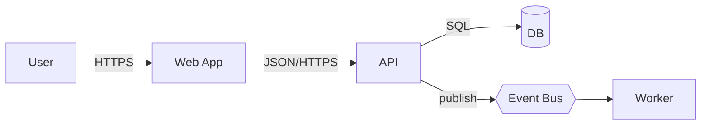

# C4 methodology — context → container → component (on-demand)

A `hs:mermaidjs` reference. Applies Simon Brown's C4 model to justify system boundaries
and contract changes, producing just-enough architecture to make an implementation
obvious and a threat model tractable. Diagrams are drawn in Mermaid (this skill's home).

## When to apply

- Any plan that adds a service, external integration, queue, or database.
- Any task with a non-empty API/data/event contract.
- Schema migrations (see the expand→migrate→contract pattern below).
- Refactors of shared symbols flagged HIGH/CRITICAL by impact analysis (`hs:gkg`).

Anti-trigger: a CSS-only change, a copy tweak, or a local refactor with no callers.

## The three levels

1. **Context** — who (human + system actors) talks to this system and why. One box = this
   system; 3–7 boxes = actors/external systems.
2. **Container** — the runtime units that ship as one deployable (app, API, worker, DB,
   cache, queue). This is the level at which contracts live; annotate protocols and trust
   boundaries.
3. **Component** — only when a container is being internally restructured. Otherwise stop
   at container; the implementer handles component decisions behind impact-analysis gates.

## Workflow

1. Context diagram (actors + this system). Draw in Mermaid.
2. Container diagram with protocols and trust boundaries.
3. Component level only when restructuring a container internally.
4. Document contract deltas — every API/data/event/UI change gets a before/after block.
5. Migration plan — schema changes are expand → migrate → contract, with a rollback path.
6. Identify trust boundaries and data classifications — every edge crossing a boundary or
   handling PII/secrets requires an explicit review flag.
7. Populate risk rows — one per contract change and one per migration, worst case +
   mitigation (see the persistent risk register).
8. **ADR trigger check** — if a trigger fires, write an ADR before plan lock. The trigger
   list is the SSOT in [`../../../../rules/adr-trigger.md`](../../../../rules/adr-trigger.md)
   — this reference points there and does not restate the list.

## Frame — Mermaid container sketch



## Contract delta (per task)

```yaml
contracts:
  api:
    - before: "POST /auth/refresh accepts {token} -> {access}"
      after:  "POST /auth/refresh accepts {refresh_token} -> {access, refresh, exp}"
      breaking: true
      migration: "dual-read for 14 days; clients >= v2.3 emit refresh_token"
  data:
    - before: "refresh_tokens(id, user_id, token, expires_at)"
      after:  "refresh_tokens(+rotated_from_id, +rotated_at)"
      breaking: false
      migration: "additive; backfill NULL"
```

## Decision table

| Change type | C4 level | Breaking? | Migration pattern | Review required? |
|---|---|---|---|---|
| Add endpoint | Container | no | — | if auth/PII |
| Change endpoint shape | Container | yes | dual-read/write, versioning | yes |
| New service | Context + Container | n/a | phased rollout | yes |
| Additive column | Container | no | expand | no |
| Rename/remove column | Container | yes | expand → migrate → contract | yes |
| New event | Container | no | consumer-side optional | if cross-team |
| Internal refactor | Component (only if big) | no | — | if impact HIGH |

## Checklist

- [ ] Context diagram present (actors + this system).
- [ ] Container diagram present with protocols and trust boundaries.
- [ ] Every contract change has before/after + breaking flag + migration path.
- [ ] Every breaking contract has a rollback path.
- [ ] PII/secret flows marked; trust-boundary edges flagged for review.
- [ ] Non-functional guardrails (latency, availability) are testable.
- [ ] Each contract change emits a risk row.
- [ ] An ADR is written for every triggered change (see `adr-trigger.md`).

## Anti-patterns

- Component-level diagrams in the plan — the implementer owns that level.
- A breaking contract without a migration window — it breaks consumers silently.
- A missing rollback path — a plan that cannot be undone cannot be shipped.
- No trust-boundary annotation — a security regression slips through the review gate.

Adapted from `docs/product/_refs/frankcode-src/planner-executor/methodology/planner/architecture-c4.md`;
the impact-graph vendor reference is mapped to `hs:gkg` and the applied-migrations
off-limits path is dropped. Diagrams use this skill's Mermaid path.
