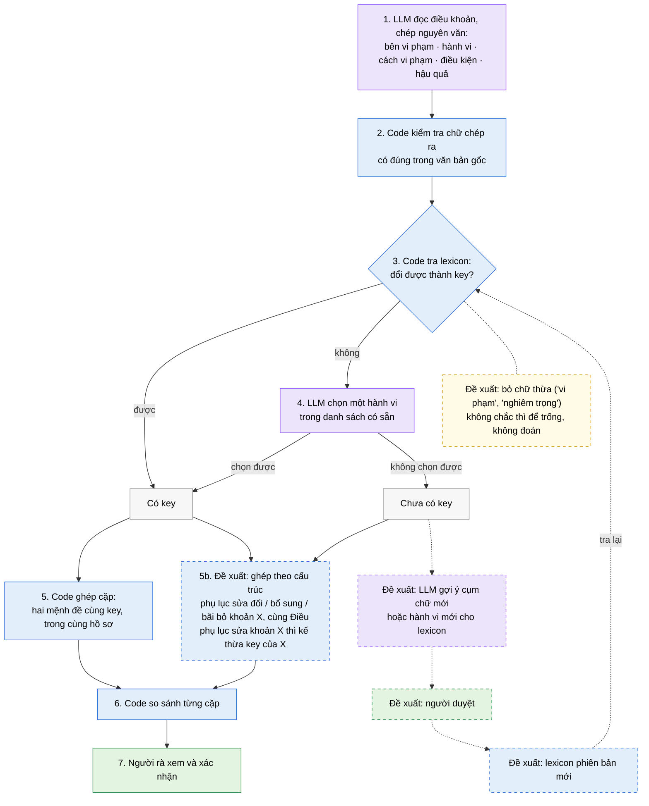
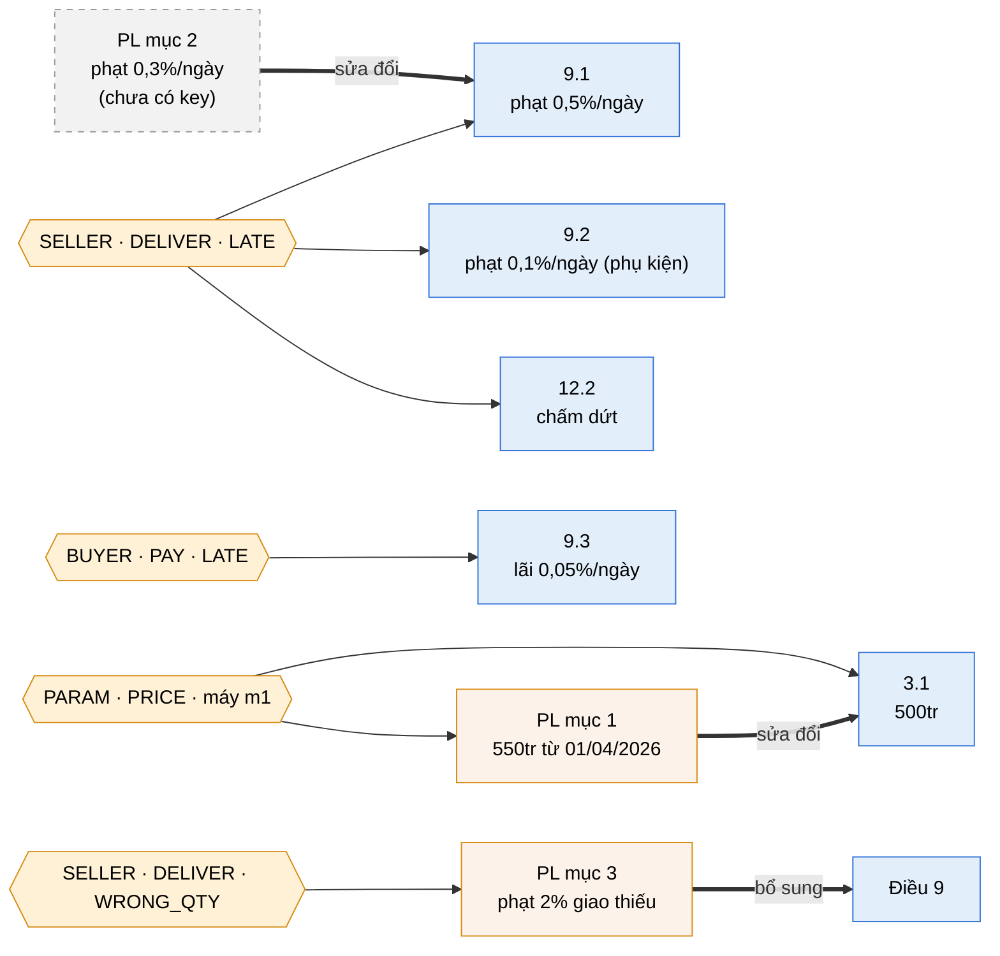

# AI2 v2 — Luồng chính so sánh điều khoản theo key

## Luồng chính

🟪 LLM làm · 🟦 Code làm · 🟩 Người làm · Khung nét đứt = **đề xuất**, chưa làm



## Mô tả

1. **LLM đọc** từng điều khoản và chép nguyên văn 5 thông tin của mỗi ý "vi phạm → hậu quả": bên vi phạm, hành vi, cách vi phạm, điều kiện, hậu quả.
2. **Code kiểm tra** chữ LLM chép ra có thật trong văn bản không. Không có thì bỏ.
3. **Code tra lexicon** (danh sách cụm chữ → mã) để đổi ba thông tin đầu thành **key**, ví dụ `(SELLER, DELIVER, LATE)` = Bên Bán · giao hàng · chậm.
4. Nếu lexicon không có cụm đó, **LLM chọn một hành vi trong danh sách có sẵn**. Không chọn được thì mệnh đề để "chưa có key", nhưng vẫn hiển thị cho người rà.
5. **Code ghép cặp** các mệnh đề cùng key trong cùng một hồ sơ. Bước 5b (đề xuất, chưa làm): ghép thêm theo cấu trúc, gồm phụ lục sửa đổi / bổ sung / bãi bỏ khoản X và các khoản cùng Điều.
6. **Code so sánh** điều kiện và hậu quả của từng cặp, rồi xếp loại: khác giá trị / bậc thang / cộng dồn / không so được.
7. **Người rà** xem hai đoạn trích dẫn và xác nhận.

**Đề xuất cho mệnh đề chưa có key (chưa làm):**
- **Thiếu cách viết** (ví dụ "đưa phương tiện đến nhận hàng" = cung cấp dịch vụ vận chuyển): LLM gợi ý thêm cụm này vào lexicon → người duyệt → lexicon phiên bản mới. Lần sau, câu này khớp ngay ở bước 3.
- **Thiếu hành vi** (ví dụ "để mất mát, hư hỏng tài sản"): đội phát triển thêm một hành vi mới vào danh sách, vì việc này làm đổi bộ key.
- Trong lúc chờ, mệnh đề chưa có key vẫn được so nhờ bước 5b (ghép theo cấu trúc).

## LLM dùng ở đâu

Chỉ 2 bước; mọi bước khác là code.

- **Bước 1:** đọc điều khoản và chép nguyên văn 5 thông tin.
- **Bước 4:** khi code không tra được, chọn một hành vi trong danh sách có sẵn.
- **Đề xuất (chưa làm):** gợi ý cụm chữ hoặc hành vi mới cho lexicon. Phải có người duyệt mới được dùng.

LLM không tự tạo key và không so sánh.

## Ví dụ: một hợp đồng và một phụ lục

**Thân hợp đồng mua bán thiết bị** (Bên A = Bên Mua, Bên B = Bên Bán)

| Điều | Khoản | Nội dung |
|---|---|---|
| Điều 3. Giá | 3.1 | Đơn giá máy M1 là 500.000.000 đồng/chiếc. |
| Điều 9. Phạt vi phạm | 9.1 | Bên B giao hàng chậm quá 10 ngày thì chịu phạt 0,5% giá trị hợp đồng mỗi ngày. |
| | 9.2 | Chậm giao phần phụ kiện bị phạt 0,1% giá trị phụ kiện chậm giao mỗi ngày. |
| | 9.3 | Bên A chậm thanh toán thì chịu lãi 0,05%/ngày trên số tiền chậm trả. |
| Điều 12. Chấm dứt | 12.2 | Nếu việc bàn giao thiết bị bị trễ trên 30 ngày, Bên A có quyền đơn phương chấm dứt hợp đồng. |

**Phụ lục 01**

| Mục | Nội dung |
|---|---|
| 1 | Sửa đổi khoản 3.1: đơn giá máy M1 là 550.000.000 đồng/chiếc kể từ ngày 01/04/2026. |
| 2 | Sửa đổi khoản 9.1: mức phạt chậm giao là 0,3% giá trị hợp đồng mỗi ngày. |
| 3 | Bổ sung khoản 9.4: Bên B giao thiếu hàng thì chịu phạt 2% giá trị phần hàng thiếu. |

### 1. Cây cấu trúc (bước dựng ngữ cảnh; phần này AI2 v1 đã có)

```text
Hồ sơ
├── Thân hợp đồng
│   ├── Điều 3. Giá
│   │   └── 3.1
│   ├── Điều 9. Phạt vi phạm
│   │   ├── 9.1
│   │   ├── 9.2
│   │   └── 9.3
│   └── Điều 12. Chấm dứt
│       └── 12.2
└── Phụ lục 01
    ├── Mục 1 ──sửa đổi──▶ 3.1
    ├── Mục 2 ──sửa đổi──▶ 9.1
    └── Mục 3 ──bổ sung──▶ Điều 9 (khoản 9.4 mới)
```

### 2. Key của từng mệnh đề (đã chạy thật bằng code thử nghiệm)

| Khoản | Mệnh đề | Key |
|---|---|---|
| 3.1 | đơn giá M1 = 500tr | `(PARAM, PRICE, máy m1)` |
| 9.1 | chậm > 10 ngày → phạt 0,5%/ngày | `(SELLER, DELIVER, LATE)` |
| 9.2 | chậm giao phụ kiện → phạt 0,1%/ngày | `(SELLER, DELIVER, LATE)`; câu không nêu bên, dùng bên mặc định |
| 9.3 | chậm thanh toán → lãi 0,05%/ngày | `(BUYER, PAY, LATE)` |
| 12.2 | trễ > 30 ngày → chấm dứt | `(SELLER, DELIVER, LATE)`; viết khác 9.1 nhưng cùng key |
| PL mục 1 | đơn giá M1 = 550tr từ 01/04/2026 | `(PARAM, PRICE, máy m1)` |
| PL mục 2 | phạt 0,3%/ngày | **chưa có key** (câu không nêu ai, làm gì) |
| PL mục 3 | giao thiếu → phạt 2% | `(SELLER, DELIVER, WRONG_QTY)` |

`SELLER` = Bên Bán · `BUYER` = Bên Mua · `DELIVER` = giao hàng · `PAY` = thanh toán · `LATE` = chậm · `WRONG_QTY` = sai số lượng · `PRICE` = đơn giá

### 3. Graph



### 4. Các cặp được ghép và kết quả

| Cặp | Ghép nhờ | Kết quả hiện tại (code thử nghiệm) | Kết quả sau khi làm đề xuất |
|---|---|---|---|
| 9.1 ↔ 12.2 | cùng key | **Bậc thang:** phạt khi chậm > 10 ngày, chấm dứt khi trễ > 30 ngày | Giữ nguyên |
| 9.1 ↔ 9.2 | cùng key, cùng Điều 9 | Không so được (cơ sở tính khác: giá trị hợp đồng vs giá trị phụ kiện) | **Chung – riêng:** 9.2 chỉ áp cho phụ kiện |
| 3.1 ↔ PL mục 1 | cùng key, sửa đổi | Được gom cùng key, nhưng chưa so giá trị tham số | **Khác giá trị:** 500tr → 550tr từ 01/04/2026 |
| 9.1 ↔ PL mục 2 | sửa đổi | **Không được ghép** (phụ lục không có key) | **Khác giá trị:** 0,5% → 0,3%/ngày |
| PL mục 3 ↔ Điều 9 | bổ sung | Không được ghép | **Điều khoản mới:** phạt giao thiếu 2% |
| 9.1 ↔ 9.3 | cùng Điều 9 | Không được ghép (khác key) | Được ghép nhưng xếp **khác việc**, không làm phiền người rà |

**Ví dụ này cho thấy:**
- Chỉ ghép theo key thì mất cặp quan trọng nhất, **9.1 ↔ PL mục 2**: phụ lục sửa mức phạt nhưng không có key.
- Ghép theo cấu trúc (sửa đổi / bổ sung / cùng Điều) bắt được các cặp này mà **không cần key**.
- Key vẫn cần cho cặp ở xa và viết khác nhau như **9.1 ↔ 12.2**.

## Vấn đề thực tế quan trọng nhất

Đo trên mẫu hợp đồng thật (lần thử mới nhất: 31 mệnh đề):

1. **Chưa đến một nửa mệnh đề ra key đúng** (14/31). Nguyên nhân: lexicon chưa có cách viết ("để mất mát, hư hỏng tài sản"); ô "cách vi phạm" chứa chữ thừa ("vi phạm nghĩa vụ") nên key bị thiếu; code đoán sai khi không chắc (quét cả câu, bắt chữ "giao" ở vế khác).
   - *Đề xuất:* thiếu cách viết → vòng bổ sung lexicon có người duyệt; chữ thừa → bỏ các từ như "vi phạm", "nghiêm trọng", "cố tình" trước khi tra; đoán sai → chỉ tìm trong vế của chính mệnh đề, không chắc thì để trống.
2. **Phụ lục sửa đổi chưa được ghép với khoản bị sửa.** Chạy thử với ví dụ trên: PL 01.2 không có key nên không được so với 9.1. Đây lại là loại thay đổi người rà cần thấy nhất (dữ liệu thật đã thử chưa có phụ lục nào).
   - *Đề xuất:* dùng cạnh "sửa đổi" đã có trong AI2 v1 để ghép thẳng phụ lục với khoản 9.1; chọn mệnh đề cùng loại hậu quả trong 9.1 và kế thừa key của nó.
3. **Ghép được quá ít cặp trong một hợp đồng:** 2/16, vì hiện chỉ ghép theo key.
   - *Đề xuất:* ghép thêm theo cấu trúc (bước 5b): phụ lục sửa đổi / bổ sung / bãi bỏ khoản X, và các khoản cùng một Điều. Mệnh đề chưa có key vẫn được so.

Tất cả các đề xuất trên đều **chưa làm**. Đề xuất cho vấn đề 1 (trừ vòng lexicon), 2 và 3 không cần gọi LLM; chỉ vòng bổ sung lexicon cần LLM và người duyệt.
