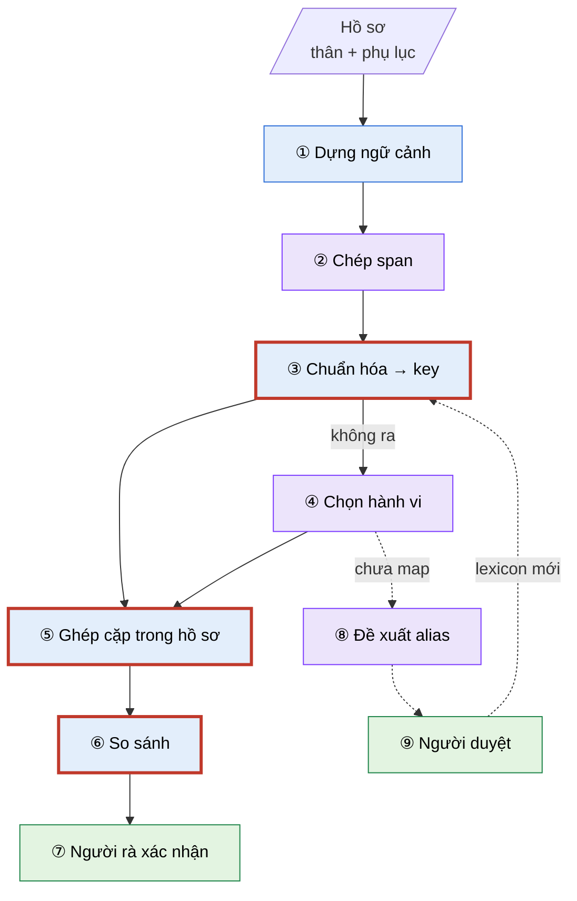
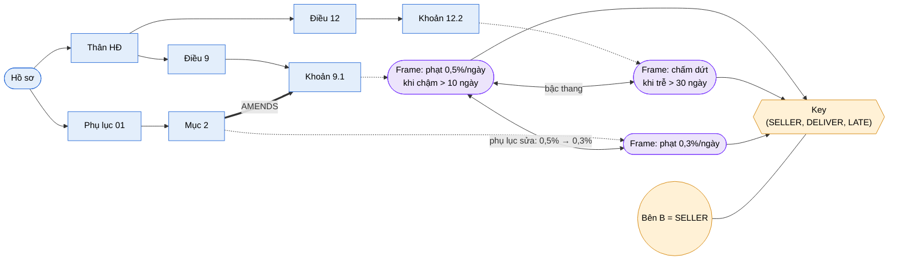

# AI2 clause key graph — luồng chính, chỗ dùng LLM và vấn đề

Chi tiết: [`docs/ai2/AI2-16-clause-key-graph-v2.vi.md`](../../docs/ai2/AI2-16-clause-key-graph-v2.vi.md) · Trạng thái: đề xuất, critique **BLOCKED**

## 1. Luồng chính

Màu: 🟪 **LLM** · 🟦 **Code (tất định)** · 🟩 **Người** · viền đỏ = bước đang có vấn đề blocker.

| Bước | Làm gì |
|---|---|
| ① | Cây Điều/khoản, bảng các bên (Bên B = Bên Bán), loại hợp đồng, quan hệ "Phụ lục sửa Điều 9.1" |
| ② | Chép nguyên văn: bên, hành vi, cách vi phạm, điều kiện, hậu quả; code kiểm chữ có trong câu thật |
| ③ | Tra lexicon → từ lõi → tham chiếu → định nghĩa: `'Bên B' + 'giao hàng' + 'chậm'` → `(SELLER, DELIVER, LATE)` |
| ④ | Code không ra thì LLM chọn trong danh sách đóng; không hợp thì để "chưa map" (vẫn hiển thị) |
| ⑤ | Chỉ trong một hồ sơ: cùng key · có tham chiếu/phụ lục sửa · cùng Điều |
| ⑥ | Điều kiện, loại và giá trị hậu quả, phạm vi → khác giá trị / bậc thang / cộng dồn / chung–riêng |
| ⑦ | Xem hai trích dẫn; dòng độ phủ "đã so X/Y" |
| ⑧–⑨ | Cụm chưa map → LLM gợi ý → kiểm tự động → người duyệt → lexicon version mới → chạy lại |

## 2. Dựng graph

Graph được dựng **dần qua các bước ①–⑥**, mỗi hồ sơ một graph. Ví dụ: thân hợp đồng có Điều 9 (9.1 phạt chậm giao) và Điều 12 (12.2 chấm dứt), cùng Phụ lục 01 sửa khoản 9.1.

### Nút và cạnh

| Loại | Gồm | Bước tạo |
|---|---|---|
| **Nút cấu trúc** 🟦 | Hồ sơ, thân/phụ lục, Điều, khoản (đã có trong `reasoning/relations.py`) | ① |
| **Cạnh cấu trúc** | `PARENT_OF` (cha–con), `REFERENCES` ("tại Điều 5"), `AMENDS` ("sửa đổi khoản 9.1") | ① |
| **Nút frame** 🟪 | Mỗi mệnh đề chế tài hoặc tham số, kèm span và trích dẫn; nối vào khoản chứa nó bằng `HAS_FRAME` | ② |
| **Nút key** 🟧 | `(bên, hành vi, cách vi phạm)` hoặc `(PARAM, tham số, đối tượng)`; frame nối vào key bằng `ABOUT` | ③ (frame chưa map: không có cạnh `ABOUT`) |
| **Nút bên** | Vai trò từ bảng các bên ("Bên B" = `SELLER`) | ① |
| **Cạnh so sánh** | Nối hai frame, mang kết quả (`bậc thang`, `khác giá trị`, `phụ lục sửa`…) và hai trích dẫn | ⑥ |

### Ghép cặp ⑤ = truy vấn trên graph

| Nguồn cặp | Truy vấn | Ví dụ |
|---|---|---|
| Cùng key | hai frame cùng nối vào một nút key | F1 ~ F2 (Điều 9 và Điều 12, viết khác nhau) |
| Tham chiếu / phụ lục sửa | frame của hai khoản nối nhau bằng `AMENDS` hoặc `REFERENCES` | F1 ~ F3 (phụ lục sửa 9.1), **bắt được cả khi F3 chưa map** |
| Cùng Điều | frame của hai khoản có cùng cha | 9.1 ~ 9.2 |

Chỉ truy vấn **trong một hồ sơ**, không ghép xuyên hồ sơ. Graph được lưu dưới dạng bảng nút và bảng cạnh trong schema `ai2` của Postgres (D-A3), pin theo `lexicon_version` và `tenant_profile_version`. Đổi lexicon thì dựng lại các cạnh `ABOUT`, rồi chạy lại ⑤ và ⑥.

## 3. LLM được dùng ở đâu

Chỉ **3 chỗ**. Mọi bước còn lại là code tất định.

| # | Bước | LLM làm gì | LLM **không** được làm | Kiểm soát |
|---|---|---|---|---|
| ② | Chép span | Đọc một khoản, chép nguyên văn các ô | Diễn giải, thêm chữ, tự đặt key | Code kiểm span có trong câu, không có thì bỏ |
| ④ | Chọn hành vi | Khi code không chuẩn hóa được: chọn **một** hành vi trong danh sách có định nghĩa, hoặc `NONE` | Bịa tên hành vi mới | Hỏi 2 lần, chỉ nhận khi trùng và thuộc danh sách |
| ⑧ | Đề xuất alias | Gợi ý cụm chữ chưa map nên gắn với hành vi nào | Tự thêm vào lexicon | Kiểm tự động + người duyệt (⑨) + version |

**Vì sao không để LLM làm nhiều hơn:** nếu LLM tự đặt key, cùng một ý có thể ra hai tên khác nhau (`CHẬM_GIAO_HÀNG` và `GIAO_HÀNG_TRỄ`), nên không gom được, kết quả đổi giữa các lần chạy, và không đo được.

Số lần gọi LLM cho một hồ sơ: khoảng 1 lần mỗi khoản (②) + 2 lần cho mỗi cụm chưa map (④) `[ASSUMED]`, chưa đo trên hồ sơ thật.

## 4. Vấn đề đang gặp theo từng bước

| Bước | Vấn đề | Mức |
|---|---|---|
| ② | LLM đặt chữ sai ô (hậu quả vào ô hành vi, số vào ô qualifier); kết quả đổi theo model (lệch ~9 điểm) | major |
| ③ | "Không chắc" vẫn thành key xác định qua 4 đường (quét cả câu, bên mặc định, lật bị động sai, alias quá ngắn); 5/19 key sai trên dữ liệu thật | **blocker** C-02 |
| ④ | Đúng 3/8; LLM chọn mục "gần đúng" thay vì trả `NONE` | major |
| ⑤ | Spike chưa ghép theo hồ sơ (ghép cả hợp đồng khác nhau); recall thật trong hồ sơ chỉ **12,5%** | **blocker** C-03 |
| ⑥ | Hai giá trị không đọc được bị báo "trùng" → người rà bỏ qua; "ngày làm việc" bị coi bằng "ngày" | **blocker** C-01, C-05 |
| ⑥ | Chưa đo phần tham số và phụ lục (giá, timeline) trên dữ liệu thật | **blocker** C-04 |
| ⑦ | Chưa có dòng độ phủ; frame `?` không vào đâu | major |
| ⑧–⑨ | Chưa có người giữ vai trò biên tập lexicon; chưa thử với người dùng thật | major |

**Bước tiếp theo:** sửa ③ và ⑥ trong spike (không cần LLM, chạy lại trên span đã lưu), rồi đo toàn luồng trên 3–5 hồ sơ thật.
